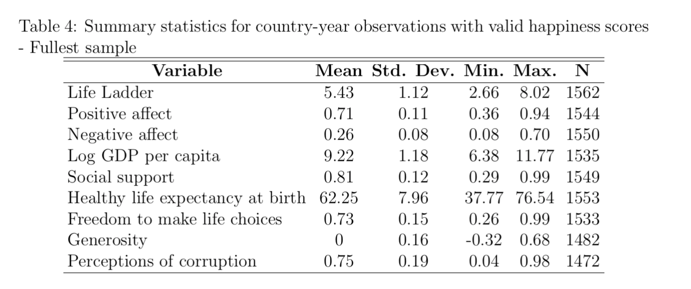

## Analyzing the World Happiness Data

### Computing summary statistics


In this exercise, we will use pandas to compute some summary statistics of the WHR data.

We'll repeat here some of the code developed in a previous exercise so that we can continue to work with data in this exercise.  Execute the following code cells to load and reconfigure the data.


```python
import pandas as pd
import seaborn as sns
import matplotlib.pyplot as plt
%matplotlib inline
pd.options.display.float_format = '{:.2f}'.format
```


```python
dfraw = pd.read_excel('WHR2018Chapter2OnlineData.xls', sheet_name='Table2.1')
```


```python
cols_to_include = ['country', 'year', 'Life Ladder', 
                   'Positive affect','Negative affect',
                   'Log GDP per capita', 'Social support',
                   'Healthy life expectancy at birth', 
                   'Freedom to make life choices', 
                   'Generosity', 'Perceptions of corruption']

df = dfraw[cols_to_include]

```

### Step 1

In the code cell below, call the ```info``` method on the dataframe ```df``` to remind yourself what the dataframe consists of.


```python
df.info()
```

    <class 'pandas.core.frame.DataFrame'>
    RangeIndex: 1562 entries, 0 to 1561
    Data columns (total 11 columns):
     #   Column                            Non-Null Count  Dtype  
    ---  ------                            --------------  -----  
     0   country                           1562 non-null   object 
     1   year                              1562 non-null   int64  
     2   Life Ladder                       1562 non-null   float64
     3   Positive affect                   1544 non-null   float64
     4   Negative affect                   1550 non-null   float64
     5   Log GDP per capita                1535 non-null   float64
     6   Social support                    1549 non-null   float64
     7   Healthy life expectancy at birth  1553 non-null   float64
     8   Freedom to make life choices      1533 non-null   float64
     9   Generosity                        1482 non-null   float64
     10  Perceptions of corruption         1472 non-null   float64
    dtypes: float64(9), int64(1), object(1)
    memory usage: 134.4+ KB


### Step 2

The ```describe``` method on a dataframe provides a useful statistical summary of the data.  In the code cell below, enter an expression to call this method and examine the output.


```python
df.describe()
```


<div>
<style scoped>
    .dataframe tbody tr th:only-of-type {
        vertical-align: middle;
    }

    .dataframe tbody tr th {
        vertical-align: top;
    }

    .dataframe thead th {
        text-align: right;
    }
</style>
<table border="1" class="dataframe">
  <thead>
    <tr style="text-align: right;">
      <th></th>
      <th>year</th>
      <th>Life Ladder</th>
      <th>Positive affect</th>
      <th>Negative affect</th>
      <th>Log GDP per capita</th>
      <th>Social support</th>
      <th>Healthy life expectancy at birth</th>
      <th>Freedom to make life choices</th>
      <th>Generosity</th>
      <th>Perceptions of corruption</th>
    </tr>
  </thead>
  <tbody>
    <tr>
      <th>count</th>
      <td>1562.00</td>
      <td>1562.00</td>
      <td>1544.00</td>
      <td>1550.00</td>
      <td>1535.00</td>
      <td>1549.00</td>
      <td>1553.00</td>
      <td>1533.00</td>
      <td>1482.00</td>
      <td>1472.00</td>
    </tr>
    <tr>
      <th>mean</th>
      <td>2011.82</td>
      <td>5.43</td>
      <td>0.71</td>
      <td>0.26</td>
      <td>9.22</td>
      <td>0.81</td>
      <td>62.25</td>
      <td>0.73</td>
      <td>0.00</td>
      <td>0.75</td>
    </tr>
    <tr>
      <th>std</th>
      <td>3.42</td>
      <td>1.12</td>
      <td>0.11</td>
      <td>0.08</td>
      <td>1.18</td>
      <td>0.12</td>
      <td>7.96</td>
      <td>0.15</td>
      <td>0.16</td>
      <td>0.19</td>
    </tr>
    <tr>
      <th>min</th>
      <td>2005.00</td>
      <td>2.66</td>
      <td>0.36</td>
      <td>0.08</td>
      <td>6.38</td>
      <td>0.29</td>
      <td>37.77</td>
      <td>0.26</td>
      <td>-0.32</td>
      <td>0.04</td>
    </tr>
    <tr>
      <th>25%</th>
      <td>2009.00</td>
      <td>4.61</td>
      <td>0.62</td>
      <td>0.20</td>
      <td>8.31</td>
      <td>0.75</td>
      <td>57.30</td>
      <td>0.63</td>
      <td>-0.11</td>
      <td>0.70</td>
    </tr>
    <tr>
      <th>50%</th>
      <td>2012.00</td>
      <td>5.33</td>
      <td>0.72</td>
      <td>0.25</td>
      <td>9.40</td>
      <td>0.83</td>
      <td>63.80</td>
      <td>0.75</td>
      <td>-0.02</td>
      <td>0.81</td>
    </tr>
    <tr>
      <th>75%</th>
      <td>2015.00</td>
      <td>6.27</td>
      <td>0.80</td>
      <td>0.31</td>
      <td>10.19</td>
      <td>0.90</td>
      <td>68.10</td>
      <td>0.84</td>
      <td>0.09</td>
      <td>0.88</td>
    </tr>
    <tr>
      <th>max</th>
      <td>2017.00</td>
      <td>8.02</td>
      <td>0.94</td>
      <td>0.70</td>
      <td>11.77</td>
      <td>0.99</td>
      <td>76.54</td>
      <td>0.99</td>
      <td>0.68</td>
      <td>0.98</td>
    </tr>
  </tbody>
</table>
</div>


Let's look at the output above and compare it with data presented in Table 4 of [Appendix 1 of the 2018 World Happiness Report](https://s3.amazonaws.com/happiness-report/2018/Appendix1ofChapter2.pdf).  Here is Table 4 reproduced from that report:



Imagine that you were asked to produce a table of this form from the underlying data.  Let's see what is required to get our summary data to resemble Table 4.

### Step 3.

The first thing you'll notice is that the orientation of the table is different from that produced by ```df.describe```, with data categories listed in rows and summary statistics in the columns.  One easy way to reorient the data produced by ```describe``` is to look at the <i>transpose</i> of the data, that is, what one gets when rows and columns are swapped.

The transpose of a dataframe can be accessed simply by accessing the attribute named ```.T``` on the dataframe.  Note that ```T``` is not a method that is called, so it is not followed by parentheses.  Instead, it is a static attribute of the dataframe that can be accessed through that name.

In the code cell below, write and evaluate an expression to return the transpose of the summary description provided by ```describe```.


```python
df.T
```


<div>
<style scoped>
    .dataframe tbody tr th:only-of-type {
        vertical-align: middle;
    }

    .dataframe tbody tr th {
        vertical-align: top;
    }

    .dataframe thead th {
        text-align: right;
    }
</style>
<table border="1" class="dataframe">
  <thead>
    <tr style="text-align: right;">
      <th></th>
      <th>0</th>
      <th>1</th>
      <th>2</th>
      <th>3</th>
      <th>4</th>
      <th>5</th>
      <th>6</th>
      <th>7</th>
      <th>8</th>
      <th>9</th>
      <th>...</th>
      <th>1552</th>
      <th>1553</th>
      <th>1554</th>
      <th>1555</th>
      <th>1556</th>
      <th>1557</th>
      <th>1558</th>
      <th>1559</th>
      <th>1560</th>
      <th>1561</th>
    </tr>
  </thead>
  <tbody>
    <tr>
      <th>country</th>
      <td>Afghanistan</td>
      <td>Afghanistan</td>
      <td>Afghanistan</td>
      <td>Afghanistan</td>
      <td>Afghanistan</td>
      <td>Afghanistan</td>
      <td>Afghanistan</td>
      <td>Afghanistan</td>
      <td>Afghanistan</td>
      <td>Afghanistan</td>
      <td>...</td>
      <td>Zimbabwe</td>
      <td>Zimbabwe</td>
      <td>Zimbabwe</td>
      <td>Zimbabwe</td>
      <td>Zimbabwe</td>
      <td>Zimbabwe</td>
      <td>Zimbabwe</td>
      <td>Zimbabwe</td>
      <td>Zimbabwe</td>
      <td>Zimbabwe</td>
    </tr>
    <tr>
      <th>year</th>
      <td>2008</td>
      <td>2009</td>
      <td>2010</td>
      <td>2011</td>
      <td>2012</td>
      <td>2013</td>
      <td>2014</td>
      <td>2015</td>
      <td>2016</td>
      <td>2017</td>
      <td>...</td>
      <td>2008</td>
      <td>2009</td>
      <td>2010</td>
      <td>2011</td>
      <td>2012</td>
      <td>2013</td>
      <td>2014</td>
      <td>2015</td>
      <td>2016</td>
      <td>2017</td>
    </tr>
    <tr>
      <th>Life Ladder</th>
      <td>3.72</td>
      <td>4.40</td>
      <td>4.76</td>
      <td>3.83</td>
      <td>3.78</td>
      <td>3.57</td>
      <td>3.13</td>
      <td>3.98</td>
      <td>4.22</td>
      <td>2.66</td>
      <td>...</td>
      <td>3.17</td>
      <td>4.06</td>
      <td>4.68</td>
      <td>4.85</td>
      <td>4.96</td>
      <td>4.69</td>
      <td>4.18</td>
      <td>3.70</td>
      <td>3.74</td>
      <td>3.64</td>
    </tr>
    <tr>
      <th>Positive affect</th>
      <td>0.52</td>
      <td>0.58</td>
      <td>0.62</td>
      <td>0.61</td>
      <td>0.71</td>
      <td>0.62</td>
      <td>0.53</td>
      <td>0.55</td>
      <td>0.56</td>
      <td>0.50</td>
      <td>...</td>
      <td>0.63</td>
      <td>0.74</td>
      <td>0.75</td>
      <td>0.78</td>
      <td>0.67</td>
      <td>0.71</td>
      <td>0.73</td>
      <td>0.72</td>
      <td>0.74</td>
      <td>0.81</td>
    </tr>
    <tr>
      <th>Negative affect</th>
      <td>0.26</td>
      <td>0.24</td>
      <td>0.28</td>
      <td>0.27</td>
      <td>0.27</td>
      <td>0.27</td>
      <td>0.37</td>
      <td>0.34</td>
      <td>0.35</td>
      <td>0.37</td>
      <td>...</td>
      <td>0.25</td>
      <td>0.22</td>
      <td>0.12</td>
      <td>0.21</td>
      <td>0.18</td>
      <td>0.18</td>
      <td>0.24</td>
      <td>0.18</td>
      <td>0.21</td>
      <td>0.22</td>
    </tr>
    <tr>
      <th>Log GDP per capita</th>
      <td>7.17</td>
      <td>7.33</td>
      <td>7.39</td>
      <td>7.42</td>
      <td>7.52</td>
      <td>7.50</td>
      <td>7.48</td>
      <td>7.47</td>
      <td>7.46</td>
      <td>7.46</td>
      <td>...</td>
      <td>7.10</td>
      <td>7.20</td>
      <td>7.30</td>
      <td>7.42</td>
      <td>7.53</td>
      <td>7.57</td>
      <td>7.56</td>
      <td>7.56</td>
      <td>7.54</td>
      <td>7.54</td>
    </tr>
    <tr>
      <th>Social support</th>
      <td>0.45</td>
      <td>0.55</td>
      <td>0.54</td>
      <td>0.52</td>
      <td>0.52</td>
      <td>0.48</td>
      <td>0.53</td>
      <td>0.53</td>
      <td>0.56</td>
      <td>0.49</td>
      <td>...</td>
      <td>0.84</td>
      <td>0.81</td>
      <td>0.86</td>
      <td>0.86</td>
      <td>0.90</td>
      <td>0.80</td>
      <td>0.77</td>
      <td>0.74</td>
      <td>0.77</td>
      <td>0.75</td>
    </tr>
    <tr>
      <th>Healthy life expectancy at birth</th>
      <td>49.21</td>
      <td>49.62</td>
      <td>50.01</td>
      <td>50.37</td>
      <td>50.71</td>
      <td>51.04</td>
      <td>51.37</td>
      <td>51.69</td>
      <td>52.02</td>
      <td>52.34</td>
      <td>...</td>
      <td>41.61</td>
      <td>43.11</td>
      <td>44.67</td>
      <td>46.21</td>
      <td>47.65</td>
      <td>48.95</td>
      <td>50.05</td>
      <td>50.93</td>
      <td>51.80</td>
      <td>52.67</td>
    </tr>
    <tr>
      <th>Freedom to make life choices</th>
      <td>0.72</td>
      <td>0.68</td>
      <td>0.60</td>
      <td>0.50</td>
      <td>0.53</td>
      <td>0.58</td>
      <td>0.51</td>
      <td>0.39</td>
      <td>0.52</td>
      <td>0.43</td>
      <td>...</td>
      <td>0.34</td>
      <td>0.41</td>
      <td>0.66</td>
      <td>0.63</td>
      <td>0.47</td>
      <td>0.58</td>
      <td>0.64</td>
      <td>0.67</td>
      <td>0.73</td>
      <td>0.75</td>
    </tr>
    <tr>
      <th>Generosity</th>
      <td>0.18</td>
      <td>0.20</td>
      <td>0.14</td>
      <td>0.18</td>
      <td>0.25</td>
      <td>0.07</td>
      <td>0.12</td>
      <td>0.09</td>
      <td>0.06</td>
      <td>-0.11</td>
      <td>...</td>
      <td>-0.06</td>
      <td>-0.05</td>
      <td>-0.06</td>
      <td>-0.06</td>
      <td>-0.07</td>
      <td>-0.08</td>
      <td>-0.05</td>
      <td>-0.09</td>
      <td>-0.07</td>
      <td>-0.07</td>
    </tr>
    <tr>
      <th>Perceptions of corruption</th>
      <td>0.88</td>
      <td>0.85</td>
      <td>0.71</td>
      <td>0.73</td>
      <td>0.78</td>
      <td>0.82</td>
      <td>0.87</td>
      <td>0.88</td>
      <td>0.79</td>
      <td>0.95</td>
      <td>...</td>
      <td>0.96</td>
      <td>0.93</td>
      <td>0.83</td>
      <td>0.83</td>
      <td>0.86</td>
      <td>0.83</td>
      <td>0.82</td>
      <td>0.81</td>
      <td>0.72</td>
      <td>0.75</td>
    </tr>
  </tbody>
</table>
<p>11 rows × 1562 columns</p>
</div>


### Step 4.

This is looking a bit more like Table 4, although there is some extraneous information that we can remove using the ```drop``` method on a dataframe.  We can also rename the quantities produced by ```df.describe``` to make them appear as in Table 4.

Examine the documentation for ```df.drop``` and note that one can specify one or more labels to drop, as well as an axis along which to drop.  For our summary data, we'd like to drop the row labeled 'year' and the columns labeled by '25%', '50%', and '75%', since they are not included in Table 4.

In the code cell below, we define a dictionary for the column renaming, and a list defining the column order for the finished table.  In the empty code cell below that, write and evaluate code to do the following:

* From the transposed summary data, drop the row labeled 'year'.
* From the resulting dataframe, drop the columns labeled '25%', '50%', and '75%'.
* Using the `rename` method on the resulting dataframe, rename the columns according to the mapping defined in ```column_renaming```. 
* Select out the columns in the list defined by ```column_order``` and assign the resulting dataframe to the variable ```dfsummary```.

Note that you can either do each step above sequentially, storing the result in a variable, or you can string each call one right after the other in one line (by chaining a series of method calls).

Once you've assigned the result to ```dfsummary```, examine that new dataframe and compare it to Table 4.


```python
column_renaming = {'count': 'N', 'mean': 'Mean', 'std': 'Std. Dev.', 'min': 'Min.', 'max': 'Max.'}
column_order = ['Mean', 'Std. Dev.', 'Min.', 'Max.', 'N']
```


```python
dfsummary = df.drop(columns = ['year'])
dfsummary = dfsummary.describe().T.drop(columns = ['25%','50%', '75%']).rename(columns = column_renaming)
dfsummary = dfsummary[column_order]
dfsummary

```


<div>
<style scoped>
    .dataframe tbody tr th:only-of-type {
        vertical-align: middle;
    }

    .dataframe tbody tr th {
        vertical-align: top;
    }

    .dataframe thead th {
        text-align: right;
    }
</style>
<table border="1" class="dataframe">
  <thead>
    <tr style="text-align: right;">
      <th></th>
      <th>Mean</th>
      <th>Std. Dev.</th>
      <th>Min.</th>
      <th>Max.</th>
      <th>N</th>
    </tr>
  </thead>
  <tbody>
    <tr>
      <th>Life Ladder</th>
      <td>5.43</td>
      <td>1.12</td>
      <td>2.66</td>
      <td>8.02</td>
      <td>1562.00</td>
    </tr>
    <tr>
      <th>Positive affect</th>
      <td>0.71</td>
      <td>0.11</td>
      <td>0.36</td>
      <td>0.94</td>
      <td>1544.00</td>
    </tr>
    <tr>
      <th>Negative affect</th>
      <td>0.26</td>
      <td>0.08</td>
      <td>0.08</td>
      <td>0.70</td>
      <td>1550.00</td>
    </tr>
    <tr>
      <th>Log GDP per capita</th>
      <td>9.22</td>
      <td>1.18</td>
      <td>6.38</td>
      <td>11.77</td>
      <td>1535.00</td>
    </tr>
    <tr>
      <th>Social support</th>
      <td>0.81</td>
      <td>0.12</td>
      <td>0.29</td>
      <td>0.99</td>
      <td>1549.00</td>
    </tr>
    <tr>
      <th>Healthy life expectancy at birth</th>
      <td>62.25</td>
      <td>7.96</td>
      <td>37.77</td>
      <td>76.54</td>
      <td>1553.00</td>
    </tr>
    <tr>
      <th>Freedom to make life choices</th>
      <td>0.73</td>
      <td>0.15</td>
      <td>0.26</td>
      <td>0.99</td>
      <td>1533.00</td>
    </tr>
    <tr>
      <th>Generosity</th>
      <td>0.00</td>
      <td>0.16</td>
      <td>-0.32</td>
      <td>0.68</td>
      <td>1482.00</td>
    </tr>
    <tr>
      <th>Perceptions of corruption</th>
      <td>0.75</td>
      <td>0.19</td>
      <td>0.04</td>
      <td>0.98</td>
      <td>1472.00</td>
    </tr>
  </tbody>
</table>
</div>


### Step 5

You may notice that one lingering point of discrepancy between the summary dataframe you've produced and the WHR Table 4 is that the number of counts ```N``` in Table 4 is reported as an integer, whereas it is a floating point number in our summary dataframe.  We can alter the type of that column with the code in the following cell.  Execute the code cell below.


```python
dfsummary['N'] = dfsummary['N'].astype(int)
dfsummary
```


<div>
<style scoped>
    .dataframe tbody tr th:only-of-type {
        vertical-align: middle;
    }

    .dataframe tbody tr th {
        vertical-align: top;
    }

    .dataframe thead th {
        text-align: right;
    }
</style>
<table border="1" class="dataframe">
  <thead>
    <tr style="text-align: right;">
      <th></th>
      <th>Mean</th>
      <th>Std. Dev.</th>
      <th>Min.</th>
      <th>Max.</th>
      <th>N</th>
    </tr>
  </thead>
  <tbody>
    <tr>
      <th>Life Ladder</th>
      <td>5.43</td>
      <td>1.12</td>
      <td>2.66</td>
      <td>8.02</td>
      <td>1562</td>
    </tr>
    <tr>
      <th>Positive affect</th>
      <td>0.71</td>
      <td>0.11</td>
      <td>0.36</td>
      <td>0.94</td>
      <td>1544</td>
    </tr>
    <tr>
      <th>Negative affect</th>
      <td>0.26</td>
      <td>0.08</td>
      <td>0.08</td>
      <td>0.70</td>
      <td>1550</td>
    </tr>
    <tr>
      <th>Log GDP per capita</th>
      <td>9.22</td>
      <td>1.18</td>
      <td>6.38</td>
      <td>11.77</td>
      <td>1535</td>
    </tr>
    <tr>
      <th>Social support</th>
      <td>0.81</td>
      <td>0.12</td>
      <td>0.29</td>
      <td>0.99</td>
      <td>1549</td>
    </tr>
    <tr>
      <th>Healthy life expectancy at birth</th>
      <td>62.25</td>
      <td>7.96</td>
      <td>37.77</td>
      <td>76.54</td>
      <td>1553</td>
    </tr>
    <tr>
      <th>Freedom to make life choices</th>
      <td>0.73</td>
      <td>0.15</td>
      <td>0.26</td>
      <td>0.99</td>
      <td>1533</td>
    </tr>
    <tr>
      <th>Generosity</th>
      <td>0.00</td>
      <td>0.16</td>
      <td>-0.32</td>
      <td>0.68</td>
      <td>1482</td>
    </tr>
    <tr>
      <th>Perceptions of corruption</th>
      <td>0.75</td>
      <td>0.19</td>
      <td>0.04</td>
      <td>0.98</td>
      <td>1472</td>
    </tr>
  </tbody>
</table>
</div>


### Step 6

Appendix 1 of the WHR presents several tables similar to Table 4, for different intervals of years, in order to examine how the summary statistics have changed over time.  In the code cells above, we executed several steps to produce a summary dataframe of the desired form.  Since we will want to produce different summary tables for different intervals of years, we can bundle up all the data processing steps above into a new <b>function</b> that we can call, by passing in different dataframes as input to the function.  If we wanted to get summary statistics for just a subset of years, we could create a new dataframe by filtering the full dataset just for those years, and then pass the new dataframe to our function.

In the code cell below, write a <b>function</b> named ```produce_summary_table``` that takes a dataframe as an argument (i.e `produce_summary_table(df)`) and returns a <b>summary dataframe</b>. 

* The input <b>dataframe</b> should be derived from the WHR2018Chapter2OnlineData.xls Table 2.1 data we've been working with.

* The returned <b>summary dataframe</b> should be in the same form as Table 4 above. 

* In writing this function, you should include all of the steps we took in Steps 4 and 5 above to achieve the final result; you will also want to pull in the code above that defines the variables ```column_renaming``` and ```column_order```. 


## Graded Cell

This cell is worth 100% of the grade for this assignment.


```python
def produce_summary_table(df):
    cols_to_include = ['country', 'year', 'Life Ladder', 
                   'Positive affect','Negative affect',
                   'Log GDP per capita', 'Social support',
                   'Healthy life expectancy at birth', 
                   'Freedom to make life choices', 
                   'Generosity', 'Perceptions of corruption']

    df = df[cols_to_include]

    column_renaming = {'count': 'N', 'mean': 'Mean', 'std': 'Std. Dev.', 'min': 'Min.', 'max': 'Max.'}
    column_order = ['Mean', 'Std. Dev.', 'Min.', 'Max.', 'N']
    dfsummary = df.drop(columns = ['year'])
    dfsummary = dfsummary.describe().T.drop(columns = ['25%','50%', '75%']).rename(columns = column_renaming)
    dfsummary = dfsummary[column_order]
    dfsummary['N'] = dfsummary['N'].astype(int)
    return dfsummary
    
```

## Self-Check

Run the cell below to test the correctness of your code above before submitting for grading.


```python
# Run this self-test cell to check your code; do not add code or delete code in this cell
from jn import testFunction

try:
    print(testFunction(produce_summary_table))    
except Exception as e:
    print("Error!\n" + str(e))
    
```

    Correct!


Test your new function with the dataframe ```df``` that we were working with above.  It should return the summary table that mirrors Table 4.


```python
produce_summary_table(df)
```


<div>
<style scoped>
    .dataframe tbody tr th:only-of-type {
        vertical-align: middle;
    }

    .dataframe tbody tr th {
        vertical-align: top;
    }

    .dataframe thead th {
        text-align: right;
    }
</style>
<table border="1" class="dataframe">
  <thead>
    <tr style="text-align: right;">
      <th></th>
      <th>Mean</th>
      <th>Std. Dev.</th>
      <th>Min.</th>
      <th>Max.</th>
      <th>N</th>
    </tr>
  </thead>
  <tbody>
    <tr>
      <th>Life Ladder</th>
      <td>5.43</td>
      <td>1.12</td>
      <td>2.66</td>
      <td>8.02</td>
      <td>1562</td>
    </tr>
    <tr>
      <th>Positive affect</th>
      <td>0.71</td>
      <td>0.11</td>
      <td>0.36</td>
      <td>0.94</td>
      <td>1544</td>
    </tr>
    <tr>
      <th>Negative affect</th>
      <td>0.26</td>
      <td>0.08</td>
      <td>0.08</td>
      <td>0.70</td>
      <td>1550</td>
    </tr>
    <tr>
      <th>Log GDP per capita</th>
      <td>9.22</td>
      <td>1.18</td>
      <td>6.38</td>
      <td>11.77</td>
      <td>1535</td>
    </tr>
    <tr>
      <th>Social support</th>
      <td>0.81</td>
      <td>0.12</td>
      <td>0.29</td>
      <td>0.99</td>
      <td>1549</td>
    </tr>
    <tr>
      <th>Healthy life expectancy at birth</th>
      <td>62.25</td>
      <td>7.96</td>
      <td>37.77</td>
      <td>76.54</td>
      <td>1553</td>
    </tr>
    <tr>
      <th>Freedom to make life choices</th>
      <td>0.73</td>
      <td>0.15</td>
      <td>0.26</td>
      <td>0.99</td>
      <td>1533</td>
    </tr>
    <tr>
      <th>Generosity</th>
      <td>0.00</td>
      <td>0.16</td>
      <td>-0.32</td>
      <td>0.68</td>
      <td>1482</td>
    </tr>
    <tr>
      <th>Perceptions of corruption</th>
      <td>0.75</td>
      <td>0.19</td>
      <td>0.04</td>
      <td>0.98</td>
      <td>1472</td>
    </tr>
  </tbody>
</table>
</div>


Appendix 1 of the WHR presents similar summary tables for different groups of years:

* 2005-2007: Table 5
* 2008-2010: Table 6
* 2015-2017: Table 7

To reproduce each of these tables, you will want to create a new dataframe that filters out the subset of the data in the specified years, as was discussed above in Step 6.  There are various ways to do this extraction.  One way is to use the ```isin``` method on a dataframe or series, which can be used to select those entries which are contained within a specified set of values.  For example, the expression ```df[df.year.isin(range(1900,2000))]``` would return a new dataframe containing all rows of ```df``` that had a year between 1900 and 1999.

### Step 7

In the empty code cell below, do the following:<br>
Create three new dataframes for each of the year ranges associated with Tables 5, 6, and 7, by extracting the appropriate set of years. Using the function you wrote above, create a summary table for each dataframe (your function takes a dataframe as input). Assign the resulting summary tables to the names ```dfsummary0507```, ```dfsummary0810```, and ```dfsummary1517```. 
<br>
<br>
The remaining three code cells below are populated with the table names ```dfsummary0507```, ```dfsummary0810```, and ```dfsummary1517```. Once you have created these summary tables as outlined above, execute these cells to compare your tables with the corresponding tables in WHR Appendix 1. 


```python
dfsummary0507 = produce_summary_table(df.loc[(df['year'] >= 2005) & (df['year'] <= 2007)])
dfsummary0810 = produce_summary_table(df.loc[(df['year'] >= 2008) & (df['year'] <= 2010)])
dfsummary1517 = produce_summary_table(df.loc[(df['year'] >= 2015) & (df['year'] <= 2017)])
```


```python
dfsummary0507
```


<div>
<style scoped>
    .dataframe tbody tr th:only-of-type {
        vertical-align: middle;
    }

    .dataframe tbody tr th {
        vertical-align: top;
    }

    .dataframe thead th {
        text-align: right;
    }
</style>
<table border="1" class="dataframe">
  <thead>
    <tr style="text-align: right;">
      <th></th>
      <th>Mean</th>
      <th>Std. Dev.</th>
      <th>Min.</th>
      <th>Max.</th>
      <th>N</th>
    </tr>
  </thead>
  <tbody>
    <tr>
      <th>Life Ladder</th>
      <td>5.46</td>
      <td>1.12</td>
      <td>3.20</td>
      <td>8.02</td>
      <td>218</td>
    </tr>
    <tr>
      <th>Positive affect</th>
      <td>0.72</td>
      <td>0.10</td>
      <td>0.43</td>
      <td>0.89</td>
      <td>216</td>
    </tr>
    <tr>
      <th>Negative affect</th>
      <td>0.25</td>
      <td>0.07</td>
      <td>0.09</td>
      <td>0.47</td>
      <td>216</td>
    </tr>
    <tr>
      <th>Log GDP per capita</th>
      <td>9.13</td>
      <td>1.19</td>
      <td>6.49</td>
      <td>11.47</td>
      <td>218</td>
    </tr>
    <tr>
      <th>Social support</th>
      <td>0.83</td>
      <td>0.11</td>
      <td>0.44</td>
      <td>0.98</td>
      <td>216</td>
    </tr>
    <tr>
      <th>Healthy life expectancy at birth</th>
      <td>60.85</td>
      <td>8.67</td>
      <td>37.77</td>
      <td>74.28</td>
      <td>218</td>
    </tr>
    <tr>
      <th>Freedom to make life choices</th>
      <td>0.72</td>
      <td>0.15</td>
      <td>0.28</td>
      <td>0.97</td>
      <td>212</td>
    </tr>
    <tr>
      <th>Generosity</th>
      <td>0.01</td>
      <td>0.17</td>
      <td>-0.32</td>
      <td>0.49</td>
      <td>184</td>
    </tr>
    <tr>
      <th>Perceptions of corruption</th>
      <td>0.77</td>
      <td>0.18</td>
      <td>0.06</td>
      <td>0.98</td>
      <td>206</td>
    </tr>
  </tbody>
</table>
</div>


```python
dfsummary0810
```


<div>
<style scoped>
    .dataframe tbody tr th:only-of-type {
        vertical-align: middle;
    }

    .dataframe tbody tr th {
        vertical-align: top;
    }

    .dataframe thead th {
        text-align: right;
    }
</style>
<table border="1" class="dataframe">
  <thead>
    <tr style="text-align: right;">
      <th></th>
      <th>Mean</th>
      <th>Std. Dev.</th>
      <th>Min.</th>
      <th>Max.</th>
      <th>N</th>
    </tr>
  </thead>
  <tbody>
    <tr>
      <th>Life Ladder</th>
      <td>5.46</td>
      <td>1.11</td>
      <td>2.81</td>
      <td>7.97</td>
      <td>348</td>
    </tr>
    <tr>
      <th>Positive affect</th>
      <td>0.71</td>
      <td>0.11</td>
      <td>0.36</td>
      <td>0.90</td>
      <td>341</td>
    </tr>
    <tr>
      <th>Negative affect</th>
      <td>0.24</td>
      <td>0.08</td>
      <td>0.08</td>
      <td>0.47</td>
      <td>343</td>
    </tr>
    <tr>
      <th>Log GDP per capita</th>
      <td>9.16</td>
      <td>1.20</td>
      <td>6.38</td>
      <td>11.74</td>
      <td>346</td>
    </tr>
    <tr>
      <th>Social support</th>
      <td>0.81</td>
      <td>0.12</td>
      <td>0.29</td>
      <td>0.98</td>
      <td>343</td>
    </tr>
    <tr>
      <th>Healthy life expectancy at birth</th>
      <td>61.65</td>
      <td>8.17</td>
      <td>39.35</td>
      <td>74.83</td>
      <td>346</td>
    </tr>
    <tr>
      <th>Freedom to make life choices</th>
      <td>0.70</td>
      <td>0.15</td>
      <td>0.26</td>
      <td>0.97</td>
      <td>341</td>
    </tr>
    <tr>
      <th>Generosity</th>
      <td>0.00</td>
      <td>0.16</td>
      <td>-0.32</td>
      <td>0.53</td>
      <td>345</td>
    </tr>
    <tr>
      <th>Perceptions of corruption</th>
      <td>0.76</td>
      <td>0.19</td>
      <td>0.04</td>
      <td>0.98</td>
      <td>337</td>
    </tr>
  </tbody>
</table>
</div>


```python
dfsummary1517
```


<div>
<style scoped>
    .dataframe tbody tr th:only-of-type {
        vertical-align: middle;
    }

    .dataframe tbody tr th {
        vertical-align: top;
    }

    .dataframe thead th {
        text-align: right;
    }
</style>
<table border="1" class="dataframe">
  <thead>
    <tr style="text-align: right;">
      <th></th>
      <th>Mean</th>
      <th>Std. Dev.</th>
      <th>Min.</th>
      <th>Max.</th>
      <th>N</th>
    </tr>
  </thead>
  <tbody>
    <tr>
      <th>Life Ladder</th>
      <td>5.43</td>
      <td>1.12</td>
      <td>2.66</td>
      <td>7.79</td>
      <td>426</td>
    </tr>
    <tr>
      <th>Positive affect</th>
      <td>0.71</td>
      <td>0.10</td>
      <td>0.37</td>
      <td>0.92</td>
      <td>424</td>
    </tr>
    <tr>
      <th>Negative affect</th>
      <td>0.29</td>
      <td>0.09</td>
      <td>0.10</td>
      <td>0.64</td>
      <td>424</td>
    </tr>
    <tr>
      <th>Log GDP per capita</th>
      <td>9.30</td>
      <td>1.20</td>
      <td>6.47</td>
      <td>11.69</td>
      <td>412</td>
    </tr>
    <tr>
      <th>Social support</th>
      <td>0.81</td>
      <td>0.12</td>
      <td>0.29</td>
      <td>0.99</td>
      <td>424</td>
    </tr>
    <tr>
      <th>Healthy life expectancy at birth</th>
      <td>63.17</td>
      <td>7.67</td>
      <td>43.59</td>
      <td>76.54</td>
      <td>424</td>
    </tr>
    <tr>
      <th>Freedom to make life choices</th>
      <td>0.76</td>
      <td>0.13</td>
      <td>0.30</td>
      <td>0.99</td>
      <td>420</td>
    </tr>
    <tr>
      <th>Generosity</th>
      <td>0.00</td>
      <td>0.16</td>
      <td>-0.30</td>
      <td>0.67</td>
      <td>409</td>
    </tr>
    <tr>
      <th>Perceptions of corruption</th>
      <td>0.74</td>
      <td>0.19</td>
      <td>0.05</td>
      <td>0.97</td>
      <td>393</td>
    </tr>
  </tbody>
</table>
</div>


