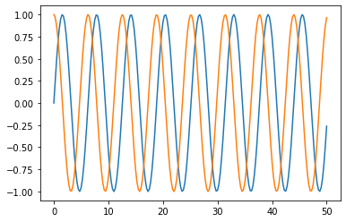
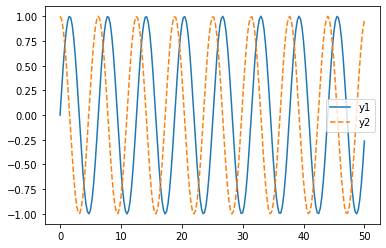
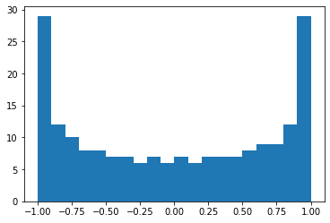

# Plotting with Matplotlib

Matplotlib is the cornerstone of many plotting activities in Python.  It is both a widely used plotting package in its own right, and serves as the basis of plotting within both Pandas and Seaborn, which offer plotting functionality more centered on Pandas DataFrames.

Matplotlib offers some different interfaces for plotting data, but the most widely used is the ```pyplot``` interface.  Because ```matplotlib.pyplot``` is a lot to type, it is conventionally shortened on import as ```plt```.  The ```plt``` module provides many different functions for plotting data, customizing plots, and annotating plots.  We'll explore some of that functionality here.

Let's first create some data that we can work with, using some of the functionality in numpy (np).  This creates three arrays, all of the same size, called ```x```, ```y1```, and ```y2```.  The data in ```x``` are a linearly increasing set of numbers from 0.0 to 50.0, and ```y1``` and ```y2``` are generated by applying two different trigonometric functions (sin and cos) to those x data.


```python
import numpy as np
x = np.linspace(0.0,50.0,201)
y1 = np.sin(x)
y2 = np.cos(x)
```

In order to use the `plt` module, and to get the resulting plots to be embedded inline in this Jupyter notebook, we need the following set of initalization steps.
Perform these two steps every time you would like to use the `plt` module.


```python
import matplotlib.pyplot as plt
%matplotlib inline
```

### Step 1.

Line plots are extremely common, where a set of data is plotted on the y-axis against another set of data on the x-axis.  

Using the ```plt.plot``` function, plot the data in ```y1``` against the data in ```x```, i.e., make a line plot where ```x``` is on the x-axis and ```y1``` is on the y-axis.

## Graded Cell

This cell is worth 40% of the grade for this assignment. <i>Note: a self-check will not accompany this assignment</i><br>
Your plot should look like this:


```python
plt.plot(x,y1)

```


    [<matplotlib.lines.Line2D at 0x7f9eeb326a90>]


### Step 2.

Matplotlib allows you to perform multiple actions on the same figure.  For example, you can plot two datasets together by issuing two separate calls to ```plt.plot```.  Make a plot similar to the one above, but now instead showing two curves: y1 vs. x, and y2 vs. x.


```python
plt.plot(x,y1)
plt.plot(x,y2)
```


    [<matplotlib.lines.Line2D at 0x7f9eedf7c828>]





### Step 3.

When you have more than one dataset in a plot, it is often useful to label them so that they can be distinguished in a legend.  

* In the code cell below, repeat the last plot above, but add additional information in each call to ```plt.plot``` to provide a label.  (```plt.plot(x,y1,label='y1')``` will provide the label 'y1' to that dataset.)
* After the two plot calls, add a call to the function ```plt.legend()``` to get the legend to show up.


```python
plt.plot(x,y1,label='y1')
plt.plot(x,y2,label='y2')
plt.legend()
```


    <matplotlib.legend.Legend at 0x7f9eeab639e8>


### Step 4.

Matplotlib allows for customization of other aspects of plotting.  If you wanted one of the curves to have a different linestyle, e.g., a dashed line instead of solid, you could add the additional optional argument to the plot call: 
```linestyle='--'```.  In the code cell below, redo the plot above, but making one of the plots with a dashed line style.

## Graded Cell

This cell is worth 30% of the grade for this assignment. <i>Note: a self-check will not accompany this assignment</i><br>
Your plot should look like this: 


```python
plt.plot(x,y1,label='y1')
plt.plot(x,y2,label='y2', linestyle='--')
plt.legend()
```


    <matplotlib.legend.Legend at 0x7f9eeaae8828>





### Scatter plots

The ```plt``` module provides other useful types of plots, such as scatter plots.  In a scatter plot, each pair of x-y data values is represented by a point in the x-y plane.  Marker size, color and shape can also be manipulated.

### Step 5.

* In the code cell below, using ```plt.scatter```, make a scatter plot of ```y2``` vs. ```y1```.  
* By default, plt plots are rectangular, being wider than they are tall.  For some data sets, it is useful to change the aspect ratio of the plot.  For example, since both ```y1``` and ```y2``` range from -1 to 1, it is useful to make their scatter plot square instead of rectangular.
* Modify your code in the cell below by inserting the following code before your scatter plot: ```plt.figure(figsize=(6,6))```.  This will make the figure size square (6x6 inches, at a default pixel density of 72dpi).  Re-execute the code cell.  The scatter plot should make out a circle, illustrating the relationship between ```y1``` and ```y2```.
* Modify your code once more to add labels to the x and y axis after the scatter plot is made, using the functions ```plt.xlabel``` and ```plt.ylabel```,  respectively. Each function accepts the label name as a string paremeter. Label the x-axis ```y1``` and the y-axis ```y2```.  Re-execute the code cell.
* You might notice some output below your code cell, maybe something that looks like ```Text(0, 0.5, 'y2')```.  This is the output returned by the last command in the cell.  If you want to suppress the output of this last command in order to leave a cleaner notebook, you can add a semicolon to the end of the line, e.g., ```plt.ylabel('y2');```
* This process of tweaking and refining a plot by modifying and re-executing a code cell until the desired output is produced is common in data science.


```python
plt.figure(figsize=(6,6))
plt.scatter(y1,y2)
plt.xlabel('y1')
plt.ylabel('y2')
```


    Text(0, 0.5, 'y2')


### Histograms

Histograms are another common form of data representation, intended to represent variation within a data set (or alternatively, to represent the distribution of the data).  A histogram puts data into "bins", and then plots the number of items in each bin, resulting in a discrete set of counts.

### Step 6.

* Use the ```plt.hist``` function to plot a histogram of the ```y1``` data set in the code cell below. 
* You might want to alter the number of bins using the ```bins``` option to ```plt.hist```, in order to change the resolution of the data binning.  Try plotting the data with ```bins=20```, and re-execute the code cell.
* You should notice that the data in ```y1``` are not uniformly distributed.  More data points are piled up near the endpoints at -1 and 1, and the number of points is lowest in the middle near y1 = 0.  This is because the data turn around at the endpoints, and their rate of change is slower near those turning points.  This is reminiscent of how the sun moves up and down across the sky over the seasons: there is a winter solstice when the sun peaks at its lowest point in the sky, and a summer solstice when it peaks at its highest point in the sky.  The word "solstice" derives from words meaning "sun" and "stopped" or "stationary", referring to the fact that the sun appears to stop in the sky near those turning points and peaks near the same spot for several days at a time, similar to what we see in our histogram.

## Graded Cell

This cell is worth 30% of the grade for this assignment. <i>Note: a self-check will not accompany this assignment</i><br>
Your plot should look like this: 


```python
plt.hist(y1, bins=20)

```


    (array([29., 12., 10.,  8.,  8.,  7.,  7.,  6.,  7.,  6.,  7.,  6.,  7.,
             7.,  7.,  8.,  9.,  9., 12., 29.]),
     array([-9.99990207e-01, -8.99995103e-01, -8.00000000e-01, -7.00004897e-01,
            -6.00009793e-01, -5.00014690e-01, -4.00019587e-01, -3.00024483e-01,
            -2.00029380e-01, -1.00034277e-01, -3.91732217e-05,  9.99559301e-02,
             1.99951033e-01,  2.99946137e-01,  3.99941240e-01,  4.99936343e-01,
             5.99931447e-01,  6.99926550e-01,  7.99921653e-01,  8.99916757e-01,
             9.99911860e-01]),
     <a list of 20 Patch objects>)




