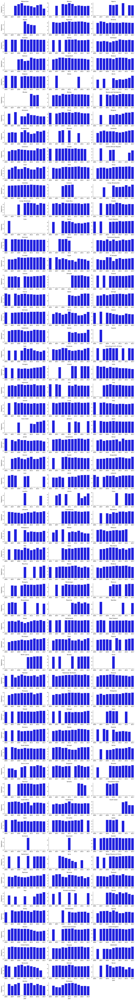
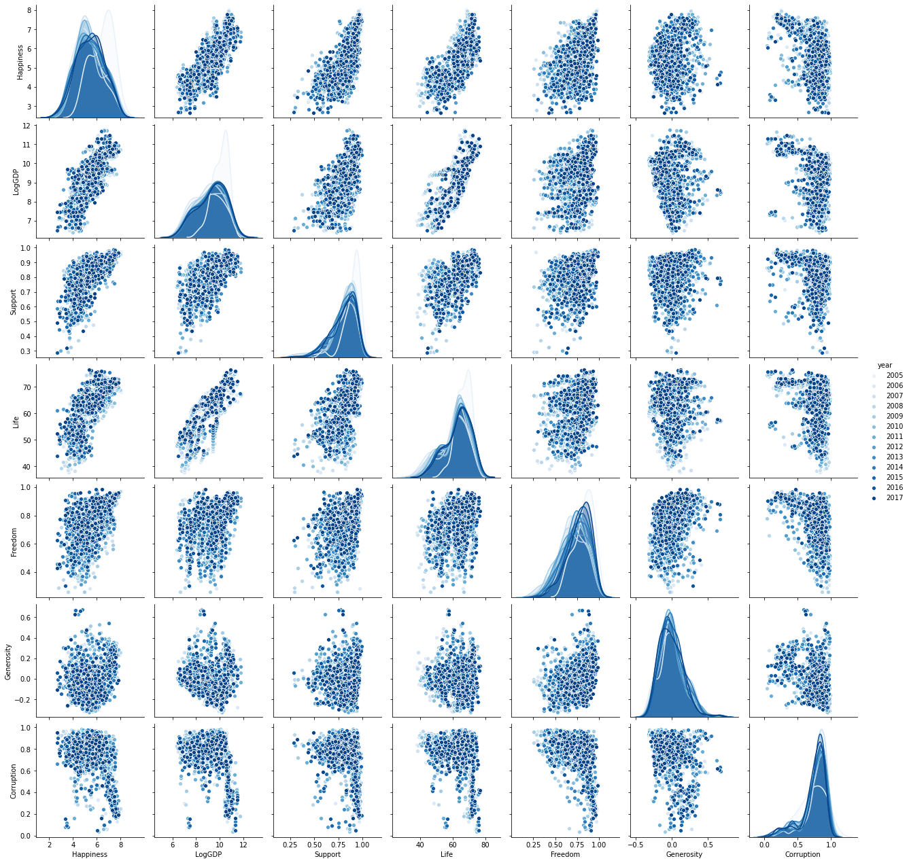
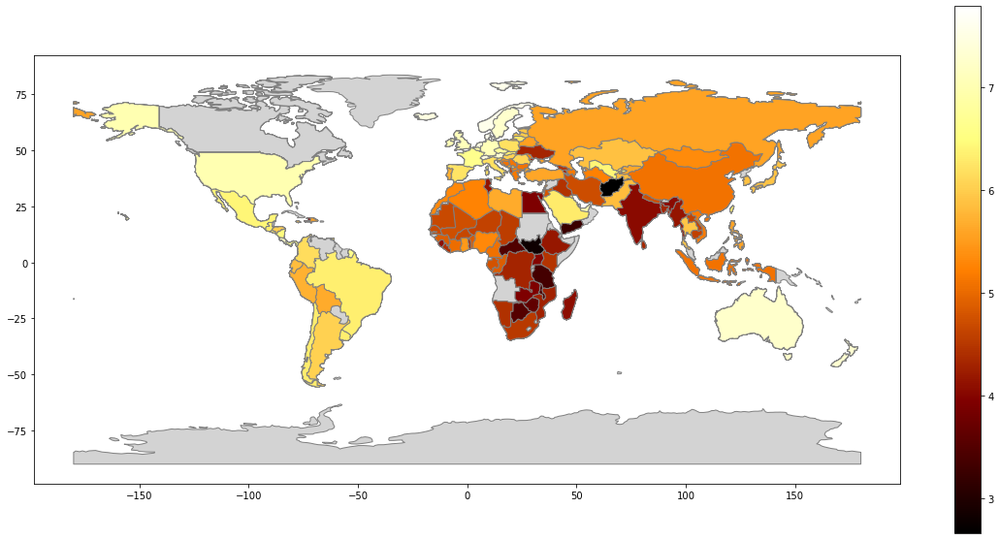
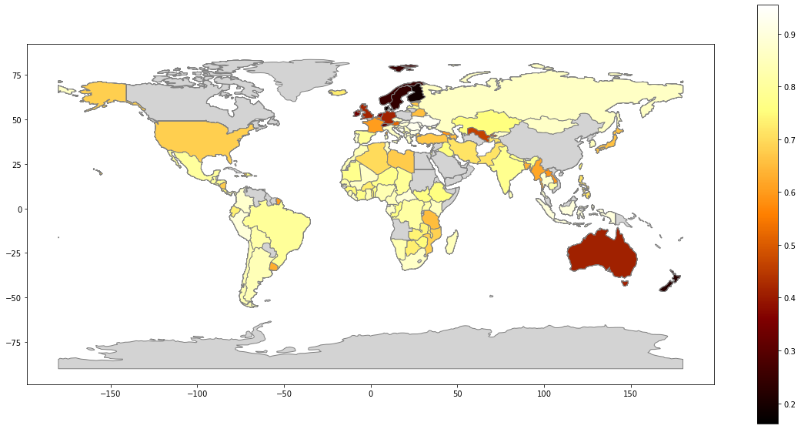
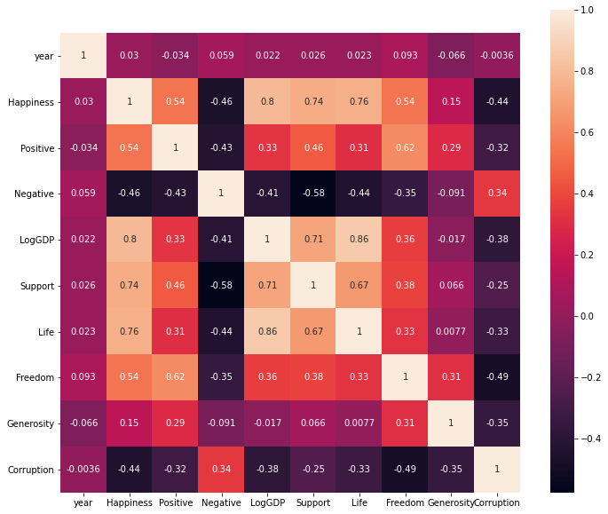
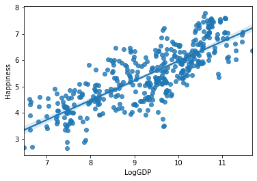
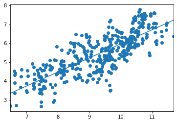
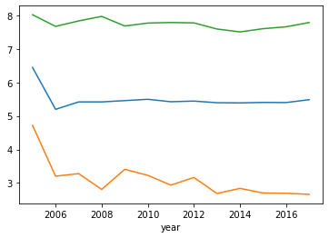
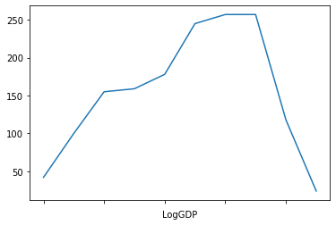

## Analyzing the World Happiness Data
### Preparing the data for analysis

In this exercise, initial data imports and preprocessing are conducted to get the data ready for further analysis. Note that the last line in the code cell below is intended to instruct pandas to display floating point numbers to 2 decimal places (.2f). This is just one of many pandas display options that can be configured, as described [here](https://pandas.pydata.org/pandas-docs/stable/user_guide/options.html).


```python
import pandas as pd
import seaborn as sns
import matplotlib.pyplot as plt
%matplotlib inline
pd.options.display.float_format = '{:.2f}'.format
```

A Pandas dataframe is created and named dfraw by reading in the data in the worksheet named "Table2.1" from the spreadsheet "WHR2018Chapter2OnlineData.xls".


```python
dfraw = pd.read_excel('WHR2018Chapter2OnlineData.xls', sheet_name='Table2.1')
```

To facilitate working with the data, it will be useful to select a subset of the data from the full dataset and to rename the columns to make them less verbose. In the code cell below, the variable cols_to_include contains a list of column names to extract.


```python
cols_to_include = ['country', 'year', 'Life Ladder', 
                   'Positive affect','Negative affect',
                   'Log GDP per capita', 'Social support',
                   'Healthy life expectancy at birth', 
                   'Freedom to make life choices', 
                   'Generosity', 'Perceptions of corruption']
```

Using the variables defined above, in the code cell below, an expression is written to create a new dataframe named df that includes the subset of data in ```cols_to_include```.


```python
df = dfraw[cols_to_include]
```

The first 4 rows of the new dataframe are examined below:


```python
df.head()
```


<div>
<style scoped>
    .dataframe tbody tr th:only-of-type {
        vertical-align: middle;
    }

    .dataframe tbody tr th {
        vertical-align: top;
    }

    .dataframe thead th {
        text-align: right;
    }
</style>
<table border="1" class="dataframe">
  <thead>
    <tr style="text-align: right;">
      <th></th>
      <th>country</th>
      <th>year</th>
      <th>Life Ladder</th>
      <th>Positive affect</th>
      <th>Negative affect</th>
      <th>Log GDP per capita</th>
      <th>Social support</th>
      <th>Healthy life expectancy at birth</th>
      <th>Freedom to make life choices</th>
      <th>Generosity</th>
      <th>Perceptions of corruption</th>
    </tr>
  </thead>
  <tbody>
    <tr>
      <th>0</th>
      <td>Afghanistan</td>
      <td>2008</td>
      <td>3.72</td>
      <td>0.52</td>
      <td>0.26</td>
      <td>7.17</td>
      <td>0.45</td>
      <td>49.21</td>
      <td>0.72</td>
      <td>0.18</td>
      <td>0.88</td>
    </tr>
    <tr>
      <th>1</th>
      <td>Afghanistan</td>
      <td>2009</td>
      <td>4.40</td>
      <td>0.58</td>
      <td>0.24</td>
      <td>7.33</td>
      <td>0.55</td>
      <td>49.62</td>
      <td>0.68</td>
      <td>0.20</td>
      <td>0.85</td>
    </tr>
    <tr>
      <th>2</th>
      <td>Afghanistan</td>
      <td>2010</td>
      <td>4.76</td>
      <td>0.62</td>
      <td>0.28</td>
      <td>7.39</td>
      <td>0.54</td>
      <td>50.01</td>
      <td>0.60</td>
      <td>0.14</td>
      <td>0.71</td>
    </tr>
    <tr>
      <th>3</th>
      <td>Afghanistan</td>
      <td>2011</td>
      <td>3.83</td>
      <td>0.61</td>
      <td>0.27</td>
      <td>7.42</td>
      <td>0.52</td>
      <td>50.37</td>
      <td>0.50</td>
      <td>0.18</td>
      <td>0.73</td>
    </tr>
    <tr>
      <th>4</th>
      <td>Afghanistan</td>
      <td>2012</td>
      <td>3.78</td>
      <td>0.71</td>
      <td>0.27</td>
      <td>7.52</td>
      <td>0.52</td>
      <td>50.71</td>
      <td>0.53</td>
      <td>0.25</td>
      <td>0.78</td>
    </tr>
  </tbody>
</table>
</div>


### Statistical Analyses on a Loaded Data Set

In the code cell below, the info method is called on the dataframe df to remind us what the dataframe consists of.


```python
df.info()
```

    <class 'pandas.core.frame.DataFrame'>
    RangeIndex: 1562 entries, 0 to 1561
    Data columns (total 11 columns):
     #   Column                            Non-Null Count  Dtype  
    ---  ------                            --------------  -----  
     0   country                           1562 non-null   object 
     1   year                              1562 non-null   int64  
     2   Life Ladder                       1562 non-null   float64
     3   Positive affect                   1544 non-null   float64
     4   Negative affect                   1550 non-null   float64
     5   Log GDP per capita                1535 non-null   float64
     6   Social support                    1549 non-null   float64
     7   Healthy life expectancy at birth  1553 non-null   float64
     8   Freedom to make life choices      1533 non-null   float64
     9   Generosity                        1482 non-null   float64
     10  Perceptions of corruption         1472 non-null   float64
    dtypes: float64(9), int64(1), object(1)
    memory usage: 134.4+ KB
    

The describe method on a dataframe provides a useful statistical summary of the data. In the code cell below, an expression is entered to call this method and examine the output.


```python
df.describe()
```


<div>
<style scoped>
    .dataframe tbody tr th:only-of-type {
        vertical-align: middle;
    }

    .dataframe tbody tr th {
        vertical-align: top;
    }

    .dataframe thead th {
        text-align: right;
    }
</style>
<table border="1" class="dataframe">
  <thead>
    <tr style="text-align: right;">
      <th></th>
      <th>year</th>
      <th>Life Ladder</th>
      <th>Positive affect</th>
      <th>Negative affect</th>
      <th>Log GDP per capita</th>
      <th>Social support</th>
      <th>Healthy life expectancy at birth</th>
      <th>Freedom to make life choices</th>
      <th>Generosity</th>
      <th>Perceptions of corruption</th>
    </tr>
  </thead>
  <tbody>
    <tr>
      <th>count</th>
      <td>1562.00</td>
      <td>1562.00</td>
      <td>1544.00</td>
      <td>1550.00</td>
      <td>1535.00</td>
      <td>1549.00</td>
      <td>1553.00</td>
      <td>1533.00</td>
      <td>1482.00</td>
      <td>1472.00</td>
    </tr>
    <tr>
      <th>mean</th>
      <td>2011.82</td>
      <td>5.43</td>
      <td>0.71</td>
      <td>0.26</td>
      <td>9.22</td>
      <td>0.81</td>
      <td>62.25</td>
      <td>0.73</td>
      <td>0.00</td>
      <td>0.75</td>
    </tr>
    <tr>
      <th>std</th>
      <td>3.42</td>
      <td>1.12</td>
      <td>0.11</td>
      <td>0.08</td>
      <td>1.18</td>
      <td>0.12</td>
      <td>7.96</td>
      <td>0.15</td>
      <td>0.16</td>
      <td>0.19</td>
    </tr>
    <tr>
      <th>min</th>
      <td>2005.00</td>
      <td>2.66</td>
      <td>0.36</td>
      <td>0.08</td>
      <td>6.38</td>
      <td>0.29</td>
      <td>37.77</td>
      <td>0.26</td>
      <td>-0.32</td>
      <td>0.04</td>
    </tr>
    <tr>
      <th>25%</th>
      <td>2009.00</td>
      <td>4.61</td>
      <td>0.62</td>
      <td>0.20</td>
      <td>8.31</td>
      <td>0.75</td>
      <td>57.30</td>
      <td>0.63</td>
      <td>-0.11</td>
      <td>0.70</td>
    </tr>
    <tr>
      <th>50%</th>
      <td>2012.00</td>
      <td>5.33</td>
      <td>0.72</td>
      <td>0.25</td>
      <td>9.40</td>
      <td>0.83</td>
      <td>63.80</td>
      <td>0.75</td>
      <td>-0.02</td>
      <td>0.81</td>
    </tr>
    <tr>
      <th>75%</th>
      <td>2015.00</td>
      <td>6.27</td>
      <td>0.80</td>
      <td>0.31</td>
      <td>10.19</td>
      <td>0.90</td>
      <td>68.10</td>
      <td>0.84</td>
      <td>0.09</td>
      <td>0.88</td>
    </tr>
    <tr>
      <th>max</th>
      <td>2017.00</td>
      <td>8.02</td>
      <td>0.94</td>
      <td>0.70</td>
      <td>11.77</td>
      <td>0.99</td>
      <td>76.54</td>
      <td>0.99</td>
      <td>0.68</td>
      <td>0.98</td>
    </tr>
  </tbody>
</table>
</div>


The output above can be compared to the data presented in Table 4 of [Appendix 1 of the 2018 World Happiness Report](https://s3.amazonaws.com/happiness-report/2018/Appendix1ofChapter2.pdf) and adjusted to more closely reflect that format.

The orientation of the table is different from that produced by ```df.describe```, with data categories listed in rows and summary statistics in the columns. One easy way to reorient the data produced by ```describe``` is to look at the transpose of the data, that is, what one gets when rows and columns are swapped.

The transpose of a dataframe can be accessed simply by accessing the attribute named ```.T``` on the dataframe. Note that ```T``` is not a method that is called, so it is not followed by parentheses. Instead, it is a static attribute of the dataframe that can be accessed through that name.

In the code cell below, an expression is written to return the transpose of the summary description provided by ```describe```.


```python
df.T
```


<div>
<style scoped>
    .dataframe tbody tr th:only-of-type {
        vertical-align: middle;
    }

    .dataframe tbody tr th {
        vertical-align: top;
    }

    .dataframe thead th {
        text-align: right;
    }
</style>
<table border="1" class="dataframe">
  <thead>
    <tr style="text-align: right;">
      <th></th>
      <th>0</th>
      <th>1</th>
      <th>2</th>
      <th>3</th>
      <th>4</th>
      <th>5</th>
      <th>6</th>
      <th>7</th>
      <th>8</th>
      <th>9</th>
      <th>...</th>
      <th>1552</th>
      <th>1553</th>
      <th>1554</th>
      <th>1555</th>
      <th>1556</th>
      <th>1557</th>
      <th>1558</th>
      <th>1559</th>
      <th>1560</th>
      <th>1561</th>
    </tr>
  </thead>
  <tbody>
    <tr>
      <th>country</th>
      <td>Afghanistan</td>
      <td>Afghanistan</td>
      <td>Afghanistan</td>
      <td>Afghanistan</td>
      <td>Afghanistan</td>
      <td>Afghanistan</td>
      <td>Afghanistan</td>
      <td>Afghanistan</td>
      <td>Afghanistan</td>
      <td>Afghanistan</td>
      <td>...</td>
      <td>Zimbabwe</td>
      <td>Zimbabwe</td>
      <td>Zimbabwe</td>
      <td>Zimbabwe</td>
      <td>Zimbabwe</td>
      <td>Zimbabwe</td>
      <td>Zimbabwe</td>
      <td>Zimbabwe</td>
      <td>Zimbabwe</td>
      <td>Zimbabwe</td>
    </tr>
    <tr>
      <th>year</th>
      <td>2008</td>
      <td>2009</td>
      <td>2010</td>
      <td>2011</td>
      <td>2012</td>
      <td>2013</td>
      <td>2014</td>
      <td>2015</td>
      <td>2016</td>
      <td>2017</td>
      <td>...</td>
      <td>2008</td>
      <td>2009</td>
      <td>2010</td>
      <td>2011</td>
      <td>2012</td>
      <td>2013</td>
      <td>2014</td>
      <td>2015</td>
      <td>2016</td>
      <td>2017</td>
    </tr>
    <tr>
      <th>Life Ladder</th>
      <td>3.72</td>
      <td>4.40</td>
      <td>4.76</td>
      <td>3.83</td>
      <td>3.78</td>
      <td>3.57</td>
      <td>3.13</td>
      <td>3.98</td>
      <td>4.22</td>
      <td>2.66</td>
      <td>...</td>
      <td>3.17</td>
      <td>4.06</td>
      <td>4.68</td>
      <td>4.85</td>
      <td>4.96</td>
      <td>4.69</td>
      <td>4.18</td>
      <td>3.70</td>
      <td>3.74</td>
      <td>3.64</td>
    </tr>
    <tr>
      <th>Positive affect</th>
      <td>0.52</td>
      <td>0.58</td>
      <td>0.62</td>
      <td>0.61</td>
      <td>0.71</td>
      <td>0.62</td>
      <td>0.53</td>
      <td>0.55</td>
      <td>0.56</td>
      <td>0.50</td>
      <td>...</td>
      <td>0.63</td>
      <td>0.74</td>
      <td>0.75</td>
      <td>0.78</td>
      <td>0.67</td>
      <td>0.71</td>
      <td>0.73</td>
      <td>0.72</td>
      <td>0.74</td>
      <td>0.81</td>
    </tr>
    <tr>
      <th>Negative affect</th>
      <td>0.26</td>
      <td>0.24</td>
      <td>0.28</td>
      <td>0.27</td>
      <td>0.27</td>
      <td>0.27</td>
      <td>0.37</td>
      <td>0.34</td>
      <td>0.35</td>
      <td>0.37</td>
      <td>...</td>
      <td>0.25</td>
      <td>0.22</td>
      <td>0.12</td>
      <td>0.21</td>
      <td>0.18</td>
      <td>0.18</td>
      <td>0.24</td>
      <td>0.18</td>
      <td>0.21</td>
      <td>0.22</td>
    </tr>
    <tr>
      <th>Log GDP per capita</th>
      <td>7.17</td>
      <td>7.33</td>
      <td>7.39</td>
      <td>7.42</td>
      <td>7.52</td>
      <td>7.50</td>
      <td>7.48</td>
      <td>7.47</td>
      <td>7.46</td>
      <td>7.46</td>
      <td>...</td>
      <td>7.10</td>
      <td>7.20</td>
      <td>7.30</td>
      <td>7.42</td>
      <td>7.53</td>
      <td>7.57</td>
      <td>7.56</td>
      <td>7.56</td>
      <td>7.54</td>
      <td>7.54</td>
    </tr>
    <tr>
      <th>Social support</th>
      <td>0.45</td>
      <td>0.55</td>
      <td>0.54</td>
      <td>0.52</td>
      <td>0.52</td>
      <td>0.48</td>
      <td>0.53</td>
      <td>0.53</td>
      <td>0.56</td>
      <td>0.49</td>
      <td>...</td>
      <td>0.84</td>
      <td>0.81</td>
      <td>0.86</td>
      <td>0.86</td>
      <td>0.90</td>
      <td>0.80</td>
      <td>0.77</td>
      <td>0.74</td>
      <td>0.77</td>
      <td>0.75</td>
    </tr>
    <tr>
      <th>Healthy life expectancy at birth</th>
      <td>49.21</td>
      <td>49.62</td>
      <td>50.01</td>
      <td>50.37</td>
      <td>50.71</td>
      <td>51.04</td>
      <td>51.37</td>
      <td>51.69</td>
      <td>52.02</td>
      <td>52.34</td>
      <td>...</td>
      <td>41.61</td>
      <td>43.11</td>
      <td>44.67</td>
      <td>46.21</td>
      <td>47.65</td>
      <td>48.95</td>
      <td>50.05</td>
      <td>50.93</td>
      <td>51.80</td>
      <td>52.67</td>
    </tr>
    <tr>
      <th>Freedom to make life choices</th>
      <td>0.72</td>
      <td>0.68</td>
      <td>0.60</td>
      <td>0.50</td>
      <td>0.53</td>
      <td>0.58</td>
      <td>0.51</td>
      <td>0.39</td>
      <td>0.52</td>
      <td>0.43</td>
      <td>...</td>
      <td>0.34</td>
      <td>0.41</td>
      <td>0.66</td>
      <td>0.63</td>
      <td>0.47</td>
      <td>0.58</td>
      <td>0.64</td>
      <td>0.67</td>
      <td>0.73</td>
      <td>0.75</td>
    </tr>
    <tr>
      <th>Generosity</th>
      <td>0.18</td>
      <td>0.20</td>
      <td>0.14</td>
      <td>0.18</td>
      <td>0.25</td>
      <td>0.07</td>
      <td>0.12</td>
      <td>0.09</td>
      <td>0.06</td>
      <td>-0.11</td>
      <td>...</td>
      <td>-0.06</td>
      <td>-0.05</td>
      <td>-0.06</td>
      <td>-0.06</td>
      <td>-0.07</td>
      <td>-0.08</td>
      <td>-0.05</td>
      <td>-0.09</td>
      <td>-0.07</td>
      <td>-0.07</td>
    </tr>
    <tr>
      <th>Perceptions of corruption</th>
      <td>0.88</td>
      <td>0.85</td>
      <td>0.71</td>
      <td>0.73</td>
      <td>0.78</td>
      <td>0.82</td>
      <td>0.87</td>
      <td>0.88</td>
      <td>0.79</td>
      <td>0.95</td>
      <td>...</td>
      <td>0.96</td>
      <td>0.93</td>
      <td>0.83</td>
      <td>0.83</td>
      <td>0.86</td>
      <td>0.83</td>
      <td>0.82</td>
      <td>0.81</td>
      <td>0.72</td>
      <td>0.75</td>
    </tr>
  </tbody>
</table>
<p>11 rows × 1562 columns</p>
</div>


This is looking a bit more like Table 4, although there is some extraneous information that we can remove using the ```drop``` method on a dataframe. We can also rename the quantities produced by ```df.describe``` to make them appear as in Table 4.

The documentation for ```df.drop``` shows that one can specify one or more labels to drop, as well as an axis along which to drop. For our summary data, we would like to drop the row labeled 'year' and the columns labeled by '25%', '50%', and '75%', since they are not included in Table 4.

In the code cell below, we define a dictionary for the column renaming, and a list defining the column order for the finished table. In the empty code cell below that, we write and evaluate code to do the following:

- From the transposed summary data, drop the row labeled 'year'.
- From the resulting dataframe, drop the columns labeled '25%', '50%', and '75%'.
- Using the ```rename``` method on the resulting dataframe, rename the columns according to the mapping defined in ```column_renaming```.
- Select out the columns in the list defined by ```column_order``` and assign the resulting dataframe to the variable ```dfsummary```.

Each step above is done sequentially, storing the result in a variable.

Once the result is assigned to ```dfsummary```, the new dataframe is examined and compared to Table 4.


```python
column_renaming = {'count': 'N', 'mean': 'Mean', 'std': 'Std. Dev.', 'min': 'Min.', 'max': 'Max.'}
column_order = ['Mean', 'Std. Dev.', 'Min.', 'Max.', 'N']
```


```python
dfsummary = df.drop(columns = ['year'])
dfsummary = dfsummary.describe().T.drop(columns = ['25%','50%', '75%']).rename(columns = column_renaming)
dfsummary = dfsummary[column_order]
dfsummary
```


<div>
<style scoped>
    .dataframe tbody tr th:only-of-type {
        vertical-align: middle;
    }

    .dataframe tbody tr th {
        vertical-align: top;
    }

    .dataframe thead th {
        text-align: right;
    }
</style>
<table border="1" class="dataframe">
  <thead>
    <tr style="text-align: right;">
      <th></th>
      <th>Mean</th>
      <th>Std. Dev.</th>
      <th>Min.</th>
      <th>Max.</th>
      <th>N</th>
    </tr>
  </thead>
  <tbody>
    <tr>
      <th>Life Ladder</th>
      <td>5.43</td>
      <td>1.12</td>
      <td>2.66</td>
      <td>8.02</td>
      <td>1562.00</td>
    </tr>
    <tr>
      <th>Positive affect</th>
      <td>0.71</td>
      <td>0.11</td>
      <td>0.36</td>
      <td>0.94</td>
      <td>1544.00</td>
    </tr>
    <tr>
      <th>Negative affect</th>
      <td>0.26</td>
      <td>0.08</td>
      <td>0.08</td>
      <td>0.70</td>
      <td>1550.00</td>
    </tr>
    <tr>
      <th>Log GDP per capita</th>
      <td>9.22</td>
      <td>1.18</td>
      <td>6.38</td>
      <td>11.77</td>
      <td>1535.00</td>
    </tr>
    <tr>
      <th>Social support</th>
      <td>0.81</td>
      <td>0.12</td>
      <td>0.29</td>
      <td>0.99</td>
      <td>1549.00</td>
    </tr>
    <tr>
      <th>Healthy life expectancy at birth</th>
      <td>62.25</td>
      <td>7.96</td>
      <td>37.77</td>
      <td>76.54</td>
      <td>1553.00</td>
    </tr>
    <tr>
      <th>Freedom to make life choices</th>
      <td>0.73</td>
      <td>0.15</td>
      <td>0.26</td>
      <td>0.99</td>
      <td>1533.00</td>
    </tr>
    <tr>
      <th>Generosity</th>
      <td>0.00</td>
      <td>0.16</td>
      <td>-0.32</td>
      <td>0.68</td>
      <td>1482.00</td>
    </tr>
    <tr>
      <th>Perceptions of corruption</th>
      <td>0.75</td>
      <td>0.19</td>
      <td>0.04</td>
      <td>0.98</td>
      <td>1472.00</td>
    </tr>
  </tbody>
</table>
</div>


There is one lingering point of discrepancy between the summary dataframe produced and the WHR Table 4. This is the number of counts ```N``` in Table 4 is reported as an integer, whereas it is a floating point number in our summary dataframe. We can alter the type of that column with the code in the following cell.


```python
dfsummary['N'] = dfsummary['N'].astype(int)
dfsummary
```


<div>
<style scoped>
    .dataframe tbody tr th:only-of-type {
        vertical-align: middle;
    }

    .dataframe tbody tr th {
        vertical-align: top;
    }

    .dataframe thead th {
        text-align: right;
    }
</style>
<table border="1" class="dataframe">
  <thead>
    <tr style="text-align: right;">
      <th></th>
      <th>Mean</th>
      <th>Std. Dev.</th>
      <th>Min.</th>
      <th>Max.</th>
      <th>N</th>
    </tr>
  </thead>
  <tbody>
    <tr>
      <th>Life Ladder</th>
      <td>5.43</td>
      <td>1.12</td>
      <td>2.66</td>
      <td>8.02</td>
      <td>1562</td>
    </tr>
    <tr>
      <th>Positive affect</th>
      <td>0.71</td>
      <td>0.11</td>
      <td>0.36</td>
      <td>0.94</td>
      <td>1544</td>
    </tr>
    <tr>
      <th>Negative affect</th>
      <td>0.26</td>
      <td>0.08</td>
      <td>0.08</td>
      <td>0.70</td>
      <td>1550</td>
    </tr>
    <tr>
      <th>Log GDP per capita</th>
      <td>9.22</td>
      <td>1.18</td>
      <td>6.38</td>
      <td>11.77</td>
      <td>1535</td>
    </tr>
    <tr>
      <th>Social support</th>
      <td>0.81</td>
      <td>0.12</td>
      <td>0.29</td>
      <td>0.99</td>
      <td>1549</td>
    </tr>
    <tr>
      <th>Healthy life expectancy at birth</th>
      <td>62.25</td>
      <td>7.96</td>
      <td>37.77</td>
      <td>76.54</td>
      <td>1553</td>
    </tr>
    <tr>
      <th>Freedom to make life choices</th>
      <td>0.73</td>
      <td>0.15</td>
      <td>0.26</td>
      <td>0.99</td>
      <td>1533</td>
    </tr>
    <tr>
      <th>Generosity</th>
      <td>0.00</td>
      <td>0.16</td>
      <td>-0.32</td>
      <td>0.68</td>
      <td>1482</td>
    </tr>
    <tr>
      <th>Perceptions of corruption</th>
      <td>0.75</td>
      <td>0.19</td>
      <td>0.04</td>
      <td>0.98</td>
      <td>1472</td>
    </tr>
  </tbody>
</table>
</div>


Appendix 1 of the WHR presents several tables similar to Table 4, for different intervals of years, in order to examine how the summary statistics have changed over time. In the code cells above, we executed several steps to produce a summary dataframe of the desired form. Since we will want to produce different summary tables for different intervals of years, we can bundle up all the data processing steps above into a new **function** that we can call, by passing in different dataframes as input to the function. If we wanted to get summary statistics for just a subset of years, we could create a new dataframe by filtering the full dataset just for those years, and then pass the new dataframe to our function.

In the code cell below, a **function** named ```produce_summary_table``` takes a dataframe as an argument (i.e ```produce_summary_table(df))``` and returns a **summary dataframe**.

The input **dataframe** is derived from the WHR2018Chapter2OnlineData.xls Table 2.1 data we've been working with.

The returned **summary dataframe** is in the same form as Table 4 above.


```python
def produce_summary_table(df):
    cols_to_include = ['country', 'year', 'Life Ladder', 
                   'Positive affect','Negative affect',
                   'Log GDP per capita', 'Social support',
                   'Healthy life expectancy at birth', 
                   'Freedom to make life choices', 
                   'Generosity', 'Perceptions of corruption']

    df = df[cols_to_include]

    column_renaming = {'count': 'N', 'mean': 'Mean', 'std': 'Std. Dev.', 'min': 'Min.', 'max': 'Max.'}
    column_order = ['Mean', 'Std. Dev.', 'Min.', 'Max.', 'N']
    dfsummary = df.drop(columns = ['year'])
    dfsummary = dfsummary.describe().T.drop(columns = ['25%','50%', '75%']).rename(columns = column_renaming)
    dfsummary = dfsummary[column_order]
    dfsummary['N'] = dfsummary['N'].astype(int)
    return dfsummary
```

The new function is tested with the dataframe ```df``` that we were working with above. It returns the summary table that mirrors Table 4.


```python
produce_summary_table(df)
```


<div>
<style scoped>
    .dataframe tbody tr th:only-of-type {
        vertical-align: middle;
    }

    .dataframe tbody tr th {
        vertical-align: top;
    }

    .dataframe thead th {
        text-align: right;
    }
</style>
<table border="1" class="dataframe">
  <thead>
    <tr style="text-align: right;">
      <th></th>
      <th>Mean</th>
      <th>Std. Dev.</th>
      <th>Min.</th>
      <th>Max.</th>
      <th>N</th>
    </tr>
  </thead>
  <tbody>
    <tr>
      <th>Life Ladder</th>
      <td>5.43</td>
      <td>1.12</td>
      <td>2.66</td>
      <td>8.02</td>
      <td>1562</td>
    </tr>
    <tr>
      <th>Positive affect</th>
      <td>0.71</td>
      <td>0.11</td>
      <td>0.36</td>
      <td>0.94</td>
      <td>1544</td>
    </tr>
    <tr>
      <th>Negative affect</th>
      <td>0.26</td>
      <td>0.08</td>
      <td>0.08</td>
      <td>0.70</td>
      <td>1550</td>
    </tr>
    <tr>
      <th>Log GDP per capita</th>
      <td>9.22</td>
      <td>1.18</td>
      <td>6.38</td>
      <td>11.77</td>
      <td>1535</td>
    </tr>
    <tr>
      <th>Social support</th>
      <td>0.81</td>
      <td>0.12</td>
      <td>0.29</td>
      <td>0.99</td>
      <td>1549</td>
    </tr>
    <tr>
      <th>Healthy life expectancy at birth</th>
      <td>62.25</td>
      <td>7.96</td>
      <td>37.77</td>
      <td>76.54</td>
      <td>1553</td>
    </tr>
    <tr>
      <th>Freedom to make life choices</th>
      <td>0.73</td>
      <td>0.15</td>
      <td>0.26</td>
      <td>0.99</td>
      <td>1533</td>
    </tr>
    <tr>
      <th>Generosity</th>
      <td>0.00</td>
      <td>0.16</td>
      <td>-0.32</td>
      <td>0.68</td>
      <td>1482</td>
    </tr>
    <tr>
      <th>Perceptions of corruption</th>
      <td>0.75</td>
      <td>0.19</td>
      <td>0.04</td>
      <td>0.98</td>
      <td>1472</td>
    </tr>
  </tbody>
</table>
</div>


Appendix 1 of the WHR presents similar summary tables for different groups of years:

- 2005-2007: Table 5
- 2008-2010: Table 6
- 2015-2017: Table 7

To reproduce each of these tables, we create a new dataframe that filters out the subset of the data in the specified years, as was discussed above in Step 6. There are various ways to do this extraction. One way is to use the ```isin``` method on a dataframe or series, which can be used to select those entries which are contained within a specified set of values. For example, the expression ```df[df.year.isin(range(1900,2000))]``` would return a new dataframe containing all rows of ```df``` that had a year between 1900 and 1999.

Three new dataframes are created for each of the year ranges associated with Tables 5, 6, and 7, by extracting the appropriate set of years. Using the function written above, a summary table is created for each dataframe (the function takes a dataframe as input). The resulting summary tables are assigned to the names ```dfsummary0507```, ```dfsummary0810```, and ```dfsummary1517```.

The remaining three code cells below are populated with the table names ```dfsummary0507```, ```dfsummary0810```, and ```dfsummary1517```. 


```python
dfsummary0507 = produce_summary_table(df.loc[(df['year'] >= 2005) & (df['year'] <= 2007)])
dfsummary0810 = produce_summary_table(df.loc[(df['year'] >= 2008) & (df['year'] <= 2010)])
dfsummary1517 = produce_summary_table(df.loc[(df['year'] >= 2015) & (df['year'] <= 2017)])
```


```python
dfsummary0507
```


<div>
<style scoped>
    .dataframe tbody tr th:only-of-type {
        vertical-align: middle;
    }

    .dataframe tbody tr th {
        vertical-align: top;
    }

    .dataframe thead th {
        text-align: right;
    }
</style>
<table border="1" class="dataframe">
  <thead>
    <tr style="text-align: right;">
      <th></th>
      <th>Mean</th>
      <th>Std. Dev.</th>
      <th>Min.</th>
      <th>Max.</th>
      <th>N</th>
    </tr>
  </thead>
  <tbody>
    <tr>
      <th>Life Ladder</th>
      <td>5.46</td>
      <td>1.12</td>
      <td>3.20</td>
      <td>8.02</td>
      <td>218</td>
    </tr>
    <tr>
      <th>Positive affect</th>
      <td>0.72</td>
      <td>0.10</td>
      <td>0.43</td>
      <td>0.89</td>
      <td>216</td>
    </tr>
    <tr>
      <th>Negative affect</th>
      <td>0.25</td>
      <td>0.07</td>
      <td>0.09</td>
      <td>0.47</td>
      <td>216</td>
    </tr>
    <tr>
      <th>Log GDP per capita</th>
      <td>9.13</td>
      <td>1.19</td>
      <td>6.49</td>
      <td>11.47</td>
      <td>218</td>
    </tr>
    <tr>
      <th>Social support</th>
      <td>0.83</td>
      <td>0.11</td>
      <td>0.44</td>
      <td>0.98</td>
      <td>216</td>
    </tr>
    <tr>
      <th>Healthy life expectancy at birth</th>
      <td>60.85</td>
      <td>8.67</td>
      <td>37.77</td>
      <td>74.28</td>
      <td>218</td>
    </tr>
    <tr>
      <th>Freedom to make life choices</th>
      <td>0.72</td>
      <td>0.15</td>
      <td>0.28</td>
      <td>0.97</td>
      <td>212</td>
    </tr>
    <tr>
      <th>Generosity</th>
      <td>0.01</td>
      <td>0.17</td>
      <td>-0.32</td>
      <td>0.49</td>
      <td>184</td>
    </tr>
    <tr>
      <th>Perceptions of corruption</th>
      <td>0.77</td>
      <td>0.18</td>
      <td>0.06</td>
      <td>0.98</td>
      <td>206</td>
    </tr>
  </tbody>
</table>
</div>


```python
dfsummary0810
```


<div>
<style scoped>
    .dataframe tbody tr th:only-of-type {
        vertical-align: middle;
    }

    .dataframe tbody tr th {
        vertical-align: top;
    }

    .dataframe thead th {
        text-align: right;
    }
</style>
<table border="1" class="dataframe">
  <thead>
    <tr style="text-align: right;">
      <th></th>
      <th>Mean</th>
      <th>Std. Dev.</th>
      <th>Min.</th>
      <th>Max.</th>
      <th>N</th>
    </tr>
  </thead>
  <tbody>
    <tr>
      <th>Life Ladder</th>
      <td>5.46</td>
      <td>1.11</td>
      <td>2.81</td>
      <td>7.97</td>
      <td>348</td>
    </tr>
    <tr>
      <th>Positive affect</th>
      <td>0.71</td>
      <td>0.11</td>
      <td>0.36</td>
      <td>0.90</td>
      <td>341</td>
    </tr>
    <tr>
      <th>Negative affect</th>
      <td>0.24</td>
      <td>0.08</td>
      <td>0.08</td>
      <td>0.47</td>
      <td>343</td>
    </tr>
    <tr>
      <th>Log GDP per capita</th>
      <td>9.16</td>
      <td>1.20</td>
      <td>6.38</td>
      <td>11.74</td>
      <td>346</td>
    </tr>
    <tr>
      <th>Social support</th>
      <td>0.81</td>
      <td>0.12</td>
      <td>0.29</td>
      <td>0.98</td>
      <td>343</td>
    </tr>
    <tr>
      <th>Healthy life expectancy at birth</th>
      <td>61.65</td>
      <td>8.17</td>
      <td>39.35</td>
      <td>74.83</td>
      <td>346</td>
    </tr>
    <tr>
      <th>Freedom to make life choices</th>
      <td>0.70</td>
      <td>0.15</td>
      <td>0.26</td>
      <td>0.97</td>
      <td>341</td>
    </tr>
    <tr>
      <th>Generosity</th>
      <td>0.00</td>
      <td>0.16</td>
      <td>-0.32</td>
      <td>0.53</td>
      <td>345</td>
    </tr>
    <tr>
      <th>Perceptions of corruption</th>
      <td>0.76</td>
      <td>0.19</td>
      <td>0.04</td>
      <td>0.98</td>
      <td>337</td>
    </tr>
  </tbody>
</table>
</div>


```python
dfsummary1517
```


<div>
<style scoped>
    .dataframe tbody tr th:only-of-type {
        vertical-align: middle;
    }

    .dataframe tbody tr th {
        vertical-align: top;
    }

    .dataframe thead th {
        text-align: right;
    }
</style>
<table border="1" class="dataframe">
  <thead>
    <tr style="text-align: right;">
      <th></th>
      <th>Mean</th>
      <th>Std. Dev.</th>
      <th>Min.</th>
      <th>Max.</th>
      <th>N</th>
    </tr>
  </thead>
  <tbody>
    <tr>
      <th>Life Ladder</th>
      <td>5.43</td>
      <td>1.12</td>
      <td>2.66</td>
      <td>7.79</td>
      <td>426</td>
    </tr>
    <tr>
      <th>Positive affect</th>
      <td>0.71</td>
      <td>0.10</td>
      <td>0.37</td>
      <td>0.92</td>
      <td>424</td>
    </tr>
    <tr>
      <th>Negative affect</th>
      <td>0.29</td>
      <td>0.09</td>
      <td>0.10</td>
      <td>0.64</td>
      <td>424</td>
    </tr>
    <tr>
      <th>Log GDP per capita</th>
      <td>9.30</td>
      <td>1.20</td>
      <td>6.47</td>
      <td>11.69</td>
      <td>412</td>
    </tr>
    <tr>
      <th>Social support</th>
      <td>0.81</td>
      <td>0.12</td>
      <td>0.29</td>
      <td>0.99</td>
      <td>424</td>
    </tr>
    <tr>
      <th>Healthy life expectancy at birth</th>
      <td>63.17</td>
      <td>7.67</td>
      <td>43.59</td>
      <td>76.54</td>
      <td>424</td>
    </tr>
    <tr>
      <th>Freedom to make life choices</th>
      <td>0.76</td>
      <td>0.13</td>
      <td>0.30</td>
      <td>0.99</td>
      <td>420</td>
    </tr>
    <tr>
      <th>Generosity</th>
      <td>0.00</td>
      <td>0.16</td>
      <td>-0.30</td>
      <td>0.67</td>
      <td>409</td>
    </tr>
    <tr>
      <th>Perceptions of corruption</th>
      <td>0.74</td>
      <td>0.19</td>
      <td>0.05</td>
      <td>0.97</td>
      <td>393</td>
    </tr>
  </tbody>
</table>
</div>


### Statistical Analyses on a Loaded Data Set

Below, visualization techniques are used to examine patterns and relationships in the WHR data.

In order to make the data a bit easier to work with, we are going to rename the column headers to be shorter, using the ```df.rename method```. For example, what is called "Life Ladder" in the original data, we will now refer to as "Happiness"; "Log GDP per capita" is renamed as "LogGDP", etc.


```python
cols_to_include = ['country', 'year', 'Life Ladder', 
                   'Positive affect','Negative affect',
                   'Log GDP per capita', 'Social support',
                   'Healthy life expectancy at birth', 
                   'Freedom to make life choices', 
                   'Generosity', 'Perceptions of corruption']
renaming = {'Life Ladder': 'Happiness', 
            'Log GDP per capita': 'LogGDP', 
            'Social support': 'Support', 
            'Healthy life expectancy at birth': 'Life', 
            'Freedom to make life choices': 'Freedom', 
            'Perceptions of corruption': 'Corruption', 
            'Positive affect': 'Positive', 
            'Negative affect': 'Negative'}
df = dfraw[cols_to_include].rename(renaming, axis=1)
print(df.columns)
```

    Index(['country', 'year', 'Happiness', 'Positive', 'Negative', 'LogGDP',
           'Support', 'Life', 'Freedom', 'Generosity', 'Corruption'],
          dtype='object')
    

Figure 1 in Appendix 1 of the WHR presents Country-by-Country trajectory plots of Happiness (Life Ladder) over time.  We can make a similar plot using some of the capabilities of the seaborn (sns) plotting package, which we have imported at the top of this notebook.

* Figure 1 of [Appendix 1 of the 2018 World Happiness Report](https://s3.amazonaws.com/happiness-report/2018/Appendix1ofChapter2.pdf) gives us an idea of what we want to plot.
* The ```catplot``` function in seaborn is used in order to plot the Happiness for each country as a function of year. The [documentation](https://seaborn.pydata.org/generated/seaborn.catplot.html) for that function shows the different options.
* In the call to ```catplot```, the `x` and `y` arguments that are passed are assigned to 'year' and 'Happiness': 'year' is assigned to `x` and 'Happiness' to `y`.
* Less obvious from the catplot documentation is how to make a plot for each country separately. We want to make a grid of Happiness-versus-year plots.  The documentation notes that the 'row' and 'col' options can be used to indicate "categorical variables that will determine the faceting of the grid".  In our case, we want to use the country name in order to lay out the grid (i.e., to determine the faceting), and we want to proceed through the countries by laying them out in adjacent columns.  Therefore, we want to pass the option ```col='country'``` to catplot.
* A call to ```sns.catplot``` is entered to make this group of plots, with the result of the operation assigned to the variable ```plot```, since we will want to manipulate the plot further.  The following additional options to ```catplot``` might be useful to make the plot look something like what is in Figure 1 of Appendix 1:
<pre>
col_wrap=3, data=df, kind="bar", height=2.0, aspect=2.5, color='b', sharex=False, sharey=False
</pre>
* To make the catplot appear more like what is presented in Figure 1, the following code is entered to manipulate the ```plot``` variable that westored, which will set the title of each plot to be the country name, and the set of tick labels on the x-axis to be spaced every other year:
<pre>
plot.set_titles("{col_name}")
plot.set_xticklabels(['2005',' ','2007',' ','2009',' ','2011',' ','2013',' ','2015',' ','2017'])
</pre>
* The plot will be rather long, since there are a lot of countries, and will probably be enclosed in a scrollable sub-window rather than rendered in its entirety in the notebook as is usually the case. To be able to expand the sub-window and get the figure embedded fully within the notebook, we can click on the panel to the left of the figure (under the Out[] indicator, i.e., to the left but still within the notebook). If we decide we want to convert it back again to a scrollable sub-window, we can click in that left panel again to toggle back to that view.


```python
plot = sns.catplot(x = 'year', y= 'Happiness', col='country', col_wrap=3, data=df, kind="bar", height=2.0, aspect=2.5, color='b', sharex=False, sharey=False)
plot.set_titles("{col_name}")
plot.set_xticklabels(['2005',' ','2007',' ','2009',' ','2011',' ','2013',' ','2015',' ','2017'])
plot
```


    <seaborn.axisgrid.FacetGrid at 0x2327a2bca60>





In multivariate data sets, it is often useful to get a perspective on how different parts of the data relate to one another. A useful technique for visualizing all the pairwise relationships among variables is a grid of scatterplots for each pair of variables. Seaborn provides a convenient function (```sns.pairplot```) for generating such a figure.

The [documentation](https://seaborn.pydata.org/generated/seaborn.pairplot.html) for ```sns.pairplot``` shows what options are available. The resulting plot will contain scatterplots on all the off-diagonal cells of the grid, and histograms or kernel density plots along the diagonals for each individual variable.

The World Happiness Report is interested in how a set of explanatory variables relate to Happiness; these explanatory variables are (in our new naming scheme): 'LogGDP', 'Support', 'Life', 'Freedom', 'Generosity', and 'Corruption'. Therefore, we are most interested in the pairwise relationships among Happiness and these 6 explanatory variables. By default, the pairplot function shows pairwise relationships among all columns in a dataframe, but we can restrict that to include just a subset of columns by passing in a list of column names with the vars option. In our case, we will consider a vars list containing 7 items: Happiness plus the 6 explanatory variables.

In the code cell below:

- A variable called ```explanatory_vars``` contains the list of the 6 key explanatory variables.
- A variable called ```plot_vars``` contains Happiness and each of the explanatory variables. 
- A pairwise scatterplot for the WHR dataframe over the variables of interest is made using ```sns.pairplot```. 'Happiness' and ```explanatory_vars``` are assigned to ```plot_vars```. To add additional information, the ```hue``` option is set to reflect the year of each data point, so that trends over time might become apparent. The options of ```dropna=True``` and ```palette='Blues'``` are included as well.

**Note: In doing plots like this, we might occasionally see some warning messages, even if the plot is generated correctly. This is often due to minor incompatibilities among the different layers of the ecosystem. Here we are using seaborn to make a pairplot, which uses matplotlib under the covers to do the plotting. Matplotlib, in turn, relies on numpy and other packages to do some of the number-crunching needed to produce the figures. While this generally works rather smoothly, sometimes inconsistencies appear, e.g., if some default behavior is changed in one of the packages. There are ways to suppress different types of warning messages if we want to.**


```python
explanatory_vars = ['LogGDP', 'Support', 'Life', 'Freedom', 'Generosity','Corruption']

plot_vars = ['Happiness'] + explanatory_vars

sns.pairplot(df, vars = plot_vars, hue = 'year', dropna=True, palette='Blues')
```

    C:\Users\lshpa\anaconda3\lib\site-packages\seaborn\distributions.py:283: UserWarning: Data must have variance to compute a kernel density estimate.
      warnings.warn(msg, UserWarning)
    


    <seaborn.axisgrid.PairGrid at 0x232062c98e0>





By inspecting the scatterplots above, we can see that some variables (such as LogGDP, Support, and Life) show some positive correlation with Happiness, whereas other variables show little correlation. The Corruption data appears to show something of a negative correlation with Happiness.

The WHR data we are working with describes aspects of different countries on Earth, although each country is only designated by its name.  It might be worthwhile, however, to visualize some of the data on a map.  Fortunately, another Python package named ```geopandas``` is very useful for displaying data in its geographic context.  As the name suggests, ```geopandas``` is a type of geographic extension of the ```pandas``` package that we have been working with extensively.

The code cell below is executed to import geopandas and to load a representation of the geography of most countries on Earth, which we store in the variable ```world```.  The particular geographic dataset we will use (named 'naturalearth_lowres') is included as part of the `geopandas` package, which we first read in.  

Complicating matters somewhat is the fact that the 'naturalearth_lowres' dataset and the WHR dataset do not use an entirely consistent set of names for countries, which we need in order to be able to plot the WHR data in its geographic context.  Obviously the naming of countries is complicated, in that country names change over time, are subject to different interpretation or to political dispute, or are simply represented differently in different datasets.  In order to try to bring the two datasets into greater congruence, we rename some of the country names in the ```world``` dataset to be consistent with how they are included in the WHR dataset, without trying to resolve what is the correct or true name.

Note that when we print its type, we are informed ```world``` is an object of type GeoDataFrame, which is somewhat like a usual dataframe but imbued with additional understanding of geography.  Note that like the pandas DataFrame, the GeoDataFrame also supports a method named ```head```, which we call.

In the `world` geodataframe, each country is contained in a row, which contains information about the country's population, continent, estatimated GDP, and the geometry of its borders, represented as a polygon with specified vertex coordinates, or a multipolygon consisting of multiple polygons if the country contains multiple, disconnected regions.


```python
import geopandas as gpd

world = gpd.read_file(gpd.datasets.get_path('naturalearth_lowres'))

country_names = {'Bosnia and Herz.': 'Bosnia and Herzegovina',
                    'Central African Rep.': 'Central African Republic',
                    'Congo': 'Congo (Brazzaville)',
                    'Dem. Rep. Congo': 'Congo (Kinshasa)',
                    'Czechia': 'Czech Republic',
                    "Côte d'Ivoire": 'Ivory Coast',
                    'Dominican Rep.': 'Dominican Republic',
                    'N. Cyprus': 'North Cyprus',
                    'Palestine': 'Palestinian Territories',
                    'Somaliland': 'Somaliland region',
                    'S. Sudan': 'South Sudan',
                    'eSwatini': 'Swaziland', 
                    'Taiwan': 'Taiwan Province of China',
                    'United States of America': 'United States'}

world = world.replace(to_replace=country_names)

print(type(world))

world.head()
```

    <class 'geopandas.geodataframe.GeoDataFrame'>
    


<div>
<style scoped>
    .dataframe tbody tr th:only-of-type {
        vertical-align: middle;
    }

    .dataframe tbody tr th {
        vertical-align: top;
    }

    .dataframe thead th {
        text-align: right;
    }
</style>
<table border="1" class="dataframe">
  <thead>
    <tr style="text-align: right;">
      <th></th>
      <th>pop_est</th>
      <th>continent</th>
      <th>name</th>
      <th>iso_a3</th>
      <th>gdp_md_est</th>
      <th>geometry</th>
    </tr>
  </thead>
  <tbody>
    <tr>
      <th>0</th>
      <td>920938</td>
      <td>Oceania</td>
      <td>Fiji</td>
      <td>FJI</td>
      <td>8374.00</td>
      <td>MULTIPOLYGON (((180.00000 -16.06713, 180.00000...</td>
    </tr>
    <tr>
      <th>1</th>
      <td>53950935</td>
      <td>Africa</td>
      <td>Tanzania</td>
      <td>TZA</td>
      <td>150600.00</td>
      <td>POLYGON ((33.90371 -0.95000, 34.07262 -1.05982...</td>
    </tr>
    <tr>
      <th>2</th>
      <td>603253</td>
      <td>Africa</td>
      <td>W. Sahara</td>
      <td>ESH</td>
      <td>906.50</td>
      <td>POLYGON ((-8.66559 27.65643, -8.66512 27.58948...</td>
    </tr>
    <tr>
      <th>3</th>
      <td>35623680</td>
      <td>North America</td>
      <td>Canada</td>
      <td>CAN</td>
      <td>1674000.00</td>
      <td>MULTIPOLYGON (((-122.84000 49.00000, -122.9742...</td>
    </tr>
    <tr>
      <th>4</th>
      <td>326625791</td>
      <td>North America</td>
      <td>United States</td>
      <td>USA</td>
      <td>18560000.00</td>
      <td>MULTIPOLYGON (((-122.84000 49.00000, -120.0000...</td>
    </tr>
  </tbody>
</table>
</div>


Because both the WHR dataframe and the world geodataframe contain columns listing country names, we can use those shared names to <i>merge</i> the two in order to produce a new geodataframe containing both the geography information and the WHR data.  A dataframe merge stitches together two dataframes by matching up entries that are shared in two specified columns.  In our case, for each country, we want to connect the WHR data with the geography data, so that we can then display the WHR data in its geographic context.

In the code below:

* The ```world``` geodataframe contains a method called ```merge``` that enables it to be merged with another dataset, which is input to the method.  In our case, we are merging ```world``` with our WHR dataframe named ```df```.
* The head of the ```world``` geodataframe above holds country names in a column called 'name', whereas in the ```df``` dataframe, country names are included in a column called 'country'.  It is not a requirement that the column names be identical in the two dataframes; we just need to be able to specify how they are labeled in each case.  Therefore, when we merge the two dataframes, we need to identify the names of the columns we want to merge on.  This is accomplished with the ```left_on``` and ```right_on``` options to the ```merge``` method.
* The "left" dataframe in this case is ```world```, which we are calling `merge` on, and the "right" dataframe is ```df```, which we are passing in.  So when we write ```left_on="name", right_on="country"```, we are instructing `merge` to connect entries in ```world['name']``` and ```df['country']``` that are shared.
* When we merge two dataframes, we need to specify <i>how</i> we want to consider the two sets of values that we are merging, in this case, the two sets of country names stored in each dataframe.  Because the two sets of country names might not be identical, we can indicate how we want the two sets to be combined using the ```how``` option to the merge:
    * `how = 'inner'`: an inner join that includes only those names in both dataframes (set intersection)
    * `how = 'outer'`: an outer join that includes names in either dataframe (set union)
    * `how = 'left'`: a left join that includes only those names in the left dataframe (with missing data filled in if not in left)
    * `how = 'right'`: a right join that includes only those names in the right dataframe (with missing data filled in if not in right)

* In the code below, we do an "outer" merge of the two dataframes.  Therefore, any entry that is not in one of the dataframes will have some of its columns populated by missing entries.
* After we do the merge, the new dataframe ```world_with_data``` contains information about both geography and WHR data, which we can see by looking at its head.
* As a result of the merge, the type of the 'year' data has changed.  In the original ```df``` dataframe, the years were encoded in strings (e.g., "2006").  But in the merge with ```world```, some entries do not have any year data (or Happiness data, etc.), and hence are missing.  Pandas (and by extension, geopandas) represents missing numerical data with the numpy not-a-number value (```np.nan```), which is considered a floating point value (float).  Therefore, to integrate the existing year data with the missing entries, all years have been converted to floats (e.g., 2006.00).  We can still work with the data in this form, although our queries will be altered slightly to reflect the new data type.


```python
world_with_data = world.merge(df, left_on='name', right_on='country', how='outer')
world_with_data.head()
```


<div>
<style scoped>
    .dataframe tbody tr th:only-of-type {
        vertical-align: middle;
    }

    .dataframe tbody tr th {
        vertical-align: top;
    }

    .dataframe thead th {
        text-align: right;
    }
</style>
<table border="1" class="dataframe">
  <thead>
    <tr style="text-align: right;">
      <th></th>
      <th>pop_est</th>
      <th>continent</th>
      <th>name</th>
      <th>iso_a3</th>
      <th>gdp_md_est</th>
      <th>geometry</th>
      <th>country</th>
      <th>year</th>
      <th>Happiness</th>
      <th>Positive</th>
      <th>Negative</th>
      <th>LogGDP</th>
      <th>Support</th>
      <th>Life</th>
      <th>Freedom</th>
      <th>Generosity</th>
      <th>Corruption</th>
    </tr>
  </thead>
  <tbody>
    <tr>
      <th>0</th>
      <td>920938.00</td>
      <td>Oceania</td>
      <td>Fiji</td>
      <td>FJI</td>
      <td>8374.00</td>
      <td>MULTIPOLYGON (((180.00000 -16.06713, 180.00000...</td>
      <td>NaN</td>
      <td>nan</td>
      <td>nan</td>
      <td>nan</td>
      <td>nan</td>
      <td>nan</td>
      <td>nan</td>
      <td>nan</td>
      <td>nan</td>
      <td>nan</td>
      <td>nan</td>
    </tr>
    <tr>
      <th>1</th>
      <td>53950935.00</td>
      <td>Africa</td>
      <td>Tanzania</td>
      <td>TZA</td>
      <td>150600.00</td>
      <td>POLYGON ((33.90371 -0.95000, 34.07262 -1.05982...</td>
      <td>Tanzania</td>
      <td>2006.00</td>
      <td>3.92</td>
      <td>0.75</td>
      <td>0.21</td>
      <td>7.52</td>
      <td>0.78</td>
      <td>48.74</td>
      <td>0.79</td>
      <td>-0.03</td>
      <td>0.65</td>
    </tr>
    <tr>
      <th>2</th>
      <td>53950935.00</td>
      <td>Africa</td>
      <td>Tanzania</td>
      <td>TZA</td>
      <td>150600.00</td>
      <td>POLYGON ((33.90371 -0.95000, 34.07262 -1.05982...</td>
      <td>Tanzania</td>
      <td>2007.00</td>
      <td>4.32</td>
      <td>0.76</td>
      <td>0.22</td>
      <td>7.57</td>
      <td>0.71</td>
      <td>49.59</td>
      <td>0.72</td>
      <td>-0.02</td>
      <td>0.71</td>
    </tr>
    <tr>
      <th>3</th>
      <td>53950935.00</td>
      <td>Africa</td>
      <td>Tanzania</td>
      <td>TZA</td>
      <td>150600.00</td>
      <td>POLYGON ((33.90371 -0.95000, 34.07262 -1.05982...</td>
      <td>Tanzania</td>
      <td>2008.00</td>
      <td>4.38</td>
      <td>0.74</td>
      <td>0.18</td>
      <td>7.59</td>
      <td>0.77</td>
      <td>50.40</td>
      <td>0.56</td>
      <td>0.25</td>
      <td>0.93</td>
    </tr>
    <tr>
      <th>4</th>
      <td>53950935.00</td>
      <td>Africa</td>
      <td>Tanzania</td>
      <td>TZA</td>
      <td>150600.00</td>
      <td>POLYGON ((33.90371 -0.95000, 34.07262 -1.05982...</td>
      <td>Tanzania</td>
      <td>2009.00</td>
      <td>3.41</td>
      <td>0.78</td>
      <td>0.16</td>
      <td>7.62</td>
      <td>0.84</td>
      <td>51.16</td>
      <td>0.61</td>
      <td>0.30</td>
      <td>0.90</td>
    </tr>
  </tbody>
</table>
</div>


Our goal is to plot WHR indicators such as Happiness on a world map, rather than just looking at it in a table.  Now that we have merged the WHR and geography data, we can make map-based plots.  The WHR data contain multiple records for each country over several years, whereas we generally only want to plot a single variable at a time for each country on a map.  Therefore, we might choose to examine the Happiness data for a particular year, or maybe the average (mean) Happiness value over multiple years.  We will represent the Happiness data by color-coding  its value via a heatmap.  This type of plot &mdash; where a quantity is color-coded according to a heatmap on a geographic map &mdash; is known as a "chloropleth".

We want to plot a Happiness map (chloropleth) in two steps.  First, we want to draw an outline of all the countries, which geopandas can do using 'geometry' information in the `world` dataframe.  Then, we can overlay on top of that map the Happiness level in each country, color-coded via a heatmap.  The reason for doing both these steps is that we might not have Happiness data for all countries.  If we only plotted the Happiness heatmap without first drawing the outline of all the countries, any countries without Happiness data would simply appear as empty regions (i.e., part of the ocean).  By drawing all countries first in a neutral color that is not included in the Happiness heatmap, we will still be able to identify those missing countries visually.

To summarize, our two steps will be:

* First, draw an outline of all the countries from the ```world``` dataframe as a base layer
* Next, plot the Happiness data on top of the base layer

These steps are accomplished in the two lines of code in the cell below.


```python
base = world_with_data.plot(color='lightgray', edgecolor='gray', figsize=(20,10))
world_with_data[world_with_data.year==2017].plot('Happiness', ax=base, cmap='afmhot', edgecolor='gray', legend=True)
```


    <matplotlib.axes._subplots.AxesSubplot at 0x2320b098c70>





The first step plots all the countries in the color 'lightgray' (with darker 'gray' edges), and stores the result in a variable named ```base``` (indicating that it is a base layer for the plot).  Technically, ```base``` is an object of type ```AxesSubplot``` that matplotlib defines in order to store information about plots.  Storing this object in a variable is useful here so that we can coordinate our two map plots by plotting them on the same axes; we can accomplish this by passing ```base``` to our second plotting call.  It is also important to note that we increased the figure size for this plot.

The second step plots the Happiness data just for the year 2017, by filtering out the subset of the data for which ```df.year==2017```.  It then aligns the data with the underlying base layer by passing in ```base``` as the axes to use for the second plot (```ax=base```).  This plot uses a particular colormap named 'afmhot' for displaying the Happiness data, and shows a colorbar with Happiness values to the side (```legend=True```).  Any country for which there is not Happiness data in the 2017 dataset is displayed in gray on this plot, due to our background plotting.


```python
base = world_with_data.plot(color='lightgray', edgecolor='gray', figsize=(20,10))
world_with_data[world_with_data.year==2017].plot('Corruption', ax=base, cmap='afmhot', edgecolor='gray', legend=True)
```


    <matplotlib.axes._subplots.AxesSubplot at 0x2320ae2ab80>





Whereas that figure represented the Happiness data for 2017, the ```world_with_data``` geodataframe contains much more information which can be examined.  In the new code cell below, the calls to the plot methods are modified to examine some other quantities in their geographic context, such as Corruption or LogGDP, perhaps for different years.

Other aspects of the plot can also be modified, such as the colormap that is used.  The `afmhot` colormap proceeds from black at its lowest levels, up through red, orange, and yellow, culminating in white at its highest levels.  There are many colormaps available (which are provided under the covers by matplotlib, and are described in more detail [here](https://matplotlib.org/3.1.0/tutorials/colors/colormaps.html). All of the colormaps are available in both a default and a "reverse" form (designated by adding `_r` to the end of the default name), mapping values to colors in the reverse direction.  Thus, the `afmhot_r` colormap proceeds from white at lowest levels up to black at its highest, passing through yellow, orange, and red along the way.

### Examining correlations in data

Rather than examining the full dataset, we will just examine the data from 2015-2017, which we will store in a dataframe named ```df1517```.


```python
cols_to_include = ['country', 'year', 'Life Ladder', 
                   'Positive affect','Negative affect',
                   'Log GDP per capita', 'Social support',
                   'Healthy life expectancy at birth', 
                   'Freedom to make life choices', 
                   'Generosity', 'Perceptions of corruption']
renaming = {'Life Ladder': 'Happiness', 
            'Log GDP per capita': 'LogGDP', 
            'Social support': 'Support', 
            'Healthy life expectancy at birth': 'Life', 
            'Freedom to make life choices': 'Freedom', 
            'Perceptions of corruption': 'Corruption', 
            'Positive affect': 'Positive', 
            'Negative affect': 'Negative'}
df = dfraw[cols_to_include].rename(renaming, axis=1)
df1517 = df[df.year.isin(range(2015,2018))]
df1517.head()
```


<div>
<style scoped>
    .dataframe tbody tr th:only-of-type {
        vertical-align: middle;
    }

    .dataframe tbody tr th {
        vertical-align: top;
    }

    .dataframe thead th {
        text-align: right;
    }
</style>
<table border="1" class="dataframe">
  <thead>
    <tr style="text-align: right;">
      <th></th>
      <th>country</th>
      <th>year</th>
      <th>Happiness</th>
      <th>Positive</th>
      <th>Negative</th>
      <th>LogGDP</th>
      <th>Support</th>
      <th>Life</th>
      <th>Freedom</th>
      <th>Generosity</th>
      <th>Corruption</th>
    </tr>
  </thead>
  <tbody>
    <tr>
      <th>7</th>
      <td>Afghanistan</td>
      <td>2015</td>
      <td>3.98</td>
      <td>0.55</td>
      <td>0.34</td>
      <td>7.47</td>
      <td>0.53</td>
      <td>51.69</td>
      <td>0.39</td>
      <td>0.09</td>
      <td>0.88</td>
    </tr>
    <tr>
      <th>8</th>
      <td>Afghanistan</td>
      <td>2016</td>
      <td>4.22</td>
      <td>0.56</td>
      <td>0.35</td>
      <td>7.46</td>
      <td>0.56</td>
      <td>52.02</td>
      <td>0.52</td>
      <td>0.06</td>
      <td>0.79</td>
    </tr>
    <tr>
      <th>9</th>
      <td>Afghanistan</td>
      <td>2017</td>
      <td>2.66</td>
      <td>0.50</td>
      <td>0.37</td>
      <td>7.46</td>
      <td>0.49</td>
      <td>52.34</td>
      <td>0.43</td>
      <td>-0.11</td>
      <td>0.95</td>
    </tr>
    <tr>
      <th>17</th>
      <td>Albania</td>
      <td>2015</td>
      <td>4.61</td>
      <td>0.69</td>
      <td>0.35</td>
      <td>9.30</td>
      <td>0.64</td>
      <td>68.69</td>
      <td>0.70</td>
      <td>-0.09</td>
      <td>0.88</td>
    </tr>
    <tr>
      <th>18</th>
      <td>Albania</td>
      <td>2016</td>
      <td>4.51</td>
      <td>0.68</td>
      <td>0.32</td>
      <td>9.34</td>
      <td>0.64</td>
      <td>68.87</td>
      <td>0.73</td>
      <td>-0.02</td>
      <td>0.90</td>
    </tr>
  </tbody>
</table>
</div>


We previously used pairwise scatterplots to examine relationships among components of the WHR dataset, and noted based on visual inspection some patterns of correlation and anticorrelation.  We can quantify those patterns by computing pairwise correlations among all the WHR variables that we are examining.

Pandas provides the ```corr``` method on dataframes that computes pairwise correlations among all columns.  With no optional arguments, the method computes Pearson correlations among all pairs of columns, although other methods can be optionally specified instead.

In the code cell below, an expression is written to compute all the pairwise correlations of the dataframe ```df1517```, and the result is assigned to the variable ```correlations```.  

The ```correlations``` dataframe is examined after it is computed.  Note that the row and column labels are identical, such that any entry in the resulting matrix reflects the correlation between the row-column pair.  And since correlations are symmetric, i.e., corr(x,y) = corr(y,x), the matrix of correlation values is also symmetric about the diagonal.


```python
correlations = df1517.corr()
```

Visualization of the correlation matrix is useful with a heatmap.  Seaborn (sns) provides a useful heatmap function.

Prior to making the heatmap, we will probably want to create a matplotlib figure that is bigger than the default size, since the heatmap will otherwise be a bit difficult to read.  We can use a command like ```plt.figure(figsize=(12,10))``` in the first line of the code cell below.  By creating the larger figure first, seaborn (which uses matplotlib for plotting) will insert the heatmap into the existing figure rather than creating a new one.

A call is made with the `sns.heatmap` function to display your computed correlation matrix.  Passed in additionally is the option ```annot=True``` so that the numerical values of each entry are displayed on top of the heatmap, as well as the option ```square=True``` so that it will make with heatmap with a square aspect ratio.  

It is possible that our heatmap might get clipped off at the top and the bottom, because of recent changes made to matplotlib.  If we find that is the case, we should be able to fix this by first assigning the output of the heatmap function to a variable named ```ax``` (short for Axes), and then resetting the y-axis limits with the following command: ```ax.set_ylim(len(correlations), -0.5)```


```python
plt.figure(figsize=(12,10))
ax = sns.heatmap(correlations, annot=True, square=True)
ax.set_ylim(len(correlations), -0.5)
```


    (10.0, -0.5)





Note the patterns of positive and negative correlation. We noticed previously that LogGDP, Support, and Life all showed reasonably strong positive correlation with Happiness, and that Corruption showed negative correlation. That is explicitly shown here. And because we computed correlations over all columns of the dataframe, we also see information about the correlation of each variable with year. The fact that no variable shows particularly strong correlation (positive or negative) with year indicates that the data are approximately constant over time, i.e., there are no strong temporal trends that are apparent.

We can dig down a bit further into specific data relationships.  Seaborn provides a function called ```regplot``` (short for regression plot) that both presents a scatterplot of a pair of variables and estimates a linear regression of the data.  

We will examine linear regression in more detail in a subsequent exercise, but we note for now that it is a method that estimates a relationship between two variables by fitting a straight line to data points relating those variables.  As we have seen, sometimes when we perform a scatterplot of two components of a dataset, we see that they tend to be correlated in such a way that the points in the scatterplot tend to lie near a line.  (And we have summarized those correlations in the heatmap above).  In such a situation, performing a linear regression to characterize the relationship between those variables can be useful.  By performing a linear regression, we can estimate the line that best fits the data points.

The Seaborn ```regplot``` function bundles together a scatterplot of two data variables with an estimate of the best fitting line, producing a figure showing both the data points and the regression line.  In addition to estimating a best fit line, ```regplot``` also estimates and plots confidence intervals for that fit (which are represented as light blue shaded regions about the best-fit line).  A confidence interval is a representation of how much uncertainty there is in the estimate of the best-fit line: in principle, the exact best-fit line could lie anywhere within the confidence interval.

We have noted previously that Happiness and LogGDP show somewhat strong positive correlation.

The ```regplot``` function in Seaborn is used to perform a plot of 'Happiness' (on the y-axis) vs. 'LogGDP' (on the x-axis), using the data in ```df1517```.  Note the linear fit to the data indicated by the line, and the shaded area around the line that indicates the confidence interval.  (The fact that the confidence interval is rather narrow indicates that for this pair of variables, the linear fit is well supported statistically, even though there is obviously substantial scatter about the best-fit line.)


```python
sns.regplot(data = df1517, x = 'LogGDP', y = 'Happiness')
```


    <matplotlib.axes._subplots.AxesSubplot at 0x2320a931c40>


Another `regplot` is performed to examine the relationship between 'Happiness' on the y-axis and 'Generosity' on the x-axis.  It is important to note now that while there is a weak positive correlation between these quantities, the confidence interval is not as tight as in the previous plot, indicating that there is greater uncertainty in the slope and intercept of the best-fit line.

Unfortunately, even though ```sns.regplot``` is a very convenient function for getting a quick glimpse at the linearity of the relationship between two data variables, there is no apparent way to get quantitative information about the fit or the confidence interval from this function, other than what is presented visually in the plot.  This is not ideal, since one typically wants to report the parameters of such a fit.

Fortunately, there are other Python packages that can be used to get such quantitative information, and we will examine one of those in the next exercise.

### Computing linear regressions among variables

In this exercise, we will compute linear regressions among some of the variables in the WHR dataset.  To do so, we will use the ```statsmodels``` package, which provides a broad array of techniques for statistical analysis and modeling.

Rather than examining the full dataset, we will just examine the data from 2015-2017, which we will store in a dataframe named ```df1517```.

The World Happiness Report is generally interested in how self-reported Happiness (Life Ladder) is dependent on the variety of different factors that they measure (LogGDP, Support, Life, etc.).  The report carries out a detailed analysis explaining how much of each country's Happiness can be ascribed to each of the explanatory factors.  We will consider later the specific analysis carried out in the WHR, but start here with a simpler analysis.

As noted, we'll use the statsmodels package, which is described [here in more detail](https://www.statsmodels.org/stable/index.html). We'll start by importing the statsmodels API (application programming interface), which is conventionally imported with the shorter name ```sm```.


```python
import statsmodels.api as sm
```

In previous exercises, we looked at the relationship between Happiness and LogGDP in the WHR data, and saw that they were generally well correlated.  Let's first revisit a plot we made in a previous exercise demonstrating the this relationship.


```python
sns.regplot(x='LogGDP', y='Happiness', data=df1517)
```


    <matplotlib.axes._subplots.AxesSubplot at 0x2320e7bee80>





Visually, the relationship between the two variables plotted above looks something like a line, albeit with a fair amount of jitter above and below that line.  

Linear regression is a method that estimates a relationship between two variables by fitting a line to data points relating those variables.  That is, given a set of data points relating two variables, linear regression creates a <b>model</b> of the data by assuming that the data relationship is well described by a straight line &mdash; more specifically, a straight line *is* the model of the data.  Given our assumption that a line is a good description of the data relationship, we need to identify what is the specific line that best fits our particular dataset.

Mathematically, a line relating an independent variable $x$ and a dependent variable $y$ is characterized by two parameters: the slope and the y-intercept.  Mathematically, we might write:
$$y = \beta x + y_0$$
where $\beta$ represents the slope and $y_0$ represents the y-intercept.  The y-intercept is where the line crosses the y-axis (i.e., for $x = 0$), and the slope indicates how a change $\Delta x$ in the independent variable corresponds to a change $\Delta y$ in the dependent variable (the slope is given by $\beta = \Delta_y/\Delta_x$).

In our case, we are interested in quantifying the relationship between Happiness and LogGDP, so we are interested in a specific model of the form:

$${\rm Happiness} = \beta * {\rm LogGDP} + y_0$$

Linear regression attempts to find the <b>best-fit line</b> that minimizes the least-squares error, that is, the difference between the actual data and the model prediction given by the equation above, summed over all data points. That is, linear regression produces a specific estimate for the parameters $\beta$ and $y_0$ that does the best job of fitting the data points.

Visually, we can see that the slope of the general trend in the data is approximately equal to 1, because the y-axis increases by around 4 units (Happiness increasing from approximately 3 to 7) at the same time that the x-axis also increases by around 4 units (LogGDP going from 7 to 11).  It is harder to estimate the y-intercept of the dataset, since at LogGDP=7, the data are far from the y-axis at $x = 0$.  You should recognize that some estimates for the model parameters $\beta$ and $y_0$ would do a poor job of describing the data.  If we chose the slope to be $\beta=100$, for example, then our model would be predicting a much more rapid rise than we see in the actual data.  Or if we chose a very large y-intercept such as $y_0=1000$, the model predictions would lie far above the data.  But we don't need to rely on visual inspection, since we can use tools such as statsmodels to estimate these model parameters numerically.  (This is part of a general process typically referred to as "parameter estimation" or "estimating parameters from data", but it should be recognized that parameter estimation always occurs within the context of some assumed model, such as the straight line we are using here.)

The method from statsmodels that we will use specifically is called Ordinary Least Squares (OLS), which is the simplest of linear regression methods to estimate the parameters that minimize the least-squares error between the actual data and the model predictions.

In statsmodels, a fit to the slope $\beta$ will be carried out when we indicate what are the dependent and independent variables.  Statsmodels (and others) use a somewhat [different terminology](https://www.statsmodels.org/stable/endog_exog.html): what we have been calling the independent variable, statsmodels call the "exogenous" variable, and our dependent variable is the "endogenous" variable in statsmodels.  By default, statsmodels will not attempt to fit the y-intercept $y_0$, but that can be triggered by augmenting the dataset, as described in more detail below.  

In the code cell below, the following steps are carried out:

* The Happiness data is extracted from ```df1517``` and assigned to the variable ```y```
* The LogGDP data is extracted from ```df1517``` and assigned to the variable ```x```
* The values of x and y are printed

Our goal will be to fit a straight line relating the data in ```y``` to the data in ```x```.


```python
y = df1517.Happiness
x = df1517.LogGDP
print(x,y)
```

    7      7.47
    8      7.46
    9      7.46
    17     9.30
    18     9.34
           ... 
    1548   8.20
    1549   8.21
    1559   7.56
    1560   7.54
    1561   7.54
    Name: LogGDP, Length: 426, dtype: float64 7      3.98
    8      4.22
    9      2.66
    17     4.61
    18     4.51
           ... 
    1548   4.35
    1549   3.93
    1559   3.70
    1560   3.74
    1561   3.64
    Name: Happiness, Length: 426, dtype: float64
    

By default, statsmodels OLS will estimate one parameter or coefficient for each independent variable.  In our case, we have one independent variable (```x```), and we want to estimate the linear coefficient that relates ```x``` and ```y```, which we are calling $\beta$.  

But we also want OLS to estimate the y-intercept $y_0$.  In order to do so, we must augment the dataset by adding an additional column to the data in ```x``` so that OLS can separately estimate a y-intercept from that.  The mechanism that statsmodels uses to trigger this estimation is to add a constant column of ones to the independent variable, which OLS then interprets as a constant offset to the line it is fitting.  We might find it useful to consult the [statsmodels documentation on OLS](https://www.statsmodels.org/stable/generated/statsmodels.regression.linear_model.OLS.html#statsmodels.regression.linear_model.OLS).

In the code cell below:

* The ```sm.add_constant``` function is used to add a constant to ```x```, and the result is assigned back to ```x```
* The variable ```x``` is printed.  We should note that this now contains two columns, one labeled ```const``` (the constant we just added) and one labeled ```LogGDP```.


```python
x = sm.add_constant(x)
x
```


<div>
<style scoped>
    .dataframe tbody tr th:only-of-type {
        vertical-align: middle;
    }

    .dataframe tbody tr th {
        vertical-align: top;
    }

    .dataframe thead th {
        text-align: right;
    }
</style>
<table border="1" class="dataframe">
  <thead>
    <tr style="text-align: right;">
      <th></th>
      <th>const</th>
      <th>LogGDP</th>
    </tr>
  </thead>
  <tbody>
    <tr>
      <th>7</th>
      <td>1.00</td>
      <td>7.47</td>
    </tr>
    <tr>
      <th>8</th>
      <td>1.00</td>
      <td>7.46</td>
    </tr>
    <tr>
      <th>9</th>
      <td>1.00</td>
      <td>7.46</td>
    </tr>
    <tr>
      <th>17</th>
      <td>1.00</td>
      <td>9.30</td>
    </tr>
    <tr>
      <th>18</th>
      <td>1.00</td>
      <td>9.34</td>
    </tr>
    <tr>
      <th>...</th>
      <td>...</td>
      <td>...</td>
    </tr>
    <tr>
      <th>1548</th>
      <td>1.00</td>
      <td>8.20</td>
    </tr>
    <tr>
      <th>1549</th>
      <td>1.00</td>
      <td>8.21</td>
    </tr>
    <tr>
      <th>1559</th>
      <td>1.00</td>
      <td>7.56</td>
    </tr>
    <tr>
      <th>1560</th>
      <td>1.00</td>
      <td>7.54</td>
    </tr>
    <tr>
      <th>1561</th>
      <td>1.00</td>
      <td>7.54</td>
    </tr>
  </tbody>
</table>
<p>426 rows × 2 columns</p>
</div>


Now that we've set up the basic elements of the data, let's carry out the regression.  Statsmodels works by creating objects that represent a model of the data: in this case, the model is OLS, or a least-squares straight-line fit to the data.  The basic workflow is to first create an OLS object that contains the specific x and y data values of interest, and then to fit the model to the data, which is the process by which the best-fit model parameters are estimated.  All model objects that one creates in statsmodels possess a ```fit``` method that carries out the process of fitting (parameter estimation).

In the code cell below:

* The ```sm.OLS``` function is used to create a model object to fit ```y``` to ```x```, and the result is assign to the variable ```model```.  The option ```missing='drop'``` is also passed in to drop any observations with missing data in either x or y.  As before, we might find it useful to consult the [statsmodels documentation on OLS](https://www.statsmodels.org/stable/generated/statsmodels.regression.linear_model.OLS.html#statsmodels.regression.linear_model.OLS).
* The ```fit``` method is called on ```model``` to fit the model to the data, and store the output in ```results```
* The results of the fit are printed by calling the ```results.summary``` method.


```python
model = sm.OLS(y,x, missing='drop')
results = model.fit()
print(results.summary)
print(results.params)
```

    <bound method RegressionResults.summary of <statsmodels.regression.linear_model.OLSResults object at 0x000002320E7BEEE0>>
    const    -1.47
    LogGDP    0.74
    dtype: float64
    

The results summary produces a lot of information, and resembles the sort of information produced by many different statistics packages and programs.  Note at the top of the summary table that the "Dep. Variable" (dependent variable) is called Happiness.  The independent variable(s) are summarized in the middle panel where the estimated values of the slope and y-intercept are provided, which should look something like this:

<pre>
==============================================================================
                 coef    std err          t      P>|t|      [0.025      0.975]
------------------------------------------------------------------------------
const         -1.4693      0.262     -5.613      0.000      -1.984      -0.955
LogGDP         0.7436      0.028     26.625      0.000       0.689       0.798
==============================================================================
</pre>

The first row of the table provided concerns the constant ("const") term, and the  second row describes the ```LogGDP``` part of the data.  Let's break this down in some further detail.

Each of the two rows contains a coefficient ('coef'): these are the parameters that we are trying to estimate.

The first row, labeled 'const', describes the y-intercept $y_0$ in our model, which is the coefficient ('coef') associated with the constant ('const') term.

The second row, labeled 'LogGDP', describes the slope $\beta$ in our model, which is the coefficient ('coef') associated with the LogGDP term.

In other words, using the data in the table above, OLS has identified that the best straight-line model fitting Happiness to LogGDP is:

$${\rm Happiness} = 0.7436 * {\rm LogGDP} - 1.4693$$

In the visual estimation of the slope we did above, we noted that the slope should be approximately equal to 1.  That turned out to be an over-estimate since the best-fit value is actually around 0.74, but it's not wildly off.

The table above also includes standard errors for each parameter estimate. These numbers convey how uncertain we should be in the parameters, i.e. higher standard errors correspond to more uncertainty. The y-intercept has a standard error of 0.262 and the slope has a standard error of 0.028. These values can be used to construct confidence intervals, although this topic is outside the scope of the current course.

Just because the fit indicates a positive relationship between Happiness and LogGDP does not necessarily mean that result is statistically significant.  That is similar to when we are presented with political polling data, in which two candidates might have polling averages that are close to each other, but within the "margin of error" of the poll.  A margin of error is a type of confidence interval: just because one candidate might have slightly higher polling numbers does not mean that result is statistically significant if the difference between the two candidates lies within the margin of error.

In order to assess the statistical significance of its parameter estimates, statsmodels carries out a t-test on these estimated coefficients.  This is a particular type of statistical test that compares the estimated coefficients with a statistical null model in which those coefficients are zero.  The ```t``` scores in the table above represent the number of standard errors the estimated coefficients are away from zero, and the probability ```P>|t|``` is the probability that one would estimate those values of the coefficients in the null model.  In other words, ```P>|t|``` estimates how likely it is that those estimated coefficients could actually be zero just by chance.  The fact that the probability ```P``` is zero out to at least three significant digits is indicative of the fact that these estimated coefficients are statistically significant and not equal to zero.  (The values of these probability estimates are contained in the ```pvalues``` attribute of the ```results``` object.)  Also presented is the 95% confidence interval (CI) for these estimates, showing the interval associated with the quantiles at 0.025 and 0.975, that is, the interval in which 95% of the estimates lie within.

We can plot the data and the fit together using some of the statsmodels graphics functionality.  Since we'll want to plot both the data and the fit, we will plot one of them first, store the plot figure object in a variable we can reuse, and then plot the other.

In the code cell below:

* The model results are plotted via a call to ```sm.graphics.abline_plot```, passing in the results object computed above in the ```model_results``` option, and the plot output is assigned to the variable ```fig```
* The relevant plotting axes are extracted with the following expression: ```ax = fig.axes[0]```
* The method ```ax.scatter``` is called with two arguments to plot Happiness versus LogGDP (recall that LogGDP is now a particular column in the variable ```x``` that we have created: `x['LogGDP']`)


```python
fig = sm.graphics.abline_plot(model_results = results)
ax = fig.axes[0]
ax.scatter(x['LogGDP'], y)
```


    <matplotlib.collections.PathCollection at 0x2320ecc56d0>





We are not just interested in how Happiness depends on LogGDP, but how it relates to the full set of explanatory variables collected in the WHR data: LogGDP, Support, Life, Freedom, Generosity, and Corruption.  To analyze this full set of dependencies, we can set up a multivariate linear regression, which aims to fit a dependent response variable $Y$ to a group of independent variables $X$, by assuming that $Y$ depends on each individual variable $X_i$ separately and in a linear manner.  Instead of a single slope $\beta$ as in the simple, univariate regression problem, there will now be a separate slope for each explanatory variable.

In the code cell below, we first set up the data for the multivariate regression problem, similar as to what we did above:

* Assign to the variable ```explanatory_vars``` the list of column labels for the explanatory variables of interest
* Assign to the variable ```Y``` the data contained in the Happiness column in the ```df1517``` dataframe
* Assign to the variable ```X``` the data contained in the columns listed in `explanatory_vars` (the `explanatory_vars` list is used to index into the ```df1517``` dataframe)
* Add a constant column to the exogenous data `X`
* Print the value of ```X``` to verify that it has been constructed correctly


```python
explanatory_vars = ['LogGDP', 'Support', 'Life', 'Freedom', 'Generosity', 'Corruption']
Y = df1517['Happiness']
X = df1517[explanatory_vars]
X = sm.add_constant(X)
print(X)
```

          const  LogGDP  Support  Life  Freedom  Generosity  Corruption
    7      1.00    7.47     0.53 51.69     0.39        0.09        0.88
    8      1.00    7.46     0.56 52.02     0.52        0.06        0.79
    9      1.00    7.46     0.49 52.34     0.43       -0.11        0.95
    17     1.00    9.30     0.64 68.69     0.70       -0.09        0.88
    18     1.00    9.34     0.64 68.87     0.73       -0.02        0.90
    ...     ...     ...      ...   ...      ...         ...         ...
    1548   1.00    8.20     0.77 53.27     0.81        0.11        0.77
    1549   1.00    8.21     0.74 53.80     0.82        0.13        0.74
    1559   1.00    7.56     0.74 50.93     0.67       -0.09        0.81
    1560   1.00    7.54     0.77 51.80     0.73       -0.07        0.72
    1561   1.00    7.54     0.75 52.67     0.75       -0.07        0.75
    
    [426 rows x 7 columns]
    

Similar to what we did above, we create an OLS model for the multivariate regression.  In the code cell below, we:

* Create an OLS model to fit ```Y``` to ```X```, dropping any missing data in the process, and assign the result to the variable ```model2```
* Fit ```model2``` and assign the output to ```results2```
* Print the summary of the results in ```results2```


```python
model2 = sm.OLS(Y,X, missing='drop')
results2 = model2.fit()
print(results2.summary)
print(results2.params)
```

    <bound method RegressionResults.summary of <statsmodels.regression.linear_model.OLSResults object at 0x000002320AD89E50>>
    const        -2.18
    LogGDP        0.29
    Support       2.63
    Life          0.03
    Freedom       1.56
    Generosity    0.31
    Corruption   -0.52
    dtype: float64
    

In the multivariate results summary, estimates of coefficients, standard errors, t scores and p values are now provided for all of the explanatory variables, as well as the overall intercept.  Note that the estimates for the intercept and the LogGDP slope are different than was the case in the simple regression.  That is typical, since multivariate regression accounts for relationships between each independent and dependent variable once all the other data relationships are taken into account.

We can see from the summary results that all of the coefficient estimates are significant at a value P < 0.05, except for the relationship between Happiness and Generosity (P = 0.115).

In carrying out a couple OLS analyses, we have just scratched the surface of the [functionality provided by statsmodels](https://www.statsmodels.org/stable/examples/index.html).

### Grouping together subsets of data via split-apply-combine

In the code cell below, we enter and evaluate an expression to compute the mean value of the WHR indicators for each country, averaged over all years, and assign the result to the variable ```dfmean```.  To do this, we will want to use the ```groupby``` method on the ```df``` dataframe.  The ```dfmean``` is examined to verify that it has the correct structure, which should consist of one row per country (unlike the raw data we examined above).


```python
dfmean = df.groupby(['country']).mean()
print(dfmean)
```

                   year  Happiness  Positive  Negative  LogGDP  Support  Life  \
    country                                                                     
    Afghanistan 2012.50       3.81      0.58      0.30    7.42     0.52 50.84   
    Albania     2012.40       4.99      0.64      0.30    9.25     0.72 68.03   
    Algeria     2013.33       5.56      0.62      0.27    9.50     0.80 64.98   
    Angola      2012.50       4.42      0.61      0.35    8.71     0.74 51.73   
    Argentina   2011.50       6.41      0.84      0.27    9.83     0.91 66.76   
    ...             ...        ...       ...       ...     ...      ...   ...   
    Venezuela   2010.82       6.41      0.82      0.22    9.71     0.93 64.12   
    Vietnam     2011.50       5.29      0.63      0.21    8.48     0.83 65.36   
    Yemen       2012.40       3.97      0.54      0.30    8.19     0.72 54.06   
    Zambia      2011.64       4.69      0.72      0.28    8.10     0.75 49.64   
    Zimbabwe    2011.50       4.06      0.72      0.21    7.42     0.81 46.42   
    
                 Freedom  Generosity  Corruption  
    country                                       
    Afghanistan     0.54        0.12        0.83  
    Albania         0.63       -0.11        0.86  
    Algeria         0.54       -0.21        0.66  
    Angola          0.46       -0.08        0.87  
    Argentina       0.75       -0.15        0.84  
    ...              ...         ...         ...  
    Venezuela       0.68       -0.19        0.78  
    Vietnam         0.87        0.02        0.78  
    Yemen           0.63       -0.13        0.83  
    Zambia          0.75       -0.01        0.83  
    Zimbabwe        0.56       -0.06        0.85  
    
    [164 rows x 10 columns]
    

Now let's look at variation over time.  In the code cell below, using the ```groupby``` method, we:

* Compute the mean value of all WHR indicators per year (over all countries), and assign the result to the variable ```mean_vals_by_year```
* Compute the minimum values of all WHR indicators per year (over all countries), and assign the result to the variable ```min_vals_by_year```
* Compute the maximum values of all WHR indicators per year (over all countries), and assign the result to the variable ```max_vals_by_year```


```python
mean_vals_by_year = df.groupby(['year']).mean()
min_vals_by_year = df.groupby(['year']).min()
max_vals_by_year = df.groupby(['year']).max()
```


```python
mean_vals_by_year.Happiness.plot()
min_vals_by_year.Happiness.plot()
max_vals_by_year.Happiness.plot()
```


    <matplotlib.axes._subplots.AxesSubplot at 0x2320f1e4ee0>





In the code cell below, we enter and evaluate code to plot the min, mean, and max values of Happiness by year, using the dataframes computed in the cell above.  All three curves are plotted in the same figure. We might want to consult the documentation on the [plot function](https://pandas.pydata.org/pandas-docs/stable/reference/api/pandas.DataFrame.plot.html) for pandas dataframes &mdash; in this case, we want simple line plots. We might also find [this tutorial](https://pandas.pydata.org/docs/getting_started/intro_tutorials/04_plotting.html) and [this tutorial](https://pandas.pydata.org/pandas-docs/stable/user_guide/visualization.html) helpful.

The World Happiness Report introduces a hypothetical country named Dystopia, "so named because it has values equal to the world’s lowest national averages for 2015-2017 for each of the six key variables used in Table 2.1", where the six key variables are 'LogGDP', 'Support', 'Life', 'Freedom', 'Generosity', and 'Corruption'.

Below, we will use the ```groupby``` method to compute the parameters associated with Dystopia, that is, the values of 'LogGDP', 'Support', 'Life', 'Freedom', 'Generosity', and 'Corruption' associated with this hypothetical country, which is at the bottom of the heap for all indicators.

We'll need to do this in a few steps, because of the nature of the data.  Whereas 5 of the 6 key variables are generally positive attributes that one would want more of, the last &mdash; Perceptions of Corruption &mdash; is a negative attribute.  So while Dystopia is associated with the world's *lowest* national averages for the first 5 of the key variables, it is associated with the world's *highest* national average for the last variable.

In the code cell below, we:

* Compute the mean values of all WHR indicators by country over the 2015-2017 time frame, and then compute the lowest national averages over all countries.  We assign this result to the variable ```min_avg_vals```.
* Compute the mean values of all WHR indicators by country over the 2015-2017 time frame, and then compute the highest national averages over all countries.  We Assign this result to the variable ```max_avg_vals```.
* Assign to the variable ```explanatory_vars``` a list of the six key variable names.

* We'll want to create a variable named ```Dystopia``` that contains the data in ```min_avg_vals``` for the first 5 of the explanatory variables, and the data in ```max_avg_vals``` for the last variable.  There are a couple different ways to do this, but we'll just carry out one of them here.
* Make a copy of the ```min_avg_vals``` (using the ```copy``` method on that Series), extract out just the columns associated with the explanatory variables from that copy, and assign the result to the variable ```Dystopia```.  The Series ```Dystopia``` should now have all the same values as the data in ```min_avg_vals```, but since we made a copy, we can now modify one of the entries in ```Dystopia``` without changing the data in ```min_avg_vals``` as well.
* Now, we overwrite the ```Corruption``` entry in ```Dystopia``` by assigning it to the corresponding value from ```max_avg_vals```.
* Print out the value of Dystopia.


```python
min_avg_vals = df1517.groupby(['country']).mean().min()
max_avg_vals = df1517.groupby(['country']).mean().max()
explanatory_vars = ['LogGDP', 'Support', 'Life', 'Freedom', 'Generosity', 'Corruption']
Dystopia = min_avg_vals.copy()
Dystopia.Corruption = max_avg_vals.Corruption
Dystopia = Dystopia[explanatory_vars]
```

The contents of ```Dystopia``` are examined, and compared with the Dystopia column in Table 19 of WHR Appendix 1. Some slight discrepancies are detected, for example in the LogGDP, Support, and Freedom entries.  This suggests that the WHR authors might have done some additional data cleaning that we have not performed here, and which is not immediately obvious from their textual description of the data pipeline.

The World Happiness Report introduces the concept of Dystopia in part so that they can seek to explain the contributions of each of the explanatory variables to the overall level of Happiness in each country. By making Dystopia a place that is at least no better than any actual country, they can perform a multivariate linear regression where each regression coefficient is positive. One can go through the exercise of creating a modified dataframe that subtracts off the baseline values found in Dystopia, and then carries out an OLS regression to identify the contributions to Happiness of each of the key variables. This is a worthwhile exercise, but in doing so, we will probably find some quantitative discrepancies with what is created in the report, similar to the results in our Dystopia calculation. The data tables included with the WHR include the results of their computations, but not the code used to carry out the computations themselves, so one is left with working to decipher what they might have done based on the textual description of their workflow.

Of course, this state of affairs is not peculiar to the World Happiness Report. Many scientific papers contain descriptions of methods or models, and then present the results of subsequent analyses that are sometimes hard to verify by working through the textual description. There is increasing interest in providing reproducible computational workflows alongside descriptions of analyses, and one of the roles that Jupyter notebooks can play is to support the construction of computable documents that contain both code and the subsequent results.

### Grouping subsets of data by cuts

As before, we'll repeat here some of the code developed in previous exercises so that we can continue to work with data in this exercise. Execute the next few code cells to load and reconfigure the data. In addition to the full dataset, we will also want to examine the data just from 2015-2017, which we will store in a dataframe named df1517.


```python
cols_to_include = ['country', 'year', 'Life Ladder', 
                   'Positive affect','Negative affect',
                   'Log GDP per capita', 'Social support',
                   'Healthy life expectancy at birth', 
                   'Freedom to make life choices', 
                   'Generosity', 'Perceptions of corruption']
renaming = {'Life Ladder': 'Happiness', 
            'Log GDP per capita': 'LogGDP', 
            'Social support': 'Support', 
            'Healthy life expectancy at birth': 'Life', 
            'Freedom to make life choices': 'Freedom', 
            'Perceptions of corruption': 'Corruption', 
            'Positive affect': 'Positive', 
            'Negative affect': 'Negative'}
df = dfraw[cols_to_include].rename(renaming, axis=1)
```

The `groupby` method on a dataframe puts entries into groups that share a common label.  In the previous exercise, we were able to group the WHR data by "country" or "year" to get statistics aggregated over those variables.  Sometimes, however, we have continuous floating point data that we want to group together into discrete bins.  Fortunately, pandas provides mechanisms for converting continuous data into categorical bins.


```python
df.groupby(pd.cut(df.Happiness, bins=list(range(0,11)))).mean()
```


<div>
<style scoped>
    .dataframe tbody tr th:only-of-type {
        vertical-align: middle;
    }

    .dataframe tbody tr th {
        vertical-align: top;
    }

    .dataframe thead th {
        text-align: right;
    }
</style>
<table border="1" class="dataframe">
  <thead>
    <tr style="text-align: right;">
      <th></th>
      <th>year</th>
      <th>Happiness</th>
      <th>Positive</th>
      <th>Negative</th>
      <th>LogGDP</th>
      <th>Support</th>
      <th>Life</th>
      <th>Freedom</th>
      <th>Generosity</th>
      <th>Corruption</th>
    </tr>
    <tr>
      <th>Happiness</th>
      <th></th>
      <th></th>
      <th></th>
      <th></th>
      <th></th>
      <th></th>
      <th></th>
      <th></th>
      <th></th>
      <th></th>
    </tr>
  </thead>
  <tbody>
    <tr>
      <th>(0, 1]</th>
      <td>nan</td>
      <td>nan</td>
      <td>nan</td>
      <td>nan</td>
      <td>nan</td>
      <td>nan</td>
      <td>nan</td>
      <td>nan</td>
      <td>nan</td>
      <td>nan</td>
    </tr>
    <tr>
      <th>(1, 2]</th>
      <td>nan</td>
      <td>nan</td>
      <td>nan</td>
      <td>nan</td>
      <td>nan</td>
      <td>nan</td>
      <td>nan</td>
      <td>nan</td>
      <td>nan</td>
      <td>nan</td>
    </tr>
    <tr>
      <th>(2, 3]</th>
      <td>2013.85</td>
      <td>2.83</td>
      <td>0.54</td>
      <td>0.41</td>
      <td>7.17</td>
      <td>0.51</td>
      <td>50.56</td>
      <td>0.55</td>
      <td>-0.01</td>
      <td>0.83</td>
    </tr>
    <tr>
      <th>(3, 4]</th>
      <td>2011.99</td>
      <td>3.69</td>
      <td>0.64</td>
      <td>0.28</td>
      <td>7.74</td>
      <td>0.67</td>
      <td>51.96</td>
      <td>0.64</td>
      <td>0.00</td>
      <td>0.79</td>
    </tr>
    <tr>
      <th>(4, 5]</th>
      <td>2011.61</td>
      <td>4.55</td>
      <td>0.66</td>
      <td>0.28</td>
      <td>8.37</td>
      <td>0.75</td>
      <td>56.95</td>
      <td>0.67</td>
      <td>-0.01</td>
      <td>0.81</td>
    </tr>
    <tr>
      <th>(5, 6]</th>
      <td>2011.87</td>
      <td>5.48</td>
      <td>0.69</td>
      <td>0.26</td>
      <td>9.39</td>
      <td>0.83</td>
      <td>63.82</td>
      <td>0.71</td>
      <td>-0.05</td>
      <td>0.81</td>
    </tr>
    <tr>
      <th>(6, 7]</th>
      <td>2012.09</td>
      <td>6.46</td>
      <td>0.78</td>
      <td>0.25</td>
      <td>10.15</td>
      <td>0.89</td>
      <td>67.90</td>
      <td>0.79</td>
      <td>0.00</td>
      <td>0.73</td>
    </tr>
    <tr>
      <th>(7, 8]</th>
      <td>2011.51</td>
      <td>7.34</td>
      <td>0.81</td>
      <td>0.22</td>
      <td>10.57</td>
      <td>0.93</td>
      <td>70.52</td>
      <td>0.89</td>
      <td>0.15</td>
      <td>0.49</td>
    </tr>
    <tr>
      <th>(8, 9]</th>
      <td>2005.00</td>
      <td>8.02</td>
      <td>0.86</td>
      <td>0.15</td>
      <td>10.70</td>
      <td>0.97</td>
      <td>68.11</td>
      <td>0.97</td>
      <td>nan</td>
      <td>0.24</td>
    </tr>
    <tr>
      <th>(9, 10]</th>
      <td>nan</td>
      <td>nan</td>
      <td>nan</td>
      <td>nan</td>
      <td>nan</td>
      <td>nan</td>
      <td>nan</td>
      <td>nan</td>
      <td>nan</td>
      <td>nan</td>
    </tr>
  </tbody>
</table>
</div>


Note the index of the dataframe in the output above.  These represent Happiness bins: from 0 to 1, 1 to 2, etc., on up to 9 to 10.  These bins, or intervals, are regions defined by two endpoints: a lower value and an upper value.  But the notation used above to describe these intervals is a little funny, with a parenthesis at the left (lower) end and a square bracket at the right (upper) end.  This notation is used to indicate whether the endpoint itself is *included* in the interval: a parenthesis indicates an open interval boundary that does not include the endpoint, whereas a square bracket indicates a closed boundary that does include the endpoint.  For example, the interval labeled as `(2, 3]` refers to an interval where Happiness is *greater than* 2 and *less than or equal to* 3.  The reason for constructing asymmetric intervals like this is so that every number is contained within one and only one bin: if we instead had intervals such as ```[2,3]``` and ```[3,4]```, then the number ```3``` would belong to both of those bins.

To understand what is going on here, it is useful to tease apart the expression above.  The inner part of the code above involves a call to `pd.cut`.  The `pd.cut` function is documented [here](https://pandas.pydata.org/pandas-docs/stable/reference/api/pandas.cut.html).


```python
pd.cut(df.Happiness, bins=list(range(0,11)))
```


    0       (3, 4]
    1       (4, 5]
    2       (4, 5]
    3       (3, 4]
    4       (3, 4]
             ...  
    1557    (4, 5]
    1558    (4, 5]
    1559    (3, 4]
    1560    (3, 4]
    1561    (3, 4]
    Name: Happiness, Length: 1562, dtype: category
    Categories (10, interval[int64]): [(0, 1] < (1, 2] < (2, 3] < (3, 4] ... (6, 7] < (7, 8] < (8, 9] < (9, 10]]


The ```pd.cut``` function puts data into bins based on the values of the data and the location of the bin edges.  There are different ways of specifying how you want the bins constructed.  One way is to pass an integer, such as 4, and ```pd.cut``` creates that number of equal-size bins that can contain all the data from the minimum to maximum values.

Alternatively, we can specify bins by providing a list of bin edges rather than having pandas calculate them from the data.  That is what we have done here when we have specified ```bins=list(range(0,11))```: we have said we want the bin edges to be given by the numbers in the list ```[0,1,2,3,4,5,6,7,8,9,10]```.  The ```pd.cut``` function has another option ```right``` with a default value of ```True```: this indicates whether the bins include the rightmost edge or not.  Since ```right=True``` by default, we have specified that we want the bins to start at ```0``` and end at ```10```, so that we get the following set of bins:

```
[(0, 1] < (1, 2] < (2, 3] < (3, 4] ... (6, 7] < (7, 8] < (8, 9] < (9, 10]]
```
We can see that the result of this call to `pd.cut` is a Series where each row of the `df.Happiness` data is mapped to a particular bin within this collection of 10 bins starting at ```0``` and ending at ```10```.

In other words, the continuous floating point data in `df.Happiness` have been discretized into a set of categories.  And now that we have a set of discrete categories, we can group on those as we would with any other label.

Let's try binning on something other than the Happiness column, say, the LogGDP data instead.  In this case, instead of providing a specific list of bin edges, let us just specify the total number of bins we want and let pandas construct the bins based on the data.

In the code cell below, we group the WHR data into 10 bins in LogGDP, and compute the total number of entries in each bin by applying the `size` method.  We assign the result to the variable `LogGDP_bins`. We should notice that the bin edges are not integers as in the previous example, since pandas has decided to subdivide the full interval ranging from 6.372 to 11.77 into 10 equal-size bins.


```python
LogGDP_bins = df.groupby(pd.cut(df.LogGDP, bins=10)).size()
LogGDP_bins
```


    LogGDP
    (6.372, 6.917]       42
    (6.917, 7.456]      100
    (7.456, 7.995]      155
    (7.995, 8.535]      159
    (8.535, 9.074]      178
    (9.074, 9.613]      245
    (9.613, 10.152]     257
    (10.152, 10.692]    257
    (10.692, 11.231]    118
    (11.231, 11.77]      24
    dtype: int64


We can see what the distribution of LogGDP values produced by this cut looks like by plotting ```LogGDP_bins```.


```python
LogGDP_bins.plot(rot=90)
```


    <matplotlib.axes._subplots.AxesSubplot at 0x2320f259070>





In addition to `pd.cut`, which cuts the data into prescribed bins, there is also `pd.qcut`, which cuts data into prescribed quantiles, such that each quantile contains (approximately) the same number of entries.  We specify how many bins we want to cut the data into, and pandas decides where the bin edges need to be located to divide into bins with the same number of entries.  If we wanted to cut into 4 bins, we could pass the parameter `q=4` to `pd.qcut`: this would group the values into bins for the ranges 0%-25%, 25%-50%, 50%-75%, and 75%-100%.  The term "quantile" is general, and the specific division depends on the value of ```q```.  But for a few particular values of ```q```, special names are typically used in the statistics community: for example, ```q=4``` produces "quartiles", ```q=5``` produces "quintiles", and ```q=10``` produces "deciles".

In the code cell below, we group the WHR data into quartiles in LogGDP, and compute the total number of entries in each bin by applying the `size` method.  Then, we assign the result to the variable `LogGDP_quartiles`. Note that the number of entries in each bin are approximately equal (as desired), and that the values defining each bin are now chosen to accomplish the split into 4 bins with the same number of elements.  The bins will contain exactly the same number of entries only if the total size of the dataset is evenly divisible by ```q``` (without remainder).  If the dataset is not evenly divisible, then the number of entries in bins can differ by 1.


```python
LogGDP_quartiles = df.groupby(pd.qcut(df.LogGDP, q=4)).size()
```
