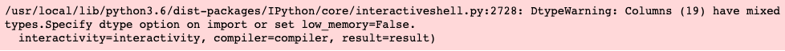
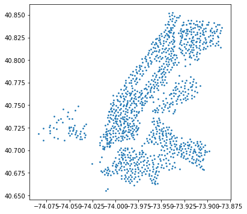

## Reading Data from the Web

Often data that we are interested in accessing is not on our local computer, but is provided somewhere by a web server.  All of the data input and output (I/O) that we have considered so far assumes that the data resides locally on our machine.  Of course we can usually download a file on the web and then read in the local copy we have saved, but in some cases we might not want to do that.  For example, imagine we want to track data from a website that keeps changing over time, and we'd like to be able to re-run our data analyses each time with the most up-to-date data, without having to keep downloading the same files over and over.

Fortunately, some of the same tools and functions that we've been using to read data from local files on our computer can also be used to read files directly from a remote file on a web site.  In addition, other libraries are available to enable us to access data in other formats that are served up on websites.  We'll have a look below at how that works.  


### Step 1.

Execute the next two code cells below, first to do some imports, and then to examine the documentation for the pandas ```read_csv``` function that we have used previously.  In particular, scroll down for information about the first argument that is passed to the function: ```filepath_or_buffer```.


```python
import pandas as pd
import matplotlib.pyplot as plt
```


```python
pd.read_csv?
```

The documentation on the ```read_csv``` function states:

<pre>
filepath_or_buffer : str, path object or file-like object
    Any valid string path is acceptable. The string could be a URL. Valid
    URL schemes include http, ftp, s3, and file. For file URLs, a host is
    expected. A local file could be: file://localhost/path/to/table.csv.
</pre>            
            
Up until now, we have passed strings containing the names of local files.  But the documentation states that the string could be a URL.  URL stands for "Uniform Resource Locator", and as the name implies, provides a uniform framework for locating resources on computers.  We tend to think of a URL as indicating a web address, prefixed with a protocol (or scheme) such as "http" or "https", but there are a number of different possible schemes that ```read_csv``` can read from.

### Step 2.

One type of dataset that gets continually updated, and from which we might want to run repeated analyses over time, involves political polling data.  New polls are added over time, and one is often interested in computing running averages, detecting trends over time, etc.  While we won't do much poll analysis here, we can at least download some data, although you are of course free to explore such data in more detail if you are interested.

The website "fivethirtyeight.com" serves a variety of different political polling datasets.  One of these, containing data about US presidential polls, is located at the URL [https://projects.fivethirtyeight.com/polls-page/president_primary_polls.csv](https://projects.fivethirtyeight.com/polls-page/president_primary_polls.csv) .  This is just a regular csv file, stored at that URL.

In the code cell below, write and evaluate an expression that uses ```pd.read_csv``` that reads the latest polling data, and stores the result in the variable ```poll_data```.  Examine the contents of the dataframe.

<b>Note: When reading csv files using ```pd.read_csv``` , you might occasionally see some warning messages, even if the dataframe is created correctly. These warning messages will be similar to the following: 



## Graded Cell

This cell is worth 30% of the grade for this assignment.


```python
poll_data = pd.read_csv('https://projects.fivethirtyeight.com/polls-page/president_primary_polls.csv')
```

    /usr/local/lib/python3.6/dist-packages/IPython/core/interactiveshell.py:2728: DtypeWarning: Columns (19) have mixed types.Specify dtype option on import or set low_memory=False.
      interactivity=interactivity, compiler=compiler, result=result)


## Self-Check

Run the cell below to test the correctness of your code above before submitting for grading.


```python
# Run this self-test cell to check your code; do not add code or delete code in this cell
from jn import testPollData

try:
    print(testPollData(poll_data))    
except Exception as e:
    print("Error!\n" + str(e))
```

    Correct!


Now that we have read all the data into a dataframe, we can carry out the usual sorts of analyses we do.  For example, one column in this dataframe is ```candidate_name```.  We might be interested in getting a list of all the candidates who are included in these polls.  Execute the code cell below, which uses the <code>unique</code> method on a Series, to see the names of everyone included.


```python
poll_data['candidate_name'].unique()
```


    array(['Joseph R. Biden Jr.', 'Bernard Sanders', 'Tulsi Gabbard',
           'Elizabeth Warren', 'Michael Bloomberg', 'Pete Buttigieg',
           'Amy Klobuchar', 'Donald Trump', 'William F. Weld', 'Tom Steyer',
           'Andrew Yang', 'Roque De La Fuente', 'Michael F. Bennet',
           'Cory A. Booker', 'Julián Castro', 'John K. Delaney', 'Joe Sestak',
           'Marianne Williamson', 'Joe Walsh', 'Deval Patrick', 'Mosie Boyd',
           'Michael Ellinger', 'Mark Stewart Greenstein', 'Mike Pence',
           'Kamala D. Harris', 'Robert Wells', 'Nathan Bloxham',
           "Beto O'Rourke", 'Steve Bullock', 'Wayne Messam',
           'Kirsten E. Gillibrand', 'Mike Gravel', 'Eric Swalwell',
           'Tim Ryan', 'Hillary Rodham Clinton', 'Bill de Blasio',
           'Jay Robert Inslee', 'John Kerry', 'Mark Sanford',
           'John Hickenlooper', 'Mitt Romney', 'John Richard Kasich',
           'Michelle Obama', 'Seth Moulton', 'Terry R. McAuliffe',
           'Nimrata R. Haley', 'Stacey Yvonne Abrams', 'Bob Corker',
           'Marco Rubio', 'Larry Hogan', 'Howard Schultz', 'Barack Obama',
           'Jeff Flake', 'Jamie Dimon', 'Dwayne Johnson',
           'Margaret Wood Hassan', 'Michael Avenatti', 'Andrew Cuomo',
           'Ben Sasse', 'Eric H. Holder', 'Sherrod Brown', 'Oprah Winfrey',
           'Mark Zuckerberg', 'Tim Kaine', 'Eric Garcetti', 'Gavin Newsom',
           'Ted Cruz', 'Nancy Pelosi', 'Gary Johnson', 'Joseph Kennedy III',
           'Dennis J. Kucinich', 'Jia Lee', 'Robert C. Scott',
           'Kyrsten Sinema', 'Mark R. Warner', 'Richard Neece Ojeda',
           'Jeb Bush', 'Paul Ryan', 'Charles D. Baker'], dtype=object)


### Step 3.

In some cases, data might be accessible not from a static file on a remote website, but through an API, or Application Programming Interface.  An API defines how we can access that remote data through a function call, so that we can access it from within our programs.  For example, if you are interested in analyzing Twitter data, you can set up an account through Twitter and search for particular tweets of interest through the [Twitter search API](https://developer.twitter.com/en/docs/tweets/search/overview).  A detailed discussion of data APIs is beyond the scope of this course, but we'll consider a simpler example here, which is able to access data on a website by making HTTP requests.

There is a bike-sharing system in New York City called "Citi Bike".  Bikes are picked up and deposited at fixed locations around the greater NYC metropolitan area.  The information on where those bike stations are is accessible from the Citi Bike website, which we can access using the Python ```requests``` library.  The information on bike stations is part of a larger data standardization format used by many bikeshare organizations around the world, known as the General Bikeshare Feed Specification (GBFS).

The station data contain many fields, such as street location, latitude/longitude location, number of available bike docks, etc.  They are served up in a format known as JSON, which stands for JavaScript Object Notation, which is standard, widely used, human-readable format for storing and communicating data across different programs and platforms.  At its core, JSON stores key-value pairs, making them very similar to Python dictionaries.  The requests module provides a method to convert the data stored in JSON responses into Python dictionaries.

If you're interested in learning more, the requests package is described [here](https://requests.readthedocs.io/en/master/).  JSON is introduced generally [here](https://www.json.org/json-en.html),  with a separate Python JSON library described [here](https://docs.python.org/3/library/json.html). If you're interested in working with the bikeshare data more fully beyond this exercise, you can learn more about it <a href="https://www.citibikenyc.com/system-data">here</a>, but if you do, make sure that you comply with the terms of the <a href="https://www.citibikenyc.com/data-sharing-policy">Data License Agreement</a>.

Execute the code cell below, which uses the Python requests library to get information about the Citi Bike stations, which are stored in a <code>Response</code> object.  Since the data access might not always succeed (for example, maybe the website is down), it can be useful to check the status code from the request.  In this case, status_code = 200 indicates the download was successful, but if you are having problems accessing the data, please contact your Facilitator.


```python
import requests
response = requests.get("https://gbfs.citibikenyc.com/gbfs/en/station_information.json")

if response.status_code != 200:
        print("Error with website. If problem persists, contact your Facilitator!")
else:
    print("Data download successful")
```

    Data download successful


Now execute the code cell below.  This calls the <code>json</code> method on the response object, which converts the JSON data downloaded from the website to a Python dictionary, which we have named ```datadict```.  The keys of the dictionary are then printed &mdash; the data of interest to us are associated with the key ```'data'```, which itself is associated with another dictionary with key ```'stations'```, which stores the actual station data.


```python
datadict = response.json()
print(datadict.keys())
print(datadict['data'].keys())
```

    dict_keys(['data', 'last_updated', 'ttl'])
    dict_keys(['stations'])


The JSON data also contains information about when it was last updated.  This is stored as an integer representing the number of seconds since the start of the <i>epoch</i>, conventionally chosen to be January 1, 1970 on Unix-based systems.  Fortunately, the <a href="https://docs.python.org/3/library/time.html">time module that is part of the Python Standard Library</a> provides a useful way to convert that large number of seconds to a more readable date-time string.  Execute the code cell below to see when the station json file was last updated.

If you reload the json data repeatedly using the call to <code>requests.get</code> above, you might see that the json data file appears to be updated every five seconds.


```python
print(datadict['last_updated'])
import time
print(time.ctime(datadict['last_updated']))
```

    1603243235
    Wed Oct 21 01:20:35 2020


In the code cell below, enter and evaluate ```datadict['data']['stations']``` to view the list of all bike stations.  Each station is itself stored in a dictionary, with keys such as ```'station_id'```, ```name```, ```'capacity'```, etc.  There is also information about the location of each station associated with the keys ```'lat'``` and ```'lon'```, short for 'latitude' and 'longitude', respectively.


```python
print(datadict['data']['stations'])
```

    [{'lon': -73.99392888, 'station_id': '72', 'legacy_id': '72', 'eightd_station_services': [], 'region_id': '71', 'capacity': 55, 'has_kiosk': True, 'short_name': '6926.01', 'station_type': 'classic', 'rental_methods': ['CREDITCARD', 'KEY'], 'rental_url': 'http://app.citibikenyc.com/S6Lr/IBV092JufD?station_id=72', 'external_id': '66db237e-0aca-11e7-82f6-3863bb44ef7c', 'name': 'W 52 St & 11 Ave', 'lat': 40.76727216, 'electric_bike_surcharge_waiver': False, 'eightd_has_key_dispenser': False}, {'lon': -74.00666661, 'station_id': '79', 'legacy_id': '79', 'eightd_station_services': [], 'region_id': '71', 'capacity': 33, 'has_kiosk': True, 'short_name': '5430.08', 'station_type': 'classic', 'rental_methods': ['CREDITCARD', 'KEY'], 'rental_url': 'http://app.citibikenyc.com/S6Lr/IBV092JufD?station_id=79', 'external_id': '66db269c-0aca-11e7-82f6-3863bb44ef7c', 'name': 'Franklin St & W Broadway', 'lat': 40.71911552, 'electric_bike_surcharge_waiver': False, 'eightd_has_key_dispenser': False}, {'lon': -74.00016545, 'station_id': '82', 'legacy_id': '82', 'eightd_station_services': [], 'region_id': '71', 'capacity': 27, 'has_kiosk': True, 'short_name': '5167.06', 'station_type': 'classic', 'rental_methods': ['CREDITCARD', 'KEY'], 'rental_url': 'http://app.citibikenyc.com/S6Lr/IBV092JufD?station_id=82', 'external_id': '66db277a-0aca-11e7-82f6-3863bb44ef7c', 'name': 'St James Pl & Pearl St', 'lat': 40.71117416, 'electric_bike_surcharge_waiver': False, 'eightd_has_key_dispenser': False}, {'lon': -73.97632328, 'station_id': '83', 'legacy_id': '83', 'eightd_station_services': [], 'region_id': '71', 'capacity': 62, 'has_kiosk': True, 'short_name': '4354.07', 'station_type': 'classic', 'rental_methods': ['CREDITCARD', 'KEY'], 'rental_url': 'http://app.citibikenyc.com/S6Lr/IBV092JufD?station_id=83', 'external_id': '66db281e-0aca-11e7-82f6-3863bb44ef7c', 'name': 'Atlantic Ave & Fort Greene Pl', 'lat': 40.68382604, 'electric_bike_surcharge_waiver': False, 'eightd_has_key_dispenser': False}, {'lon': -74.00149746, 'station_id': '116', 'legacy_id': '116', 'eightd_station_services': [], 'region_id': '71', 'capacity': 50, 'has_kiosk': True, 'short_name': '6148.02', 'station_type': 'classic', 'rental_methods': ['CREDITCARD', 'KEY'], 'rental_url': 'http://app.citibikenyc.com/S6Lr/IBV092JufD?station_id=116', 'external_id': '66db28b5-0aca-11e7-82f6-3863bb44ef7c', 'name': 'W 17 St & 8 Ave', 'lat': 40.74177603, 'electric_bike_surcharge_waiver': False, 'eightd_has_key_dispenser': False}, {'lon': -73.97803415, 'station_id': '119', 'legacy_id': '119', 'eightd_station_services': [], 'region_id': '71', 'capacity': 53, 'has_kiosk': True, 'short_name': '4700.06', 'station_type': 'classic', 'rental_methods': ['CREDITCARD', 'KEY'], 'rental_url': 'http://app.citibikenyc.com/S6Lr/IBV092JufD?station_id=119', 'external_id': '66db2953-0aca-11e7-82f6-3863bb44ef7c', 'name': 'Park Ave & St Edwards St', 'lat': 40.69608941, 'electric_bike_surcharge_waiver': False, 'eightd_has_key_dispenser': False}, {'lon': -73.95928168, 'station_id': '120', 'legacy_id': '120', 'eightd_station_services': [], 'region_id': '71', 'capacity': 19, 'has_kiosk': True, 'short_name': '4452.03', 'station_type': 'classic', 'rental_methods': ['CREDITCARD', 'KEY'], 'rental_url': 'http://app.citibikenyc.com/S6Lr/IBV092JufD?station_id=120', 'external_id': '66db29e6-0aca-11e7-82f6-3863bb44ef7c', 'name': 'Lexington Ave & Classon Ave', 'lat': 40.68676793, 'electric_bike_surcharge_waiver': False, 'eightd_has_key_dispenser': False}, {'lon': -74.00674436, 'station_id': '127', 'legacy_id': '127', 'eightd_station_services': [], 'region_id': '71', 'capacity': 31, 'has_kiosk': True, 'short_name': '5805.05', 'station_type': 'classic', 'rental_methods': ['CREDITCARD', 'KEY'], 'rental_url': 'http://app.citibikenyc.com/S6Lr/IBV092JufD?station_id=127', 'external_id': '66db2a71-0aca-11e7-82f6-3863bb44ef7c', 'name': 'Barrow St & Hudson St', 'lat': 40.73172428, 'electric_bike_surcharge_waiver': False, 'eightd_has_key_dispenser': False}, {'lon': -74.00297088, 'station_id': '128', 'legacy_id': '128', 'eightd_station_services': [], 'region_id': '71', 'capacity': 30, 'has_kiosk': True, 'short_name': '5687.04', 'station_type': 'classic', 'rental_methods': ['CREDITCARD', 'KEY'], 'rental_url': 'http://app.citibikenyc.com/S6Lr/IBV092JufD?station_id=128', 'external_id': '66db2afe-0aca-11e7-82f6-3863bb44ef7c', 'name': 'MacDougal St & Prince St', 'lat': 40.72710258, 'electric_bike_surcharge_waiver': False, 'eightd_has_key_dispenser': False}, {'lon': -73.99337909, 'station_id': '143', 'legacy_id': '143', 'eightd_station_services': [], 'region_id': '71', 'capacity': 24, 'has_kiosk': True, 'short_name': '4605.04', 'station_type': 'classic', 'rental_methods': ['CREDITCARD', 'KEY'], 'rental_url': 'http://app.citibikenyc.com/S6Lr/IBV092JufD?station_id=143', 'external_id': '66db2d2b-0aca-11e7-82f6-3863bb44ef7c', 'name': 'Clinton St & Joralemon St', 'lat': 40.69239502, 'electric_bike_surcharge_waiver': False, 'eightd_has_key_dispenser': False}, {'lon': -73.98068914, 'station_id': '144', 'legacy_id': '144', 'eightd_station_services': [], 'region_id': '71', 'capacity': 58, 'has_kiosk': True, 'short_name': '4812.02', 'station_type': 'classic', 'rental_methods': ['CREDITCARD', 'KEY'], 'rental_url': 'http://app.citibikenyc.com/S6Lr/IBV092JufD?station_id=144', 'external_id': '66db2db5-0aca-11e7-82f6-3863bb44ef7c', 'name': 'Nassau St & Navy St', 'lat': 40.69839895, 'electric_bike_surcharge_waiver': False, 'eightd_has_key_dispenser': False}, {'lon': -74.0091059, 'station_id': '146', 'legacy_id': '146', 'eightd_station_services': [], 'region_id': '71', 'capacity': 39, 'has_kiosk': True, 'short_name': '5359.10', 'station_type': 'classic', 'rental_methods': ['CREDITCARD', 'KEY'], 'rental_url': 'http://app.citibikenyc.com/S6Lr/IBV092JufD?station_id=146', 'external_id': '66db2e3a-0aca-11e7-82f6-3863bb44ef7c', 'name': 'Hudson St & Reade St', 'lat': 40.71625008, 'electric_bike_surcharge_waiver': False, 'eightd_has_key_dispenser': False}, {'lon': -73.98085795, 'station_id': '150', 'legacy_id': '150', 'eightd_station_services': [], 'region_id': '71', 'capacity': 55, 'has_kiosk': True, 'short_name': '5476.03', 'station_type': 'classic', 'rental_methods': ['CREDITCARD', 'KEY'], 'rental_url': 'http://app.citibikenyc.com/S6Lr/IBV092JufD?station_id=150', 'external_id': '66db2f4c-0aca-11e7-82f6-3863bb44ef7c', 'name': 'E 2 St & Avenue C', 'lat': 40.7208736, 'electric_bike_surcharge_waiver': False, 'eightd_has_key_dispenser': False}, {'lon': -73.99724900722504, 'station_id': '151', 'legacy_id': '151', 'eightd_station_services': [], 'region_id': '71', 'capacity': 33, 'has_kiosk': True, 'short_name': '5492.05', 'station_type': 'classic', 'rental_methods': ['CREDITCARD', 'KEY'], 'rental_url': 'http://app.citibikenyc.com/S6Lr/IBV092JufD?station_id=151', 'external_id': '66db2fd0-0aca-11e7-82f6-3863bb44ef7c', 'name': 'Cleveland Pl & Spring St', 'lat': 40.722103786686034, 'electric_bike_surcharge_waiver': False, 'eightd_has_key_dispenser': True}, {'lon': -73.99612349, 'station_id': '157', 'legacy_id': '157', 'eightd_station_services': [], 'region_id': '71', 'capacity': 23, 'has_kiosk': True, 'short_name': '4531.05', 'station_type': 'classic', 'rental_methods': ['CREDITCARD', 'KEY'], 'rental_url': 'http://app.citibikenyc.com/S6Lr/IBV092JufD?station_id=157', 'external_id': '66db316a-0aca-11e7-82f6-3863bb44ef7c', 'name': 'Henry St & Atlantic Ave', 'lat': 40.69089272, 'electric_bike_surcharge_waiver': False, 'eightd_has_key_dispenser': False}, {'lon': -73.99810231, 'station_id': '161', 'legacy_id': '161', 'eightd_station_services': [], 'region_id': '71', 'capacity': 35, 'has_kiosk': True, 'short_name': '5721.14', 'station_type': 'classic', 'rental_methods': ['CREDITCARD', 'KEY'], 'rental_url': 'http://app.citibikenyc.com/S6Lr/IBV092JufD?station_id=161', 'external_id': '66db3273-0aca-11e7-82f6-3863bb44ef7c', 'name': 'LaGuardia Pl & W 3 St', 'lat': 40.72917025, 'electric_bike_surcharge_waiver': False, 'eightd_has_key_dispenser': False}, {'lon': -73.97032517, 'station_id': '164', 'legacy_id': '164', 'eightd_station_services': [], 'region_id': '71', 'capacity': 27, 'has_kiosk': True, 'short_name': '6498.10', 'station_type': 'classic', 'rental_methods': ['CREDITCARD', 'KEY'], 'rental_url': 'http://app.citibikenyc.com/S6Lr/IBV092JufD?station_id=164', 'external_id': '66db32fb-0aca-11e7-82f6-3863bb44ef7c', 'name': 'E 47 St & 2 Ave', 'lat': 40.75323098, 'electric_bike_surcharge_waiver': False, 'eightd_has_key_dispenser': False}, {'lon': -73.99456405, 'station_id': '168', 'legacy_id': '168', 'eightd_station_services': [], 'region_id': '71', 'capacity': 47, 'has_kiosk': True, 'short_name': '6064.08', 'station_type': 'classic', 'rental_methods': ['CREDITCARD', 'KEY'], 'rental_url': 'http://app.citibikenyc.com/S6Lr/IBV092JufD?station_id=168', 'external_id': '66db33fc-0aca-11e7-82f6-3863bb44ef7c', 'name': 'W 18 St & 6 Ave', 'lat': 40.73971301, 'electric_bike_surcharge_waiver': False, 'eightd_has_key_dispenser': False}, {'lon': -73.9845272898674, 'station_id': '173', 'legacy_id': '173', 'eightd_station_services': [], 'region_id': '71', 'capacity': 70, 'has_kiosk': True, 'short_name': '6708.02', 'station_type': 'classic', 'rental_methods': ['CREDITCARD', 'KEY'], 'rental_url': 'http://app.citibikenyc.com/S6Lr/IBV092JufD?station_id=173', 'external_id': '66db347b-0aca-11e7-82f6-3863bb44ef7c', 'name': 'Broadway & W 49 St', 'lat': 40.76068327096592, 'electric_bike_surcharge_waiver': False, 'eightd_has_key_dispenser': False}, {'lon': -73.97738662, 'station_id': '174', 'legacy_id': '174', 'eightd_station_services': [], 'region_id': '71', 'capacity': 35, 'has_kiosk': True, 'short_name': '6004.07', 'station_type': 'classic', 'rental_methods': ['CREDITCARD', 'KEY'], 'rental_url': 'http://app.citibikenyc.com/S6Lr/IBV092JufD?station_id=174', 'external_id': '66db34fc-0aca-11e7-82f6-3863bb44ef7c', 'name': 'E 25 St & 1 Ave', 'lat': 40.7381765, 'electric_bike_surcharge_waiver': False, 'eightd_has_key_dispenser': False}, {'lon': -74.00681753, 'station_id': '212', 'legacy_id': '212', 'eightd_station_services': [], 'region_id': '71', 'capacity': 60, 'has_kiosk': True, 'short_name': '6233.05', 'station_type': 'classic', 'rental_methods': ['CREDITCARD', 'KEY'], 'rental_url': 'http://app.citibikenyc.com/S6Lr/IBV092JufD?station_id=212', 'external_id': '66db3606-0aca-11e7-82f6-3863bb44ef7c', 'name': 'W 16 St & The High Line', 'lat': 40.74334935, 'electric_bike_surcharge_waiver': False, 'eightd_has_key_dispenser': False}, {'lon': -73.99548059, 'station_id': '216', 'legacy_id': '216', 'eightd_station_services': [], 'region_id': '71', 'capacity': 37, 'has_kiosk': True, 'short_name': '4829.01', 'station_type': 'classic', 'rental_methods': ['CREDITCARD', 'KEY'], 'rental_url': 'http://app.citibikenyc.com/S6Lr/IBV092JufD?station_id=216', 'external_id': '66db3687-0aca-11e7-82f6-3863bb44ef7c', 'name': 'Columbia Heights & Cranberry St', 'lat': 40.70037867, 'electric_bike_surcharge_waiver': False, 'eightd_has_key_dispenser': False}, {'lon': -73.99383605, 'station_id': '217', 'legacy_id': '217', 'eightd_station_services': [], 'region_id': '71', 'capacity': 39, 'has_kiosk': True, 'short_name': '4903.08', 'station_type': 'classic', 'rental_methods': ['CREDITCARD', 'KEY'], 'rental_url': 'http://app.citibikenyc.com/S6Lr/IBV092JufD?station_id=217', 'external_id': '66db3708-0aca-11e7-82f6-3863bb44ef7c', 'name': 'Old Fulton St', 'lat': 40.70277159, 'electric_bike_surcharge_waiver': False, 'eightd_has_key_dispenser': False}, {'lon': -73.99994661, 'station_id': '223', 'legacy_id': '223', 'eightd_station_services': [], 'region_id': '71', 'capacity': 33, 'has_kiosk': True, 'short_name': '6030.04', 'station_type': 'classic', 'rental_methods': ['CREDITCARD', 'KEY'], 'rental_url': 'http://app.citibikenyc.com/S6Lr/IBV092JufD?station_id=223', 'external_id': '66db3816-0aca-11e7-82f6-3863bb44ef7c', 'name': 'W 13 St & 7 Ave', 'lat': 40.73781509, 'electric_bike_surcharge_waiver': False, 'eightd_has_key_dispenser': False}, {'lon': -74.00552427, 'station_id': '224', 'legacy_id': '224', 'eightd_station_services': [], 'region_id': '71', 'capacity': 30, 'has_kiosk': True, 'short_name': '5137.10', 'station_type': 'classic', 'rental_methods': ['CREDITCARD', 'KEY'], 'rental_url': 'http://app.citibikenyc.com/S6Lr/IBV092JufD?station_id=224', 'external_id': '66db3898-0aca-11e7-82f6-3863bb44ef7c', 'name': 'Spruce St & Nassau St', 'lat': 40.71146364, 'electric_bike_surcharge_waiver': False, 'eightd_has_key_dispenser': True}, {'lon': -73.971878855, 'station_id': '228', 'legacy_id': '228', 'eightd_station_services': [], 'region_id': '71', 'capacity': 55, 'has_kiosk': True, 'short_name': '6541.03', 'station_type': 'classic', 'rental_methods': ['CREDITCARD', 'KEY'], 'rental_url': 'http://app.citibikenyc.com/S6Lr/IBV092JufD?station_id=228', 'external_id': '66db3997-0aca-11e7-82f6-3863bb44ef7c', 'name': 'E 48 St & 3 Ave', 'lat': 40.7546011026, 'electric_bike_surcharge_waiver': False, 'eightd_has_key_dispenser': False}, {'lon': -73.99379025, 'station_id': '229', 'legacy_id': '229', 'eightd_station_services': [], 'region_id': '71', 'capacity': 23, 'has_kiosk': True, 'short_name': '5636.11', 'station_type': 'classic', 'rental_methods': ['CREDITCARD', 'KEY'], 'rental_url': 'http://app.citibikenyc.com/S6Lr/IBV092JufD?station_id=229', 'external_id': '66db3a1e-0aca-11e7-82f6-3863bb44ef7c', 'name': 'Great Jones St', 'lat': 40.72743423, 'electric_bike_surcharge_waiver': False, 'eightd_has_key_dispenser': False}, {'lon': -73.98713956, 'station_id': '236', 'legacy_id': '236', 'eightd_station_services': [], 'region_id': '71', 'capacity': 47, 'has_kiosk': True, 'short_name': '5669.10', 'station_type': 'classic', 'rental_methods': ['CREDITCARD', 'KEY'], 'rental_url': 'http://app.citibikenyc.com/S6Lr/IBV092JufD?station_id=236', 'external_id': '66db3ba0-0aca-11e7-82f6-3863bb44ef7c', 'name': 'St Marks Pl & 2 Ave', 'lat': 40.7284186, 'electric_bike_surcharge_waiver': False, 'eightd_has_key_dispenser': False}, {'lon': -73.98672378, 'station_id': '237', 'legacy_id': '237', 'eightd_station_services': [], 'region_id': '71', 'capacity': 19, 'has_kiosk': True, 'short_name': '5746.04', 'station_type': 'classic', 'rental_methods': ['CREDITCARD', 'KEY'], 'rental_url': 'http://app.citibikenyc.com/S6Lr/IBV092JufD?station_id=237', 'external_id': '66db3c29-0aca-11e7-82f6-3863bb44ef7c', 'name': 'E 11 St & 2 Ave', 'lat': 40.73047309, 'electric_bike_surcharge_waiver': False, 'eightd_has_key_dispenser': False}, {'lon': -74.00859207, 'station_id': '238', 'legacy_id': '238', 'eightd_station_services': [], 'region_id': '71', 'capacity': 31, 'has_kiosk': True, 'short_name': '5964.01', 'station_type': 'classic', 'rental_methods': ['CREDITCARD', 'KEY'], 'rental_url': 'http://app.citibikenyc.com/S6Lr/IBV092JufD?station_id=238', 'external_id': '66db3cab-0aca-11e7-82f6-3863bb44ef7c', 'name': 'Bank St & Washington St', 'lat': 40.7361967, 'electric_bike_surcharge_waiver': False, 'eightd_has_key_dispenser': False}, {'lon': -73.9813018, 'station_id': '239', 'legacy_id': '239', 'eightd_station_services': [], 'region_id': '71', 'capacity': 31, 'has_kiosk': True, 'short_name': '4628.05', 'station_type': 'classic', 'rental_methods': ['CREDITCARD', 'KEY'], 'rental_url': 'http://app.citibikenyc.com/S6Lr/IBV092JufD?station_id=239', 'external_id': '66db3d2a-0aca-11e7-82f6-3863bb44ef7c', 'name': 'Willoughby St & Fleet St', 'lat': 40.69196566, 'electric_bike_surcharge_waiver': False, 'eightd_has_key_dispenser': False}, {'lon': -73.97493121, 'station_id': '241', 'legacy_id': '241', 'eightd_station_services': [], 'region_id': '71', 'capacity': 23, 'has_kiosk': True, 'short_name': '4546.04', 'station_type': 'classic', 'rental_methods': ['CREDITCARD', 'KEY'], 'rental_url': 'http://app.citibikenyc.com/S6Lr/IBV092JufD?station_id=241', 'external_id': '66db3da9-0aca-11e7-82f6-3863bb44ef7c', 'name': 'DeKalb Ave & S Portland Ave', 'lat': 40.68981035, 'electric_bike_surcharge_waiver': False, 'eightd_has_key_dispenser': False}, {'lon': -73.973736, 'station_id': '242', 'legacy_id': '242', 'eightd_station_services': [], 'region_id': '71', 'capacity': 46, 'has_kiosk': True, 'short_name': '4732.08', 'station_type': 'classic', 'rental_methods': ['CREDITCARD', 'KEY'], 'rental_url': 'http://app.citibikenyc.com/S6Lr/IBV092JufD?station_id=242', 'external_id': '66db3e32-0aca-11e7-82f6-3863bb44ef7c', 'name': 'Carlton Ave & Flushing Ave', 'lat': 40.697787, 'electric_bike_surcharge_waiver': False, 'eightd_has_key_dispenser': False}, {'lon': -73.96536851, 'station_id': '244', 'legacy_id': '244', 'eightd_station_services': [], 'region_id': '71', 'capacity': 31, 'has_kiosk': True, 'short_name': '4611.03', 'station_type': 'classic', 'rental_methods': ['CREDITCARD', 'KEY'], 'rental_url': 'http://app.citibikenyc.com/S6Lr/IBV092JufD?station_id=244', 'external_id': '66db3f01-0aca-11e7-82f6-3863bb44ef7c', 'name': 'Willoughby Ave & Hall St', 'lat': 40.69196035, 'electric_bike_surcharge_waiver': False, 'eightd_has_key_dispenser': False}, {'lon': -73.97703874, 'station_id': '245', 'legacy_id': '245', 'eightd_station_services': [], 'region_id': '71', 'capacity': 23, 'has_kiosk': True, 'short_name': '4659.02', 'station_type': 'classic', 'rental_methods': ['CREDITCARD', 'KEY'], 'rental_url': 'http://app.citibikenyc.com/S6Lr/IBV092JufD?station_id=245', 'external_id': '66db3f62-0aca-11e7-82f6-3863bb44ef7c', 'name': 'Myrtle Ave & St Edwards St', 'lat': 40.69327018, 'electric_bike_surcharge_waiver': False, 'eightd_has_key_dispenser': True}, {'lon': -74.00483091, 'station_id': '247', 'legacy_id': '247', 'eightd_station_services': [], 'region_id': '71', 'capacity': 55, 'has_kiosk': True, 'short_name': '5922.07', 'station_type': 'classic', 'rental_methods': ['CREDITCARD', 'KEY'], 'rental_url': 'http://app.citibikenyc.com/S6Lr/IBV092JufD?station_id=247', 'external_id': '66db3fc9-0aca-11e7-82f6-3863bb44ef7c', 'name': 'Perry St & Bleecker St', 'lat': 40.73535398, 'electric_bike_surcharge_waiver': False, 'eightd_has_key_dispenser': False}, {'lon': -74.00771779, 'station_id': '248', 'legacy_id': '248', 'eightd_station_services': [], 'region_id': '71', 'capacity': 99, 'has_kiosk': True, 'short_name': '5539.06', 'station_type': 'classic', 'rental_methods': ['CREDITCARD', 'KEY'], 'rental_url': 'http://app.citibikenyc.com/S6Lr/IBV092JufD?station_id=248', 'external_id': '66db402c-0aca-11e7-82f6-3863bb44ef7c', 'name': 'Laight St & Hudson St', 'lat': 40.72185379, 'electric_bike_surcharge_waiver': False, 'eightd_has_key_dispenser': False}, {'lon': -74.0090009, 'station_id': '249', 'legacy_id': '249', 'eightd_station_services': [], 'region_id': '71', 'capacity': 27, 'has_kiosk': True, 'short_name': '5400.05', 'station_type': 'classic', 'rental_methods': ['CREDITCARD', 'KEY'], 'rental_url': 'http://app.citibikenyc.com/S6Lr/IBV092JufD?station_id=249', 'external_id': '66db408f-0aca-11e7-82f6-3863bb44ef7c', 'name': 'Harrison St & Hudson St', 'lat': 40.71870987, 'electric_bike_surcharge_waiver': False, 'eightd_has_key_dispenser': False}, {'lon': -73.99565293, 'station_id': '250', 'legacy_id': '250', 'eightd_station_services': [], 'region_id': '71', 'capacity': 40, 'has_kiosk': True, 'short_name': '5561.06', 'station_type': 'classic', 'rental_methods': ['CREDITCARD', 'KEY'], 'rental_url': 'http://app.citibikenyc.com/S6Lr/IBV092JufD?station_id=250', 'external_id': '66db40ef-0aca-11e7-82f6-3863bb44ef7c', 'name': 'Lafayette St & Jersey St', 'lat': 40.72456089, 'electric_bike_surcharge_waiver': False, 'eightd_has_key_dispenser': False}, {'lon': -73.99480012, 'station_id': '251', 'legacy_id': '251', 'eightd_station_services': [], 'region_id': '71', 'capacity': 27, 'has_kiosk': True, 'short_name': '5561.04', 'station_type': 'classic', 'rental_methods': ['CREDITCARD', 'KEY'], 'rental_url': 'http://app.citibikenyc.com/S6Lr/IBV092JufD?station_id=251', 'external_id': '66db4158-0aca-11e7-82f6-3863bb44ef7c', 'name': 'Mott St & Prince St', 'lat': 40.72317958, 'electric_bike_surcharge_waiver': False, 'eightd_has_key_dispenser': False}, {'lon': -73.99852205, 'station_id': '252', 'legacy_id': '252', 'eightd_station_services': [], 'region_id': '71', 'capacity': 33, 'has_kiosk': True, 'short_name': '5797.01', 'station_type': 'classic', 'rental_methods': ['CREDITCARD', 'KEY'], 'rental_url': 'http://app.citibikenyc.com/S6Lr/IBV092JufD?station_id=252', 'external_id': '66db41bf-0aca-11e7-82f6-3863bb44ef7c', 'name': 'MacDougal St & Washington Sq', 'lat': 40.73226398, 'electric_bike_surcharge_waiver': False, 'eightd_has_key_dispenser': False}, {'lon': -73.99800419, 'station_id': '254', 'legacy_id': '254', 'eightd_station_services': [], 'region_id': '71', 'capacity': 47, 'has_kiosk': True, 'short_name': '5914.03', 'station_type': 'classic', 'rental_methods': ['CREDITCARD', 'KEY'], 'rental_url': 'http://app.citibikenyc.com/S6Lr/IBV092JufD?station_id=254', 'external_id': '66db4282-0aca-11e7-82f6-3863bb44ef7c', 'name': 'W 11 St & 6 Ave', 'lat': 40.73532427, 'electric_bike_surcharge_waiver': False, 'eightd_has_key_dispenser': False}, {'lon': -74.00247214, 'station_id': '257', 'legacy_id': '257', 'eightd_station_services': [], 'region_id': '71', 'capacity': 39, 'has_kiosk': True, 'short_name': '5391.06', 'station_type': 'classic', 'rental_methods': ['CREDITCARD', 'KEY'], 'rental_url': 'http://app.citibikenyc.com/S6Lr/IBV092JufD?station_id=257', 'external_id': '66db4351-0aca-11e7-82f6-3863bb44ef7c', 'name': 'Lispenard St & Broadway', 'lat': 40.71939226, 'electric_bike_surcharge_waiver': False, 'eightd_has_key_dispenser': False}, {'lon': -73.96885458, 'station_id': '258', 'legacy_id': '258', 'eightd_station_services': [], 'region_id': '71', 'capacity': 23, 'has_kiosk': True, 'short_name': '4461.04', 'station_type': 'classic', 'rental_methods': ['CREDITCARD', 'KEY'], 'rental_url': 'http://app.citibikenyc.com/S6Lr/IBV092JufD?station_id=258', 'external_id': '66db43b5-0aca-11e7-82f6-3863bb44ef7c', 'name': 'DeKalb Ave & Vanderbilt Ave', 'lat': 40.68940747, 'electric_bike_surcharge_waiver': False, 'eightd_has_key_dispenser': False}, {'lon': -74.01234218, 'station_id': '259', 'legacy_id': '259', 'eightd_station_services': [], 'region_id': '71', 'capacity': 39, 'has_kiosk': True, 'short_name': '4846.01', 'station_type': 'classic', 'rental_methods': ['CREDITCARD', 'KEY'], 'rental_url': 'http://app.citibikenyc.com/S6Lr/IBV092JufD?station_id=259', 'external_id': '66db4417-0aca-11e7-82f6-3863bb44ef7c', 'name': 'South St & Whitehall St', 'lat': 40.70122128, 'electric_bike_surcharge_waiver': False, 'eightd_has_key_dispenser': False}, {'lon': -74.01167797, 'station_id': '260', 'legacy_id': '260', 'eightd_station_services': [], 'region_id': '71', 'capacity': 33, 'has_kiosk': True, 'short_name': '4962.08', 'station_type': 'classic', 'rental_methods': ['CREDITCARD', 'KEY'], 'rental_url': 'http://app.citibikenyc.com/S6Lr/IBV092JufD?station_id=260', 'external_id': '66db447a-0aca-11e7-82f6-3863bb44ef7c', 'name': 'Broad St & Bridge St', 'lat': 40.70365182, 'electric_bike_surcharge_waiver': False, 'eightd_has_key_dispenser': False}, {'lon': -73.98362464, 'station_id': '261', 'legacy_id': '261', 'eightd_station_services': [], 'region_id': '71', 'capacity': 41, 'has_kiosk': True, 'short_name': '4668.08', 'station_type': 'classic', 'rental_methods': ['CREDITCARD', 'KEY'], 'rental_url': 'http://app.citibikenyc.com/S6Lr/IBV092JufD?station_id=261', 'external_id': '66db44e5-0aca-11e7-82f6-3863bb44ef7c', 'name': 'Johnson St & Gold St', 'lat': 40.69474881, 'electric_bike_surcharge_waiver': False, 'eightd_has_key_dispenser': False}, {'lon': -73.9737299, 'station_id': '262', 'legacy_id': '262', 'eightd_station_services': [], 'region_id': '71', 'capacity': 24, 'has_kiosk': True, 'short_name': '4546.05', 'station_type': 'classic', 'rental_methods': ['CREDITCARD', 'KEY'], 'rental_url': 'http://app.citibikenyc.com/S6Lr/IBV092JufD?station_id=262', 'external_id': '66db4549-0aca-11e7-82f6-3863bb44ef7c', 'name': 'Washington Park', 'lat': 40.6917823, 'electric_bike_surcharge_waiver': False, 'eightd_has_key_dispenser': False}, {'lon': -74.00731853, 'station_id': '264', 'legacy_id': '264', 'eightd_station_services': [], 'region_id': '71', 'capacity': 27, 'has_kiosk': True, 'short_name': '5065.10', 'station_type': 'classic', 'rental_methods': ['CREDITCARD', 'KEY'], 'rental_url': 'http://app.citibikenyc.com/S6Lr/IBV092JufD?station_id=264', 'external_id': '66db460d-0aca-11e7-82f6-3863bb44ef7c', 'name': 'Maiden Ln & Pearl St', 'lat': 40.70706456, 'electric_bike_surcharge_waiver': False, 'eightd_has_key_dispenser': False}, {'lon': -73.99147535, 'station_id': '265', 'legacy_id': '265', 'eightd_station_services': [], 'region_id': '71', 'capacity': 35, 'has_kiosk': True, 'short_name': '5523.02', 'station_type': 'classic', 'rental_methods': ['CREDITCARD', 'KEY'], 'rental_url': 'http://app.citibikenyc.com/S6Lr/IBV092JufD?station_id=265', 'external_id': '66db4671-0aca-11e7-82f6-3863bb44ef7c', 'name': 'Stanton St & Chrystie St', 'lat': 40.72229346, 'electric_bike_surcharge_waiver': False, 'eightd_has_key_dispenser': False}, {'lon': -73.98765428, 'station_id': '267', 'legacy_id': '267', 'eightd_station_services': [], 'region_id': '71', 'capacity': 70, 'has_kiosk': True, 'short_name': '6441.01', 'station_type': 'classic', 'rental_methods': ['CREDITCARD', 'KEY'], 'rental_url': 'http://app.citibikenyc.com/S6Lr/IBV092JufD?station_id=267', 'external_id': '66db473c-0aca-11e7-82f6-3863bb44ef7c', 'name': 'Broadway & W 36 St', 'lat': 40.75097711, 'electric_bike_surcharge_waiver': False, 'eightd_has_key_dispenser': False}, {'lon': -73.99973337, 'station_id': '268', 'legacy_id': '268', 'eightd_station_services': [], 'region_id': '71', 'capacity': 27, 'has_kiosk': True, 'short_name': '5422.04', 'station_type': 'classic', 'rental_methods': ['CREDITCARD', 'KEY'], 'rental_url': 'http://app.citibikenyc.com/S6Lr/IBV092JufD?station_id=268', 'external_id': '66db479e-0aca-11e7-82f6-3863bb44ef7c', 'name': 'Howard St & Centre St', 'lat': 40.71910537, 'electric_bike_surcharge_waiver': False, 'eightd_has_key_dispenser': False}, {'lon': -73.97178913, 'station_id': '270', 'legacy_id': '270', 'eightd_station_services': [], 'region_id': '71', 'capacity': 23, 'has_kiosk': True, 'short_name': '4620.02', 'station_type': 'classic', 'rental_methods': ['CREDITCARD', 'KEY'], 'rental_url': 'http://app.citibikenyc.com/S6Lr/IBV092JufD?station_id=270', 'external_id': '66db5c14-0aca-11e7-82f6-3863bb44ef7c', 'name': 'Adelphi St & Myrtle Ave', 'lat': 40.69308257, 'electric_bike_surcharge_waiver': False, 'eightd_has_key_dispenser': False}, {'lon': -73.976682, 'station_id': '274', 'legacy_id': '274', 'eightd_station_services': [], 'region_id': '71', 'capacity': 31, 'has_kiosk': True, 'short_name': '4395.04', 'station_type': 'classic', 'rental_methods': ['CREDITCARD', 'KEY'], 'rental_url': 'http://app.citibikenyc.com/S6Lr/IBV092JufD?station_id=274', 'external_id': '66db5d28-0aca-11e7-82f6-3863bb44ef7c', 'name': 'Lafayette Ave & Fort Greene Pl', 'lat': 40.68691865, 'electric_bike_surcharge_waiver': False, 'eightd_has_key_dispenser': False}, {'lon': -73.96563307, 'station_id': '275', 'legacy_id': '275', 'eightd_station_services': [], 'region_id': '71', 'capacity': 19, 'has_kiosk': True, 'short_name': '4419.03', 'station_type': 'classic', 'rental_methods': ['CREDITCARD', 'KEY'], 'rental_url': 'http://app.citibikenyc.com/S6Lr/IBV092JufD?station_id=275', 'external_id': '66db5d92-0aca-11e7-82f6-3863bb44ef7c', 'name': 'Washington Ave & Greene Ave', 'lat': 40.68650065, 'electric_bike_surcharge_waiver': False, 'eightd_has_key_dispenser': False}, {'lon': -74.0104554, 'station_id': '276', 'legacy_id': '276', 'eightd_station_services': [], 'region_id': '71', 'capacity': 25, 'has_kiosk': True, 'short_name': '5400.08', 'station_type': 'classic', 'rental_methods': ['CREDITCARD', 'KEY'], 'rental_url': 'http://app.citibikenyc.com/S6Lr/IBV092JufD?station_id=276', 'external_id': '66db5dfb-0aca-11e7-82f6-3863bb44ef7c', 'name': 'Duane St & Greenwich St', 'lat': 40.71748752, 'electric_bike_surcharge_waiver': False, 'eightd_has_key_dispenser': False}, {'lon': -73.98476437, 'station_id': '278', 'legacy_id': '278', 'eightd_station_services': [], 'region_id': '71', 'capacity': 19, 'has_kiosk': True, 'short_name': '4781.03', 'station_type': 'classic', 'rental_methods': ['CREDITCARD', 'KEY'], 'rental_url': 'http://app.citibikenyc.com/S6Lr/IBV092JufD?station_id=278', 'external_id': '66db5e6a-0aca-11e7-82f6-3863bb44ef7c', 'name': 'Concord St & Bridge St', 'lat': 40.69766564, 'electric_bike_surcharge_waiver': False, 'eightd_has_key_dispenser': False}, {'lon': -73.99510132, 'station_id': '280', 'legacy_id': '280', 'eightd_station_services': [], 'region_id': '71', 'capacity': 59, 'has_kiosk': True, 'short_name': '5872.08', 'station_type': 'classic', 'rental_methods': ['CREDITCARD', 'KEY'], 'rental_url': 'http://app.citibikenyc.com/S6Lr/IBV092JufD?station_id=280', 'external_id': '66db5f40-0aca-11e7-82f6-3863bb44ef7c', 'name': 'E 10 St & 5 Ave', 'lat': 40.73331967, 'electric_bike_surcharge_waiver': False, 'eightd_has_key_dispenser': False}, {'lon': -73.97371465, 'station_id': '281', 'legacy_id': '281', 'eightd_station_services': [], 'region_id': '71', 'capacity': 0, 'has_kiosk': True, 'short_name': '6839.10', 'station_type': 'classic', 'rental_methods': ['CREDITCARD', 'KEY'], 'rental_url': 'http://app.citibikenyc.com/S6Lr/IBV092JufD?station_id=281', 'external_id': '66db5fae-0aca-11e7-82f6-3863bb44ef7c', 'name': 'Grand Army Plaza & Central Park S', 'lat': 40.7643971, 'electric_bike_surcharge_waiver': False, 'eightd_has_key_dispenser': False}, {'lon': -73.96841526031494, 'station_id': '282', 'legacy_id': '282', 'eightd_station_services': [], 'region_id': '71', 'capacity': 27, 'has_kiosk': True, 'short_name': '5062.01', 'station_type': 'classic', 'rental_methods': ['CREDITCARD', 'KEY'], 'rental_url': 'http://app.citibikenyc.com/S6Lr/IBV092JufD?station_id=282', 'external_id': '66db6299-0aca-11e7-82f6-3863bb44ef7c', 'name': 'Kent Ave & S 11 St', 'lat': 40.707644944175705, 'electric_bike_surcharge_waiver': False, 'eightd_has_key_dispenser': False}, {'lon': -74.0026376103, 'station_id': '284', 'legacy_id': '284', 'eightd_station_services': [], 'region_id': '71', 'capacity': 51, 'has_kiosk': True, 'short_name': '6072.06', 'station_type': 'classic', 'rental_methods': ['CREDITCARD', 'KEY'], 'rental_url': 'http://app.citibikenyc.com/S6Lr/IBV092JufD?station_id=284', 'external_id': '66db631c-0aca-11e7-82f6-3863bb44ef7c', 'name': 'Greenwich Ave & 8 Ave', 'lat': 40.7390169121, 'electric_bike_surcharge_waiver': False, 'eightd_has_key_dispenser': False}, {'lon': -73.99074142, 'station_id': '285', 'legacy_id': '285', 'eightd_station_services': [], 'region_id': '71', 'capacity': 53, 'has_kiosk': True, 'short_name': '5905.12', 'station_type': 'classic', 'rental_methods': ['CREDITCARD', 'KEY'], 'rental_url': 'http://app.citibikenyc.com/S6Lr/IBV092JufD?station_id=285', 'external_id': '66db6387-0aca-11e7-82f6-3863bb44ef7c', 'name': 'Broadway & E 14 St', 'lat': 40.73454567, 'electric_bike_surcharge_waiver': False, 'eightd_has_key_dispenser': True}, {'lon': -73.95881081, 'station_id': '289', 'legacy_id': '289', 'eightd_station_services': [], 'region_id': '71', 'capacity': 19, 'has_kiosk': True, 'short_name': '4336.01', 'station_type': 'classic', 'rental_methods': ['CREDITCARD', 'KEY'], 'rental_url': 'http://app.citibikenyc.com/S6Lr/IBV092JufD?station_id=289', 'external_id': '66db63f4-0aca-11e7-82f6-3863bb44ef7c', 'name': 'Monroe St & Classon Ave', 'lat': 40.6845683, 'electric_bike_surcharge_waiver': False, 'eightd_has_key_dispenser': False}, {'lon': -73.984844, 'station_id': '291', 'legacy_id': '291', 'eightd_station_services': [], 'region_id': '71', 'capacity': 20, 'has_kiosk': True, 'short_name': '5262.09', 'station_type': 'classic', 'rental_methods': ['CREDITCARD', 'KEY'], 'rental_url': 'http://app.citibikenyc.com/S6Lr/IBV092JufD?station_id=291', 'external_id': '66db64d1-0aca-11e7-82f6-3863bb44ef7c', 'name': 'Madison St & Montgomery St', 'lat': 40.713126, 'electric_bike_surcharge_waiver': False, 'eightd_has_key_dispenser': False}, {'lon': -73.99102628231049, 'station_id': '293', 'legacy_id': '293', 'eightd_station_services': [], 'region_id': '71', 'capacity': 55, 'has_kiosk': True, 'short_name': '5788.13', 'station_type': 'classic', 'rental_methods': ['CREDITCARD', 'KEY'], 'rental_url': 'http://app.citibikenyc.com/S6Lr/IBV092JufD?station_id=293', 'external_id': '66db65aa-0aca-11e7-82f6-3863bb44ef7c', 'name': 'Lafayette St & E 8 St', 'lat': 40.73020660529954, 'electric_bike_surcharge_waiver': False, 'eightd_has_key_dispenser': False}, {'lon': -73.99293911, 'station_id': '295', 'legacy_id': '295', 'eightd_station_services': [], 'region_id': '71', 'capacity': 24, 'has_kiosk': True, 'short_name': '5270.05', 'station_type': 'classic', 'rental_methods': ['CREDITCARD', 'KEY'], 'rental_url': 'http://app.citibikenyc.com/S6Lr/IBV092JufD?station_id=295', 'external_id': '66db6889-0aca-11e7-82f6-3863bb44ef7c', 'name': 'Pike St & E Broadway', 'lat': 40.71406667, 'electric_bike_surcharge_waiver': False, 'eightd_has_key_dispenser': False}, {'lon': -73.986923, 'station_id': '297', 'legacy_id': '297', 'eightd_station_services': [], 'region_id': '71', 'capacity': 77, 'has_kiosk': True, 'short_name': '5863.07', 'station_type': 'classic', 'rental_methods': ['CREDITCARD', 'KEY'], 'rental_url': 'http://app.citibikenyc.com/S6Lr/IBV092JufD?station_id=297', 'external_id': '66db6963-0aca-11e7-82f6-3863bb44ef7c', 'name': 'E 15 St & 3 Ave', 'lat': 40.734232, 'electric_bike_surcharge_waiver': False, 'eightd_has_key_dispenser': False}, {'lon': -73.9796772, 'station_id': '298', 'legacy_id': '298', 'eightd_station_services': [], 'region_id': '71', 'capacity': 35, 'has_kiosk': True, 'short_name': '4437.01', 'station_type': 'classic', 'rental_methods': ['CREDITCARD', 'KEY'], 'rental_url': 'http://app.citibikenyc.com/S6Lr/IBV092JufD?station_id=298', 'external_id': '66db69d0-0aca-11e7-82f6-3863bb44ef7c', 'name': '3 Ave & Schermerhorn St', 'lat': 40.68683208, 'electric_bike_surcharge_waiver': False, 'eightd_has_key_dispenser': False}, {'lon': -73.98368779, 'station_id': '301', 'legacy_id': '301', 'eightd_station_services': [], 'region_id': '71', 'capacity': 58, 'has_kiosk': True, 'short_name': '5515.02', 'station_type': 'classic', 'rental_methods': ['CREDITCARD', 'KEY'], 'rental_url': 'http://app.citibikenyc.com/S6Lr/IBV092JufD?station_id=301', 'external_id': '66db6aae-0aca-11e7-82f6-3863bb44ef7c', 'name': 'E 2 St & Avenue B', 'lat': 40.72217444, 'electric_bike_surcharge_waiver': False, 'eightd_has_key_dispenser': False}, {'lon': -73.97793172, 'station_id': '302', 'legacy_id': '302', 'eightd_station_services': [], 'region_id': '71', 'capacity': 23, 'has_kiosk': True, 'short_name': '5436.09', 'station_type': 'classic', 'rental_methods': ['CREDITCARD', 'KEY'], 'rental_url': 'http://app.citibikenyc.com/S6Lr/IBV092JufD?station_id=302', 'external_id': '66db6cd4-0aca-11e7-82f6-3863bb44ef7c', 'name': 'Avenue D & E 3 St', 'lat': 40.72082834, 'electric_bike_surcharge_waiver': False, 'eightd_has_key_dispenser': False}, {'lon': -73.99949601, 'station_id': '303', 'legacy_id': '303', 'eightd_station_services': [], 'region_id': '71', 'capacity': 67, 'has_kiosk': True, 'short_name': '5532.01', 'station_type': 'classic', 'rental_methods': ['CREDITCARD', 'KEY'], 'rental_url': 'http://app.citibikenyc.com/S6Lr/IBV092JufD?station_id=303', 'external_id': '66db6d40-0aca-11e7-82f6-3863bb44ef7c', 'name': 'Mercer St & Spring St', 'lat': 40.72362738, 'electric_bike_surcharge_waiver': False, 'eightd_has_key_dispenser': False}, {'lon': -74.01361706, 'station_id': '304', 'legacy_id': '304', 'eightd_station_services': [], 'region_id': '71', 'capacity': 33, 'has_kiosk': True, 'short_name': '4962.01', 'station_type': 'classic', 'rental_methods': ['CREDITCARD', 'KEY'], 'rental_url': 'http://app.citibikenyc.com/S6Lr/IBV092JufD?station_id=304', 'external_id': '66db6da2-0aca-11e7-82f6-3863bb44ef7c', 'name': 'Broadway & Battery Pl', 'lat': 40.70463334, 'electric_bike_surcharge_waiver': False, 'eightd_has_key_dispenser': True}, {'lon': -73.96724467, 'station_id': '305', 'legacy_id': '305', 'eightd_station_services': [], 'region_id': '71', 'capacity': 33, 'has_kiosk': True, 'short_name': '6762.02', 'station_type': 'classic', 'rental_methods': ['CREDITCARD', 'KEY'], 'rental_url': 'http://app.citibikenyc.com/S6Lr/IBV092JufD?station_id=305', 'external_id': '66db6e49-0aca-11e7-82f6-3863bb44ef7c', 'name': 'E 58 St & 3 Ave', 'lat': 40.76095756, 'electric_bike_surcharge_waiver': False, 'eightd_has_key_dispenser': False}, {'lon': -73.98990025, 'station_id': '307', 'legacy_id': '307', 'eightd_station_services': [], 'region_id': '71', 'capacity': 30, 'has_kiosk': True, 'short_name': '5303.08', 'station_type': 'classic', 'rental_methods': ['CREDITCARD', 'KEY'], 'rental_url': 'http://app.citibikenyc.com/S6Lr/IBV092JufD?station_id=307', 'external_id': '66db6f2e-0aca-11e7-82f6-3863bb44ef7c', 'name': 'Canal St & Rutgers St', 'lat': 40.71427487, 'electric_bike_surcharge_waiver': False, 'eightd_has_key_dispenser': False}, {'lon': -73.99851193, 'station_id': '308', 'legacy_id': '308', 'eightd_station_services': [], 'region_id': '71', 'capacity': 48, 'has_kiosk': True, 'short_name': '5238.05', 'station_type': 'classic', 'rental_methods': ['CREDITCARD', 'KEY'], 'rental_url': 'http://app.citibikenyc.com/S6Lr/IBV092JufD?station_id=308', 'external_id': '66db7152-0aca-11e7-82f6-3863bb44ef7c', 'name': 'St James Pl & Oliver St', 'lat': 40.71307916, 'electric_bike_surcharge_waiver': False, 'eightd_has_key_dispenser': False}, {'lon': -74.013012, 'station_id': '309', 'legacy_id': '309', 'eightd_station_services': [], 'region_id': '71', 'capacity': 41, 'has_kiosk': True, 'short_name': '5329.06', 'station_type': 'classic', 'rental_methods': ['CREDITCARD', 'KEY'], 'rental_url': 'http://app.citibikenyc.com/S6Lr/IBV092JufD?station_id=309', 'external_id': '66db71be-0aca-11e7-82f6-3863bb44ef7c', 'name': 'Murray St & West St', 'lat': 40.7149787, 'electric_bike_surcharge_waiver': False, 'eightd_has_key_dispenser': False}, {'lon': -73.98912867, 'station_id': '310', 'legacy_id': '310', 'eightd_station_services': [], 'region_id': '71', 'capacity': 66, 'has_kiosk': True, 'short_name': '4565.06', 'station_type': 'classic', 'rental_methods': ['CREDITCARD', 'KEY'], 'rental_url': 'http://app.citibikenyc.com/S6Lr/IBV092JufD?station_id=310', 'external_id': '66db7221-0aca-11e7-82f6-3863bb44ef7c', 'name': 'State St & Smith St', 'lat': 40.68926942, 'electric_bike_surcharge_waiver': False, 'eightd_has_key_dispenser': False}, {'lon': -73.98802084, 'station_id': '311', 'legacy_id': '311', 'eightd_station_services': [], 'region_id': '71', 'capacity': 31, 'has_kiosk': True, 'short_name': '5374.01', 'station_type': 'classic', 'rental_methods': ['CREDITCARD', 'KEY'], 'rental_url': 'http://app.citibikenyc.com/S6Lr/IBV092JufD?station_id=311', 'external_id': '66db728c-0aca-11e7-82f6-3863bb44ef7c', 'name': 'Norfolk St & Broome St', 'lat': 40.7172274, 'electric_bike_surcharge_waiver': False, 'eightd_has_key_dispenser': False}, {'lon': -73.989111, 'station_id': '312', 'legacy_id': '312', 'eightd_station_services': [], 'region_id': '71', 'capacity': 33, 'has_kiosk': True, 'short_name': '5484.09', 'station_type': 'classic', 'rental_methods': ['CREDITCARD', 'KEY'], 'rental_url': 'http://app.citibikenyc.com/S6Lr/IBV092JufD?station_id=312', 'external_id': '66db72f1-0aca-11e7-82f6-3863bb44ef7c', 'name': 'Allen St & Stanton St', 'lat': 40.722055, 'electric_bike_surcharge_waiver': False, 'eightd_has_key_dispenser': False}, {'lon': -73.96751037, 'station_id': '313', 'legacy_id': '313', 'eightd_station_services': [], 'region_id': '71', 'capacity': 55, 'has_kiosk': True, 'short_name': '4724.03', 'station_type': 'classic', 'rental_methods': ['CREDITCARD', 'KEY'], 'rental_url': 'http://app.citibikenyc.com/S6Lr/IBV092JufD?station_id=313', 'external_id': '66db74a5-0aca-11e7-82f6-3863bb44ef7c', 'name': 'Washington Ave & Park Ave', 'lat': 40.69610226, 'electric_bike_surcharge_waiver': False, 'eightd_has_key_dispenser': False}, {'lon': -74.00670227, 'station_id': '315', 'legacy_id': '315', 'eightd_station_services': [], 'region_id': '71', 'capacity': 29, 'has_kiosk': True, 'short_name': '4953.04', 'station_type': 'classic', 'rental_methods': ['CREDITCARD', 'KEY'], 'rental_url': 'http://app.citibikenyc.com/S6Lr/IBV092JufD?station_id=315', 'external_id': '66db75cc-0aca-11e7-82f6-3863bb44ef7c', 'name': 'South St & Gouverneur Ln', 'lat': 40.70355377, 'electric_bike_surcharge_waiver': False, 'eightd_has_key_dispenser': False}, {'lon': -74.00653609, 'station_id': '316', 'legacy_id': '316', 'eightd_station_services': [], 'region_id': '71', 'capacity': 43, 'has_kiosk': True, 'short_name': '5137.11', 'station_type': 'classic', 'rental_methods': ['CREDITCARD', 'KEY'], 'rental_url': 'http://app.citibikenyc.com/S6Lr/IBV092JufD?station_id=316', 'external_id': '66db7637-0aca-11e7-82f6-3863bb44ef7c', 'name': 'Fulton St & William St', 'lat': 40.70955958, 'electric_bike_surcharge_waiver': False, 'eightd_has_key_dispenser': False}, {'lon': -73.98185424, 'station_id': '317', 'legacy_id': '317', 'eightd_station_services': [], 'region_id': '71', 'capacity': 54, 'has_kiosk': True, 'short_name': '5584.04', 'station_type': 'classic', 'rental_methods': ['CREDITCARD', 'KEY'], 'rental_url': 'http://app.citibikenyc.com/S6Lr/IBV092JufD?station_id=317', 'external_id': '66db76a1-0aca-11e7-82f6-3863bb44ef7c', 'name': 'E 6 St & Avenue B', 'lat': 40.72453734, 'electric_bike_surcharge_waiver': False, 'eightd_has_key_dispenser': False}, {'lon': -74.009447, 'station_id': '319', 'legacy_id': '319', 'eightd_station_services': [], 'region_id': '71', 'capacity': 33, 'has_kiosk': True, 'short_name': '5175.08', 'station_type': 'classic', 'rental_methods': ['CREDITCARD', 'KEY'], 'rental_url': 'http://app.citibikenyc.com/S6Lr/IBV092JufD?station_id=319', 'external_id': '66db79a3-0aca-11e7-82f6-3863bb44ef7c', 'name': 'Fulton St & Broadway', 'lat': 40.711066, 'electric_bike_surcharge_waiver': False, 'eightd_has_key_dispenser': False}, {'lon': -74.005549, 'station_id': '320', 'legacy_id': '320', 'eightd_station_services': [], 'region_id': '71', 'capacity': 39, 'has_kiosk': True, 'short_name': '5359.11', 'station_type': 'classic', 'rental_methods': ['CREDITCARD', 'KEY'], 'rental_url': 'http://app.citibikenyc.com/S6Lr/IBV092JufD?station_id=320', 'external_id': '66db7a0d-0aca-11e7-82f6-3863bb44ef7c', 'name': 'Leonard St & Church St', 'lat': 40.717571, 'electric_bike_surcharge_waiver': False, 'eightd_has_key_dispenser': False}, {'lon': -73.98971773, 'station_id': '321', 'legacy_id': '321', 'eightd_station_services': [], 'region_id': '71', 'capacity': 39, 'has_kiosk': True, 'short_name': '4821.06', 'station_type': 'classic', 'rental_methods': ['CREDITCARD', 'KEY'], 'rental_url': 'http://app.citibikenyc.com/S6Lr/IBV092JufD?station_id=321', 'external_id': '66db7a71-0aca-11e7-82f6-3863bb44ef7c', 'name': 'Cadman Plaza E & Red Cross Pl', 'lat': 40.69991755, 'electric_bike_surcharge_waiver': False, 'eightd_has_key_dispenser': False}, {'lon': -73.98631746, 'station_id': '323', 'legacy_id': '323', 'eightd_station_services': [], 'region_id': '71', 'capacity': 39, 'has_kiosk': True, 'short_name': '4596.09', 'station_type': 'classic', 'rental_methods': ['CREDITCARD', 'KEY'], 'rental_url': 'http://app.citibikenyc.com/S6Lr/IBV092JufD?station_id=323', 'external_id': '66db88f5-0aca-11e7-82f6-3863bb44ef7c', 'name': 'Lawrence St & Willoughby St', 'lat': 40.69236178, 'electric_bike_surcharge_waiver': False, 'eightd_has_key_dispenser': False}, {'lon': -73.981013, 'station_id': '324', 'legacy_id': '324', 'eightd_station_services': [], 'region_id': '71', 'capacity': 51, 'has_kiosk': True, 'short_name': '4513.06', 'station_type': 'classic', 'rental_methods': ['CREDITCARD', 'KEY'], 'rental_url': 'http://app.citibikenyc.com/S6Lr/IBV092JufD?station_id=324', 'external_id': '66db89a3-0aca-11e7-82f6-3863bb44ef7c', 'name': 'DeKalb Ave & Hudson Ave', 'lat': 40.689888, 'electric_bike_surcharge_waiver': False, 'eightd_has_key_dispenser': False}, {'lon': -73.98473765, 'station_id': '325', 'legacy_id': '325', 'eightd_station_services': [], 'region_id': '71', 'capacity': 35, 'has_kiosk': True, 'short_name': '5938.01', 'station_type': 'classic', 'rental_methods': ['CREDITCARD', 'KEY'], 'rental_url': 'http://app.citibikenyc.com/S6Lr/IBV092JufD?station_id=325', 'external_id': '66db8c10-0aca-11e7-82f6-3863bb44ef7c', 'name': 'E 19 St & 3 Ave', 'lat': 40.73624527, 'electric_bike_surcharge_waiver': False, 'eightd_has_key_dispenser': False}, {'lon': -73.98426726, 'station_id': '326', 'legacy_id': '326', 'eightd_station_services': [], 'region_id': '71', 'capacity': 0, 'has_kiosk': True, 'short_name': '5746.14', 'station_type': 'classic', 'rental_methods': ['CREDITCARD', 'KEY'], 'rental_url': 'http://app.citibikenyc.com/S6Lr/IBV092JufD?station_id=326', 'external_id': '66db8ca4-0aca-11e7-82f6-3863bb44ef7c', 'name': 'E 11 St & 1 Ave', 'lat': 40.72953837, 'electric_bike_surcharge_waiver': False, 'eightd_has_key_dispenser': False}, {'lon': -74.01658354, 'station_id': '327', 'legacy_id': '327', 'eightd_station_services': [], 'region_id': '71', 'capacity': 39, 'has_kiosk': True, 'short_name': '5297.02', 'station_type': 'classic', 'rental_methods': ['CREDITCARD', 'KEY'], 'rental_url': 'http://app.citibikenyc.com/S6Lr/IBV092JufD?station_id=327', 'external_id': '66db8d89-0aca-11e7-82f6-3863bb44ef7c', 'name': 'Vesey Pl & River Terrace', 'lat': 40.7153379, 'electric_bike_surcharge_waiver': False, 'eightd_has_key_dispenser': True}, {'lon': -74.00965965, 'station_id': '328', 'legacy_id': '328', 'eightd_station_services': [], 'region_id': '71', 'capacity': 23, 'has_kiosk': True, 'short_name': '5578.02', 'station_type': 'classic', 'rental_methods': ['CREDITCARD', 'KEY'], 'rental_url': 'http://app.citibikenyc.com/S6Lr/IBV092JufD?station_id=328', 'external_id': '66db8fde-0aca-11e7-82f6-3863bb44ef7c', 'name': 'Watts St & Greenwich St', 'lat': 40.72405549, 'electric_bike_surcharge_waiver': False, 'eightd_has_key_dispenser': False}, {'lon': -74.00562789, 'station_id': '330', 'legacy_id': '330', 'eightd_station_services': [], 'region_id': '71', 'capacity': 39, 'has_kiosk': True, 'short_name': '5247.10', 'station_type': 'classic', 'rental_methods': ['CREDITCARD', 'KEY'], 'rental_url': 'http://app.citibikenyc.com/S6Lr/IBV092JufD?station_id=330', 'external_id': '66db90f1-0aca-11e7-82f6-3863bb44ef7c', 'name': 'Reade St & Broadway', 'lat': 40.71450451, 'electric_bike_surcharge_waiver': False, 'eightd_has_key_dispenser': False}, {'lon': -73.99193043, 'station_id': '331', 'legacy_id': '331', 'eightd_station_services': [], 'region_id': '71', 'capacity': 27, 'has_kiosk': True, 'short_name': '5159.04', 'station_type': 'classic', 'rental_methods': ['CREDITCARD', 'KEY'], 'rental_url': 'http://app.citibikenyc.com/S6Lr/IBV092JufD?station_id=331', 'external_id': '66db930d-0aca-11e7-82f6-3863bb44ef7c', 'name': 'Pike St & Monroe St', 'lat': 40.71173107, 'electric_bike_surcharge_waiver': False, 'eightd_has_key_dispenser': False}, {'lon': -73.97948148, 'station_id': '332', 'legacy_id': '332', 'eightd_station_services': [], 'region_id': '71', 'capacity': 36, 'has_kiosk': True, 'short_name': '5181.04', 'station_type': 'classic', 'rental_methods': ['CREDITCARD', 'KEY'], 'rental_url': 'http://app.citibikenyc.com/S6Lr/IBV092JufD?station_id=332', 'external_id': '66db93a1-0aca-11e7-82f6-3863bb44ef7c', 'name': 'Cherry St', 'lat': 40.71219906, 'electric_bike_surcharge_waiver': False, 'eightd_has_key_dispenser': False}, {'lon': -73.99726235, 'station_id': '334', 'legacy_id': '334', 'eightd_station_services': [], 'region_id': '71', 'capacity': 31, 'has_kiosk': True, 'short_name': '6182.02', 'station_type': 'classic', 'rental_methods': ['CREDITCARD', 'KEY'], 'rental_url': 'http://app.citibikenyc.com/S6Lr/IBV092JufD?station_id=334', 'external_id': '66db95e5-0aca-11e7-82f6-3863bb44ef7c', 'name': 'W 20 St & 7 Ave', 'lat': 40.74238787, 'electric_bike_surcharge_waiver': False, 'eightd_has_key_dispenser': False}, {'lon': -73.99404649, 'station_id': '335', 'legacy_id': '335', 'eightd_station_services': [], 'region_id': '71', 'capacity': 27, 'has_kiosk': True, 'short_name': '5755.01', 'station_type': 'classic', 'rental_methods': ['CREDITCARD', 'KEY'], 'rental_url': 'http://app.citibikenyc.com/S6Lr/IBV092JufD?station_id=335', 'external_id': '66db9675-0aca-11e7-82f6-3863bb44ef7c', 'name': 'Washington Pl & Broadway', 'lat': 40.72903917, 'electric_bike_surcharge_waiver': False, 'eightd_has_key_dispenser': False}, {'lon': -73.99906065, 'station_id': '336', 'legacy_id': '336', 'eightd_station_services': [], 'region_id': '71', 'capacity': 36, 'has_kiosk': True, 'short_name': '5721.01', 'station_type': 'classic', 'rental_methods': ['CREDITCARD', 'KEY'], 'rental_url': 'http://app.citibikenyc.com/S6Lr/IBV092JufD?station_id=336', 'external_id': '66db9845-0aca-11e7-82f6-3863bb44ef7c', 'name': 'Sullivan St & Washington Sq', 'lat': 40.73047747, 'electric_bike_surcharge_waiver': False, 'eightd_has_key_dispenser': False}, {'lon': -73.98776323, 'station_id': '340', 'legacy_id': '340', 'eightd_station_services': [], 'region_id': '71', 'capacity': 27, 'has_kiosk': True, 'short_name': '5190.07', 'station_type': 'classic', 'rental_methods': ['CREDITCARD', 'KEY'], 'rental_url': 'http://app.citibikenyc.com/S6Lr/IBV092JufD?station_id=340', 'external_id': '66db9cc4-0aca-11e7-82f6-3863bb44ef7c', 'name': 'Madison St & Clinton St', 'lat': 40.71269042, 'electric_bike_surcharge_waiver': False, 'eightd_has_key_dispenser': True}, {'lon': -73.97628939, 'station_id': '341', 'legacy_id': '341', 'eightd_station_services': [], 'region_id': '71', 'capacity': 19, 'has_kiosk': True, 'short_name': '5326.06', 'station_type': 'classic', 'rental_methods': ['CREDITCARD', 'KEY'], 'rental_url': 'http://app.citibikenyc.com/S6Lr/IBV092JufD?station_id=341', 'external_id': '66db9e99-0aca-11e7-82f6-3863bb44ef7c', 'name': 'Stanton St & Mangin St', 'lat': 40.71782143, 'electric_bike_surcharge_waiver': False, 'eightd_has_key_dispenser': False}, {'lon': -73.98016555, 'station_id': '342', 'legacy_id': '342', 'eightd_station_services': [], 'region_id': '71', 'capacity': 29, 'has_kiosk': True, 'short_name': '5365.02', 'station_type': 'classic', 'rental_methods': ['CREDITCARD', 'KEY'], 'rental_url': 'http://app.citibikenyc.com/S6Lr/IBV092JufD?station_id=342', 'external_id': '66dba0ba-0aca-11e7-82f6-3863bb44ef7c', 'name': 'Columbia St & Rivington St', 'lat': 40.71739973, 'electric_bike_surcharge_waiver': False, 'eightd_has_key_dispenser': False}, {'lon': -73.96986848, 'station_id': '343', 'legacy_id': '343', 'eightd_station_services': [], 'region_id': '71', 'capacity': 23, 'has_kiosk': True, 'short_name': '4762.04', 'station_type': 'classic', 'rental_methods': ['CREDITCARD', 'KEY'], 'rental_url': 'http://app.citibikenyc.com/S6Lr/IBV092JufD?station_id=343', 'external_id': '66dba303-0aca-11e7-82f6-3863bb44ef7c', 'name': 'Clinton Ave & Flushing Ave', 'lat': 40.69794, 'electric_bike_surcharge_waiver': False, 'eightd_has_key_dispenser': False}, {'lon': -73.95380904, 'station_id': '344', 'legacy_id': '344', 'eightd_station_services': [], 'region_id': '71', 'capacity': 23, 'has_kiosk': True, 'short_name': '4368.05', 'station_type': 'classic', 'rental_methods': ['CREDITCARD', 'KEY'], 'rental_url': 'http://app.citibikenyc.com/S6Lr/IBV092JufD?station_id=344', 'external_id': '66dbb869-0aca-11e7-82f6-3863bb44ef7c', 'name': 'Monroe St & Bedford Ave', 'lat': 40.6851443, 'electric_bike_surcharge_waiver': False, 'eightd_has_key_dispenser': False}, {'lon': -74.00618026, 'station_id': '346', 'legacy_id': '346', 'eightd_station_services': [], 'region_id': '71', 'capacity': 27, 'has_kiosk': True, 'short_name': '5922.08', 'station_type': 'classic', 'rental_methods': ['CREDITCARD', 'KEY'], 'rental_url': 'http://app.citibikenyc.com/S6Lr/IBV092JufD?station_id=346', 'external_id': '66dbbc4a-0aca-11e7-82f6-3863bb44ef7c', 'name': 'Bank St & Hudson St', 'lat': 40.73652889, 'electric_bike_surcharge_waiver': False, 'eightd_has_key_dispenser': False}, {'lon': -74.008591, 'station_id': '347', 'legacy_id': '347', 'eightd_station_services': [], 'region_id': '71', 'capacity': 54, 'has_kiosk': True, 'short_name': '5730.08', 'station_type': 'classic', 'rental_methods': ['CREDITCARD', 'KEY'], 'rental_url': 'http://app.citibikenyc.com/S6Lr/IBV092JufD?station_id=347', 'external_id': '66dbbeda-0aca-11e7-82f6-3863bb44ef7c', 'name': 'Greenwich St & W Houston St', 'lat': 40.728846, 'electric_bike_surcharge_waiver': False, 'eightd_has_key_dispenser': False}, {'lon': -73.98329859, 'station_id': '349', 'legacy_id': '349', 'eightd_station_services': [], 'region_id': '71', 'capacity': 61, 'has_kiosk': True, 'short_name': '5406.02', 'station_type': 'classic', 'rental_methods': ['CREDITCARD', 'KEY'], 'rental_url': 'http://app.citibikenyc.com/S6Lr/IBV092JufD?station_id=349', 'external_id': '66dbc37a-0aca-11e7-82f6-3863bb44ef7c', 'name': 'Rivington St & Ridge St', 'lat': 40.71850211, 'electric_bike_surcharge_waiver': False, 'eightd_has_key_dispenser': False}, {'lon': -73.9870295, 'station_id': '350', 'legacy_id': '350', 'eightd_station_services': [], 'region_id': '71', 'capacity': 47, 'has_kiosk': True, 'short_name': '5303.06', 'station_type': 'classic', 'rental_methods': ['CREDITCARD', 'KEY'], 'rental_url': 'http://app.citibikenyc.com/S6Lr/IBV092JufD?station_id=350', 'external_id': '66dbc420-0aca-11e7-82f6-3863bb44ef7c', 'name': 'Clinton St & Grand St', 'lat': 40.71559509, 'electric_bike_surcharge_waiver': False, 'eightd_has_key_dispenser': False}, {'lon': -74.00612572, 'station_id': '351', 'legacy_id': '351', 'eightd_station_services': [], 'region_id': '71', 'capacity': 39, 'has_kiosk': True, 'short_name': '5024.08', 'station_type': 'classic', 'rental_methods': ['CREDITCARD', 'KEY'], 'rental_url': 'http://app.citibikenyc.com/S6Lr/IBV092JufD?station_id=351', 'external_id': '66dbc4c2-0aca-11e7-82f6-3863bb44ef7c', 'name': 'Front St & Maiden Ln', 'lat': 40.70530954, 'electric_bike_surcharge_waiver': False, 'eightd_has_key_dispenser': False}, {'lon': -73.97431458, 'station_id': '353', 'legacy_id': '353', 'eightd_station_services': [], 'region_id': '71', 'capacity': 27, 'has_kiosk': True, 'short_name': '4354.05', 'station_type': 'classic', 'rental_methods': ['CREDITCARD', 'KEY'], 'rental_url': 'http://app.citibikenyc.com/S6Lr/IBV092JufD?station_id=353', 'external_id': '66dbc60f-0aca-11e7-82f6-3863bb44ef7c', 'name': 'S Portland Ave & Hanson Pl', 'lat': 40.68539567, 'electric_bike_surcharge_waiver': False, 'eightd_has_key_dispenser': False}, {'lon': -73.96223558, 'station_id': '354', 'legacy_id': '354', 'eightd_station_services': [], 'region_id': '71', 'capacity': 47, 'has_kiosk': True, 'short_name': '4683.02', 'station_type': 'classic', 'rental_methods': ['CREDITCARD', 'KEY'], 'rental_url': 'http://app.citibikenyc.com/S6Lr/IBV092JufD?station_id=354', 'external_id': '66dbc6ae-0aca-11e7-82f6-3863bb44ef7c', 'name': 'Emerson Pl & Myrtle Ave', 'lat': 40.69363137, 'electric_bike_surcharge_waiver': False, 'eightd_has_key_dispenser': False}, {'lon': -73.99974372, 'station_id': '355', 'legacy_id': '355', 'eightd_station_services': [], 'region_id': '71', 'capacity': 43, 'has_kiosk': True, 'short_name': '5351.03', 'station_type': 'classic', 'rental_methods': ['CREDITCARD', 'KEY'], 'rental_url': 'http://app.citibikenyc.com/S6Lr/IBV092JufD?station_id=355', 'external_id': '66dbc745-0aca-11e7-82f6-3863bb44ef7c', 'name': 'Bayard St & Baxter St', 'lat': 40.71602118, 'electric_bike_surcharge_waiver': False, 'eightd_has_key_dispenser': False}, {'lon': -73.98261206, 'station_id': '356', 'legacy_id': '356', 'eightd_station_services': [], 'region_id': '71', 'capacity': 23, 'has_kiosk': True, 'short_name': '5335.03', 'station_type': 'classic', 'rental_methods': ['CREDITCARD', 'KEY'], 'rental_url': 'http://app.citibikenyc.com/S6Lr/IBV092JufD?station_id=356', 'external_id': '66dbc7d2-0aca-11e7-82f6-3863bb44ef7c', 'name': 'Bialystoker Pl & Delancey St', 'lat': 40.71622644, 'electric_bike_surcharge_waiver': False, 'eightd_has_key_dispenser': False}, {'lon': -74.00711384, 'station_id': '358', 'legacy_id': '358', 'eightd_station_services': [{'off_dock_remaining_bike_capacity': -7, 'name': 'Valet Service', 'service_type': 'ATTENDED_SERVICE', 'schedule_description': '', 'bikes_availability': 'UNLIMITED', 'docks_availability': 'NONE', 'link_for_more_info': '', 'id': '66dbc8f5-0aca-11e7-82f6-3863bb44ef7c', 'description': '', 'off_dock_bikes_count': 77}], 'region_id': '71', 'capacity': 50, 'has_kiosk': True, 'short_name': '5847.01', 'station_type': 'classic', 'rental_methods': ['CREDITCARD', 'KEY'], 'rental_url': 'http://app.citibikenyc.com/S6Lr/IBV092JufD?station_id=358', 'external_id': '66dbc8f5-0aca-11e7-82f6-3863bb44ef7c', 'name': 'Christopher St & Greenwich St', 'lat': 40.73291553, 'electric_bike_surcharge_waiver': False, 'eightd_has_key_dispenser': False}, {'lon': -73.97498696, 'station_id': '359', 'legacy_id': '359', 'eightd_station_services': [], 'region_id': '71', 'capacity': 78, 'has_kiosk': True, 'short_name': '6584.12', 'station_type': 'classic', 'rental_methods': ['CREDITCARD', 'KEY'], 'rental_url': 'http://app.citibikenyc.com/S6Lr/IBV092JufD?station_id=359', 'external_id': '66dbc982-0aca-11e7-82f6-3863bb44ef7c', 'name': 'E 47 St & Park Ave', 'lat': 40.75510267, 'electric_bike_surcharge_waiver': False, 'eightd_has_key_dispenser': False}, {'lon': -74.00887308, 'station_id': '360', 'legacy_id': '360', 'eightd_station_services': [], 'region_id': '71', 'capacity': 39, 'has_kiosk': True, 'short_name': '5065.12', 'station_type': 'classic', 'rental_methods': ['CREDITCARD', 'KEY'], 'rental_url': 'http://app.citibikenyc.com/S6Lr/IBV092JufD?station_id=360', 'external_id': '66dbca0f-0aca-11e7-82f6-3863bb44ef7c', 'name': 'William St & Pine St', 'lat': 40.70717936, 'electric_bike_surcharge_waiver': False, 'eightd_has_key_dispenser': False}, {'lon': -73.99190759, 'station_id': '361', 'legacy_id': '361', 'eightd_station_services': [], 'region_id': '71', 'capacity': 43, 'has_kiosk': True, 'short_name': '5342.10', 'station_type': 'classic', 'rental_methods': ['CREDITCARD', 'KEY'], 'rental_url': 'http://app.citibikenyc.com/S6Lr/IBV092JufD?station_id=361', 'external_id': '66dbca9c-0aca-11e7-82f6-3863bb44ef7c', 'name': 'Allen St & Hester St', 'lat': 40.71605866, 'electric_bike_surcharge_waiver': False, 'eightd_has_key_dispenser': False}, {'lon': -73.98753523, 'station_id': '362', 'legacy_id': '362', 'eightd_station_services': [], 'region_id': '71', 'capacity': 57, 'has_kiosk': True, 'short_name': '6441.02', 'station_type': 'classic', 'rental_methods': ['CREDITCARD', 'KEY'], 'rental_url': 'http://app.citibikenyc.com/S6Lr/IBV092JufD?station_id=362', 'external_id': '66dbcb2f-0aca-11e7-82f6-3863bb44ef7c', 'name': 'Broadway & W 37 St', 'lat': 40.75172632, 'electric_bike_surcharge_waiver': False, 'eightd_has_key_dispenser': False}, {'lon': -74.01713445, 'station_id': '363', 'legacy_id': '363', 'eightd_station_services': [], 'region_id': '71', 'capacity': 0, 'has_kiosk': True, 'short_name': '5114.06', 'station_type': 'classic', 'rental_methods': ['CREDITCARD', 'KEY'], 'rental_url': 'http://app.citibikenyc.com/S6Lr/IBV092JufD?station_id=363', 'external_id': '66dbcbbc-0aca-11e7-82f6-3863bb44ef7c', 'name': 'West Thames St', 'lat': 40.70834698, 'electric_bike_surcharge_waiver': False, 'eightd_has_key_dispenser': False}, {'lon': -73.96023854, 'station_id': '364', 'legacy_id': '364', 'eightd_station_services': [], 'region_id': '71', 'capacity': 27, 'has_kiosk': True, 'short_name': '4452.01', 'station_type': 'classic', 'rental_methods': ['CREDITCARD', 'KEY'], 'rental_url': 'http://app.citibikenyc.com/S6Lr/IBV092JufD?station_id=364', 'external_id': '66dbcc49-0aca-11e7-82f6-3863bb44ef7c', 'name': 'Lafayette Ave & Classon Ave', 'lat': 40.68900443, 'electric_bike_surcharge_waiver': False, 'eightd_has_key_dispenser': False}, {'lon': -73.968896, 'station_id': '366', 'legacy_id': '366', 'eightd_station_services': [], 'region_id': '71', 'capacity': 33, 'has_kiosk': True, 'short_name': '4651.02', 'station_type': 'classic', 'rental_methods': ['CREDITCARD', 'KEY'], 'rental_url': 'http://app.citibikenyc.com/S6Lr/IBV092JufD?station_id=366', 'external_id': '66dbcd6c-0aca-11e7-82f6-3863bb44ef7c', 'name': 'Clinton Ave & Myrtle Ave', 'lat': 40.693261, 'electric_bike_surcharge_waiver': False, 'eightd_has_key_dispenser': False}, {'lon': -73.97069431, 'station_id': '367', 'legacy_id': '367', 'eightd_station_services': [], 'region_id': '71', 'capacity': 43, 'has_kiosk': True, 'short_name': '6617.09', 'station_type': 'classic', 'rental_methods': ['CREDITCARD', 'KEY'], 'rental_url': 'http://app.citibikenyc.com/S6Lr/IBV092JufD?station_id=367', 'external_id': '66dbcdfc-0aca-11e7-82f6-3863bb44ef7c', 'name': 'E 53 St & Lexington Ave', 'lat': 40.75828065, 'electric_bike_surcharge_waiver': False, 'eightd_has_key_dispenser': False}, {'lon': -74.00214988, 'station_id': '368', 'legacy_id': '368', 'eightd_station_services': [], 'region_id': '71', 'capacity': 47, 'has_kiosk': True, 'short_name': '5763.03', 'station_type': 'classic', 'rental_methods': ['CREDITCARD', 'KEY'], 'rental_url': 'http://app.citibikenyc.com/S6Lr/IBV092JufD?station_id=368', 'external_id': '66dbce8a-0aca-11e7-82f6-3863bb44ef7c', 'name': 'Carmine St & 6 Ave', 'lat': 40.73038599, 'electric_bike_surcharge_waiver': False, 'eightd_has_key_dispenser': False}, {'lon': -74.00026394, 'station_id': '369', 'legacy_id': '369', 'eightd_station_services': [], 'region_id': '71', 'capacity': 76, 'has_kiosk': True, 'short_name': '5838.09', 'station_type': 'classic', 'rental_methods': ['CREDITCARD', 'KEY'], 'rental_url': 'http://app.citibikenyc.com/S6Lr/IBV092JufD?station_id=369', 'external_id': '66dbcf18-0aca-11e7-82f6-3863bb44ef7c', 'name': 'Washington Pl & 6 Ave', 'lat': 40.73224119, 'electric_bike_surcharge_waiver': False, 'eightd_has_key_dispenser': False}, {'lon': -73.95801365375519, 'station_id': '372', 'legacy_id': '372', 'eightd_station_services': [], 'region_id': '71', 'capacity': 27, 'has_kiosk': True, 'short_name': '4715.01', 'station_type': 'classic', 'rental_methods': ['CREDITCARD', 'KEY'], 'rental_url': 'http://app.citibikenyc.com/S6Lr/IBV092JufD?station_id=372', 'external_id': '66dbe15d-0aca-11e7-82f6-3863bb44ef7c', 'name': 'Franklin Ave & Myrtle Ave', 'lat': 40.694546087246025, 'electric_bike_surcharge_waiver': False, 'eightd_has_key_dispenser': False}, {'lon': -73.95381995, 'station_id': '373', 'legacy_id': '373', 'eightd_station_services': [], 'region_id': '71', 'capacity': 19, 'has_kiosk': True, 'short_name': '4634.02', 'station_type': 'classic', 'rental_methods': ['CREDITCARD', 'KEY'], 'rental_url': 'http://app.citibikenyc.com/S6Lr/IBV092JufD?station_id=373', 'external_id': '66dbe250-0aca-11e7-82f6-3863bb44ef7c', 'name': 'Willoughby Ave & Walworth St', 'lat': 40.69331716, 'electric_bike_surcharge_waiver': False, 'eightd_has_key_dispenser': False}, {'lon': -74.00722156, 'station_id': '376', 'legacy_id': '376', 'eightd_station_services': [], 'region_id': '71', 'capacity': 43, 'has_kiosk': True, 'short_name': '5065.04', 'station_type': 'classic', 'rental_methods': ['CREDITCARD', 'KEY'], 'rental_url': 'http://app.citibikenyc.com/S6Lr/IBV092JufD?station_id=376', 'external_id': '66dbe3a2-0aca-11e7-82f6-3863bb44ef7c', 'name': 'John St & William St', 'lat': 40.70862144, 'electric_bike_surcharge_waiver': False, 'eightd_has_key_dispenser': False}, {'lon': -74.00566443, 'station_id': '377', 'legacy_id': '377', 'eightd_station_services': [], 'region_id': '71', 'capacity': 48, 'has_kiosk': True, 'short_name': '5500.07', 'station_type': 'classic', 'rental_methods': ['CREDITCARD', 'KEY'], 'rental_url': 'http://app.citibikenyc.com/S6Lr/IBV092JufD?station_id=377', 'external_id': '66dbe441-0aca-11e7-82f6-3863bb44ef7c', 'name': '6 Ave & Canal St', 'lat': 40.72243797, 'electric_bike_surcharge_waiver': False, 'eightd_has_key_dispenser': False}, {'lon': -73.9916, 'station_id': '379', 'legacy_id': '379', 'eightd_station_services': [], 'region_id': '71', 'capacity': 42, 'has_kiosk': True, 'short_name': '6331.01', 'station_type': 'classic', 'rental_methods': ['CREDITCARD', 'KEY'], 'rental_url': 'http://app.citibikenyc.com/S6Lr/IBV092JufD?station_id=379', 'external_id': '66dbe4db-0aca-11e7-82f6-3863bb44ef7c', 'name': 'W 31 St & 7 Ave', 'lat': 40.749156, 'electric_bike_surcharge_waiver': False, 'eightd_has_key_dispenser': False}, {'lon': -74.00293877, 'station_id': '380', 'legacy_id': '380', 'eightd_station_services': [], 'region_id': '71', 'capacity': 42, 'has_kiosk': True, 'short_name': '5880.02', 'station_type': 'classic', 'rental_methods': ['CREDITCARD', 'KEY'], 'rental_url': 'http://app.citibikenyc.com/S6Lr/IBV092JufD?station_id=380', 'external_id': '66dbe571-0aca-11e7-82f6-3863bb44ef7c', 'name': 'W 4 St & 7 Ave S', 'lat': 40.73401143, 'electric_bike_surcharge_waiver': False, 'eightd_has_key_dispenser': False}, {'lon': -74.000271, 'station_id': '383', 'legacy_id': '383', 'eightd_station_services': [], 'region_id': '71', 'capacity': 39, 'has_kiosk': True, 'short_name': '5914.08', 'station_type': 'classic', 'rental_methods': ['CREDITCARD', 'KEY'], 'rental_url': 'http://app.citibikenyc.com/S6Lr/IBV092JufD?station_id=383', 'external_id': '66dbe68e-0aca-11e7-82f6-3863bb44ef7c', 'name': 'Greenwich Ave & Charles St', 'lat': 40.735238, 'electric_bike_surcharge_waiver': False, 'eightd_has_key_dispenser': False}, {'lon': -73.96603308, 'station_id': '385', 'legacy_id': '385', 'eightd_station_services': [], 'region_id': '71', 'capacity': 29, 'has_kiosk': True, 'short_name': '6650.07', 'station_type': 'classic', 'rental_methods': ['CREDITCARD', 'KEY'], 'rental_url': 'http://app.citibikenyc.com/S6Lr/IBV092JufD?station_id=385', 'external_id': '66dbe7b6-0aca-11e7-82f6-3863bb44ef7c', 'name': 'E 55 St & 2 Ave', 'lat': 40.75797322, 'electric_bike_surcharge_waiver': False, 'eightd_has_key_dispenser': False}, {'lon': -74.00234482, 'station_id': '386', 'legacy_id': '386', 'eightd_station_services': [], 'region_id': '71', 'capacity': 82, 'has_kiosk': True, 'short_name': '5279.03', 'station_type': 'classic', 'rental_methods': ['CREDITCARD', 'KEY'], 'rental_url': 'http://app.citibikenyc.com/S6Lr/IBV092JufD?station_id=386', 'external_id': '66dbe848-0aca-11e7-82f6-3863bb44ef7c', 'name': 'Centre St & Worth St', 'lat': 40.71494807, 'electric_bike_surcharge_waiver': False, 'eightd_has_key_dispenser': False}, {'lon': -74.0046073, 'station_id': '387', 'legacy_id': '387', 'eightd_station_services': [], 'region_id': '71', 'capacity': 39, 'has_kiosk': True, 'short_name': '5207.01', 'station_type': 'classic', 'rental_methods': ['CREDITCARD', 'KEY'], 'rental_url': 'http://app.citibikenyc.com/S6Lr/IBV092JufD?station_id=387', 'external_id': '66dbe8d6-0aca-11e7-82f6-3863bb44ef7c', 'name': 'Centre St & Chambers St', 'lat': 40.71273266, 'electric_bike_surcharge_waiver': False, 'eightd_has_key_dispenser': False}, {'lon': -74.002950346, 'station_id': '388', 'legacy_id': '388', 'eightd_station_services': [], 'region_id': '71', 'capacity': 35, 'has_kiosk': True, 'short_name': '6382.05', 'station_type': 'classic', 'rental_methods': ['CREDITCARD', 'KEY'], 'rental_url': 'http://app.citibikenyc.com/S6Lr/IBV092JufD?station_id=388', 'external_id': '66dbe96d-0aca-11e7-82f6-3863bb44ef7c', 'name': 'W 26 St & 10 Ave', 'lat': 40.749717753, 'electric_bike_surcharge_waiver': False, 'eightd_has_key_dispenser': False}, {'lon': -73.96525063, 'station_id': '389', 'legacy_id': '389', 'eightd_station_services': [], 'region_id': '71', 'capacity': 27, 'has_kiosk': True, 'short_name': '5164.04', 'station_type': 'classic', 'rental_methods': ['CREDITCARD', 'KEY'], 'rental_url': 'http://app.citibikenyc.com/S6Lr/IBV092JufD?station_id=389', 'external_id': '66dbe9fc-0aca-11e7-82f6-3863bb44ef7c', 'name': 'Broadway & Berry St', 'lat': 40.71044554, 'electric_bike_surcharge_waiver': False, 'eightd_has_key_dispenser': False}, {'lon': -73.9842844, 'station_id': '390', 'legacy_id': '390', 'eightd_station_services': [], 'region_id': '71', 'capacity': 31, 'has_kiosk': True, 'short_name': '4596.05', 'station_type': 'classic', 'rental_methods': ['CREDITCARD', 'KEY'], 'rental_url': 'http://app.citibikenyc.com/S6Lr/IBV092JufD?station_id=390', 'external_id': '66dbea8d-0aca-11e7-82f6-3863bb44ef7c', 'name': 'Duffield St & Willoughby St', 'lat': 40.69221589, 'electric_bike_surcharge_waiver': False, 'eightd_has_key_dispenser': False}, {'lon': -73.99344559, 'station_id': '391', 'legacy_id': '391', 'eightd_station_services': [], 'region_id': '71', 'capacity': 31, 'has_kiosk': True, 'short_name': '4789.03', 'station_type': 'classic', 'rental_methods': ['CREDITCARD', 'KEY'], 'rental_url': 'http://app.citibikenyc.com/S6Lr/IBV092JufD?station_id=391', 'external_id': '66dbeb1b-0aca-11e7-82f6-3863bb44ef7c', 'name': 'Clark St & Henry St', 'lat': 40.69760127, 'electric_bike_surcharge_waiver': False, 'eightd_has_key_dispenser': False}, {'lon': -73.987167, 'station_id': '392', 'legacy_id': '392', 'eightd_station_services': [], 'region_id': '71', 'capacity': 35, 'has_kiosk': True, 'short_name': '4710.06', 'station_type': 'classic', 'rental_methods': ['CREDITCARD', 'KEY'], 'rental_url': 'http://app.citibikenyc.com/S6Lr/IBV092JufD?station_id=392', 'external_id': '66dbebad-0aca-11e7-82f6-3863bb44ef7c', 'name': 'Jay St & Tech Pl', 'lat': 40.695065, 'electric_bike_surcharge_waiver': False, 'eightd_has_key_dispenser': False}, {'lon': -73.97995466, 'station_id': '393', 'legacy_id': '393', 'eightd_station_services': [], 'region_id': '71', 'capacity': 37, 'has_kiosk': True, 'short_name': '5545.04', 'station_type': 'classic', 'rental_methods': ['CREDITCARD', 'KEY'], 'rental_url': 'http://app.citibikenyc.com/S6Lr/IBV092JufD?station_id=393', 'external_id': '66dbec40-0aca-11e7-82f6-3863bb44ef7c', 'name': 'E 5 St & Avenue C', 'lat': 40.72299208, 'electric_bike_surcharge_waiver': False, 'eightd_has_key_dispenser': False}, {'lon': -73.97768752, 'station_id': '394', 'legacy_id': '394', 'eightd_station_services': [], 'region_id': '71', 'capacity': 0, 'has_kiosk': True, 'short_name': '5616.01', 'station_type': 'classic', 'rental_methods': ['CREDITCARD', 'KEY'], 'rental_url': 'http://app.citibikenyc.com/S6Lr/IBV092JufD?station_id=394', 'external_id': '66dbecd0-0aca-11e7-82f6-3863bb44ef7c', 'name': 'E 9 St & Avenue C', 'lat': 40.72521311, 'electric_bike_surcharge_waiver': False, 'eightd_has_key_dispenser': False}, {'lon': -73.9557689392, 'station_id': '396', 'legacy_id': '396', 'eightd_station_services': [], 'region_id': '71', 'capacity': 25, 'has_kiosk': True, 'short_name': '4222.02', 'station_type': 'classic', 'rental_methods': ['CREDITCARD', 'KEY'], 'rental_url': 'http://app.citibikenyc.com/S6Lr/IBV092JufD?station_id=396', 'external_id': '66dbeded-0aca-11e7-82f6-3863bb44ef7c', 'name': 'Lefferts Pl & Franklin Ave', 'lat': 40.680342423, 'electric_bike_surcharge_waiver': False, 'eightd_has_key_dispenser': False}, {'lon': -73.96922273, 'station_id': '397', 'legacy_id': '397', 'eightd_station_services': [], 'region_id': '71', 'capacity': 75, 'has_kiosk': True, 'short_name': '4386.05', 'station_type': 'classic', 'rental_methods': ['CREDITCARD', 'KEY'], 'rental_url': 'http://app.citibikenyc.com/S6Lr/IBV092JufD?station_id=397', 'external_id': '66dbee85-0aca-11e7-82f6-3863bb44ef7c', 'name': 'Fulton St & Clermont Ave', 'lat': 40.68415748, 'electric_bike_surcharge_waiver': False, 'eightd_has_key_dispenser': False}, {'lon': -73.9999786, 'station_id': '398', 'legacy_id': '398', 'eightd_station_services': [], 'region_id': '71', 'capacity': 31, 'has_kiosk': True, 'short_name': '4614.04', 'station_type': 'classic', 'rental_methods': ['CREDITCARD', 'KEY'], 'rental_url': 'http://app.citibikenyc.com/S6Lr/IBV092JufD?station_id=398', 'external_id': '66dbef15-0aca-11e7-82f6-3863bb44ef7c', 'name': 'Atlantic Ave & Furman St', 'lat': 40.69165183, 'electric_bike_surcharge_waiver': False, 'eightd_has_key_dispenser': False}, {'lon': -73.9647628, 'station_id': '399', 'legacy_id': '399', 'eightd_station_services': [], 'region_id': '71', 'capacity': 39, 'has_kiosk': True, 'short_name': '4494.04', 'station_type': 'classic', 'rental_methods': ['CREDITCARD', 'KEY'], 'rental_url': 'http://app.citibikenyc.com/S6Lr/IBV092JufD?station_id=399', 'external_id': '66dbef85-0aca-11e7-82f6-3863bb44ef7c', 'name': 'Lafayette Ave & St James Pl', 'lat': 40.68851534, 'electric_bike_surcharge_waiver': False, 'eightd_has_key_dispenser': False}, {'lon': -73.98178024, 'station_id': '400', 'legacy_id': '400', 'eightd_station_services': [], 'region_id': '71', 'capacity': 15, 'has_kiosk': True, 'short_name': '5406.04', 'station_type': 'classic', 'rental_methods': ['CREDITCARD', 'KEY'], 'rental_url': 'http://app.citibikenyc.com/S6Lr/IBV092JufD?station_id=400', 'external_id': '66dbefee-0aca-11e7-82f6-3863bb44ef7c', 'name': 'Pitt St & Stanton St', 'lat': 40.71926081, 'electric_bike_surcharge_waiver': False, 'eightd_has_key_dispenser': False}, {'lon': -73.98997825, 'station_id': '401', 'legacy_id': '401', 'eightd_station_services': [], 'region_id': '71', 'capacity': 42, 'has_kiosk': True, 'short_name': '5414.06', 'station_type': 'classic', 'rental_methods': ['CREDITCARD', 'KEY'], 'rental_url': 'http://app.citibikenyc.com/S6Lr/IBV092JufD?station_id=401', 'external_id': '66dbf062-0aca-11e7-82f6-3863bb44ef7c', 'name': 'Allen St & Rivington St', 'lat': 40.72019576, 'electric_bike_surcharge_waiver': False, 'eightd_has_key_dispenser': False}, {'lon': -73.98955109, 'station_id': '402', 'legacy_id': '402', 'eightd_station_services': [], 'region_id': '71', 'capacity': 39, 'has_kiosk': True, 'short_name': '6098.07', 'station_type': 'classic', 'rental_methods': ['CREDITCARD', 'KEY'], 'rental_url': 'http://app.citibikenyc.com/S6Lr/IBV092JufD?station_id=402', 'external_id': '66dbf0d0-0aca-11e7-82f6-3863bb44ef7c', 'name': 'Broadway & E 22 St', 'lat': 40.7403432, 'electric_bike_surcharge_waiver': False, 'eightd_has_key_dispenser': False}, {'lon': -73.99069656, 'station_id': '403', 'legacy_id': '403', 'eightd_station_services': [], 'region_id': '71', 'capacity': 31, 'has_kiosk': True, 'short_name': '5593.02', 'station_type': 'classic', 'rental_methods': ['CREDITCARD', 'KEY'], 'rental_url': 'http://app.citibikenyc.com/S6Lr/IBV092JufD?station_id=403', 'external_id': '66dbf140-0aca-11e7-82f6-3863bb44ef7c', 'name': 'E 2 St & 2 Ave', 'lat': 40.72502876, 'electric_bike_surcharge_waiver': False, 'eightd_has_key_dispenser': False}, {'lon': -74.008119, 'station_id': '405', 'legacy_id': '405', 'eightd_station_services': [], 'region_id': '71', 'capacity': 51, 'has_kiosk': True, 'short_name': '6039.06', 'station_type': 'classic', 'rental_methods': ['CREDITCARD', 'KEY'], 'rental_url': 'http://app.citibikenyc.com/S6Lr/IBV092JufD?station_id=405', 'external_id': '66dbf215-0aca-11e7-82f6-3863bb44ef7c', 'name': 'Washington St & Gansevoort St', 'lat': 40.739323, 'electric_bike_surcharge_waiver': False, 'eightd_has_key_dispenser': True}, {'lon': -73.99595065, 'station_id': '406', 'legacy_id': '406', 'eightd_station_services': [], 'region_id': '71', 'capacity': 20, 'has_kiosk': True, 'short_name': '4645.09', 'station_type': 'classic', 'rental_methods': ['CREDITCARD', 'KEY'], 'rental_url': 'http://app.citibikenyc.com/S6Lr/IBV092JufD?station_id=406', 'external_id': '66dbf288-0aca-11e7-82f6-3863bb44ef7c', 'name': 'Hicks St & Montague St', 'lat': 40.69512845, 'electric_bike_surcharge_waiver': False, 'eightd_has_key_dispenser': False}, {'lon': -73.99400398, 'station_id': '408', 'legacy_id': '408', 'eightd_station_services': [], 'region_id': '71', 'capacity': 23, 'has_kiosk': True, 'short_name': '5198.04', 'station_type': 'classic', 'rental_methods': ['CREDITCARD', 'KEY'], 'rental_url': 'http://app.citibikenyc.com/S6Lr/IBV092JufD?station_id=408', 'external_id': '66dbf362-0aca-11e7-82f6-3863bb44ef7c', 'name': 'Market St & Cherry St', 'lat': 40.71076228, 'electric_bike_surcharge_waiver': False, 'eightd_has_key_dispenser': False}, {'lon': -73.98517977, 'station_id': '410', 'legacy_id': '410', 'eightd_station_services': [], 'region_id': '71', 'capacity': 45, 'has_kiosk': True, 'short_name': '5445.02', 'station_type': 'classic', 'rental_methods': ['CREDITCARD', 'KEY'], 'rental_url': 'http://app.citibikenyc.com/S6Lr/IBV092JufD?station_id=410', 'external_id': '66dbf442-0aca-11e7-82f6-3863bb44ef7c', 'name': 'Suffolk St & Stanton St', 'lat': 40.72066442, 'electric_bike_surcharge_waiver': False, 'eightd_has_key_dispenser': False}, {'lon': -73.97668709, 'station_id': '411', 'legacy_id': '411', 'eightd_station_services': [], 'region_id': '71', 'capacity': 31, 'has_kiosk': True, 'short_name': '5506.14', 'station_type': 'classic', 'rental_methods': ['CREDITCARD', 'KEY'], 'rental_url': 'http://app.citibikenyc.com/S6Lr/IBV092JufD?station_id=411', 'external_id': '66dbf4ac-0aca-11e7-82f6-3863bb44ef7c', 'name': 'E 6 St & Avenue D', 'lat': 40.72228087, 'electric_bike_surcharge_waiver': False, 'eightd_has_key_dispenser': False}, {'lon': -73.99422366, 'station_id': '412', 'legacy_id': '412', 'eightd_station_services': [], 'region_id': '71', 'capacity': 29, 'has_kiosk': True, 'short_name': '5270.07', 'station_type': 'classic', 'rental_methods': ['CREDITCARD', 'KEY'], 'rental_url': 'http://app.citibikenyc.com/S6Lr/IBV092JufD?station_id=412', 'external_id': '66dbf518-0aca-11e7-82f6-3863bb44ef7c', 'name': 'Forsyth St & Canal St', 'lat': 40.7158155, 'electric_bike_surcharge_waiver': False, 'eightd_has_key_dispenser': False}, {'lon': -74.00926027, 'station_id': '415', 'legacy_id': '415', 'eightd_station_services': [], 'region_id': '71', 'capacity': 46, 'has_kiosk': True, 'short_name': '4993.02', 'station_type': 'classic', 'rental_methods': ['CREDITCARD', 'KEY'], 'rental_url': 'http://app.citibikenyc.com/S6Lr/IBV092JufD?station_id=415', 'external_id': '66dbf667-0aca-11e7-82f6-3863bb44ef7c', 'name': 'Pearl St & Hanover Square', 'lat': 40.7047177, 'electric_bike_surcharge_waiver': False, 'eightd_has_key_dispenser': False}, {'lon': -73.97265183, 'station_id': '416', 'legacy_id': '416', 'eightd_station_services': [], 'region_id': '71', 'capacity': 31, 'has_kiosk': True, 'short_name': '4428.02', 'station_type': 'classic', 'rental_methods': ['CREDITCARD', 'KEY'], 'rental_url': 'http://app.citibikenyc.com/S6Lr/IBV092JufD?station_id=416', 'external_id': '66dbf6d2-0aca-11e7-82f6-3863bb44ef7c', 'name': 'Cumberland St & Lafayette Ave', 'lat': 40.68753406, 'electric_bike_surcharge_waiver': False, 'eightd_has_key_dispenser': False}, {'lon': -74.01020234, 'station_id': '417', 'legacy_id': '417', 'eightd_station_services': [], 'region_id': '71', 'capacity': 25, 'has_kiosk': True, 'short_name': '5216.04', 'station_type': 'classic', 'rental_methods': ['CREDITCARD', 'KEY'], 'rental_url': 'http://app.citibikenyc.com/S6Lr/IBV092JufD?station_id=417', 'external_id': '66dbf73d-0aca-11e7-82f6-3863bb44ef7c', 'name': 'Barclay St & Church St', 'lat': 40.71291224, 'electric_bike_surcharge_waiver': False, 'eightd_has_key_dispenser': False}, {'lon': -73.982578, 'station_id': '418', 'legacy_id': '418', 'eightd_station_services': [], 'region_id': '71', 'capacity': 23, 'has_kiosk': True, 'short_name': '4927.04', 'station_type': 'classic', 'rental_methods': ['CREDITCARD', 'KEY'], 'rental_url': 'http://app.citibikenyc.com/S6Lr/IBV092JufD?station_id=418', 'external_id': '66dc0bbd-0aca-11e7-82f6-3863bb44ef7c', 'name': 'Front St & Gold St', 'lat': 40.70224, 'electric_bike_surcharge_waiver': False, 'eightd_has_key_dispenser': False}, {'lon': -73.97355569, 'station_id': '419', 'legacy_id': '419', 'eightd_station_services': [], 'region_id': '71', 'capacity': 23, 'has_kiosk': True, 'short_name': '4732.04', 'station_type': 'classic', 'rental_methods': ['CREDITCARD', 'KEY'], 'rental_url': 'http://app.citibikenyc.com/S6Lr/IBV092JufD?station_id=419', 'external_id': '66dc0c53-0aca-11e7-82f6-3863bb44ef7c', 'name': 'Carlton Ave & Park Ave', 'lat': 40.69580705, 'electric_bike_surcharge_waiver': False, 'eightd_has_key_dispenser': False}, {'lon': -73.96968902, 'station_id': '420', 'legacy_id': '420', 'eightd_station_services': [], 'region_id': '71', 'capacity': 51, 'has_kiosk': True, 'short_name': '4461.01', 'station_type': 'classic', 'rental_methods': ['CREDITCARD', 'KEY'], 'rental_url': 'http://app.citibikenyc.com/S6Lr/IBV092JufD?station_id=420', 'external_id': '66dc0cc7-0aca-11e7-82f6-3863bb44ef7c', 'name': 'Clermont Ave & Lafayette Ave', 'lat': 40.68764484, 'electric_bike_surcharge_waiver': False, 'eightd_has_key_dispenser': False}, {'lon': -73.97129668, 'station_id': '421', 'legacy_id': '421', 'eightd_station_services': [], 'region_id': '71', 'capacity': 19, 'has_kiosk': True, 'short_name': '4692.01', 'station_type': 'classic', 'rental_methods': ['CREDITCARD', 'KEY'], 'rental_url': 'http://app.citibikenyc.com/S6Lr/IBV092JufD?station_id=421', 'external_id': '66dc0d3a-0aca-11e7-82f6-3863bb44ef7c', 'name': 'Clermont Ave & Park Ave', 'lat': 40.69573398, 'electric_bike_surcharge_waiver': False, 'eightd_has_key_dispenser': False}, {'lon': -73.988038, 'station_id': '422', 'legacy_id': '422', 'eightd_station_services': [], 'region_id': '71', 'capacity': 78, 'has_kiosk': True, 'short_name': '7023.04', 'station_type': 'classic', 'rental_methods': ['CREDITCARD', 'KEY'], 'rental_url': 'http://app.citibikenyc.com/S6Lr/IBV092JufD?station_id=422', 'external_id': '66dc0dab-0aca-11e7-82f6-3863bb44ef7c', 'name': 'W 59 St & 10 Ave', 'lat': 40.770513, 'electric_bike_surcharge_waiver': False, 'eightd_has_key_dispenser': False}, {'lon': -73.98690506, 'station_id': '423', 'legacy_id': '423', 'eightd_station_services': [], 'region_id': '71', 'capacity': 27, 'has_kiosk': True, 'short_name': '6920.03', 'station_type': 'classic', 'rental_methods': ['CREDITCARD', 'KEY'], 'rental_url': 'http://app.citibikenyc.com/S6Lr/IBV092JufD?station_id=423', 'external_id': '66dc0e24-0aca-11e7-82f6-3863bb44ef7c', 'name': 'W 54 St & 9 Ave', 'lat': 40.76584941, 'electric_bike_surcharge_waiver': False, 'eightd_has_key_dispenser': False}, {'lon': -74.01322069, 'station_id': '426', 'legacy_id': '426', 'eightd_station_services': [], 'region_id': '71', 'capacity': 30, 'has_kiosk': True, 'short_name': '5329.03', 'station_type': 'classic', 'rental_methods': ['CREDITCARD', 'KEY'], 'rental_url': 'http://app.citibikenyc.com/S6Lr/IBV092JufD?station_id=426', 'external_id': '66dc0e99-0aca-11e7-82f6-3863bb44ef7c', 'name': 'West St & Chambers St', 'lat': 40.71754834, 'electric_bike_surcharge_waiver': False, 'eightd_has_key_dispenser': True}, {'lon': -74.013942, 'station_id': '427', 'legacy_id': '427', 'eightd_station_services': [], 'region_id': '71', 'capacity': 47, 'has_kiosk': True, 'short_name': '4889.06', 'station_type': 'classic', 'rental_methods': ['CREDITCARD', 'KEY'], 'rental_url': 'http://app.citibikenyc.com/S6Lr/IBV092JufD?station_id=427', 'external_id': '66dc0f1b-0aca-11e7-82f6-3863bb44ef7c', 'name': 'Bus Slip & State St', 'lat': 40.701907, 'electric_bike_surcharge_waiver': False, 'eightd_has_key_dispenser': False}, {'lon': -73.98379855, 'station_id': '432', 'legacy_id': '432', 'eightd_station_services': [], 'region_id': '71', 'capacity': 31, 'has_kiosk': True, 'short_name': '5626.07', 'station_type': 'classic', 'rental_methods': ['CREDITCARD', 'KEY'], 'rental_url': 'http://app.citibikenyc.com/S6Lr/IBV092JufD?station_id=432', 'external_id': '66dc10d1-0aca-11e7-82f6-3863bb44ef7c', 'name': 'E 7 St & Avenue A', 'lat': 40.72621788, 'electric_bike_surcharge_waiver': False, 'eightd_has_key_dispenser': False}, {'lon': -74.00366443, 'station_id': '434', 'legacy_id': '434', 'eightd_station_services': [], 'region_id': '71', 'capacity': 60, 'has_kiosk': True, 'short_name': '6190.08', 'station_type': 'classic', 'rental_methods': ['CREDITCARD', 'KEY'], 'rental_url': 'http://app.citibikenyc.com/S6Lr/IBV092JufD?station_id=434', 'external_id': '66dc11a7-0aca-11e7-82f6-3863bb44ef7c', 'name': '9 Ave & W 18 St', 'lat': 40.74317449, 'electric_bike_surcharge_waiver': False, 'eightd_has_key_dispenser': False}, {'lon': -73.99415556, 'station_id': '435', 'legacy_id': '435', 'eightd_station_services': [], 'region_id': '71', 'capacity': 50, 'has_kiosk': True, 'short_name': '6140.05', 'station_type': 'classic', 'rental_methods': ['CREDITCARD', 'KEY'], 'rental_url': 'http://app.citibikenyc.com/S6Lr/IBV092JufD?station_id=435', 'external_id': '66dc120f-0aca-11e7-82f6-3863bb44ef7c', 'name': 'W 21 St & 6 Ave', 'lat': 40.74173969, 'electric_bike_surcharge_waiver': False, 'eightd_has_key_dispenser': True}, {'lon': -73.95399026, 'station_id': '436', 'legacy_id': '436', 'eightd_station_services': [], 'region_id': '71', 'capacity': 27, 'has_kiosk': True, 'short_name': '4255.05', 'station_type': 'classic', 'rental_methods': ['CREDITCARD', 'KEY'], 'rental_url': 'http://app.citibikenyc.com/S6Lr/IBV092JufD?station_id=436', 'external_id': '66dc1545-0aca-11e7-82f6-3863bb44ef7c', 'name': 'Hancock St & Bedford Ave', 'lat': 40.68216564, 'electric_bike_surcharge_waiver': False, 'eightd_has_key_dispenser': False}, {'lon': -73.9500479759, 'station_id': '437', 'legacy_id': '437', 'eightd_station_services': [], 'region_id': '71', 'capacity': 24, 'has_kiosk': True, 'short_name': '4214.03', 'station_type': 'classic', 'rental_methods': ['CREDITCARD', 'KEY'], 'rental_url': 'http://app.citibikenyc.com/S6Lr/IBV092JufD?station_id=437', 'external_id': '66dc1687-0aca-11e7-82f6-3863bb44ef7c', 'name': 'Macon St & Nostrand Ave', 'lat': 40.6809833854, 'electric_bike_surcharge_waiver': False, 'eightd_has_key_dispenser': False}, {'lon': -73.98564945, 'station_id': '438', 'legacy_id': '438', 'eightd_station_services': [], 'region_id': '71', 'capacity': 47, 'has_kiosk': True, 'short_name': '5626.13', 'station_type': 'classic', 'rental_methods': ['CREDITCARD', 'KEY'], 'rental_url': 'http://app.citibikenyc.com/S6Lr/IBV092JufD?station_id=438', 'external_id': '66dc1702-0aca-11e7-82f6-3863bb44ef7c', 'name': 'St Marks Pl & 1 Ave', 'lat': 40.72779126, 'electric_bike_surcharge_waiver': False, 'eightd_has_key_dispenser': False}, {'lon': -73.98978041, 'station_id': '439', 'legacy_id': '439', 'eightd_station_services': [], 'region_id': '71', 'capacity': 43, 'has_kiosk': True, 'short_name': '5593.04', 'station_type': 'classic', 'rental_methods': ['CREDITCARD', 'KEY'], 'rental_url': 'http://app.citibikenyc.com/S6Lr/IBV092JufD?station_id=439', 'external_id': '66dc176f-0aca-11e7-82f6-3863bb44ef7c', 'name': 'E 4 St & 2 Ave', 'lat': 40.7262807, 'electric_bike_surcharge_waiver': False, 'eightd_has_key_dispenser': False}, {'lon': -73.97282625, 'station_id': '440', 'legacy_id': '440', 'eightd_station_services': [], 'region_id': '71', 'capacity': 32, 'has_kiosk': True, 'short_name': '6464.08', 'station_type': 'classic', 'rental_methods': ['CREDITCARD', 'KEY'], 'rental_url': 'http://app.citibikenyc.com/S6Lr/IBV092JufD?station_id=440', 'external_id': '66dc17df-0aca-11e7-82f6-3863bb44ef7c', 'name': 'E 45 St & 3 Ave', 'lat': 40.75255434, 'electric_bike_surcharge_waiver': False, 'eightd_has_key_dispenser': False}, {'lon': -73.993915, 'station_id': '442', 'legacy_id': '442', 'eightd_station_services': [], 'region_id': '71', 'capacity': 51, 'has_kiosk': True, 'short_name': '6247.06', 'station_type': 'classic', 'rental_methods': ['CREDITCARD', 'KEY'], 'rental_url': 'http://app.citibikenyc.com/S6Lr/IBV092JufD?station_id=442', 'external_id': '66dc18c2-0aca-11e7-82f6-3863bb44ef7c', 'name': 'W 27 St & 7 Ave', 'lat': 40.746647, 'electric_bike_surcharge_waiver': False, 'eightd_has_key_dispenser': False}, {'lon': -73.96408963, 'station_id': '443', 'legacy_id': '443', 'eightd_station_services': [], 'region_id': '71', 'capacity': 23, 'has_kiosk': True, 'short_name': '5093.01', 'station_type': 'classic', 'rental_methods': ['CREDITCARD', 'KEY'], 'rental_url': 'http://app.citibikenyc.com/S6Lr/IBV092JufD?station_id=443', 'external_id': '66dc192f-0aca-11e7-82f6-3863bb44ef7c', 'name': 'Bedford Ave & S 9 St', 'lat': 40.70853074, 'electric_bike_surcharge_waiver': False, 'eightd_has_key_dispenser': False}, {'lon': -73.98142006, 'station_id': '445', 'legacy_id': '445', 'eightd_station_services': [], 'region_id': '71', 'capacity': 80, 'has_kiosk': True, 'short_name': '5659.05', 'station_type': 'classic', 'rental_methods': ['CREDITCARD', 'KEY'], 'rental_url': 'http://app.citibikenyc.com/S6Lr/IBV092JufD?station_id=445', 'external_id': '66dc1beb-0aca-11e7-82f6-3863bb44ef7c', 'name': 'E 10 St & Avenue A', 'lat': 40.72740794, 'electric_bike_surcharge_waiver': False, 'eightd_has_key_dispenser': False}, {'lon': -73.99529885, 'station_id': '446', 'legacy_id': '446', 'eightd_station_services': [], 'region_id': '71', 'capacity': 79, 'has_kiosk': True, 'short_name': '6257.03', 'station_type': 'classic', 'rental_methods': ['CREDITCARD', 'KEY'], 'rental_url': 'http://app.citibikenyc.com/S6Lr/IBV092JufD?station_id=446', 'external_id': '66dc1c5c-0aca-11e7-82f6-3863bb44ef7c', 'name': 'W 24 St & 7 Ave', 'lat': 40.74487634, 'electric_bike_surcharge_waiver': False, 'eightd_has_key_dispenser': False}, {'lon': -73.9851615, 'station_id': '447', 'legacy_id': '447', 'eightd_station_services': [], 'region_id': '71', 'capacity': 31, 'has_kiosk': True, 'short_name': '6816.07', 'station_type': 'classic', 'rental_methods': ['CREDITCARD', 'KEY'], 'rental_url': 'http://app.citibikenyc.com/S6Lr/IBV092JufD?station_id=447', 'external_id': '66dc1d0c-0aca-11e7-82f6-3863bb44ef7c', 'name': '8 Ave & W 52 St', 'lat': 40.76370739, 'electric_bike_surcharge_waiver': False, 'eightd_has_key_dispenser': False}, {'lon': -73.9979009, 'station_id': '448', 'legacy_id': '448', 'eightd_station_services': [], 'region_id': '71', 'capacity': 27, 'has_kiosk': True, 'short_name': '6611.02', 'station_type': 'classic', 'rental_methods': ['CREDITCARD', 'KEY'], 'rental_url': 'http://app.citibikenyc.com/S6Lr/IBV092JufD?station_id=448', 'external_id': '66dc1d80-0aca-11e7-82f6-3863bb44ef7c', 'name': 'W 37 St & 10 Ave', 'lat': 40.75660359, 'electric_bike_surcharge_waiver': False, 'eightd_has_key_dispenser': False}, {'lon': -73.98788205, 'station_id': '450', 'legacy_id': '450', 'eightd_station_services': [], 'region_id': '71', 'capacity': 67, 'has_kiosk': True, 'short_name': '6747.06', 'station_type': 'classic', 'rental_methods': ['CREDITCARD', 'KEY'], 'rental_url': 'http://app.citibikenyc.com/S6Lr/IBV092JufD?station_id=450', 'external_id': '66dc1e55-0aca-11e7-82f6-3863bb44ef7c', 'name': 'W 49 St & 8 Ave', 'lat': 40.76227205, 'electric_bike_surcharge_waiver': False, 'eightd_has_key_dispenser': False}, {'lon': -73.99915362, 'station_id': '453', 'legacy_id': '453', 'eightd_station_services': [], 'region_id': '71', 'capacity': 66, 'has_kiosk': True, 'short_name': '6224.03', 'station_type': 'classic', 'rental_methods': ['CREDITCARD', 'KEY'], 'rental_url': 'http://app.citibikenyc.com/S6Lr/IBV092JufD?station_id=453', 'external_id': '66dc209c-0aca-11e7-82f6-3863bb44ef7c', 'name': 'W 22 St & 8 Ave', 'lat': 40.74475148, 'electric_bike_surcharge_waiver': False, 'eightd_has_key_dispenser': False}, {'lon': -73.96592976, 'station_id': '454', 'legacy_id': '454', 'eightd_station_services': [], 'region_id': '71', 'capacity': 35, 'has_kiosk': True, 'short_name': '6532.06', 'station_type': 'classic', 'rental_methods': ['CREDITCARD', 'KEY'], 'rental_url': 'http://app.citibikenyc.com/S6Lr/IBV092JufD?station_id=454', 'external_id': '66dc210e-0aca-11e7-82f6-3863bb44ef7c', 'name': 'E 51 St & 1 Ave', 'lat': 40.75455731, 'electric_bike_surcharge_waiver': False, 'eightd_has_key_dispenser': False}, {'lon': -73.96905301, 'station_id': '455', 'legacy_id': '455', 'eightd_station_services': [], 'region_id': '71', 'capacity': 59, 'has_kiosk': True, 'short_name': '6379.03', 'station_type': 'classic', 'rental_methods': ['CREDITCARD', 'KEY'], 'rental_url': 'http://app.citibikenyc.com/S6Lr/IBV092JufD?station_id=455', 'external_id': '66dc2172-0aca-11e7-82f6-3863bb44ef7c', 'name': '1 Ave & E 44 St', 'lat': 40.75001986, 'electric_bike_surcharge_waiver': False, 'eightd_has_key_dispenser': False}, {'lon': -73.97402311, 'station_id': '456', 'legacy_id': '456', 'eightd_station_services': [], 'region_id': '71', 'capacity': 34, 'has_kiosk': True, 'short_name': '6659.03', 'station_type': 'classic', 'rental_methods': ['CREDITCARD', 'KEY'], 'rental_url': 'http://app.citibikenyc.com/S6Lr/IBV092JufD?station_id=456', 'external_id': '66dc21d4-0aca-11e7-82f6-3863bb44ef7c', 'name': 'E 53 St & Madison Ave', 'lat': 40.7597108, 'electric_bike_surcharge_waiver': False, 'eightd_has_key_dispenser': False}, {'lon': -74.005226, 'station_id': '458', 'legacy_id': '458', 'eightd_station_services': [], 'region_id': '71', 'capacity': 31, 'has_kiosk': True, 'short_name': '6425.04', 'station_type': 'classic', 'rental_methods': ['CREDITCARD', 'KEY'], 'rental_url': 'http://app.citibikenyc.com/S6Lr/IBV092JufD?station_id=458', 'external_id': '66dc22a7-0aca-11e7-82f6-3863bb44ef7c', 'name': '11 Ave & W 27 St', 'lat': 40.751396, 'electric_bike_surcharge_waiver': False, 'eightd_has_key_dispenser': False}, {'lon': -73.96590294, 'station_id': '460', 'legacy_id': '460', 'eightd_station_services': [], 'region_id': '71', 'capacity': 25, 'has_kiosk': True, 'short_name': '5204.05', 'station_type': 'classic', 'rental_methods': ['CREDITCARD', 'KEY'], 'rental_url': 'http://app.citibikenyc.com/S6Lr/IBV092JufD?station_id=460', 'external_id': '66dc252e-0aca-11e7-82f6-3863bb44ef7c', 'name': 'S 4 St & Wythe Ave', 'lat': 40.71285887, 'electric_bike_surcharge_waiver': False, 'eightd_has_key_dispenser': False}, {'lon': -73.98205027, 'station_id': '461', 'legacy_id': '461', 'eightd_station_services': [], 'region_id': '71', 'capacity': 56, 'has_kiosk': True, 'short_name': '5971.08', 'station_type': 'classic', 'rental_methods': ['CREDITCARD', 'KEY'], 'rental_url': 'http://app.citibikenyc.com/S6Lr/IBV092JufD?station_id=461', 'external_id': '66dc259a-0aca-11e7-82f6-3863bb44ef7c', 'name': 'E 20 St & 2 Ave', 'lat': 40.73587678, 'electric_bike_surcharge_waiver': False, 'eightd_has_key_dispenser': False}, {'lon': -74.00451887, 'station_id': '462', 'legacy_id': '462', 'eightd_station_services': [], 'region_id': '71', 'capacity': 77, 'has_kiosk': True, 'short_name': '6306.06', 'station_type': 'classic', 'rental_methods': ['CREDITCARD', 'KEY'], 'rental_url': 'http://app.citibikenyc.com/S6Lr/IBV092JufD?station_id=462', 'external_id': '66dc2606-0aca-11e7-82f6-3863bb44ef7c', 'name': 'W 22 St & 10 Ave', 'lat': 40.74691959, 'electric_bike_surcharge_waiver': False, 'eightd_has_key_dispenser': False}, {'lon': -73.96759673, 'station_id': '464', 'legacy_id': '464', 'eightd_station_services': [], 'region_id': '71', 'capacity': 53, 'has_kiosk': True, 'short_name': '6691.11', 'station_type': 'classic', 'rental_methods': ['CREDITCARD', 'KEY'], 'rental_url': 'http://app.citibikenyc.com/S6Lr/IBV092JufD?station_id=464', 'external_id': '66dc28bd-0aca-11e7-82f6-3863bb44ef7c', 'name': 'E 56 St & 3 Ave', 'lat': 40.75934501, 'electric_bike_surcharge_waiver': False, 'eightd_has_key_dispenser': False}, {'lon': -73.98658032, 'station_id': '465', 'legacy_id': '465', 'eightd_station_services': [], 'region_id': '71', 'capacity': 39, 'has_kiosk': True, 'short_name': '6560.01', 'station_type': 'classic', 'rental_methods': ['CREDITCARD', 'KEY'], 'rental_url': 'http://app.citibikenyc.com/S6Lr/IBV092JufD?station_id=465', 'external_id': '66dc292c-0aca-11e7-82f6-3863bb44ef7c', 'name': 'Broadway & W 41 St', 'lat': 40.75513557, 'electric_bike_surcharge_waiver': False, 'eightd_has_key_dispenser': False}, {'lon': -73.99144871, 'station_id': '466', 'legacy_id': '466', 'eightd_station_services': [], 'region_id': '71', 'capacity': 35, 'has_kiosk': True, 'short_name': '6215.04', 'station_type': 'classic', 'rental_methods': ['CREDITCARD', 'KEY'], 'rental_url': 'http://app.citibikenyc.com/S6Lr/IBV092JufD?station_id=466', 'external_id': '66dc2995-0aca-11e7-82f6-3863bb44ef7c', 'name': 'W 25 St & 6 Ave', 'lat': 40.74395411, 'electric_bike_surcharge_waiver': False, 'eightd_has_key_dispenser': False}, {'lon': -73.97895137, 'station_id': '467', 'legacy_id': '467', 'eightd_station_services': [], 'region_id': '71', 'capacity': 34, 'has_kiosk': True, 'short_name': '4322.02', 'station_type': 'classic', 'rental_methods': ['CREDITCARD', 'KEY'], 'rental_url': 'http://app.citibikenyc.com/S6Lr/IBV092JufD?station_id=467', 'external_id': '66dc29f8-0aca-11e7-82f6-3863bb44ef7c', 'name': 'Dean St & 4 Ave', 'lat': 40.68312489, 'electric_bike_surcharge_waiver': False, 'eightd_has_key_dispenser': False}, {'lon': -73.98192338, 'station_id': '468', 'legacy_id': '468', 'eightd_station_services': [], 'region_id': '71', 'capacity': 65, 'has_kiosk': True, 'short_name': '6847.02', 'station_type': 'classic', 'rental_methods': ['CREDITCARD', 'KEY'], 'rental_url': 'http://app.citibikenyc.com/S6Lr/IBV092JufD?station_id=468', 'external_id': '66dc2bc5-0aca-11e7-82f6-3863bb44ef7c', 'name': 'Broadway & W 56 St', 'lat': 40.7652654, 'electric_bike_surcharge_waiver': False, 'eightd_has_key_dispenser': False}, {'lon': -73.98268129, 'station_id': '469', 'legacy_id': '469', 'eightd_station_services': [], 'region_id': '71', 'capacity': 57, 'has_kiosk': True, 'short_name': '6779.05', 'station_type': 'classic', 'rental_methods': ['CREDITCARD', 'KEY'], 'rental_url': 'http://app.citibikenyc.com/S6Lr/IBV092JufD?station_id=469', 'external_id': '66dc2c78-0aca-11e7-82f6-3863bb44ef7c', 'name': 'Broadway & W 53 St', 'lat': 40.76344058, 'electric_bike_surcharge_waiver': False, 'eightd_has_key_dispenser': False}, {'lon': -74.00004031, 'station_id': '470', 'legacy_id': '470', 'eightd_station_services': [], 'region_id': '71', 'capacity': 72, 'has_kiosk': True, 'short_name': '6224.05', 'station_type': 'classic', 'rental_methods': ['CREDITCARD', 'KEY'], 'rental_url': 'http://app.citibikenyc.com/S6Lr/IBV092JufD?station_id=470', 'external_id': '66dc36c3-0aca-11e7-82f6-3863bb44ef7c', 'name': 'W 20 St & 8 Ave', 'lat': 40.74345335, 'electric_bike_surcharge_waiver': False, 'eightd_has_key_dispenser': False}, {'lon': -73.95698119, 'station_id': '471', 'legacy_id': '471', 'eightd_station_services': [], 'region_id': '71', 'capacity': 31, 'has_kiosk': True, 'short_name': '5267.08', 'station_type': 'classic', 'rental_methods': ['CREDITCARD', 'KEY'], 'rental_url': 'http://app.citibikenyc.com/S6Lr/IBV092JufD?station_id=471', 'external_id': '66dc3782-0aca-11e7-82f6-3863bb44ef7c', 'name': 'Grand St & Havemeyer St', 'lat': 40.71286844, 'electric_bike_surcharge_waiver': False, 'eightd_has_key_dispenser': False}, {'lon': -73.98194829, 'station_id': '472', 'legacy_id': '472', 'eightd_station_services': [], 'region_id': '71', 'capacity': 55, 'has_kiosk': True, 'short_name': '6280.12', 'station_type': 'classic', 'rental_methods': ['CREDITCARD', 'KEY'], 'rental_url': 'http://app.citibikenyc.com/S6Lr/IBV092JufD?station_id=472', 'external_id': '66dc3a1a-0aca-11e7-82f6-3863bb44ef7c', 'name': 'E 32 St & Park Ave', 'lat': 40.7457121, 'electric_bike_surcharge_waiver': False, 'eightd_has_key_dispenser': False}, {'lon': -73.9919254, 'station_id': '473', 'legacy_id': '473', 'eightd_station_services': [], 'region_id': '71', 'capacity': 50, 'has_kiosk': True, 'short_name': '5453.01', 'station_type': 'classic', 'rental_methods': ['CREDITCARD', 'KEY'], 'rental_url': 'http://app.citibikenyc.com/S6Lr/IBV092JufD?station_id=473', 'external_id': '66dc3ab9-0aca-11e7-82f6-3863bb44ef7c', 'name': 'Rivington St & Chrystie St', 'lat': 40.72110063, 'electric_bike_surcharge_waiver': False, 'eightd_has_key_dispenser': False}, {'lon': -73.98683077, 'station_id': '474', 'legacy_id': '474', 'eightd_station_services': [], 'region_id': '71', 'capacity': 56, 'has_kiosk': True, 'short_name': '6248.06', 'station_type': 'classic', 'rental_methods': ['CREDITCARD', 'KEY'], 'rental_url': 'http://app.citibikenyc.com/S6Lr/IBV092JufD?station_id=474', 'external_id': '66dc3b97-0aca-11e7-82f6-3863bb44ef7c', 'name': '5 Ave & E 29 St', 'lat': 40.7451677, 'electric_bike_surcharge_waiver': False, 'eightd_has_key_dispenser': False}, {'lon': -73.97966069, 'station_id': '476', 'legacy_id': '476', 'eightd_station_services': [], 'region_id': '71', 'capacity': 65, 'has_kiosk': True, 'short_name': '6239.08', 'station_type': 'classic', 'rental_methods': ['CREDITCARD', 'KEY'], 'rental_url': 'http://app.citibikenyc.com/S6Lr/IBV092JufD?station_id=476', 'external_id': '66dc3e89-0aca-11e7-82f6-3863bb44ef7c', 'name': 'E 31 St & 3 Ave', 'lat': 40.74394314, 'electric_bike_surcharge_waiver': False, 'eightd_has_key_dispenser': False}, {'lon': -73.9900262, 'station_id': '477', 'legacy_id': '477', 'eightd_station_services': [], 'region_id': '71', 'capacity': 71, 'has_kiosk': True, 'short_name': '6602.03', 'station_type': 'classic', 'rental_methods': ['CREDITCARD', 'KEY'], 'rental_url': 'http://app.citibikenyc.com/S6Lr/IBV092JufD?station_id=477', 'external_id': '66dc3f08-0aca-11e7-82f6-3863bb44ef7c', 'name': 'W 41 St & 8 Ave', 'lat': 40.75640548, 'electric_bike_surcharge_waiver': False, 'eightd_has_key_dispenser': False}, {'lon': -73.99884222, 'station_id': '478', 'legacy_id': '478', 'eightd_station_services': [], 'region_id': '71', 'capacity': 37, 'has_kiosk': True, 'short_name': '6726.01', 'station_type': 'classic', 'rental_methods': ['CREDITCARD', 'KEY'], 'rental_url': 'http://app.citibikenyc.com/S6Lr/IBV092JufD?station_id=478', 'external_id': '66dc41bb-0aca-11e7-82f6-3863bb44ef7c', 'name': '11 Ave & W 41 St', 'lat': 40.76030096, 'electric_bike_surcharge_waiver': False, 'eightd_has_key_dispenser': False}, {'lon': -73.9912551, 'station_id': '479', 'legacy_id': '479', 'eightd_station_services': [], 'region_id': '71', 'capacity': 31, 'has_kiosk': True, 'short_name': '6717.06', 'station_type': 'classic', 'rental_methods': ['CREDITCARD', 'KEY'], 'rental_url': 'http://app.citibikenyc.com/S6Lr/IBV092JufD?station_id=479', 'external_id': '66dc42a0-0aca-11e7-82f6-3863bb44ef7c', 'name': '9 Ave & W 45 St', 'lat': 40.76019252, 'electric_bike_surcharge_waiver': False, 'eightd_has_key_dispenser': False}, {'lon': -73.99061728, 'station_id': '480', 'legacy_id': '480', 'eightd_station_services': [], 'region_id': '71', 'capacity': 29, 'has_kiosk': True, 'short_name': '6890.01', 'station_type': 'classic', 'rental_methods': ['CREDITCARD', 'KEY'], 'rental_url': 'http://app.citibikenyc.com/S6Lr/IBV092JufD?station_id=480', 'external_id': '66dc4334-0aca-11e7-82f6-3863bb44ef7c', 'name': 'W 53 St & 10 Ave', 'lat': 40.76669671, 'electric_bike_surcharge_waiver': False, 'eightd_has_key_dispenser': False}, {'lon': -73.96264403, 'station_id': '481', 'legacy_id': '481', 'eightd_station_services': [], 'region_id': '71', 'capacity': 25, 'has_kiosk': True, 'short_name': '5235.05', 'station_type': 'classic', 'rental_methods': ['CREDITCARD', 'KEY'], 'rental_url': 'http://app.citibikenyc.com/S6Lr/IBV092JufD?station_id=481', 'external_id': '66dc4599-0aca-11e7-82f6-3863bb44ef7c', 'name': 'S 3 St & Bedford Ave', 'lat': 40.71260486, 'electric_bike_surcharge_waiver': False, 'eightd_has_key_dispenser': False}, {'lon': -73.99931783, 'station_id': '482', 'legacy_id': '482', 'eightd_station_services': [], 'region_id': '71', 'capacity': 79, 'has_kiosk': True, 'short_name': '6030.06', 'station_type': 'classic', 'rental_methods': ['CREDITCARD', 'KEY'], 'rental_url': 'http://app.citibikenyc.com/S6Lr/IBV092JufD?station_id=482', 'external_id': '66dc462a-0aca-11e7-82f6-3863bb44ef7c', 'name': 'W 15 St & 7 Ave', 'lat': 40.73935542, 'electric_bike_surcharge_waiver': False, 'eightd_has_key_dispenser': False}, {'lon': -73.98889957, 'station_id': '483', 'legacy_id': '483', 'eightd_station_services': [], 'region_id': '71', 'capacity': 34, 'has_kiosk': True, 'short_name': '5788.12', 'station_type': 'classic', 'rental_methods': ['CREDITCARD', 'KEY'], 'rental_url': 'http://app.citibikenyc.com/S6Lr/IBV092JufD?station_id=483', 'external_id': '66dc481a-0aca-11e7-82f6-3863bb44ef7c', 'name': 'E 12 St & 3 Ave', 'lat': 40.73223272, 'electric_bike_surcharge_waiver': False, 'eightd_has_key_dispenser': False}, {'lon': -73.98014437, 'station_id': '484', 'legacy_id': '484', 'eightd_station_services': [], 'region_id': '71', 'capacity': 46, 'has_kiosk': True, 'short_name': '6551.02', 'station_type': 'classic', 'rental_methods': ['CREDITCARD', 'KEY'], 'rental_url': 'http://app.citibikenyc.com/S6Lr/IBV092JufD?station_id=484', 'external_id': '66dc48ef-0aca-11e7-82f6-3863bb44ef7c', 'name': 'W 44 St & 5 Ave', 'lat': 40.75500254, 'electric_bike_surcharge_waiver': False, 'eightd_has_key_dispenser': False}, {'lon': -73.98338988, 'station_id': '485', 'legacy_id': '485', 'eightd_station_services': [], 'region_id': '71', 'capacity': 40, 'has_kiosk': True, 'short_name': '6398.06', 'station_type': 'classic', 'rental_methods': ['CREDITCARD', 'KEY'], 'rental_url': 'http://app.citibikenyc.com/S6Lr/IBV092JufD?station_id=485', 'external_id': '66dc4b4c-0aca-11e7-82f6-3863bb44ef7c', 'name': 'W 37 St & 5 Ave', 'lat': 40.75038009, 'electric_bike_surcharge_waiver': False, 'eightd_has_key_dispenser': False}, {'lon': -73.98855723, 'station_id': '486', 'legacy_id': '486', 'eightd_station_services': [], 'region_id': '71', 'capacity': 41, 'has_kiosk': True, 'short_name': '6289.06', 'station_type': 'classic', 'rental_methods': ['CREDITCARD', 'KEY'], 'rental_url': 'http://app.citibikenyc.com/S6Lr/IBV092JufD?station_id=486', 'external_id': '66dc4bd9-0aca-11e7-82f6-3863bb44ef7c', 'name': 'Broadway & W 29 St', 'lat': 40.7462009, 'electric_bike_surcharge_waiver': False, 'eightd_has_key_dispenser': False}, {'lon': -73.97573881, 'station_id': '487', 'legacy_id': '487', 'eightd_station_services': [], 'region_id': '71', 'capacity': 35, 'has_kiosk': True, 'short_name': '5886.02', 'station_type': 'classic', 'rental_methods': ['CREDITCARD', 'KEY'], 'rental_url': 'http://app.citibikenyc.com/S6Lr/IBV092JufD?station_id=487', 'external_id': '66dc4dc3-0aca-11e7-82f6-3863bb44ef7c', 'name': 'E 20 St & FDR Drive', 'lat': 40.73314259, 'electric_bike_surcharge_waiver': False, 'eightd_has_key_dispenser': False}, {'lon': -74.00176802, 'station_id': '489', 'legacy_id': '489', 'eightd_station_services': [], 'region_id': '71', 'capacity': 49, 'has_kiosk': True, 'short_name': '6459.04', 'station_type': 'classic', 'rental_methods': ['CREDITCARD', 'KEY'], 'rental_url': 'http://app.citibikenyc.com/S6Lr/IBV092JufD?station_id=489', 'external_id': '66dc51e9-0aca-11e7-82f6-3863bb44ef7c', 'name': '10 Ave & W 28 St', 'lat': 40.75066386, 'electric_bike_surcharge_waiver': False, 'eightd_has_key_dispenser': False}, {'lon': -73.993934, 'station_id': '490', 'legacy_id': '490', 'eightd_station_services': [], 'region_id': '71', 'capacity': 66, 'has_kiosk': True, 'short_name': '6450.12', 'station_type': 'classic', 'rental_methods': ['CREDITCARD', 'KEY'], 'rental_url': 'http://app.citibikenyc.com/S6Lr/IBV092JufD?station_id=490', 'external_id': '66dc686c-0aca-11e7-82f6-3863bb44ef7c', 'name': '8 Ave & W 33 St', 'lat': 40.751551, 'electric_bike_surcharge_waiver': False, 'eightd_has_key_dispenser': False}, {'lon': -73.99093085, 'station_id': '492', 'legacy_id': '492', 'eightd_station_services': [], 'region_id': '71', 'capacity': 68, 'has_kiosk': True, 'short_name': '6407.07', 'station_type': 'classic', 'rental_methods': ['CREDITCARD', 'KEY'], 'rental_url': 'http://app.citibikenyc.com/S6Lr/IBV092JufD?station_id=492', 'external_id': '66dc6c79-0aca-11e7-82f6-3863bb44ef7c', 'name': 'W 33 St & 7 Ave', 'lat': 40.75019995, 'electric_bike_surcharge_waiver': False, 'eightd_has_key_dispenser': False}, {'lon': -73.98291153, 'station_id': '493', 'legacy_id': '493', 'eightd_station_services': [], 'region_id': '71', 'capacity': 34, 'has_kiosk': True, 'short_name': '6593.13', 'station_type': 'classic', 'rental_methods': ['CREDITCARD', 'KEY'], 'rental_url': 'http://app.citibikenyc.com/S6Lr/IBV092JufD?station_id=493', 'external_id': '66dc6e6d-0aca-11e7-82f6-3863bb44ef7c', 'name': 'W 45 St & 6 Ave', 'lat': 40.7568001, 'electric_bike_surcharge_waiver': False, 'eightd_has_key_dispenser': False}, {'lon': -73.99723551, 'station_id': '494', 'legacy_id': '494', 'eightd_station_services': [], 'region_id': '71', 'capacity': 66, 'has_kiosk': True, 'short_name': '6297.02', 'station_type': 'classic', 'rental_methods': ['CREDITCARD', 'KEY'], 'rental_url': 'http://app.citibikenyc.com/S6Lr/IBV092JufD?station_id=494', 'external_id': '66dc7323-0aca-11e7-82f6-3863bb44ef7c', 'name': 'W 26 St & 8 Ave', 'lat': 40.74734825, 'electric_bike_surcharge_waiver': False, 'eightd_has_key_dispenser': False}, {'lon': -73.99301222, 'station_id': '495', 'legacy_id': '495', 'eightd_station_services': [], 'region_id': '71', 'capacity': 39, 'has_kiosk': True, 'short_name': '6824.07', 'station_type': 'classic', 'rental_methods': ['CREDITCARD', 'KEY'], 'rental_url': 'http://app.citibikenyc.com/S6Lr/IBV092JufD?station_id=495', 'external_id': '66dc73b0-0aca-11e7-82f6-3863bb44ef7c', 'name': 'W 47 St & 10 Ave', 'lat': 40.76269882, 'electric_bike_surcharge_waiver': False, 'eightd_has_key_dispenser': False}, {'lon': -73.99238967, 'station_id': '496', 'legacy_id': '496', 'eightd_station_services': [], 'region_id': '71', 'capacity': 65, 'has_kiosk': True, 'short_name': '6022.04', 'station_type': 'classic', 'rental_methods': ['CREDITCARD', 'KEY'], 'rental_url': 'http://app.citibikenyc.com/S6Lr/IBV092JufD?station_id=496', 'external_id': '66dc741f-0aca-11e7-82f6-3863bb44ef7c', 'name': 'E 16 St & 5 Ave', 'lat': 40.73726186, 'electric_bike_surcharge_waiver': False, 'eightd_has_key_dispenser': False}, {'lon': -73.99009296, 'station_id': '497', 'legacy_id': '497', 'eightd_station_services': [], 'region_id': '71', 'capacity': 66, 'has_kiosk': True, 'short_name': '5980.07', 'station_type': 'classic', 'rental_methods': ['CREDITCARD', 'KEY'], 'rental_url': 'http://app.citibikenyc.com/S6Lr/IBV092JufD?station_id=497', 'external_id': '66dc748f-0aca-11e7-82f6-3863bb44ef7c', 'name': 'E 17 St & Broadway', 'lat': 40.73704984, 'electric_bike_surcharge_waiver': False, 'eightd_has_key_dispenser': False}, {'lon': -73.98191841, 'station_id': '499', 'legacy_id': '499', 'eightd_station_services': [], 'region_id': '71', 'capacity': 36, 'has_kiosk': True, 'short_name': '6948.11', 'station_type': 'classic', 'rental_methods': ['CREDITCARD', 'KEY'], 'rental_url': 'http://app.citibikenyc.com/S6Lr/IBV092JufD?station_id=499', 'external_id': '66dc7580-0aca-11e7-82f6-3863bb44ef7c', 'name': 'Broadway & W 60 St', 'lat': 40.76915505, 'electric_bike_surcharge_waiver': False, 'eightd_has_key_dispenser': True}, {'lon': -73.98336183, 'station_id': '500', 'legacy_id': '500', 'eightd_station_services': [], 'region_id': '71', 'capacity': 52, 'has_kiosk': True, 'short_name': '6779.04', 'station_type': 'classic', 'rental_methods': ['CREDITCARD', 'KEY'], 'rental_url': 'http://app.citibikenyc.com/S6Lr/IBV092JufD?station_id=500', 'external_id': '66dc75ec-0aca-11e7-82f6-3863bb44ef7c', 'name': 'Broadway & W 51 St', 'lat': 40.76228826, 'electric_bike_surcharge_waiver': False, 'eightd_has_key_dispenser': False}, {'lon': -73.97121214, 'station_id': '501', 'legacy_id': '501', 'eightd_station_services': [], 'region_id': '71', 'capacity': 79, 'has_kiosk': True, 'short_name': '6230.04', 'station_type': 'classic', 'rental_methods': ['CREDITCARD', 'KEY'], 'rental_url': 'http://app.citibikenyc.com/S6Lr/IBV092JufD?station_id=501', 'external_id': '66dc7659-0aca-11e7-82f6-3863bb44ef7c', 'name': 'FDR Drive & E 35 St', 'lat': 40.744219, 'electric_bike_surcharge_waiver': False, 'eightd_has_key_dispenser': False}, {'lon': -73.981095, 'station_id': '502', 'legacy_id': '502', 'eightd_station_services': [], 'region_id': '71', 'capacity': 36, 'has_kiosk': True, 'short_name': '5294.04', 'station_type': 'classic', 'rental_methods': ['CREDITCARD', 'KEY'], 'rental_url': 'http://app.citibikenyc.com/S6Lr/IBV092JufD?station_id=502', 'external_id': '66dc76cd-0aca-11e7-82f6-3863bb44ef7c', 'name': 'Henry St & Grand St', 'lat': 40.714211, 'electric_bike_surcharge_waiver': False, 'eightd_has_key_dispenser': False}, {'lon': -73.98751968, 'station_id': '503', 'legacy_id': '503', 'eightd_station_services': [], 'region_id': '71', 'capacity': 31, 'has_kiosk': True, 'short_name': '6055.08', 'station_type': 'classic', 'rental_methods': ['CREDITCARD', 'KEY'], 'rental_url': 'http://app.citibikenyc.com/S6Lr/IBV092JufD?station_id=503', 'external_id': '66dc7773-0aca-11e7-82f6-3863bb44ef7c', 'name': 'E 20 St & Park Ave', 'lat': 40.73827428, 'electric_bike_surcharge_waiver': False, 'eightd_has_key_dispenser': False}, {'lon': -73.98165557, 'station_id': '504', 'legacy_id': '504', 'eightd_station_services': [], 'region_id': '71', 'capacity': 54, 'has_kiosk': True, 'short_name': '5779.08', 'station_type': 'classic', 'rental_methods': ['CREDITCARD', 'KEY'], 'rental_url': 'http://app.citibikenyc.com/S6Lr/IBV092JufD?station_id=504', 'external_id': '66dc7802-0aca-11e7-82f6-3863bb44ef7c', 'name': '1 Ave & E 16 St', 'lat': 40.73221853, 'electric_bike_surcharge_waiver': False, 'eightd_has_key_dispenser': False}, {'lon': -73.98848395, 'station_id': '505', 'legacy_id': '505', 'eightd_station_services': [], 'region_id': '71', 'capacity': 52, 'has_kiosk': True, 'short_name': '6364.07', 'station_type': 'classic', 'rental_methods': ['CREDITCARD', 'KEY'], 'rental_url': 'http://app.citibikenyc.com/S6Lr/IBV092JufD?station_id=505', 'external_id': '66dc78c4-0aca-11e7-82f6-3863bb44ef7c', 'name': '6 Ave & W 33 St', 'lat': 40.74901271, 'electric_bike_surcharge_waiver': False, 'eightd_has_key_dispenser': False}, {'lon': -73.97973776, 'station_id': '507', 'legacy_id': '507', 'eightd_station_services': [], 'region_id': '71', 'capacity': 45, 'has_kiosk': True, 'short_name': '6046.02', 'station_type': 'classic', 'rental_methods': ['CREDITCARD', 'KEY'], 'rental_url': 'http://app.citibikenyc.com/S6Lr/IBV092JufD?station_id=507', 'external_id': '66dc7957-0aca-11e7-82f6-3863bb44ef7c', 'name': 'E 25 St & 2 Ave', 'lat': 40.73912601, 'electric_bike_surcharge_waiver': False, 'eightd_has_key_dispenser': False}, {'lon': -73.99667444, 'station_id': '508', 'legacy_id': '508', 'eightd_station_services': [], 'region_id': '71', 'capacity': 25, 'has_kiosk': True, 'short_name': '6795.01', 'station_type': 'classic', 'rental_methods': ['CREDITCARD', 'KEY'], 'rental_url': 'http://app.citibikenyc.com/S6Lr/IBV092JufD?station_id=508', 'external_id': '66dc79e6-0aca-11e7-82f6-3863bb44ef7c', 'name': 'W 46 St & 11 Ave', 'lat': 40.76341379, 'electric_bike_surcharge_waiver': False, 'eightd_has_key_dispenser': False}, {'lon': -74.00197139, 'station_id': '509', 'legacy_id': '509', 'eightd_station_services': [], 'region_id': '71', 'capacity': 61, 'has_kiosk': True, 'short_name': '6266.06', 'station_type': 'classic', 'rental_methods': ['CREDITCARD', 'KEY'], 'rental_url': 'http://app.citibikenyc.com/S6Lr/IBV092JufD?station_id=509', 'external_id': '66dc7a7d-0aca-11e7-82f6-3863bb44ef7c', 'name': '9 Ave & W 22 St', 'lat': 40.7454973, 'electric_bike_surcharge_waiver': False, 'eightd_has_key_dispenser': False}, {'lon': -73.988639, 'station_id': '513', 'legacy_id': '513', 'eightd_station_services': [], 'region_id': '71', 'capacity': 29, 'has_kiosk': True, 'short_name': '6955.01', 'station_type': 'classic', 'rental_methods': ['CREDITCARD', 'KEY'], 'rental_url': 'http://app.citibikenyc.com/S6Lr/IBV092JufD?station_id=513', 'external_id': '66dc7cc3-0aca-11e7-82f6-3863bb44ef7c', 'name': 'W 56 St & 10 Ave', 'lat': 40.768254, 'electric_bike_surcharge_waiver': False, 'eightd_has_key_dispenser': False}, {'lon': -74.00277668, 'station_id': '514', 'legacy_id': '514', 'eightd_station_services': [], 'region_id': '71', 'capacity': 52, 'has_kiosk': True, 'short_name': '6765.01', 'station_type': 'classic', 'rental_methods': ['CREDITCARD', 'KEY'], 'rental_url': 'http://app.citibikenyc.com/S6Lr/IBV092JufD?station_id=514', 'external_id': '66dc7d58-0aca-11e7-82f6-3863bb44ef7c', 'name': '12 Ave & W 40 St', 'lat': 40.76087502, 'electric_bike_surcharge_waiver': False, 'eightd_has_key_dispenser': True}, {'lon': -73.99461843, 'station_id': '515', 'legacy_id': '515', 'eightd_station_services': [], 'region_id': '71', 'capacity': 79, 'has_kiosk': True, 'short_name': '6756.01', 'station_type': 'classic', 'rental_methods': ['CREDITCARD', 'KEY'], 'rental_url': 'http://app.citibikenyc.com/S6Lr/IBV092JufD?station_id=515', 'external_id': '66dc7de9-0aca-11e7-82f6-3863bb44ef7c', 'name': 'W 43 St & 10 Ave', 'lat': 40.76009437, 'electric_bike_surcharge_waiver': False, 'eightd_has_key_dispenser': False}, {'lon': -73.96784384, 'station_id': '516', 'legacy_id': '516', 'eightd_station_services': [], 'region_id': '71', 'capacity': 31, 'has_kiosk': True, 'short_name': '6498.09', 'station_type': 'classic', 'rental_methods': ['CREDITCARD', 'KEY'], 'rental_url': 'http://app.citibikenyc.com/S6Lr/IBV092JufD?station_id=516', 'external_id': '66dc7e75-0aca-11e7-82f6-3863bb44ef7c', 'name': 'E 47 St & 1 Ave', 'lat': 40.75206862, 'electric_bike_surcharge_waiver': False, 'eightd_has_key_dispenser': False}, {'lon': -73.97791, 'station_id': '517', 'legacy_id': '517', 'eightd_station_services': [], 'region_id': '71', 'capacity': 69, 'has_kiosk': True, 'short_name': '6432.08', 'station_type': 'classic', 'rental_methods': ['CREDITCARD', 'KEY'], 'rental_url': 'http://app.citibikenyc.com/S6Lr/IBV092JufD?station_id=517', 'external_id': '66dc7f02-0aca-11e7-82f6-3863bb44ef7c', 'name': 'Pershing Square South', 'lat': 40.751581, 'electric_bike_surcharge_waiver': False, 'eightd_has_key_dispenser': False}, {'lon': -73.977706, 'station_id': '519', 'legacy_id': '519', 'eightd_station_services': [], 'region_id': '71', 'capacity': 69, 'has_kiosk': True, 'short_name': '6432.09', 'station_type': 'classic', 'rental_methods': ['CREDITCARD', 'KEY'], 'rental_url': 'http://app.citibikenyc.com/S6Lr/IBV092JufD?station_id=519', 'external_id': '66dc8025-0aca-11e7-82f6-3863bb44ef7c', 'name': 'Pershing Square North', 'lat': 40.751873, 'electric_bike_surcharge_waiver': False, 'eightd_has_key_dispenser': False}, {'lon': -73.97207836, 'station_id': '522', 'legacy_id': '522', 'eightd_station_services': [], 'region_id': '71', 'capacity': 51, 'has_kiosk': True, 'short_name': '6659.01', 'station_type': 'classic', 'rental_methods': ['CREDITCARD', 'KEY'], 'rental_url': 'http://app.citibikenyc.com/S6Lr/IBV092JufD?station_id=522', 'external_id': '66dc81ce-0aca-11e7-82f6-3863bb44ef7c', 'name': 'E 51 St & Lexington Ave', 'lat': 40.75714758, 'electric_bike_surcharge_waiver': False, 'eightd_has_key_dispenser': False}, {'lon': -74.0021163, 'station_id': '525', 'legacy_id': '525', 'eightd_station_services': [], 'region_id': '71', 'capacity': 56, 'has_kiosk': True, 'short_name': '6578.01', 'station_type': 'classic', 'rental_methods': ['CREDITCARD', 'KEY'], 'rental_url': 'http://app.citibikenyc.com/S6Lr/IBV092JufD?station_id=525', 'external_id': '66dc8382-0aca-11e7-82f6-3863bb44ef7c', 'name': 'W 34 St & 11 Ave', 'lat': 40.75594159, 'electric_bike_surcharge_waiver': False, 'eightd_has_key_dispenser': False}, {'lon': -73.98490707, 'station_id': '526', 'legacy_id': '526', 'eightd_station_services': [], 'region_id': '71', 'capacity': 40, 'has_kiosk': True, 'short_name': '6322.01', 'station_type': 'classic', 'rental_methods': ['CREDITCARD', 'KEY'], 'rental_url': 'http://app.citibikenyc.com/S6Lr/IBV092JufD?station_id=526', 'external_id': '66dc840f-0aca-11e7-82f6-3863bb44ef7c', 'name': 'E 33 St & 5 Ave', 'lat': 40.74765947, 'electric_bike_surcharge_waiver': False, 'eightd_has_key_dispenser': False}, {'lon': -73.97706058, 'station_id': '528', 'legacy_id': '528', 'eightd_station_services': [], 'region_id': '71', 'capacity': 39, 'has_kiosk': True, 'short_name': '6197.02', 'station_type': 'classic', 'rental_methods': ['CREDITCARD', 'KEY'], 'rental_url': 'http://app.citibikenyc.com/S6Lr/IBV092JufD?station_id=528', 'external_id': '66dc8527-0aca-11e7-82f6-3863bb44ef7c', 'name': '2 Ave & E 31 St', 'lat': 40.74290902, 'electric_bike_surcharge_waiver': False, 'eightd_has_key_dispenser': False}, {'lon': -73.99098507, 'station_id': '529', 'legacy_id': '529', 'eightd_station_services': [], 'region_id': '71', 'capacity': 41, 'has_kiosk': True, 'short_name': '6602.05', 'station_type': 'classic', 'rental_methods': ['CREDITCARD', 'KEY'], 'rental_url': 'http://app.citibikenyc.com/S6Lr/IBV092JufD?station_id=529', 'external_id': '66dc85bb-0aca-11e7-82f6-3863bb44ef7c', 'name': 'W 42 St & 8 Ave', 'lat': 40.7575699, 'electric_bike_surcharge_waiver': False, 'eightd_has_key_dispenser': False}, {'lon': -73.99046033620834, 'station_id': '530', 'legacy_id': '530', 'eightd_station_services': [], 'region_id': '71', 'capacity': 24, 'has_kiosk': True, 'short_name': '7059.01', 'station_type': 'classic', 'rental_methods': ['CREDITCARD', 'KEY'], 'rental_url': 'http://app.citibikenyc.com/S6Lr/IBV092JufD?station_id=530', 'external_id': '66dc864c-0aca-11e7-82f6-3863bb44ef7c', 'name': '11 Ave & W 59 St', 'lat': 40.77149671054441, 'electric_bike_surcharge_waiver': False, 'eightd_has_key_dispenser': False}, {'lon': -73.99266288, 'station_id': '531', 'legacy_id': '531', 'eightd_station_services': [], 'region_id': '71', 'capacity': 39, 'has_kiosk': True, 'short_name': '5453.05', 'station_type': 'classic', 'rental_methods': ['CREDITCARD', 'KEY'], 'rental_url': 'http://app.citibikenyc.com/S6Lr/IBV092JufD?station_id=531', 'external_id': '66dc86d9-0aca-11e7-82f6-3863bb44ef7c', 'name': 'Forsyth St & Broome St', 'lat': 40.71893904, 'electric_bike_surcharge_waiver': False, 'eightd_has_key_dispenser': False}, {'lon': -73.960876, 'station_id': '532', 'legacy_id': '532', 'eightd_station_services': [], 'region_id': '71', 'capacity': 43, 'has_kiosk': True, 'short_name': '5125.03', 'station_type': 'classic', 'rental_methods': ['CREDITCARD', 'KEY'], 'rental_url': 'http://app.citibikenyc.com/S6Lr/IBV092JufD?station_id=532', 'external_id': '66dc8768-0aca-11e7-82f6-3863bb44ef7c', 'name': 'S 5 Pl & S 5 St', 'lat': 40.710451, 'electric_bike_surcharge_waiver': False, 'eightd_has_key_dispenser': False}, {'lon': -73.98721619, 'station_id': '533', 'legacy_id': '533', 'eightd_station_services': [], 'region_id': '71', 'capacity': 46, 'has_kiosk': True, 'short_name': '6441.05', 'station_type': 'classic', 'rental_methods': ['CREDITCARD', 'KEY'], 'rental_url': 'http://app.citibikenyc.com/S6Lr/IBV092JufD?station_id=533', 'external_id': '66dc87f1-0aca-11e7-82f6-3863bb44ef7c', 'name': 'Broadway & W 38 St', 'lat': 40.75299641, 'electric_bike_surcharge_waiver': False, 'eightd_has_key_dispenser': False}, {'lon': -74.0127234, 'station_id': '534', 'legacy_id': '534', 'eightd_station_services': [], 'region_id': '71', 'capacity': 31, 'has_kiosk': True, 'short_name': '4962.04', 'station_type': 'classic', 'rental_methods': ['CREDITCARD', 'KEY'], 'rental_url': 'http://app.citibikenyc.com/S6Lr/IBV092JufD?station_id=534', 'external_id': '66dc8886-0aca-11e7-82f6-3863bb44ef7c', 'name': 'Water - Whitehall Plaza', 'lat': 40.70255065, 'electric_bike_surcharge_waiver': False, 'eightd_has_key_dispenser': False}, {'lon': -73.97536082, 'station_id': '536', 'legacy_id': '536', 'eightd_station_services': [], 'region_id': '71', 'capacity': 28, 'has_kiosk': True, 'short_name': '6079.03', 'station_type': 'classic', 'rental_methods': ['CREDITCARD', 'KEY'], 'rental_url': 'http://app.citibikenyc.com/S6Lr/IBV092JufD?station_id=536', 'external_id': '66dc89ae-0aca-11e7-82f6-3863bb44ef7c', 'name': '1 Ave & E 30 St', 'lat': 40.74144387, 'electric_bike_surcharge_waiver': False, 'eightd_has_key_dispenser': False}, {'lon': -73.96024116, 'station_id': '539', 'legacy_id': '539', 'eightd_station_services': [], 'region_id': '71', 'capacity': 31, 'has_kiosk': True, 'short_name': '5308.04', 'station_type': 'classic', 'rental_methods': ['CREDITCARD', 'KEY'], 'rental_url': 'http://app.citibikenyc.com/S6Lr/IBV092JufD?station_id=539', 'external_id': '66dc8b6a-0aca-11e7-82f6-3863bb44ef7c', 'name': 'Metropolitan Ave & Bedford Ave', 'lat': 40.71534825, 'electric_bike_surcharge_waiver': False, 'eightd_has_key_dispenser': False}, {'lon': -73.98215353488922, 'station_id': '540', 'legacy_id': '540', 'eightd_station_services': [], 'region_id': '71', 'capacity': 46, 'has_kiosk': True, 'short_name': '6164.09', 'station_type': 'classic', 'rental_methods': ['CREDITCARD', 'KEY'], 'rental_url': 'http://app.citibikenyc.com/S6Lr/IBV092JufD?station_id=540', 'external_id': '66dc8bfd-0aca-11e7-82f6-3863bb44ef7c', 'name': 'Lexington Ave & E 29 St', 'lat': 40.74311555376486, 'electric_bike_surcharge_waiver': False, 'eightd_has_key_dispenser': False}, {'lon': -73.97809472, 'station_id': '545', 'legacy_id': '545', 'eightd_station_services': [], 'region_id': '71', 'capacity': 27, 'has_kiosk': True, 'short_name': '5929.01', 'station_type': 'classic', 'rental_methods': ['CREDITCARD', 'KEY'], 'rental_url': 'http://app.citibikenyc.com/S6Lr/IBV092JufD?station_id=545', 'external_id': '66dc8c90-0aca-11e7-82f6-3863bb44ef7c', 'name': 'E 23 St & 1 Ave', 'lat': 40.736502, 'electric_bike_surcharge_waiver': False, 'eightd_has_key_dispenser': False}, {'lon': -73.98303529, 'station_id': '546', 'legacy_id': '546', 'eightd_station_services': [], 'region_id': '71', 'capacity': 45, 'has_kiosk': True, 'short_name': '6206.08', 'station_type': 'classic', 'rental_methods': ['CREDITCARD', 'KEY'], 'rental_url': 'http://app.citibikenyc.com/S6Lr/IBV092JufD?station_id=546', 'external_id': '66dc8d1d-0aca-11e7-82f6-3863bb44ef7c', 'name': 'E 30 St & Park Ave S', 'lat': 40.74444921, 'electric_bike_surcharge_waiver': False, 'eightd_has_key_dispenser': False}, {'lon': -73.98940236, 'station_id': '2000', 'legacy_id': '2000', 'eightd_station_services': [], 'region_id': '71', 'capacity': 57, 'has_kiosk': True, 'short_name': '4936.01', 'station_type': 'classic', 'rental_methods': ['CREDITCARD', 'KEY'], 'rental_url': 'http://app.citibikenyc.com/S6Lr/IBV092JufD?station_id=2000', 'external_id': '66dc8db1-0aca-11e7-82f6-3863bb44ef7c', 'name': 'Front St & Washington St', 'lat': 40.70255088, 'electric_bike_surcharge_waiver': False, 'eightd_has_key_dispenser': False}, {'lon': -73.963198, 'station_id': '2002', 'legacy_id': '2002', 'eightd_station_services': [], 'region_id': '71', 'capacity': 27, 'has_kiosk': True, 'short_name': '5348.02', 'station_type': 'classic', 'rental_methods': ['CREDITCARD', 'KEY'], 'rental_url': 'http://app.citibikenyc.com/S6Lr/IBV092JufD?station_id=2002', 'external_id': '66dc8eb1-0aca-11e7-82f6-3863bb44ef7c', 'name': 'Wythe Ave & Metropolitan Ave', 'lat': 40.716887, 'electric_bike_surcharge_waiver': False, 'eightd_has_key_dispenser': False}, {'lon': -73.98054420948029, 'station_id': '2003', 'legacy_id': '2003', 'eightd_station_services': [], 'region_id': '71', 'capacity': 54, 'has_kiosk': True, 'short_name': '5854.09', 'station_type': 'classic', 'rental_methods': ['CREDITCARD', 'KEY'], 'rental_url': 'http://app.citibikenyc.com/S6Lr/IBV092JufD?station_id=2003', 'external_id': '66dc8f1f-0aca-11e7-82f6-3863bb44ef7c', 'name': '1 Ave & E 18 St', 'lat': 40.733812191966315, 'electric_bike_surcharge_waiver': False, 'eightd_has_key_dispenser': False}, {'lon': -73.97100056, 'station_id': '2005', 'legacy_id': '2005', 'eightd_station_services': [], 'region_id': '71', 'capacity': 12, 'has_kiosk': True, 'short_name': '4990.01', 'station_type': 'classic', 'rental_methods': ['CREDITCARD', 'KEY'], 'rental_url': 'http://app.citibikenyc.com/S6Lr/IBV092JufD?station_id=2005', 'external_id': '66dc9000-0aca-11e7-82f6-3863bb44ef7c', 'name': 'Railroad Ave & Kay Ave', 'lat': 40.70531194, 'electric_bike_surcharge_waiver': False, 'eightd_has_key_dispenser': False}, {'lon': -73.97634151, 'station_id': '2006', 'legacy_id': '2006', 'eightd_station_services': [], 'region_id': '71', 'capacity': 49, 'has_kiosk': True, 'short_name': '6876.04', 'station_type': 'classic', 'rental_methods': ['CREDITCARD', 'KEY'], 'rental_url': 'http://app.citibikenyc.com/S6Lr/IBV092JufD?station_id=2006', 'external_id': '66dc9068-0aca-11e7-82f6-3863bb44ef7c', 'name': 'Central Park S & 6 Ave', 'lat': 40.76590936, 'electric_bike_surcharge_waiver': False, 'eightd_has_key_dispenser': True}, {'lon': -74.01677685, 'station_id': '2008', 'legacy_id': '2008', 'eightd_station_services': [], 'region_id': '71', 'capacity': 24, 'has_kiosk': True, 'short_name': '5001.08', 'station_type': 'classic', 'rental_methods': ['CREDITCARD', 'KEY'], 'rental_url': 'http://app.citibikenyc.com/S6Lr/IBV092JufD?station_id=2008', 'external_id': '66dc90d5-0aca-11e7-82f6-3863bb44ef7c', 'name': 'Little West St & 1 Pl', 'lat': 40.70569254, 'electric_bike_surcharge_waiver': False, 'eightd_has_key_dispenser': True}, {'lon': -73.99682619, 'station_id': '2009', 'legacy_id': '2009', 'eightd_station_services': [], 'region_id': '71', 'capacity': 35, 'has_kiosk': True, 'short_name': '5128.04', 'station_type': 'classic', 'rental_methods': ['CREDITCARD', 'KEY'], 'rental_url': 'http://app.citibikenyc.com/S6Lr/IBV092JufD?station_id=2009', 'external_id': '66dc9143-0aca-11e7-82f6-3863bb44ef7c', 'name': 'Catherine St & Monroe St', 'lat': 40.71117444, 'electric_bike_surcharge_waiver': False, 'eightd_has_key_dispenser': False}, {'lon': -74.00238141417502, 'station_id': '2010', 'legacy_id': '2010', 'eightd_station_services': [], 'region_id': '71', 'capacity': 65, 'has_kiosk': True, 'short_name': '5500.02', 'station_type': 'classic', 'rental_methods': ['CREDITCARD', 'KEY'], 'rental_url': 'http://app.citibikenyc.com/S6Lr/IBV092JufD?station_id=2010', 'external_id': '66dc91b5-0aca-11e7-82f6-3863bb44ef7c', 'name': 'Grand St & Greene St', 'lat': 40.72170005235607, 'electric_bike_surcharge_waiver': False, 'eightd_has_key_dispenser': False}, {'lon': -73.976806, 'station_id': '2012', 'legacy_id': '2012', 'eightd_station_services': [], 'region_id': '71', 'capacity': 35, 'has_kiosk': True, 'short_name': '6004.06', 'station_type': 'classic', 'rental_methods': ['CREDITCARD', 'KEY'], 'rental_url': 'http://app.citibikenyc.com/S6Lr/IBV092JufD?station_id=2012', 'external_id': '66dc9223-0aca-11e7-82f6-3863bb44ef7c', 'name': 'E 27 St & 1 Ave', 'lat': 40.739445, 'electric_bike_surcharge_waiver': False, 'eightd_has_key_dispenser': False}, {'lon': -73.97121414, 'station_id': '2017', 'legacy_id': '2017', 'eightd_station_services': [], 'region_id': '71', 'capacity': 39, 'has_kiosk': True, 'short_name': '6422.08', 'station_type': 'classic', 'rental_methods': ['CREDITCARD', 'KEY'], 'rental_url': 'http://app.citibikenyc.com/S6Lr/IBV092JufD?station_id=2017', 'external_id': '66dca5f3-0aca-11e7-82f6-3863bb44ef7c', 'name': 'E 43 St & 2 Ave', 'lat': 40.75022392, 'electric_bike_surcharge_waiver': False, 'eightd_has_key_dispenser': False}, {'lon': -73.98859651, 'station_id': '2021', 'legacy_id': '2021', 'eightd_station_services': [], 'region_id': '71', 'capacity': 65, 'has_kiosk': True, 'short_name': '6676.02', 'station_type': 'classic', 'rental_methods': ['CREDITCARD', 'KEY'], 'rental_url': 'http://app.citibikenyc.com/S6Lr/IBV092JufD?station_id=2021', 'external_id': '66dca682-0aca-11e7-82f6-3863bb44ef7c', 'name': 'W 45 St & 8 Ave', 'lat': 40.75929124, 'electric_bike_surcharge_waiver': False, 'eightd_has_key_dispenser': False}, {'lon': -73.959223, 'station_id': '2022', 'legacy_id': '2022', 'eightd_station_services': [], 'region_id': '71', 'capacity': 33, 'has_kiosk': True, 'short_name': '6682.08', 'station_type': 'classic', 'rental_methods': ['CREDITCARD', 'KEY'], 'rental_url': 'http://app.citibikenyc.com/S6Lr/IBV092JufD?station_id=2022', 'external_id': '66dca6f4-0aca-11e7-82f6-3863bb44ef7c', 'name': 'E 60 St & York Ave', 'lat': 40.759107, 'electric_bike_surcharge_waiver': False, 'eightd_has_key_dispenser': False}, {'lon': -73.96165072917938, 'station_id': '3016', 'legacy_id': '3016', 'eightd_station_services': [], 'region_id': '71', 'capacity': 54, 'has_kiosk': True, 'short_name': '5489.03', 'station_type': 'classic', 'rental_methods': ['CREDITCARD', 'KEY'], 'rental_url': 'http://app.citibikenyc.com/S6Lr/IBV092JufD?station_id=3016', 'external_id': '66dcac42-0aca-11e7-82f6-3863bb44ef7c', 'name': 'Kent Ave & N 7 St', 'lat': 40.72036775298455, 'electric_bike_surcharge_waiver': False, 'eightd_has_key_dispenser': False}, {'lon': -73.94142771, 'station_id': '3041', 'legacy_id': '3041', 'eightd_station_services': [], 'region_id': '71', 'capacity': 24, 'has_kiosk': True, 'short_name': '4205.06', 'station_type': 'classic', 'rental_methods': ['CREDITCARD', 'KEY'], 'rental_url': 'http://app.citibikenyc.com/S6Lr/IBV092JufD?station_id=3041', 'external_id': '66dcb9f7-0aca-11e7-82f6-3863bb44ef7c', 'name': 'Kingston Ave & Herkimer St', 'lat': 40.67890679, 'electric_bike_surcharge_waiver': False, 'eightd_has_key_dispenser': False}, {'lon': -73.9298911, 'station_id': '3042', 'legacy_id': '3042', 'eightd_station_services': [], 'region_id': '71', 'capacity': 19, 'has_kiosk': True, 'short_name': '4228.02', 'station_type': 'classic', 'rental_methods': ['CREDITCARD', 'KEY'], 'rental_url': 'http://app.citibikenyc.com/S6Lr/IBV092JufD?station_id=3042', 'external_id': '66dcba5e-0aca-11e7-82f6-3863bb44ef7c', 'name': 'Fulton St & Utica Ave', 'lat': 40.6794268, 'electric_bike_surcharge_waiver': False, 'eightd_has_key_dispenser': False}, {'lon': -73.934903, 'station_id': '3043', 'legacy_id': '3043', 'eightd_station_services': [], 'region_id': '71', 'capacity': 19, 'has_kiosk': True, 'short_name': '4237.01', 'station_type': 'classic', 'rental_methods': ['CREDITCARD', 'KEY'], 'rental_url': 'http://app.citibikenyc.com/S6Lr/IBV092JufD?station_id=3043', 'external_id': '66dcbac5-0aca-11e7-82f6-3863bb44ef7c', 'name': 'Lewis Ave & Decatur St', 'lat': 40.6814598, 'electric_bike_surcharge_waiver': False, 'eightd_has_key_dispenser': False}, {'lon': -73.938475, 'station_id': '3044', 'legacy_id': '3044', 'eightd_station_services': [], 'region_id': '71', 'capacity': 27, 'has_kiosk': True, 'short_name': '4237.02', 'station_type': 'classic', 'rental_methods': ['CREDITCARD', 'KEY'], 'rental_url': 'http://app.citibikenyc.com/S6Lr/IBV092JufD?station_id=3044', 'external_id': '66dcbb2c-0aca-11e7-82f6-3863bb44ef7c', 'name': 'Albany Ave & Fulton St', 'lat': 40.6800105, 'electric_bike_surcharge_waiver': False, 'eightd_has_key_dispenser': False}, {'lon': -73.938037, 'station_id': '3046', 'legacy_id': '3046', 'eightd_station_services': [], 'region_id': '71', 'capacity': 19, 'has_kiosk': True, 'short_name': '4278.03', 'station_type': 'classic', 'rental_methods': ['CREDITCARD', 'KEY'], 'rental_url': 'http://app.citibikenyc.com/S6Lr/IBV092JufD?station_id=3046', 'external_id': '66dcbbfe-0aca-11e7-82f6-3863bb44ef7c', 'name': 'Marcus Garvey Blvd & Macon St', 'lat': 40.682601, 'electric_bike_surcharge_waiver': False, 'eightd_has_key_dispenser': False}, {'lon': -73.944118, 'station_id': '3047', 'legacy_id': '3047', 'eightd_station_services': [], 'region_id': '71', 'capacity': 21, 'has_kiosk': True, 'short_name': '4319.07', 'station_type': 'classic', 'rental_methods': ['CREDITCARD', 'KEY'], 'rental_url': 'http://app.citibikenyc.com/S6Lr/IBV092JufD?station_id=3047', 'external_id': '66dcbdc2-0aca-11e7-82f6-3863bb44ef7c', 'name': 'Halsey St & Tompkins Ave', 'lat': 40.6823687, 'electric_bike_surcharge_waiver': False, 'eightd_has_key_dispenser': False}, {'lon': -73.94977, 'station_id': '3048', 'legacy_id': '3048', 'eightd_station_services': [], 'region_id': '71', 'capacity': 19, 'has_kiosk': True, 'short_name': '4327.09', 'station_type': 'classic', 'rental_methods': ['CREDITCARD', 'KEY'], 'rental_url': 'http://app.citibikenyc.com/S6Lr/IBV092JufD?station_id=3048', 'external_id': '66dcbe7c-0aca-11e7-82f6-3863bb44ef7c', 'name': 'Putnam Ave & Nostrand Ave', 'lat': 40.68402, 'electric_bike_surcharge_waiver': False, 'eightd_has_key_dispenser': False}, {'lon': -73.96304, 'station_id': '3049', 'legacy_id': '3049', 'eightd_station_services': [], 'region_id': '71', 'capacity': 18, 'has_kiosk': True, 'short_name': '4377.04', 'station_type': 'classic', 'rental_methods': ['CREDITCARD', 'KEY'], 'rental_url': 'http://app.citibikenyc.com/S6Lr/IBV092JufD?station_id=3049', 'external_id': '66dcbefb-0aca-11e7-82f6-3863bb44ef7c', 'name': 'Cambridge Pl & Gates Ave', 'lat': 40.68488, 'electric_bike_surcharge_waiver': False, 'eightd_has_key_dispenser': False}, {'lon': -73.94111, 'station_id': '3050', 'legacy_id': '3050', 'eightd_station_services': [], 'region_id': '71', 'capacity': 21, 'has_kiosk': True, 'short_name': '4392.04', 'station_type': 'classic', 'rental_methods': ['CREDITCARD', 'KEY'], 'rental_url': 'http://app.citibikenyc.com/S6Lr/IBV092JufD?station_id=3050', 'external_id': '66dcbf69-0aca-11e7-82f6-3863bb44ef7c', 'name': 'Putnam Ave & Throop Ave', 'lat': 40.6851532, 'electric_bike_surcharge_waiver': False, 'eightd_has_key_dispenser': False}, {'lon': -73.935775, 'station_id': '3052', 'legacy_id': '3052', 'eightd_station_services': [], 'region_id': '71', 'capacity': 23, 'has_kiosk': True, 'short_name': '4425.02', 'station_type': 'classic', 'rental_methods': ['CREDITCARD', 'KEY'], 'rental_url': 'http://app.citibikenyc.com/S6Lr/IBV092JufD?station_id=3052', 'external_id': '66dcc047-0aca-11e7-82f6-3863bb44ef7c', 'name': 'Lewis Ave & Madison St', 'lat': 40.686312, 'electric_bike_surcharge_waiver': False, 'eightd_has_key_dispenser': False}, {'lon': -73.947915, 'station_id': '3053', 'legacy_id': '3053', 'eightd_station_services': [], 'region_id': '71', 'capacity': 23, 'has_kiosk': True, 'short_name': '4476.03', 'station_type': 'classic', 'rental_methods': ['CREDITCARD', 'KEY'], 'rental_url': 'http://app.citibikenyc.com/S6Lr/IBV092JufD?station_id=3053', 'external_id': '66dcc0b2-0aca-11e7-82f6-3863bb44ef7c', 'name': 'Marcy Ave & Lafayette Ave', 'lat': 40.6900815, 'electric_bike_surcharge_waiver': False, 'eightd_has_key_dispenser': False}, {'lon': -73.942061, 'station_id': '3054', 'legacy_id': '3054', 'eightd_station_services': [], 'region_id': '71', 'capacity': 19, 'has_kiosk': True, 'short_name': '4510.04', 'station_type': 'classic', 'rental_methods': ['CREDITCARD', 'KEY'], 'rental_url': 'http://app.citibikenyc.com/S6Lr/IBV092JufD?station_id=3054', 'external_id': '66dcc30b-0aca-11e7-82f6-3863bb44ef7c', 'name': 'Greene Ave & Throop Ave', 'lat': 40.6894932, 'electric_bike_surcharge_waiver': False, 'eightd_has_key_dispenser': False}, {'lon': -73.950916, 'station_id': '3055', 'legacy_id': '3055', 'eightd_station_services': [], 'region_id': '71', 'capacity': 23, 'has_kiosk': True, 'short_name': '4519.02', 'station_type': 'classic', 'rental_methods': ['CREDITCARD', 'KEY'], 'rental_url': 'http://app.citibikenyc.com/S6Lr/IBV092JufD?station_id=3055', 'external_id': '66dcc37f-0aca-11e7-82f6-3863bb44ef7c', 'name': 'Greene Ave & Nostrand Ave', 'lat': 40.6883337, 'electric_bike_surcharge_waiver': False, 'eightd_has_key_dispenser': False}, {'lon': -73.95133465, 'station_id': '3056', 'legacy_id': '3056', 'eightd_station_services': [], 'region_id': '71', 'capacity': 23, 'has_kiosk': True, 'short_name': '4519.04', 'station_type': 'classic', 'rental_methods': ['CREDITCARD', 'KEY'], 'rental_url': 'http://app.citibikenyc.com/S6Lr/IBV092JufD?station_id=3056', 'external_id': '66dcc3e5-0aca-11e7-82f6-3863bb44ef7c', 'name': 'Kosciuszko St & Nostrand Ave', 'lat': 40.69072549, 'electric_bike_surcharge_waiver': False, 'eightd_has_key_dispenser': False}, {'lon': -73.9452416, 'station_id': '3057', 'legacy_id': '3057', 'eightd_station_services': [], 'region_id': '71', 'capacity': 18, 'has_kiosk': True, 'short_name': '4553.04', 'station_type': 'classic', 'rental_methods': ['CREDITCARD', 'KEY'], 'rental_url': 'http://app.citibikenyc.com/S6Lr/IBV092JufD?station_id=3057', 'external_id': '66dcc44a-0aca-11e7-82f6-3863bb44ef7c', 'name': 'Kosciuszko St & Tompkins Ave', 'lat': 40.69128258, 'electric_bike_surcharge_waiver': False, 'eightd_has_key_dispenser': False}, {'lon': -73.93705428, 'station_id': '3058', 'legacy_id': '3058', 'eightd_station_services': [], 'region_id': '71', 'capacity': 24, 'has_kiosk': True, 'short_name': '4617.01', 'station_type': 'classic', 'rental_methods': ['CREDITCARD', 'KEY'], 'rental_url': 'http://app.citibikenyc.com/S6Lr/IBV092JufD?station_id=3058', 'external_id': '66dcc5ca-0aca-11e7-82f6-3863bb44ef7c', 'name': 'Lewis Ave & Kosciuszko St', 'lat': 40.69237074, 'electric_bike_surcharge_waiver': False, 'eightd_has_key_dispenser': False}, {'lon': -73.939877, 'station_id': '3059', 'legacy_id': '3059', 'eightd_station_services': [], 'region_id': '71', 'capacity': 19, 'has_kiosk': True, 'short_name': '4656.03', 'station_type': 'classic', 'rental_methods': ['CREDITCARD', 'KEY'], 'rental_url': 'http://app.citibikenyc.com/S6Lr/IBV092JufD?station_id=3059', 'external_id': '66dcc65c-0aca-11e7-82f6-3863bb44ef7c', 'name': 'Pulaski St & Marcus Garvey Blvd', 'lat': 40.6933982, 'electric_bike_surcharge_waiver': False, 'eightd_has_key_dispenser': False}, {'lon': -73.94626915, 'station_id': '3060', 'legacy_id': '3060', 'eightd_station_services': [], 'region_id': '71', 'capacity': 19, 'has_kiosk': True, 'short_name': '4665.02', 'station_type': 'classic', 'rental_methods': ['CREDITCARD', 'KEY'], 'rental_url': 'http://app.citibikenyc.com/S6Lr/IBV092JufD?station_id=3060', 'external_id': '66dcc8b3-0aca-11e7-82f6-3863bb44ef7c', 'name': 'Willoughby Ave & Tompkins Ave', 'lat': 40.69425403, 'electric_bike_surcharge_waiver': False, 'eightd_has_key_dispenser': False}, {'lon': -73.94371094, 'station_id': '3061', 'legacy_id': '3061', 'eightd_station_services': [], 'region_id': '71', 'capacity': 21, 'has_kiosk': True, 'short_name': '4697.01', 'station_type': 'classic', 'rental_methods': ['CREDITCARD', 'KEY'], 'rental_url': 'http://app.citibikenyc.com/S6Lr/IBV092JufD?station_id=3061', 'external_id': '66dcc920-0aca-11e7-82f6-3863bb44ef7c', 'name': 'Throop Ave & Myrtle Ave', 'lat': 40.69622937, 'electric_bike_surcharge_waiver': False, 'eightd_has_key_dispenser': False}, {'lon': -73.94954908, 'station_id': '3062', 'legacy_id': '3062', 'eightd_station_services': [], 'region_id': '71', 'capacity': 23, 'has_kiosk': True, 'short_name': '4707.03', 'station_type': 'classic', 'rental_methods': ['CREDITCARD', 'KEY'], 'rental_url': 'http://app.citibikenyc.com/S6Lr/IBV092JufD?station_id=3062', 'external_id': '66dcca0d-0aca-11e7-82f6-3863bb44ef7c', 'name': 'Myrtle Ave & Marcy Ave', 'lat': 40.69539817, 'electric_bike_surcharge_waiver': False, 'eightd_has_key_dispenser': False}, {'lon': -73.95238108, 'station_id': '3063', 'legacy_id': '3063', 'eightd_station_services': [], 'region_id': '71', 'capacity': 20, 'has_kiosk': True, 'short_name': '4707.04', 'station_type': 'classic', 'rental_methods': ['CREDITCARD', 'KEY'], 'rental_url': 'http://app.citibikenyc.com/S6Lr/IBV092JufD?station_id=3063', 'external_id': '66dcca76-0aca-11e7-82f6-3863bb44ef7c', 'name': 'Nostrand Ave & Myrtle Ave', 'lat': 40.69527008, 'electric_bike_surcharge_waiver': False, 'eightd_has_key_dispenser': False}, {'lon': -73.93756926, 'station_id': '3064', 'legacy_id': '3064', 'eightd_station_services': [], 'region_id': '71', 'capacity': 23, 'has_kiosk': True, 'short_name': '4729.01', 'station_type': 'classic', 'rental_methods': ['CREDITCARD', 'KEY'], 'rental_url': 'http://app.citibikenyc.com/S6Lr/IBV092JufD?station_id=3064', 'external_id': '66dccad8-0aca-11e7-82f6-3863bb44ef7c', 'name': 'Myrtle Ave & Lewis Ave', 'lat': 40.69681963, 'electric_bike_surcharge_waiver': False, 'eightd_has_key_dispenser': False}, {'lon': -73.95032283, 'station_id': '3065', 'legacy_id': '3065', 'eightd_station_services': [], 'region_id': '71', 'capacity': 31, 'has_kiosk': True, 'short_name': '4818.03', 'station_type': 'classic', 'rental_methods': ['CREDITCARD', 'KEY'], 'rental_url': 'http://app.citibikenyc.com/S6Lr/IBV092JufD?station_id=3065', 'external_id': '66dccc99-0aca-11e7-82f6-3863bb44ef7c', 'name': 'Union Ave & Wallabout St', 'lat': 40.70029511, 'electric_bike_surcharge_waiver': False, 'eightd_has_key_dispenser': False}, {'lon': -73.94708417, 'station_id': '3066', 'legacy_id': '3066', 'eightd_station_services': [], 'region_id': '71', 'capacity': 19, 'has_kiosk': True, 'short_name': '4850.04', 'station_type': 'classic', 'rental_methods': ['CREDITCARD', 'KEY'], 'rental_url': 'http://app.citibikenyc.com/S6Lr/IBV092JufD?station_id=3066', 'external_id': '66dcccfe-0aca-11e7-82f6-3863bb44ef7c', 'name': 'Tompkins Ave & Hopkins St', 'lat': 40.69957608, 'electric_bike_surcharge_waiver': False, 'eightd_has_key_dispenser': False}, {'lon': -73.9437303, 'station_id': '3067', 'legacy_id': '3067', 'eightd_station_services': [], 'region_id': '71', 'capacity': 27, 'has_kiosk': True, 'short_name': '4883.03', 'station_type': 'classic', 'rental_methods': ['CREDITCARD', 'KEY'], 'rental_url': 'http://app.citibikenyc.com/S6Lr/IBV092JufD?station_id=3067', 'external_id': '66dccd65-0aca-11e7-82f6-3863bb44ef7c', 'name': 'Broadway & Whipple St', 'lat': 40.7016657, 'electric_bike_surcharge_waiver': False, 'eightd_has_key_dispenser': False}, {'lon': -73.940636, 'station_id': '3068', 'legacy_id': '3068', 'eightd_station_services': [], 'region_id': '71', 'capacity': 42, 'has_kiosk': True, 'short_name': '4956.02', 'station_type': 'classic', 'rental_methods': ['CREDITCARD', 'KEY'], 'rental_url': 'http://app.citibikenyc.com/S6Lr/IBV092JufD?station_id=3068', 'external_id': '66dce2a4-0aca-11e7-82f6-3863bb44ef7c', 'name': 'Humboldt St & Varet St', 'lat': 40.7031724, 'electric_bike_surcharge_waiver': False, 'eightd_has_key_dispenser': False}, {'lon': -73.94818595, 'station_id': '3069', 'legacy_id': '3069', 'eightd_station_services': [], 'region_id': '71', 'capacity': 29, 'has_kiosk': True, 'short_name': '4965.01', 'station_type': 'classic', 'rental_methods': ['CREDITCARD', 'KEY'], 'rental_url': 'http://app.citibikenyc.com/S6Lr/IBV092JufD?station_id=3069', 'external_id': '66dce4fc-0aca-11e7-82f6-3863bb44ef7c', 'name': 'Lorimer St & Broadway', 'lat': 40.70411791, 'electric_bike_surcharge_waiver': False, 'eightd_has_key_dispenser': False}, {'lon': -73.94407279, 'station_id': '3070', 'legacy_id': '3070', 'eightd_station_services': [], 'region_id': '71', 'capacity': 23, 'has_kiosk': True, 'short_name': '4996.08', 'station_type': 'classic', 'rental_methods': ['CREDITCARD', 'KEY'], 'rental_url': 'http://app.citibikenyc.com/S6Lr/IBV092JufD?station_id=3070', 'external_id': '66dce567-0aca-11e7-82f6-3863bb44ef7c', 'name': 'McKibbin St & Manhattan Ave', 'lat': 40.70510918, 'electric_bike_surcharge_waiver': False, 'eightd_has_key_dispenser': False}, {'lon': -73.94976519, 'station_id': '3071', 'legacy_id': '3071', 'eightd_station_services': [], 'region_id': '71', 'capacity': 19, 'has_kiosk': True, 'short_name': '5004.02', 'station_type': 'classic', 'rental_methods': ['CREDITCARD', 'KEY'], 'rental_url': 'http://app.citibikenyc.com/S6Lr/IBV092JufD?station_id=3071', 'external_id': '66dce5c9-0aca-11e7-82f6-3863bb44ef7c', 'name': 'Boerum St & Broadway', 'lat': 40.70538077, 'electric_bike_surcharge_waiver': False, 'eightd_has_key_dispenser': False}, {'lon': -73.94644578, 'station_id': '3072', 'legacy_id': '3072', 'eightd_station_services': [], 'region_id': '71', 'capacity': 24, 'has_kiosk': True, 'short_name': '5036.06', 'station_type': 'classic', 'rental_methods': ['CREDITCARD', 'KEY'], 'rental_url': 'http://app.citibikenyc.com/S6Lr/IBV092JufD?station_id=3072', 'external_id': '66dce660-0aca-11e7-82f6-3863bb44ef7c', 'name': 'Leonard St & Boerum St', 'lat': 40.70583339, 'electric_bike_surcharge_waiver': False, 'eightd_has_key_dispenser': False}, {'lon': -73.94016171, 'station_id': '3074', 'legacy_id': '3074', 'eightd_station_services': [], 'region_id': '71', 'capacity': 42, 'has_kiosk': True, 'short_name': '5068.02', 'station_type': 'classic', 'rental_methods': ['CREDITCARD', 'KEY'], 'rental_url': 'http://app.citibikenyc.com/S6Lr/IBV092JufD?station_id=3074', 'external_id': '66dce8db-0aca-11e7-82f6-3863bb44ef7c', 'name': 'Montrose Ave & Bushwick Ave', 'lat': 40.70767788, 'electric_bike_surcharge_waiver': False, 'eightd_has_key_dispenser': False}, {'lon': -73.95796783, 'station_id': '3075', 'legacy_id': '3075', 'eightd_station_services': [], 'region_id': '71', 'capacity': 33, 'has_kiosk': True, 'short_name': '5084.03', 'station_type': 'classic', 'rental_methods': ['CREDITCARD', 'KEY'], 'rental_url': 'http://app.citibikenyc.com/S6Lr/IBV092JufD?station_id=3075', 'external_id': '66dce9b5-0aca-11e7-82f6-3863bb44ef7c', 'name': 'Division Ave & Marcy Ave', 'lat': 40.70708701, 'electric_bike_surcharge_waiver': False, 'eightd_has_key_dispenser': False}, {'lon': -73.9448625, 'station_id': '3076', 'legacy_id': '3076', 'eightd_station_services': [], 'region_id': '71', 'capacity': 36, 'has_kiosk': True, 'short_name': '5108.01', 'station_type': 'classic', 'rental_methods': ['CREDITCARD', 'KEY'], 'rental_url': 'http://app.citibikenyc.com/S6Lr/IBV092JufD?station_id=3076', 'external_id': '66dcec6b-0aca-11e7-82f6-3863bb44ef7c', 'name': 'Scholes St & Manhattan Ave', 'lat': 40.70870368, 'electric_bike_surcharge_waiver': False, 'eightd_has_key_dispenser': False}, {'lon': -73.95095259, 'station_id': '3077', 'legacy_id': '3077', 'eightd_station_services': [], 'region_id': '71', 'capacity': 33, 'has_kiosk': True, 'short_name': '5117.05', 'station_type': 'classic', 'rental_methods': ['CREDITCARD', 'KEY'], 'rental_url': 'http://app.citibikenyc.com/S6Lr/IBV092JufD?station_id=3077', 'external_id': '66dcecfa-0aca-11e7-82f6-3863bb44ef7c', 'name': 'Stagg St & Union Ave', 'lat': 40.70877084, 'electric_bike_surcharge_waiver': False, 'eightd_has_key_dispenser': False}, {'lon': -73.96063148975372, 'station_id': '3078', 'legacy_id': '3078', 'eightd_station_services': [], 'region_id': '71', 'capacity': 27, 'has_kiosk': True, 'short_name': '5125.07', 'station_type': 'classic', 'rental_methods': ['CREDITCARD', 'KEY'], 'rental_url': 'http://app.citibikenyc.com/S6Lr/IBV092JufD?station_id=3078', 'external_id': '66dced76-0aca-11e7-82f6-3863bb44ef7c', 'name': 'Broadway & Roebling St', 'lat': 40.70924826276157, 'electric_bike_surcharge_waiver': False, 'eightd_has_key_dispenser': False}, {'lon': -73.95608, 'station_id': '3080', 'legacy_id': '3080', 'eightd_station_services': [], 'region_id': '71', 'capacity': 21, 'has_kiosk': True, 'short_name': '5156.05', 'station_type': 'classic', 'rental_methods': ['CREDITCARD', 'KEY'], 'rental_url': 'http://app.citibikenyc.com/S6Lr/IBV092JufD?station_id=3080', 'external_id': '66dcf023-0aca-11e7-82f6-3863bb44ef7c', 'name': 'S 4 St & Rodney St', 'lat': 40.70934, 'electric_bike_surcharge_waiver': False, 'eightd_has_key_dispenser': False}, {'lon': -73.944024, 'station_id': '3081', 'legacy_id': '3081', 'eightd_station_services': [], 'region_id': '71', 'capacity': 29, 'has_kiosk': True, 'short_name': '5178.06', 'station_type': 'classic', 'rental_methods': ['CREDITCARD', 'KEY'], 'rental_url': 'http://app.citibikenyc.com/S6Lr/IBV092JufD?station_id=3081', 'external_id': '66dcf0b3-0aca-11e7-82f6-3863bb44ef7c', 'name': 'Graham Ave & Grand St', 'lat': 40.711863, 'electric_bike_surcharge_waiver': False, 'eightd_has_key_dispenser': False}, {'lon': -73.95141312, 'station_id': '3082', 'legacy_id': '3082', 'eightd_station_services': [], 'region_id': '71', 'capacity': 25, 'has_kiosk': True, 'short_name': '5187.03', 'station_type': 'classic', 'rental_methods': ['CREDITCARD', 'KEY'], 'rental_url': 'http://app.citibikenyc.com/S6Lr/IBV092JufD?station_id=3082', 'external_id': '66dcf30d-0aca-11e7-82f6-3863bb44ef7c', 'name': 'Hope St & Union Ave', 'lat': 40.71167351, 'electric_bike_surcharge_waiver': False, 'eightd_has_key_dispenser': False}, {'lon': -73.94100005, 'station_id': '3083', 'legacy_id': '3083', 'eightd_station_services': [], 'region_id': '71', 'capacity': 32, 'has_kiosk': True, 'short_name': '5250.05', 'station_type': 'classic', 'rental_methods': ['CREDITCARD', 'KEY'], 'rental_url': 'http://app.citibikenyc.com/S6Lr/IBV092JufD?station_id=3083', 'external_id': '66dcf394-0aca-11e7-82f6-3863bb44ef7c', 'name': 'Bushwick Ave & Powers St', 'lat': 40.71247661, 'electric_bike_surcharge_waiver': False, 'eightd_has_key_dispenser': False}, {'lon': -73.95739, 'station_id': '3085', 'legacy_id': '3085', 'eightd_station_services': [], 'region_id': '71', 'capacity': 25, 'has_kiosk': True, 'short_name': '5267.09', 'station_type': 'classic', 'rental_methods': ['CREDITCARD', 'KEY'], 'rental_url': 'http://app.citibikenyc.com/S6Lr/IBV092JufD?station_id=3085', 'external_id': '66dcf640-0aca-11e7-82f6-3863bb44ef7c', 'name': 'Roebling St & N 4 St', 'lat': 40.71469, 'electric_bike_surcharge_waiver': False, 'eightd_has_key_dispenser': False}, {'lon': -73.944507, 'station_id': '3086', 'legacy_id': '3086', 'eightd_station_services': [], 'region_id': '71', 'capacity': 30, 'has_kiosk': True, 'short_name': '5291.05', 'station_type': 'classic', 'rental_methods': ['CREDITCARD', 'KEY'], 'rental_url': 'http://app.citibikenyc.com/S6Lr/IBV092JufD?station_id=3086', 'external_id': '66dcf897-0aca-11e7-82f6-3863bb44ef7c', 'name': 'Graham Ave & Conselyea St', 'lat': 40.715143, 'electric_bike_surcharge_waiver': False, 'eightd_has_key_dispenser': False}, {'lon': -73.95234386, 'station_id': '3087', 'legacy_id': '3087', 'eightd_station_services': [], 'region_id': '71', 'capacity': 30, 'has_kiosk': True, 'short_name': '5300.05', 'station_type': 'classic', 'rental_methods': ['CREDITCARD', 'KEY'], 'rental_url': 'http://app.citibikenyc.com/S6Lr/IBV092JufD?station_id=3087', 'external_id': '66dcf922-0aca-11e7-82f6-3863bb44ef7c', 'name': 'Metropolitan Ave & Meeker Ave', 'lat': 40.71413311, 'electric_bike_surcharge_waiver': False, 'eightd_has_key_dispenser': False}, {'lon': -73.952029, 'station_id': '3088', 'legacy_id': '3088', 'eightd_station_services': [], 'region_id': '71', 'capacity': 19, 'has_kiosk': True, 'short_name': '5300.06', 'station_type': 'classic', 'rental_methods': ['CREDITCARD', 'KEY'], 'rental_url': 'http://app.citibikenyc.com/S6Lr/IBV092JufD?station_id=3088', 'external_id': '66dcfaf6-0aca-11e7-82f6-3863bb44ef7c', 'name': 'Union Ave & Jackson St', 'lat': 40.7160751, 'electric_bike_surcharge_waiver': False, 'eightd_has_key_dispenser': False}, {'lon': -73.95852515, 'station_id': '3092', 'legacy_id': '3092', 'eightd_station_services': [], 'region_id': '71', 'capacity': 27, 'has_kiosk': True, 'short_name': '5379.09', 'station_type': 'classic', 'rental_methods': ['CREDITCARD', 'KEY'], 'rental_url': 'http://app.citibikenyc.com/S6Lr/IBV092JufD?station_id=3092', 'external_id': '66dd01c5-0aca-11e7-82f6-3863bb44ef7c', 'name': 'Berry St & N 8 St', 'lat': 40.7190095, 'electric_bike_surcharge_waiver': False, 'eightd_has_key_dispenser': False}, {'lon': -73.95850939, 'station_id': '3093', 'legacy_id': '3093', 'eightd_station_services': [], 'region_id': '71', 'capacity': 28, 'has_kiosk': True, 'short_name': '5379.10', 'station_type': 'classic', 'rental_methods': ['CREDITCARD', 'KEY'], 'rental_url': 'http://app.citibikenyc.com/S6Lr/IBV092JufD?station_id=3093', 'external_id': '66dd039b-0aca-11e7-82f6-3863bb44ef7c', 'name': 'N 6 St & Bedford Ave', 'lat': 40.71745169, 'electric_bike_surcharge_waiver': False, 'eightd_has_key_dispenser': False}, {'lon': -73.94485918, 'station_id': '3094', 'legacy_id': '3094', 'eightd_station_services': [], 'region_id': '71', 'capacity': 18, 'has_kiosk': True, 'short_name': '5403.04', 'station_type': 'classic', 'rental_methods': ['CREDITCARD', 'KEY'], 'rental_url': 'http://app.citibikenyc.com/S6Lr/IBV092JufD?station_id=3094', 'external_id': '66dd056e-0aca-11e7-82f6-3863bb44ef7c', 'name': 'Graham Ave & Withers St', 'lat': 40.7169811, 'electric_bike_surcharge_waiver': False, 'eightd_has_key_dispenser': False}, {'lon': -73.94500379, 'station_id': '3095', 'legacy_id': '3095', 'eightd_station_services': [], 'region_id': '71', 'capacity': 26, 'has_kiosk': True, 'short_name': '5403.05', 'station_type': 'classic', 'rental_methods': ['CREDITCARD', 'KEY'], 'rental_url': 'http://app.citibikenyc.com/S6Lr/IBV092JufD?station_id=3095', 'external_id': '66dd0808-0aca-11e7-82f6-3863bb44ef7c', 'name': 'Graham Ave & Herbert St', 'lat': 40.71929301, 'electric_bike_surcharge_waiver': False, 'eightd_has_key_dispenser': False}, {'lon': -73.95242, 'station_id': '3096', 'legacy_id': '3096', 'eightd_station_services': [], 'region_id': '71', 'capacity': 39, 'has_kiosk': True, 'short_name': '5411.07', 'station_type': 'classic', 'rental_methods': ['CREDITCARD', 'KEY'], 'rental_url': 'http://app.citibikenyc.com/S6Lr/IBV092JufD?station_id=3096', 'external_id': '66dd1585-0aca-11e7-82f6-3863bb44ef7c', 'name': 'Union Ave & N 12 St', 'lat': 40.71924, 'electric_bike_surcharge_waiver': False, 'eightd_has_key_dispenser': False}, {'lon': -73.94752621650696, 'station_id': '3100', 'legacy_id': '3100', 'eightd_station_services': [], 'region_id': '71', 'capacity': 51, 'has_kiosk': True, 'short_name': '5623.03', 'station_type': 'classic', 'rental_methods': ['CREDITCARD', 'KEY'], 'rental_url': 'http://app.citibikenyc.com/S6Lr/IBV092JufD?station_id=3100', 'external_id': '66dd17a5-0aca-11e7-82f6-3863bb44ef7c', 'name': 'Nassau Ave & Newell St', 'lat': 40.724812564400175, 'electric_bike_surcharge_waiver': False, 'eightd_has_key_dispenser': False}, {'lon': -73.95484712, 'station_id': '3101', 'legacy_id': '3101', 'eightd_station_services': [], 'region_id': '71', 'capacity': 27, 'has_kiosk': True, 'short_name': '5450.04', 'station_type': 'classic', 'rental_methods': ['CREDITCARD', 'KEY'], 'rental_url': 'http://app.citibikenyc.com/S6Lr/IBV092JufD?station_id=3101', 'external_id': '66dd1846-0aca-11e7-82f6-3863bb44ef7c', 'name': 'N 12 St & Bedford Ave', 'lat': 40.72079821, 'electric_bike_surcharge_waiver': False, 'eightd_has_key_dispenser': False}, {'lon': -73.9504154, 'station_id': '3102', 'legacy_id': '3102', 'eightd_station_services': [], 'region_id': '71', 'capacity': 27, 'has_kiosk': True, 'short_name': '5481.04', 'station_type': 'classic', 'rental_methods': ['CREDITCARD', 'KEY'], 'rental_url': 'http://app.citibikenyc.com/S6Lr/IBV092JufD?station_id=3102', 'external_id': '66dd18dd-0aca-11e7-82f6-3863bb44ef7c', 'name': 'Driggs Ave & Lorimer St', 'lat': 40.72179134, 'electric_bike_surcharge_waiver': False, 'eightd_has_key_dispenser': False}, {'lon': -73.955736, 'station_id': '3105', 'legacy_id': '3105', 'eightd_station_services': [], 'region_id': '71', 'capacity': 24, 'has_kiosk': True, 'short_name': '5520.09', 'station_type': 'classic', 'rental_methods': ['CREDITCARD', 'KEY'], 'rental_url': 'http://app.citibikenyc.com/S6Lr/IBV092JufD?station_id=3105', 'external_id': '66dd1ad8-0aca-11e7-82f6-3863bb44ef7c', 'name': 'N 15 St & Wythe Ave', 'lat': 40.724055, 'electric_bike_surcharge_waiver': False, 'eightd_has_key_dispenser': False}, {'lon': -73.94308, 'station_id': '3106', 'legacy_id': '3106', 'eightd_station_services': [], 'region_id': '71', 'capacity': 22, 'has_kiosk': True, 'short_name': '5542.04', 'station_type': 'classic', 'rental_methods': ['CREDITCARD', 'KEY'], 'rental_url': 'http://app.citibikenyc.com/S6Lr/IBV092JufD?station_id=3106', 'external_id': '66dd1b65-0aca-11e7-82f6-3863bb44ef7c', 'name': 'Driggs Ave & N Henry St', 'lat': 40.72325, 'electric_bike_surcharge_waiver': False, 'eightd_has_key_dispenser': False}, {'lon': -73.95212324, 'station_id': '3107', 'legacy_id': '3107', 'eightd_station_services': [], 'region_id': '71', 'capacity': 39, 'has_kiosk': True, 'short_name': '5550.05', 'station_type': 'classic', 'rental_methods': ['CREDITCARD', 'KEY'], 'rental_url': 'http://app.citibikenyc.com/S6Lr/IBV092JufD?station_id=3107', 'external_id': '66dd1bf3-0aca-11e7-82f6-3863bb44ef7c', 'name': 'Bedford Ave & Nassau Ave', 'lat': 40.72311651, 'electric_bike_surcharge_waiver': False, 'eightd_has_key_dispenser': False}, {'lon': -73.94434, 'station_id': '3108', 'legacy_id': '3108', 'eightd_station_services': [], 'region_id': '71', 'capacity': 51, 'has_kiosk': True, 'short_name': '5581.01', 'station_type': 'classic', 'rental_methods': ['CREDITCARD', 'KEY'], 'rental_url': 'http://app.citibikenyc.com/S6Lr/IBV092JufD?station_id=3108', 'external_id': '66dd1c7f-0aca-11e7-82f6-3863bb44ef7c', 'name': 'Nassau Ave & Russell St', 'lat': 40.72557, 'electric_bike_surcharge_waiver': False, 'eightd_has_key_dispenser': False}, {'lon': -73.95621, 'station_id': '3109', 'legacy_id': '3109', 'eightd_station_services': [], 'region_id': '71', 'capacity': 31, 'has_kiosk': True, 'short_name': '5633.04', 'station_type': 'classic', 'rental_methods': ['CREDITCARD', 'KEY'], 'rental_url': 'http://app.citibikenyc.com/S6Lr/IBV092JufD?station_id=3109', 'external_id': '66dd1d0f-0aca-11e7-82f6-3863bb44ef7c', 'name': 'Banker St & Meserole Ave', 'lat': 40.72606, 'electric_bike_surcharge_waiver': False, 'eightd_has_key_dispenser': False}, {'lon': -73.95299117, 'station_id': '3110', 'legacy_id': '3110', 'eightd_station_services': [], 'region_id': '71', 'capacity': 28, 'has_kiosk': True, 'short_name': '5666.04', 'station_type': 'classic', 'rental_methods': ['CREDITCARD', 'KEY'], 'rental_url': 'http://app.citibikenyc.com/S6Lr/IBV092JufD?station_id=3110', 'external_id': '66dd1d9c-0aca-11e7-82f6-3863bb44ef7c', 'name': 'Meserole Ave & Manhattan Ave', 'lat': 40.72708584, 'electric_bike_surcharge_waiver': False, 'eightd_has_key_dispenser': False}, {'lon': -73.95779, 'station_id': '3112', 'legacy_id': '3112', 'eightd_station_services': [], 'region_id': '71', 'capacity': 33, 'has_kiosk': True, 'short_name': '5752.07', 'station_type': 'classic', 'rental_methods': ['CREDITCARD', 'KEY'], 'rental_url': 'http://app.citibikenyc.com/S6Lr/IBV092JufD?station_id=3112', 'external_id': '66dd1eb2-0aca-11e7-82f6-3863bb44ef7c', 'name': 'Milton St & Franklin St', 'lat': 40.72906, 'electric_bike_surcharge_waiver': False, 'eightd_has_key_dispenser': False}, {'lon': -73.95394, 'station_id': '3113', 'legacy_id': '3113', 'eightd_station_services': [], 'region_id': '71', 'capacity': 27, 'has_kiosk': True, 'short_name': '5785.05', 'station_type': 'classic', 'rental_methods': ['CREDITCARD', 'KEY'], 'rental_url': 'http://app.citibikenyc.com/S6Lr/IBV092JufD?station_id=3113', 'external_id': '66dd1f44-0aca-11e7-82f6-3863bb44ef7c', 'name': 'Greenpoint Ave & Manhattan Ave', 'lat': 40.73026, 'electric_bike_surcharge_waiver': False, 'eightd_has_key_dispenser': False}, {'lon': -73.9550858, 'station_id': '3115', 'legacy_id': '3115', 'eightd_station_services': [], 'region_id': '71', 'capacity': 50, 'has_kiosk': True, 'short_name': '5826.02', 'station_type': 'classic', 'rental_methods': ['CREDITCARD', 'KEY'], 'rental_url': 'http://app.citibikenyc.com/S6Lr/IBV092JufD?station_id=3115', 'external_id': '66dd2060-0aca-11e7-82f6-3863bb44ef7c', 'name': 'India St & Manhattan Ave', 'lat': 40.73232194, 'electric_bike_surcharge_waiver': False, 'eightd_has_key_dispenser': False}, {'lon': -73.95826, 'station_id': '3116', 'legacy_id': '3116', 'eightd_station_services': [], 'region_id': '71', 'capacity': 35, 'has_kiosk': True, 'short_name': '5869.04', 'station_type': 'classic', 'rental_methods': ['CREDITCARD', 'KEY'], 'rental_url': 'http://app.citibikenyc.com/S6Lr/IBV092JufD?station_id=3116', 'external_id': '66dd20eb-0aca-11e7-82f6-3863bb44ef7c', 'name': 'Huron St & Franklin St', 'lat': 40.73266, 'electric_bike_surcharge_waiver': False, 'eightd_has_key_dispenser': False}, {'lon': -73.95866, 'station_id': '3117', 'legacy_id': '3117', 'eightd_station_services': [], 'region_id': '71', 'capacity': 27, 'has_kiosk': True, 'short_name': '5944.01', 'station_type': 'classic', 'rental_methods': ['CREDITCARD', 'KEY'], 'rental_url': 'http://app.citibikenyc.com/S6Lr/IBV092JufD?station_id=3117', 'external_id': '66dd217d-0aca-11e7-82f6-3863bb44ef7c', 'name': 'Franklin St & Dupont St', 'lat': 40.73564, 'electric_bike_surcharge_waiver': False, 'eightd_has_key_dispenser': False}, {'lon': -73.95284, 'station_id': '3118', 'legacy_id': '3118', 'eightd_station_services': [], 'region_id': '71', 'capacity': 42, 'has_kiosk': True, 'short_name': '5977.01', 'station_type': 'classic', 'rental_methods': ['CREDITCARD', 'KEY'], 'rental_url': 'http://app.citibikenyc.com/S6Lr/IBV092JufD?station_id=3118', 'external_id': '66dd2208-0aca-11e7-82f6-3863bb44ef7c', 'name': 'McGuinness Blvd & Eagle St', 'lat': 40.73555, 'electric_bike_surcharge_waiver': False, 'eightd_has_key_dispenser': False}, {'lon': -73.95411749, 'station_id': '3119', 'legacy_id': '3119', 'eightd_station_services': [], 'region_id': '71', 'capacity': 45, 'has_kiosk': True, 'short_name': '6170.02', 'station_type': 'classic', 'rental_methods': ['CREDITCARD', 'KEY'], 'rental_url': 'http://app.citibikenyc.com/S6Lr/IBV092JufD?station_id=3119', 'external_id': '66dd2292-0aca-11e7-82f6-3863bb44ef7c', 'name': 'Vernon Blvd & 50 Ave', 'lat': 40.74232744, 'electric_bike_surcharge_waiver': False, 'eightd_has_key_dispenser': False}, {'lon': -73.94733276, 'station_id': '3121', 'legacy_id': '3121', 'eightd_station_services': [], 'region_id': '71', 'capacity': 27, 'has_kiosk': True, 'short_name': '6203.02', 'station_type': 'classic', 'rental_methods': ['CREDITCARD', 'KEY'], 'rental_url': 'http://app.citibikenyc.com/S6Lr/IBV092JufD?station_id=3121', 'external_id': '66dd23a9-0aca-11e7-82f6-3863bb44ef7c', 'name': 'Jackson Ave & 46 Rd', 'lat': 40.74524768, 'electric_bike_surcharge_waiver': False, 'eightd_has_key_dispenser': False}, {'lon': -73.9558732509613, 'station_id': '3122', 'legacy_id': '3122', 'eightd_station_services': [], 'region_id': '71', 'capacity': 79, 'has_kiosk': True, 'short_name': '6212.04', 'station_type': 'classic', 'rental_methods': ['CREDITCARD', 'KEY'], 'rental_url': 'http://app.citibikenyc.com/S6Lr/IBV092JufD?station_id=3122', 'external_id': '66dd243c-0aca-11e7-82f6-3863bb44ef7c', 'name': '48 Ave & 5 St', 'lat': 40.744363287066875, 'electric_bike_surcharge_waiver': False, 'eightd_has_key_dispenser': False}, {'lon': -73.93540375, 'station_id': '3123', 'legacy_id': '3123', 'eightd_station_services': [], 'region_id': '71', 'capacity': 47, 'has_kiosk': True, 'short_name': '6227.02', 'station_type': 'classic', 'rental_methods': ['CREDITCARD', 'KEY'], 'rental_url': 'http://app.citibikenyc.com/S6Lr/IBV092JufD?station_id=3123', 'external_id': '66dd24ca-0aca-11e7-82f6-3863bb44ef7c', 'name': '31 St & Thomson Ave', 'lat': 40.74469738, 'electric_bike_surcharge_waiver': False, 'eightd_has_key_dispenser': False}, {'lon': -73.95451, 'station_id': '3124', 'legacy_id': '3124', 'eightd_station_services': [], 'region_id': '71', 'capacity': 43, 'has_kiosk': True, 'short_name': '6286.02', 'station_type': 'classic', 'rental_methods': ['CREDITCARD', 'KEY'], 'rental_url': 'http://app.citibikenyc.com/S6Lr/IBV092JufD?station_id=3124', 'external_id': '66dd2556-0aca-11e7-82f6-3863bb44ef7c', 'name': '46 Ave & 5 St', 'lat': 40.74731, 'electric_bike_surcharge_waiver': False, 'eightd_has_key_dispenser': False}, {'lon': -73.94977234, 'station_id': '3125', 'legacy_id': '3125', 'eightd_station_services': [], 'region_id': '71', 'capacity': 23, 'has_kiosk': True, 'short_name': '6319.01', 'station_type': 'classic', 'rental_methods': ['CREDITCARD', 'KEY'], 'rental_url': 'http://app.citibikenyc.com/S6Lr/IBV092JufD?station_id=3125', 'external_id': '66dd25e0-0aca-11e7-82f6-3863bb44ef7c', 'name': '45 Rd & 11 St', 'lat': 40.74708586, 'electric_bike_surcharge_waiver': False, 'eightd_has_key_dispenser': False}, {'lon': -73.9432635, 'station_id': '3126', 'legacy_id': '3126', 'eightd_station_services': [], 'region_id': '71', 'capacity': 34, 'has_kiosk': True, 'short_name': '6352.01', 'station_type': 'classic', 'rental_methods': ['CREDITCARD', 'KEY'], 'rental_url': 'http://app.citibikenyc.com/S6Lr/IBV092JufD?station_id=3126', 'external_id': '66dd266a-0aca-11e7-82f6-3863bb44ef7c', 'name': '44 Dr & Jackson Ave', 'lat': 40.74718234, 'electric_bike_surcharge_waiver': False, 'eightd_has_key_dispenser': False}, {'lon': -73.9521, 'station_id': '3127', 'legacy_id': '3127', 'eightd_station_services': [], 'region_id': '71', 'capacity': 35, 'has_kiosk': True, 'short_name': '6361.03', 'station_type': 'classic', 'rental_methods': ['CREDITCARD', 'KEY'], 'rental_url': 'http://app.citibikenyc.com/S6Lr/IBV092JufD?station_id=3127', 'external_id': '66dd26f9-0aca-11e7-82f6-3863bb44ef7c', 'name': '9 St & 44 Rd', 'lat': 40.74966, 'electric_bike_surcharge_waiver': False, 'eightd_has_key_dispenser': False}, {'lon': -73.94594845, 'station_id': '3128', 'legacy_id': '3128', 'eightd_station_services': [], 'region_id': '71', 'capacity': 27, 'has_kiosk': True, 'short_name': '6395.01', 'station_type': 'classic', 'rental_methods': ['CREDITCARD', 'KEY'], 'rental_url': 'http://app.citibikenyc.com/S6Lr/IBV092JufD?station_id=3128', 'external_id': '66dd2786-0aca-11e7-82f6-3863bb44ef7c', 'name': '21 St & 43 Ave', 'lat': 40.75052534, 'electric_bike_surcharge_waiver': False, 'eightd_has_key_dispenser': False}, {'lon': -73.94073717, 'station_id': '3129', 'legacy_id': '3129', 'eightd_station_services': [], 'region_id': '71', 'capacity': 31, 'has_kiosk': True, 'short_name': '6429.01', 'station_type': 'classic', 'rental_methods': ['CREDITCARD', 'KEY'], 'rental_url': 'http://app.citibikenyc.com/S6Lr/IBV092JufD?station_id=3129', 'external_id': '66dd2811-0aca-11e7-82f6-3863bb44ef7c', 'name': 'Queens Plaza North & Crescent St', 'lat': 40.75110165, 'electric_bike_surcharge_waiver': False, 'eightd_has_key_dispenser': True}, {'lon': -73.94335788, 'station_id': '3130', 'legacy_id': '3130', 'eightd_station_services': [], 'region_id': '71', 'capacity': 30, 'has_kiosk': True, 'short_name': '6471.02', 'station_type': 'classic', 'rental_methods': ['CREDITCARD', 'KEY'], 'rental_url': 'http://app.citibikenyc.com/S6Lr/IBV092JufD?station_id=3130', 'external_id': '66dd3cb4-0aca-11e7-82f6-3863bb44ef7c', 'name': '21 St & Queens Plaza North', 'lat': 40.75325964, 'electric_bike_surcharge_waiver': False, 'eightd_has_key_dispenser': False}, {'lon': -73.96224617958069, 'station_id': '3131', 'legacy_id': '3131', 'eightd_station_services': [], 'region_id': '71', 'capacity': 0, 'has_kiosk': True, 'short_name': '6896.16', 'station_type': 'classic', 'rental_methods': ['CREDITCARD', 'KEY'], 'rental_url': 'http://app.citibikenyc.com/S6Lr/IBV092JufD?station_id=3131', 'external_id': '66dd3d7f-0aca-11e7-82f6-3863bb44ef7c', 'name': 'E 68 St & 3 Ave', 'lat': 40.76712840349542, 'electric_bike_surcharge_waiver': False, 'eightd_has_key_dispenser': False}, {'lon': -73.97109243, 'station_id': '3132', 'legacy_id': '3132', 'eightd_station_services': [], 'region_id': '71', 'capacity': 35, 'has_kiosk': True, 'short_name': '6801.01', 'station_type': 'classic', 'rental_methods': ['CREDITCARD', 'KEY'], 'rental_url': 'http://app.citibikenyc.com/S6Lr/IBV092JufD?station_id=3132', 'external_id': '66dd3e14-0aca-11e7-82f6-3863bb44ef7c', 'name': 'E 59 St & Madison Ave', 'lat': 40.76350532, 'electric_bike_surcharge_waiver': False, 'eightd_has_key_dispenser': False}, {'lon': -73.96526895, 'station_id': '3134', 'legacy_id': '3134', 'eightd_station_services': [], 'region_id': '71', 'capacity': 39, 'has_kiosk': True, 'short_name': '6762.04', 'station_type': 'classic', 'rental_methods': ['CREDITCARD', 'KEY'], 'rental_url': 'http://app.citibikenyc.com/S6Lr/IBV092JufD?station_id=3134', 'external_id': '66dd3f33-0aca-11e7-82f6-3863bb44ef7c', 'name': '3 Ave & E 62 St', 'lat': 40.76312584, 'electric_bike_surcharge_waiver': False, 'eightd_has_key_dispenser': False}, {'lon': -73.95772297, 'station_id': '3135', 'legacy_id': '3135', 'eightd_station_services': [], 'region_id': '71', 'capacity': 41, 'has_kiosk': True, 'short_name': '6991.12', 'station_type': 'classic', 'rental_methods': ['CREDITCARD', 'KEY'], 'rental_url': 'http://app.citibikenyc.com/S6Lr/IBV092JufD?station_id=3135', 'external_id': '66dd3fc3-0aca-11e7-82f6-3863bb44ef7c', 'name': 'E 75 St & 3 Ave', 'lat': 40.77112927, 'electric_bike_surcharge_waiver': False, 'eightd_has_key_dispenser': False}, {'lon': -73.971518, 'station_id': '3136', 'legacy_id': '3136', 'eightd_station_services': [], 'region_id': '71', 'capacity': 47, 'has_kiosk': True, 'short_name': '6904.06', 'station_type': 'classic', 'rental_methods': ['CREDITCARD', 'KEY'], 'rental_url': 'http://app.citibikenyc.com/S6Lr/IBV092JufD?station_id=3136', 'external_id': '66dd4051-0aca-11e7-82f6-3863bb44ef7c', 'name': '5 Ave & E 63 St', 'lat': 40.766368, 'electric_bike_surcharge_waiver': False, 'eightd_has_key_dispenser': False}, {'lon': -73.96685276, 'station_id': '3137', 'legacy_id': '3137', 'eightd_station_services': [], 'region_id': '71', 'capacity': 31, 'has_kiosk': True, 'short_name': '7100.07', 'station_type': 'classic', 'rental_methods': ['CREDITCARD', 'KEY'], 'rental_url': 'http://app.citibikenyc.com/S6Lr/IBV092JufD?station_id=3137', 'external_id': '66dd40dd-0aca-11e7-82f6-3863bb44ef7c', 'name': '5 Ave & E 73 St', 'lat': 40.77282817, 'electric_bike_surcharge_waiver': False, 'eightd_has_key_dispenser': True}, {'lon': -73.96409422159195, 'station_id': '3139', 'legacy_id': '3139', 'eightd_station_services': [], 'region_id': '71', 'capacity': 43, 'has_kiosk': True, 'short_name': '6998.08', 'station_type': 'classic', 'rental_methods': ['CREDITCARD', 'KEY'], 'rental_url': 'http://app.citibikenyc.com/S6Lr/IBV092JufD?station_id=3139', 'external_id': '66dd41ef-0aca-11e7-82f6-3863bb44ef7c', 'name': 'E 72 St & Park Ave', 'lat': 40.77118287540658, 'electric_bike_surcharge_waiver': False, 'eightd_has_key_dispenser': False}, {'lon': -73.9535166, 'station_id': '3140', 'legacy_id': '3140', 'eightd_station_services': [], 'region_id': '71', 'capacity': 55, 'has_kiosk': True, 'short_name': '7020.09', 'station_type': 'classic', 'rental_methods': ['CREDITCARD', 'KEY'], 'rental_url': 'http://app.citibikenyc.com/S6Lr/IBV092JufD?station_id=3140', 'external_id': '66dd427e-0aca-11e7-82f6-3863bb44ef7c', 'name': '1 Ave & E 78 St', 'lat': 40.77140426, 'electric_bike_surcharge_waiver': False, 'eightd_has_key_dispenser': False}, {'lon': -73.95818491, 'station_id': '3141', 'legacy_id': '3141', 'eightd_station_services': [], 'region_id': '71', 'capacity': 58, 'has_kiosk': True, 'short_name': '6822.09', 'station_type': 'classic', 'rental_methods': ['CREDITCARD', 'KEY'], 'rental_url': 'http://app.citibikenyc.com/S6Lr/IBV092JufD?station_id=3141', 'external_id': '66dd42eb-0aca-11e7-82f6-3863bb44ef7c', 'name': '1 Ave & E 68 St', 'lat': 40.76500525, 'electric_bike_surcharge_waiver': False, 'eightd_has_key_dispenser': False}, {'lon': -73.96094022, 'station_id': '3142', 'legacy_id': '3142', 'eightd_station_services': [], 'region_id': '71', 'capacity': 41, 'has_kiosk': True, 'short_name': '6753.08', 'station_type': 'classic', 'rental_methods': ['CREDITCARD', 'KEY'], 'rental_url': 'http://app.citibikenyc.com/S6Lr/IBV092JufD?station_id=3142', 'external_id': '66dd4356-0aca-11e7-82f6-3863bb44ef7c', 'name': '1 Ave & E 62 St', 'lat': 40.7612274, 'electric_bike_surcharge_waiver': False, 'eightd_has_key_dispenser': False}, {'lon': -73.96427392959595, 'station_id': '3143', 'legacy_id': '3143', 'eightd_station_services': [], 'region_id': '71', 'capacity': 47, 'has_kiosk': True, 'short_name': '7161.08', 'station_type': 'classic', 'rental_methods': ['CREDITCARD', 'KEY'], 'rental_url': 'http://app.citibikenyc.com/S6Lr/IBV092JufD?station_id=3143', 'external_id': '66dd43bd-0aca-11e7-82f6-3863bb44ef7c', 'name': '5 Ave & E 78 St', 'lat': 40.77632142182271, 'electric_bike_surcharge_waiver': False, 'eightd_has_key_dispenser': False}, {'lon': -73.9590097, 'station_id': '3144', 'legacy_id': '3144', 'eightd_station_services': [], 'region_id': '71', 'capacity': 46, 'has_kiosk': True, 'short_name': '7188.10', 'station_type': 'classic', 'rental_methods': ['CREDITCARD', 'KEY'], 'rental_url': 'http://app.citibikenyc.com/S6Lr/IBV092JufD?station_id=3144', 'external_id': '66dd4423-0aca-11e7-82f6-3863bb44ef7c', 'name': 'E 81 St & Park Ave', 'lat': 40.77677702, 'electric_bike_surcharge_waiver': False, 'eightd_has_key_dispenser': False}, {'lon': -73.95772073, 'station_id': '3145', 'legacy_id': '3145', 'eightd_station_services': [], 'region_id': '71', 'capacity': 45, 'has_kiosk': True, 'short_name': '7243.04', 'station_type': 'classic', 'rental_methods': ['CREDITCARD', 'KEY'], 'rental_url': 'http://app.citibikenyc.com/S6Lr/IBV092JufD?station_id=3145', 'external_id': '66dd448f-0aca-11e7-82f6-3863bb44ef7c', 'name': 'E 84 St & Park Ave', 'lat': 40.77862688, 'electric_bike_surcharge_waiver': False, 'eightd_has_key_dispenser': False}, {'lon': -73.9567526, 'station_id': '3146', 'legacy_id': '3146', 'eightd_station_services': [], 'region_id': '71', 'capacity': 47, 'has_kiosk': True, 'short_name': '7154.07', 'station_type': 'classic', 'rental_methods': ['CREDITCARD', 'KEY'], 'rental_url': 'http://app.citibikenyc.com/S6Lr/IBV092JufD?station_id=3146', 'external_id': '66dd44f7-0aca-11e7-82f6-3863bb44ef7c', 'name': 'E 81 St & 3 Ave', 'lat': 40.77573034, 'electric_bike_surcharge_waiver': False, 'eightd_has_key_dispenser': False}, {'lon': -73.95407149, 'station_id': '3147', 'legacy_id': '3147', 'eightd_station_services': [], 'region_id': '71', 'capacity': 39, 'has_kiosk': True, 'short_name': '7212.05', 'station_type': 'classic', 'rental_methods': ['CREDITCARD', 'KEY'], 'rental_url': 'http://app.citibikenyc.com/S6Lr/IBV092JufD?station_id=3147', 'external_id': '66dd455e-0aca-11e7-82f6-3863bb44ef7c', 'name': 'E 85 St & 3 Ave', 'lat': 40.77801203, 'electric_bike_surcharge_waiver': False, 'eightd_has_key_dispenser': False}, {'lon': -73.95068615, 'station_id': '3148', 'legacy_id': '3148', 'eightd_station_services': [], 'region_id': '71', 'capacity': 31, 'has_kiosk': True, 'short_name': '7180.02', 'station_type': 'classic', 'rental_methods': ['CREDITCARD', 'KEY'], 'rental_url': 'http://app.citibikenyc.com/S6Lr/IBV092JufD?station_id=3148', 'external_id': '66dd45c7-0aca-11e7-82f6-3863bb44ef7c', 'name': 'E 84 St & 1 Ave', 'lat': 40.77565541, 'electric_bike_surcharge_waiver': False, 'eightd_has_key_dispenser': False}, {'lon': -73.94803392, 'station_id': '3150', 'legacy_id': '3150', 'eightd_station_services': [], 'region_id': '71', 'capacity': 47, 'has_kiosk': True, 'short_name': '7146.04', 'station_type': 'classic', 'rental_methods': ['CREDITCARD', 'KEY'], 'rental_url': 'http://app.citibikenyc.com/S6Lr/IBV092JufD?station_id=3150', 'external_id': '66dd46a2-0aca-11e7-82f6-3863bb44ef7c', 'name': 'E 85 St & York Ave', 'lat': 40.77536905, 'electric_bike_surcharge_waiver': False, 'eightd_has_key_dispenser': False}, {'lon': -73.94989233, 'station_id': '3151', 'legacy_id': '3151', 'eightd_station_services': [], 'region_id': '71', 'capacity': 43, 'has_kiosk': True, 'short_name': '7084.12', 'station_type': 'classic', 'rental_methods': ['CREDITCARD', 'KEY'], 'rental_url': 'http://app.citibikenyc.com/S6Lr/IBV092JufD?station_id=3151', 'external_id': '66dd470b-0aca-11e7-82f6-3863bb44ef7c', 'name': 'E 81 St & York Ave', 'lat': 40.7728384, 'electric_bike_surcharge_waiver': False, 'eightd_has_key_dispenser': False}, {'lon': -73.96119945, 'station_id': '3152', 'legacy_id': '3152', 'eightd_station_services': [], 'region_id': '71', 'capacity': 42, 'has_kiosk': True, 'short_name': '6960.10', 'station_type': 'classic', 'rental_methods': ['CREDITCARD', 'KEY'], 'rental_url': 'http://app.citibikenyc.com/S6Lr/IBV092JufD?station_id=3152', 'external_id': '66dd4772-0aca-11e7-82f6-3863bb44ef7c', 'name': '3 Ave & E 71 St', 'lat': 40.76873687, 'electric_bike_surcharge_waiver': False, 'eightd_has_key_dispenser': False}, {'lon': -73.95856158, 'station_id': '3154', 'legacy_id': '3154', 'eightd_station_services': [], 'region_id': '71', 'capacity': 31, 'has_kiosk': True, 'short_name': '7092.06', 'station_type': 'classic', 'rental_methods': ['CREDITCARD', 'KEY'], 'rental_url': 'http://app.citibikenyc.com/S6Lr/IBV092JufD?station_id=3154', 'external_id': '66dd4841-0aca-11e7-82f6-3863bb44ef7c', 'name': 'E 77 St & 3 Ave', 'lat': 40.77314236, 'electric_bike_surcharge_waiver': False, 'eightd_has_key_dispenser': False}, {'lon': -73.95348296, 'station_id': '3156', 'legacy_id': '3156', 'eightd_station_services': [], 'region_id': '71', 'capacity': 37, 'has_kiosk': True, 'short_name': '6889.12', 'station_type': 'classic', 'rental_methods': ['CREDITCARD', 'KEY'], 'rental_url': 'http://app.citibikenyc.com/S6Lr/IBV092JufD?station_id=3156', 'external_id': '66dd491c-0aca-11e7-82f6-3863bb44ef7c', 'name': 'E 72 St & York Ave', 'lat': 40.76663814, 'electric_bike_surcharge_waiver': False, 'eightd_has_key_dispenser': False}, {'lon': -73.94446054, 'station_id': '3157', 'legacy_id': '3157', 'eightd_station_services': [], 'region_id': '71', 'capacity': 27, 'has_kiosk': True, 'short_name': '7113.08', 'station_type': 'classic', 'rental_methods': ['CREDITCARD', 'KEY'], 'rental_url': 'http://app.citibikenyc.com/S6Lr/IBV092JufD?station_id=3157', 'external_id': '66dd4981-0aca-11e7-82f6-3863bb44ef7c', 'name': 'East End Ave & E 86 St', 'lat': 40.77518615, 'electric_bike_surcharge_waiver': False, 'eightd_has_key_dispenser': False}, {'lon': -73.98261428, 'station_id': '3158', 'legacy_id': '3158', 'eightd_station_services': [], 'region_id': '71', 'capacity': 31, 'has_kiosk': True, 'short_name': '7052.01', 'station_type': 'classic', 'rental_methods': ['CREDITCARD', 'KEY'], 'rental_url': 'http://app.citibikenyc.com/S6Lr/IBV092JufD?station_id=3158', 'external_id': '66dd49eb-0aca-11e7-82f6-3863bb44ef7c', 'name': 'W 63 St & Broadway', 'lat': 40.77163851, 'electric_bike_surcharge_waiver': False, 'eightd_has_key_dispenser': False}, {'lon': -73.98266566, 'station_id': '3159', 'legacy_id': '3159', 'eightd_station_services': [], 'region_id': '71', 'capacity': 31, 'has_kiosk': True, 'short_name': '7116.04', 'station_type': 'classic', 'rental_methods': ['CREDITCARD', 'KEY'], 'rental_url': 'http://app.citibikenyc.com/S6Lr/IBV092JufD?station_id=3159', 'external_id': '66dd4a52-0aca-11e7-82f6-3863bb44ef7c', 'name': 'W 67 St & Broadway', 'lat': 40.77492513, 'electric_bike_surcharge_waiver': False, 'eightd_has_key_dispenser': False}, {'lon': -73.97374737, 'station_id': '3160', 'legacy_id': '3160', 'eightd_station_services': [], 'region_id': '71', 'capacity': 39, 'has_kiosk': True, 'short_name': '7253.04', 'station_type': 'classic', 'rental_methods': ['CREDITCARD', 'KEY'], 'rental_url': 'http://app.citibikenyc.com/S6Lr/IBV092JufD?station_id=3160', 'external_id': '66dd4ac1-0aca-11e7-82f6-3863bb44ef7c', 'name': 'Central Park West & W 76 St', 'lat': 40.77896784, 'electric_bike_surcharge_waiver': False, 'eightd_has_key_dispenser': True}, {'lon': -73.97728532552719, 'station_id': '3161', 'legacy_id': '3161', 'eightd_station_services': [], 'region_id': '71', 'capacity': 59, 'has_kiosk': True, 'short_name': '7281.09', 'station_type': 'classic', 'rental_methods': ['CREDITCARD', 'KEY'], 'rental_url': 'http://app.citibikenyc.com/S6Lr/IBV092JufD?station_id=3161', 'external_id': '66dd4b2b-0aca-11e7-82f6-3863bb44ef7c', 'name': 'W 76 St & Columbus Ave', 'lat': 40.7801839724239, 'electric_bike_surcharge_waiver': False, 'eightd_has_key_dispenser': False}, {'lon': -73.97782542, 'station_id': '3163', 'legacy_id': '3163', 'eightd_station_services': [], 'region_id': '71', 'capacity': 43, 'has_kiosk': True, 'short_name': '7079.06', 'station_type': 'classic', 'rental_methods': ['CREDITCARD', 'KEY'], 'rental_url': 'http://app.citibikenyc.com/S6Lr/IBV092JufD?station_id=3163', 'external_id': '66dd4bf7-0aca-11e7-82f6-3863bb44ef7c', 'name': 'Central Park West & W 68 St', 'lat': 40.7734066, 'electric_bike_surcharge_waiver': False, 'eightd_has_key_dispenser': True}, {'lon': -73.97898475, 'station_id': '3164', 'legacy_id': '3164', 'eightd_station_services': [], 'region_id': '71', 'capacity': 67, 'has_kiosk': True, 'short_name': '7175.05', 'station_type': 'classic', 'rental_methods': ['CREDITCARD', 'KEY'], 'rental_url': 'http://app.citibikenyc.com/S6Lr/IBV092JufD?station_id=3164', 'external_id': '66dd4c5f-0aca-11e7-82f6-3863bb44ef7c', 'name': 'Columbus Ave & W 72 St', 'lat': 40.7770575, 'electric_bike_surcharge_waiver': False, 'eightd_has_key_dispenser': False}, {'lon': -73.9762057363987, 'station_id': '3165', 'legacy_id': '3165', 'eightd_station_services': [], 'region_id': '71', 'capacity': 51, 'has_kiosk': True, 'short_name': '7141.07', 'station_type': 'classic', 'rental_methods': ['CREDITCARD', 'KEY'], 'rental_url': 'http://app.citibikenyc.com/S6Lr/IBV092JufD?station_id=3165', 'external_id': '66dd4ccc-0aca-11e7-82f6-3863bb44ef7c', 'name': 'Central Park West & W 72 St', 'lat': 40.77579376683666, 'electric_bike_surcharge_waiver': False, 'eightd_has_key_dispenser': True}, {'lon': -73.98562431335449, 'station_id': '3166', 'legacy_id': '3166', 'eightd_station_services': [], 'region_id': '71', 'capacity': 41, 'has_kiosk': True, 'short_name': '7288.04', 'station_type': 'classic', 'rental_methods': ['CREDITCARD', 'KEY'], 'rental_url': 'http://app.citibikenyc.com/S6Lr/IBV092JufD?station_id=3166', 'external_id': '66dd4d70-0aca-11e7-82f6-3863bb44ef7c', 'name': 'Riverside Dr & W 72 St', 'lat': 40.78057799010334, 'electric_bike_surcharge_waiver': False, 'eightd_has_key_dispenser': False}, {'lon': -73.98093044757842, 'station_id': '3167', 'legacy_id': '3167', 'eightd_station_services': [], 'region_id': '71', 'capacity': 55, 'has_kiosk': True, 'short_name': '7260.09', 'station_type': 'classic', 'rental_methods': ['CREDITCARD', 'KEY'], 'rental_url': 'http://app.citibikenyc.com/S6Lr/IBV092JufD?station_id=3167', 'external_id': '66dd4de9-0aca-11e7-82f6-3863bb44ef7c', 'name': 'Amsterdam Ave & W 73 St', 'lat': 40.77966809007312, 'electric_bike_surcharge_waiver': False, 'eightd_has_key_dispenser': False}, {'lon': -73.98128127, 'station_id': '3169', 'legacy_id': '3169', 'eightd_station_services': [], 'region_id': '71', 'capacity': 39, 'has_kiosk': True, 'short_name': '7388.10', 'station_type': 'classic', 'rental_methods': ['CREDITCARD', 'KEY'], 'rental_url': 'http://app.citibikenyc.com/S6Lr/IBV092JufD?station_id=3169', 'external_id': '66dd4ec7-0aca-11e7-82f6-3863bb44ef7c', 'name': 'Riverside Dr & W 82 St', 'lat': 40.78720869, 'electric_bike_surcharge_waiver': False, 'eightd_has_key_dispenser': False}, {'lon': -73.97283406, 'station_id': '3170', 'legacy_id': '3170', 'eightd_station_services': [], 'region_id': '71', 'capacity': 35, 'has_kiosk': True, 'short_name': '7382.04', 'station_type': 'classic', 'rental_methods': ['CREDITCARD', 'KEY'], 'rental_url': 'http://app.citibikenyc.com/S6Lr/IBV092JufD?station_id=3170', 'external_id': '66dd4f31-0aca-11e7-82f6-3863bb44ef7c', 'name': 'W 84 St & Columbus Ave', 'lat': 40.78499979, 'electric_bike_surcharge_waiver': False, 'eightd_has_key_dispenser': False}, {'lon': -73.97667321, 'station_id': '3171', 'legacy_id': '3171', 'eightd_station_services': [], 'region_id': '71', 'capacity': 39, 'has_kiosk': True, 'short_name': '7360.10', 'station_type': 'classic', 'rental_methods': ['CREDITCARD', 'KEY'], 'rental_url': 'http://app.citibikenyc.com/S6Lr/IBV092JufD?station_id=3171', 'external_id': '66dd4f9b-0aca-11e7-82f6-3863bb44ef7c', 'name': 'Amsterdam Ave & W 82 St', 'lat': 40.78524672, 'electric_bike_surcharge_waiver': False, 'eightd_has_key_dispenser': False}, {'lon': -73.97754961, 'station_id': '3172', 'legacy_id': '3172', 'eightd_station_services': [], 'region_id': '71', 'capacity': 27, 'has_kiosk': True, 'short_name': '7230.10', 'station_type': 'classic', 'rental_methods': ['CREDITCARD', 'KEY'], 'rental_url': 'http://app.citibikenyc.com/S6Lr/IBV092JufD?station_id=3172', 'external_id': '66dd515d-0aca-11e7-82f6-3863bb44ef7c', 'name': 'W 74 St & Columbus Ave', 'lat': 40.7785669, 'electric_bike_surcharge_waiver': False, 'eightd_has_key_dispenser': False}, {'lon': -73.98888587951659, 'station_id': '3173', 'legacy_id': '3173', 'eightd_station_services': [], 'region_id': '71', 'capacity': 39, 'has_kiosk': True, 'short_name': '7183.03', 'station_type': 'classic', 'rental_methods': ['CREDITCARD', 'KEY'], 'rental_url': 'http://app.citibikenyc.com/S6Lr/IBV092JufD?station_id=3173', 'external_id': '66dd51e6-0aca-11e7-82f6-3863bb44ef7c', 'name': 'Riverside Blvd & W 67 St', 'lat': 40.777507027547976, 'electric_bike_surcharge_waiver': False, 'eightd_has_key_dispenser': False}, {'lon': -73.98288594, 'station_id': '3175', 'legacy_id': '3175', 'eightd_station_services': [], 'region_id': '71', 'capacity': 31, 'has_kiosk': True, 'short_name': '7207.08', 'station_type': 'classic', 'rental_methods': ['CREDITCARD', 'KEY'], 'rental_url': 'http://app.citibikenyc.com/S6Lr/IBV092JufD?station_id=3175', 'external_id': '66dd52c8-0aca-11e7-82f6-3863bb44ef7c', 'name': 'W 70 St & Amsterdam Ave', 'lat': 40.77748046, 'electric_bike_surcharge_waiver': False, 'eightd_has_key_dispenser': False}, {'lon': -73.977112, 'station_id': '3177', 'legacy_id': '3177', 'eightd_station_services': [], 'region_id': '71', 'capacity': 63, 'has_kiosk': True, 'short_name': '7409.08', 'station_type': 'classic', 'rental_methods': ['CREDITCARD', 'KEY'], 'rental_url': 'http://app.citibikenyc.com/S6Lr/IBV092JufD?station_id=3177', 'external_id': '66dd539f-0aca-11e7-82f6-3863bb44ef7c', 'name': 'W 84 St & Broadway', 'lat': 40.7867947, 'electric_bike_surcharge_waiver': False, 'eightd_has_key_dispenser': False}, {'lon': -73.98362492, 'station_id': '3178', 'legacy_id': '3178', 'eightd_station_services': [], 'region_id': '71', 'capacity': 39, 'has_kiosk': True, 'short_name': '7340.06', 'station_type': 'classic', 'rental_methods': ['CREDITCARD', 'KEY'], 'rental_url': 'http://app.citibikenyc.com/S6Lr/IBV092JufD?station_id=3178', 'external_id': '66dd5407-0aca-11e7-82f6-3863bb44ef7c', 'name': 'Riverside Dr & W 78 St', 'lat': 40.78414472, 'electric_bike_surcharge_waiver': False, 'eightd_has_key_dispenser': False}, {'lon': -73.941342, 'station_id': '3179', 'legacy_id': '3179', 'eightd_station_services': [], 'region_id': '71', 'capacity': 23, 'has_kiosk': True, 'short_name': '4768.02', 'station_type': 'classic', 'rental_methods': ['CREDITCARD', 'KEY'], 'rental_url': 'http://app.citibikenyc.com/S6Lr/IBV092JufD?station_id=3179', 'external_id': '66dd546c-0aca-11e7-82f6-3863bb44ef7c', 'name': 'Park Ave & Marcus Garvey Blvd', 'lat': 40.698617, 'electric_bike_surcharge_waiver': False, 'eightd_has_key_dispenser': False}, {'lon': -74.016966, 'station_id': '3182', 'legacy_id': '3182', 'eightd_station_services': [], 'region_id': '71', 'capacity': 42, 'has_kiosk': True, 'short_name': '4440.01', 'station_type': 'classic', 'rental_methods': ['CREDITCARD', 'KEY'], 'rental_url': 'http://app.citibikenyc.com/S6Lr/IBV092JufD?station_id=3182', 'external_id': '66dd5814-0aca-11e7-82f6-3863bb44ef7c', 'name': 'Yankee Ferry Terminal', 'lat': 40.686931, 'electric_bike_surcharge_waiver': False, 'eightd_has_key_dispenser': False}, {'lon': -74.0335519, 'station_id': '3184', 'legacy_id': '3184', 'eightd_station_services': [], 'region_id': '70', 'capacity': 14, 'has_kiosk': True, 'short_name': 'JC002', 'station_type': 'classic', 'rental_methods': ['CREDITCARD', 'KEY'], 'rental_url': 'http://app.citibikenyc.com/S6Lr/IBV092JufD?station_id=3184', 'external_id': '66dd58f2-0aca-11e7-82f6-3863bb44ef7c', 'name': 'Paulus Hook', 'lat': 40.7141454, 'electric_bike_surcharge_waiver': False, 'eightd_has_key_dispenser': False}, {'lon': -74.043845, 'station_id': '3185', 'legacy_id': '3185', 'eightd_station_services': [], 'region_id': '70', 'capacity': 22, 'has_kiosk': True, 'short_name': 'JC003', 'station_type': 'classic', 'rental_methods': ['CREDITCARD', 'KEY'], 'rental_url': 'http://app.citibikenyc.com/S6Lr/IBV092JufD?station_id=3185', 'external_id': '66dd5960-0aca-11e7-82f6-3863bb44ef7c', 'name': 'City Hall', 'lat': 40.7177325, 'electric_bike_surcharge_waiver': False, 'eightd_has_key_dispenser': False}, {'lon': -74.04311746358871, 'station_id': '3186', 'legacy_id': '3186', 'eightd_station_services': [], 'region_id': '70', 'capacity': 42, 'has_kiosk': True, 'short_name': 'JC005', 'station_type': 'classic', 'rental_methods': ['CREDITCARD', 'KEY'], 'rental_url': 'http://app.citibikenyc.com/S6Lr/IBV092JufD?station_id=3186', 'external_id': '66dd59d5-0aca-11e7-82f6-3863bb44ef7c', 'name': 'Grove St PATH', 'lat': 40.71958611647166, 'electric_bike_surcharge_waiver': False, 'eightd_has_key_dispenser': False}, {'lon': -74.03805095, 'station_id': '3187', 'legacy_id': '3187', 'eightd_station_services': [], 'region_id': '70', 'capacity': 22, 'has_kiosk': True, 'short_name': 'JC006', 'station_type': 'classic', 'rental_methods': ['CREDITCARD', 'KEY'], 'rental_url': 'http://app.citibikenyc.com/S6Lr/IBV092JufD?station_id=3187', 'external_id': '66dd5a42-0aca-11e7-82f6-3863bb44ef7c', 'name': 'Warren St', 'lat': 40.7211236, 'electric_bike_surcharge_waiver': False, 'eightd_has_key_dispenser': False}, {'lon': -74.0836394, 'station_id': '3191', 'legacy_id': '3191', 'eightd_station_services': [], 'region_id': '70', 'capacity': 18, 'has_kiosk': True, 'short_name': 'JC051', 'station_type': 'classic', 'rental_methods': ['CREDITCARD', 'KEY'], 'rental_url': 'http://app.citibikenyc.com/S6Lr/IBV092JufD?station_id=3191', 'external_id': '66dd5e69-0aca-11e7-82f6-3863bb44ef7c', 'name': 'Union St', 'lat': 40.7182113, 'electric_bike_surcharge_waiver': False, 'eightd_has_key_dispenser': False}, {'lon': -74.0557013, 'station_id': '3192', 'legacy_id': '3192', 'eightd_station_services': [], 'region_id': '70', 'capacity': 22, 'has_kiosk': True, 'short_name': 'JC052', 'station_type': 'classic', 'rental_methods': ['CREDITCARD', 'KEY'], 'rental_url': 'http://app.citibikenyc.com/S6Lr/IBV092JufD?station_id=3192', 'external_id': '66dd5f24-0aca-11e7-82f6-3863bb44ef7c', 'name': 'Liberty Light Rail', 'lat': 40.7112423, 'electric_bike_surcharge_waiver': False, 'eightd_has_key_dispenser': False}, {'lon': -74.07840594649315, 'station_id': '3193', 'legacy_id': '3193', 'eightd_station_services': [], 'region_id': '70', 'capacity': 18, 'has_kiosk': True, 'short_name': 'JC053', 'station_type': 'classic', 'rental_methods': ['CREDITCARD', 'KEY'], 'rental_url': 'http://app.citibikenyc.com/S6Lr/IBV092JufD?station_id=3193', 'external_id': '66dd5f99-0aca-11e7-82f6-3863bb44ef7c', 'name': 'Lincoln Park', 'lat': 40.7246050998869, 'electric_bike_surcharge_waiver': False, 'eightd_has_key_dispenser': False}, {'lon': -74.06762212514877, 'station_id': '3194', 'legacy_id': '3194', 'eightd_station_services': [], 'region_id': '70', 'capacity': 22, 'has_kiosk': True, 'short_name': 'JC055', 'station_type': 'classic', 'rental_methods': ['CREDITCARD', 'KEY'], 'rental_url': 'http://app.citibikenyc.com/S6Lr/IBV092JufD?station_id=3194', 'external_id': '66dd6000-0aca-11e7-82f6-3863bb44ef7c', 'name': 'McGinley Square', 'lat': 40.7253399253558, 'electric_bike_surcharge_waiver': False, 'eightd_has_key_dispenser': False}, {'lon': -74.06391263008118, 'station_id': '3195', 'legacy_id': '3195', 'eightd_station_services': [], 'region_id': '70', 'capacity': 34, 'has_kiosk': True, 'short_name': 'JC056', 'station_type': 'classic', 'rental_methods': ['CREDITCARD', 'KEY'], 'rental_url': 'http://app.citibikenyc.com/S6Lr/IBV092JufD?station_id=3195', 'external_id': '66dd606c-0aca-11e7-82f6-3863bb44ef7c', 'name': 'Sip Ave', 'lat': 40.73089709786179, 'electric_bike_surcharge_waiver': False, 'eightd_has_key_dispenser': False}, {'lon': -74.0439909, 'station_id': '3196', 'legacy_id': '3196', 'eightd_station_services': [], 'region_id': '70', 'capacity': 18, 'has_kiosk': True, 'short_name': 'JC057', 'station_type': 'classic', 'rental_methods': ['CREDITCARD', 'KEY'], 'rental_url': 'http://app.citibikenyc.com/S6Lr/IBV092JufD?station_id=3196', 'external_id': '66dd630c-0aca-11e7-82f6-3863bb44ef7c', 'name': 'Riverview Park', 'lat': 40.7443187, 'electric_bike_surcharge_waiver': False, 'eightd_has_key_dispenser': False}, {'lon': -74.04044330120087, 'station_id': '3198', 'legacy_id': '3198', 'eightd_station_services': [], 'region_id': '70', 'capacity': 18, 'has_kiosk': True, 'short_name': 'JC059', 'station_type': 'classic', 'rental_methods': ['CREDITCARD', 'KEY'], 'rental_url': 'http://app.citibikenyc.com/S6Lr/IBV092JufD?station_id=3198', 'external_id': '66dd63de-0aca-11e7-82f6-3863bb44ef7c', 'name': 'Heights Elevator', 'lat': 40.748715945380226, 'electric_bike_surcharge_waiver': False, 'eightd_has_key_dispenser': False}, {'lon': -74.0321082, 'station_id': '3199', 'legacy_id': '3199', 'eightd_station_services': [], 'region_id': '70', 'capacity': 14, 'has_kiosk': True, 'short_name': 'JC008', 'station_type': 'classic', 'rental_methods': ['CREDITCARD', 'KEY'], 'rental_url': 'http://app.citibikenyc.com/S6Lr/IBV092JufD?station_id=3199', 'external_id': '66dd6441-0aca-11e7-82f6-3863bb44ef7c', 'name': 'Newport Pkwy', 'lat': 40.7287448, 'electric_bike_surcharge_waiver': False, 'eightd_has_key_dispenser': False}, {'lon': -74.066921, 'station_id': '3201', 'legacy_id': '3201', 'eightd_station_services': [], 'region_id': '70', 'capacity': 18, 'has_kiosk': True, 'short_name': 'JC065', 'station_type': 'classic', 'rental_methods': ['CREDITCARD', 'KEY'], 'rental_url': 'http://app.citibikenyc.com/S6Lr/IBV092JufD?station_id=3201', 'external_id': '66dd650d-0aca-11e7-82f6-3863bb44ef7c', 'name': 'Dey St', 'lat': 40.737711, 'electric_bike_surcharge_waiver': False, 'eightd_has_key_dispenser': False}, {'lon': -74.0337589, 'station_id': '3202', 'legacy_id': '3202', 'eightd_station_services': [], 'region_id': '70', 'capacity': 18, 'has_kiosk': True, 'short_name': 'JC066', 'station_type': 'classic', 'rental_methods': ['CREDITCARD', 'KEY'], 'rental_url': 'http://app.citibikenyc.com/S6Lr/IBV092JufD?station_id=3202', 'external_id': '66dd6721-0aca-11e7-82f6-3863bb44ef7c', 'name': 'Newport PATH', 'lat': 40.7272235, 'electric_bike_surcharge_waiver': False, 'eightd_has_key_dispenser': False}, {'lon': -74.044247311, 'station_id': '3203', 'legacy_id': '3203', 'eightd_station_services': [], 'region_id': '70', 'capacity': 26, 'has_kiosk': True, 'short_name': 'JC009', 'station_type': 'classic', 'rental_methods': ['CREDITCARD', 'KEY'], 'rental_url': 'http://app.citibikenyc.com/S6Lr/IBV092JufD?station_id=3203', 'external_id': '66dd7b37-0aca-11e7-82f6-3863bb44ef7c', 'name': 'Hamilton Park', 'lat': 40.727595966, 'electric_bike_surcharge_waiver': False, 'eightd_has_key_dispenser': False}, {'lon': -74.0496379137039, 'station_id': '3205', 'legacy_id': '3205', 'eightd_station_services': [], 'region_id': '70', 'capacity': 22, 'has_kiosk': True, 'short_name': 'JC011', 'station_type': 'classic', 'rental_methods': ['CREDITCARD', 'KEY'], 'rental_url': 'http://app.citibikenyc.com/S6Lr/IBV092JufD?station_id=3205', 'external_id': '66dd7c33-0aca-11e7-82f6-3863bb44ef7c', 'name': 'JC Medical Center', 'lat': 40.71653978099194, 'electric_bike_surcharge_waiver': False, 'eightd_has_key_dispenser': False}, {'lon': -74.0575736, 'station_id': '3206', 'legacy_id': '3206', 'eightd_station_services': [], 'region_id': '70', 'capacity': 26, 'has_kiosk': True, 'short_name': 'JC019', 'station_type': 'classic', 'rental_methods': ['CREDITCARD', 'KEY'], 'rental_url': 'http://app.citibikenyc.com/S6Lr/IBV092JufD?station_id=3206', 'external_id': '66dd7cab-0aca-11e7-82f6-3863bb44ef7c', 'name': 'Hilltop', 'lat': 40.7311689, 'electric_bike_surcharge_waiver': False, 'eightd_has_key_dispenser': False}, {'lon': -74.0524783, 'station_id': '3207', 'legacy_id': '3207', 'eightd_station_services': [], 'region_id': '70', 'capacity': 26, 'has_kiosk': True, 'short_name': 'JC022', 'station_type': 'classic', 'rental_methods': ['CREDITCARD', 'KEY'], 'rental_url': 'http://app.citibikenyc.com/S6Lr/IBV092JufD?station_id=3207', 'external_id': '66dd7f10-0aca-11e7-82f6-3863bb44ef7c', 'name': 'Oakland Ave', 'lat': 40.7376037, 'electric_bike_surcharge_waiver': False, 'eightd_has_key_dispenser': False}, {'lon': -74.0506564, 'station_id': '3209', 'legacy_id': '3209', 'eightd_station_services': [], 'region_id': '70', 'capacity': 22, 'has_kiosk': True, 'short_name': 'JC023', 'station_type': 'classic', 'rental_methods': ['CREDITCARD', 'KEY'], 'rental_url': 'http://app.citibikenyc.com/S6Lr/IBV092JufD?station_id=3209', 'external_id': '66dd7fe2-0aca-11e7-82f6-3863bb44ef7c', 'name': 'Brunswick St', 'lat': 40.7241765, 'electric_bike_surcharge_waiver': False, 'eightd_has_key_dispenser': False}, {'lon': -74.051788633, 'station_id': '3210', 'legacy_id': '3210', 'eightd_station_services': [], 'region_id': '70', 'capacity': 18, 'has_kiosk': True, 'short_name': 'JC024', 'station_type': 'classic', 'rental_methods': ['CREDITCARD', 'KEY'], 'rental_url': 'http://app.citibikenyc.com/S6Lr/IBV092JufD?station_id=3210', 'external_id': '66dd8043-0aca-11e7-82f6-3863bb44ef7c', 'name': 'Pershing Field', 'lat': 40.742677141, 'electric_bike_surcharge_waiver': False, 'eightd_has_key_dispenser': False}, {'lon': -74.046304543, 'station_id': '3211', 'legacy_id': '3211', 'eightd_station_services': [], 'region_id': '70', 'capacity': 22, 'has_kiosk': True, 'short_name': 'JC032', 'station_type': 'classic', 'rental_methods': ['CREDITCARD', 'KEY'], 'rental_url': 'http://app.citibikenyc.com/S6Lr/IBV092JufD?station_id=3211', 'external_id': '66dd80ac-0aca-11e7-82f6-3863bb44ef7c', 'name': 'Newark Ave', 'lat': 40.72152515, 'electric_bike_surcharge_waiver': False, 'eightd_has_key_dispenser': False}, {'lon': -74.050443636, 'station_id': '3212', 'legacy_id': '3212', 'eightd_station_services': [], 'region_id': '70', 'capacity': 22, 'has_kiosk': True, 'short_name': 'JC034', 'station_type': 'classic', 'rental_methods': ['CREDITCARD', 'KEY'], 'rental_url': 'http://app.citibikenyc.com/S6Lr/IBV092JufD?station_id=3212', 'external_id': '66dd836d-0aca-11e7-82f6-3863bb44ef7c', 'name': 'Christ Hospital', 'lat': 40.734785818, 'electric_bike_surcharge_waiver': False, 'eightd_has_key_dispenser': False}, {'lon': -74.047726625, 'station_id': '3213', 'legacy_id': '3213', 'eightd_station_services': [], 'region_id': '70', 'capacity': 22, 'has_kiosk': True, 'short_name': 'JC035', 'station_type': 'classic', 'rental_methods': ['CREDITCARD', 'KEY'], 'rental_url': 'http://app.citibikenyc.com/S6Lr/IBV092JufD?station_id=3213', 'external_id': '66dd83fc-0aca-11e7-82f6-3863bb44ef7c', 'name': 'Van Vorst Park', 'lat': 40.71848892, 'electric_bike_surcharge_waiver': False, 'eightd_has_key_dispenser': False}, {'lon': -74.0364857, 'station_id': '3214', 'legacy_id': '3214', 'eightd_station_services': [], 'region_id': '70', 'capacity': 22, 'has_kiosk': True, 'short_name': 'JC038', 'station_type': 'classic', 'rental_methods': ['CREDITCARD', 'KEY'], 'rental_url': 'http://app.citibikenyc.com/S6Lr/IBV092JufD?station_id=3214', 'external_id': '66dd8479-0aca-11e7-82f6-3863bb44ef7c', 'name': 'Essex Light Rail', 'lat': 40.7127742, 'electric_bike_surcharge_waiver': False, 'eightd_has_key_dispenser': False}, {'lon': -74.0595030784607, 'station_id': '3220', 'legacy_id': '3220', 'eightd_station_services': [], 'region_id': '70', 'capacity': 18, 'has_kiosk': True, 'short_name': 'JC018', 'station_type': 'classic', 'rental_methods': ['CREDITCARD', 'KEY'], 'rental_url': 'http://app.citibikenyc.com/S6Lr/IBV092JufD?station_id=3220', 'external_id': '66dd8b48-0aca-11e7-82f6-3863bb44ef7c', 'name': '5 Corners Library', 'lat': 40.734961020009514, 'electric_bike_surcharge_waiver': False, 'eightd_has_key_dispenser': False}, {'lon': -73.93561, 'station_id': '3221', 'legacy_id': '3221', 'eightd_station_services': [], 'region_id': '71', 'capacity': 27, 'has_kiosk': True, 'short_name': '6151.03', 'station_type': 'classic', 'rental_methods': ['CREDITCARD', 'KEY'], 'rental_url': 'http://app.citibikenyc.com/S6Lr/IBV092JufD?station_id=3221', 'external_id': '66dd8bd9-0aca-11e7-82f6-3863bb44ef7c', 'name': '47 Ave & 31 St', 'lat': 40.743, 'electric_bike_surcharge_waiver': False, 'eightd_has_key_dispenser': False}, {'lon': -74.0641943, 'station_id': '3225', 'legacy_id': '3225', 'eightd_station_services': [], 'region_id': '70', 'capacity': 14, 'has_kiosk': True, 'short_name': 'JC020', 'station_type': 'classic', 'rental_methods': ['CREDITCARD', 'KEY'], 'rental_url': 'http://app.citibikenyc.com/S6Lr/IBV092JufD?station_id=3225', 'external_id': '66dd9183-0aca-11e7-82f6-3863bb44ef7c', 'name': 'Baldwin at Montgomery', 'lat': 40.7236589, 'electric_bike_surcharge_waiver': False, 'eightd_has_key_dispenser': False}, {'lon': -73.97137, 'station_id': '3226', 'legacy_id': '3226', 'eightd_station_services': [], 'region_id': '71', 'capacity': 45, 'has_kiosk': True, 'short_name': '7304.08', 'station_type': 'classic', 'rental_methods': ['CREDITCARD', 'KEY'], 'rental_url': 'http://app.citibikenyc.com/S6Lr/IBV092JufD?station_id=3226', 'external_id': '66dd9213-0aca-11e7-82f6-3863bb44ef7c', 'name': 'W 82 St & Central Park West', 'lat': 40.78275, 'electric_bike_surcharge_waiver': False, 'eightd_has_key_dispenser': True}, {'lon': -73.96592080593109, 'station_id': '3231', 'legacy_id': '3231', 'eightd_station_services': [], 'region_id': '71', 'capacity': 38, 'has_kiosk': True, 'short_name': '6932.14', 'station_type': 'classic', 'rental_methods': ['CREDITCARD', 'KEY'], 'rental_url': 'http://app.citibikenyc.com/S6Lr/IBV092JufD?station_id=3231', 'external_id': '66dd9b0f-0aca-11e7-82f6-3863bb44ef7c', 'name': 'E 67 St & Park Ave', 'lat': 40.76780080148132, 'electric_bike_surcharge_waiver': False, 'eightd_has_key_dispenser': False}, {'lon': -73.98304268717766, 'station_id': '3232', 'legacy_id': '3232', 'eightd_station_services': [], 'region_id': '71', 'capacity': 47, 'has_kiosk': True, 'short_name': '4479.06', 'station_type': 'classic', 'rental_methods': ['CREDITCARD', 'KEY'], 'rental_url': 'http://app.citibikenyc.com/S6Lr/IBV092JufD?station_id=3232', 'external_id': '66dd9dba-0aca-11e7-82f6-3863bb44ef7c', 'name': 'Bond St & Fulton St', 'lat': 40.68962188790333, 'electric_bike_surcharge_waiver': False, 'eightd_has_key_dispenser': False}, {'lon': -73.97805914282799, 'station_id': '3233', 'legacy_id': '3233', 'eightd_station_services': [], 'region_id': '71', 'capacity': 39, 'has_kiosk': True, 'short_name': '6626.01', 'station_type': 'classic', 'rental_methods': ['CREDITCARD', 'KEY'], 'rental_url': 'http://app.citibikenyc.com/S6Lr/IBV092JufD?station_id=3233', 'external_id': '66dd9fa6-0aca-11e7-82f6-3863bb44ef7c', 'name': 'E 48 St & 5 Ave', 'lat': 40.75724567911726, 'electric_bike_surcharge_waiver': False, 'eightd_has_key_dispenser': False}, {'lon': -73.97992193698882, 'station_id': '3235', 'legacy_id': '3235', 'eightd_station_services': [], 'region_id': '71', 'capacity': 34, 'has_kiosk': True, 'short_name': '6474.12', 'station_type': 'classic', 'rental_methods': ['CREDITCARD', 'KEY'], 'rental_url': 'http://app.citibikenyc.com/S6Lr/IBV092JufD?station_id=3235', 'external_id': '66dda376-0aca-11e7-82f6-3863bb44ef7c', 'name': 'E 41 St & Madison Ave', 'lat': 40.752165280621966, 'electric_bike_surcharge_waiver': False, 'eightd_has_key_dispenser': False}, {'lon': -73.99379968643188, 'station_id': '3236', 'legacy_id': '3236', 'eightd_station_services': [], 'region_id': '71', 'capacity': 33, 'has_kiosk': True, 'short_name': '6644.07', 'station_type': 'classic', 'rental_methods': ['CREDITCARD', 'KEY'], 'rental_url': 'http://app.citibikenyc.com/S6Lr/IBV092JufD?station_id=3236', 'external_id': '66dda55f-0aca-11e7-82f6-3863bb44ef7c', 'name': 'W 42 St & Dyer Ave', 'lat': 40.75898481399634, 'electric_bike_surcharge_waiver': False, 'eightd_has_key_dispenser': False}, {'lon': -73.944694, 'station_id': '3241', 'legacy_id': '3241', 'eightd_station_services': [], 'region_id': '71', 'capacity': 19, 'has_kiosk': True, 'short_name': '4434.06', 'station_type': 'classic', 'rental_methods': ['CREDITCARD', 'KEY'], 'rental_url': 'http://app.citibikenyc.com/S6Lr/IBV092JufD?station_id=3241', 'external_id': '66ddb595-0aca-11e7-82f6-3863bb44ef7c', 'name': 'Monroe St & Tompkins Ave', 'lat': 40.686203, 'electric_bike_surcharge_waiver': False, 'eightd_has_key_dispenser': False}, {'lon': -73.99183362722397, 'station_id': '3242', 'legacy_id': '3242', 'eightd_station_services': [], 'region_id': '71', 'capacity': 39, 'has_kiosk': True, 'short_name': '4565.04', 'station_type': 'classic', 'rental_methods': ['CREDITCARD', 'KEY'], 'rental_url': 'http://app.citibikenyc.com/S6Lr/IBV092JufD?station_id=3242', 'external_id': '66ddb605-0aca-11e7-82f6-3863bb44ef7c', 'name': 'Schermerhorn St & Court St', 'lat': 40.69102925677968, 'electric_bike_surcharge_waiver': False, 'eightd_has_key_dispenser': False}, {'lon': -73.96226227283478, 'station_id': '3243', 'legacy_id': '3243', 'eightd_station_services': [], 'region_id': '71', 'capacity': 29, 'has_kiosk': True, 'short_name': '6682.03', 'station_type': 'classic', 'rental_methods': ['CREDITCARD', 'KEY'], 'rental_url': 'http://app.citibikenyc.com/S6Lr/IBV092JufD?station_id=3243', 'external_id': '66ddb66e-0aca-11e7-82f6-3863bb44ef7c', 'name': 'E 58 St & 1 Ave (NE Corner)', 'lat': 40.75892386377695, 'electric_bike_surcharge_waiver': False, 'eightd_has_key_dispenser': False}, {'lon': -73.99490341544151, 'station_id': '3244', 'legacy_id': '3244', 'eightd_station_services': [], 'region_id': '71', 'capacity': 42, 'has_kiosk': True, 'short_name': '5755.14', 'station_type': 'classic', 'rental_methods': ['CREDITCARD', 'KEY'], 'rental_url': 'http://app.citibikenyc.com/S6Lr/IBV092JufD?station_id=3244', 'external_id': '66ddb6d9-0aca-11e7-82f6-3863bb44ef7c', 'name': 'University Pl & E 8 St', 'lat': 40.73143724085228, 'electric_bike_surcharge_waiver': False, 'eightd_has_key_dispenser': False}, {'lon': -73.99230033159256, 'station_id': '3246', 'legacy_id': '3246', 'eightd_station_services': [], 'region_id': '71', 'capacity': 39, 'has_kiosk': True, 'short_name': '4677.06', 'station_type': 'classic', 'rental_methods': ['CREDITCARD', 'KEY'], 'rental_url': 'http://app.citibikenyc.com/S6Lr/IBV092JufD?station_id=3246', 'external_id': '66ddb7bf-0aca-11e7-82f6-3863bb44ef7c', 'name': 'Montague St & Clinton St', 'lat': 40.694281141397326, 'electric_bike_surcharge_waiver': False, 'eightd_has_key_dispenser': False}, {'lon': -73.9476791024208, 'station_id': '3249', 'legacy_id': '3249', 'eightd_station_services': [], 'region_id': '71', 'capacity': 19, 'has_kiosk': True, 'short_name': '4124.04', 'station_type': 'classic', 'rental_methods': ['CREDITCARD', 'KEY'], 'rental_url': 'http://app.citibikenyc.com/S6Lr/IBV092JufD?station_id=3249', 'external_id': '66ddb95a-0aca-11e7-82f6-3863bb44ef7c', 'name': 'Verona Pl & Fulton St', 'lat': 40.6803560840434, 'electric_bike_surcharge_waiver': False, 'eightd_has_key_dispenser': False}, {'lon': -74.01486575603485, 'station_id': '3254', 'legacy_id': '3254', 'eightd_station_services': [], 'region_id': '71', 'capacity': 29, 'has_kiosk': True, 'short_name': '4590.01', 'station_type': 'classic', 'rental_methods': ['CREDITCARD', 'KEY'], 'rental_url': 'http://app.citibikenyc.com/S6Lr/IBV092JufD?station_id=3254', 'external_id': '66ddbc89-0aca-11e7-82f6-3863bb44ef7c', 'name': 'Soissons Landing', 'lat': 40.69231660719192, 'electric_bike_surcharge_waiver': False, 'eightd_has_key_dispenser': False}, {'lon': -73.9946848154068, 'station_id': '3255', 'legacy_id': '3255', 'eightd_station_services': [{'off_dock_remaining_bike_capacity': 22, 'name': 'Valet Service', 'service_type': 'ATTENDED_SERVICE', 'schedule_description': '', 'bikes_availability': 'UNLIMITED', 'docks_availability': 'NONE', 'link_for_more_info': '', 'id': '66ddbd20-0aca-11e7-82f6-3863bb44ef7c', 'description': '', 'off_dock_bikes_count': 48}], 'region_id': '71', 'capacity': 18, 'has_kiosk': True, 'short_name': '6450.05', 'station_type': 'classic', 'rental_methods': ['CREDITCARD', 'KEY'], 'rental_url': 'http://app.citibikenyc.com/S6Lr/IBV092JufD?station_id=3255', 'external_id': '66ddbd20-0aca-11e7-82f6-3863bb44ef7c', 'name': '8 Ave & W 31 St', 'lat': 40.7505853470215, 'electric_bike_surcharge_waiver': False, 'eightd_has_key_dispenser': False}, {'lon': -74.01129573583603, 'station_id': '3256', 'legacy_id': '3256', 'eightd_station_services': [], 'region_id': '71', 'capacity': 23, 'has_kiosk': True, 'short_name': '5696.03', 'station_type': 'classic', 'rental_methods': ['CREDITCARD', 'KEY'], 'rental_url': 'http://app.citibikenyc.com/S6Lr/IBV092JufD?station_id=3256', 'external_id': '66ddbdb1-0aca-11e7-82f6-3863bb44ef7c', 'name': 'Pier 40 - Hudson River Park', 'lat': 40.7277140777778, 'electric_bike_surcharge_waiver': False, 'eightd_has_key_dispenser': False}, {'lon': -73.99923384189606, 'station_id': '3259', 'legacy_id': '3259', 'eightd_station_services': [], 'region_id': '71', 'capacity': 27, 'has_kiosk': True, 'short_name': '6416.08', 'station_type': 'classic', 'rental_methods': ['CREDITCARD', 'KEY'], 'rental_url': 'http://app.citibikenyc.com/S6Lr/IBV092JufD?station_id=3259', 'external_id': '66ddbf5a-0aca-11e7-82f6-3863bb44ef7c', 'name': '9 Ave & W 28 St', 'lat': 40.74937024193277, 'electric_bike_surcharge_waiver': False, 'eightd_has_key_dispenser': False}, {'lon': -73.99662137031554, 'station_id': '3260', 'legacy_id': '3260', 'eightd_station_services': [], 'region_id': '71', 'capacity': 45, 'has_kiosk': True, 'short_name': '5679.05', 'station_type': 'classic', 'rental_methods': ['CREDITCARD', 'KEY'], 'rental_url': 'http://app.citibikenyc.com/S6Lr/IBV092JufD?station_id=3260', 'external_id': '66ddd369-0aca-11e7-82f6-3863bb44ef7c', 'name': 'Mercer St & Bleecker St', 'lat': 40.72706363348306, 'electric_bike_surcharge_waiver': False, 'eightd_has_key_dispenser': False}, {'lon': -73.99075269699097, 'station_id': '3263', 'legacy_id': '3263', 'eightd_station_services': [], 'region_id': '71', 'capacity': 59, 'has_kiosk': True, 'short_name': '5712.03', 'station_type': 'classic', 'rental_methods': ['CREDITCARD', 'KEY'], 'rental_url': 'http://app.citibikenyc.com/S6Lr/IBV092JufD?station_id=3263', 'external_id': '66ddd545-0aca-11e7-82f6-3863bb44ef7c', 'name': 'Cooper Square & Astor Pl', 'lat': 40.72951496224949, 'electric_bike_surcharge_waiver': False, 'eightd_has_key_dispenser': False}, {'lon': -74.03852552175522, 'station_id': '3267', 'legacy_id': '3267', 'eightd_station_services': [], 'region_id': '70', 'capacity': 14, 'has_kiosk': True, 'short_name': 'JC072', 'station_type': 'classic', 'rental_methods': ['CREDITCARD', 'KEY'], 'rental_url': 'http://app.citibikenyc.com/S6Lr/IBV092JufD?station_id=3267', 'external_id': '66ddd78e-0aca-11e7-82f6-3863bb44ef7c', 'name': 'Morris Canal', 'lat': 40.7124188237569, 'electric_bike_surcharge_waiver': False, 'eightd_has_key_dispenser': False}, {'lon': -74.06285852193832, 'station_id': '3268', 'legacy_id': '3268', 'eightd_station_services': [], 'region_id': '70', 'capacity': 14, 'has_kiosk': True, 'short_name': 'JC078', 'station_type': 'classic', 'rental_methods': ['CREDITCARD', 'KEY'], 'rental_url': 'http://app.citibikenyc.com/S6Lr/IBV092JufD?station_id=3268', 'external_id': '66ddd81a-0aca-11e7-82f6-3863bb44ef7c', 'name': 'Lafayette Park', 'lat': 40.71346382669195, 'electric_bike_surcharge_waiver': False, 'eightd_has_key_dispenser': False}, {'lon': -74.05038893222809, 'station_id': '3269', 'legacy_id': '3269', 'eightd_station_services': [], 'region_id': '70', 'capacity': 14, 'has_kiosk': True, 'short_name': 'JC081', 'station_type': 'classic', 'rental_methods': ['CREDITCARD', 'KEY'], 'rental_url': 'http://app.citibikenyc.com/S6Lr/IBV092JufD?station_id=3269', 'external_id': '66ddd8a8-0aca-11e7-82f6-3863bb44ef7c', 'name': 'Brunswick & 6th', 'lat': 40.72601172964625, 'electric_bike_surcharge_waiver': False, 'eightd_has_key_dispenser': False}, {'lon': -74.04557168483734, 'station_id': '3270', 'legacy_id': '3270', 'eightd_station_services': [], 'region_id': '70', 'capacity': 14, 'has_kiosk': True, 'short_name': 'JC027', 'station_type': 'classic', 'rental_methods': ['CREDITCARD', 'KEY'], 'rental_url': 'http://app.citibikenyc.com/S6Lr/IBV092JufD?station_id=3270', 'external_id': '66ddd93e-0aca-11e7-82f6-3863bb44ef7c', 'name': 'Jersey & 6th St', 'lat': 40.72528910781132, 'electric_bike_surcharge_waiver': False, 'eightd_has_key_dispenser': False}, {'lon': -74.04595255851744, 'station_id': '3272', 'legacy_id': '3272', 'eightd_station_services': [], 'region_id': '70', 'capacity': 14, 'has_kiosk': True, 'short_name': 'JC074', 'station_type': 'classic', 'rental_methods': ['CREDITCARD', 'KEY'], 'rental_url': 'http://app.citibikenyc.com/S6Lr/IBV092JufD?station_id=3272', 'external_id': '66ddda59-0aca-11e7-82f6-3863bb44ef7c', 'name': 'Jersey & 3rd', 'lat': 40.72333158646436, 'electric_bike_surcharge_waiver': False, 'eightd_has_key_dispenser': False}, {'lon': -74.04288411140442, 'station_id': '3273', 'legacy_id': '3273', 'eightd_station_services': [], 'region_id': '70', 'capacity': 18, 'has_kiosk': True, 'short_name': 'JC082', 'station_type': 'classic', 'rental_methods': ['CREDITCARD', 'KEY'], 'rental_url': 'http://app.citibikenyc.com/S6Lr/IBV092JufD?station_id=3273', 'external_id': '66dddae7-0aca-11e7-82f6-3863bb44ef7c', 'name': 'Manila & 1st', 'lat': 40.721650724879986, 'electric_bike_surcharge_waiver': False, 'eightd_has_key_dispenser': False}, {'lon': -74.03891444206238, 'station_id': '3275', 'legacy_id': '3275', 'eightd_station_services': [], 'region_id': '70', 'capacity': 14, 'has_kiosk': True, 'short_name': 'JC014', 'station_type': 'classic', 'rental_methods': ['CREDITCARD', 'KEY'], 'rental_url': 'http://app.citibikenyc.com/S6Lr/IBV092JufD?station_id=3275', 'external_id': '66dddc08-0aca-11e7-82f6-3863bb44ef7c', 'name': 'Columbus Drive', 'lat': 40.71835519823214, 'electric_bike_surcharge_waiver': False, 'eightd_has_key_dispenser': False}, {'lon': -74.04281705617905, 'station_id': '3276', 'legacy_id': '3276', 'eightd_station_services': [], 'region_id': '70', 'capacity': 26, 'has_kiosk': True, 'short_name': 'JC013', 'station_type': 'classic', 'rental_methods': ['CREDITCARD', 'KEY'], 'rental_url': 'http://app.citibikenyc.com/S6Lr/IBV092JufD?station_id=3276', 'external_id': '66dddc98-0aca-11e7-82f6-3863bb44ef7c', 'name': 'Marin Light Rail', 'lat': 40.71458403535893, 'electric_bike_surcharge_waiver': False, 'eightd_has_key_dispenser': False}, {'lon': -74.06661093235016, 'station_id': '3277', 'legacy_id': '3277', 'eightd_station_services': [], 'region_id': '70', 'capacity': 14, 'has_kiosk': True, 'short_name': 'JC084', 'station_type': 'classic', 'rental_methods': ['CREDITCARD', 'KEY'], 'rental_url': 'http://app.citibikenyc.com/S6Lr/IBV092JufD?station_id=3277', 'external_id': '66dddd28-0aca-11e7-82f6-3863bb44ef7c', 'name': 'Communipaw & Berry Lane', 'lat': 40.71435836870427, 'electric_bike_surcharge_waiver': False, 'eightd_has_key_dispenser': False}, {'lon': -74.04879033565521, 'station_id': '3278', 'legacy_id': '3278', 'eightd_station_services': [], 'region_id': '70', 'capacity': 14, 'has_kiosk': True, 'short_name': 'JC075', 'station_type': 'classic', 'rental_methods': ['CREDITCARD', 'KEY'], 'rental_url': 'http://app.citibikenyc.com/S6Lr/IBV092JufD?station_id=3278', 'external_id': '66ddddb4-0aca-11e7-82f6-3863bb44ef7c', 'name': 'Monmouth and 6th', 'lat': 40.72568548362901, 'electric_bike_surcharge_waiver': False, 'eightd_has_key_dispenser': False}, {'lon': -74.04996782541275, 'station_id': '3279', 'legacy_id': '3279', 'eightd_station_services': [], 'region_id': '70', 'capacity': 18, 'has_kiosk': True, 'short_name': 'JC076', 'station_type': 'classic', 'rental_methods': ['CREDITCARD', 'KEY'], 'rental_url': 'http://app.citibikenyc.com/S6Lr/IBV092JufD?station_id=3279', 'external_id': '66ddde40-0aca-11e7-82f6-3863bb44ef7c', 'name': 'Dixon Mills', 'lat': 40.721630142638354, 'electric_bike_surcharge_waiver': False, 'eightd_has_key_dispenser': False}, {'lon': -74.07126188278198, 'station_id': '3280', 'legacy_id': '3280', 'eightd_station_services': [], 'region_id': '70', 'capacity': 14, 'has_kiosk': True, 'short_name': 'JC077', 'station_type': 'classic', 'rental_methods': ['CREDITCARD', 'KEY'], 'rental_url': 'http://app.citibikenyc.com/S6Lr/IBV092JufD?station_id=3280', 'external_id': '66ddded0-0aca-11e7-82f6-3863bb44ef7c', 'name': 'Astor Place', 'lat': 40.71928220070702, 'electric_bike_surcharge_waiver': False, 'eightd_has_key_dispenser': False}, {'lon': -74.0572714805603, 'station_id': '3281', 'legacy_id': '3281', 'eightd_station_services': [], 'region_id': '70', 'capacity': 14, 'has_kiosk': True, 'short_name': 'JC080', 'station_type': 'classic', 'rental_methods': ['CREDITCARD', 'KEY'], 'rental_url': 'http://app.citibikenyc.com/S6Lr/IBV092JufD?station_id=3281', 'external_id': '66dddf5f-0aca-11e7-82f6-3863bb44ef7c', 'name': 'Leonard Gordon Park', 'lat': 40.74590996631558, 'electric_bike_surcharge_waiver': False, 'eightd_has_key_dispenser': False}, {'lon': -73.95939, 'station_id': '3282', 'legacy_id': '3282', 'eightd_station_services': [], 'region_id': '71', 'capacity': 38, 'has_kiosk': True, 'short_name': '7323.10', 'station_type': 'classic', 'rental_methods': ['CREDITCARD', 'KEY'], 'rental_url': 'http://app.citibikenyc.com/S6Lr/IBV092JufD?station_id=3282', 'external_id': '66dddfed-0aca-11e7-82f6-3863bb44ef7c', 'name': '5 Ave & E 88 St', 'lat': 40.78307, 'electric_bike_surcharge_waiver': False, 'eightd_has_key_dispenser': True}, {'lon': -73.97041561, 'station_id': '3283', 'legacy_id': '3283', 'eightd_station_services': [], 'region_id': '71', 'capacity': 47, 'has_kiosk': True, 'short_name': '7432.09', 'station_type': 'classic', 'rental_methods': ['CREDITCARD', 'KEY'], 'rental_url': 'http://app.citibikenyc.com/S6Lr/IBV092JufD?station_id=3283', 'external_id': '66dde079-0aca-11e7-82f6-3863bb44ef7c', 'name': 'W 89 St & Columbus Ave', 'lat': 40.7882213, 'electric_bike_surcharge_waiver': False, 'eightd_has_key_dispenser': False}, {'lon': -73.95595908164978, 'station_id': '3284', 'legacy_id': '3284', 'eightd_station_services': [], 'region_id': '71', 'capacity': 38, 'has_kiosk': True, 'short_name': '7293.10', 'station_type': 'classic', 'rental_methods': ['CREDITCARD', 'KEY'], 'rental_url': 'http://app.citibikenyc.com/S6Lr/IBV092JufD?station_id=3284', 'external_id': '66dde103-0aca-11e7-82f6-3863bb44ef7c', 'name': 'E 88 St & Park Ave', 'lat': 40.781410700190015, 'electric_bike_surcharge_waiver': False, 'eightd_has_key_dispenser': False}, {'lon': -73.9747, 'station_id': '3285', 'legacy_id': '3285', 'eightd_station_services': [], 'region_id': '71', 'capacity': 43, 'has_kiosk': True, 'short_name': '7458.03', 'station_type': 'classic', 'rental_methods': ['CREDITCARD', 'KEY'], 'rental_url': 'http://app.citibikenyc.com/S6Lr/IBV092JufD?station_id=3285', 'external_id': '66dde197-0aca-11e7-82f6-3863bb44ef7c', 'name': 'W 87 St & Amsterdam Ave', 'lat': 40.78839, 'electric_bike_surcharge_waiver': False, 'eightd_has_key_dispenser': False}, {'lon': -73.9521667, 'station_id': '3286', 'legacy_id': '3286', 'eightd_station_services': [], 'region_id': '71', 'capacity': 39, 'has_kiosk': True, 'short_name': '7265.10', 'station_type': 'classic', 'rental_methods': ['CREDITCARD', 'KEY'], 'rental_url': 'http://app.citibikenyc.com/S6Lr/IBV092JufD?station_id=3286', 'external_id': '66dde208-0aca-11e7-82f6-3863bb44ef7c', 'name': 'E 89 St & 3 Ave', 'lat': 40.7806284, 'electric_bike_surcharge_waiver': False, 'eightd_has_key_dispenser': False}, {'lon': -73.97757, 'station_id': '3287', 'legacy_id': '3287', 'eightd_station_services': [], 'region_id': '71', 'capacity': 47, 'has_kiosk': True, 'short_name': '7484.05', 'station_type': 'classic', 'rental_methods': ['CREDITCARD', 'KEY'], 'rental_url': 'http://app.citibikenyc.com/S6Lr/IBV092JufD?station_id=3287', 'external_id': '66dde271-0aca-11e7-82f6-3863bb44ef7c', 'name': 'W 87 St & West End Ave', 'lat': 40.789622, 'electric_bike_surcharge_waiver': False, 'eightd_has_key_dispenser': False}, {'lon': -73.9488134, 'station_id': '3288', 'legacy_id': '3288', 'eightd_station_services': [], 'region_id': '71', 'capacity': 39, 'has_kiosk': True, 'short_name': '7235.13', 'station_type': 'classic', 'rental_methods': ['CREDITCARD', 'KEY'], 'rental_url': 'http://app.citibikenyc.com/S6Lr/IBV092JufD?station_id=3288', 'external_id': '66dde2d9-0aca-11e7-82f6-3863bb44ef7c', 'name': 'E 88 St & 1 Ave', 'lat': 40.778301, 'electric_bike_surcharge_waiver': False, 'eightd_has_key_dispenser': False}, {'lon': -73.97288918495178, 'station_id': '3289', 'legacy_id': '3289', 'eightd_station_services': [], 'region_id': '71', 'capacity': 32, 'has_kiosk': True, 'short_name': '7432.04', 'station_type': 'classic', 'rental_methods': ['CREDITCARD', 'KEY'], 'rental_url': 'http://app.citibikenyc.com/S6Lr/IBV092JufD?station_id=3289', 'external_id': '66dde343-0aca-11e7-82f6-3863bb44ef7c', 'name': 'W 90 St & Amsterdam Ave', 'lat': 40.79017948095081, 'electric_bike_surcharge_waiver': False, 'eightd_has_key_dispenser': False}, {'lon': -73.946041, 'station_id': '3290', 'legacy_id': '3290', 'eightd_station_services': [], 'region_id': '71', 'capacity': 35, 'has_kiosk': True, 'short_name': '7204.08', 'station_type': 'classic', 'rental_methods': ['CREDITCARD', 'KEY'], 'rental_url': 'http://app.citibikenyc.com/S6Lr/IBV092JufD?station_id=3290', 'external_id': '66dde3b1-0aca-11e7-82f6-3863bb44ef7c', 'name': 'E 89 St & York Ave', 'lat': 40.7779453, 'electric_bike_surcharge_waiver': False, 'eightd_has_key_dispenser': False}, {'lon': -73.957481, 'station_id': '3292', 'legacy_id': '3292', 'eightd_station_services': [], 'region_id': '71', 'capacity': 43, 'has_kiosk': True, 'short_name': '7372.10', 'station_type': 'classic', 'rental_methods': ['CREDITCARD', 'KEY'], 'rental_url': 'http://app.citibikenyc.com/S6Lr/IBV092JufD?station_id=3292', 'external_id': '66dde484-0aca-11e7-82f6-3863bb44ef7c', 'name': '5 Ave & E 93 St', 'lat': 40.7857851, 'electric_bike_surcharge_waiver': False, 'eightd_has_key_dispenser': True}, {'lon': -73.9739, 'station_id': '3293', 'legacy_id': '3293', 'eightd_station_services': [], 'region_id': '71', 'capacity': 24, 'has_kiosk': True, 'short_name': '7502.01', 'station_type': 'classic', 'rental_methods': ['CREDITCARD', 'KEY'], 'rental_url': 'http://app.citibikenyc.com/S6Lr/IBV092JufD?station_id=3293', 'external_id': '66dde4ef-0aca-11e7-82f6-3863bb44ef7c', 'name': 'W 92 St & Broadway', 'lat': 40.7921, 'electric_bike_surcharge_waiver': False, 'eightd_has_key_dispenser': False}, {'lon': -73.955327, 'station_id': '3294', 'legacy_id': '3294', 'eightd_station_services': [], 'region_id': '71', 'capacity': 38, 'has_kiosk': True, 'short_name': '7344.05', 'station_type': 'classic', 'rental_methods': ['CREDITCARD', 'KEY'], 'rental_url': 'http://app.citibikenyc.com/S6Lr/IBV092JufD?station_id=3294', 'external_id': '66dde559-0aca-11e7-82f6-3863bb44ef7c', 'name': 'E 91 St & Park Ave', 'lat': 40.7835016, 'electric_bike_surcharge_waiver': False, 'eightd_has_key_dispenser': True}, {'lon': -73.9489196240902, 'station_id': '3296', 'legacy_id': '3296', 'eightd_station_services': [], 'region_id': '71', 'capacity': 42, 'has_kiosk': True, 'short_name': '7286.02', 'station_type': 'classic', 'rental_methods': ['CREDITCARD', 'KEY'], 'rental_url': 'http://app.citibikenyc.com/S6Lr/IBV092JufD?station_id=3296', 'external_id': '66dde630-0aca-11e7-82f6-3863bb44ef7c', 'name': 'E 93 St & 2 Ave', 'lat': 40.782454175279874, 'electric_bike_surcharge_waiver': False, 'eightd_has_key_dispenser': False}, {'lon': -73.97988067, 'station_id': '3297', 'legacy_id': '3297', 'eightd_station_services': [], 'region_id': '71', 'capacity': 21, 'has_kiosk': True, 'short_name': '3834.10', 'station_type': 'classic', 'rental_methods': ['CREDITCARD', 'KEY'], 'rental_url': 'http://app.citibikenyc.com/S6Lr/IBV092JufD?station_id=3297', 'external_id': '66dde69c-0aca-11e7-82f6-3863bb44ef7c', 'name': '6 St & 7 Ave', 'lat': 40.6686627, 'electric_bike_surcharge_waiver': False, 'eightd_has_key_dispenser': False}, {'lon': -73.99383324, 'station_id': '3298', 'legacy_id': '3298', 'eightd_station_services': [], 'region_id': '71', 'capacity': 23, 'has_kiosk': True, 'short_name': '4413.08', 'station_type': 'classic', 'rental_methods': ['CREDITCARD', 'KEY'], 'rental_url': 'http://app.citibikenyc.com/S6Lr/IBV092JufD?station_id=3298', 'external_id': '66dde703-0aca-11e7-82f6-3863bb44ef7c', 'name': 'Warren St & Court St', 'lat': 40.686371, 'electric_bike_surcharge_waiver': False, 'eightd_has_key_dispenser': False}, {'lon': -73.95206, 'station_id': '3299', 'legacy_id': '3299', 'eightd_station_services': [], 'region_id': '71', 'capacity': 25, 'has_kiosk': True, 'short_name': '7443.17', 'station_type': 'classic', 'rental_methods': ['CREDITCARD', 'KEY'], 'rental_url': 'http://app.citibikenyc.com/S6Lr/IBV092JufD?station_id=3299', 'external_id': '66dde76a-0aca-11e7-82f6-3863bb44ef7c', 'name': 'E 98 St & Park Ave', 'lat': 40.78813, 'electric_bike_surcharge_waiver': False, 'eightd_has_key_dispenser': False}, {'lon': -73.97637605667114, 'station_id': '3300', 'legacy_id': '3300', 'eightd_station_services': [], 'region_id': '71', 'capacity': 25, 'has_kiosk': True, 'short_name': '3722.04', 'station_type': 'classic', 'rental_methods': ['CREDITCARD', 'KEY'], 'rental_url': 'http://app.citibikenyc.com/S6Lr/IBV092JufD?station_id=3300', 'external_id': '66dde7dc-0aca-11e7-82f6-3863bb44ef7c', 'name': 'Prospect Park West & 8 St', 'lat': 40.66514681533792, 'electric_bike_surcharge_waiver': False, 'eightd_has_key_dispenser': False}, {'lon': -73.968087, 'station_id': '3301', 'legacy_id': '3301', 'eightd_station_services': [], 'region_id': '71', 'capacity': 39, 'has_kiosk': True, 'short_name': '7520.07', 'station_type': 'classic', 'rental_methods': ['CREDITCARD', 'KEY'], 'rental_url': 'http://app.citibikenyc.com/S6Lr/IBV092JufD?station_id=3301', 'external_id': '66dde845-0aca-11e7-82f6-3863bb44ef7c', 'name': 'Columbus Ave & W 95 St', 'lat': 40.7919557, 'electric_bike_surcharge_waiver': False, 'eightd_has_key_dispenser': False}, {'lon': -73.9643412291, 'station_id': '3302', 'legacy_id': '3302', 'eightd_station_services': [], 'region_id': '71', 'capacity': 22, 'has_kiosk': True, 'short_name': '7595.17', 'station_type': 'classic', 'rental_methods': ['CREDITCARD', 'KEY'], 'rental_url': 'http://app.citibikenyc.com/S6Lr/IBV092JufD?station_id=3302', 'external_id': '66dde8ac-0aca-11e7-82f6-3863bb44ef7c', 'name': 'Columbus Ave & W 103 St', 'lat': 40.7969347, 'electric_bike_surcharge_waiver': False, 'eightd_has_key_dispenser': False}, {'lon': -73.99440329, 'station_id': '3303', 'legacy_id': '3303', 'eightd_station_services': [], 'region_id': '71', 'capacity': 25, 'has_kiosk': True, 'short_name': '4339.01', 'station_type': 'classic', 'rental_methods': ['CREDITCARD', 'KEY'], 'rental_url': 'http://app.citibikenyc.com/S6Lr/IBV092JufD?station_id=3303', 'external_id': '66dde914-0aca-11e7-82f6-3863bb44ef7c', 'name': 'Butler St & Court St', 'lat': 40.6849894, 'electric_bike_surcharge_waiver': False, 'eightd_has_key_dispenser': False}, {'lon': -73.98377641, 'station_id': '3304', 'legacy_id': '3304', 'eightd_station_services': [], 'region_id': '71', 'capacity': 27, 'has_kiosk': True, 'short_name': '3803.09', 'station_type': 'classic', 'rental_methods': ['CREDITCARD', 'KEY'], 'rental_url': 'http://app.citibikenyc.com/S6Lr/IBV092JufD?station_id=3304', 'external_id': '66dde9af-0aca-11e7-82f6-3863bb44ef7c', 'name': '6 Ave & 9 St', 'lat': 40.668127, 'electric_bike_surcharge_waiver': False, 'eightd_has_key_dispenser': False}, {'lon': -73.94965589046478, 'station_id': '3305', 'legacy_id': '3305', 'eightd_station_services': [], 'region_id': '71', 'capacity': 39, 'has_kiosk': True, 'short_name': '7286.01', 'station_type': 'classic', 'rental_methods': ['CREDITCARD', 'KEY'], 'rental_url': 'http://app.citibikenyc.com/S6Lr/IBV092JufD?station_id=3305', 'external_id': '66ddea2a-0aca-11e7-82f6-3863bb44ef7c', 'name': 'E 91 St & 2 Ave', 'lat': 40.78112229934166, 'electric_bike_surcharge_waiver': False, 'eightd_has_key_dispenser': False}, {'lon': -73.98199886, 'station_id': '3306', 'legacy_id': '3306', 'eightd_station_services': [], 'region_id': '71', 'capacity': 23, 'has_kiosk': True, 'short_name': '3762.08', 'station_type': 'classic', 'rental_methods': ['CREDITCARD', 'KEY'], 'rental_url': 'http://app.citibikenyc.com/S6Lr/IBV092JufD?station_id=3306', 'external_id': '66ddea99-0aca-11e7-82f6-3863bb44ef7c', 'name': '10 St & 7 Ave', 'lat': 40.6662078, 'electric_bike_surcharge_waiver': False, 'eightd_has_key_dispenser': False}, {'lon': -73.974124, 'station_id': '3307', 'legacy_id': '3307', 'eightd_station_services': [], 'region_id': '71', 'capacity': 31, 'has_kiosk': True, 'short_name': '7524.09', 'station_type': 'classic', 'rental_methods': ['CREDITCARD', 'KEY'], 'rental_url': 'http://app.citibikenyc.com/S6Lr/IBV092JufD?station_id=3307', 'external_id': '66ddeaff-0aca-11e7-82f6-3863bb44ef7c', 'name': 'West End Ave & W 94 St', 'lat': 40.7941654, 'electric_bike_surcharge_waiver': False, 'eightd_has_key_dispenser': False}, {'lon': -73.99645295, 'station_id': '3308', 'legacy_id': '3308', 'eightd_station_services': [], 'region_id': '71', 'capacity': 27, 'has_kiosk': True, 'short_name': '4455.11', 'station_type': 'classic', 'rental_methods': ['CREDITCARD', 'KEY'], 'rental_url': 'http://app.citibikenyc.com/S6Lr/IBV092JufD?station_id=3308', 'external_id': '66ddeb67-0aca-11e7-82f6-3863bb44ef7c', 'name': 'Kane St & Clinton St', 'lat': 40.6861758, 'electric_bike_surcharge_waiver': False, 'eightd_has_key_dispenser': False}, {'lon': -73.94860294, 'station_id': '3309', 'legacy_id': '3309', 'eightd_station_services': [], 'region_id': '71', 'capacity': 30, 'has_kiosk': True, 'short_name': '7365.08', 'station_type': 'classic', 'rental_methods': ['CREDITCARD', 'KEY'], 'rental_url': 'http://app.citibikenyc.com/S6Lr/IBV092JufD?station_id=3309', 'external_id': '66ddebce-0aca-11e7-82f6-3863bb44ef7c', 'name': 'E 97 St & 3 Ave', 'lat': 40.7859201, 'electric_bike_surcharge_waiver': False, 'eightd_has_key_dispenser': False}, {'lon': -73.98396846, 'station_id': '3310', 'legacy_id': '3310', 'eightd_station_services': [], 'region_id': '71', 'capacity': 24, 'has_kiosk': True, 'short_name': '3731.11', 'station_type': 'classic', 'rental_methods': ['CREDITCARD', 'KEY'], 'rental_url': 'http://app.citibikenyc.com/S6Lr/IBV092JufD?station_id=3310', 'external_id': '66ddec3e-0aca-11e7-82f6-3863bb44ef7c', 'name': '14 St & 7 Ave', 'lat': 40.663779, 'electric_bike_surcharge_waiver': False, 'eightd_has_key_dispenser': False}, {'lon': -74.0016256, 'station_id': '3311', 'legacy_id': '3311', 'eightd_station_services': [], 'region_id': '71', 'capacity': 21, 'has_kiosk': True, 'short_name': '4422.05', 'station_type': 'classic', 'rental_methods': ['CREDITCARD', 'KEY'], 'rental_url': 'http://app.citibikenyc.com/S6Lr/IBV092JufD?station_id=3311', 'external_id': '66ddeca9-0aca-11e7-82f6-3863bb44ef7c', 'name': 'Columbia St & Kane St', 'lat': 40.68763155, 'electric_bike_surcharge_waiver': False, 'eightd_has_key_dispenser': False}, {'lon': -73.94594, 'station_id': '3312', 'legacy_id': '3312', 'eightd_station_services': [], 'region_id': '71', 'capacity': 39, 'has_kiosk': True, 'short_name': '7286.05', 'station_type': 'classic', 'rental_methods': ['CREDITCARD', 'KEY'], 'rental_url': 'http://app.citibikenyc.com/S6Lr/IBV092JufD?station_id=3312', 'external_id': '66dded11-0aca-11e7-82f6-3863bb44ef7c', 'name': '1 Ave & E 94 St', 'lat': 40.7817212, 'electric_bike_surcharge_waiver': False, 'eightd_has_key_dispenser': False}, {'lon': -73.9854617, 'station_id': '3313', 'legacy_id': '3313', 'eightd_station_services': [], 'region_id': '71', 'capacity': 29, 'has_kiosk': True, 'short_name': '3803.05', 'station_type': 'classic', 'rental_methods': ['CREDITCARD', 'KEY'], 'rental_url': 'http://app.citibikenyc.com/S6Lr/IBV092JufD?station_id=3313', 'external_id': '66dded7a-0aca-11e7-82f6-3863bb44ef7c', 'name': '6 Ave & 12 St', 'lat': 40.6663181, 'electric_bike_surcharge_waiver': False, 'eightd_has_key_dispenser': False}, {'lon': -73.971888, 'station_id': '3314', 'legacy_id': '3314', 'eightd_station_services': [], 'region_id': '71', 'capacity': 32, 'has_kiosk': True, 'short_name': '7541.01', 'station_type': 'classic', 'rental_methods': ['CREDITCARD', 'KEY'], 'rental_url': 'http://app.citibikenyc.com/S6Lr/IBV092JufD?station_id=3314', 'external_id': '66ddede1-0aca-11e7-82f6-3863bb44ef7c', 'name': 'W 95 St & Broadway', 'lat': 40.7937704, 'electric_bike_surcharge_waiver': False, 'eightd_has_key_dispenser': False}, {'lon': -73.99917254, 'station_id': '3315', 'legacy_id': '3315', 'eightd_station_services': [], 'region_id': '71', 'capacity': 23, 'has_kiosk': True, 'short_name': '4380.08', 'station_type': 'classic', 'rental_methods': ['CREDITCARD', 'KEY'], 'rental_url': 'http://app.citibikenyc.com/S6Lr/IBV092JufD?station_id=3315', 'external_id': '66ddee56-0aca-11e7-82f6-3863bb44ef7c', 'name': 'Henry St & Degraw St', 'lat': 40.6847514, 'electric_bike_surcharge_waiver': False, 'eightd_has_key_dispenser': False}, {'lon': -73.98700053, 'station_id': '3317', 'legacy_id': '3317', 'eightd_station_services': [], 'region_id': '71', 'capacity': 24, 'has_kiosk': True, 'short_name': '3842.08', 'station_type': 'classic', 'rental_methods': ['CREDITCARD', 'KEY'], 'rental_url': 'http://app.citibikenyc.com/S6Lr/IBV092JufD?station_id=3317', 'external_id': '66ddef2d-0aca-11e7-82f6-3863bb44ef7c', 'name': '10 St & 5 Ave', 'lat': 40.6686273, 'electric_bike_surcharge_waiver': False, 'eightd_has_key_dispenser': False}, {'lon': -73.9471673, 'station_id': '3318', 'legacy_id': '3318', 'eightd_station_services': [], 'region_id': '71', 'capacity': 39, 'has_kiosk': True, 'short_name': '7338.02', 'station_type': 'classic', 'rental_methods': ['CREDITCARD', 'KEY'], 'rental_url': 'http://app.citibikenyc.com/S6Lr/IBV092JufD?station_id=3318', 'external_id': '66ddef96-0aca-11e7-82f6-3863bb44ef7c', 'name': '2 Ave & E 96 St', 'lat': 40.7839636, 'electric_bike_surcharge_waiver': False, 'eightd_has_key_dispenser': False}, {'lon': -73.98895053, 'station_id': '3319', 'legacy_id': '3319', 'eightd_station_services': [], 'region_id': '71', 'capacity': 21, 'has_kiosk': True, 'short_name': '3771.06', 'station_type': 'classic', 'rental_methods': ['CREDITCARD', 'KEY'], 'rental_url': 'http://app.citibikenyc.com/S6Lr/IBV092JufD?station_id=3319', 'external_id': '66ddeffd-0aca-11e7-82f6-3863bb44ef7c', 'name': '14 St & 5 Ave', 'lat': 40.666287, 'electric_bike_surcharge_waiver': False, 'eightd_has_key_dispenser': False}, {'lon': -73.99785267, 'station_id': '3321', 'legacy_id': '3321', 'eightd_station_services': [], 'region_id': '71', 'capacity': 25, 'has_kiosk': True, 'short_name': '4266.03', 'station_type': 'classic', 'rental_methods': ['CREDITCARD', 'KEY'], 'rental_url': 'http://app.citibikenyc.com/S6Lr/IBV092JufD?station_id=3321', 'external_id': '66ddf310-0aca-11e7-82f6-3863bb44ef7c', 'name': 'Clinton St & Union St', 'lat': 40.6831164, 'electric_bike_surcharge_waiver': False, 'eightd_has_key_dispenser': False}, {'lon': -73.9904394, 'station_id': '3322', 'legacy_id': '3322', 'eightd_station_services': [], 'region_id': '71', 'capacity': 25, 'has_kiosk': True, 'short_name': '3882.01', 'station_type': 'classic', 'rental_methods': ['CREDITCARD', 'KEY'], 'rental_url': 'http://app.citibikenyc.com/S6Lr/IBV092JufD?station_id=3322', 'external_id': '66de06ef-0aca-11e7-82f6-3863bb44ef7c', 'name': '12 St & 4 Ave', 'lat': 40.668603, 'electric_bike_surcharge_waiver': False, 'eightd_has_key_dispenser': False}, {'lon': -73.9605909006, 'station_id': '3323', 'legacy_id': '3323', 'eightd_station_services': [], 'region_id': '71', 'capacity': 59, 'has_kiosk': True, 'short_name': '7606.01', 'station_type': 'classic', 'rental_methods': ['CREDITCARD', 'KEY'], 'rental_url': 'http://app.citibikenyc.com/S6Lr/IBV092JufD?station_id=3323', 'external_id': '66de077f-0aca-11e7-82f6-3863bb44ef7c', 'name': 'W 106 St & Central Park West', 'lat': 40.7981856, 'electric_bike_surcharge_waiver': False, 'eightd_has_key_dispenser': True}, {'lon': -73.99333264, 'station_id': '3324', 'legacy_id': '3324', 'eightd_station_services': [], 'region_id': '71', 'capacity': 25, 'has_kiosk': True, 'short_name': '3850.03', 'station_type': 'classic', 'rental_methods': ['CREDITCARD', 'KEY'], 'rental_url': 'http://app.citibikenyc.com/S6Lr/IBV092JufD?station_id=3324', 'external_id': '66de07ec-0aca-11e7-82f6-3863bb44ef7c', 'name': '3 Ave & 14 St', 'lat': 40.6685455, 'electric_bike_surcharge_waiver': False, 'eightd_has_key_dispenser': False}, {'lon': -73.950503, 'station_id': '3325', 'legacy_id': '3325', 'eightd_station_services': [], 'region_id': '71', 'capacity': 31, 'has_kiosk': True, 'short_name': '7365.13', 'station_type': 'classic', 'rental_methods': ['CREDITCARD', 'KEY'], 'rental_url': 'http://app.citibikenyc.com/S6Lr/IBV092JufD?station_id=3325', 'external_id': '66de0861-0aca-11e7-82f6-3863bb44ef7c', 'name': 'E 95 St & 3 Ave', 'lat': 40.7849032, 'electric_bike_surcharge_waiver': False, 'eightd_has_key_dispenser': False}, {'lon': -74.00194698, 'station_id': '3326', 'legacy_id': '3326', 'eightd_station_services': [], 'region_id': '71', 'capacity': 21, 'has_kiosk': True, 'short_name': '4045.01', 'station_type': 'classic', 'rental_methods': ['CREDITCARD', 'KEY'], 'rental_url': 'http://app.citibikenyc.com/S6Lr/IBV092JufD?station_id=3326', 'external_id': '66de08c9-0aca-11e7-82f6-3863bb44ef7c', 'name': 'Clinton St & Centre St', 'lat': 40.67434, 'electric_bike_surcharge_waiver': False, 'eightd_has_key_dispenser': False}, {'lon': -73.94728331, 'station_id': '3327', 'legacy_id': '3327', 'eightd_station_services': [], 'region_id': '71', 'capacity': 27, 'has_kiosk': True, 'short_name': '7414.17', 'station_type': 'classic', 'rental_methods': ['CREDITCARD', 'KEY'], 'rental_url': 'http://app.citibikenyc.com/S6Lr/IBV092JufD?station_id=3327', 'external_id': '66de0933-0aca-11e7-82f6-3863bb44ef7c', 'name': '3 Ave & E 100 St', 'lat': 40.7877214, 'electric_bike_surcharge_waiver': False, 'eightd_has_key_dispenser': False}, {'lon': -73.9645, 'station_id': '3328', 'legacy_id': '3328', 'eightd_station_services': [], 'region_id': '71', 'capacity': 39, 'has_kiosk': True, 'short_name': '7538.14', 'station_type': 'classic', 'rental_methods': ['CREDITCARD', 'KEY'], 'rental_url': 'http://app.citibikenyc.com/S6Lr/IBV092JufD?station_id=3328', 'external_id': '66de099d-0aca-11e7-82f6-3863bb44ef7c', 'name': 'W 100 St & Manhattan Ave', 'lat': 40.795, 'electric_bike_surcharge_waiver': False, 'eightd_has_key_dispenser': False}, {'lon': -73.99318208, 'station_id': '3329', 'legacy_id': '3329', 'eightd_station_services': [], 'region_id': '71', 'capacity': 27, 'has_kiosk': True, 'short_name': '4298.05', 'station_type': 'classic', 'rental_methods': ['CREDITCARD', 'KEY'], 'rental_url': 'http://app.citibikenyc.com/S6Lr/IBV092JufD?station_id=3329', 'external_id': '66de0a0a-0aca-11e7-82f6-3863bb44ef7c', 'name': 'Degraw St & Smith St', 'lat': 40.6829151, 'electric_bike_surcharge_waiver': False, 'eightd_has_key_dispenser': False}, {'lon': -74.00494695, 'station_id': '3330', 'legacy_id': '3330', 'eightd_station_services': [], 'region_id': '71', 'capacity': 0, 'has_kiosk': True, 'short_name': '3972.08', 'station_type': 'classic', 'rental_methods': ['CREDITCARD', 'KEY'], 'rental_url': 'http://app.citibikenyc.com/S6Lr/IBV092JufD?station_id=3330', 'external_id': '66de0a78-0aca-11e7-82f6-3863bb44ef7c', 'name': 'Henry St & Bay St', 'lat': 40.6725058, 'electric_bike_surcharge_waiver': False, 'eightd_has_key_dispenser': False}, {'lon': -73.9711457439, 'station_id': '3331', 'legacy_id': '3331', 'eightd_station_services': [], 'region_id': '71', 'capacity': 39, 'has_kiosk': True, 'short_name': '7623.13', 'station_type': 'classic', 'rental_methods': ['CREDITCARD', 'KEY'], 'rental_url': 'http://app.citibikenyc.com/S6Lr/IBV092JufD?station_id=3331', 'external_id': '66de0bcb-0aca-11e7-82f6-3863bb44ef7c', 'name': 'Riverside Dr & W 104 St', 'lat': 40.8013434, 'electric_bike_surcharge_waiver': False, 'eightd_has_key_dispenser': True}, {'lon': -73.99079024791718, 'station_id': '3332', 'legacy_id': '3332', 'eightd_station_services': [], 'region_id': '71', 'capacity': 19, 'has_kiosk': True, 'short_name': '4258.07', 'station_type': 'classic', 'rental_methods': ['CREDITCARD', 'KEY'], 'rental_url': 'http://app.citibikenyc.com/S6Lr/IBV092JufD?station_id=3332', 'external_id': '66de0c43-0aca-11e7-82f6-3863bb44ef7c', 'name': 'Degraw St & Hoyt St', 'lat': 40.681990442707026, 'electric_bike_surcharge_waiver': False, 'eightd_has_key_dispenser': False}, {'lon': -74.0075572, 'station_id': '3333', 'legacy_id': '3333', 'eightd_station_services': [], 'region_id': '71', 'capacity': 21, 'has_kiosk': True, 'short_name': '4103.08', 'station_type': 'classic', 'rental_methods': ['CREDITCARD', 'KEY'], 'rental_url': 'http://app.citibikenyc.com/S6Lr/IBV092JufD?station_id=3333', 'external_id': '66de0cab-0aca-11e7-82f6-3863bb44ef7c', 'name': 'Columbia St & Lorraine St', 'lat': 40.6747055, 'electric_bike_surcharge_waiver': False, 'eightd_has_key_dispenser': False}, {'lon': -73.98282002, 'station_id': '3335', 'legacy_id': '3335', 'eightd_station_services': [], 'region_id': '71', 'capacity': 28, 'has_kiosk': True, 'short_name': '4175.15', 'station_type': 'classic', 'rental_methods': ['CREDITCARD', 'KEY'], 'rental_url': 'http://app.citibikenyc.com/S6Lr/IBV092JufD?station_id=3335', 'external_id': '66de0d91-0aca-11e7-82f6-3863bb44ef7c', 'name': 'Union St & 4 Ave', 'lat': 40.6772744, 'electric_bike_surcharge_waiver': False, 'eightd_has_key_dispenser': False}, {'lon': -73.953559, 'station_id': '3336', 'legacy_id': '3336', 'eightd_station_services': [], 'region_id': '71', 'capacity': 41, 'has_kiosk': True, 'short_name': '7393.09', 'station_type': 'classic', 'rental_methods': ['CREDITCARD', 'KEY'], 'rental_url': 'http://app.citibikenyc.com/S6Lr/IBV092JufD?station_id=3336', 'external_id': '66de0dfd-0aca-11e7-82f6-3863bb44ef7c', 'name': 'E 97 St & Madison Ave', 'lat': 40.787801, 'electric_bike_surcharge_waiver': False, 'eightd_has_key_dispenser': False}, {'lon': -74.01195555925369, 'station_id': '3337', 'legacy_id': '3337', 'eightd_station_services': [], 'region_id': '71', 'capacity': 23, 'has_kiosk': True, 'short_name': '3981.10', 'station_type': 'classic', 'rental_methods': ['CREDITCARD', 'KEY'], 'rental_url': 'http://app.citibikenyc.com/S6Lr/IBV092JufD?station_id=3337', 'external_id': '66de103b-0aca-11e7-82f6-3863bb44ef7c', 'name': 'Dwight St & Van Dyke St', 'lat': 40.67363551341504, 'electric_bike_surcharge_waiver': False, 'eightd_has_key_dispenser': False}, {'lon': -73.94552579, 'station_id': '3338', 'legacy_id': '3338', 'eightd_station_services': [], 'region_id': '71', 'capacity': 31, 'has_kiosk': True, 'short_name': '7386.10', 'station_type': 'classic', 'rental_methods': ['CREDITCARD', 'KEY'], 'rental_url': 'http://app.citibikenyc.com/S6Lr/IBV092JufD?station_id=3338', 'external_id': '66de10a8-0aca-11e7-82f6-3863bb44ef7c', 'name': '2 Ave & E 99 St', 'lat': 40.7862586, 'electric_bike_surcharge_waiver': False, 'eightd_has_key_dispenser': False}, {'lon': -73.97846879, 'station_id': '3339', 'legacy_id': '3339', 'eightd_station_services': [], 'region_id': '71', 'capacity': 23, 'has_kiosk': True, 'short_name': '4134.06', 'station_type': 'classic', 'rental_methods': ['CREDITCARD', 'KEY'], 'rental_url': 'http://app.citibikenyc.com/S6Lr/IBV092JufD?station_id=3339', 'external_id': '66de110b-0aca-11e7-82f6-3863bb44ef7c', 'name': 'Berkeley Pl & 6 Ave', 'lat': 40.6765304, 'electric_bike_surcharge_waiver': False, 'eightd_has_key_dispenser': False}, {'lon': -74.0100698, 'station_id': '3340', 'legacy_id': '3340', 'eightd_station_services': [], 'region_id': '71', 'capacity': 21, 'has_kiosk': True, 'short_name': '4054.02', 'station_type': 'classic', 'rental_methods': ['CREDITCARD', 'KEY'], 'rental_url': 'http://app.citibikenyc.com/S6Lr/IBV092JufD?station_id=3340', 'external_id': '66de11bc-0aca-11e7-82f6-3863bb44ef7c', 'name': 'Wolcott St & Dwight St', 'lat': 40.6753274, 'electric_bike_surcharge_waiver': False, 'eightd_has_key_dispenser': False}, {'lon': -74.0094613, 'station_id': '3342', 'legacy_id': '3342', 'eightd_station_services': [], 'region_id': '71', 'capacity': 23, 'has_kiosk': True, 'short_name': '4128.08', 'station_type': 'classic', 'rental_methods': ['CREDITCARD', 'KEY'], 'rental_url': 'http://app.citibikenyc.com/S6Lr/IBV092JufD?station_id=3342', 'external_id': '66de1295-0aca-11e7-82f6-3863bb44ef7c', 'name': 'Pioneer St & Richards St', 'lat': 40.6777748, 'electric_bike_surcharge_waiver': False, 'eightd_has_key_dispenser': False}, {'lon': -73.9621128676, 'station_id': '3343', 'legacy_id': '3343', 'eightd_station_services': [], 'region_id': '71', 'capacity': 23, 'has_kiosk': True, 'short_name': '7619.05', 'station_type': 'classic', 'rental_methods': ['CREDITCARD', 'KEY'], 'rental_url': 'http://app.citibikenyc.com/S6Lr/IBV092JufD?station_id=3343', 'external_id': '66de12ff-0aca-11e7-82f6-3863bb44ef7c', 'name': 'W 107 St & Columbus Ave', 'lat': 40.7997568, 'electric_bike_surcharge_waiver': False, 'eightd_has_key_dispenser': False}, {'lon': -74.011169, 'station_id': '3344', 'legacy_id': '3344', 'eightd_station_services': [], 'region_id': '71', 'capacity': 19, 'has_kiosk': True, 'short_name': '4169.04', 'station_type': 'classic', 'rental_methods': ['CREDITCARD', 'KEY'], 'rental_url': 'http://app.citibikenyc.com/S6Lr/IBV092JufD?station_id=3344', 'external_id': '66de1368-0aca-11e7-82f6-3863bb44ef7c', 'name': 'Pioneer St & Van Brunt St', 'lat': 40.679043, 'electric_bike_surcharge_waiver': False, 'eightd_has_key_dispenser': False}, {'lon': -73.95242929458618, 'station_id': '3345', 'legacy_id': '3345', 'eightd_station_services': [], 'region_id': '71', 'capacity': 35, 'has_kiosk': True, 'short_name': '7443.01', 'station_type': 'classic', 'rental_methods': ['CREDITCARD', 'KEY'], 'rental_url': 'http://app.citibikenyc.com/S6Lr/IBV092JufD?station_id=3345', 'external_id': '66de13dc-0aca-11e7-82f6-3863bb44ef7c', 'name': 'Madison Ave & E 99 St', 'lat': 40.78948541553215, 'electric_bike_surcharge_waiver': False, 'eightd_has_key_dispenser': False}, {'lon': -73.97523209452629, 'station_id': '3346', 'legacy_id': '3346', 'eightd_station_services': [], 'region_id': '71', 'capacity': 29, 'has_kiosk': True, 'short_name': '4051.01', 'station_type': 'classic', 'rental_methods': ['CREDITCARD', 'KEY'], 'rental_url': 'http://app.citibikenyc.com/S6Lr/IBV092JufD?station_id=3346', 'external_id': '66de1448-0aca-11e7-82f6-3863bb44ef7c', 'name': 'Berkeley Pl & 7 Ave', 'lat': 40.675146838709786, 'electric_bike_surcharge_waiver': False, 'eightd_has_key_dispenser': False}, {'lon': -74.01275056, 'station_id': '3347', 'legacy_id': '3347', 'eightd_station_services': [], 'region_id': '71', 'capacity': 21, 'has_kiosk': True, 'short_name': '4095.03', 'station_type': 'classic', 'rental_methods': ['CREDITCARD', 'KEY'], 'rental_url': 'http://app.citibikenyc.com/S6Lr/IBV092JufD?station_id=3347', 'external_id': '66de14af-0aca-11e7-82f6-3863bb44ef7c', 'name': 'Van Brunt St & Wolcott St', 'lat': 40.6773429, 'electric_bike_surcharge_waiver': False, 'eightd_has_key_dispenser': False}, {'lon': -74.015665, 'station_id': '3348', 'legacy_id': '3348', 'eightd_station_services': [], 'region_id': '71', 'capacity': 19, 'has_kiosk': True, 'short_name': '4137.10', 'station_type': 'classic', 'rental_methods': ['CREDITCARD', 'KEY'], 'rental_url': 'http://app.citibikenyc.com/S6Lr/IBV092JufD?station_id=3348', 'external_id': '66de1516-0aca-11e7-82f6-3863bb44ef7c', 'name': 'Coffey St & Conover St', 'lat': 40.677236, 'electric_bike_surcharge_waiver': False, 'eightd_has_key_dispenser': False}, {'lon': -73.97087984, 'station_id': '3349', 'legacy_id': '3349', 'eightd_station_services': [], 'region_id': '71', 'capacity': 30, 'has_kiosk': True, 'short_name': '4010.15', 'station_type': 'classic', 'rental_methods': ['CREDITCARD', 'KEY'], 'rental_url': 'http://app.citibikenyc.com/S6Lr/IBV092JufD?station_id=3349', 'external_id': '66de1580-0aca-11e7-82f6-3863bb44ef7c', 'name': 'Grand Army Plaza & Plaza St West', 'lat': 40.6729679, 'electric_bike_surcharge_waiver': False, 'eightd_has_key_dispenser': False}, {'lon': -73.97041192, 'station_id': '3350', 'legacy_id': '3350', 'eightd_station_services': [], 'region_id': '71', 'capacity': 39, 'has_kiosk': True, 'short_name': '7580.01', 'station_type': 'classic', 'rental_methods': ['CREDITCARD', 'KEY'], 'rental_url': 'http://app.citibikenyc.com/S6Lr/IBV092JufD?station_id=3350', 'external_id': '66de17f7-0aca-11e7-82f6-3863bb44ef7c', 'name': 'W 100 St & Broadway', 'lat': 40.7973721, 'electric_bike_surcharge_waiver': False, 'eightd_has_key_dispenser': False}, {'lon': -73.94164802, 'station_id': '3351', 'legacy_id': '3351', 'eightd_station_services': [], 'region_id': '71', 'capacity': 25, 'has_kiosk': True, 'short_name': '7407.13', 'station_type': 'classic', 'rental_methods': ['CREDITCARD', 'KEY'], 'rental_url': 'http://app.citibikenyc.com/S6Lr/IBV092JufD?station_id=3351', 'external_id': '66de186f-0aca-11e7-82f6-3863bb44ef7c', 'name': 'E 102 St & 1 Ave', 'lat': 40.7869946, 'electric_bike_surcharge_waiver': False, 'eightd_has_key_dispenser': False}, {'lon': -74.0087952464819, 'station_id': '3352', 'legacy_id': '3352', 'eightd_station_services': [], 'region_id': '71', 'capacity': 21, 'has_kiosk': True, 'short_name': '3940.04', 'station_type': 'classic', 'rental_methods': ['CREDITCARD', 'KEY'], 'rental_url': 'http://app.citibikenyc.com/S6Lr/IBV092JufD?station_id=3352', 'external_id': '66de18d7-0aca-11e7-82f6-3863bb44ef7c', 'name': 'Sigourney St & Columbia St', 'lat': 40.67267243410948, 'electric_bike_surcharge_waiver': False, 'eightd_has_key_dispenser': False}, {'lon': -73.97363831, 'station_id': '3354', 'legacy_id': '3354', 'eightd_station_services': [], 'region_id': '71', 'capacity': 31, 'has_kiosk': True, 'short_name': '3865.05', 'station_type': 'classic', 'rental_methods': ['CREDITCARD', 'KEY'], 'rental_url': 'http://app.citibikenyc.com/S6Lr/IBV092JufD?station_id=3354', 'external_id': '66de19ab-0aca-11e7-82f6-3863bb44ef7c', 'name': '3 St & Prospect Park West', 'lat': 40.668132, 'electric_bike_surcharge_waiver': False, 'eightd_has_key_dispenser': True}, {'lon': -73.96845281124115, 'station_id': '3355', 'legacy_id': '3355', 'eightd_station_services': [], 'region_id': '71', 'capacity': 25, 'has_kiosk': True, 'short_name': '6969.08', 'station_type': 'classic', 'rental_methods': ['CREDITCARD', 'KEY'], 'rental_url': 'http://app.citibikenyc.com/S6Lr/IBV092JufD?station_id=3355', 'external_id': '66de1a1f-0aca-11e7-82f6-3863bb44ef7c', 'name': 'E 66 St & Madison Ave', 'lat': 40.76800889305947, 'electric_bike_surcharge_waiver': False, 'eightd_has_key_dispenser': False}, {'lon': -73.98470567, 'station_id': '3356', 'legacy_id': '3356', 'eightd_station_services': [], 'region_id': '71', 'capacity': 21, 'has_kiosk': True, 'short_name': '7149.05', 'station_type': 'classic', 'rental_methods': ['CREDITCARD', 'KEY'], 'rental_url': 'http://app.citibikenyc.com/S6Lr/IBV092JufD?station_id=3356', 'external_id': '66de1a8a-0aca-11e7-82f6-3863bb44ef7c', 'name': 'Amsterdam Ave & W 66 St', 'lat': 40.7746671, 'electric_bike_surcharge_waiver': False, 'eightd_has_key_dispenser': False}, {'lon': -73.9664492472, 'station_id': '3357', 'legacy_id': '3357', 'eightd_station_services': [], 'region_id': '71', 'capacity': 35, 'has_kiosk': True, 'short_name': '7634.01', 'station_type': 'classic', 'rental_methods': ['CREDITCARD', 'KEY'], 'rental_url': 'http://app.citibikenyc.com/S6Lr/IBV092JufD?station_id=3357', 'external_id': '66de1af4-0aca-11e7-82f6-3863bb44ef7c', 'name': 'W 106 St & Amsterdam Ave', 'lat': 40.8008363, 'electric_bike_surcharge_waiver': False, 'eightd_has_key_dispenser': False}, {'lon': -73.97484126, 'station_id': '3358', 'legacy_id': '3358', 'eightd_station_services': [], 'region_id': '71', 'capacity': 25, 'has_kiosk': True, 'short_name': '3978.13', 'station_type': 'classic', 'rental_methods': ['CREDITCARD', 'KEY'], 'rental_url': 'http://app.citibikenyc.com/S6Lr/IBV092JufD?station_id=3358', 'external_id': '66de1b5b-0aca-11e7-82f6-3863bb44ef7c', 'name': 'Garfield Pl & 8 Ave', 'lat': 40.6711978, 'electric_bike_surcharge_waiver': False, 'eightd_has_key_dispenser': False}, {'lon': -73.96703464, 'station_id': '3359', 'legacy_id': '3359', 'eightd_station_services': [], 'region_id': '71', 'capacity': 0, 'has_kiosk': True, 'short_name': '6932.15', 'station_type': 'classic', 'rental_methods': ['CREDITCARD', 'KEY'], 'rental_url': 'http://app.citibikenyc.com/S6Lr/IBV092JufD?station_id=3359', 'external_id': '66de1bc3-0aca-11e7-82f6-3863bb44ef7c', 'name': 'E 68 St & Madison Ave', 'lat': 40.7691572, 'electric_bike_surcharge_waiver': False, 'eightd_has_key_dispenser': False}, {'lon': -73.9787282, 'station_id': '3361', 'legacy_id': '3361', 'eightd_station_services': [], 'region_id': '71', 'capacity': 23, 'has_kiosk': True, 'short_name': '4019.06', 'station_type': 'classic', 'rental_methods': ['CREDITCARD', 'KEY'], 'rental_url': 'http://app.citibikenyc.com/S6Lr/IBV092JufD?station_id=3361', 'external_id': '66de1ea2-0aca-11e7-82f6-3863bb44ef7c', 'name': 'Carroll St & 6 Ave', 'lat': 40.6740886, 'electric_bike_surcharge_waiver': False, 'eightd_has_key_dispenser': False}, {'lon': -73.96069399, 'station_id': '3362', 'legacy_id': '3362', 'eightd_station_services': [], 'region_id': '71', 'capacity': 34, 'has_kiosk': True, 'short_name': '7188.13', 'station_type': 'classic', 'rental_methods': ['CREDITCARD', 'KEY'], 'rental_url': 'http://app.citibikenyc.com/S6Lr/IBV092JufD?station_id=3362', 'external_id': '66de1f17-0aca-11e7-82f6-3863bb44ef7c', 'name': 'Madison Ave & E 82 St', 'lat': 40.7781314, 'electric_bike_surcharge_waiver': False, 'eightd_has_key_dispenser': False}, {'lon': -73.95033068, 'station_id': '3363', 'legacy_id': '3363', 'eightd_station_services': [], 'region_id': '71', 'capacity': 33, 'has_kiosk': True, 'short_name': '7488.24', 'station_type': 'classic', 'rental_methods': ['CREDITCARD', 'KEY'], 'rental_url': 'http://app.citibikenyc.com/S6Lr/IBV092JufD?station_id=3363', 'external_id': '66de1f7f-0aca-11e7-82f6-3863bb44ef7c', 'name': 'E 102 St & Park Ave', 'lat': 40.7904828, 'electric_bike_surcharge_waiver': False, 'eightd_has_key_dispenser': False}, {'lon': -73.9814832, 'station_id': '3364', 'legacy_id': '3364', 'eightd_station_services': [], 'region_id': '71', 'capacity': 27, 'has_kiosk': True, 'short_name': '4060.09', 'station_type': 'classic', 'rental_methods': ['CREDITCARD', 'KEY'], 'rental_url': 'http://app.citibikenyc.com/S6Lr/IBV092JufD?station_id=3364', 'external_id': '66de1fe7-0aca-11e7-82f6-3863bb44ef7c', 'name': 'Carroll St & 5 Ave', 'lat': 40.6751622, 'electric_bike_surcharge_waiver': False, 'eightd_has_key_dispenser': False}, {'lon': -73.97839676, 'station_id': '3365', 'legacy_id': '3365', 'eightd_station_services': [], 'region_id': '71', 'capacity': 27, 'has_kiosk': True, 'short_name': '3905.15', 'station_type': 'classic', 'rental_methods': ['CREDITCARD', 'KEY'], 'rental_url': 'http://app.citibikenyc.com/S6Lr/IBV092JufD?station_id=3365', 'external_id': '66de205d-0aca-11e7-82f6-3863bb44ef7c', 'name': '3 St & 7 Ave', 'lat': 40.6703837, 'electric_bike_surcharge_waiver': False, 'eightd_has_key_dispenser': False}, {'lon': -73.9681805305, 'station_id': '3366', 'legacy_id': '3366', 'eightd_station_services': [], 'region_id': '71', 'capacity': 31, 'has_kiosk': True, 'short_name': '7650.05', 'station_type': 'classic', 'rental_methods': ['CREDITCARD', 'KEY'], 'rental_url': 'http://app.citibikenyc.com/S6Lr/IBV092JufD?station_id=3366', 'external_id': '66de20c8-0aca-11e7-82f6-3863bb44ef7c', 'name': 'West End Ave & W 107 St', 'lat': 40.8021174, 'electric_bike_surcharge_waiver': False, 'eightd_has_key_dispenser': False}, {'lon': -73.95249933, 'station_id': '3367', 'legacy_id': '3367', 'eightd_station_services': [], 'region_id': '71', 'capacity': 39, 'has_kiosk': True, 'short_name': '7511.19', 'station_type': 'classic', 'rental_methods': ['CREDITCARD', 'KEY'], 'rental_url': 'http://app.citibikenyc.com/S6Lr/IBV092JufD?station_id=3367', 'external_id': '66de2131-0aca-11e7-82f6-3863bb44ef7c', 'name': '5 Ave & E 103 St', 'lat': 40.7922553, 'electric_bike_surcharge_waiver': False, 'eightd_has_key_dispenser': True}, {'lon': -73.98352355, 'station_id': '3368', 'legacy_id': '3368', 'eightd_station_services': [], 'region_id': '71', 'capacity': 30, 'has_kiosk': True, 'short_name': '3987.06', 'station_type': 'classic', 'rental_methods': ['CREDITCARD', 'KEY'], 'rental_url': 'http://app.citibikenyc.com/S6Lr/IBV092JufD?station_id=3368', 'external_id': '66de2199-0aca-11e7-82f6-3863bb44ef7c', 'name': '5 Ave & 3 St', 'lat': 40.6728155, 'electric_bike_surcharge_waiver': False, 'eightd_has_key_dispenser': False}, {'lon': -73.9468208, 'station_id': '3369', 'legacy_id': '3369', 'eightd_station_services': [], 'region_id': '71', 'capacity': 29, 'has_kiosk': True, 'short_name': '7049.04', 'station_type': 'classic', 'rental_methods': ['CREDITCARD', 'KEY'], 'rental_url': 'http://app.citibikenyc.com/S6Lr/IBV092JufD?station_id=3369', 'external_id': '66de2201-0aca-11e7-82f6-3863bb44ef7c', 'name': 'E 82 St & East End Ave', 'lat': 40.7724607, 'electric_bike_surcharge_waiver': False, 'eightd_has_key_dispenser': False}, {'lon': -73.95577801, 'station_id': '3370', 'legacy_id': '3370', 'eightd_station_services': [], 'region_id': '71', 'capacity': 25, 'has_kiosk': True, 'short_name': '7057.07', 'station_type': 'classic', 'rental_methods': ['CREDITCARD', 'KEY'], 'rental_url': 'http://app.citibikenyc.com/S6Lr/IBV092JufD?station_id=3370', 'external_id': '66de2274-0aca-11e7-82f6-3863bb44ef7c', 'name': 'E 78 St & 2 Ave', 'lat': 40.7727966, 'electric_bike_surcharge_waiver': False, 'eightd_has_key_dispenser': False}, {'lon': -73.95482273, 'station_id': '3372', 'legacy_id': '3372', 'eightd_station_services': [], 'region_id': '71', 'capacity': 39, 'has_kiosk': True, 'short_name': '6953.08', 'station_type': 'classic', 'rental_methods': ['CREDITCARD', 'KEY'], 'rental_url': 'http://app.citibikenyc.com/S6Lr/IBV092JufD?station_id=3372', 'external_id': '66de2556-0aca-11e7-82f6-3863bb44ef7c', 'name': 'E 74 St & 1 Ave', 'lat': 40.7689738, 'electric_bike_surcharge_waiver': False, 'eightd_has_key_dispenser': False}, {'lon': -73.98775226, 'station_id': '3373', 'legacy_id': '3373', 'eightd_station_services': [], 'region_id': '71', 'capacity': 27, 'has_kiosk': True, 'short_name': '4028.03', 'station_type': 'classic', 'rental_methods': ['CREDITCARD', 'KEY'], 'rental_url': 'http://app.citibikenyc.com/S6Lr/IBV092JufD?station_id=3373', 'external_id': '66de25bd-0aca-11e7-82f6-3863bb44ef7c', 'name': '3 St & 3 Ave', 'lat': 40.6750705, 'electric_bike_surcharge_waiver': False, 'eightd_has_key_dispenser': False}, {'lon': -73.955613, 'station_id': '3374', 'legacy_id': '3374', 'eightd_station_services': [], 'region_id': '71', 'capacity': 36, 'has_kiosk': True, 'short_name': '7617.07', 'station_type': 'classic', 'rental_methods': ['CREDITCARD', 'KEY'], 'rental_url': 'http://app.citibikenyc.com/S6Lr/IBV092JufD?station_id=3374', 'external_id': '66de2625-0aca-11e7-82f6-3863bb44ef7c', 'name': 'Central Park North & Adam Clayton Powell Blvd', 'lat': 40.799484, 'electric_bike_surcharge_waiver': False, 'eightd_has_key_dispenser': True}, {'lon': -73.96060712, 'station_id': '3375', 'legacy_id': '3375', 'eightd_station_services': [], 'region_id': '71', 'capacity': 35, 'has_kiosk': True, 'short_name': '7028.04', 'station_type': 'classic', 'rental_methods': ['CREDITCARD', 'KEY'], 'rental_url': 'http://app.citibikenyc.com/S6Lr/IBV092JufD?station_id=3375', 'external_id': '66de269c-0aca-11e7-82f6-3863bb44ef7c', 'name': '3 Ave & E 72 St', 'lat': 40.7699426, 'electric_bike_surcharge_waiver': False, 'eightd_has_key_dispenser': False}, {'lon': -73.96222069859505, 'station_id': '3376', 'legacy_id': '3376', 'eightd_station_services': [], 'region_id': '71', 'capacity': 39, 'has_kiosk': True, 'short_name': '6860.12', 'station_type': 'classic', 'rental_methods': ['CREDITCARD', 'KEY'], 'rental_url': 'http://app.citibikenyc.com/S6Lr/IBV092JufD?station_id=3376', 'external_id': '66de2707-0aca-11e7-82f6-3863bb44ef7c', 'name': 'E 65 St & 2 Ave', 'lat': 40.76471851944339, 'electric_bike_surcharge_waiver': False, 'eightd_has_key_dispenser': False}, {'lon': -73.99037292, 'station_id': '3377', 'legacy_id': '3377', 'eightd_station_services': [], 'region_id': '71', 'capacity': 25, 'has_kiosk': True, 'short_name': '4184.07', 'station_type': 'classic', 'rental_methods': ['CREDITCARD', 'KEY'], 'rental_url': 'http://app.citibikenyc.com/S6Lr/IBV092JufD?station_id=3377', 'external_id': '66de2771-0aca-11e7-82f6-3863bb44ef7c', 'name': 'Carroll St & Bond St', 'lat': 40.6786115, 'electric_bike_surcharge_waiver': False, 'eightd_has_key_dispenser': False}, {'lon': -73.96222088, 'station_id': '3378', 'legacy_id': '3378', 'eightd_station_services': [], 'region_id': '71', 'capacity': 28, 'has_kiosk': True, 'short_name': '7128.08', 'station_type': 'classic', 'rental_methods': ['CREDITCARD', 'KEY'], 'rental_url': 'http://app.citibikenyc.com/S6Lr/IBV092JufD?station_id=3378', 'external_id': '66de27da-0aca-11e7-82f6-3863bb44ef7c', 'name': 'E 76 St & Park Ave', 'lat': 40.773763, 'electric_bike_surcharge_waiver': False, 'eightd_has_key_dispenser': False}, {'lon': -73.94755757, 'station_id': '3379', 'legacy_id': '3379', 'eightd_station_services': [], 'region_id': '71', 'capacity': 35, 'has_kiosk': True, 'short_name': '7463.09', 'station_type': 'classic', 'rental_methods': ['CREDITCARD', 'KEY'], 'rental_url': 'http://app.citibikenyc.com/S6Lr/IBV092JufD?station_id=3379', 'external_id': '66de2a00-0aca-11e7-82f6-3863bb44ef7c', 'name': 'E 103 St & Lexington Ave', 'lat': 40.7903051, 'electric_bike_surcharge_waiver': False, 'eightd_has_key_dispenser': False}, {'lon': -73.99364123, 'station_id': '3381', 'legacy_id': '3381', 'eightd_station_services': [], 'region_id': '71', 'capacity': 21, 'has_kiosk': True, 'short_name': '4110.10', 'station_type': 'classic', 'rental_methods': ['CREDITCARD', 'KEY'], 'rental_url': 'http://app.citibikenyc.com/S6Lr/IBV092JufD?station_id=3381', 'external_id': '66de2b2f-0aca-11e7-82f6-3863bb44ef7c', 'name': '3 St & Hoyt St', 'lat': 40.6777287, 'electric_bike_surcharge_waiver': False, 'eightd_has_key_dispenser': False}, {'lon': -73.99475825, 'station_id': '3382', 'legacy_id': '3382', 'eightd_station_services': [], 'region_id': '71', 'capacity': 31, 'has_kiosk': True, 'short_name': '4225.14', 'station_type': 'classic', 'rental_methods': ['CREDITCARD', 'KEY'], 'rental_url': 'http://app.citibikenyc.com/S6Lr/IBV092JufD?station_id=3382', 'external_id': '66de2b97-0aca-11e7-82f6-3863bb44ef7c', 'name': 'Carroll St & Smith St', 'lat': 40.680611, 'electric_bike_surcharge_waiver': False, 'eightd_has_key_dispenser': False}, {'lon': -73.96699104, 'station_id': '3383', 'legacy_id': '3383', 'eightd_station_services': [], 'region_id': '71', 'capacity': 25, 'has_kiosk': True, 'short_name': '7680.03', 'station_type': 'classic', 'rental_methods': ['CREDITCARD', 'KEY'], 'rental_url': 'http://app.citibikenyc.com/S6Lr/IBV092JufD?station_id=3383', 'external_id': '66de3fde-0aca-11e7-82f6-3863bb44ef7c', 'name': 'Cathedral Pkwy & Broadway', 'lat': 40.804213, 'electric_bike_surcharge_waiver': False, 'eightd_has_key_dispenser': False}, {'lon': -73.99599099, 'station_id': '3384', 'legacy_id': '3384', 'eightd_station_services': [], 'region_id': '71', 'capacity': 25, 'has_kiosk': True, 'short_name': '4151.01', 'station_type': 'classic', 'rental_methods': ['CREDITCARD', 'KEY'], 'rental_url': 'http://app.citibikenyc.com/S6Lr/IBV092JufD?station_id=3384', 'external_id': '66de4078-0aca-11e7-82f6-3863bb44ef7c', 'name': 'Smith St & 3 St', 'lat': 40.6787242, 'electric_bike_surcharge_waiver': False, 'eightd_has_key_dispenser': False}, {'lon': -73.99905709, 'station_id': '3386', 'legacy_id': '3386', 'eightd_station_services': [], 'region_id': '71', 'capacity': 27, 'has_kiosk': True, 'short_name': '4193.14', 'station_type': 'classic', 'rental_methods': ['CREDITCARD', 'KEY'], 'rental_url': 'http://app.citibikenyc.com/S6Lr/IBV092JufD?station_id=3386', 'external_id': '66de4336-0aca-11e7-82f6-3863bb44ef7c', 'name': '1 Pl & Clinton St', 'lat': 40.6809591, 'electric_bike_surcharge_waiver': False, 'eightd_has_key_dispenser': False}, {'lon': -73.94945003, 'station_id': '3387', 'legacy_id': '3387', 'eightd_station_services': [], 'region_id': '71', 'capacity': 25, 'has_kiosk': True, 'short_name': '7528.31', 'station_type': 'classic', 'rental_methods': ['CREDITCARD', 'KEY'], 'rental_url': 'http://app.citibikenyc.com/S6Lr/IBV092JufD?station_id=3387', 'external_id': '66de43a5-0aca-11e7-82f6-3863bb44ef7c', 'name': 'E 106 St & Madison Ave', 'lat': 40.7934337, 'electric_bike_surcharge_waiver': False, 'eightd_has_key_dispenser': False}, {'lon': -73.99990419, 'station_id': '3388', 'legacy_id': '3388', 'eightd_station_services': [], 'region_id': '71', 'capacity': 25, 'has_kiosk': True, 'short_name': '4307.13', 'station_type': 'classic', 'rental_methods': ['CREDITCARD', 'KEY'], 'rental_url': 'http://app.citibikenyc.com/S6Lr/IBV092JufD?station_id=3388', 'external_id': '66de4408-0aca-11e7-82f6-3863bb44ef7c', 'name': 'President St & Henry St', 'lat': 40.6828003, 'electric_bike_surcharge_waiver': False, 'eightd_has_key_dispenser': False}, {'lon': -74.00348559, 'station_id': '3389', 'legacy_id': '3389', 'eightd_station_services': [], 'region_id': '71', 'capacity': 3, 'has_kiosk': True, 'short_name': '4348.07', 'station_type': 'classic', 'rental_methods': ['CREDITCARD', 'KEY'], 'rental_url': 'http://app.citibikenyc.com/S6Lr/IBV092JufD?station_id=3389', 'external_id': '66de44ba-0aca-11e7-82f6-3863bb44ef7c', 'name': 'Carroll St & Columbia St', 'lat': 40.6830456, 'electric_bike_surcharge_waiver': False, 'eightd_has_key_dispenser': False}, {'lon': -73.9432083, 'station_id': '3390', 'legacy_id': '3390', 'eightd_station_services': [], 'region_id': '71', 'capacity': 24, 'has_kiosk': True, 'short_name': '7504.12', 'station_type': 'classic', 'rental_methods': ['CREDITCARD', 'KEY'], 'rental_url': 'http://app.citibikenyc.com/S6Lr/IBV092JufD?station_id=3390', 'external_id': '66de452c-0aca-11e7-82f6-3863bb44ef7c', 'name': 'E 109 St & 3 Ave', 'lat': 40.79329668, 'electric_bike_surcharge_waiver': False, 'eightd_has_key_dispenser': False}, {'lon': -73.93956237, 'station_id': '3391', 'legacy_id': '3391', 'eightd_station_services': [], 'region_id': '71', 'capacity': 25, 'has_kiosk': True, 'short_name': '7456.03', 'station_type': 'classic', 'rental_methods': ['CREDITCARD', 'KEY'], 'rental_url': 'http://app.citibikenyc.com/S6Lr/IBV092JufD?station_id=3391', 'external_id': '66de4594-0aca-11e7-82f6-3863bb44ef7c', 'name': 'E 106 St & 1 Ave', 'lat': 40.7892529, 'electric_bike_surcharge_waiver': False, 'eightd_has_key_dispenser': False}, {'lon': -74.00860912, 'station_id': '3392', 'legacy_id': '3392', 'eightd_station_services': [], 'region_id': '71', 'capacity': 19, 'has_kiosk': True, 'short_name': '4243.01', 'station_type': 'classic', 'rental_methods': ['CREDITCARD', 'KEY'], 'rental_url': 'http://app.citibikenyc.com/S6Lr/IBV092JufD?station_id=3392', 'external_id': '66de47bf-0aca-11e7-82f6-3863bb44ef7c', 'name': 'Commerce St & Van Brunt St', 'lat': 40.6812117, 'electric_bike_surcharge_waiver': False, 'eightd_has_key_dispenser': False}, {'lon': -74.00785041, 'station_id': '3393', 'legacy_id': '3393', 'eightd_station_services': [], 'region_id': '71', 'capacity': 19, 'has_kiosk': True, 'short_name': '4202.04', 'station_type': 'classic', 'rental_methods': ['CREDITCARD', 'KEY'], 'rental_url': 'http://app.citibikenyc.com/S6Lr/IBV092JufD?station_id=3393', 'external_id': '66de482a-0aca-11e7-82f6-3863bb44ef7c', 'name': 'Richards St & Delavan St', 'lat': 40.6794327, 'electric_bike_surcharge_waiver': False, 'eightd_has_key_dispenser': False}, {'lon': -74.00647134, 'station_id': '3394', 'legacy_id': '3394', 'eightd_station_services': [], 'region_id': '71', 'capacity': 21, 'has_kiosk': True, 'short_name': '4086.05', 'station_type': 'classic', 'rental_methods': ['CREDITCARD', 'KEY'], 'rental_url': 'http://app.citibikenyc.com/S6Lr/IBV092JufD?station_id=3394', 'external_id': '66de4897-0aca-11e7-82f6-3863bb44ef7c', 'name': 'Columbia St & W 9 St', 'lat': 40.6769993, 'electric_bike_surcharge_waiver': False, 'eightd_has_key_dispenser': False}, {'lon': -74.00324957, 'station_id': '3395', 'legacy_id': '3395', 'eightd_station_services': [], 'region_id': '71', 'capacity': 19, 'has_kiosk': True, 'short_name': '4086.06', 'station_type': 'classic', 'rental_methods': ['CREDITCARD', 'KEY'], 'rental_url': 'http://app.citibikenyc.com/S6Lr/IBV092JufD?station_id=3395', 'external_id': '66de48f9-0aca-11e7-82f6-3863bb44ef7c', 'name': 'Henry St & W 9 St', 'lat': 40.6763744, 'electric_bike_surcharge_waiver': False, 'eightd_has_key_dispenser': False}, {'lon': -74.00014502, 'station_id': '3396', 'legacy_id': '3396', 'eightd_station_services': [], 'region_id': '71', 'capacity': 25, 'has_kiosk': True, 'short_name': '4119.04', 'station_type': 'classic', 'rental_methods': ['CREDITCARD', 'KEY'], 'rental_url': 'http://app.citibikenyc.com/S6Lr/IBV092JufD?station_id=3396', 'external_id': '66de4959-0aca-11e7-82f6-3863bb44ef7c', 'name': 'Clinton St & 4 Place', 'lat': 40.6783563, 'electric_bike_surcharge_waiver': False, 'eightd_has_key_dispenser': False}, {'lon': -73.99869893, 'station_id': '3397', 'legacy_id': '3397', 'eightd_station_services': [], 'region_id': '71', 'capacity': 25, 'has_kiosk': True, 'short_name': '4077.07', 'station_type': 'classic', 'rental_methods': ['CREDITCARD', 'KEY'], 'rental_url': 'http://app.citibikenyc.com/S6Lr/IBV092JufD?station_id=3397', 'external_id': '66de4b0b-0aca-11e7-82f6-3863bb44ef7c', 'name': 'Court St & Nelson St', 'lat': 40.6763947, 'electric_bike_surcharge_waiver': False, 'eightd_has_key_dispenser': False}, {'lon': -73.99785768, 'station_id': '3398', 'legacy_id': '3398', 'eightd_station_services': [], 'region_id': '71', 'capacity': 23, 'has_kiosk': True, 'short_name': '4077.04', 'station_type': 'classic', 'rental_methods': ['CREDITCARD', 'KEY'], 'rental_url': 'http://app.citibikenyc.com/S6Lr/IBV092JufD?station_id=3398', 'external_id': '66de4bbb-0aca-11e7-82f6-3863bb44ef7c', 'name': 'Smith St & 9 St', 'lat': 40.6746957, 'electric_bike_surcharge_waiver': False, 'eightd_has_key_dispenser': False}, {'lon': -73.98983001708984, 'station_id': '3399', 'legacy_id': '3399', 'eightd_station_services': [], 'region_id': '71', 'capacity': 24, 'has_kiosk': True, 'short_name': '3996.01', 'station_type': 'classic', 'rental_methods': ['CREDITCARD', 'KEY'], 'rental_url': 'http://app.citibikenyc.com/S6Lr/IBV092JufD?station_id=3399', 'external_id': '66de4c32-0aca-11e7-82f6-3863bb44ef7c', 'name': '7 St & 3 Ave', 'lat': 40.67260298150126, 'electric_bike_surcharge_waiver': False, 'eightd_has_key_dispenser': False}, {'lon': -73.94782145, 'station_id': '3400', 'legacy_id': '3400', 'eightd_station_services': [], 'region_id': '71', 'capacity': 24, 'has_kiosk': True, 'short_name': '7587.14', 'station_type': 'classic', 'rental_methods': ['CREDITCARD', 'KEY'], 'rental_url': 'http://app.citibikenyc.com/S6Lr/IBV092JufD?station_id=3400', 'external_id': '66de4c9c-0aca-11e7-82f6-3863bb44ef7c', 'name': 'E 110 St & Madison Ave', 'lat': 40.7961535, 'electric_bike_surcharge_waiver': False, 'eightd_has_key_dispenser': True}, {'lon': -73.99203074, 'station_id': '3402', 'legacy_id': '3402', 'eightd_station_services': [], 'region_id': '71', 'capacity': 23, 'has_kiosk': True, 'short_name': '4488.08', 'station_type': 'classic', 'rental_methods': ['CREDITCARD', 'KEY'], 'rental_url': 'http://app.citibikenyc.com/S6Lr/IBV092JufD?station_id=3402', 'external_id': '66de4f30-0aca-11e7-82f6-3863bb44ef7c', 'name': 'Court St & State St', 'lat': 40.6902375, 'electric_bike_surcharge_waiver': False, 'eightd_has_key_dispenser': False}, {'lon': -73.98876585, 'station_id': '3403', 'legacy_id': '3403', 'eightd_station_services': [], 'region_id': '71', 'capacity': 31, 'has_kiosk': True, 'short_name': '3955.05', 'station_type': 'classic', 'rental_methods': ['CREDITCARD', 'KEY'], 'rental_url': 'http://app.citibikenyc.com/S6Lr/IBV092JufD?station_id=3403', 'external_id': '66de4f9c-0aca-11e7-82f6-3863bb44ef7c', 'name': '4 Ave & 9 St', 'lat': 40.6705135, 'electric_bike_surcharge_waiver': False, 'eightd_has_key_dispenser': False}, {'lon': -73.98541675, 'station_id': '3404', 'legacy_id': '3404', 'eightd_station_services': [], 'region_id': '71', 'capacity': 27, 'has_kiosk': True, 'short_name': '3914.02', 'station_type': 'classic', 'rental_methods': ['CREDITCARD', 'KEY'], 'rental_url': 'http://app.citibikenyc.com/S6Lr/IBV092JufD?station_id=3404', 'external_id': '66de5005-0aca-11e7-82f6-3863bb44ef7c', 'name': '7 St & 5 Ave', 'lat': 40.6704922, 'electric_bike_surcharge_waiver': False, 'eightd_has_key_dispenser': False}, {'lon': -73.98208968, 'station_id': '3405', 'legacy_id': '3405', 'eightd_station_services': [], 'region_id': '71', 'capacity': 23, 'has_kiosk': True, 'short_name': '3874.01', 'station_type': 'classic', 'rental_methods': ['CREDITCARD', 'KEY'], 'rental_url': 'http://app.citibikenyc.com/S6Lr/IBV092JufD?station_id=3405', 'external_id': '66de5095-0aca-11e7-82f6-3863bb44ef7c', 'name': '5 St & 6 Ave', 'lat': 40.6704836, 'electric_bike_surcharge_waiver': False, 'eightd_has_key_dispenser': False}, {'lon': -73.98765474557877, 'station_id': '3407', 'legacy_id': '3407', 'eightd_station_services': [], 'region_id': '71', 'capacity': 23, 'has_kiosk': True, 'short_name': '4143.03', 'station_type': 'classic', 'rental_methods': ['CREDITCARD', 'KEY'], 'rental_url': 'http://app.citibikenyc.com/S6Lr/IBV092JufD?station_id=3407', 'external_id': '66de5320-0aca-11e7-82f6-3863bb44ef7c', 'name': 'Union St & Nevins St', 'lat': 40.67909799721684, 'electric_bike_surcharge_waiver': False, 'eightd_has_key_dispenser': False}, {'lon': -73.99520919, 'station_id': '3408', 'legacy_id': '3408', 'eightd_station_services': [], 'region_id': '71', 'capacity': 27, 'has_kiosk': True, 'short_name': '4455.07', 'station_type': 'classic', 'rental_methods': ['CREDITCARD', 'KEY'], 'rental_url': 'http://app.citibikenyc.com/S6Lr/IBV092JufD?station_id=3408', 'external_id': '66de53aa-0aca-11e7-82f6-3863bb44ef7c', 'name': 'Congress St & Clinton St', 'lat': 40.6881529, 'electric_bike_surcharge_waiver': False, 'eightd_has_key_dispenser': False}, {'lon': -73.99063168, 'station_id': '3409', 'legacy_id': '3409', 'eightd_station_services': [], 'region_id': '71', 'capacity': 48, 'has_kiosk': True, 'short_name': '4446.01', 'station_type': 'classic', 'rental_methods': ['CREDITCARD', 'KEY'], 'rental_url': 'http://app.citibikenyc.com/S6Lr/IBV092JufD?station_id=3409', 'external_id': '66de542a-0aca-11e7-82f6-3863bb44ef7c', 'name': 'Bergen St & Smith St', 'lat': 40.6867443, 'electric_bike_surcharge_waiver': False, 'eightd_has_key_dispenser': False}, {'lon': -73.98759104, 'station_id': '3410', 'legacy_id': '3410', 'eightd_station_services': [], 'region_id': '71', 'capacity': 73, 'has_kiosk': True, 'short_name': '4446.05', 'station_type': 'classic', 'rental_methods': ['CREDITCARD', 'KEY'], 'rental_url': 'http://app.citibikenyc.com/S6Lr/IBV092JufD?station_id=3410', 'external_id': '66de5613-0aca-11e7-82f6-3863bb44ef7c', 'name': 'Dean St & Hoyt St', 'lat': 40.6864442, 'electric_bike_surcharge_waiver': False, 'eightd_has_key_dispenser': False}, {'lon': -73.98620772, 'station_id': '3411', 'legacy_id': '3411', 'eightd_station_services': [], 'region_id': '71', 'capacity': 27, 'has_kiosk': True, 'short_name': '4404.10', 'station_type': 'classic', 'rental_methods': ['CREDITCARD', 'KEY'], 'rental_url': 'http://app.citibikenyc.com/S6Lr/IBV092JufD?station_id=3411', 'external_id': '66de56e5-0aca-11e7-82f6-3863bb44ef7c', 'name': 'Bond St & Bergen St', 'lat': 40.6849668, 'electric_bike_surcharge_waiver': False, 'eightd_has_key_dispenser': False}, {'lon': -73.98302136, 'station_id': '3412', 'legacy_id': '3412', 'eightd_station_services': [], 'region_id': '71', 'capacity': 18, 'has_kiosk': True, 'short_name': '4362.04', 'station_type': 'classic', 'rental_methods': ['CREDITCARD', 'KEY'], 'rental_url': 'http://app.citibikenyc.com/S6Lr/IBV092JufD?station_id=3412', 'external_id': '66de5773-0aca-11e7-82f6-3863bb44ef7c', 'name': 'Pacific St & Nevins St', 'lat': 40.6853761, 'electric_bike_surcharge_waiver': False, 'eightd_has_key_dispenser': False}, {'lon': -73.97567331790923, 'station_id': '3414', 'legacy_id': '3414', 'eightd_station_services': [], 'region_id': '71', 'capacity': 33, 'has_kiosk': True, 'short_name': '4281.08', 'station_type': 'classic', 'rental_methods': ['CREDITCARD', 'KEY'], 'rental_url': 'http://app.citibikenyc.com/S6Lr/IBV092JufD?station_id=3414', 'external_id': '66de5a47-0aca-11e7-82f6-3863bb44ef7c', 'name': 'Bergen St & Flatbush Ave', 'lat': 40.680944723477296, 'electric_bike_surcharge_waiver': False, 'eightd_has_key_dispenser': False}, {'lon': -73.97519523, 'station_id': '3415', 'legacy_id': '3415', 'eightd_station_services': [], 'region_id': '71', 'capacity': 25, 'has_kiosk': True, 'short_name': '4166.08', 'station_type': 'classic', 'rental_methods': ['CREDITCARD', 'KEY'], 'rental_url': 'http://app.citibikenyc.com/S6Lr/IBV092JufD?station_id=3415', 'external_id': '66de5ace-0aca-11e7-82f6-3863bb44ef7c', 'name': 'Prospect Pl & 6 Ave', 'lat': 40.6793307, 'electric_bike_surcharge_waiver': False, 'eightd_has_key_dispenser': False}, {'lon': -73.97324283, 'station_id': '3416', 'legacy_id': '3416', 'eightd_station_services': [], 'region_id': '71', 'capacity': 25, 'has_kiosk': True, 'short_name': '4125.07', 'station_type': 'classic', 'rental_methods': ['CREDITCARD', 'KEY'], 'rental_url': 'http://app.citibikenyc.com/S6Lr/IBV092JufD?station_id=3416', 'external_id': '66de5d57-0aca-11e7-82f6-3863bb44ef7c', 'name': '7 Ave & Park Pl', 'lat': 40.6776147, 'electric_bike_surcharge_waiver': False, 'eightd_has_key_dispenser': False}, {'lon': -73.97854971, 'station_id': '3417', 'legacy_id': '3417', 'eightd_station_services': [], 'region_id': '71', 'capacity': 27, 'has_kiosk': True, 'short_name': '4208.11', 'station_type': 'classic', 'rental_methods': ['CREDITCARD', 'KEY'], 'rental_url': 'http://app.citibikenyc.com/S6Lr/IBV092JufD?station_id=3417', 'external_id': '66de5dde-0aca-11e7-82f6-3863bb44ef7c', 'name': 'Baltic St & 5 Ave', 'lat': 40.6795766, 'electric_bike_surcharge_waiver': False, 'eightd_has_key_dispenser': False}, {'lon': -73.97111473, 'station_id': '3418', 'legacy_id': '3418', 'eightd_station_services': [], 'region_id': '71', 'capacity': 33, 'has_kiosk': True, 'short_name': '4010.13', 'station_type': 'classic', 'rental_methods': ['CREDITCARD', 'KEY'], 'rental_url': 'http://app.citibikenyc.com/S6Lr/IBV092JufD?station_id=3418', 'external_id': '66de5e5b-0aca-11e7-82f6-3863bb44ef7c', 'name': 'Plaza St West & Flatbush Ave', 'lat': 40.6750207, 'electric_bike_surcharge_waiver': False, 'eightd_has_key_dispenser': True}, {'lon': -73.98154004, 'station_id': '3419', 'legacy_id': '3419', 'eightd_station_services': [], 'region_id': '71', 'capacity': 27, 'has_kiosk': True, 'short_name': '4175.14', 'station_type': 'classic', 'rental_methods': ['CREDITCARD', 'KEY'], 'rental_url': 'http://app.citibikenyc.com/S6Lr/IBV092JufD?station_id=3419', 'external_id': '66de602e-0aca-11e7-82f6-3863bb44ef7c', 'name': 'Douglass St & 4 Ave', 'lat': 40.6792788, 'electric_bike_surcharge_waiver': False, 'eightd_has_key_dispenser': False}, {'lon': -73.98432695, 'station_id': '3420', 'legacy_id': '3420', 'eightd_station_services': [], 'region_id': '71', 'capacity': 21, 'has_kiosk': True, 'short_name': '4217.02', 'station_type': 'classic', 'rental_methods': ['CREDITCARD', 'KEY'], 'rental_url': 'http://app.citibikenyc.com/S6Lr/IBV092JufD?station_id=3420', 'external_id': '66de6100-0aca-11e7-82f6-3863bb44ef7c', 'name': 'Douglass St & 3 Ave', 'lat': 40.6802133, 'electric_bike_surcharge_waiver': False, 'eightd_has_key_dispenser': False}, {'lon': -73.98901629, 'station_id': '3421', 'legacy_id': '3421', 'eightd_station_services': [], 'region_id': '71', 'capacity': 23, 'has_kiosk': True, 'short_name': '4330.09', 'station_type': 'classic', 'rental_methods': ['CREDITCARD', 'KEY'], 'rental_url': 'http://app.citibikenyc.com/S6Lr/IBV092JufD?station_id=3421', 'external_id': '66de6346-0aca-11e7-82f6-3863bb44ef7c', 'name': 'Hoyt St & Warren St', 'lat': 40.6843549, 'electric_bike_surcharge_waiver': False, 'eightd_has_key_dispenser': False}, {'lon': -74.00242364, 'station_id': '3422', 'legacy_id': '3422', 'eightd_station_services': [], 'region_id': '71', 'capacity': 21, 'has_kiosk': True, 'short_name': '4422.04', 'station_type': 'classic', 'rental_methods': ['CREDITCARD', 'KEY'], 'rental_url': 'http://app.citibikenyc.com/S6Lr/IBV092JufD?station_id=3422', 'external_id': '66de63cd-0aca-11e7-82f6-3863bb44ef7c', 'name': 'Columbia St & Degraw St', 'lat': 40.6859296, 'electric_bike_surcharge_waiver': False, 'eightd_has_key_dispenser': False}, {'lon': -73.97945255041122, 'station_id': '3423', 'legacy_id': '3423', 'eightd_station_services': [], 'region_id': '71', 'capacity': 29, 'has_kiosk': True, 'short_name': '3651.04', 'station_type': 'classic', 'rental_methods': ['CREDITCARD', 'KEY'], 'rental_url': 'http://app.citibikenyc.com/S6Lr/IBV092JufD?station_id=3423', 'external_id': '66de65a4-0aca-11e7-82f6-3863bb44ef7c', 'name': 'West Drive & Prospect Park West', 'lat': 40.6610633719006, 'electric_bike_surcharge_waiver': False, 'eightd_has_key_dispenser': True}, {'lon': -73.945993, 'station_id': '3424', 'legacy_id': '3424', 'eightd_station_services': [], 'region_id': '71', 'capacity': 27, 'has_kiosk': True, 'short_name': '7504.18', 'station_type': 'classic', 'rental_methods': ['CREDITCARD', 'KEY'], 'rental_url': 'http://app.citibikenyc.com/S6Lr/IBV092JufD?station_id=3424', 'external_id': '66de677e-0aca-11e7-82f6-3863bb44ef7c', 'name': 'E 106 St & Lexington Ave', 'lat': 40.791976, 'electric_bike_surcharge_waiver': False, 'eightd_has_key_dispenser': False}, {'lon': -73.94370784, 'station_id': '3425', 'legacy_id': '3425', 'eightd_station_services': [], 'region_id': '71', 'capacity': 33, 'has_kiosk': True, 'short_name': '7436.11', 'station_type': 'classic', 'rental_methods': ['CREDITCARD', 'KEY'], 'rental_url': 'http://app.citibikenyc.com/S6Lr/IBV092JufD?station_id=3425', 'external_id': '66de6a0f-0aca-11e7-82f6-3863bb44ef7c', 'name': '2 Ave & E 104 St', 'lat': 40.7892105, 'electric_bike_surcharge_waiver': False, 'eightd_has_key_dispenser': False}, {'lon': -73.97790759801863, 'station_id': '3429', 'legacy_id': '3429', 'eightd_station_services': [], 'region_id': '71', 'capacity': 39, 'has_kiosk': True, 'short_name': '4395.07', 'station_type': 'classic', 'rental_methods': ['CREDITCARD', 'KEY'], 'rental_url': 'http://app.citibikenyc.com/S6Lr/IBV092JufD?station_id=3429', 'external_id': '66de71af-0aca-11e7-82f6-3863bb44ef7c', 'name': 'Hanson Pl & Ashland Pl', 'lat': 40.68506807308177, 'electric_bike_surcharge_waiver': False, 'eightd_has_key_dispenser': False}, {'lon': -73.94223690032959, 'station_id': '3430', 'legacy_id': '3430', 'eightd_station_services': [], 'region_id': '71', 'capacity': 25, 'has_kiosk': True, 'short_name': '5433.03', 'station_type': 'classic', 'rental_methods': ['CREDITCARD', 'KEY'], 'rental_url': 'http://app.citibikenyc.com/S6Lr/IBV092JufD?station_id=3430', 'external_id': '66de73fd-0aca-11e7-82f6-3863bb44ef7c', 'name': 'Richardson St & N Henry St', 'lat': 40.71907891179564, 'electric_bike_surcharge_waiver': False, 'eightd_has_key_dispenser': False}, {'lon': -73.99596, 'station_id': '3435', 'legacy_id': '3435', 'eightd_station_services': [], 'region_id': '71', 'capacity': 45, 'has_kiosk': True, 'short_name': '5382.06', 'station_type': 'classic', 'rental_methods': ['CREDITCARD', 'KEY'], 'rental_url': 'http://app.citibikenyc.com/S6Lr/IBV092JufD?station_id=3435', 'external_id': '66de85d2-0aca-11e7-82f6-3863bb44ef7c', 'name': 'Grand St & Elizabeth St', 'lat': 40.718822, 'electric_bike_surcharge_waiver': False, 'eightd_has_key_dispenser': False}, {'lon': -74.010065, 'station_id': '3436', 'legacy_id': '3436', 'eightd_station_services': [], 'region_id': '71', 'capacity': 35, 'has_kiosk': True, 'short_name': '5470.10', 'station_type': 'classic', 'rental_methods': ['CREDITCARD', 'KEY'], 'rental_url': 'http://app.citibikenyc.com/S6Lr/IBV092JufD?station_id=3436', 'external_id': '66de867e-0aca-11e7-82f6-3863bb44ef7c', 'name': 'Greenwich St & Hubert St', 'lat': 40.721319, 'electric_bike_surcharge_waiver': False, 'eightd_has_key_dispenser': False}, {'lon': -73.97700369358063, 'station_id': '3437', 'legacy_id': '3437', 'eightd_station_services': [], 'region_id': '71', 'capacity': 39, 'has_kiosk': True, 'short_name': '7524.16', 'station_type': 'classic', 'rental_methods': ['CREDITCARD', 'KEY'], 'rental_url': 'http://app.citibikenyc.com/S6Lr/IBV092JufD?station_id=3437', 'external_id': '66de871c-0aca-11e7-82f6-3863bb44ef7c', 'name': 'Riverside Dr & W 91 St', 'lat': 40.79313480986663, 'electric_bike_surcharge_waiver': False, 'eightd_has_key_dispenser': False}, {'lon': -73.98949474096298, 'station_id': '3440', 'legacy_id': '3440', 'eightd_station_services': [], 'region_id': '71', 'capacity': 47, 'has_kiosk': True, 'short_name': '4637.06', 'station_type': 'classic', 'rental_methods': ['CREDITCARD', 'KEY'], 'rental_url': 'http://app.citibikenyc.com/S6Lr/IBV092JufD?station_id=3440', 'external_id': '66de88d7-0aca-11e7-82f6-3863bb44ef7c', 'name': 'Fulton St & Adams St', 'lat': 40.692418292578466, 'electric_bike_surcharge_waiver': False, 'eightd_has_key_dispenser': False}, {'lon': -73.97982001304626, 'station_id': '3443', 'legacy_id': '3443', 'eightd_station_services': [], 'region_id': '71', 'capacity': 40, 'has_kiosk': True, 'short_name': '6740.01', 'station_type': 'classic', 'rental_methods': ['CREDITCARD', 'KEY'], 'rental_url': 'http://app.citibikenyc.com/S6Lr/IBV092JufD?station_id=3443', 'external_id': '66de8a86-0aca-11e7-82f6-3863bb44ef7c', 'name': 'W 52 St & 6 Ave', 'lat': 40.76132983124814, 'electric_bike_surcharge_waiver': False, 'eightd_has_key_dispenser': False}, {'lon': -73.94885390996933, 'station_id': '3452', 'legacy_id': '3452', 'eightd_station_services': [], 'region_id': '71', 'capacity': 43, 'has_kiosk': True, 'short_name': '5442.05', 'station_type': 'classic', 'rental_methods': ['CREDITCARD', 'KEY'], 'rental_url': 'http://app.citibikenyc.com/S6Lr/IBV092JufD?station_id=3452', 'external_id': '66dea4bf-0aca-11e7-82f6-3863bb44ef7c', 'name': 'Bayard St & Leonard St', 'lat': 40.71915571696044, 'electric_bike_surcharge_waiver': False, 'eightd_has_key_dispenser': False}, {'lon': -73.9491033554077, 'station_id': '3453', 'legacy_id': '3453', 'eightd_station_services': [], 'region_id': '71', 'capacity': 19, 'has_kiosk': True, 'short_name': '5259.06', 'station_type': 'classic', 'rental_methods': ['CREDITCARD', 'KEY'], 'rental_url': 'http://app.citibikenyc.com/S6Lr/IBV092JufD?station_id=3453', 'external_id': '66dea52b-0aca-11e7-82f6-3863bb44ef7c', 'name': 'Devoe St & Lorimer St', 'lat': 40.71335226222875, 'electric_bike_surcharge_waiver': False, 'eightd_has_key_dispenser': False}, {'lon': -73.94705951213837, 'station_id': '3454', 'legacy_id': '3454', 'eightd_station_services': [], 'region_id': '71', 'capacity': 24, 'has_kiosk': True, 'short_name': '5148.03', 'station_type': 'classic', 'rental_methods': ['CREDITCARD', 'KEY'], 'rental_url': 'http://app.citibikenyc.com/S6Lr/IBV092JufD?station_id=3454', 'external_id': '66dea596-0aca-11e7-82f6-3863bb44ef7c', 'name': 'Leonard St & Maujer St', 'lat': 40.7103685423523, 'electric_bike_surcharge_waiver': False, 'eightd_has_key_dispenser': False}, {'lon': -73.94821286201477, 'station_id': '3456', 'legacy_id': '3456', 'eightd_station_services': [], 'region_id': '71', 'capacity': 22, 'has_kiosk': True, 'short_name': '5332.10', 'station_type': 'classic', 'rental_methods': ['CREDITCARD', 'KEY'], 'rental_url': 'http://app.citibikenyc.com/S6Lr/IBV092JufD?station_id=3456', 'external_id': '66dea674-0aca-11e7-82f6-3863bb44ef7c', 'name': 'Jackson St & Leonard St', 'lat': 40.71638031973561, 'electric_bike_surcharge_waiver': False, 'eightd_has_key_dispenser': False}, {'lon': -73.97209525108337, 'station_id': '3457', 'legacy_id': '3457', 'eightd_station_services': [], 'region_id': '71', 'capacity': 46, 'has_kiosk': True, 'short_name': '6839.04', 'station_type': 'classic', 'rental_methods': ['CREDITCARD', 'KEY'], 'rental_url': 'http://app.citibikenyc.com/S6Lr/IBV092JufD?station_id=3457', 'external_id': '66dea6e1-0aca-11e7-82f6-3863bb44ef7c', 'name': 'E 58 St & Madison Ave', 'lat': 40.76302594280519, 'electric_bike_surcharge_waiver': False, 'eightd_has_key_dispenser': False}, {'lon': -74.01122331619263, 'station_id': '3461', 'legacy_id': '3461', 'eightd_station_services': [], 'region_id': '71', 'capacity': 33, 'has_kiosk': True, 'short_name': '5288.12', 'station_type': 'classic', 'rental_methods': ['CREDITCARD', 'KEY'], 'rental_url': 'http://app.citibikenyc.com/S6Lr/IBV092JufD?station_id=3461', 'external_id': '66dea894-0aca-11e7-82f6-3863bb44ef7c', 'name': 'Murray St & Greenwich St', 'lat': 40.714851505262516, 'electric_bike_surcharge_waiver': False, 'eightd_has_key_dispenser': False}, {'lon': -73.97138714790344, 'station_id': '3462', 'legacy_id': '3462', 'eightd_station_services': [], 'region_id': '71', 'capacity': 39, 'has_kiosk': True, 'short_name': '6422.09', 'station_type': 'classic', 'rental_methods': ['CREDITCARD', 'KEY'], 'rental_url': 'http://app.citibikenyc.com/S6Lr/IBV092JufD?station_id=3462', 'external_id': '66dea8ff-0aca-11e7-82f6-3863bb44ef7c', 'name': 'E 44 St & 2 Ave', 'lat': 40.75118387463277, 'electric_bike_surcharge_waiver': False, 'eightd_has_key_dispenser': False}, {'lon': -73.98797392845154, 'station_id': '3463', 'legacy_id': '3463', 'eightd_station_services': [], 'region_id': '71', 'capacity': 37, 'has_kiosk': True, 'short_name': '5938.11', 'station_type': 'classic', 'rental_methods': ['CREDITCARD', 'KEY'], 'rental_url': 'http://app.citibikenyc.com/S6Lr/IBV092JufD?station_id=3463', 'external_id': '647a2a80-9630-41b0-9b91-1f464b0bf3cc', 'name': 'E 16 St & Irving Pl', 'lat': 40.735367055605394, 'electric_bike_surcharge_waiver': False, 'eightd_has_key_dispenser': False}, {'lon': -74.00165855884552, 'station_id': '3467', 'legacy_id': '3467', 'eightd_station_services': [], 'region_id': '71', 'capacity': 44, 'has_kiosk': True, 'short_name': '5569.06', 'station_type': 'classic', 'rental_methods': ['CREDITCARD', 'KEY'], 'rental_url': 'http://app.citibikenyc.com/S6Lr/IBV092JufD?station_id=3467', 'external_id': 'bde94a25-6089-4490-af3a-8cc5702230b8', 'name': 'W Broadway & Spring St', 'lat': 40.72494672359416, 'electric_bike_surcharge_waiver': False, 'eightd_has_key_dispenser': False}, {'lon': -73.95995020866394, 'station_id': '3469', 'legacy_id': '3469', 'eightd_station_services': [], 'region_id': '71', 'capacity': 23, 'has_kiosk': True, 'short_name': '5794.03', 'station_type': 'classic', 'rental_methods': ['CREDITCARD', 'KEY'], 'rental_url': 'http://app.citibikenyc.com/S6Lr/IBV092JufD?station_id=3469', 'external_id': 'a75ba4d2-b8e6-482d-844a-df20fe8cf97a', 'name': 'India St & West St', 'lat': 40.73181401720966, 'electric_bike_surcharge_waiver': False, 'eightd_has_key_dispenser': False}, {'lon': -74.00747358798981, 'station_id': '3472', 'legacy_id': '3472', 'eightd_station_services': [], 'region_id': '71', 'capacity': 39, 'has_kiosk': True, 'short_name': '6115.09', 'station_type': 'classic', 'rental_methods': ['CREDITCARD', 'KEY'], 'rental_url': 'http://app.citibikenyc.com/S6Lr/IBV092JufD?station_id=3472', 'external_id': '2527619f-ef89-425c-bf3b-60cc0ec519bf', 'name': 'W 15 St & 10 Ave', 'lat': 40.742753828659026, 'electric_bike_surcharge_waiver': False, 'eightd_has_key_dispenser': False}, {'lon': -74.01062786579132, 'station_id': '3477', 'legacy_id': '3477', 'eightd_station_services': [], 'region_id': '71', 'capacity': 33, 'has_kiosk': True, 'short_name': '3501.01', 'station_type': 'classic', 'rental_methods': ['CREDITCARD', 'KEY'], 'rental_url': 'http://app.citibikenyc.com/S6Lr/IBV092JufD?station_id=3477', 'external_id': '5a5a38d1-f28d-4e51-bf85-27bb384135c7', 'name': '39 St & 2 Ave', 'lat': 40.65539977447831, 'electric_bike_surcharge_waiver': False, 'eightd_has_key_dispenser': False}, {'lon': -74.00870203971863, 'station_id': '3478', 'legacy_id': '3478', 'eightd_station_services': [], 'region_id': '71', 'capacity': 43, 'has_kiosk': True, 'short_name': '3460.01', 'station_type': 'classic', 'rental_methods': ['CREDITCARD', 'KEY'], 'rental_url': 'http://app.citibikenyc.com/S6Lr/IBV092JufD?station_id=3478', 'external_id': 'dd482585-3028-453f-a98d-55019db9b26c', 'name': '2 Ave & 36 St', 'lat': 40.65708866668485, 'electric_bike_surcharge_waiver': False, 'eightd_has_key_dispenser': False}, {'lon': -74.02535319328308, 'station_id': '3479', 'legacy_id': '3479', 'eightd_station_services': [], 'region_id': '71', 'capacity': 45, 'has_kiosk': True, 'short_name': '4374.01', 'station_type': 'classic', 'rental_methods': ['CREDITCARD', 'KEY'], 'rental_url': 'http://app.citibikenyc.com/S6Lr/IBV092JufD?station_id=3479', 'external_id': '324af152-33ea-48a7-8bb0-ad8b6f31571f', 'name': 'Picnic Point', 'lat': 40.68512559515415, 'electric_bike_surcharge_waiver': False, 'eightd_has_key_dispenser': False}, {'lon': -74.04105, 'station_id': '3481', 'legacy_id': '3481', 'eightd_station_services': [], 'region_id': '70', 'capacity': 22, 'has_kiosk': True, 'short_name': 'JC096', 'station_type': 'classic', 'rental_methods': ['CREDITCARD', 'KEY'], 'rental_url': 'http://app.citibikenyc.com/S6Lr/IBV092JufD?station_id=3481', 'external_id': '4b0a681b-465e-4aca-8fe5-1342c06dbba9', 'name': 'York St', 'lat': 40.71649, 'electric_bike_surcharge_waiver': False, 'eightd_has_key_dispenser': False}, {'lon': -74.05099, 'station_id': '3483', 'legacy_id': '3483', 'eightd_station_services': [], 'region_id': '70', 'capacity': 14, 'has_kiosk': True, 'short_name': 'JC099', 'station_type': 'classic', 'rental_methods': ['CREDITCARD', 'KEY'], 'rental_url': 'http://app.citibikenyc.com/S6Lr/IBV092JufD?station_id=3483', 'external_id': '6107e75a-2493-4e3d-a3e0-d4886d3416e5', 'name': 'Montgomery St', 'lat': 40.71942, 'electric_bike_surcharge_waiver': False, 'eightd_has_key_dispenser': False}, {'lon': -73.98451656103134, 'station_id': '3486', 'legacy_id': '3486', 'eightd_station_services': [], 'region_id': '71', 'capacity': 30, 'has_kiosk': True, 'short_name': '4479.08', 'station_type': 'classic', 'rental_methods': ['CREDITCARD', 'KEY'], 'rental_url': 'http://app.citibikenyc.com/S6Lr/IBV092JufD?station_id=3486', 'external_id': 'b3cab614-16ad-459b-abeb-4d5109a2d84e', 'name': 'Schermerhorn St & Bond St', 'lat': 40.688417427540834, 'electric_bike_surcharge_waiver': False, 'eightd_has_key_dispenser': False}, {'lon': -73.937261, 'station_id': '3490', 'legacy_id': '3490', 'eightd_station_services': [], 'region_id': '71', 'capacity': 31, 'has_kiosk': True, 'short_name': '7563.06', 'station_type': 'classic', 'rental_methods': ['CREDITCARD', 'KEY'], 'rental_url': 'http://app.citibikenyc.com/S6Lr/IBV092JufD?station_id=3490', 'external_id': '9b7e3b8b-97ef-4038-820c-7cd1c1a34fc7', 'name': 'E 116 St & 2 Ave', 'lat': 40.796879, 'electric_bike_surcharge_waiver': False, 'eightd_has_key_dispenser': False}, {'lon': -73.93504, 'station_id': '3491', 'legacy_id': '3491', 'eightd_station_services': [], 'region_id': '71', 'capacity': 24, 'has_kiosk': True, 'short_name': '7596.10', 'station_type': 'classic', 'rental_methods': ['CREDITCARD', 'KEY'], 'rental_url': 'http://app.citibikenyc.com/S6Lr/IBV092JufD?station_id=3491', 'external_id': 'dee309e7-b7f8-4ee7-8999-e9f4e63ecc3b', 'name': 'E 118 St & 1 Ave', 'lat': 40.79747, 'electric_bike_surcharge_waiver': False, 'eightd_has_key_dispenser': False}, {'lon': -73.9419949, 'station_id': '3492', 'legacy_id': '3492', 'eightd_station_services': [], 'region_id': '71', 'capacity': 27, 'has_kiosk': True, 'short_name': '7625.18', 'station_type': 'classic', 'rental_methods': ['CREDITCARD', 'KEY'], 'rental_url': 'http://app.citibikenyc.com/S6Lr/IBV092JufD?station_id=3492', 'external_id': '7a15d81b-357e-42e0-b208-93ffd562fd63', 'name': 'E 118 St & Park Ave', 'lat': 40.8005385, 'electric_bike_surcharge_waiver': False, 'eightd_has_key_dispenser': False}, {'lon': -73.9389152, 'station_id': '3493', 'legacy_id': '3493', 'eightd_station_services': [], 'region_id': '71', 'capacity': 31, 'has_kiosk': True, 'short_name': '7611.02', 'station_type': 'classic', 'rental_methods': ['CREDITCARD', 'KEY'], 'rental_url': 'http://app.citibikenyc.com/S6Lr/IBV092JufD?station_id=3493', 'external_id': 'e73cf71b-db05-44f9-b57a-689d65320d68', 'name': 'E 118 St & 3 Ave', 'lat': 40.799139, 'electric_bike_surcharge_waiver': False, 'eightd_has_key_dispenser': False}, {'lon': -73.9423, 'station_id': '3494', 'legacy_id': '3494', 'eightd_station_services': [], 'region_id': '71', 'capacity': 25, 'has_kiosk': True, 'short_name': '7599.09', 'station_type': 'classic', 'rental_methods': ['CREDITCARD', 'KEY'], 'rental_url': 'http://app.citibikenyc.com/S6Lr/IBV092JufD?station_id=3494', 'external_id': 'bf317efc-13f1-42be-8243-373a29354033', 'name': 'E 115 St & Lexington Ave', 'lat': 40.797911, 'electric_bike_surcharge_waiver': False, 'eightd_has_key_dispenser': False}, {'lon': -73.9362541, 'station_id': '3495', 'legacy_id': '3495', 'eightd_station_services': [], 'region_id': '71', 'capacity': 26, 'has_kiosk': True, 'short_name': '7540.02', 'station_type': 'classic', 'rental_methods': ['CREDITCARD', 'KEY'], 'rental_url': 'http://app.citibikenyc.com/S6Lr/IBV092JufD?station_id=3495', 'external_id': '566935d6-4d66-4b42-9822-f2a816e357b9', 'name': 'E 114 St & 1 Ave', 'lat': 40.7945663, 'electric_bike_surcharge_waiver': False, 'eightd_has_key_dispenser': False}, {'lon': -73.9383, 'station_id': '3496', 'legacy_id': '3496', 'eightd_station_services': [], 'region_id': '71', 'capacity': 25, 'has_kiosk': True, 'short_name': '7522.02', 'station_type': 'classic', 'rental_methods': ['CREDITCARD', 'KEY'], 'rental_url': 'http://app.citibikenyc.com/S6Lr/IBV092JufD?station_id=3496', 'external_id': '0b613329-b8c8-4b8c-ad40-79952aa41157', 'name': '1 Ave & E 110 St', 'lat': 40.7923272, 'electric_bike_surcharge_waiver': False, 'eightd_has_key_dispenser': False}, {'lon': -73.9333349, 'station_id': '3497', 'legacy_id': '3497', 'eightd_station_services': [], 'region_id': '71', 'capacity': 23, 'has_kiosk': True, 'short_name': '7450.05', 'station_type': 'classic', 'rental_methods': ['CREDITCARD', 'KEY'], 'rental_url': 'http://app.citibikenyc.com/S6Lr/IBV092JufD?station_id=3497', 'external_id': '1aa5c287-0f0d-4697-ba4b-4f2daa6b2adf', 'name': 'Pleasant Ave & E 116 St', 'lat': 40.7949879, 'electric_bike_surcharge_waiver': False, 'eightd_has_key_dispenser': False}, {'lon': -73.9311847, 'station_id': '3498', 'legacy_id': '3498', 'eightd_station_services': [], 'region_id': '71', 'capacity': 21, 'has_kiosk': True, 'short_name': '7579.01', 'station_type': 'classic', 'rental_methods': ['CREDITCARD', 'KEY'], 'rental_url': 'http://app.citibikenyc.com/S6Lr/IBV092JufD?station_id=3498', 'external_id': '20ff5447-eac3-43b7-820f-f6fa3a2e12a8', 'name': 'Pleasant Ave & E 120 St', 'lat': 40.7974772, 'electric_bike_surcharge_waiver': False, 'eightd_has_key_dispenser': False}, {'lon': -73.9349, 'station_id': '3499', 'legacy_id': '3499', 'eightd_station_services': [], 'region_id': '71', 'capacity': 25, 'has_kiosk': True, 'short_name': '7622.12', 'station_type': 'classic', 'rental_methods': ['CREDITCARD', 'KEY'], 'rental_url': 'http://app.citibikenyc.com/S6Lr/IBV092JufD?station_id=3499', 'external_id': '625711ba-3b5d-46a7-a8f9-7f4eb17ec1be', 'name': '2 Ave & E 122 St', 'lat': 40.8006721, 'electric_bike_surcharge_waiver': False, 'eightd_has_key_dispenser': False}, {'lon': -73.944846, 'station_id': '3500', 'legacy_id': '3500', 'eightd_station_services': [], 'region_id': '71', 'capacity': 31, 'has_kiosk': True, 'short_name': '7599.02', 'station_type': 'classic', 'rental_methods': ['CREDITCARD', 'KEY'], 'rental_url': 'http://app.citibikenyc.com/S6Lr/IBV092JufD?station_id=3500', 'external_id': 'b976906e-81c4-44c5-a160-e17815c0d47b', 'name': 'E 115 St & Madison Ave', 'lat': 40.7989445, 'electric_bike_surcharge_waiver': False, 'eightd_has_key_dispenser': False}, {'lon': -73.9442507, 'station_id': '3501', 'legacy_id': '3501', 'eightd_station_services': [], 'region_id': '71', 'capacity': 29, 'has_kiosk': True, 'short_name': '7640.04', 'station_type': 'classic', 'rental_methods': ['CREDITCARD', 'KEY'], 'rental_url': 'http://app.citibikenyc.com/S6Lr/IBV092JufD?station_id=3501', 'external_id': 'd3f51f51-7e51-4c75-8600-d76916608707', 'name': 'E 118 St & Madison Ave', 'lat': 40.8014866, 'electric_bike_surcharge_waiver': False, 'eightd_has_key_dispenser': False}, {'lon': -73.9441232, 'station_id': '3502', 'legacy_id': '3502', 'eightd_station_services': [], 'region_id': '71', 'capacity': 29, 'has_kiosk': True, 'short_name': '7567.06', 'station_type': 'classic', 'rental_methods': ['CREDITCARD', 'KEY'], 'rental_url': 'http://app.citibikenyc.com/S6Lr/IBV092JufD?station_id=3502', 'external_id': 'c05cd2e2-74e8-4526-a62b-d631e005fdd8', 'name': 'Lexington Ave & E 111 St', 'lat': 40.7954121, 'electric_bike_surcharge_waiver': False, 'eightd_has_key_dispenser': False}, {'lon': -73.942954, 'station_id': '3503', 'legacy_id': '3503', 'eightd_station_services': [], 'region_id': '71', 'capacity': 30, 'has_kiosk': True, 'short_name': '7667.04', 'station_type': 'classic', 'rental_methods': ['CREDITCARD', 'KEY'], 'rental_url': 'http://app.citibikenyc.com/S6Lr/IBV092JufD?station_id=3503', 'external_id': 'bacfe3c2-7946-45ed-91f9-f5b91791de75', 'name': 'Madison Ave & E 120 St', 'lat': 40.80295, 'electric_bike_surcharge_waiver': False, 'eightd_has_key_dispenser': False}, {'lon': -73.9379, 'station_id': '3504', 'legacy_id': '3504', 'eightd_station_services': [], 'region_id': '71', 'capacity': 27, 'has_kiosk': True, 'short_name': '7636.05', 'station_type': 'classic', 'rental_methods': ['CREDITCARD', 'KEY'], 'rental_url': 'http://app.citibikenyc.com/S6Lr/IBV092JufD?station_id=3504', 'external_id': '16a4effc-282e-4053-b47b-31f734d50c08', 'name': 'E 123 St & Lexington Ave', 'lat': 40.8029263, 'electric_bike_surcharge_waiver': False, 'eightd_has_key_dispenser': True}, {'lon': -73.936322, 'station_id': '3505', 'legacy_id': '3505', 'eightd_station_services': [], 'region_id': '71', 'capacity': 33, 'has_kiosk': True, 'short_name': '7662.13', 'station_type': 'classic', 'rental_methods': ['CREDITCARD', 'KEY'], 'rental_url': 'http://app.citibikenyc.com/S6Lr/IBV092JufD?station_id=3505', 'external_id': '5f63411c-91ce-4788-a567-d388cc812a15', 'name': 'Lexington Ave & E 127 St', 'lat': 40.805726, 'electric_bike_surcharge_waiver': False, 'eightd_has_key_dispenser': False}, {'lon': -73.9398167, 'station_id': '3506', 'legacy_id': '3506', 'eightd_station_services': [], 'region_id': '71', 'capacity': 29, 'has_kiosk': True, 'short_name': '7652.04', 'station_type': 'classic', 'rental_methods': ['CREDITCARD', 'KEY'], 'rental_url': 'http://app.citibikenyc.com/S6Lr/IBV092JufD?station_id=3506', 'external_id': 'd9bc0b3e-1af8-4cb6-a082-8ef1245ef329', 'name': 'Lexington Ave & E 120 St', 'lat': 40.8013066, 'electric_bike_surcharge_waiver': False, 'eightd_has_key_dispenser': False}, {'lon': -73.9396861, 'station_id': '3507', 'legacy_id': '3507', 'eightd_station_services': [], 'region_id': '71', 'capacity': 36, 'has_kiosk': True, 'short_name': '7682.01', 'station_type': 'classic', 'rental_methods': ['CREDITCARD', 'KEY'], 'rental_url': 'http://app.citibikenyc.com/S6Lr/IBV092JufD?station_id=3507', 'external_id': '66880044-5411-4143-af39-eaa0a0fd0528', 'name': 'Park Ave & E 124 St', 'lat': 40.8045555, 'electric_bike_surcharge_waiver': False, 'eightd_has_key_dispenser': False}, {'lon': -73.953149, 'station_id': '3508', 'legacy_id': '3508', 'eightd_station_services': [], 'region_id': '71', 'capacity': 31, 'has_kiosk': True, 'short_name': '7723.01', 'station_type': 'classic', 'rental_methods': ['CREDITCARD', 'KEY'], 'rental_url': 'http://app.citibikenyc.com/S6Lr/IBV092JufD?station_id=3508', 'external_id': 'dccaeeb5-c53a-4f48-80e6-05675b71a8c8', 'name': 'St Nicholas Ave & Manhattan Ave', 'lat': 40.809725, 'electric_bike_surcharge_waiver': False, 'eightd_has_key_dispenser': False}, {'lon': -73.9500739, 'station_id': '3509', 'legacy_id': '3509', 'eightd_station_services': [], 'region_id': '71', 'capacity': 31, 'has_kiosk': True, 'short_name': '7627.10', 'station_type': 'classic', 'rental_methods': ['CREDITCARD', 'KEY'], 'rental_url': 'http://app.citibikenyc.com/S6Lr/IBV092JufD?station_id=3509', 'external_id': '897e8739-ee1d-4b2e-b151-ad7e64e87697', 'name': 'Lenox Ave & W 115 St', 'lat': 40.8011939, 'electric_bike_surcharge_waiver': False, 'eightd_has_key_dispenser': False}, {'lon': -73.949373, 'station_id': '3510', 'legacy_id': '3510', 'eightd_station_services': [], 'region_id': '71', 'capacity': 31, 'has_kiosk': True, 'short_name': '7704.04', 'station_type': 'classic', 'rental_methods': ['CREDITCARD', 'KEY'], 'rental_url': 'http://app.citibikenyc.com/S6Lr/IBV092JufD?station_id=3510', 'external_id': 'b55f9b55-7fa7-4f0f-9732-78cbe07452e1', 'name': 'Adam Clayton Powell Blvd & W 123 St', 'lat': 40.8078316, 'electric_bike_surcharge_waiver': False, 'eightd_has_key_dispenser': False}, {'lon': -73.9532423, 'station_id': '3511', 'legacy_id': '3511', 'eightd_station_services': [], 'region_id': '71', 'capacity': 22, 'has_kiosk': True, 'short_name': '7643.18', 'station_type': 'classic', 'rental_methods': ['CREDITCARD', 'KEY'], 'rental_url': 'http://app.citibikenyc.com/S6Lr/IBV092JufD?station_id=3511', 'external_id': '760ebaea-f7c7-45ad-aa3b-395d97adcf8f', 'name': 'Adam Clayton Powell Blvd & W 115 St', 'lat': 40.802535, 'electric_bike_surcharge_waiver': False, 'eightd_has_key_dispenser': False}, {'lon': -73.923706, 'station_id': '3513', 'legacy_id': '3513', 'eightd_station_services': [], 'region_id': '71', 'capacity': 21, 'has_kiosk': True, 'short_name': '7126.01', 'station_type': 'classic', 'rental_methods': ['CREDITCARD', 'KEY'], 'rental_url': 'http://app.citibikenyc.com/S6Lr/IBV092JufD?station_id=3513', 'external_id': 'ff9581d3-3e1a-463a-bdab-d8150c468be2', 'name': '21 St & Hoyt Ave S', 'lat': 40.774645, 'electric_bike_surcharge_waiver': False, 'eightd_has_key_dispenser': False}, {'lon': -73.927631, 'station_id': '3514', 'legacy_id': '3514', 'eightd_station_services': [], 'region_id': '71', 'capacity': 23, 'has_kiosk': True, 'short_name': '7159.08', 'station_type': 'classic', 'rental_methods': ['CREDITCARD', 'KEY'], 'rental_url': 'http://app.citibikenyc.com/S6Lr/IBV092JufD?station_id=3514', 'external_id': 'fc774664-3c9b-4a8f-a79e-f6907db00a1d', 'name': 'Astoria Park S & Shore Blvd', 'lat': 40.7767, 'electric_bike_surcharge_waiver': False, 'eightd_has_key_dispenser': False}, {'lon': -73.918544, 'station_id': '3515', 'legacy_id': '3515', 'eightd_station_services': [], 'region_id': '71', 'capacity': 7, 'has_kiosk': True, 'short_name': '7152.10', 'station_type': 'classic', 'rental_methods': ['CREDITCARD', 'KEY'], 'rental_url': 'http://app.citibikenyc.com/S6Lr/IBV092JufD?station_id=3515', 'external_id': '387e2863-83ad-4589-8004-794a7b624801', 'name': '24 Ave & 26 St', 'lat': 40.774591, 'electric_bike_surcharge_waiver': False, 'eightd_has_key_dispenser': False}, {'lon': -73.9184057, 'station_id': '3516', 'legacy_id': '3516', 'eightd_station_services': [], 'region_id': '71', 'capacity': 31, 'has_kiosk': True, 'short_name': '6989.07', 'station_type': 'classic', 'rental_methods': ['CREDITCARD', 'KEY'], 'rental_url': 'http://app.citibikenyc.com/S6Lr/IBV092JufD?station_id=3516', 'external_id': 'b506be9e-45d3-43d1-a262-27d8fa91e974', 'name': '31 St & Astoria Blvd', 'lat': 40.7699176, 'electric_bike_surcharge_waiver': False, 'eightd_has_key_dispenser': False}, {'lon': -73.9170074, 'station_id': '3517', 'legacy_id': '3517', 'eightd_station_services': [], 'region_id': '71', 'capacity': 35, 'has_kiosk': True, 'short_name': '7018.01', 'station_type': 'classic', 'rental_methods': ['CREDITCARD', 'KEY'], 'rental_url': 'http://app.citibikenyc.com/S6Lr/IBV092JufD?station_id=3517', 'external_id': '6cd10426-b4e9-40e1-9b35-61f609190ac0', 'name': '31 St & Hoyt Ave N', 'lat': 40.7711528, 'electric_bike_surcharge_waiver': False, 'eightd_has_key_dispenser': False}, {'lon': -73.9452087, 'station_id': '3518', 'legacy_id': '3518', 'eightd_station_services': [], 'region_id': '71', 'capacity': 34, 'has_kiosk': True, 'short_name': '7720.03', 'station_type': 'classic', 'rental_methods': ['CREDITCARD', 'KEY'], 'rental_url': 'http://app.citibikenyc.com/S6Lr/IBV092JufD?station_id=3518', 'external_id': '7e36cd9b-b271-42e5-b344-b7a3771c795e', 'name': 'Lenox Ave & W 126 St', 'lat': 40.808442, 'electric_bike_surcharge_waiver': False, 'eightd_has_key_dispenser': True}, {'lon': -73.951475, 'station_id': '3520', 'legacy_id': '3520', 'eightd_station_services': [], 'region_id': '71', 'capacity': 27, 'has_kiosk': True, 'short_name': '7670.09', 'station_type': 'classic', 'rental_methods': ['CREDITCARD', 'KEY'], 'rental_url': 'http://app.citibikenyc.com/S6Lr/IBV092JufD?station_id=3520', 'external_id': '138094a0-cd7d-4014-9b21-4fb2afd3980e', 'name': 'Adam Clayton Powell Blvd & W 118 St', 'lat': 40.804372, 'electric_bike_surcharge_waiver': False, 'eightd_has_key_dispenser': False}, {'lon': -73.9523, 'station_id': '3521', 'legacy_id': '3521', 'eightd_station_services': [], 'region_id': '71', 'capacity': 36, 'has_kiosk': True, 'short_name': '7602.05', 'station_type': 'classic', 'rental_methods': ['CREDITCARD', 'KEY'], 'rental_url': 'http://app.citibikenyc.com/S6Lr/IBV092JufD?station_id=3521', 'external_id': '0e003543-3656-448f-8a93-029d265f2e26', 'name': 'Lenox Ave & W 111 St', 'lat': 40.7987859, 'electric_bike_surcharge_waiver': False, 'eightd_has_key_dispenser': False}, {'lon': -73.9120938, 'station_id': '3522', 'legacy_id': '3522', 'eightd_station_services': [], 'region_id': '71', 'capacity': 19, 'has_kiosk': True, 'short_name': '6981.16', 'station_type': 'classic', 'rental_methods': ['CREDITCARD', 'KEY'], 'rental_url': 'http://app.citibikenyc.com/S6Lr/IBV092JufD?station_id=3522', 'external_id': '0630217a-3913-47d9-9540-cf85688296a5', 'name': '37 St & 24 Ave', 'lat': 40.7701477, 'electric_bike_surcharge_waiver': False, 'eightd_has_key_dispenser': False}, {'lon': -73.916142, 'station_id': '3523', 'legacy_id': '3523', 'eightd_station_services': [], 'region_id': '71', 'capacity': 25, 'has_kiosk': True, 'short_name': '7119.04', 'station_type': 'classic', 'rental_methods': ['CREDITCARD', 'KEY'], 'rental_url': 'http://app.citibikenyc.com/S6Lr/IBV092JufD?station_id=3523', 'external_id': '3299ff79-36aa-42ef-b7f1-c40e95c8f570', 'name': '24 Ave & 29 St', 'lat': 40.7729, 'electric_bike_surcharge_waiver': False, 'eightd_has_key_dispenser': False}, {'lon': -73.9225403, 'station_id': '3524', 'legacy_id': '3524', 'eightd_station_services': [], 'region_id': '71', 'capacity': 23, 'has_kiosk': True, 'short_name': '7186.15', 'station_type': 'classic', 'rental_methods': ['CREDITCARD', 'KEY'], 'rental_url': 'http://app.citibikenyc.com/S6Lr/IBV092JufD?station_id=3524', 'external_id': '3e1bdcec-e762-4e83-b447-007f05923cce', 'name': '19 St & 24 Ave', 'lat': 40.7774552, 'electric_bike_surcharge_waiver': False, 'eightd_has_key_dispenser': False}, {'lon': -73.9153175, 'station_id': '3525', 'legacy_id': '3525', 'eightd_station_services': [], 'region_id': '71', 'capacity': 21, 'has_kiosk': True, 'short_name': '7178.02', 'station_type': 'classic', 'rental_methods': ['CREDITCARD', 'KEY'], 'rental_url': 'http://app.citibikenyc.com/S6Lr/IBV092JufD?station_id=3525', 'external_id': 'a04bf523-3c76-4fad-88bf-e99037f9b796', 'name': '23 Ave & 27 St', 'lat': 40.776165, 'electric_bike_surcharge_waiver': False, 'eightd_has_key_dispenser': False}, {'lon': -73.9125551, 'station_id': '3526', 'legacy_id': '3526', 'eightd_station_services': [], 'region_id': '71', 'capacity': 27, 'has_kiosk': True, 'short_name': '7144.01', 'station_type': 'classic', 'rental_methods': ['CREDITCARD', 'KEY'], 'rental_url': 'http://app.citibikenyc.com/S6Lr/IBV092JufD?station_id=3526', 'external_id': '5671825f-3eef-46c4-9e56-86add83d3a30', 'name': '31 St & 23 Ave', 'lat': 40.7747878, 'electric_bike_surcharge_waiver': False, 'eightd_has_key_dispenser': False}, {'lon': -73.941747, 'station_id': '3527', 'legacy_id': '3527', 'eightd_station_services': [], 'region_id': '71', 'capacity': 27, 'has_kiosk': True, 'short_name': '7701.19', 'station_type': 'classic', 'rental_methods': ['CREDITCARD', 'KEY'], 'rental_url': 'http://app.citibikenyc.com/S6Lr/IBV092JufD?station_id=3527', 'external_id': '553ada94-8679-403c-ae41-6e679ee4812a', 'name': '5 Ave & E 126 St', 'lat': 40.80698, 'electric_bike_surcharge_waiver': False, 'eightd_has_key_dispenser': False}, {'lon': -73.9077436, 'station_id': '3528', 'legacy_id': '3528', 'eightd_station_services': [], 'region_id': '71', 'capacity': 21, 'has_kiosk': True, 'short_name': '7009.02', 'station_type': 'classic', 'rental_methods': ['CREDITCARD', 'KEY'], 'rental_url': 'http://app.citibikenyc.com/S6Lr/IBV092JufD?station_id=3528', 'external_id': 'cc758f1a-8b28-4ff5-bc75-fbe62c453378', 'name': 'Steinway St & 23 Ave', 'lat': 40.7713937, 'electric_bike_surcharge_waiver': False, 'eightd_has_key_dispenser': False}, {'lon': -73.9430681, 'station_id': '3529', 'legacy_id': '3529', 'eightd_station_services': [], 'region_id': '71', 'capacity': 25, 'has_kiosk': True, 'short_name': '7753.13', 'station_type': 'classic', 'rental_methods': ['CREDITCARD', 'KEY'], 'rental_url': 'http://app.citibikenyc.com/S6Lr/IBV092JufD?station_id=3529', 'external_id': '14f928c6-9a51-40a2-b7e6-a74e8b351dbf', 'name': 'Lenox Ave & W 130 St', 'lat': 40.8107922, 'electric_bike_surcharge_waiver': False, 'eightd_has_key_dispenser': False}, {'lon': -73.9145645, 'station_id': '3530', 'legacy_id': '3530', 'eightd_station_services': [], 'region_id': '71', 'capacity': 19, 'has_kiosk': True, 'short_name': '7233.05', 'station_type': 'classic', 'rental_methods': ['CREDITCARD', 'KEY'], 'rental_url': 'http://app.citibikenyc.com/S6Lr/IBV092JufD?station_id=3530', 'external_id': '9e99abca-c679-4788-9a4e-39066660bd6a', 'name': 'Crescent St & Ditmars Blvd', 'lat': 40.7787185, 'electric_bike_surcharge_waiver': False, 'eightd_has_key_dispenser': False}, {'lon': -73.9492286, 'station_id': '3531', 'legacy_id': '3531', 'eightd_station_services': [], 'region_id': '71', 'capacity': 27, 'has_kiosk': True, 'short_name': '7795.09', 'station_type': 'classic', 'rental_methods': ['CREDITCARD', 'KEY'], 'rental_url': 'http://app.citibikenyc.com/S6Lr/IBV092JufD?station_id=3531', 'external_id': 'bfea6c5b-2e1a-42c5-8199-2ded6042d57b', 'name': 'Frederick Douglass Blvd & W 129 St', 'lat': 40.8125511, 'electric_bike_surcharge_waiver': False, 'eightd_has_key_dispenser': False}, {'lon': -73.9183302, 'station_id': '3532', 'legacy_id': '3532', 'eightd_station_services': [], 'region_id': '71', 'capacity': 27, 'has_kiosk': True, 'short_name': '7291.06', 'station_type': 'classic', 'rental_methods': ['CREDITCARD', 'KEY'], 'rental_url': 'http://app.citibikenyc.com/S6Lr/IBV092JufD?station_id=3532', 'external_id': '550153a5-2ea1-4c76-b1cd-77667005f55d', 'name': 'Ditmars Blvd & 19 St', 'lat': 40.78145, 'electric_bike_surcharge_waiver': False, 'eightd_has_key_dispenser': False}, {'lon': -73.9518776, 'station_id': '3533', 'legacy_id': '3533', 'eightd_station_services': [], 'region_id': '71', 'capacity': 34, 'has_kiosk': True, 'short_name': '7756.10', 'station_type': 'classic', 'rental_methods': ['CREDITCARD', 'KEY'], 'rental_url': 'http://app.citibikenyc.com/S6Lr/IBV092JufD?station_id=3533', 'external_id': 'dd8627c8-4190-4a30-8758-e77a7b010437', 'name': 'St. Nicholas Ave & W 126 St', 'lat': 40.8114323, 'electric_bike_surcharge_waiver': False, 'eightd_has_key_dispenser': False}, {'lon': -73.954692, 'station_id': '3534', 'legacy_id': '3534', 'eightd_station_services': [], 'region_id': '71', 'capacity': 39, 'has_kiosk': True, 'short_name': '7688.12', 'station_type': 'classic', 'rental_methods': ['CREDITCARD', 'KEY'], 'rental_url': 'http://app.citibikenyc.com/S6Lr/IBV092JufD?station_id=3534', 'external_id': '0f6fd186-656a-41b3-ba4a-456d22da177c', 'name': 'Frederick Douglass Blvd & W 117 St', 'lat': 40.805159, 'electric_bike_surcharge_waiver': False, 'eightd_has_key_dispenser': False}, {'lon': -73.945925, 'station_id': '3535', 'legacy_id': '3535', 'eightd_station_services': [], 'region_id': '71', 'capacity': 27, 'has_kiosk': True, 'short_name': '7685.14', 'station_type': 'classic', 'rental_methods': ['CREDITCARD', 'KEY'], 'rental_url': 'http://app.citibikenyc.com/S6Lr/IBV092JufD?station_id=3535', 'external_id': '668ef22c-4665-4f42-bf6a-ab9e8a2899b1', 'name': 'Mt Morris Park W & W 120 St', 'lat': 40.804038, 'electric_bike_surcharge_waiver': False, 'eightd_has_key_dispenser': False}, {'lon': -73.9641, 'station_id': '3536', 'legacy_id': '3536', 'eightd_station_services': [], 'region_id': '71', 'capacity': 43, 'has_kiosk': True, 'short_name': '7713.11', 'station_type': 'classic', 'rental_methods': ['CREDITCARD', 'KEY'], 'rental_url': 'http://app.citibikenyc.com/S6Lr/IBV092JufD?station_id=3536', 'external_id': '8e631be4-1e0c-4627-a261-18f0003d0ba2', 'name': 'W 116 St & Broadway', 'lat': 40.8082, 'electric_bike_surcharge_waiver': False, 'eightd_has_key_dispenser': False}, {'lon': -73.9710097, 'station_id': '3537', 'legacy_id': '3537', 'eightd_station_services': [], 'region_id': '71', 'capacity': 29, 'has_kiosk': True, 'short_name': '4199.12', 'station_type': 'classic', 'rental_methods': ['CREDITCARD', 'KEY'], 'rental_url': 'http://app.citibikenyc.com/S6Lr/IBV092JufD?station_id=3537', 'external_id': 'c3189056-8eda-4278-891f-e8e15c2d759a', 'name': 'Carlton Ave & Dean St', 'lat': 40.6809741, 'electric_bike_surcharge_waiver': False, 'eightd_has_key_dispenser': False}, {'lon': -73.96295, 'station_id': '3538', 'legacy_id': '3538', 'eightd_station_services': [], 'region_id': '71', 'capacity': 45, 'has_kiosk': True, 'short_name': '7646.04', 'station_type': 'classic', 'rental_methods': ['CREDITCARD', 'KEY'], 'rental_url': 'http://app.citibikenyc.com/S6Lr/IBV092JufD?station_id=3538', 'external_id': '4d79bdb9-7c35-4d35-9f6e-3c1b849c453a', 'name': 'W 110 St & Amsterdam Ave', 'lat': 40.802692, 'electric_bike_surcharge_waiver': False, 'eightd_has_key_dispenser': False}, {'lon': -73.9607082, 'station_id': '3539', 'legacy_id': '3539', 'eightd_station_services': [], 'region_id': '71', 'capacity': 43, 'has_kiosk': True, 'short_name': '7692.11', 'station_type': 'classic', 'rental_methods': ['CREDITCARD', 'KEY'], 'rental_url': 'http://app.citibikenyc.com/S6Lr/IBV092JufD?station_id=3539', 'external_id': '7efcb97f-6c8f-4445-86a9-3f758a822f17', 'name': 'W 116 St & Amsterdam Ave', 'lat': 40.8067581, 'electric_bike_surcharge_waiver': False, 'eightd_has_key_dispenser': False}, {'lon': -73.9551508, 'station_id': '3540', 'legacy_id': '3540', 'eightd_station_services': [], 'region_id': '71', 'capacity': 35, 'has_kiosk': True, 'short_name': '7741.01', 'station_type': 'classic', 'rental_methods': ['CREDITCARD', 'KEY'], 'rental_url': 'http://app.citibikenyc.com/S6Lr/IBV092JufD?station_id=3540', 'external_id': '23539f3b-fb83-4f34-b8b8-9f1f37b5e646', 'name': 'Morningside Ave & W 123 St', 'lat': 40.81, 'electric_bike_surcharge_waiver': False, 'eightd_has_key_dispenser': False}, {'lon': -73.956461, 'station_id': '3541', 'legacy_id': '3541', 'eightd_station_services': [], 'region_id': '71', 'capacity': 39, 'has_kiosk': True, 'short_name': '7800.03', 'station_type': 'classic', 'rental_methods': ['CREDITCARD', 'KEY'], 'rental_url': 'http://app.citibikenyc.com/S6Lr/IBV092JufD?station_id=3541', 'external_id': '7f8cb36a-2bf4-4d57-afbd-331310f25355', 'name': 'Amsterdam Ave & W 125 St', 'lat': 40.813358, 'electric_bike_surcharge_waiver': False, 'eightd_has_key_dispenser': False}, {'lon': -73.9596214, 'station_id': '3542', 'legacy_id': '3542', 'eightd_station_services': [], 'region_id': '71', 'capacity': 29, 'has_kiosk': True, 'short_name': '7727.07', 'station_type': 'classic', 'rental_methods': ['CREDITCARD', 'KEY'], 'rental_url': 'http://app.citibikenyc.com/S6Lr/IBV092JufD?station_id=3542', 'external_id': '1b00fb53-da32-4b14-9a9a-84a391c8951c', 'name': 'Amsterdam Ave & W 119 St', 'lat': 40.8086249, 'electric_bike_surcharge_waiver': False, 'eightd_has_key_dispenser': False}, {'lon': -73.95736455917358, 'station_id': '3543', 'legacy_id': '3543', 'eightd_station_services': [], 'region_id': '71', 'capacity': 35, 'has_kiosk': True, 'short_name': '7741.04', 'station_type': 'classic', 'rental_methods': ['CREDITCARD', 'KEY'], 'rental_url': 'http://app.citibikenyc.com/S6Lr/IBV092JufD?station_id=3543', 'external_id': 'd80c274e-d17d-4a00-9b76-274c9fe4d0e1', 'name': 'Morningside Dr & Amsterdam Ave', 'lat': 40.81028506306003, 'electric_bike_surcharge_waiver': False, 'eightd_has_key_dispenser': False}, {'lon': -73.9646795, 'station_id': '3544', 'legacy_id': '3544', 'eightd_station_services': [], 'region_id': '71', 'capacity': 27, 'has_kiosk': True, 'short_name': '4231.04', 'station_type': 'classic', 'rental_methods': ['CREDITCARD', 'KEY'], 'rental_url': 'http://app.citibikenyc.com/S6Lr/IBV092JufD?station_id=3544', 'external_id': '284b08f2-3d26-4f52-9463-25e4a07c16f7', 'name': 'Underhill Ave & Pacific St', 'lat': 40.6804836, 'electric_bike_surcharge_waiver': False, 'eightd_has_key_dispenser': False}, {'lon': -73.9612547, 'station_id': '3545', 'legacy_id': '3545', 'eightd_station_services': [], 'region_id': '71', 'capacity': 33, 'has_kiosk': True, 'short_name': '7783.18', 'station_type': 'classic', 'rental_methods': ['CREDITCARD', 'KEY'], 'rental_url': 'http://app.citibikenyc.com/S6Lr/IBV092JufD?station_id=3545', 'external_id': '32d3adc3-c3dd-4a97-a4db-95d467f3c3aa', 'name': 'Broadway & W 122 St', 'lat': 40.8120562, 'electric_bike_surcharge_waiver': False, 'eightd_has_key_dispenser': False}, {'lon': -73.9587903, 'station_id': '3546', 'legacy_id': '3546', 'eightd_station_services': [], 'region_id': '71', 'capacity': 21, 'has_kiosk': True, 'short_name': '4148.07', 'station_type': 'classic', 'rental_methods': ['CREDITCARD', 'KEY'], 'rental_url': 'http://app.citibikenyc.com/S6Lr/IBV092JufD?station_id=3546', 'external_id': '292ad4f3-9fb0-44ec-9e61-613c711f73c1', 'name': 'Pacific St & Classon Ave', 'lat': 40.6791944, 'electric_bike_surcharge_waiver': False, 'eightd_has_key_dispenser': False}, {'lon': -73.9590255, 'station_id': '3547', 'legacy_id': '3547', 'eightd_station_services': [], 'region_id': '71', 'capacity': 41, 'has_kiosk': True, 'short_name': '7823.03', 'station_type': 'classic', 'rental_methods': ['CREDITCARD', 'KEY'], 'rental_url': 'http://app.citibikenyc.com/S6Lr/IBV092JufD?station_id=3547', 'external_id': 'bc5235a5-7f10-4a27-806e-9c25fa700959', 'name': 'Broadway & Moylan Pl', 'lat': 40.8143256, 'electric_bike_surcharge_waiver': False, 'eightd_has_key_dispenser': False}, {'lon': -73.962408, 'station_id': '3549', 'legacy_id': '3549', 'eightd_station_services': [], 'region_id': '71', 'capacity': 25, 'has_kiosk': True, 'short_name': '4190.06', 'station_type': 'classic', 'rental_methods': ['CREDITCARD', 'KEY'], 'rental_url': 'http://app.citibikenyc.com/S6Lr/IBV092JufD?station_id=3549', 'external_id': '1d32e684-602b-46b6-8c96-ab47b57a03f3', 'name': 'Grand Ave & Bergen St', 'lat': 40.678045, 'electric_bike_surcharge_waiver': False, 'eightd_has_key_dispenser': False}, {'lon': -73.941606, 'station_id': '3551', 'legacy_id': '3551', 'eightd_station_services': [], 'region_id': '71', 'capacity': 23, 'has_kiosk': True, 'short_name': '7543.15', 'station_type': 'classic', 'rental_methods': ['CREDITCARD', 'KEY'], 'rental_url': 'http://app.citibikenyc.com/S6Lr/IBV092JufD?station_id=3551', 'external_id': '594b4656-9d83-4301-8967-3b92c126531c', 'name': '3 Ave & E 112 St', 'lat': 40.795508, 'electric_bike_surcharge_waiver': False, 'eightd_has_key_dispenser': False}, {'lon': -73.964928, 'station_id': '3552', 'legacy_id': '3552', 'eightd_station_services': [], 'region_id': '71', 'capacity': 39, 'has_kiosk': True, 'short_name': '7713.01', 'station_type': 'classic', 'rental_methods': ['CREDITCARD', 'KEY'], 'rental_url': 'http://app.citibikenyc.com/S6Lr/IBV092JufD?station_id=3552', 'external_id': '5b4a90b8-426d-4a40-a7ca-87e51d690883', 'name': 'W 113 St & Broadway', 'lat': 40.805973, 'electric_bike_surcharge_waiver': False, 'eightd_has_key_dispenser': False}, {'lon': -73.957145, 'station_id': '3553', 'legacy_id': '3553', 'eightd_station_services': [], 'region_id': '71', 'capacity': 37, 'has_kiosk': True, 'short_name': '7631.23', 'station_type': 'classic', 'rental_methods': ['CREDITCARD', 'KEY'], 'rental_url': 'http://app.citibikenyc.com/S6Lr/IBV092JufD?station_id=3553', 'external_id': '46bdd925-fb6c-4654-85d8-e0db4da62abf', 'name': 'Frederick Douglass Blvd & W 112 St', 'lat': 40.801694, 'electric_bike_surcharge_waiver': False, 'eightd_has_key_dispenser': False}, {'lon': -73.9485678, 'station_id': '3554', 'legacy_id': '3554', 'eightd_station_services': [], 'region_id': '71', 'capacity': 27, 'has_kiosk': True, 'short_name': '6514.08', 'station_type': 'classic', 'rental_methods': ['CREDITCARD', 'KEY'], 'rental_url': 'http://app.citibikenyc.com/S6Lr/IBV092JufD?station_id=3554', 'external_id': '0687075b-cf2d-4130-a859-fe841aafbd3f', 'name': 'Vernon Blvd & 41 Rd', 'lat': 40.7552433, 'electric_bike_surcharge_waiver': False, 'eightd_has_key_dispenser': False}, {'lon': -73.93797, 'station_id': '3555', 'legacy_id': '3555', 'eightd_station_services': [], 'region_id': '71', 'capacity': 27, 'has_kiosk': True, 'short_name': '6462.19', 'station_type': 'classic', 'rental_methods': ['CREDITCARD', 'KEY'], 'rental_url': 'http://app.citibikenyc.com/S6Lr/IBV092JufD?station_id=3555', 'external_id': '9a40cb60-6ede-4c9e-9d64-dc55cae57f31', 'name': '28 St & 41 Ave', 'lat': 40.751047, 'electric_bike_surcharge_waiver': False, 'eightd_has_key_dispenser': False}, {'lon': -73.945133, 'station_id': '3557', 'legacy_id': '3557', 'eightd_station_services': [], 'region_id': '71', 'capacity': 19, 'has_kiosk': True, 'short_name': '6664.05', 'station_type': 'classic', 'rental_methods': ['CREDITCARD', 'KEY'], 'rental_url': 'http://app.citibikenyc.com/S6Lr/IBV092JufD?station_id=3557', 'external_id': '5db1fefa-0f10-4c58-a7ce-113f3164ced8', 'name': '40 Ave & 9 St', 'lat': 40.75742, 'electric_bike_surcharge_waiver': False, 'eightd_has_key_dispenser': False}, {'lon': -73.9680438, 'station_id': '3558', 'legacy_id': '3558', 'eightd_station_services': [], 'region_id': '71', 'capacity': 27, 'has_kiosk': True, 'short_name': '4157.10', 'station_type': 'classic', 'rental_methods': ['CREDITCARD', 'KEY'], 'rental_url': 'http://app.citibikenyc.com/S6Lr/IBV092JufD?station_id=3558', 'external_id': '8caf71df-76c3-43fb-be98-d555d2291460', 'name': 'Bergen St & Vanderbilt Ave', 'lat': 40.6794388, 'electric_bike_surcharge_waiver': False, 'eightd_has_key_dispenser': False}, {'lon': -73.9391224, 'station_id': '3559', 'legacy_id': '3559', 'eightd_station_services': [], 'region_id': '71', 'capacity': 19, 'has_kiosk': True, 'short_name': '6656.05', 'station_type': 'classic', 'rental_methods': ['CREDITCARD', 'KEY'], 'rental_url': 'http://app.citibikenyc.com/S6Lr/IBV092JufD?station_id=3559', 'external_id': '49d2cd03-f508-483f-a7c9-7fd450e5e6db', 'name': '21 St & 38 Ave', 'lat': 40.7576314, 'electric_bike_surcharge_waiver': False, 'eightd_has_key_dispenser': False}, {'lon': -73.9279917, 'station_id': '3561', 'legacy_id': '3561', 'eightd_station_services': [], 'region_id': '71', 'capacity': 26, 'has_kiosk': True, 'short_name': '6529.02', 'station_type': 'classic', 'rental_methods': ['CREDITCARD', 'KEY'], 'rental_url': 'http://app.citibikenyc.com/S6Lr/IBV092JufD?station_id=3561', 'external_id': '12279d2b-29f6-4e02-a7f0-244970f7edd5', 'name': '37 Ave & 35 St', 'lat': 40.7531106, 'electric_bike_surcharge_waiver': False, 'eightd_has_key_dispenser': False}, {'lon': -73.9596082, 'station_id': '3562', 'legacy_id': '3562', 'eightd_station_services': [], 'region_id': '71', 'capacity': 27, 'has_kiosk': True, 'short_name': '4074.03', 'station_type': 'classic', 'rental_methods': ['CREDITCARD', 'KEY'], 'rental_url': 'http://app.citibikenyc.com/S6Lr/IBV092JufD?station_id=3562', 'external_id': 'ab1dd03c-7669-4280-a533-47c369a8ca4d', 'name': 'Classon Ave & St Marks Ave', 'lat': 40.6765198, 'electric_bike_surcharge_waiver': False, 'eightd_has_key_dispenser': False}, {'lon': -73.932719, 'station_id': '3563', 'legacy_id': '3563', 'eightd_station_services': [], 'region_id': '71', 'capacity': 29, 'has_kiosk': True, 'short_name': '6614.01', 'station_type': 'classic', 'rental_methods': ['CREDITCARD', 'KEY'], 'rental_url': 'http://app.citibikenyc.com/S6Lr/IBV092JufD?station_id=3563', 'external_id': '35b8b636-18d3-4860-b0a9-39c0bce96a10', 'name': '28 St & 36 Ave', 'lat': 40.757186, 'electric_bike_surcharge_waiver': False, 'eightd_has_key_dispenser': False}, {'lon': -73.9362726, 'station_id': '3564', 'legacy_id': '3564', 'eightd_station_services': [], 'region_id': '71', 'capacity': 19, 'has_kiosk': True, 'short_name': '6729.02', 'station_type': 'classic', 'rental_methods': ['CREDITCARD', 'KEY'], 'rental_url': 'http://app.citibikenyc.com/S6Lr/IBV092JufD?station_id=3564', 'external_id': 'b94d0241-bce7-44a9-ab1c-ece0740a4134', 'name': '21 St & 36 Ave', 'lat': 40.7601853, 'electric_bike_surcharge_waiver': False, 'eightd_has_key_dispenser': False}, {'lon': -73.9411265, 'station_id': '3565', 'legacy_id': '3565', 'eightd_station_services': [], 'region_id': '71', 'capacity': 19, 'has_kiosk': True, 'short_name': '6737.03', 'station_type': 'classic', 'rental_methods': ['CREDITCARD', 'KEY'], 'rental_url': 'http://app.citibikenyc.com/S6Lr/IBV092JufD?station_id=3565', 'external_id': '822d96e8-fb6c-463a-b866-aec9e408ad5e', 'name': '36 Ave & 10 St', 'lat': 40.7614376, 'electric_bike_surcharge_waiver': False, 'eightd_has_key_dispenser': False}, {'lon': -73.9321455, 'station_id': '3566', 'legacy_id': '3566', 'eightd_station_services': [], 'region_id': '71', 'capacity': 25, 'has_kiosk': True, 'short_name': '6688.01', 'station_type': 'classic', 'rental_methods': ['CREDITCARD', 'KEY'], 'rental_url': 'http://app.citibikenyc.com/S6Lr/IBV092JufD?station_id=3566', 'external_id': 'd265dbc7-ef55-4f5b-8a2b-f2015dc71fb8', 'name': 'Crescent St & 35 Ave', 'lat': 40.7596276, 'electric_bike_surcharge_waiver': False, 'eightd_has_key_dispenser': False}, {'lon': -73.9391141, 'station_id': '3567', 'legacy_id': '3567', 'eightd_station_services': [], 'region_id': '71', 'capacity': 19, 'has_kiosk': True, 'short_name': '6768.04', 'station_type': 'classic', 'rental_methods': ['CREDITCARD', 'KEY'], 'rental_url': 'http://app.citibikenyc.com/S6Lr/IBV092JufD?station_id=3567', 'external_id': 'a1dccb78-9993-4363-a7a9-20aa59df39e2', 'name': '11 St & 35 Ave', 'lat': 40.7627442, 'electric_bike_surcharge_waiver': False, 'eightd_has_key_dispenser': False}, {'lon': -73.9262231, 'station_id': '3568', 'legacy_id': '3568', 'eightd_station_services': [], 'region_id': '71', 'capacity': 21, 'has_kiosk': True, 'short_name': '6605.08', 'station_type': 'classic', 'rental_methods': ['CREDITCARD', 'KEY'], 'rental_url': 'http://app.citibikenyc.com/S6Lr/IBV092JufD?station_id=3568', 'external_id': 'f6143531-4a16-4aac-9b55-573ef7ef162e', 'name': '34 St & 35 Ave', 'lat': 40.7569332, 'electric_bike_surcharge_waiver': False, 'eightd_has_key_dispenser': False}, {'lon': -73.9561677, 'station_id': '3569', 'legacy_id': '3569', 'eightd_station_services': [], 'region_id': '71', 'capacity': 29, 'has_kiosk': True, 'short_name': '4107.05', 'station_type': 'classic', 'rental_methods': ['CREDITCARD', 'KEY'], 'rental_url': 'http://app.citibikenyc.com/S6Lr/IBV092JufD?station_id=3569', 'external_id': '66f68197-4897-4576-896a-48e0312104c5', 'name': 'Franklin Ave & St Marks Ave', 'lat': 40.6758324, 'electric_bike_surcharge_waiver': False, 'eightd_has_key_dispenser': False}, {'lon': -73.9236611, 'station_id': '3570', 'legacy_id': '3570', 'eightd_station_services': [], 'region_id': '71', 'capacity': 31, 'has_kiosk': True, 'short_name': '6563.12', 'station_type': 'classic', 'rental_methods': ['CREDITCARD', 'KEY'], 'rental_url': 'http://app.citibikenyc.com/S6Lr/IBV092JufD?station_id=3570', 'external_id': '60c5a043-1367-4a27-96ee-394ba60e2154', 'name': '35 Ave & 37 St', 'lat': 40.7557327, 'electric_bike_surcharge_waiver': False, 'eightd_has_key_dispenser': False}, {'lon': -73.952918, 'station_id': '3571', 'legacy_id': '3571', 'eightd_station_services': [], 'region_id': '71', 'capacity': 24, 'has_kiosk': True, 'short_name': '4066.15', 'station_type': 'classic', 'rental_methods': ['CREDITCARD', 'KEY'], 'rental_url': 'http://app.citibikenyc.com/S6Lr/IBV092JufD?station_id=3571', 'external_id': 'a2f71eea-05a2-4fe7-99ab-f74535c880ae', 'name': 'Bedford Ave & Bergen St', 'lat': 40.676368, 'electric_bike_surcharge_waiver': False, 'eightd_has_key_dispenser': False}, {'lon': -73.921631, 'station_id': '3572', 'legacy_id': '3572', 'eightd_station_services': [], 'region_id': '71', 'capacity': 33, 'has_kiosk': True, 'short_name': '6638.01', 'station_type': 'classic', 'rental_methods': ['CREDITCARD', 'KEY'], 'rental_url': 'http://app.citibikenyc.com/S6Lr/IBV092JufD?station_id=3572', 'external_id': '548cb08c-4ec1-46d9-8978-1a8d3bf42454', 'name': '34 Ave & 38 St', 'lat': 40.756913, 'electric_bike_surcharge_waiver': False, 'eightd_has_key_dispenser': False}, {'lon': -73.9242751, 'station_id': '3573', 'legacy_id': '3573', 'eightd_station_services': [], 'region_id': '71', 'capacity': 25, 'has_kiosk': True, 'short_name': '6679.11', 'station_type': 'classic', 'rental_methods': ['CREDITCARD', 'KEY'], 'rental_url': 'http://app.citibikenyc.com/S6Lr/IBV092JufD?station_id=3573', 'external_id': 'd5788cfa-817e-4b65-b43f-edda222a3c3c', 'name': '35 St & 34 Ave', 'lat': 40.7580583, 'electric_bike_surcharge_waiver': False, 'eightd_has_key_dispenser': False}, {'lon': -73.96579, 'station_id': '3574', 'legacy_id': '3574', 'eightd_station_services': [], 'region_id': '71', 'capacity': 23, 'has_kiosk': True, 'short_name': '4116.08', 'station_type': 'classic', 'rental_methods': ['CREDITCARD', 'KEY'], 'rental_url': 'http://app.citibikenyc.com/S6Lr/IBV092JufD?station_id=3574', 'external_id': '69f84045-48f9-4c6c-90d3-0503e5ed39e9', 'name': 'Prospect Pl & Underhill Ave', 'lat': 40.6769694, 'electric_bike_surcharge_waiver': False, 'eightd_has_key_dispenser': False}, {'lon': -73.930562, 'station_id': '3575', 'legacy_id': '3575', 'eightd_station_services': [], 'region_id': '71', 'capacity': 19, 'has_kiosk': True, 'short_name': '6759.15', 'station_type': 'classic', 'rental_methods': ['CREDITCARD', 'KEY'], 'rental_url': 'http://app.citibikenyc.com/S6Lr/IBV092JufD?station_id=3575', 'external_id': '91ca68bd-5ac1-470b-a26d-1ec98ea9cca4', 'name': 'Crescent St & 34 Ave', 'lat': 40.76108, 'electric_bike_surcharge_waiver': False, 'eightd_has_key_dispenser': False}, {'lon': -73.969024, 'station_id': '3576', 'legacy_id': '3576', 'eightd_station_services': [], 'region_id': '71', 'capacity': 27, 'has_kiosk': True, 'short_name': '4083.13', 'station_type': 'classic', 'rental_methods': ['CREDITCARD', 'KEY'], 'rental_url': 'http://app.citibikenyc.com/S6Lr/IBV092JufD?station_id=3576', 'external_id': '699d3378-6ea8-465f-888b-c49c60089ce8', 'name': 'Park Pl & Vanderbilt Ave', 'lat': 40.6767, 'electric_bike_surcharge_waiver': False, 'eightd_has_key_dispenser': False}, {'lon': -73.9342862, 'station_id': '3577', 'legacy_id': '3577', 'eightd_station_services': [], 'region_id': '71', 'capacity': 23, 'has_kiosk': True, 'short_name': '6798.01', 'station_type': 'classic', 'rental_methods': ['CREDITCARD', 'KEY'], 'rental_url': 'http://app.citibikenyc.com/S6Lr/IBV092JufD?station_id=3577', 'external_id': '0fa27bd7-b182-4e7a-b5bb-90f4249cb368', 'name': '34 Ave & 21 St', 'lat': 40.7628138, 'electric_bike_surcharge_waiver': False, 'eightd_has_key_dispenser': False}, {'lon': -73.9564947, 'station_id': '3578', 'legacy_id': '3578', 'eightd_station_services': [], 'region_id': '71', 'capacity': 21, 'has_kiosk': True, 'short_name': '4033.06', 'station_type': 'classic', 'rental_methods': ['CREDITCARD', 'KEY'], 'rental_url': 'http://app.citibikenyc.com/S6Lr/IBV092JufD?station_id=3578', 'external_id': '8d5c4ef9-e18c-4216-ac46-c64dde8015be', 'name': 'Park Pl & Franklin Ave', 'lat': 40.6741806, 'electric_bike_surcharge_waiver': False, 'eightd_has_key_dispenser': False}, {'lon': -73.954131, 'station_id': '3579', 'legacy_id': '3579', 'eightd_station_services': [], 'region_id': '71', 'capacity': 25, 'has_kiosk': True, 'short_name': '3993.03', 'station_type': 'classic', 'rental_methods': ['CREDITCARD', 'KEY'], 'rental_url': 'http://app.citibikenyc.com/S6Lr/IBV092JufD?station_id=3579', 'external_id': 'dd351a72-4241-4275-843d-0fffa8a1f414', 'name': 'Sterling Pl & Bedford Ave', 'lat': 40.672695, 'electric_bike_surcharge_waiver': False, 'eightd_has_key_dispenser': False}, {'lon': -73.9631611, 'station_id': '3580', 'legacy_id': '3580', 'eightd_station_services': [], 'region_id': '71', 'capacity': 30, 'has_kiosk': True, 'short_name': '4001.09', 'station_type': 'classic', 'rental_methods': ['CREDITCARD', 'KEY'], 'rental_url': 'http://app.citibikenyc.com/S6Lr/IBV092JufD?station_id=3580', 'external_id': 'add829db-2feb-4e81-af61-056791a6e53b', 'name': 'St Johns Pl & Washington Ave', 'lat': 40.6737236, 'electric_bike_surcharge_waiver': False, 'eightd_has_key_dispenser': False}, {'lon': -73.9671457, 'station_id': '3581', 'legacy_id': '3581', 'eightd_station_services': [], 'region_id': '71', 'capacity': 27, 'has_kiosk': True, 'short_name': '4042.08', 'station_type': 'classic', 'rental_methods': ['CREDITCARD', 'KEY'], 'rental_url': 'http://app.citibikenyc.com/S6Lr/IBV092JufD?station_id=3581', 'external_id': 'c83e1ef5-776e-417e-8ee2-d08ca121f884', 'name': 'Underhill Ave & Lincoln Pl', 'lat': 40.6740123, 'electric_bike_surcharge_waiver': False, 'eightd_has_key_dispenser': False}, {'lon': -73.9609, 'station_id': '3582', 'legacy_id': '3582', 'eightd_station_services': [], 'region_id': '71', 'capacity': 28, 'has_kiosk': True, 'short_name': '3960.01', 'station_type': 'classic', 'rental_methods': ['CREDITCARD', 'KEY'], 'rental_url': 'http://app.citibikenyc.com/S6Lr/IBV092JufD?station_id=3582', 'external_id': '2b54cb2c-31be-4620-a13c-0fa72b58c90a', 'name': 'Lincoln Pl & Classon Ave', 'lat': 40.6721683, 'electric_bike_surcharge_waiver': False, 'eightd_has_key_dispenser': False}, {'lon': -73.9631145, 'station_id': '3583', 'legacy_id': '3583', 'eightd_station_services': [], 'region_id': '71', 'capacity': 31, 'has_kiosk': True, 'short_name': '3928.08', 'station_type': 'classic', 'rental_methods': ['CREDITCARD', 'KEY'], 'rental_url': 'http://app.citibikenyc.com/S6Lr/IBV092JufD?station_id=3583', 'external_id': 'e63c8dac-ab44-48c8-83a0-92c53a00f12e', 'name': 'Eastern Pkwy & Washington Ave', 'lat': 40.6716493, 'electric_bike_surcharge_waiver': False, 'eightd_has_key_dispenser': False}, {'lon': -73.9576801, 'station_id': '3584', 'legacy_id': '3584', 'eightd_station_services': [], 'region_id': '71', 'capacity': 42, 'has_kiosk': True, 'short_name': '3919.07', 'station_type': 'classic', 'rental_methods': ['CREDITCARD', 'KEY'], 'rental_url': 'http://app.citibikenyc.com/S6Lr/IBV092JufD?station_id=3584', 'external_id': '1dacb0f6-29f5-4d1b-b910-92ffa5b4ca5d', 'name': 'Eastern Pkwy & Franklin Ave', 'lat': 40.6707767, 'electric_bike_surcharge_waiver': False, 'eightd_has_key_dispenser': False}, {'lon': -73.9554162, 'station_id': '3585', 'legacy_id': '3585', 'eightd_station_services': [], 'region_id': '71', 'capacity': 24, 'has_kiosk': True, 'short_name': '3879.04', 'station_type': 'classic', 'rental_methods': ['CREDITCARD', 'KEY'], 'rental_url': 'http://app.citibikenyc.com/S6Lr/IBV092JufD?station_id=3585', 'external_id': '17aeb1e3-fd18-4cf9-9473-17dfa5b0a312', 'name': 'Union St & Bedford Ave', 'lat': 40.6691783, 'electric_bike_surcharge_waiver': False, 'eightd_has_key_dispenser': False}, {'lon': -73.9364848, 'station_id': '3586', 'legacy_id': '3586', 'eightd_station_services': [], 'region_id': '71', 'capacity': 19, 'has_kiosk': True, 'short_name': '6836.07', 'station_type': 'classic', 'rental_methods': ['CREDITCARD', 'KEY'], 'rental_url': 'http://app.citibikenyc.com/S6Lr/IBV092JufD?station_id=3586', 'external_id': 'ec42fb3a-af54-46aa-a8b3-b17d72ed4475', 'name': '34 Ave & 13 St', 'lat': 40.7638753, 'electric_bike_surcharge_waiver': False, 'eightd_has_key_dispenser': False}, {'lon': -73.9618148, 'station_id': '3587', 'legacy_id': '3587', 'eightd_station_services': [], 'region_id': '71', 'capacity': 27, 'has_kiosk': True, 'short_name': '3887.03', 'station_type': 'classic', 'rental_methods': ['CREDITCARD', 'KEY'], 'rental_url': 'http://app.citibikenyc.com/S6Lr/IBV092JufD?station_id=3587', 'external_id': '74a1dc19-f894-4246-99f1-476a92452995', 'name': 'Carroll St & Washington Ave', 'lat': 40.6686744, 'electric_bike_surcharge_waiver': False, 'eightd_has_key_dispenser': False}, {'lon': -73.9373554, 'station_id': '3588', 'legacy_id': '3588', 'eightd_station_services': [], 'region_id': '71', 'capacity': 21, 'has_kiosk': True, 'short_name': '6937.07', 'station_type': 'classic', 'rental_methods': ['CREDITCARD', 'KEY'], 'rental_url': 'http://app.citibikenyc.com/S6Lr/IBV092JufD?station_id=3588', 'external_id': '32c60668-a192-4d06-aa7c-6d6f7aed6b45', 'name': 'Vernon Blvd & 10 St', 'lat': 40.7671863, 'electric_bike_surcharge_waiver': False, 'eightd_has_key_dispenser': False}, {'lon': -73.9347774, 'station_id': '3589', 'legacy_id': '3589', 'eightd_station_services': [], 'region_id': '71', 'capacity': 19, 'has_kiosk': True, 'short_name': '6901.01', 'station_type': 'classic', 'rental_methods': ['CREDITCARD', 'KEY'], 'rental_url': 'http://app.citibikenyc.com/S6Lr/IBV092JufD?station_id=3589', 'external_id': '9bd28b11-cf11-4938-abb2-dfa5ec800e32', 'name': 'Broadway & 12 St', 'lat': 40.7668, 'electric_bike_surcharge_waiver': False, 'eightd_has_key_dispenser': False}, {'lon': -73.9588, 'station_id': '3590', 'legacy_id': '3590', 'eightd_station_services': [], 'region_id': '71', 'capacity': 19, 'has_kiosk': True, 'short_name': '3847.04', 'station_type': 'classic', 'rental_methods': ['CREDITCARD', 'KEY'], 'rental_url': 'http://app.citibikenyc.com/S6Lr/IBV092JufD?station_id=3590', 'external_id': 'b90574d1-e9e7-45be-8adb-e38cb285fea5', 'name': 'Carroll St & Franklin Ave', 'lat': 40.6679411, 'electric_bike_surcharge_waiver': False, 'eightd_has_key_dispenser': False}, {'lon': -73.930819, 'station_id': '3591', 'legacy_id': '3591', 'eightd_station_services': [], 'region_id': '71', 'capacity': 21, 'has_kiosk': True, 'short_name': '6865.03', 'station_type': 'classic', 'rental_methods': ['CREDITCARD', 'KEY'], 'rental_url': 'http://app.citibikenyc.com/S6Lr/IBV092JufD?station_id=3591', 'external_id': '2ec1235f-a043-4e3a-9ba1-56f7dd4624b7', 'name': '21 St & 31 Dr', 'lat': 40.7659, 'electric_bike_surcharge_waiver': False, 'eightd_has_key_dispenser': False}, {'lon': -73.9286471, 'station_id': '3592', 'legacy_id': '3592', 'eightd_station_services': [], 'region_id': '71', 'capacity': 19, 'has_kiosk': True, 'short_name': '6827.11', 'station_type': 'classic', 'rental_methods': ['CREDITCARD', 'KEY'], 'rental_url': 'http://app.citibikenyc.com/S6Lr/IBV092JufD?station_id=3592', 'external_id': '9d95a4a9-bcfe-4189-bb7d-abd9992ecbaf', 'name': 'Crescent St & Broadway', 'lat': 40.7633589, 'electric_bike_surcharge_waiver': False, 'eightd_has_key_dispenser': False}, {'lon': -73.925921, 'station_id': '3593', 'legacy_id': '3593', 'eightd_station_services': [], 'region_id': '71', 'capacity': 35, 'has_kiosk': True, 'short_name': '6789.04', 'station_type': 'classic', 'rental_methods': ['CREDITCARD', 'KEY'], 'rental_url': 'http://app.citibikenyc.com/S6Lr/IBV092JufD?station_id=3593', 'external_id': '3f36c26d-c57f-47cc-9672-20f19babb36a', 'name': '31 St & Broadway', 'lat': 40.761584, 'electric_bike_surcharge_waiver': False, 'eightd_has_key_dispenser': False}, {'lon': -73.9222427, 'station_id': '3595', 'legacy_id': '3595', 'eightd_station_services': [], 'region_id': '71', 'capacity': 18, 'has_kiosk': True, 'short_name': '6750.16', 'station_type': 'classic', 'rental_methods': ['CREDITCARD', 'KEY'], 'rental_url': 'http://app.citibikenyc.com/S6Lr/IBV092JufD?station_id=3595', 'external_id': '8c2ed08f-1660-4db8-9168-4709427c23ed', 'name': '35 St & Broadway', 'lat': 40.760339, 'electric_bike_surcharge_waiver': False, 'eightd_has_key_dispenser': False}, {'lon': -73.9574686, 'station_id': '3596', 'legacy_id': '3596', 'eightd_station_services': [], 'region_id': '71', 'capacity': 19, 'has_kiosk': True, 'short_name': '3736.04', 'station_type': 'classic', 'rental_methods': ['CREDITCARD', 'KEY'], 'rental_url': 'http://app.citibikenyc.com/S6Lr/IBV092JufD?station_id=3596', 'external_id': '1208a3c2-8f70-4af9-8362-648e5845fe9e', 'name': 'Sullivan Pl & Bedford Ave', 'lat': 40.6642406, 'electric_bike_surcharge_waiver': False, 'eightd_has_key_dispenser': False}, {'lon': -73.9166368, 'station_id': '3597', 'legacy_id': '3597', 'eightd_station_services': [], 'region_id': '71', 'capacity': 25, 'has_kiosk': True, 'short_name': '6670.03', 'station_type': 'classic', 'rental_methods': ['CREDITCARD', 'KEY'], 'rental_url': 'http://app.citibikenyc.com/S6Lr/IBV092JufD?station_id=3597', 'external_id': 'e4645d0d-8b76-4c46-b2b9-be25592e0659', 'name': '43 St & Broadway', 'lat': 40.7577284, 'electric_bike_surcharge_waiver': False, 'eightd_has_key_dispenser': False}, {'lon': -73.9142678, 'station_id': '3598', 'legacy_id': '3598', 'eightd_station_services': [], 'region_id': '71', 'capacity': 19, 'has_kiosk': True, 'short_name': '6743.06', 'station_type': 'classic', 'rental_methods': ['CREDITCARD', 'KEY'], 'rental_url': 'http://app.citibikenyc.com/S6Lr/IBV092JufD?station_id=3598', 'external_id': '305c221f-4e0b-4a5a-902c-3d1043dfe606', 'name': 'Newton Rd & 44 St', 'lat': 40.7595701, 'electric_bike_surcharge_waiver': False, 'eightd_has_key_dispenser': False}, {'lon': -73.9170071, 'station_id': '3600', 'legacy_id': '3600', 'eightd_station_services': [], 'region_id': '71', 'capacity': 27, 'has_kiosk': True, 'short_name': '6782.01', 'station_type': 'classic', 'rental_methods': ['CREDITCARD', 'KEY'], 'rental_url': 'http://app.citibikenyc.com/S6Lr/IBV092JufD?station_id=3600', 'external_id': 'b7df61c0-8ead-46cb-9d6e-a6a3011ffb71', 'name': '31 Ave & Steinway St', 'lat': 40.7611488, 'electric_bike_surcharge_waiver': False, 'eightd_has_key_dispenser': False}, {'lon': -73.9569115, 'station_id': '3601', 'legacy_id': '3601', 'eightd_station_services': [], 'region_id': '71', 'capacity': 19, 'has_kiosk': True, 'short_name': '3665.06', 'station_type': 'classic', 'rental_methods': ['CREDITCARD', 'KEY'], 'rental_url': 'http://app.citibikenyc.com/S6Lr/IBV092JufD?station_id=3601', 'external_id': '981f1311-004f-41c3-ba5b-3679f78aeb70', 'name': 'Sterling St & Bedford Ave', 'lat': 40.6627059, 'electric_bike_surcharge_waiver': False, 'eightd_has_key_dispenser': False}, {'lon': -73.920827, 'station_id': '3602', 'legacy_id': '3602', 'eightd_station_services': [], 'region_id': '71', 'capacity': 23, 'has_kiosk': True, 'short_name': '6819.15', 'station_type': 'classic', 'rental_methods': ['CREDITCARD', 'KEY'], 'rental_url': 'http://app.citibikenyc.com/S6Lr/IBV092JufD?station_id=3602', 'external_id': '0e5be726-2452-42a0-9be8-ea85c8408e4c', 'name': '31 Ave & 34 St', 'lat': 40.763154, 'electric_bike_surcharge_waiver': False, 'eightd_has_key_dispenser': False}, {'lon': -73.9240312, 'station_id': '3603', 'legacy_id': '3603', 'eightd_station_services': [], 'region_id': '71', 'capacity': 21, 'has_kiosk': True, 'short_name': '6857.09', 'station_type': 'classic', 'rental_methods': ['CREDITCARD', 'KEY'], 'rental_url': 'http://app.citibikenyc.com/S6Lr/IBV092JufD?station_id=3603', 'external_id': '42032bf9-4599-4035-bc01-c80bec1a7122', 'name': '31 Ave & 30 St', 'lat': 40.7647, 'electric_bike_surcharge_waiver': False, 'eightd_has_key_dispenser': False}, {'lon': -73.9538746, 'station_id': '3604', 'legacy_id': '3604', 'eightd_station_services': [], 'region_id': '71', 'capacity': 17, 'has_kiosk': True, 'short_name': '3696.05', 'station_type': 'classic', 'rental_methods': ['CREDITCARD', 'KEY'], 'rental_url': 'http://app.citibikenyc.com/S6Lr/IBV092JufD?station_id=3604', 'external_id': '6dec8948-44c7-4085-9682-446a891feb42', 'name': 'Rogers Ave & Sterling St', 'lat': 40.6630619, 'electric_bike_surcharge_waiver': False, 'eightd_has_key_dispenser': False}, {'lon': -73.9265474, 'station_id': '3605', 'legacy_id': '3605', 'eightd_station_services': [], 'region_id': '71', 'capacity': 21, 'has_kiosk': True, 'short_name': '6893.10', 'station_type': 'classic', 'rental_methods': ['CREDITCARD', 'KEY'], 'rental_url': 'http://app.citibikenyc.com/S6Lr/IBV092JufD?station_id=3605', 'external_id': 'a6287af0-9a9e-4708-b61f-8e758be4b914', 'name': '31 Ave & Crescent St', 'lat': 40.7658346, 'electric_bike_surcharge_waiver': False, 'eightd_has_key_dispenser': False}, {'lon': -73.948852, 'station_id': '3606', 'legacy_id': '3606', 'eightd_station_services': [], 'region_id': '71', 'capacity': 21, 'has_kiosk': True, 'short_name': '6128.04', 'station_type': 'classic', 'rental_methods': ['CREDITCARD', 'KEY'], 'rental_url': 'http://app.citibikenyc.com/S6Lr/IBV092JufD?station_id=3606', 'external_id': '9e0b3452-ef6d-4e94-8c05-7bef199cdb74', 'name': '49 Ave & 21 St', 'lat': 40.74252, 'electric_bike_surcharge_waiver': False, 'eightd_has_key_dispenser': False}, {'lon': -73.9322662, 'station_id': '3607', 'legacy_id': '3607', 'eightd_station_services': [], 'region_id': '71', 'capacity': 19, 'has_kiosk': True, 'short_name': '6966.04', 'station_type': 'classic', 'rental_methods': ['CREDITCARD', 'KEY'], 'rental_url': 'http://app.citibikenyc.com/S6Lr/IBV092JufD?station_id=3607', 'external_id': 'd7904cd0-4b1b-47d0-8103-937bcf5ff845', 'name': '31 Ave & 14 St', 'lat': 40.7682, 'electric_bike_surcharge_waiver': False, 'eightd_has_key_dispenser': False}, {'lon': -73.9566, 'station_id': '3608', 'legacy_id': '3608', 'eightd_station_services': [], 'region_id': '71', 'capacity': 21, 'has_kiosk': True, 'short_name': '6137.04', 'station_type': 'classic', 'rental_methods': ['CREDITCARD', 'KEY'], 'rental_url': 'http://app.citibikenyc.com/S6Lr/IBV092JufD?station_id=3608', 'external_id': '40eaa69a-d3ab-48fc-b395-b5bdc6a1aa85', 'name': '5 St & 51 Ave', 'lat': 40.7423737, 'electric_bike_surcharge_waiver': False, 'eightd_has_key_dispenser': False}, {'lon': -73.9354504, 'station_id': '3609', 'legacy_id': '3609', 'eightd_station_services': [], 'region_id': '71', 'capacity': 23, 'has_kiosk': True, 'short_name': '7003.06', 'station_type': 'classic', 'rental_methods': ['CREDITCARD', 'KEY'], 'rental_url': 'http://app.citibikenyc.com/S6Lr/IBV092JufD?station_id=3609', 'external_id': '4d4a3e7b-1005-4bfd-8680-340a20cacbee', 'name': 'Vernon Blvd & 31 Ave', 'lat': 40.7692475, 'electric_bike_surcharge_waiver': False, 'eightd_has_key_dispenser': False}, {'lon': -73.934171, 'station_id': '3610', 'legacy_id': '3610', 'eightd_station_services': [], 'region_id': '71', 'capacity': 27, 'has_kiosk': True, 'short_name': '7003.03', 'station_type': 'classic', 'rental_methods': ['CREDITCARD', 'KEY'], 'rental_url': 'http://app.citibikenyc.com/S6Lr/IBV092JufD?station_id=3610', 'external_id': '73ee0bab-fb54-4e9a-880e-ac6b946f804f', 'name': 'Vernon Blvd & 30 Rd', 'lat': 40.770845, 'electric_bike_surcharge_waiver': False, 'eightd_has_key_dispenser': True}, {'lon': -73.9534573, 'station_id': '3611', 'legacy_id': '3611', 'eightd_station_services': [], 'region_id': '71', 'capacity': 31, 'has_kiosk': True, 'short_name': '6212.08', 'station_type': 'classic', 'rental_methods': ['CREDITCARD', 'KEY'], 'rental_url': 'http://app.citibikenyc.com/S6Lr/IBV092JufD?station_id=3611', 'external_id': '4753c1ba-a86e-431e-94fb-06403cdee4d7', 'name': 'Vernon Blvd & 47 Rd', 'lat': 40.7449067, 'electric_bike_surcharge_waiver': False, 'eightd_has_key_dispenser': False}, {'lon': -73.9286078, 'station_id': '3612', 'legacy_id': '3612', 'eightd_station_services': [], 'region_id': '71', 'capacity': 15, 'has_kiosk': True, 'short_name': '6996.01', 'station_type': 'classic', 'rental_methods': ['CREDITCARD', 'KEY'], 'rental_url': 'http://app.citibikenyc.com/S6Lr/IBV092JufD?station_id=3612', 'external_id': '914e3e7c-87da-4f52-aa03-5449c6361fa2', 'name': '30 Ave & 21 St', 'lat': 40.7703743, 'electric_bike_surcharge_waiver': False, 'eightd_has_key_dispenser': False}, {'lon': -73.957539, 'station_id': '3613', 'legacy_id': '3613', 'eightd_station_services': [], 'region_id': '71', 'capacity': 27, 'has_kiosk': True, 'short_name': '6254.06', 'station_type': 'classic', 'rental_methods': ['CREDITCARD', 'KEY'], 'rental_url': 'http://app.citibikenyc.com/S6Lr/IBV092JufD?station_id=3613', 'external_id': 'c3d5f47f-cfc3-4c1f-86bb-bcf770d2949b', 'name': 'Center Blvd & 48 Ave', 'lat': 40.745038, 'electric_bike_surcharge_waiver': False, 'eightd_has_key_dispenser': False}, {'lon': -73.9249574, 'station_id': '3614', 'legacy_id': '3614', 'eightd_station_services': [], 'region_id': '71', 'capacity': 23, 'has_kiosk': True, 'short_name': '6958.06', 'station_type': 'classic', 'rental_methods': ['CREDITCARD', 'KEY'], 'rental_url': 'http://app.citibikenyc.com/S6Lr/IBV092JufD?station_id=3614', 'external_id': 'fe93b3ae-1d86-4ee9-9eb6-9e11808966aa', 'name': 'Crescent St & 30 Ave', 'lat': 40.768692, 'electric_bike_surcharge_waiver': False, 'eightd_has_key_dispenser': False}, {'lon': -73.9460927, 'station_id': '3615', 'legacy_id': '3615', 'eightd_station_services': [], 'region_id': '71', 'capacity': 21, 'has_kiosk': True, 'short_name': '6278.04', 'station_type': 'classic', 'rental_methods': ['CREDITCARD', 'KEY'], 'rental_url': 'http://app.citibikenyc.com/S6Lr/IBV092JufD?station_id=3615', 'external_id': '0eae62b5-0de3-4d69-9872-2cd53c509d0e', 'name': '44 Dr & 21 St', 'lat': 40.748, 'electric_bike_surcharge_waiver': False, 'eightd_has_key_dispenser': False}, {'lon': -73.9136695, 'station_id': '3616', 'legacy_id': '3616', 'eightd_station_services': [], 'region_id': '71', 'capacity': 25, 'has_kiosk': True, 'short_name': '6915.02', 'station_type': 'classic', 'rental_methods': ['CREDITCARD', 'KEY'], 'rental_url': 'http://app.citibikenyc.com/S6Lr/IBV092JufD?station_id=3616', 'external_id': '08bf2fe0-219d-48cd-87c5-6163b3a2eafd', 'name': 'Steinway St & 28 Ave', 'lat': 40.7656251, 'electric_bike_surcharge_waiver': False, 'eightd_has_key_dispenser': False}, {'lon': -73.9169858, 'station_id': '3617', 'legacy_id': '3617', 'eightd_station_services': [], 'region_id': '71', 'capacity': 27, 'has_kiosk': True, 'short_name': '6951.03', 'station_type': 'classic', 'rental_methods': ['CREDITCARD', 'KEY'], 'rental_url': 'http://app.citibikenyc.com/S6Lr/IBV092JufD?station_id=3617', 'external_id': '3575749f-123a-4a80-870d-7ca7c7f9c8a9', 'name': '28 Ave & 35 St', 'lat': 40.7671, 'electric_bike_surcharge_waiver': False, 'eightd_has_key_dispenser': False}, {'lon': -73.941275, 'station_id': '3618', 'legacy_id': '3618', 'eightd_station_services': [], 'region_id': '71', 'capacity': 33, 'has_kiosk': True, 'short_name': '6310.06', 'station_type': 'classic', 'rental_methods': ['CREDITCARD', 'KEY'], 'rental_url': 'http://app.citibikenyc.com/S6Lr/IBV092JufD?station_id=3618', 'external_id': '72796825-88b1-43a0-bb6d-2b41d337b1fc', 'name': '27 St & Hunter St', 'lat': 40.7485, 'electric_bike_surcharge_waiver': False, 'eightd_has_key_dispenser': False}, {'lon': -73.9246145, 'station_id': '3619', 'legacy_id': '3619', 'eightd_station_services': [], 'region_id': '71', 'capacity': 19, 'has_kiosk': True, 'short_name': '7026.08', 'station_type': 'classic', 'rental_methods': ['CREDITCARD', 'KEY'], 'rental_url': 'http://app.citibikenyc.com/S6Lr/IBV092JufD?station_id=3619', 'external_id': 'd56a8542-048a-4aca-ac7f-f27a9e6c908b', 'name': 'Newtown Ave & 23 St', 'lat': 40.7713615, 'electric_bike_surcharge_waiver': False, 'eightd_has_key_dispenser': False}, {'lon': -73.9479119, 'station_id': '3620', 'legacy_id': '3620', 'eightd_station_services': [], 'region_id': '71', 'capacity': 23, 'has_kiosk': True, 'short_name': '6438.04', 'station_type': 'classic', 'rental_methods': ['CREDITCARD', 'KEY'], 'rental_url': 'http://app.citibikenyc.com/S6Lr/IBV092JufD?station_id=3620', 'external_id': 'a617924a-31b7-45ed-8793-099b7274f34c', 'name': '11 St & 43 Ave', 'lat': 40.7519071, 'electric_bike_surcharge_waiver': False, 'eightd_has_key_dispenser': False}, {'lon': -73.9309134, 'station_id': '3621', 'legacy_id': '3621', 'eightd_station_services': [], 'region_id': '71', 'capacity': 19, 'has_kiosk': True, 'short_name': '7098.05', 'station_type': 'classic', 'rental_methods': ['CREDITCARD', 'KEY'], 'rental_url': 'http://app.citibikenyc.com/S6Lr/IBV092JufD?station_id=3621', 'external_id': '0927e331-866f-4d99-99b4-04edde99117a', 'name': '27 Ave & 9 St', 'lat': 40.7739825, 'electric_bike_surcharge_waiver': False, 'eightd_has_key_dispenser': False}, {'lon': -73.939182, 'station_id': '3622', 'legacy_id': '3622', 'eightd_station_services': [], 'region_id': '71', 'capacity': 23, 'has_kiosk': True, 'short_name': '7735.23', 'station_type': 'classic', 'rental_methods': ['CREDITCARD', 'KEY'], 'rental_url': 'http://app.citibikenyc.com/S6Lr/IBV092JufD?station_id=3622', 'external_id': 'c63a83a0-bda1-40a6-835b-f82c363543b9', 'name': 'E 128 St & Madison Ave', 'lat': 40.80756, 'electric_bike_surcharge_waiver': False, 'eightd_has_key_dispenser': False}, {'lon': -73.9634, 'station_id': '3623', 'legacy_id': '3623', 'eightd_station_services': [], 'region_id': '71', 'capacity': 39, 'has_kiosk': True, 'short_name': '7745.07', 'station_type': 'classic', 'rental_methods': ['CREDITCARD', 'KEY'], 'rental_url': 'http://app.citibikenyc.com/S6Lr/IBV092JufD?station_id=3623', 'external_id': 'bb32aad7-8308-4ff8-b073-d5b518ffdd09', 'name': 'W 120 St & Claremont Ave', 'lat': 40.8109494, 'electric_bike_surcharge_waiver': False, 'eightd_has_key_dispenser': False}, {'lon': -73.9490782, 'station_id': '3628', 'legacy_id': '3628', 'eightd_station_services': [], 'region_id': '71', 'capacity': 31, 'has_kiosk': True, 'short_name': '7655.22', 'station_type': 'classic', 'rental_methods': ['CREDITCARD', 'KEY'], 'rental_url': 'http://app.citibikenyc.com/S6Lr/IBV092JufD?station_id=3628', 'external_id': 'dc8223ad-4108-40a8-9ff5-35e8490b4077', 'name': 'Lenox Ave & W 117 St', 'lat': 40.8025566, 'electric_bike_surcharge_waiver': False, 'eightd_has_key_dispenser': False}, {'lon': -73.94776493310928, 'station_id': '3629', 'legacy_id': '3629', 'eightd_station_services': [], 'region_id': '71', 'capacity': 33, 'has_kiosk': True, 'short_name': '7738.04', 'station_type': 'classic', 'rental_methods': ['CREDITCARD', 'KEY'], 'rental_url': 'http://app.citibikenyc.com/S6Lr/IBV092JufD?station_id=3629', 'external_id': '18eccc71-66be-4e4c-8335-095a9bf0df94', 'name': 'Adam Clayton Powell Blvd & W 126 St', 'lat': 40.809495347779475, 'electric_bike_surcharge_waiver': False, 'eightd_has_key_dispenser': False}, {'lon': -73.9559308, 'station_id': '3630', 'legacy_id': '3630', 'eightd_station_services': [], 'region_id': '71', 'capacity': 33, 'has_kiosk': True, 'short_name': '7658.13', 'station_type': 'classic', 'rental_methods': ['CREDITCARD', 'KEY'], 'rental_url': 'http://app.citibikenyc.com/S6Lr/IBV092JufD?station_id=3630', 'external_id': 'ca4e4962-2169-4559-8f60-b05ab7809750', 'name': 'Frederick Douglass Blvd & W 115 St', 'lat': 40.8038654, 'electric_bike_surcharge_waiver': False, 'eightd_has_key_dispenser': False}, {'lon': -73.99516761302948, 'station_id': '3635', 'legacy_id': '3635', 'eightd_station_services': [], 'region_id': '71', 'capacity': 43, 'has_kiosk': True, 'short_name': '6569.07', 'station_type': 'classic', 'rental_methods': ['CREDITCARD', 'KEY'], 'rental_url': 'http://app.citibikenyc.com/S6Lr/IBV092JufD?station_id=3635', 'external_id': '833bc8bc-3c32-4481-9c14-9a88aa7accec', 'name': 'W 36 St & 9 Ave', 'lat': 40.75462324029105, 'electric_bike_surcharge_waiver': False, 'eightd_has_key_dispenser': False}, {'lon': -73.96599590778351, 'station_id': '3637', 'legacy_id': '3637', 'eightd_station_services': [], 'region_id': '71', 'capacity': 31, 'has_kiosk': True, 'short_name': '4345.11', 'station_type': 'classic', 'rental_methods': ['CREDITCARD', 'KEY'], 'rental_url': 'http://app.citibikenyc.com/S6Lr/IBV092JufD?station_id=3637', 'external_id': '2a47ef14-1cbe-4ec6-841d-cc277627fe20', 'name': 'Fulton St & Waverly Ave', 'lat': 40.683238654603414, 'electric_bike_surcharge_waiver': False, 'eightd_has_key_dispenser': False}, {'lon': -74.0354826, 'station_id': '3638', 'legacy_id': '3638', 'eightd_station_services': [], 'region_id': '70', 'capacity': 18, 'has_kiosk': True, 'short_name': 'JC098', 'station_type': 'classic', 'rental_methods': ['CREDITCARD', 'KEY'], 'rental_url': 'http://app.citibikenyc.com/S6Lr/IBV092JufD?station_id=3638', 'external_id': 'f841ae52-0bbb-49db-b6eb-f898fbce6108', 'name': 'Washington St', 'lat': 40.7242941, 'electric_bike_surcharge_waiver': False, 'eightd_has_key_dispenser': False}, {'lon': -74.034234, 'station_id': '3639', 'legacy_id': '3639', 'eightd_station_services': [], 'region_id': '70', 'capacity': 30, 'has_kiosk': True, 'short_name': 'JC104', 'station_type': 'classic', 'rental_methods': ['CREDITCARD', 'KEY'], 'rental_url': 'http://app.citibikenyc.com/S6Lr/IBV092JufD?station_id=3639', 'external_id': '2de92329-48d0-4cf7-85df-172f91bbb320', 'name': 'Harborside', 'lat': 40.7192517, 'electric_bike_surcharge_waiver': False, 'eightd_has_key_dispenser': False}, {'lon': -74.0625, 'station_id': '3640', 'legacy_id': '3640', 'eightd_station_services': [], 'region_id': '70', 'capacity': 18, 'has_kiosk': True, 'short_name': 'JC103', 'station_type': 'classic', 'rental_methods': ['CREDITCARD', 'KEY'], 'rental_url': 'http://app.citibikenyc.com/S6Lr/IBV092JufD?station_id=3640', 'external_id': 'dd8b2f53-8b94-4082-9576-994a4962f9d5', 'name': 'Journal Square', 'lat': 40.73367, 'electric_bike_surcharge_waiver': False, 'eightd_has_key_dispenser': False}, {'lon': -73.98918628692627, 'station_id': '3641', 'legacy_id': '3641', 'eightd_station_services': [], 'region_id': '71', 'capacity': 54, 'has_kiosk': True, 'short_name': '6173.08', 'station_type': 'classic', 'rental_methods': ['CREDITCARD', 'KEY'], 'rental_url': 'http://app.citibikenyc.com/S6Lr/IBV092JufD?station_id=3641', 'external_id': 'daefc84c-1b16-4220-8e1f-10ea4866fdc7', 'name': 'Broadway & W 25 St', 'lat': 40.74286877312112, 'electric_bike_surcharge_waiver': False, 'eightd_has_key_dispenser': False}, {'lon': -73.93985509872437, 'station_id': '3646', 'legacy_id': '3646', 'eightd_station_services': [], 'region_id': '71', 'capacity': 26, 'has_kiosk': True, 'short_name': '6806.06', 'station_type': 'classic', 'rental_methods': ['CREDITCARD', 'KEY'], 'rental_url': 'http://app.citibikenyc.com/S6Lr/IBV092JufD?station_id=3646', 'external_id': '43f3d3c7-46b0-4812-879d-15afe8804c5f', 'name': '35 Ave & 10 St', 'lat': 40.76315481910373, 'electric_bike_surcharge_waiver': False, 'eightd_has_key_dispenser': False}, {'lon': -73.93725872039794, 'station_id': '3647', 'legacy_id': '3647', 'eightd_station_services': [], 'region_id': '71', 'capacity': 23, 'has_kiosk': True, 'short_name': '6076.01', 'station_type': 'classic', 'rental_methods': ['CREDITCARD', 'KEY'], 'rental_url': 'http://app.citibikenyc.com/S6Lr/IBV092JufD?station_id=3647', 'external_id': 'b2caefee-e912-4783-971e-fff21dc170a5', 'name': '48 Ave & 30 Pl', 'lat': 40.74128309355993, 'electric_bike_surcharge_waiver': False, 'eightd_has_key_dispenser': False}, {'lon': -73.97077560424805, 'station_id': '3648', 'legacy_id': '3648', 'eightd_station_services': [], 'region_id': '71', 'capacity': 25, 'has_kiosk': True, 'short_name': '4762.05', 'station_type': 'classic', 'rental_methods': ['CREDITCARD', 'KEY'], 'rental_url': 'http://app.citibikenyc.com/S6Lr/IBV092JufD?station_id=3648', 'external_id': '999865d2-0735-4e85-a9d4-00810231530e', 'name': 'Flushing Ave & Vanderbilt Ave', 'lat': 40.697950315695444, 'electric_bike_surcharge_waiver': False, 'eightd_has_key_dispenser': False}, {'lon': -73.95324736833572, 'station_id': '3649', 'legacy_id': '3649', 'eightd_station_services': [], 'region_id': '71', 'capacity': 30, 'has_kiosk': True, 'short_name': '7818.17', 'station_type': 'classic', 'rental_methods': ['CREDITCARD', 'KEY'], 'rental_url': 'http://app.citibikenyc.com/S6Lr/IBV092JufD?station_id=3649', 'external_id': 'f15ccc6e-5a7c-46e7-b505-0bfc9cae3d83', 'name': 'W 129 St & Convent Ave', 'lat': 40.814394437915816, 'electric_bike_surcharge_waiver': False, 'eightd_has_key_dispenser': False}, {'lon': -73.93349289894103, 'station_id': '3654', 'legacy_id': '3654', 'eightd_station_services': [], 'region_id': '71', 'capacity': 35, 'has_kiosk': True, 'short_name': '6495.17', 'station_type': 'classic', 'rental_methods': ['CREDITCARD', 'KEY'], 'rental_url': 'http://app.citibikenyc.com/S6Lr/IBV092JufD?station_id=3654', 'external_id': '1e83ffdc-8e72-45c0-8210-4f37e60505c9', 'name': '31 St & Northern Blvd', 'lat': 40.75186951421875, 'electric_bike_surcharge_waiver': False, 'eightd_has_key_dispenser': False}, {'lon': -73.98583620786667, 'station_id': '3656', 'legacy_id': '3656', 'eightd_station_services': [], 'region_id': '71', 'capacity': 46, 'has_kiosk': True, 'short_name': '5553.10', 'station_type': 'classic', 'rental_methods': ['CREDITCARD', 'KEY'], 'rental_url': 'http://app.citibikenyc.com/S6Lr/IBV092JufD?station_id=3656', 'external_id': '93e2e1a5-49c5-41f8-a6bf-b399b6a5140d', 'name': 'E 2 St & Avenue A', 'lat': 40.72307749068673, 'electric_bike_surcharge_waiver': False, 'eightd_has_key_dispenser': False}, {'lon': -74.00367558002472, 'station_id': '3658', 'legacy_id': '3658', 'eightd_station_services': [], 'region_id': '71', 'capacity': 27, 'has_kiosk': True, 'short_name': '6190.03', 'station_type': 'classic', 'rental_methods': ['CREDITCARD', 'KEY'], 'rental_url': 'http://app.citibikenyc.com/S6Lr/IBV092JufD?station_id=3658', 'external_id': '73b403cf-86fd-4f93-a484-5cb06a2abeea', 'name': 'W 18 St & 9 Ave', 'lat': 40.7435337324616, 'electric_bike_surcharge_waiver': False, 'eightd_has_key_dispenser': False}, {'lon': -73.9605563879013, 'station_id': '3661', 'legacy_id': '3661', 'eightd_station_services': [], 'region_id': '71', 'capacity': 19, 'has_kiosk': True, 'short_name': '3776.05', 'station_type': 'classic', 'rental_methods': ['CREDITCARD', 'KEY'], 'rental_url': 'http://app.citibikenyc.com/S6Lr/IBV092JufD?station_id=3661', 'external_id': '81a98b0b-cfd6-48b4-90bd-806ebbc264a0', 'name': 'Montgomery St & Franklin Ave', 'lat': 40.666439306870814, 'electric_bike_surcharge_waiver': False, 'eightd_has_key_dispenser': False}, {'lon': -74.0103006362915, 'station_id': '3664', 'legacy_id': '3664', 'eightd_station_services': [], 'region_id': '71', 'capacity': 30, 'has_kiosk': True, 'short_name': '5470.12', 'station_type': 'classic', 'rental_methods': ['CREDITCARD', 'KEY'], 'rental_url': 'http://app.citibikenyc.com/S6Lr/IBV092JufD?station_id=3664', 'external_id': 'c1e24edf-7192-433f-8d38-be5b6b3647c5', 'name': 'North Moore St & Greenwich St', 'lat': 40.72019521437465, 'electric_bike_surcharge_waiver': False, 'eightd_has_key_dispenser': False}, {'lon': -73.94984364509583, 'station_id': '3668', 'legacy_id': '3668', 'eightd_station_services': [], 'region_id': '71', 'capacity': 26, 'has_kiosk': True, 'short_name': '5550.09', 'station_type': 'classic', 'rental_methods': ['CREDITCARD', 'KEY'], 'rental_url': 'http://app.citibikenyc.com/S6Lr/IBV092JufD?station_id=3668', 'external_id': '7a771842-c090-4da1-8c13-72b7f4f50a87', 'name': 'Leonard St & Nassau Ave', 'lat': 40.7239567849954, 'electric_bike_surcharge_waiver': False, 'eightd_has_key_dispenser': False}, {'lon': -73.95427465438843, 'station_id': '3671', 'legacy_id': '3671', 'eightd_station_services': [], 'region_id': '71', 'capacity': 37, 'has_kiosk': True, 'short_name': '7121.05', 'station_type': 'classic', 'rental_methods': ['CREDITCARD', 'KEY'], 'rental_url': 'http://app.citibikenyc.com/S6Lr/IBV092JufD?station_id=3671', 'external_id': 'c111b8a6-9511-4842-b015-d39721f7b89c', 'name': 'E 81 St & 2 Ave', 'lat': 40.774779448957275, 'electric_bike_surcharge_waiver': False, 'eightd_has_key_dispenser': False}, {'lon': -73.955637216568, 'station_id': '3673', 'legacy_id': '3673', 'eightd_station_services': [], 'region_id': '71', 'capacity': 21, 'has_kiosk': True, 'short_name': '4107.13', 'station_type': 'classic', 'rental_methods': ['CREDITCARD', 'KEY'], 'rental_url': 'http://app.citibikenyc.com/S6Lr/IBV092JufD?station_id=3673', 'external_id': '26176e86-8362-4c91-a693-6aa3f9ce0b73', 'name': 'Dean St & Franklin Ave', 'lat': 40.67759206937376, 'electric_bike_surcharge_waiver': False, 'eightd_has_key_dispenser': False}, {'lon': -73.98672670125961, 'station_id': '3674', 'legacy_id': '3674', 'eightd_station_services': [], 'region_id': '71', 'capacity': 27, 'has_kiosk': True, 'short_name': '4895.09', 'station_type': 'classic', 'rental_methods': ['CREDITCARD', 'KEY'], 'rental_url': 'http://app.citibikenyc.com/S6Lr/IBV092JufD?station_id=3674', 'external_id': '43eac213-4603-4bc2-b6d6-b45013396282', 'name': 'Jay St & York St', 'lat': 40.701403172577244, 'electric_bike_surcharge_waiver': False, 'eightd_has_key_dispenser': False}, {'lon': -74.01472628116608, 'station_id': '3676', 'legacy_id': '3676', 'eightd_station_services': [], 'region_id': '71', 'capacity': 24, 'has_kiosk': True, 'short_name': '4095.10', 'station_type': 'classic', 'rental_methods': ['CREDITCARD', 'KEY'], 'rental_url': 'http://app.citibikenyc.com/S6Lr/IBV092JufD?station_id=3676', 'external_id': '633fbc4c-7617-47ba-a393-aad7a8d26a3e', 'name': 'Van Brunt St & Van Dyke St', 'lat': 40.6758329439129, 'electric_bike_surcharge_waiver': False, 'eightd_has_key_dispenser': False}, {'lon': -74.07106071710587, 'station_id': '3677', 'legacy_id': '3677', 'eightd_station_services': [], 'region_id': '70', 'capacity': 18, 'has_kiosk': True, 'short_name': 'JC094', 'station_type': 'classic', 'rental_methods': ['CREDITCARD', 'KEY'], 'rental_url': 'http://app.citibikenyc.com/S6Lr/IBV092JufD?station_id=3677', 'external_id': '915057d4-edbc-4c73-8d81-dda33d600d58', 'name': 'Glenwood Ave', 'lat': 40.72755146730012, 'electric_bike_surcharge_waiver': False, 'eightd_has_key_dispenser': False}, {'lon': -74.07195925712585, 'station_id': '3678', 'legacy_id': '3678', 'eightd_station_services': [], 'region_id': '70', 'capacity': 18, 'has_kiosk': True, 'short_name': 'JC093', 'station_type': 'classic', 'rental_methods': ['CREDITCARD', 'KEY'], 'rental_url': 'http://app.citibikenyc.com/S6Lr/IBV092JufD?station_id=3678', 'external_id': '5aa81a37-ea1d-4bf6-ab40-4751c6b4fb08', 'name': 'Fairmount Ave', 'lat': 40.72572613742557, 'electric_bike_surcharge_waiver': False, 'eightd_has_key_dispenser': False}, {'lon': -74.07145500183105, 'station_id': '3679', 'legacy_id': '3679', 'eightd_station_services': [], 'region_id': '70', 'capacity': 14, 'has_kiosk': True, 'short_name': 'JC095', 'station_type': 'classic', 'rental_methods': ['CREDITCARD', 'KEY'], 'rental_url': 'http://app.citibikenyc.com/S6Lr/IBV092JufD?station_id=3679', 'external_id': 'e2c00264-9eea-446d-a1b7-27cef3aed403', 'name': 'Bergen Ave', 'lat': 40.722103786686034, 'electric_bike_surcharge_waiver': False, 'eightd_has_key_dispenser': False}, {'lon': -73.98025184869766, 'station_id': '3680', 'legacy_id': '3680', 'eightd_station_services': [], 'region_id': '71', 'capacity': 55, 'has_kiosk': True, 'short_name': '6551.03', 'station_type': 'classic', 'rental_methods': ['CREDITCARD', 'KEY'], 'rental_url': 'http://app.citibikenyc.com/S6Lr/IBV092JufD?station_id=3680', 'external_id': 'a2030439-c91f-466d-9584-f82c99279cee', 'name': 'E 43 St & 5 Ave', 'lat': 40.754120810779256, 'electric_bike_surcharge_waiver': False, 'eightd_has_key_dispenser': False}, {'lon': -74.03768330812454, 'station_id': '3681', 'legacy_id': '3681', 'eightd_station_services': [], 'region_id': '70', 'capacity': 18, 'has_kiosk': True, 'short_name': 'JC102', 'station_type': 'classic', 'rental_methods': ['CREDITCARD', 'KEY'], 'rental_url': 'http://app.citibikenyc.com/S6Lr/IBV092JufD?station_id=3681', 'external_id': 'a59f4f11-5d52-43a2-8a32-ae71137a6af8', 'name': 'Grand St', 'lat': 40.71517767732029, 'electric_bike_surcharge_waiver': False, 'eightd_has_key_dispenser': False}, {'lon': -74.00507032871246, 'station_id': '3686', 'legacy_id': '3686', 'eightd_station_services': [], 'region_id': '71', 'capacity': 39, 'has_kiosk': True, 'short_name': '6072.14', 'station_type': 'classic', 'rental_methods': ['CREDITCARD', 'KEY'], 'rental_url': 'http://app.citibikenyc.com/S6Lr/IBV092JufD?station_id=3686', 'external_id': 'dbf79506-a4ec-4ee4-8a74-5e4d697dde9e', 'name': 'Gansevoort St & Hudson St', 'lat': 40.739448201304036, 'electric_bike_surcharge_waiver': False, 'eightd_has_key_dispenser': False}, {'lon': -73.97449783980846, 'station_id': '3687', 'legacy_id': '3687', 'eightd_station_services': [], 'region_id': '71', 'capacity': 83, 'has_kiosk': True, 'short_name': '6197.08', 'station_type': 'classic', 'rental_methods': ['CREDITCARD', 'KEY'], 'rental_url': 'http://app.citibikenyc.com/S6Lr/IBV092JufD?station_id=3687', 'external_id': '61c82689-3f4c-495d-8f44-e71de8f04088', 'name': 'E 33 St & 1 Ave', 'lat': 40.74322681432173, 'electric_bike_surcharge_waiver': False, 'eightd_has_key_dispenser': False}, {'lon': -73.96649479866028, 'station_id': '3689', 'legacy_id': '3689', 'eightd_station_services': [], 'region_id': '71', 'capacity': 47, 'has_kiosk': True, 'short_name': '7610.13', 'station_type': 'classic', 'rental_methods': ['CREDITCARD', 'KEY'], 'rental_url': 'http://app.citibikenyc.com/S6Lr/IBV092JufD?station_id=3689', 'external_id': 'ab5585c8-c2cf-4bab-96cf-d02eced4f6e3', 'name': 'W 104 St & Amsterdam Ave', 'lat': 40.799041392882984, 'electric_bike_surcharge_waiver': False, 'eightd_has_key_dispenser': False}, {'lon': -74.00935515761375, 'station_id': '3690', 'legacy_id': '3690', 'eightd_station_services': [], 'region_id': '71', 'capacity': 36, 'has_kiosk': True, 'short_name': '5288.08', 'station_type': 'classic', 'rental_methods': ['CREDITCARD', 'KEY'], 'rental_url': 'http://app.citibikenyc.com/S6Lr/IBV092JufD?station_id=3690', 'external_id': '18fcd2c1-dc8b-4a52-9f18-e9b9003bbea5', 'name': 'Park Pl & Church St', 'lat': 40.71334184275907, 'electric_bike_surcharge_waiver': False, 'eightd_has_key_dispenser': False}, {'lon': -73.91065120697021, 'station_id': '3691', 'legacy_id': '3691', 'eightd_station_services': [], 'region_id': '71', 'capacity': 19, 'has_kiosk': True, 'short_name': '6879.04', 'station_type': 'classic', 'rental_methods': ['CREDITCARD', 'KEY'], 'rental_url': 'http://app.citibikenyc.com/S6Lr/IBV092JufD?station_id=3691', 'external_id': '00284700-9d22-42ce-8485-113fed9879c1', 'name': '28 Ave & 44 St', 'lat': 40.76408932350688, 'electric_bike_surcharge_waiver': False, 'eightd_has_key_dispenser': False}, {'lon': -73.95921930670738, 'station_id': '3693', 'legacy_id': '3693', 'eightd_station_services': [], 'region_id': '71', 'capacity': 27, 'has_kiosk': True, 'short_name': '5489.04', 'station_type': 'classic', 'rental_methods': ['CREDITCARD', 'KEY'], 'rental_url': 'http://app.citibikenyc.com/S6Lr/IBV092JufD?station_id=3693', 'external_id': '0e3dedfb-df10-4900-a67b-95349a81bc5c', 'name': 'N 11 St & Kent Ave', 'lat': 40.72248188638219, 'electric_bike_surcharge_waiver': False, 'eightd_has_key_dispenser': False}, {'lon': -74.0789, 'station_id': '3694', 'legacy_id': '3694', 'eightd_station_services': [], 'region_id': '70', 'capacity': 18, 'has_kiosk': True, 'short_name': 'JC063', 'station_type': 'classic', 'rental_methods': ['CREDITCARD', 'KEY'], 'rental_url': 'http://app.citibikenyc.com/S6Lr/IBV092JufD?station_id=3694', 'external_id': '1ec24ce3-2b69-4f3a-a153-c73e583d11f3', 'name': 'Jackson Square', 'lat': 40.71113, 'electric_bike_surcharge_waiver': False, 'eightd_has_key_dispenser': False}, {'lon': -73.98918695747852, 'station_id': '3697', 'legacy_id': '3697', 'eightd_station_services': [], 'region_id': '71', 'capacity': 43, 'has_kiosk': True, 'short_name': '7123.04', 'station_type': 'classic', 'rental_methods': ['CREDITCARD', 'KEY'], 'rental_url': 'http://app.citibikenyc.com/S6Lr/IBV092JufD?station_id=3697', 'external_id': 'b0cc08dc-e7dd-48d1-8901-ba496f3ff2f5', 'name': 'W 64 St & Thelonious Monk Circle', 'lat': 40.77515953434235, 'electric_bike_surcharge_waiver': False, 'eightd_has_key_dispenser': False}, {'lon': -73.98917958140373, 'station_id': '3699', 'legacy_id': '3699', 'eightd_station_services': [], 'region_id': '71', 'capacity': 30, 'has_kiosk': True, 'short_name': '6854.05', 'station_type': 'classic', 'rental_methods': ['CREDITCARD', 'KEY'], 'rental_url': 'http://app.citibikenyc.com/S6Lr/IBV092JufD?station_id=3699', 'external_id': 'b442a648-e9f4-4893-951a-64d258bc0e55', 'name': 'W 50 St & 9 Ave', 'lat': 40.763604677958625, 'electric_bike_surcharge_waiver': False, 'eightd_has_key_dispenser': False}, {'lon': -73.94176483154297, 'station_id': '3704', 'legacy_id': '3704', 'eightd_station_services': [], 'region_id': '71', 'capacity': 19, 'has_kiosk': True, 'short_name': '6237.01', 'station_type': 'classic', 'rental_methods': ['CREDITCARD', 'KEY'], 'rental_url': 'http://app.citibikenyc.com/S6Lr/IBV092JufD?station_id=3704', 'external_id': 'c72970e7-7f1a-4671-bf55-fc34be7c9413', 'name': '47 Ave & Skillman Ave', 'lat': 40.7437524099784, 'electric_bike_surcharge_waiver': False, 'eightd_has_key_dispenser': False}, {'lon': -73.983293, 'station_id': '3707', 'legacy_id': '3707', 'eightd_station_services': [], 'region_id': '71', 'capacity': 55, 'has_kiosk': True, 'short_name': '6089.08', 'station_type': 'classic', 'rental_methods': ['CREDITCARD', 'KEY'], 'rental_url': 'http://app.citibikenyc.com/S6Lr/IBV092JufD?station_id=3707', 'external_id': '454b4a83-d0b1-42a2-8163-261e2a9d6ab9', 'name': 'Lexington Ave & E 26 St', 'lat': 40.741459, 'electric_bike_surcharge_waiver': False, 'eightd_has_key_dispenser': False}, {'lon': -73.99431, 'station_id': '3708', 'legacy_id': '3708', 'eightd_station_services': [], 'region_id': '71', 'capacity': 29, 'has_kiosk': True, 'short_name': '5947.04', 'station_type': 'classic', 'rental_methods': ['CREDITCARD', 'KEY'], 'rental_url': 'http://app.citibikenyc.com/S6Lr/IBV092JufD?station_id=3708', 'external_id': 'eafa19ed-88c2-4efc-bd73-3961f85b6063', 'name': 'W 13 St & 5 Ave', 'lat': 40.735445, 'electric_bike_surcharge_waiver': False, 'eightd_has_key_dispenser': False}, {'lon': -73.99642959237099, 'station_id': '3709', 'legacy_id': '3709', 'eightd_station_services': [], 'region_id': '71', 'capacity': 51, 'has_kiosk': True, 'short_name': '5989.02', 'station_type': 'classic', 'rental_methods': ['CREDITCARD', 'KEY'], 'rental_url': 'http://app.citibikenyc.com/S6Lr/IBV092JufD?station_id=3709', 'external_id': '09dfc0e3-a448-477c-bb3c-9467dc51ef8d', 'name': 'W 15 St & 6 Ave', 'lat': 40.738046142482766, 'electric_bike_surcharge_waiver': False, 'eightd_has_key_dispenser': False}, {'lon': -73.98067966103554, 'station_id': '3711', 'legacy_id': '3711', 'eightd_station_services': [], 'region_id': '71', 'capacity': 47, 'has_kiosk': True, 'short_name': '5779.09', 'station_type': 'classic', 'rental_methods': ['CREDITCARD', 'KEY'], 'rental_url': 'http://app.citibikenyc.com/S6Lr/IBV092JufD?station_id=3711', 'external_id': 'd9160982-2d9b-4f08-9469-a559a7b62809', 'name': 'E 13 St & Avenue A', 'lat': 40.72966729392978, 'electric_bike_surcharge_waiver': False, 'eightd_has_key_dispenser': False}, {'lon': -73.99740189313889, 'station_id': '3712', 'legacy_id': '3712', 'eightd_station_services': [], 'region_id': '71', 'capacity': 41, 'has_kiosk': True, 'short_name': '6569.08', 'station_type': 'classic', 'rental_methods': ['CREDITCARD', 'KEY'], 'rental_url': 'http://app.citibikenyc.com/S6Lr/IBV092JufD?station_id=3712', 'external_id': 'a47f77a2-9008-4652-a4f1-b95eee723a1b', 'name': 'W 35 St & Dyer Ave', 'lat': 40.754691750226016, 'electric_bike_surcharge_waiver': False, 'eightd_has_key_dispenser': False}, {'lon': -73.9544353965357, 'station_id': '3714', 'legacy_id': '3714', 'eightd_station_services': [], 'region_id': '71', 'capacity': 61, 'has_kiosk': True, 'short_name': '5045.05', 'station_type': 'classic', 'rental_methods': ['CREDITCARD', 'KEY'], 'rental_url': 'http://app.citibikenyc.com/S6Lr/IBV092JufD?station_id=3714', 'external_id': 'e58234a3-5b23-427e-948f-c1e4571b2bfa', 'name': 'Division Ave & Hooper St', 'lat': 40.70684203101325, 'electric_bike_surcharge_waiver': False, 'eightd_has_key_dispenser': False}, {'lon': -73.95520135760307, 'station_id': '3715', 'legacy_id': '3715', 'eightd_station_services': [], 'region_id': '71', 'capacity': 31, 'has_kiosk': True, 'short_name': '5411.08', 'station_type': 'classic', 'rental_methods': ['CREDITCARD', 'KEY'], 'rental_url': 'http://app.citibikenyc.com/S6Lr/IBV092JufD?station_id=3715', 'external_id': '1b28836b-29fd-47a7-9a98-44cd792918fb', 'name': 'Driggs Ave & N 9 St', 'lat': 40.71816969454208, 'electric_bike_surcharge_waiver': False, 'eightd_has_key_dispenser': False}, {'lon': -73.93795609474182, 'station_id': '3716', 'legacy_id': '3716', 'eightd_station_services': [], 'region_id': '71', 'capacity': 23, 'has_kiosk': True, 'short_name': '6462.05', 'station_type': 'classic', 'rental_methods': ['CREDITCARD', 'KEY'], 'rental_url': 'http://app.citibikenyc.com/S6Lr/IBV092JufD?station_id=3716', 'external_id': 'c36cfa58-29fe-4c0c-a14f-41c3463487fd', 'name': '40 Ave & Crescent St', 'lat': 40.753599202005596, 'electric_bike_surcharge_waiver': False, 'eightd_has_key_dispenser': False}, {'lon': -73.97950418293476, 'station_id': '3718', 'legacy_id': '3718', 'eightd_station_services': [], 'region_id': '71', 'capacity': 0, 'has_kiosk': True, 'short_name': '5659.11', 'station_type': 'classic', 'rental_methods': ['CREDITCARD', 'KEY'], 'rental_url': 'http://app.citibikenyc.com/S6Lr/IBV092JufD?station_id=3718', 'external_id': '99d149f9-ad40-461e-beea-fcbf086f9b5a', 'name': 'E 11 St & Avenue B', 'lat': 40.72746420692392, 'electric_bike_surcharge_waiver': False, 'eightd_has_key_dispenser': False}, {'lon': -73.9209334552288, 'station_id': '3721', 'legacy_id': '3721', 'eightd_station_services': [], 'region_id': '71', 'capacity': 35, 'has_kiosk': True, 'short_name': '6923.20', 'station_type': 'classic', 'rental_methods': ['CREDITCARD', 'KEY'], 'rental_url': 'http://app.citibikenyc.com/S6Lr/IBV092JufD?station_id=3721', 'external_id': 'cae4f2f4-9642-474c-95cc-6cc07592f120', 'name': '31 St & Newtown Ave', 'lat': 40.7675487799971, 'electric_bike_surcharge_waiver': False, 'eightd_has_key_dispenser': False}, {'lon': -73.99015724658966, 'station_id': '3723', 'legacy_id': '3723', 'eightd_station_services': [], 'region_id': '71', 'capacity': 30, 'has_kiosk': True, 'short_name': '4677.10', 'station_type': 'classic', 'rental_methods': ['CREDITCARD', 'KEY'], 'rental_url': 'http://app.citibikenyc.com/S6Lr/IBV092JufD?station_id=3723', 'external_id': '25d256fe-15a7-4d97-ad27-56885e7c0491', 'name': 'Cadman Plaza E & Johnson St', 'lat': 40.695317277669034, 'electric_bike_surcharge_waiver': False, 'eightd_has_key_dispenser': True}, {'lon': -73.9790689945221, 'station_id': '3724', 'legacy_id': '3724', 'eightd_station_services': [], 'region_id': '71', 'capacity': 39, 'has_kiosk': True, 'short_name': '6912.01', 'station_type': 'classic', 'rental_methods': ['CREDITCARD', 'KEY'], 'rental_url': 'http://app.citibikenyc.com/S6Lr/IBV092JufD?station_id=3724', 'external_id': 'b94cc90e-9ca2-4471-8371-23be051e0157', 'name': '7 Ave & Central Park South', 'lat': 40.7667405590595, 'electric_bike_surcharge_waiver': False, 'eightd_has_key_dispenser': False}, {'lon': -73.95840793848038, 'station_id': '3725', 'legacy_id': '3725', 'eightd_station_services': [], 'region_id': '71', 'capacity': 41, 'has_kiosk': True, 'short_name': '6925.09', 'station_type': 'classic', 'rental_methods': ['CREDITCARD', 'KEY'], 'rental_url': 'http://app.citibikenyc.com/S6Lr/IBV092JufD?station_id=3725', 'external_id': 'e36b5913-8e46-4c2a-b9be-73bdf8ee548b', 'name': '2 Ave & E 72 St', 'lat': 40.7687620293096, 'electric_bike_surcharge_waiver': False, 'eightd_has_key_dispenser': False}, {'lon': -73.95960688591003, 'station_id': '3726', 'legacy_id': '3726', 'eightd_station_services': [], 'region_id': '71', 'capacity': 23, 'has_kiosk': True, 'short_name': '6179.07', 'station_type': 'classic', 'rental_methods': ['CREDITCARD', 'KEY'], 'rental_url': 'http://app.citibikenyc.com/S6Lr/IBV092JufD?station_id=3726', 'external_id': '79399e32-a6c6-4732-8ad4-9f9140a86b21', 'name': 'Center Blvd & 51 Ave', 'lat': 40.743366080270214, 'electric_bike_surcharge_waiver': False, 'eightd_has_key_dispenser': False}, {'lon': -73.94880026578903, 'station_id': '3727', 'legacy_id': '3727', 'eightd_station_services': [], 'region_id': '71', 'capacity': 38, 'has_kiosk': True, 'short_name': '5371.07', 'station_type': 'classic', 'rental_methods': ['CREDITCARD', 'KEY'], 'rental_url': 'http://app.citibikenyc.com/S6Lr/IBV092JufD?station_id=3727', 'external_id': '3863f086-ae35-4d0e-8c91-2b6e3e5827a1', 'name': 'Frost St & Meeker Ave', 'lat': 40.71766197083994, 'electric_bike_surcharge_waiver': False, 'eightd_has_key_dispenser': False}, {'lon': -73.99344027042389, 'station_id': '3728', 'legacy_id': '3728', 'eightd_station_services': [], 'region_id': '71', 'capacity': 24, 'has_kiosk': True, 'short_name': '4718.08', 'station_type': 'classic', 'rental_methods': ['CREDITCARD', 'KEY'], 'rental_url': 'http://app.citibikenyc.com/S6Lr/IBV092JufD?station_id=3728', 'external_id': '78e93937-53d1-4c9b-99ad-0460f908ed2d', 'name': 'Pierrepont St & Monroe Pl', 'lat': 40.69535693320225, 'electric_bike_surcharge_waiver': False, 'eightd_has_key_dispenser': False}, {'lon': -73.98255, 'station_id': '3731', 'legacy_id': '3731', 'eightd_station_services': [], 'region_id': '71', 'capacity': 46, 'has_kiosk': True, 'short_name': '6667.04', 'station_type': 'classic', 'rental_methods': ['CREDITCARD', 'KEY'], 'rental_url': 'http://app.citibikenyc.com/S6Lr/IBV092JufD?station_id=3731', 'external_id': '0b009276-767c-47ee-a4d2-7633d4f95d95', 'name': 'W 47 St & 6 Ave', 'lat': 40.758397, 'electric_bike_surcharge_waiver': False, 'eightd_has_key_dispenser': False}, {'lon': -73.973984, 'station_id': '3733', 'legacy_id': '3733', 'eightd_station_services': [], 'region_id': '71', 'capacity': 46, 'has_kiosk': True, 'short_name': '5769.04', 'station_type': 'classic', 'rental_methods': ['CREDITCARD', 'KEY'], 'rental_url': 'http://app.citibikenyc.com/S6Lr/IBV092JufD?station_id=3733', 'external_id': '346621b1-0316-4a89-a364-1364194c2c51', 'name': 'Avenue C & E 18 St', 'lat': 40.730563, 'electric_bike_surcharge_waiver': False, 'eightd_has_key_dispenser': False}, {'lon': -73.962658, 'station_id': '3734', 'legacy_id': '3734', 'eightd_station_services': [], 'region_id': '71', 'capacity': 50, 'has_kiosk': True, 'short_name': '6723.10', 'station_type': 'classic', 'rental_methods': ['CREDITCARD', 'KEY'], 'rental_url': 'http://app.citibikenyc.com/S6Lr/IBV092JufD?station_id=3734', 'external_id': '2bf9addc-038b-48fe-8794-dde085c5e5dc', 'name': 'E 58 St &  1 Ave (NW Corner)', 'lat': 40.759125, 'electric_bike_surcharge_waiver': False, 'eightd_has_key_dispenser': False}, {'lon': -74.002353, 'station_id': '3735', 'legacy_id': '3735', 'eightd_station_services': [], 'region_id': '71', 'capacity': 38, 'has_kiosk': True, 'short_name': '6459.07', 'station_type': 'classic', 'rental_methods': ['CREDITCARD', 'KEY'], 'rental_url': 'http://app.citibikenyc.com/S6Lr/IBV092JufD?station_id=3735', 'external_id': 'e51c8b72-460f-41c2-a5ca-de85d3f46a30', 'name': 'W 30 St & 10 Ave', 'lat': 40.752694, 'electric_bike_surcharge_waiver': False, 'eightd_has_key_dispenser': False}, {'lon': -73.976831, 'station_id': '3736', 'legacy_id': '3736', 'eightd_station_services': [], 'region_id': '71', 'capacity': 3, 'has_kiosk': True, 'short_name': '5616.08', 'station_type': 'classic', 'rental_methods': ['CREDITCARD', 'KEY'], 'rental_url': 'http://app.citibikenyc.com/S6Lr/IBV092JufD?station_id=3736', 'external_id': '3ac7b47b-2253-4a0b-bf7d-8a2eb6b78a38', 'name': 'E 12 St & Ave C', 'lat': 40.727243, 'electric_bike_surcharge_waiver': False, 'eightd_has_key_dispenser': False}, {'lon': -73.986274, 'station_id': '3737', 'legacy_id': '3737', 'eightd_station_services': [], 'region_id': '71', 'capacity': 35, 'has_kiosk': True, 'short_name': '5445.07', 'station_type': 'classic', 'rental_methods': ['CREDITCARD', 'KEY'], 'rental_url': 'http://app.citibikenyc.com/S6Lr/IBV092JufD?station_id=3737', 'external_id': '9394fb49-583f-4426-8d2f-a2b0ffb584d2', 'name': 'Stanton St & Norfolk St', 'lat': 40.720747, 'electric_bike_surcharge_waiver': False, 'eightd_has_key_dispenser': False}, {'lon': -73.991479, 'station_id': '3738', 'legacy_id': '3738', 'eightd_station_services': [], 'region_id': '71', 'capacity': 31, 'has_kiosk': True, 'short_name': '5414.07', 'station_type': 'classic', 'rental_methods': ['CREDITCARD', 'KEY'], 'rental_url': 'http://app.citibikenyc.com/S6Lr/IBV092JufD?station_id=3738', 'external_id': '8ea09819-cd88-4732-b047-c0549f0b370f', 'name': 'Delancey St & Eldridge St', 'lat': 40.719383, 'electric_bike_surcharge_waiver': False, 'eightd_has_key_dispenser': False}, {'lon': -74.000939, 'station_id': '3739', 'legacy_id': '3739', 'eightd_station_services': [], 'region_id': '71', 'capacity': 37, 'has_kiosk': True, 'short_name': '5955.12', 'station_type': 'classic', 'rental_methods': ['CREDITCARD', 'KEY'], 'rental_url': 'http://app.citibikenyc.com/S6Lr/IBV092JufD?station_id=3739', 'external_id': '00d3e65e-b614-4408-aaa9-939ed96ce645', 'name': 'Perry St & Greenwich Ave', 'lat': 40.735918, 'electric_bike_surcharge_waiver': False, 'eightd_has_key_dispenser': False}, {'lon': -74.000472, 'station_id': '3740', 'legacy_id': '3740', 'eightd_station_services': [], 'region_id': '71', 'capacity': 34, 'has_kiosk': True, 'short_name': '5644.05', 'station_type': 'classic', 'rental_methods': ['CREDITCARD', 'KEY'], 'rental_url': 'http://app.citibikenyc.com/S6Lr/IBV092JufD?station_id=3740', 'external_id': 'af72781c-fe0b-4b73-a7df-201f9780ea9c', 'name': 'W Broadway & W Houston St', 'lat': 40.726378, 'electric_bike_surcharge_waiver': False, 'eightd_has_key_dispenser': False}, {'lon': -73.986389, 'station_id': '3744', 'legacy_id': '3744', 'eightd_station_services': [], 'region_id': '71', 'capacity': 51, 'has_kiosk': True, 'short_name': '5626.14', 'station_type': 'classic', 'rental_methods': ['CREDITCARD', 'KEY'], 'rental_url': 'http://app.citibikenyc.com/S6Lr/IBV092JufD?station_id=3744', 'external_id': '389c3d35-6770-4819-ba87-71951c93b00f', 'name': '1 Ave & E 5 St', 'lat': 40.725864, 'electric_bike_surcharge_waiver': False, 'eightd_has_key_dispenser': False}, {'lon': -73.92957486212252, 'station_id': '3745', 'legacy_id': '3745', 'eightd_station_services': [], 'region_id': '71', 'capacity': 27, 'has_kiosk': True, 'short_name': '6572.08', 'station_type': 'classic', 'rental_methods': ['CREDITCARD', 'KEY'], 'rental_url': 'http://app.citibikenyc.com/S6Lr/IBV092JufD?station_id=3745', 'external_id': '59ad8f95-32a4-43de-b1c3-79c667b2d2df', 'name': '36 Ave & 31 St', 'lat': 40.75651272984955, 'electric_bike_surcharge_waiver': False, 'eightd_has_key_dispenser': False}, {'lon': -74.00473035871983, 'station_id': '3746', 'legacy_id': '3746', 'eightd_station_services': [], 'region_id': '71', 'capacity': 48, 'has_kiosk': True, 'short_name': '5610.09', 'station_type': 'classic', 'rental_methods': ['CREDITCARD', 'KEY'], 'rental_url': 'http://app.citibikenyc.com/S6Lr/IBV092JufD?station_id=3746', 'external_id': '90c35466-db3c-4b0d-993e-6e92883773b4', 'name': '6 Ave & Broome St', 'lat': 40.724308321602166, 'electric_bike_surcharge_waiver': False, 'eightd_has_key_dispenser': False}, {'lon': -73.9788007736206, 'station_id': '3749', 'legacy_id': '3749', 'eightd_station_services': [], 'region_id': '71', 'capacity': 23, 'has_kiosk': True, 'short_name': '6313.10', 'station_type': 'classic', 'rental_methods': ['CREDITCARD', 'KEY'], 'rental_url': 'http://app.citibikenyc.com/S6Lr/IBV092JufD?station_id=3749', 'external_id': '93c28953-7e65-436e-9c5a-9d7ca0e3729f', 'name': 'Lexington Ave & E 36 St', 'lat': 40.747573958954796, 'electric_bike_surcharge_waiver': False, 'eightd_has_key_dispenser': False}, {'lon': -73.95746178925037, 'station_id': '3755', 'legacy_id': '3755', 'eightd_station_services': [], 'region_id': '71', 'capacity': 19, 'has_kiosk': True, 'short_name': '4528.01', 'station_type': 'classic', 'rental_methods': ['CREDITCARD', 'KEY'], 'rental_url': 'http://app.citibikenyc.com/S6Lr/IBV092JufD?station_id=3755', 'external_id': 'a35d03cf-bd72-4da4-a4ac-bd25b3f8dce3', 'name': 'DeKalb Ave & Franklin Ave', 'lat': 40.69064807082943, 'electric_bike_surcharge_waiver': False, 'eightd_has_key_dispenser': False}, {'lon': -73.9351, 'station_id': '3756', 'legacy_id': '3756', 'eightd_station_services': [], 'region_id': '71', 'capacity': 21, 'has_kiosk': True, 'short_name': '4987.06', 'station_type': 'classic', 'rental_methods': ['CREDITCARD', 'KEY'], 'rental_url': 'http://app.citibikenyc.com/S6Lr/IBV092JufD?station_id=3756', 'external_id': '9a52fbc1-d87a-4a65-941d-12fd55dbcdde', 'name': 'White St & Moore St', 'lat': 40.704508, 'electric_bike_surcharge_waiver': False, 'eightd_has_key_dispenser': False}, {'lon': -73.93372, 'station_id': '3757', 'legacy_id': '3757', 'eightd_station_services': [], 'region_id': '71', 'capacity': 23, 'has_kiosk': True, 'short_name': '5170.01', 'station_type': 'classic', 'rental_methods': ['CREDITCARD', 'KEY'], 'rental_url': 'http://app.citibikenyc.com/S6Lr/IBV092JufD?station_id=3757', 'external_id': 'ab6aadd8-fa45-43aa-abea-c8e01ec5a0c8', 'name': 'Stagg St & Morgan Ave', 'lat': 40.710681, 'electric_bike_surcharge_waiver': False, 'eightd_has_key_dispenser': False}, {'lon': -73.92997, 'station_id': '3758', 'legacy_id': '3758', 'eightd_station_services': [], 'region_id': '71', 'capacity': 19, 'has_kiosk': True, 'short_name': '4906.07', 'station_type': 'classic', 'rental_methods': ['CREDITCARD', 'KEY'], 'rental_url': 'http://app.citibikenyc.com/S6Lr/IBV092JufD?station_id=3758', 'external_id': 'f3b359e2-7983-4aaf-b6b0-e3b7d30816a4', 'name': 'George St & Wilson Ave', 'lat': 40.702997, 'electric_bike_surcharge_waiver': False, 'eightd_has_key_dispenser': False}, {'lon': -73.92535, 'station_id': '3759', 'legacy_id': '3759', 'eightd_station_services': [], 'region_id': '71', 'capacity': 19, 'has_kiosk': True, 'short_name': '5051.02', 'station_type': 'classic', 'rental_methods': ['CREDITCARD', 'KEY'], 'rental_url': 'http://app.citibikenyc.com/S6Lr/IBV092JufD?station_id=3759', 'external_id': '2868db5b-df51-4c36-8515-ef77a5b092c2', 'name': 'Irving Ave & Jefferson St', 'lat': 40.70538, 'electric_bike_surcharge_waiver': False, 'eightd_has_key_dispenser': False}, {'lon': -73.92153, 'station_id': '3760', 'legacy_id': '3760', 'eightd_station_services': [], 'region_id': '71', 'capacity': 23, 'has_kiosk': True, 'short_name': '5010.02', 'station_type': 'classic', 'rental_methods': ['CREDITCARD', 'KEY'], 'rental_url': 'http://app.citibikenyc.com/S6Lr/IBV092JufD?station_id=3760', 'external_id': 'e612122d-e0fd-4ebf-8d51-0f48f9d1b580', 'name': 'Willoughby Ave & Wyckoff Ave', 'lat': 40.705614, 'electric_bike_surcharge_waiver': False, 'eightd_has_key_dispenser': False}, {'lon': -73.926241, 'station_id': '3761', 'legacy_id': '3761', 'eightd_station_services': [], 'region_id': '71', 'capacity': 27, 'has_kiosk': True, 'short_name': '4751.01', 'station_type': 'classic', 'rental_methods': ['CREDITCARD', 'KEY'], 'rental_url': 'http://app.citibikenyc.com/S6Lr/IBV092JufD?station_id=3761', 'external_id': '21361381-fd4a-44a4-bfa7-61f075192ce9', 'name': 'Cedar St & Myrtle Ave', 'lat': 40.697842, 'electric_bike_surcharge_waiver': False, 'eightd_has_key_dispenser': False}, {'lon': -73.9865, 'station_id': '3762', 'legacy_id': '3762', 'eightd_station_services': [], 'region_id': '71', 'capacity': 27, 'has_kiosk': True, 'short_name': '4143.04', 'station_type': 'classic', 'rental_methods': ['CREDITCARD', 'KEY'], 'rental_url': 'http://app.citibikenyc.com/S6Lr/IBV092JufD?station_id=3762', 'external_id': 'bdcbd89b-9ae0-461b-aa1d-7db7ead07400', 'name': '3 Ave & Carroll St', 'lat': 40.677027, 'electric_bike_surcharge_waiver': False, 'eightd_has_key_dispenser': False}, {'lon': -73.923711, 'station_id': '3763', 'legacy_id': '3763', 'eightd_station_services': [], 'region_id': '71', 'capacity': 27, 'has_kiosk': True, 'short_name': '5051.01', 'station_type': 'classic', 'rental_methods': ['CREDITCARD', 'KEY'], 'rental_url': 'http://app.citibikenyc.com/S6Lr/IBV092JufD?station_id=3763', 'external_id': '9b721468-3b28-429d-9e13-580cdf00a6a4', 'name': 'Wyckoff Av & Jefferson St', 'lat': 40.707165, 'electric_bike_surcharge_waiver': False, 'eightd_has_key_dispenser': False}, {'lon': -73.93936, 'station_id': '3764', 'legacy_id': '3764', 'eightd_station_services': [], 'region_id': '71', 'capacity': 21, 'has_kiosk': True, 'short_name': '5027.02', 'station_type': 'classic', 'rental_methods': ['CREDITCARD', 'KEY'], 'rental_url': 'http://app.citibikenyc.com/S6Lr/IBV092JufD?station_id=3764', 'external_id': '56e18295-f760-4bf3-8aa3-5a1e4ebf606f', 'name': 'Bushwick Ave & McKibbin St', 'lat': 40.705517, 'electric_bike_surcharge_waiver': False, 'eightd_has_key_dispenser': False}, {'lon': -73.94008, 'station_id': '3765', 'legacy_id': '3765', 'eightd_station_services': [], 'region_id': '71', 'capacity': 21, 'has_kiosk': True, 'short_name': '5140.06', 'station_type': 'classic', 'rental_methods': ['CREDITCARD', 'KEY'], 'rental_url': 'http://app.citibikenyc.com/S6Lr/IBV092JufD?station_id=3765', 'external_id': 'e35c42c6-8b73-4528-b08d-c94b75624b40', 'name': 'Bushwick Ave & Stagg St', 'lat': 40.709897, 'electric_bike_surcharge_waiver': False, 'eightd_has_key_dispenser': False}, {'lon': -73.93856, 'station_id': '3766', 'legacy_id': '3766', 'eightd_station_services': [], 'region_id': '71', 'capacity': 24, 'has_kiosk': True, 'short_name': '5323.05', 'station_type': 'classic', 'rental_methods': ['CREDITCARD', 'KEY'], 'rental_url': 'http://app.citibikenyc.com/S6Lr/IBV092JufD?station_id=3766', 'external_id': 'f93a02e2-ce16-4364-8cf3-1c16b6dbe4c2', 'name': 'Sharon St & Olive St', 'lat': 40.715353, 'electric_bike_surcharge_waiver': False, 'eightd_has_key_dispenser': False}, {'lon': -73.93894, 'station_id': '3767', 'legacy_id': '3767', 'eightd_station_services': [], 'region_id': '71', 'capacity': 19, 'has_kiosk': True, 'short_name': '5210.01', 'station_type': 'classic', 'rental_methods': ['CREDITCARD', 'KEY'], 'rental_url': 'http://app.citibikenyc.com/S6Lr/IBV092JufD?station_id=3767', 'external_id': 'fc5ee04d-710b-45ba-aae0-303b8e95ea89', 'name': 'Powers St & Olive St', 'lat': 40.71323, 'electric_bike_surcharge_waiver': False, 'eightd_has_key_dispenser': False}, {'lon': -73.93734, 'station_id': '3768', 'legacy_id': '3768', 'eightd_station_services': [], 'region_id': '71', 'capacity': 23, 'has_kiosk': True, 'short_name': '5099.02', 'station_type': 'classic', 'rental_methods': ['CREDITCARD', 'KEY'], 'rental_url': 'http://app.citibikenyc.com/S6Lr/IBV092JufD?station_id=3768', 'external_id': 'bfbd1f09-afd2-49d2-8674-3a07b3c929a4', 'name': 'Waterbury St & Stagg St', 'lat': 40.71019, 'electric_bike_surcharge_waiver': False, 'eightd_has_key_dispenser': False}, {'lon': -73.93581, 'station_id': '3769', 'legacy_id': '3769', 'eightd_station_services': [], 'region_id': '71', 'capacity': 23, 'has_kiosk': True, 'short_name': '5099.03', 'station_type': 'classic', 'rental_methods': ['CREDITCARD', 'KEY'], 'rental_url': 'http://app.citibikenyc.com/S6Lr/IBV092JufD?station_id=3769', 'external_id': 'de6f4206-3aa9-4cb9-aae0-8547d2cd6854', 'name': 'White St & Johnson Ave', 'lat': 40.707174, 'electric_bike_surcharge_waiver': False, 'eightd_has_key_dispenser': False}, {'lon': -73.9333, 'station_id': '3770', 'legacy_id': '3770', 'eightd_station_services': [], 'region_id': '71', 'capacity': 21, 'has_kiosk': True, 'short_name': '4947.04', 'station_type': 'classic', 'rental_methods': ['CREDITCARD', 'KEY'], 'rental_url': 'http://app.citibikenyc.com/S6Lr/IBV092JufD?station_id=3770', 'external_id': '3a89411a-0bc6-4ba3-bc56-fab950c8eba1', 'name': 'Central Ave & Flushing Ave', 'lat': 40.702831, 'electric_bike_surcharge_waiver': False, 'eightd_has_key_dispenser': False}, {'lon': -73.933871, 'station_id': '3771', 'legacy_id': '3771', 'eightd_station_services': [], 'region_id': '71', 'capacity': 30, 'has_kiosk': True, 'short_name': '5059.02', 'station_type': 'classic', 'rental_methods': ['CREDITCARD', 'KEY'], 'rental_url': 'http://app.citibikenyc.com/S6Lr/IBV092JufD?station_id=3771', 'external_id': 'b03adb87-2bd9-43a5-a822-7d06a9ee2d81', 'name': 'McKibbin St & Bogart St', 'lat': 40.706237, 'electric_bike_surcharge_waiver': False, 'eightd_has_key_dispenser': False}, {'lon': -73.93515, 'station_id': '3772', 'legacy_id': '3772', 'eightd_station_services': [], 'region_id': '71', 'capacity': 19, 'has_kiosk': True, 'short_name': '5282.02', 'station_type': 'classic', 'rental_methods': ['CREDITCARD', 'KEY'], 'rental_url': 'http://app.citibikenyc.com/S6Lr/IBV092JufD?station_id=3772', 'external_id': '84a7baff-415b-4ab9-a859-74c2801483ce', 'name': 'Devoe St & Morgan Ave', 'lat': 40.713811, 'electric_bike_surcharge_waiver': False, 'eightd_has_key_dispenser': False}, {'lon': -73.92976, 'station_id': '3773', 'legacy_id': '3773', 'eightd_station_services': [], 'region_id': '71', 'capacity': 20, 'has_kiosk': True, 'short_name': '5018.06', 'station_type': 'classic', 'rental_methods': ['CREDITCARD', 'KEY'], 'rental_url': 'http://app.citibikenyc.com/S6Lr/IBV092JufD?station_id=3773', 'external_id': '29223935-a682-411c-9f25-577bbb9804fc', 'name': 'Knickerbocker Ave & Thames St', 'lat': 40.70539, 'electric_bike_surcharge_waiver': False, 'eightd_has_key_dispenser': False}, {'lon': -73.92836, 'station_id': '3774', 'legacy_id': '3774', 'eightd_station_services': [], 'region_id': '71', 'capacity': 23, 'has_kiosk': True, 'short_name': '4979.07', 'station_type': 'classic', 'rental_methods': ['CREDITCARD', 'KEY'], 'rental_url': 'http://app.citibikenyc.com/S6Lr/IBV092JufD?station_id=3774', 'external_id': '7af717b9-99ce-4cce-94b4-b445a40537a1', 'name': 'Knickerbocker Ave & George St', 'lat': 40.704425, 'electric_bike_surcharge_waiver': False, 'eightd_has_key_dispenser': False}, {'lon': -73.923769, 'station_id': '3775', 'legacy_id': '3775', 'eightd_station_services': [], 'region_id': '71', 'capacity': 27, 'has_kiosk': True, 'short_name': '4939.07', 'station_type': 'classic', 'rental_methods': ['CREDITCARD', 'KEY'], 'rental_url': 'http://app.citibikenyc.com/S6Lr/IBV092JufD?station_id=3775', 'external_id': '145bbc0d-8976-45ae-9565-158ba564d3d1', 'name': 'Suydam St & Knickerbocker Ave', 'lat': 40.702013, 'electric_bike_surcharge_waiver': False, 'eightd_has_key_dispenser': False}, {'lon': -73.92834, 'station_id': '3776', 'legacy_id': '3776', 'eightd_station_services': [], 'region_id': '71', 'capacity': 23, 'has_kiosk': True, 'short_name': '4792.03', 'station_type': 'classic', 'rental_methods': ['CREDITCARD', 'KEY'], 'rental_url': 'http://app.citibikenyc.com/S6Lr/IBV092JufD?station_id=3776', 'external_id': 'd11b9869-8964-4b79-aafc-4b60ad1b44c4', 'name': 'Central Ave & Starr Street', 'lat': 40.700003, 'electric_bike_surcharge_waiver': False, 'eightd_has_key_dispenser': False}, {'lon': -73.923044, 'station_id': '3777', 'legacy_id': '3777', 'eightd_station_services': [], 'region_id': '71', 'capacity': 23, 'has_kiosk': True, 'short_name': '4824.03', 'station_type': 'classic', 'rental_methods': ['CREDITCARD', 'KEY'], 'rental_url': 'http://app.citibikenyc.com/S6Lr/IBV092JufD?station_id=3777', 'external_id': '8c700e85-cfdb-4eef-ba49-53bd69c004ed', 'name': 'Stockholm St & Wilson Ave', 'lat': 40.699304, 'electric_bike_surcharge_waiver': False, 'eightd_has_key_dispenser': False}, {'lon': -73.92095, 'station_id': '3778', 'legacy_id': '3778', 'eightd_station_services': [], 'region_id': '71', 'capacity': 27, 'has_kiosk': True, 'short_name': '4898.02', 'station_type': 'classic', 'rental_methods': ['CREDITCARD', 'KEY'], 'rental_url': 'http://app.citibikenyc.com/S6Lr/IBV092JufD?station_id=3778', 'external_id': 'd5d589e6-457f-4cd4-bf78-59165dce28b2', 'name': 'Irving Ave & DeKalb Ave', 'lat': 40.7027, 'electric_bike_surcharge_waiver': False, 'eightd_has_key_dispenser': False}, {'lon': -73.919911, 'station_id': '3779', 'legacy_id': '3779', 'eightd_station_services': [], 'region_id': '71', 'capacity': 24, 'has_kiosk': True, 'short_name': '4971.01', 'station_type': 'classic', 'rental_methods': ['CREDITCARD', 'KEY'], 'rental_url': 'http://app.citibikenyc.com/S6Lr/IBV092JufD?station_id=3779', 'external_id': 'c4e9905f-457b-4be0-a878-2aa53fa0b09b', 'name': 'Hart St & Wyckoff Ave', 'lat': 40.704876, 'electric_bike_surcharge_waiver': False, 'eightd_has_key_dispenser': False}, {'lon': -73.917775, 'station_id': '3780', 'legacy_id': '3780', 'eightd_station_services': [], 'region_id': '71', 'capacity': 22, 'has_kiosk': True, 'short_name': '4931.05', 'station_type': 'classic', 'rental_methods': ['CREDITCARD', 'KEY'], 'rental_url': 'http://app.citibikenyc.com/S6Lr/IBV092JufD?station_id=3780', 'external_id': 'f6cf3ecc-b3ad-4291-8c24-277f28f64ba1', 'name': 'Wyckoff Av & Stanhope St', 'lat': 40.703545, 'electric_bike_surcharge_waiver': False, 'eightd_has_key_dispenser': False}, {'lon': -73.918877, 'station_id': '3781', 'legacy_id': '3781', 'eightd_station_services': [], 'region_id': '71', 'capacity': 30, 'has_kiosk': True, 'short_name': '4784.02', 'station_type': 'classic', 'rental_methods': ['CREDITCARD', 'KEY'], 'rental_url': 'http://app.citibikenyc.com/S6Lr/IBV092JufD?station_id=3781', 'external_id': '20f3a578-4dfa-45ca-a917-b394d77ee08e', 'name': 'Greene Av & Myrtle Av', 'lat': 40.698568, 'electric_bike_surcharge_waiver': False, 'eightd_has_key_dispenser': False}, {'lon': -73.997178, 'station_id': '3782', 'legacy_id': '3782', 'eightd_station_services': [], 'region_id': '71', 'capacity': 31, 'has_kiosk': True, 'short_name': '4756.04', 'station_type': 'classic', 'rental_methods': ['CREDITCARD', 'KEY'], 'rental_url': 'http://app.citibikenyc.com/S6Lr/IBV092JufD?station_id=3782', 'external_id': 'd47c856e-8cda-4da0-b8eb-1ccf0e6ef7ab', 'name': 'Brooklyn Bridge Park - Pier 2', 'lat': 40.698458, 'electric_bike_surcharge_waiver': False, 'eightd_has_key_dispenser': False}, {'lon': -74.00495, 'station_id': '3783', 'legacy_id': '3783', 'eightd_station_services': [], 'region_id': '71', 'capacity': 73, 'has_kiosk': True, 'short_name': '5065.14', 'station_type': 'classic', 'rental_methods': ['CREDITCARD', 'KEY'], 'rental_url': 'http://app.citibikenyc.com/S6Lr/IBV092JufD?station_id=3783', 'external_id': 'e8df73bd-5d3d-47c9-b04d-bcec4db5540f', 'name': 'Cliff St & Fulton St', 'lat': 40.70838, 'electric_bike_surcharge_waiver': False, 'eightd_has_key_dispenser': False}, {'lon': -73.98455, 'station_id': '3785', 'legacy_id': '3785', 'eightd_station_services': [], 'region_id': '71', 'capacity': 37, 'has_kiosk': True, 'short_name': '6517.08', 'station_type': 'classic', 'rental_methods': ['CREDITCARD', 'KEY'], 'rental_url': 'http://app.citibikenyc.com/S6Lr/IBV092JufD?station_id=3785', 'external_id': '2c366f4b-8319-41bf-ab8e-2fba3a952feb', 'name': 'W 42 St & 6 Ave', 'lat': 40.75492, 'electric_bike_surcharge_waiver': False, 'eightd_has_key_dispenser': False}, {'lon': -73.996732, 'station_id': '3786', 'legacy_id': '3786', 'eightd_station_services': [], 'region_id': '71', 'capacity': 49, 'has_kiosk': True, 'short_name': '5270.08', 'station_type': 'classic', 'rental_methods': ['CREDITCARD', 'KEY'], 'rental_url': 'http://app.citibikenyc.com/S6Lr/IBV092JufD?station_id=3786', 'external_id': 'e625e677-d175-4902-9764-d92716d86fd5', 'name': 'Division St & Bowery', 'lat': 40.714193, 'electric_bike_surcharge_waiver': False, 'eightd_has_key_dispenser': False}, {'lon': -73.97141, 'station_id': '3787', 'legacy_id': '3787', 'eightd_station_services': [], 'region_id': '71', 'capacity': 22, 'has_kiosk': True, 'short_name': '4804.02', 'station_type': 'classic', 'rental_methods': ['CREDITCARD', 'KEY'], 'rental_url': 'http://app.citibikenyc.com/S6Lr/IBV092JufD?station_id=3787', 'external_id': '17ba4945-b202-4667-965f-211d80622646', 'name': 'Dock 72 Way & Market St', 'lat': 40.69985, 'electric_bike_surcharge_waiver': False, 'eightd_has_key_dispenser': False}, {'lon': -73.959432, 'station_id': '3789', 'legacy_id': '3789', 'eightd_station_services': [], 'region_id': '71', 'capacity': 31, 'has_kiosk': True, 'short_name': '4263.12', 'station_type': 'classic', 'rental_methods': ['CREDITCARD', 'KEY'], 'rental_url': 'http://app.citibikenyc.com/S6Lr/IBV092JufD?station_id=3789', 'external_id': '47bcbcc1-9241-4e65-99f1-07c15543be1b', 'name': 'Fulton St & Irving Pl', 'lat': 40.68186, 'electric_bike_surcharge_waiver': False, 'eightd_has_key_dispenser': False}, {'lon': -73.991581, 'station_id': '3790', 'legacy_id': '3790', 'eightd_station_services': [], 'region_id': '71', 'capacity': 37, 'has_kiosk': True, 'short_name': '4861.05', 'station_type': 'classic', 'rental_methods': ['CREDITCARD', 'KEY'], 'rental_url': 'http://app.citibikenyc.com/S6Lr/IBV092JufD?station_id=3790', 'external_id': 'c1c33a35-751f-4dd6-baef-82db46f7ab46', 'name': 'Henry St & Middagh St', 'lat': 40.7003, 'electric_bike_surcharge_waiver': False, 'eightd_has_key_dispenser': False}, {'lon': -74.04696375131607, 'station_id': '3791', 'legacy_id': '3791', 'eightd_station_services': [], 'region_id': '70', 'capacity': 32, 'has_kiosk': True, 'short_name': 'JC105', 'station_type': 'classic', 'rental_methods': ['CREDITCARD', 'KEY'], 'rental_url': 'http://app.citibikenyc.com/S6Lr/IBV092JufD?station_id=3791', 'external_id': '5faf99b8-9046-450f-9d2a-d13279b3d016', 'name': 'Hoboken Ave at Monmouth St', 'lat': 40.73520838045357, 'electric_bike_surcharge_waiver': False, 'eightd_has_key_dispenser': False}, {'lon': -74.03281, 'station_id': '3792', 'legacy_id': '3792', 'eightd_station_services': [], 'region_id': '70', 'capacity': 30, 'has_kiosk': True, 'short_name': 'JC106', 'station_type': 'classic', 'rental_methods': ['CREDITCARD', 'KEY'], 'rental_url': 'http://app.citibikenyc.com/S6Lr/IBV092JufD?station_id=3792', 'external_id': 'ff555e68-617a-415b-82dc-e9ce525a2c11', 'name': 'Columbus Dr at Exchange Pl', 'lat': 40.71687, 'electric_bike_surcharge_waiver': False, 'eightd_has_key_dispenser': False}, {'lon': -73.993612, 'station_id': '3795', 'legacy_id': '3795', 'eightd_station_services': [], 'region_id': '71', 'capacity': 19, 'has_kiosk': True, 'short_name': '3922.02', 'station_type': 'classic', 'rental_methods': ['CREDITCARD', 'KEY'], 'rental_url': 'http://app.citibikenyc.com/S6Lr/IBV092JufD?station_id=3795', 'external_id': '3f878b81-324e-4673-9221-43d34647e76f', 'name': '10 St & 2 Ave', 'lat': 40.671907, 'electric_bike_surcharge_waiver': False, 'eightd_has_key_dispenser': False}, {'lon': -73.982079, 'station_id': '3798', 'legacy_id': '3798', 'eightd_station_services': [], 'region_id': '71', 'capacity': 55, 'has_kiosk': True, 'short_name': '6474.02', 'station_type': 'classic', 'rental_methods': ['CREDITCARD', 'KEY'], 'rental_url': 'http://app.citibikenyc.com/S6Lr/IBV092JufD?station_id=3798', 'external_id': '06f62897-af28-4673-b3d5-6a8b85dbbfa2', 'name': 'W 40 St & 5 Ave', 'lat': 40.752269, 'electric_bike_surcharge_waiver': False, 'eightd_has_key_dispenser': False}, {'lon': -73.98805, 'station_id': '3799', 'legacy_id': '3799', 'eightd_station_services': [], 'region_id': '71', 'capacity': 67, 'has_kiosk': True, 'short_name': '6364.10', 'station_type': 'classic', 'rental_methods': ['CREDITCARD', 'KEY'], 'rental_url': 'http://app.citibikenyc.com/S6Lr/IBV092JufD?station_id=3799', 'external_id': '547cdccc-7864-4898-97c9-8798d924ef54', 'name': '6 Ave & W 34 St', 'lat': 40.74964, 'electric_bike_surcharge_waiver': False, 'eightd_has_key_dispenser': False}, {'lon': -73.956934, 'station_id': '3803', 'legacy_id': '3803', 'eightd_station_services': [], 'region_id': '71', 'capacity': 27, 'has_kiosk': True, 'short_name': '3736.03', 'station_type': 'classic', 'rental_methods': ['CREDITCARD', 'KEY'], 'rental_url': 'http://app.citibikenyc.com/S6Lr/IBV092JufD?station_id=3803', 'external_id': '2f580cf9-14e2-4300-ba22-f6d88d0312a5', 'name': 'Bedford Ave & Montgomery St', 'lat': 40.665816, 'electric_bike_surcharge_waiver': False, 'eightd_has_key_dispenser': False}, {'lon': -73.986842, 'station_id': '3804', 'legacy_id': '3804', 'eightd_station_services': [], 'region_id': '71', 'capacity': 24, 'has_kiosk': True, 'short_name': '4895.03', 'station_type': 'classic', 'rental_methods': ['CREDITCARD', 'KEY'], 'rental_url': 'http://app.citibikenyc.com/S6Lr/IBV092JufD?station_id=3804', 'external_id': '9505c2b7-0c3a-4791-8471-d2092a86291f', 'name': 'Front St & Jay St', 'lat': 40.702461, 'electric_bike_surcharge_waiver': False, 'eightd_has_key_dispenser': False}, {'lon': -73.939991, 'station_id': '3808', 'legacy_id': '3808', 'eightd_station_services': [], 'region_id': '71', 'capacity': 19, 'has_kiosk': True, 'short_name': '6505.09', 'station_type': 'classic', 'rental_methods': ['CREDITCARD', 'KEY'], 'rental_url': 'http://app.citibikenyc.com/S6Lr/IBV092JufD?station_id=3808', 'external_id': 'cb81edec-e79d-4cb2-b494-18aa18b27ad5', 'name': '24 St & 41 Ave', 'lat': 40.752474, 'electric_bike_surcharge_waiver': False, 'eightd_has_key_dispenser': False}, {'lon': -73.978434, 'station_id': '3809', 'legacy_id': '3809', 'eightd_station_services': [], 'region_id': '71', 'capacity': 53, 'has_kiosk': True, 'short_name': '6809.09', 'station_type': 'classic', 'rental_methods': ['CREDITCARD', 'KEY'], 'rental_url': 'http://app.citibikenyc.com/S6Lr/IBV092JufD?station_id=3809', 'external_id': '581d8683-c217-4f96-89cb-b5a94d780b83', 'name': 'W 55 St & 6 Ave', 'lat': 40.763189, 'electric_bike_surcharge_waiver': False, 'eightd_has_key_dispenser': False}, {'lon': -73.9342, 'station_id': '3811', 'legacy_id': '3811', 'eightd_station_services': [], 'region_id': '71', 'capacity': 19, 'has_kiosk': True, 'short_name': '7132.08', 'station_type': 'classic', 'rental_methods': ['CREDITCARD', 'KEY'], 'rental_url': 'http://app.citibikenyc.com/S6Lr/IBV092JufD?station_id=3811', 'external_id': '285ad3c2-3ffe-45bb-8765-9c20a69641a6', 'name': '27 Ave & 3 St', 'lat': 40.77485, 'electric_bike_surcharge_waiver': False, 'eightd_has_key_dispenser': False}, {'lon': -73.992085, 'station_id': '3812', 'legacy_id': '3812', 'eightd_station_services': [], 'region_id': '71', 'capacity': 49, 'has_kiosk': True, 'short_name': '5905.14', 'station_type': 'classic', 'rental_methods': ['CREDITCARD', 'KEY'], 'rental_url': 'http://app.citibikenyc.com/S6Lr/IBV092JufD?station_id=3812', 'external_id': 'b30815c0-99b6-451b-be15-902992cb8abb', 'name': 'University Pl & E 14 St', 'lat': 40.734814, 'electric_bike_surcharge_waiver': False, 'eightd_has_key_dispenser': False}, {'lon': -74.005141, 'station_id': '3813', 'legacy_id': '3813', 'eightd_station_services': [], 'region_id': '71', 'capacity': 49, 'has_kiosk': True, 'short_name': '6306.01', 'station_type': 'classic', 'rental_methods': ['CREDITCARD', 'KEY'], 'rental_url': 'http://app.citibikenyc.com/S6Lr/IBV092JufD?station_id=3813', 'external_id': '55ccb271-7035-422e-bee1-20e84caa0217', 'name': 'W 20 St & 10 Ave', 'lat': 40.745686, 'electric_bike_surcharge_waiver': False, 'eightd_has_key_dispenser': True}, {'lon': -73.972628, 'station_id': '3814', 'legacy_id': '3814', 'eightd_station_services': [], 'region_id': '71', 'capacity': 23, 'has_kiosk': True, 'short_name': '6732.01', 'station_type': 'classic', 'rental_methods': ['CREDITCARD', 'KEY'], 'rental_url': 'http://app.citibikenyc.com/S6Lr/IBV092JufD?station_id=3814', 'external_id': '6fd61eee-d0ef-4580-9704-bd06b82bcb61', 'name': 'E 56 St & Madison Ave', 'lat': 40.761573, 'electric_bike_surcharge_waiver': False, 'eightd_has_key_dispenser': False}, {'lon': -73.967641, 'station_id': '3815', 'legacy_id': '3815', 'eightd_station_services': [], 'region_id': '71', 'capacity': 41, 'has_kiosk': True, 'short_name': '6575.03', 'station_type': 'classic', 'rental_methods': ['CREDITCARD', 'KEY'], 'rental_url': 'http://app.citibikenyc.com/S6Lr/IBV092JufD?station_id=3815', 'external_id': '632b140c-65de-4f50-9cc2-c001ae011aea', 'name': 'E 51 St & 2 Ave', 'lat': 40.755293, 'electric_bike_surcharge_waiver': False, 'eightd_has_key_dispenser': False}, {'lon': -73.93323, 'station_id': '3816', 'legacy_id': '3816', 'eightd_station_services': [], 'region_id': '71', 'capacity': 24, 'has_kiosk': True, 'short_name': '5241.02', 'station_type': 'classic', 'rental_methods': ['CREDITCARD', 'KEY'], 'rental_url': 'http://app.citibikenyc.com/S6Lr/IBV092JufD?station_id=3816', 'external_id': 'faf021ad-9de5-44bd-b7f5-48127e8d5fea', 'name': 'Metropolitan Ave & Vandervoort Ave', 'lat': 40.71429, 'electric_bike_surcharge_waiver': False, 'eightd_has_key_dispenser': False}, {'lon': -73.94051, 'station_id': '3817', 'legacy_id': '3817', 'eightd_station_services': [], 'region_id': '71', 'capacity': 18, 'has_kiosk': True, 'short_name': '5362.08', 'station_type': 'classic', 'rental_methods': ['CREDITCARD', 'KEY'], 'rental_url': 'http://app.citibikenyc.com/S6Lr/IBV092JufD?station_id=3817', 'external_id': '3c5a8531-4eec-4695-b4f8-8a1158890e78', 'name': 'Withers St & Kingsland Ave', 'lat': 40.71773, 'electric_bike_surcharge_waiver': False, 'eightd_has_key_dispenser': False}, {'lon': -73.94839, 'station_id': '3818', 'legacy_id': '3818', 'eightd_station_services': [], 'region_id': '71', 'capacity': 40, 'has_kiosk': True, 'short_name': '5743.02', 'station_type': 'classic', 'rental_methods': ['CREDITCARD', 'KEY'], 'rental_url': 'http://app.citibikenyc.com/S6Lr/IBV092JufD?station_id=3818', 'external_id': '606c7384-75e9-4988-858a-07b88b3a9413', 'name': 'Calyer St & Jewel St', 'lat': 40.72984, 'electric_bike_surcharge_waiver': False, 'eightd_has_key_dispenser': False}, {'lon': -73.95204, 'station_id': '3819', 'legacy_id': '3819', 'eightd_station_services': [], 'region_id': '71', 'capacity': 20, 'has_kiosk': True, 'short_name': '5860.02', 'station_type': 'classic', 'rental_methods': ['CREDITCARD', 'KEY'], 'rental_url': 'http://app.citibikenyc.com/S6Lr/IBV092JufD?station_id=3819', 'external_id': '63a838a8-9acf-4ba1-91f5-c676f6ef2f7d', 'name': 'Green St & McGuinness Blvd', 'lat': 40.73396, 'electric_bike_surcharge_waiver': False, 'eightd_has_key_dispenser': False}, {'lon': -73.93098, 'station_id': '3820', 'legacy_id': '3820', 'eightd_station_services': [], 'region_id': '71', 'capacity': 19, 'has_kiosk': True, 'short_name': '4759.02', 'station_type': 'classic', 'rental_methods': ['CREDITCARD', 'KEY'], 'rental_url': 'http://app.citibikenyc.com/S6Lr/IBV092JufD?station_id=3820', 'external_id': '493e046c-5d62-4772-90c4-b6a9f4afcd39', 'name': 'Willoughby Ave & Myrtle Ave', 'lat': 40.69757, 'electric_bike_surcharge_waiver': False, 'eightd_has_key_dispenser': False}, {'lon': -73.93318, 'station_id': '3821', 'legacy_id': '3821', 'eightd_station_services': [], 'region_id': '71', 'capacity': 25, 'has_kiosk': True, 'short_name': '4873.08', 'station_type': 'classic', 'rental_methods': ['CREDITCARD', 'KEY'], 'rental_url': 'http://app.citibikenyc.com/S6Lr/IBV092JufD?station_id=3821', 'external_id': '2c2cdc55-52a3-4140-b4d3-8409a98f130f', 'name': 'Evergreen Ave & Noll St', 'lat': 40.70106, 'electric_bike_surcharge_waiver': False, 'eightd_has_key_dispenser': False}, {'lon': -73.93641, 'station_id': '3822', 'legacy_id': '3822', 'eightd_station_services': [], 'region_id': '71', 'capacity': 20, 'has_kiosk': True, 'short_name': '4914.03', 'station_type': 'classic', 'rental_methods': ['CREDITCARD', 'KEY'], 'rental_url': 'http://app.citibikenyc.com/S6Lr/IBV092JufD?station_id=3822', 'external_id': '0575e356-72f4-4251-8e15-574cf60bd190', 'name': 'Bushwick Ave & Forrest St', 'lat': 40.70076, 'electric_bike_surcharge_waiver': False, 'eightd_has_key_dispenser': False}, {'lon': -73.93921, 'station_id': '3823', 'legacy_id': '3823', 'eightd_station_services': [], 'region_id': '71', 'capacity': 30, 'has_kiosk': True, 'short_name': '4840.06', 'station_type': 'classic', 'rental_methods': ['CREDITCARD', 'KEY'], 'rental_url': 'http://app.citibikenyc.com/S6Lr/IBV092JufD?station_id=3823', 'external_id': '29b21bd8-2459-4727-b1f0-d73592db3321', 'name': 'Beaver St & Fayette St', 'lat': 40.70099, 'electric_bike_surcharge_waiver': False, 'eightd_has_key_dispenser': False}, {'lon': -73.90369, 'station_id': '3824', 'legacy_id': '3824', 'eightd_station_services': [], 'region_id': '71', 'capacity': 23, 'has_kiosk': True, 'short_name': '4161.01', 'station_type': 'classic', 'rental_methods': ['CREDITCARD', 'KEY'], 'rental_url': 'http://app.citibikenyc.com/S6Lr/IBV092JufD?station_id=3824', 'external_id': 'ef6216aa-d3c8-46bb-8c6b-b62f8ba51b16', 'name': 'Van Sinderen Ave & Truxton St', 'lat': 40.6786, 'electric_bike_surcharge_waiver': False, 'eightd_has_key_dispenser': False}, {'lon': -73.90756, 'station_id': '3825', 'legacy_id': '3825', 'eightd_station_services': [], 'region_id': '71', 'capacity': 29, 'has_kiosk': True, 'short_name': '4244.06', 'station_type': 'classic', 'rental_methods': ['CREDITCARD', 'KEY'], 'rental_url': 'http://app.citibikenyc.com/S6Lr/IBV092JufD?station_id=3825', 'external_id': 'ace80a8c-6196-484e-8dd0-061e3c90389b', 'name': 'Broadway & Furman Ave', 'lat': 40.68139, 'electric_bike_surcharge_waiver': False, 'eightd_has_key_dispenser': False}, {'lon': -73.90925, 'station_id': '3826', 'legacy_id': '3826', 'eightd_station_services': [], 'region_id': '71', 'capacity': 18, 'has_kiosk': True, 'short_name': '4357.01', 'station_type': 'classic', 'rental_methods': ['CREDITCARD', 'KEY'], 'rental_url': 'http://app.citibikenyc.com/S6Lr/IBV092JufD?station_id=3826', 'external_id': 'd473f31f-68f2-4777-a364-ed127db04345', 'name': 'Moffat St & Bushwick', 'lat': 40.68458, 'electric_bike_surcharge_waiver': False, 'eightd_has_key_dispenser': False}, {'lon': -73.91564, 'station_id': '3827', 'legacy_id': '3827', 'eightd_station_services': [], 'region_id': '71', 'capacity': 20, 'has_kiosk': True, 'short_name': '4366.01', 'station_type': 'classic', 'rental_methods': ['CREDITCARD', 'KEY'], 'rental_url': 'http://app.citibikenyc.com/S6Lr/IBV092JufD?station_id=3827', 'external_id': 'fd081854-3f37-420a-9785-ea63c09c12ad', 'name': 'Halsey St & Broadway', 'lat': 40.68565, 'electric_bike_surcharge_waiver': False, 'eightd_has_key_dispenser': False}, {'lon': -73.91321, 'station_id': '3828', 'legacy_id': '3828', 'eightd_station_services': [], 'region_id': '71', 'capacity': 22, 'has_kiosk': True, 'short_name': '4399.03', 'station_type': 'classic', 'rental_methods': ['CREDITCARD', 'KEY'], 'rental_url': 'http://app.citibikenyc.com/S6Lr/IBV092JufD?station_id=3828', 'external_id': '5f968a1b-ee60-43a0-ad25-05211e09e436', 'name': 'Eldert St & Bushwick Ave', 'lat': 40.68652, 'electric_bike_surcharge_waiver': False, 'eightd_has_key_dispenser': False}, {'lon': -73.90798, 'station_id': '3829', 'legacy_id': '3829', 'eightd_station_services': [], 'region_id': '71', 'capacity': 24, 'has_kiosk': True, 'short_name': '4432.10', 'station_type': 'classic', 'rental_methods': ['CREDITCARD', 'KEY'], 'rental_url': 'http://app.citibikenyc.com/S6Lr/IBV092JufD?station_id=3829', 'external_id': '3c8847a6-c12a-40fd-9b22-4582ac1a0d9d', 'name': 'Central Ave & Decatur St', 'lat': 40.6882, 'electric_bike_surcharge_waiver': False, 'eightd_has_key_dispenser': False}, {'lon': -73.91227, 'station_id': '3830', 'legacy_id': '3830', 'eightd_station_services': [], 'region_id': '71', 'capacity': 22, 'has_kiosk': True, 'short_name': '4474.01', 'station_type': 'classic', 'rental_methods': ['CREDITCARD', 'KEY'], 'rental_url': 'http://app.citibikenyc.com/S6Lr/IBV092JufD?station_id=3830', 'external_id': '61f2ffd4-159a-42b3-a4d9-3fdfc3349074', 'name': 'Halsey St & Evergreen Ave', 'lat': 40.68858, 'electric_bike_surcharge_waiver': False, 'eightd_has_key_dispenser': False}, {'lon': -73.9168, 'station_id': '3831', 'legacy_id': '3831', 'eightd_station_services': [], 'region_id': '71', 'capacity': 35, 'has_kiosk': True, 'short_name': '4441.06', 'station_type': 'classic', 'rental_methods': ['CREDITCARD', 'KEY'], 'rental_url': 'http://app.citibikenyc.com/S6Lr/IBV092JufD?station_id=3831', 'external_id': '9092515e-eef6-478f-910f-1cd19d06bebb', 'name': 'Broadway & Hancock St', 'lat': 40.68663, 'electric_bike_surcharge_waiver': False, 'eightd_has_key_dispenser': False}, {'lon': -73.91181, 'station_id': '3832', 'legacy_id': '3832', 'eightd_station_services': [], 'region_id': '71', 'capacity': 21, 'has_kiosk': True, 'short_name': '4591.04', 'station_type': 'classic', 'rental_methods': ['CREDITCARD', 'KEY'], 'rental_url': 'http://app.citibikenyc.com/S6Lr/IBV092JufD?station_id=3832', 'external_id': '720c0d64-7828-4dba-bff9-4d99f4e3a9fc', 'name': 'Central Ave & Weirfield St', 'lat': 40.69055, 'electric_bike_surcharge_waiver': False, 'eightd_has_key_dispenser': False}, {'lon': -73.91693, 'station_id': '3833', 'legacy_id': '3833', 'eightd_station_services': [], 'region_id': '71', 'capacity': 18, 'has_kiosk': True, 'short_name': '4560.01', 'station_type': 'classic', 'rental_methods': ['CREDITCARD', 'KEY'], 'rental_url': 'http://app.citibikenyc.com/S6Lr/IBV092JufD?station_id=3833', 'external_id': 'bcb08532-f0d5-4c0e-ad8a-4ddacc204791', 'name': 'Madison St & Evergreen Ave', 'lat': 40.69122, 'electric_bike_surcharge_waiver': False, 'eightd_has_key_dispenser': False}, {'lon': -73.90663, 'station_id': '3834', 'legacy_id': '3834', 'eightd_station_services': [], 'region_id': '71', 'capacity': 19, 'has_kiosk': True, 'short_name': '4695.04', 'station_type': 'classic', 'rental_methods': ['CREDITCARD', 'KEY'], 'rental_url': 'http://app.citibikenyc.com/S6Lr/IBV092JufD?station_id=3834', 'external_id': '4cfd4097-0aee-4f11-9aea-55f99397bf33', 'name': 'Irving Ave & Halsey St', 'lat': 40.69467, 'electric_bike_surcharge_waiver': False, 'eightd_has_key_dispenser': False}, {'lon': -73.90974, 'station_id': '3835', 'legacy_id': '3835', 'eightd_station_services': [], 'region_id': '71', 'capacity': 22, 'has_kiosk': True, 'short_name': '4663.02', 'station_type': 'classic', 'rental_methods': ['CREDITCARD', 'KEY'], 'rental_url': 'http://app.citibikenyc.com/S6Lr/IBV092JufD?station_id=3835', 'external_id': '0ebdda6a-37e4-4ff4-94e8-3947f49d8e24', 'name': 'Knickerbocker Ave & Hancock St', 'lat': 40.69385, 'electric_bike_surcharge_waiver': False, 'eightd_has_key_dispenser': False}, {'lon': -73.92146, 'station_id': '3836', 'legacy_id': '3836', 'eightd_station_services': [], 'region_id': '71', 'capacity': 29, 'has_kiosk': True, 'short_name': '4600.09', 'station_type': 'classic', 'rental_methods': ['CREDITCARD', 'KEY'], 'rental_url': 'http://app.citibikenyc.com/S6Lr/IBV092JufD?station_id=3836', 'external_id': '74723006-b32f-4590-8cc7-f15eec3808fe', 'name': 'Bushwick Ave & Linden St', 'lat': 40.69146, 'electric_bike_surcharge_waiver': False, 'eightd_has_key_dispenser': False}, {'lon': -73.92852, 'station_id': '3837', 'legacy_id': '3837', 'eightd_station_services': [], 'region_id': '71', 'capacity': 29, 'has_kiosk': True, 'short_name': '4608.01', 'station_type': 'classic', 'rental_methods': ['CREDITCARD', 'KEY'], 'rental_url': 'http://app.citibikenyc.com/S6Lr/IBV092JufD?station_id=3837', 'external_id': 'd5ca6311-7471-480f-9c79-38baaafe34ba', 'name': 'Broadway & Kosciuszko St', 'lat': 40.69329, 'electric_bike_surcharge_waiver': False, 'eightd_has_key_dispenser': False}, {'lon': -73.92524, 'station_id': '3838', 'legacy_id': '3838', 'eightd_station_services': [], 'region_id': '71', 'capacity': 25, 'has_kiosk': True, 'short_name': '4640.01', 'station_type': 'classic', 'rental_methods': ['CREDITCARD', 'KEY'], 'rental_url': 'http://app.citibikenyc.com/S6Lr/IBV092JufD?station_id=3838', 'external_id': '5f0aa684-a1c5-4119-827f-7860f1cd4ccd', 'name': 'Bushwick Ave & Harman St', 'lat': 40.69356, 'electric_bike_surcharge_waiver': False, 'eightd_has_key_dispenser': False}, {'lon': -73.91164, 'station_id': '3839', 'legacy_id': '3839', 'eightd_station_services': [], 'region_id': '71', 'capacity': 29, 'has_kiosk': True, 'short_name': '4663.06', 'station_type': 'classic', 'rental_methods': ['CREDITCARD', 'KEY'], 'rental_url': 'http://app.citibikenyc.com/S6Lr/IBV092JufD?station_id=3839', 'external_id': '18b19467-28ac-4496-b3e4-f6028b1c5105', 'name': 'Putnam Ave & Knickerbocker Ave', 'lat': 40.69545, 'electric_bike_surcharge_waiver': False, 'eightd_has_key_dispenser': False}, {'lon': -73.90904, 'station_id': '3840', 'legacy_id': '3840', 'eightd_station_services': [], 'region_id': '71', 'capacity': 24, 'has_kiosk': True, 'short_name': '4735.03', 'station_type': 'classic', 'rental_methods': ['CREDITCARD', 'KEY'], 'rental_url': 'http://app.citibikenyc.com/S6Lr/IBV092JufD?station_id=3840', 'external_id': '6ca15d94-897a-4c81-ab47-366829afb7c4', 'name': 'Putnam Ave & Wyckoff Ave', 'lat': 40.69811, 'electric_bike_surcharge_waiver': False, 'eightd_has_key_dispenser': False}, {'lon': -73.9196, 'station_id': '3841', 'legacy_id': '3841', 'eightd_station_services': [], 'region_id': '71', 'capacity': 25, 'has_kiosk': True, 'short_name': '4672.01', 'station_type': 'classic', 'rental_methods': ['CREDITCARD', 'KEY'], 'rental_url': 'http://app.citibikenyc.com/S6Lr/IBV092JufD?station_id=3841', 'external_id': '77463580-6421-403d-b170-f2660c216175', 'name': 'Menahan St & Central Ave', 'lat': 40.69543, 'electric_bike_surcharge_waiver': False, 'eightd_has_key_dispenser': False}, {'lon': -73.92825, 'station_id': '3842', 'legacy_id': '3842', 'eightd_station_services': [], 'region_id': '71', 'capacity': 29, 'has_kiosk': True, 'short_name': '4680.05', 'station_type': 'classic', 'rental_methods': ['CREDITCARD', 'KEY'], 'rental_url': 'http://app.citibikenyc.com/S6Lr/IBV092JufD?station_id=3842', 'external_id': 'a3d72b5b-9587-4f33-9722-c01e20a9b358', 'name': 'Bushwick Ave & Dekalb Ave', 'lat': 40.69502, 'electric_bike_surcharge_waiver': False, 'eightd_has_key_dispenser': False}, {'lon': -73.91516, 'station_id': '3843', 'legacy_id': '3843', 'eightd_station_services': [], 'region_id': '71', 'capacity': 23, 'has_kiosk': True, 'short_name': '4816.05', 'station_type': 'classic', 'rental_methods': ['CREDITCARD', 'KEY'], 'rental_url': 'http://app.citibikenyc.com/S6Lr/IBV092JufD?station_id=3843', 'external_id': 'b1f67e5c-7c26-4bf3-a90e-1500a3160d60', 'name': 'Myrtle Ave & Grove St', 'lat': 40.69905, 'electric_bike_surcharge_waiver': False, 'eightd_has_key_dispenser': False}, {'lon': -73.91337, 'station_id': '3844', 'legacy_id': '3844', 'eightd_station_services': [], 'region_id': '71', 'capacity': 25, 'has_kiosk': True, 'short_name': '4816.02', 'station_type': 'classic', 'rental_methods': ['CREDITCARD', 'KEY'], 'rental_url': 'http://app.citibikenyc.com/S6Lr/IBV092JufD?station_id=3844', 'external_id': '6c3b486e-603c-4158-91ac-adc06ac01535', 'name': 'Myrtle Ave & Linden St', 'lat': 40.69943, 'electric_bike_surcharge_waiver': False, 'eightd_has_key_dispenser': False}, {'lon': -73.9179, 'station_id': '3845', 'legacy_id': '3845', 'eightd_station_services': [], 'region_id': '71', 'capacity': 21, 'has_kiosk': True, 'short_name': '4856.05', 'station_type': 'classic', 'rental_methods': ['CREDITCARD', 'KEY'], 'rental_url': 'http://app.citibikenyc.com/S6Lr/IBV092JufD?station_id=3845', 'external_id': '45e8c326-b12d-4be6-b040-bb6de9986d25', 'name': 'Irving Ave & Harman St', 'lat': 40.70108, 'electric_bike_surcharge_waiver': False, 'eightd_has_key_dispenser': False}, {'lon': -73.92302, 'station_id': '3846', 'legacy_id': '3846', 'eightd_station_services': [], 'region_id': '71', 'capacity': 25, 'has_kiosk': True, 'short_name': '4713.01', 'station_type': 'classic', 'rental_methods': ['CREDITCARD', 'KEY'], 'rental_url': 'http://app.citibikenyc.com/S6Lr/IBV092JufD?station_id=3846', 'external_id': '372c592e-09d8-400c-9595-2aa3510f39b0', 'name': 'Central Ave & Himrod St', 'lat': 40.69676, 'electric_bike_surcharge_waiver': False, 'eightd_has_key_dispenser': False}, {'lon': -73.92807, 'station_id': '3847', 'legacy_id': '3847', 'eightd_station_services': [], 'region_id': '71', 'capacity': 25, 'has_kiosk': True, 'short_name': '4721.01', 'station_type': 'classic', 'rental_methods': ['CREDITCARD', 'KEY'], 'rental_url': 'http://app.citibikenyc.com/S6Lr/IBV092JufD?station_id=3847', 'external_id': 'ee70b21e-4a95-4bdf-802c-50f83a76971d', 'name': 'Cedar St & Evergreen Ave', 'lat': 40.69671, 'electric_bike_surcharge_waiver': False, 'eightd_has_key_dispenser': False}, {'lon': -73.93223, 'station_id': '3848', 'legacy_id': '3848', 'eightd_station_services': [], 'region_id': '71', 'capacity': 32, 'has_kiosk': True, 'short_name': '4689.03', 'station_type': 'classic', 'rental_methods': ['CREDITCARD', 'KEY'], 'rental_url': 'http://app.citibikenyc.com/S6Lr/IBV092JufD?station_id=3848', 'external_id': '7603028c-8b04-4918-8a25-a087ce57aea4', 'name': 'Suydam St & Broadway', 'lat': 40.69544, 'electric_bike_surcharge_waiver': False, 'eightd_has_key_dispenser': False}, {'lon': -73.91945, 'station_id': '3849', 'legacy_id': '3849', 'eightd_station_services': [], 'region_id': '71', 'capacity': 17, 'has_kiosk': True, 'short_name': '5043.06', 'station_type': 'classic', 'rental_methods': ['CREDITCARD', 'KEY'], 'rental_url': 'http://app.citibikenyc.com/S6Lr/IBV092JufD?station_id=3849', 'external_id': '498d7e8e-5164-4f26-9ce6-399947d73b1a', 'name': 'Suydam St & St. Nicholas Ave', 'lat': 40.70636, 'electric_bike_surcharge_waiver': False, 'eightd_has_key_dispenser': False}, {'lon': -73.92157, 'station_id': '3850', 'legacy_id': '3850', 'eightd_station_services': [], 'region_id': '71', 'capacity': 25, 'has_kiosk': True, 'short_name': '5082.08', 'station_type': 'classic', 'rental_methods': ['CREDITCARD', 'KEY'], 'rental_url': 'http://app.citibikenyc.com/S6Lr/IBV092JufD?station_id=3850', 'external_id': '5ffde991-1125-443e-bc97-6827b2b9c97b', 'name': 'Jefferson St & Cypress Ave', 'lat': 40.70907, 'electric_bike_surcharge_waiver': False, 'eightd_has_key_dispenser': False}, {'lon': -73.92793, 'station_id': '3851', 'legacy_id': '3851', 'eightd_station_services': [], 'region_id': '71', 'capacity': 20, 'has_kiosk': True, 'short_name': '5273.01', 'station_type': 'classic', 'rental_methods': ['CREDITCARD', 'KEY'], 'rental_url': 'http://app.citibikenyc.com/S6Lr/IBV092JufD?station_id=3851', 'external_id': '201edb67-d071-4b67-bafd-131e5c273e9f', 'name': 'Metropolitan Ave & Stewart Ave', 'lat': 40.71401, 'electric_bike_surcharge_waiver': False, 'eightd_has_key_dispenser': False}, {'lon': -73.92587, 'station_id': '3852', 'legacy_id': '3852', 'eightd_station_services': [], 'region_id': '71', 'capacity': 17, 'has_kiosk': True, 'short_name': '5123.07', 'station_type': 'classic', 'rental_methods': ['CREDITCARD', 'KEY'], 'rental_url': 'http://app.citibikenyc.com/S6Lr/IBV092JufD?station_id=3852', 'external_id': 'cd4b8e12-b2c7-479b-900d-59cf7d8c4276', 'name': 'Stewart Ave & Johnson Ave', 'lat': 40.70869, 'electric_bike_surcharge_waiver': False, 'eightd_has_key_dispenser': False}, {'lon': -73.92851, 'station_id': '3853', 'legacy_id': '3853', 'eightd_station_services': [], 'region_id': '71', 'capacity': 20, 'has_kiosk': True, 'short_name': '5090.06', 'station_type': 'classic', 'rental_methods': ['CREDITCARD', 'KEY'], 'rental_url': 'http://app.citibikenyc.com/S6Lr/IBV092JufD?station_id=3853', 'external_id': 'cac843c2-8b21-47bb-a3b9-712f95d7f7aa', 'name': 'Harrison Pl & Porter Ave', 'lat': 40.70686, 'electric_bike_surcharge_waiver': False, 'eightd_has_key_dispenser': False}, {'lon': -73.93637, 'station_id': '3854', 'legacy_id': '3854', 'eightd_station_services': [], 'region_id': '71', 'capacity': 24, 'has_kiosk': True, 'short_name': '5354.01', 'station_type': 'classic', 'rental_methods': ['CREDITCARD', 'KEY'], 'rental_url': 'http://app.citibikenyc.com/S6Lr/IBV092JufD?station_id=3854', 'external_id': '467e1de6-73a6-480f-9e83-fd1b03b71047', 'name': 'Morgan Ave & Maspeth Ave', 'lat': 40.716657, 'electric_bike_surcharge_waiver': False, 'eightd_has_key_dispenser': False}, {'lon': -73.93948, 'station_id': '3855', 'legacy_id': '3855', 'eightd_station_services': [], 'region_id': '71', 'capacity': 22, 'has_kiosk': True, 'short_name': '5433.04', 'station_type': 'classic', 'rental_methods': ['CREDITCARD', 'KEY'], 'rental_url': 'http://app.citibikenyc.com/S6Lr/IBV092JufD?station_id=3855', 'external_id': 'a958a8af-a0cc-4bca-9114-93c74ce3c693', 'name': 'Frost St & Debevoise Ave', 'lat': 40.71882, 'electric_bike_surcharge_waiver': False, 'eightd_has_key_dispenser': False}, {'lon': -73.94173, 'station_id': '3856', 'legacy_id': '3856', 'eightd_station_services': [], 'region_id': '71', 'capacity': 25, 'has_kiosk': True, 'short_name': '5613.04', 'station_type': 'classic', 'rental_methods': ['CREDITCARD', 'KEY'], 'rental_url': 'http://app.citibikenyc.com/S6Lr/IBV092JufD?station_id=3856', 'external_id': '457ea5d7-d643-4028-87db-46dee0b81555', 'name': 'Kingsland Ave & Nassau Ave', 'lat': 40.72577, 'electric_bike_surcharge_waiver': False, 'eightd_has_key_dispenser': False}, {'lon': -73.94546, 'station_id': '3857', 'legacy_id': '3857', 'eightd_station_services': [], 'region_id': '71', 'capacity': 19, 'has_kiosk': True, 'short_name': '5473.03', 'station_type': 'classic', 'rental_methods': ['CREDITCARD', 'KEY'], 'rental_url': 'http://app.citibikenyc.com/S6Lr/IBV092JufD?station_id=3857', 'external_id': '74feba30-26a5-4949-b3a0-d6e13ba1a20c', 'name': 'Engert Ave & McGuinness Blvd', 'lat': 40.72158, 'electric_bike_surcharge_waiver': False, 'eightd_has_key_dispenser': False}, {'lon': -73.95161, 'station_id': '3858', 'legacy_id': '3858', 'eightd_station_services': [], 'region_id': '71', 'capacity': 20, 'has_kiosk': True, 'short_name': '5785.10', 'station_type': 'classic', 'rental_methods': ['CREDITCARD', 'KEY'], 'rental_url': 'http://app.citibikenyc.com/S6Lr/IBV092JufD?station_id=3858', 'external_id': 'c3b255d8-b690-4825-b1e9-a1d1680e5542', 'name': 'Kent St & McGuinness Blvd', 'lat': 40.73124, 'electric_bike_surcharge_waiver': False, 'eightd_has_key_dispenser': False}, {'lon': -73.95414, 'station_id': '3859', 'legacy_id': '3859', 'eightd_station_services': [], 'region_id': '71', 'capacity': 20, 'has_kiosk': True, 'short_name': '5709.04', 'station_type': 'classic', 'rental_methods': ['CREDITCARD', 'KEY'], 'rental_url': 'http://app.citibikenyc.com/S6Lr/IBV092JufD?station_id=3859', 'external_id': 'dba67615-a7e0-4c44-ab1b-b464033ec9b9', 'name': 'Lorimer St & Calyer St', 'lat': 40.72795, 'electric_bike_surcharge_waiver': False, 'eightd_has_key_dispenser': False}, {'lon': -73.92754, 'station_id': '3860', 'legacy_id': '3860', 'eightd_station_services': [], 'region_id': '71', 'capacity': 26, 'has_kiosk': True, 'short_name': '4864.09', 'station_type': 'classic', 'rental_methods': ['CREDITCARD', 'KEY'], 'rental_url': 'http://app.citibikenyc.com/S6Lr/IBV092JufD?station_id=3860', 'external_id': 'f401cd5f-cb41-41f8-a857-4a4dfe778f94', 'name': 'Wilson Ave & Troutman St', 'lat': 40.70166, 'electric_bike_surcharge_waiver': False, 'eightd_has_key_dispenser': False}, {'lon': -73.91422, 'station_id': '3861', 'legacy_id': '3861', 'eightd_station_services': [], 'region_id': '71', 'capacity': 20, 'has_kiosk': True, 'short_name': '4890.11', 'station_type': 'classic', 'rental_methods': ['CREDITCARD', 'KEY'], 'rental_url': 'http://app.citibikenyc.com/S6Lr/IBV092JufD?station_id=3861', 'external_id': 'db02e1ea-acc1-4f45-8e3c-d37468b0b5a6', 'name': 'Menahan St & Wyckoff Ave', 'lat': 40.70113, 'electric_bike_surcharge_waiver': False, 'eightd_has_key_dispenser': False}, {'lon': -73.91566, 'station_id': '3862', 'legacy_id': '3862', 'eightd_station_services': [], 'region_id': '71', 'capacity': 18, 'has_kiosk': True, 'short_name': '4743.04', 'station_type': 'classic', 'rental_methods': ['CREDITCARD', 'KEY'], 'rental_url': 'http://app.citibikenyc.com/S6Lr/IBV092JufD?station_id=3862', 'external_id': '807e9f5a-49b6-4b7e-847b-4a60cff330ed', 'name': 'Linden St & Knickerbocker Ave', 'lat': 40.69714, 'electric_bike_surcharge_waiver': False, 'eightd_has_key_dispenser': False}, {'lon': -73.91605, 'station_id': '3863', 'legacy_id': '3863', 'eightd_station_services': [], 'region_id': '71', 'capacity': 18, 'has_kiosk': True, 'short_name': '4632.10', 'station_type': 'classic', 'rental_methods': ['CREDITCARD', 'KEY'], 'rental_url': 'http://app.citibikenyc.com/S6Lr/IBV092JufD?station_id=3863', 'external_id': '3134bce7-0bb9-4a45-9c87-60a8cb681d72', 'name': 'Central Ave & Woodbine St', 'lat': 40.69296, 'electric_bike_surcharge_waiver': False, 'eightd_has_key_dispenser': False}, {'lon': -73.90951, 'station_id': '3864', 'legacy_id': '3864', 'eightd_station_services': [], 'region_id': '71', 'capacity': 30, 'has_kiosk': True, 'short_name': '4550.05', 'station_type': 'classic', 'rental_methods': ['CREDITCARD', 'KEY'], 'rental_url': 'http://app.citibikenyc.com/S6Lr/IBV092JufD?station_id=3864', 'external_id': '2576805f-9732-4c74-8f1d-57715e8cdfa2', 'name': 'Central Ave & Covert St', 'lat': 40.68929, 'electric_bike_surcharge_waiver': False, 'eightd_has_key_dispenser': False}, {'lon': -73.90448, 'station_id': '3865', 'legacy_id': '3865', 'eightd_station_services': [], 'region_id': '71', 'capacity': 24, 'has_kiosk': True, 'short_name': '4582.05', 'station_type': 'classic', 'rental_methods': ['CREDITCARD', 'KEY'], 'rental_url': 'http://app.citibikenyc.com/S6Lr/IBV092JufD?station_id=3865', 'external_id': '46fa17cb-743d-438b-b280-0092dc5adb10', 'name': 'Knickerbocker Ave & Cooper St', 'lat': 40.69081, 'electric_bike_surcharge_waiver': False, 'eightd_has_key_dispenser': False}, {'lon': -73.90506, 'station_id': '3866', 'legacy_id': '3866', 'eightd_station_services': [], 'region_id': '71', 'capacity': 32, 'has_kiosk': True, 'short_name': '4507.07', 'station_type': 'classic', 'rental_methods': ['CREDITCARD', 'KEY'], 'rental_url': 'http://app.citibikenyc.com/S6Lr/IBV092JufD?station_id=3866', 'external_id': '78aabb95-6195-4aa7-ab0d-5748eeb26bd1', 'name': 'Wilson Ave & Moffat St', 'lat': 40.68906, 'electric_bike_surcharge_waiver': False, 'eightd_has_key_dispenser': False}, {'lon': -73.90474, 'station_id': '3867', 'legacy_id': '3867', 'eightd_station_services': [], 'region_id': '71', 'capacity': 29, 'has_kiosk': True, 'short_name': '4203.04', 'station_type': 'classic', 'rental_methods': ['CREDITCARD', 'KEY'], 'rental_url': 'http://app.citibikenyc.com/S6Lr/IBV092JufD?station_id=3867', 'external_id': '7dcc5a03-5997-4250-9207-fa8b6f027c86', 'name': 'Somers St & Broadway', 'lat': 40.67945, 'electric_bike_surcharge_waiver': False, 'eightd_has_key_dispenser': False}, {'lon': -73.90824, 'station_id': '3868', 'legacy_id': '3868', 'eightd_station_services': [], 'region_id': '71', 'capacity': 19, 'has_kiosk': True, 'short_name': '4623.02', 'station_type': 'classic', 'rental_methods': ['CREDITCARD', 'KEY'], 'rental_url': 'http://app.citibikenyc.com/S6Lr/IBV092JufD?station_id=3868', 'external_id': 'c0f952d9-538e-4836-b936-fa97123cbf13', 'name': 'Knickerbocker Ave & Halsey St', 'lat': 40.693, 'electric_bike_surcharge_waiver': False, 'eightd_has_key_dispenser': False}, {'lon': -73.92617, 'station_id': '3869', 'legacy_id': '3869', 'eightd_station_services': [], 'region_id': '71', 'capacity': 24, 'has_kiosk': True, 'short_name': '4568.01', 'station_type': 'classic', 'rental_methods': ['CREDITCARD', 'KEY'], 'rental_url': 'http://app.citibikenyc.com/S6Lr/IBV092JufD?station_id=3869', 'external_id': '2a9e2320-083d-4044-aedf-0c15ecfefe61', 'name': 'Van Buren St & Broadway', 'lat': 40.692, 'electric_bike_surcharge_waiver': False, 'eightd_has_key_dispenser': False}, {'lon': -73.935877, 'station_id': '3870', 'legacy_id': '3870', 'eightd_station_services': [], 'region_id': '71', 'capacity': 20, 'has_kiosk': True, 'short_name': '4801.04', 'station_type': 'classic', 'rental_methods': ['CREDITCARD', 'KEY'], 'rental_url': 'http://app.citibikenyc.com/S6Lr/IBV092JufD?station_id=3870', 'external_id': '50e7c057-9c78-47d2-b66a-8a9180ce9734', 'name': 'Melrose St & Broadway', 'lat': 40.697481, 'electric_bike_surcharge_waiver': False, 'eightd_has_key_dispenser': False}, {'lon': -73.90623, 'station_id': '3871', 'legacy_id': '3871', 'eightd_station_services': [], 'region_id': '71', 'capacity': 30, 'has_kiosk': True, 'short_name': '4317.05', 'station_type': 'classic', 'rental_methods': ['CREDITCARD', 'KEY'], 'rental_url': 'http://app.citibikenyc.com/S6Lr/IBV092JufD?station_id=3871', 'external_id': '9341ee1c-d456-4858-a451-70cbbd73d084', 'name': 'Bushwick Ave & Furman Ave', 'lat': 40.68281, 'electric_bike_surcharge_waiver': False, 'eightd_has_key_dispenser': False}, {'lon': -73.90674, 'station_id': '3872', 'legacy_id': '3872', 'eightd_station_services': [], 'region_id': '71', 'capacity': 19, 'has_kiosk': True, 'short_name': '4735.16', 'station_type': 'classic', 'rental_methods': ['CREDITCARD', 'KEY'], 'rental_url': 'http://app.citibikenyc.com/S6Lr/IBV092JufD?station_id=3872', 'external_id': '1318e05a-2506-43c6-b49d-4c1f7f69a267', 'name': 'Hancock St & Wyckoff Ave', 'lat': 40.6972, 'electric_bike_surcharge_waiver': False, 'eightd_has_key_dispenser': False}, {'lon': -73.90742, 'station_id': '3873', 'legacy_id': '3873', 'eightd_station_services': [], 'region_id': '71', 'capacity': 17, 'has_kiosk': True, 'short_name': '4807.02', 'station_type': 'classic', 'rental_methods': ['CREDITCARD', 'KEY'], 'rental_url': 'http://app.citibikenyc.com/S6Lr/IBV092JufD?station_id=3873', 'external_id': '74e104fb-1ddc-4f3e-a60b-220b6c4f300b', 'name': 'Madison St & Cypress Ave', 'lat': 40.70068, 'electric_bike_surcharge_waiver': False, 'eightd_has_key_dispenser': False}, {'lon': -73.91054, 'station_id': '3874', 'legacy_id': '3874', 'eightd_station_services': [], 'region_id': '71', 'capacity': 16, 'has_kiosk': True, 'short_name': '4963.13', 'station_type': 'classic', 'rental_methods': ['CREDITCARD', 'KEY'], 'rental_url': 'http://app.citibikenyc.com/S6Lr/IBV092JufD?station_id=3874', 'external_id': 'e9b3a725-6963-4151-8f7f-9beeb51fa20f', 'name': 'Menahan St & Seneca Ave', 'lat': 40.70461, 'electric_bike_surcharge_waiver': False, 'eightd_has_key_dispenser': False}, {'lon': -73.9007, 'station_id': '3875', 'legacy_id': '3875', 'eightd_station_services': [], 'region_id': '71', 'capacity': 15, 'has_kiosk': True, 'short_name': '4798.10', 'station_type': 'classic', 'rental_methods': ['CREDITCARD', 'KEY'], 'rental_url': 'http://app.citibikenyc.com/S6Lr/IBV092JufD?station_id=3875', 'external_id': '24f431ca-c2a5-46be-966b-b8d4c3e4b346', 'name': 'Stephen St & Seneca Ave', 'lat': 40.6988, 'electric_bike_surcharge_waiver': False, 'eightd_has_key_dispenser': False}, {'lon': -73.89795, 'station_id': '3876', 'legacy_id': '3876', 'eightd_station_services': [], 'region_id': '71', 'capacity': 23, 'has_kiosk': True, 'short_name': '4798.02', 'station_type': 'classic', 'rental_methods': ['CREDITCARD', 'KEY'], 'rental_url': 'http://app.citibikenyc.com/S6Lr/IBV092JufD?station_id=3876', 'external_id': '9d23b0e9-a478-407c-a0e0-0aff1b0398fc', 'name': 'Forest Ave & Summerfield St', 'lat': 40.69922, 'electric_bike_surcharge_waiver': False, 'eightd_has_key_dispenser': False}, {'lon': -73.90245, 'station_id': '3877', 'legacy_id': '3877', 'eightd_station_services': [], 'region_id': '71', 'capacity': 25, 'has_kiosk': True, 'short_name': '5025.02', 'station_type': 'classic', 'rental_methods': ['CREDITCARD', 'KEY'], 'rental_url': 'http://app.citibikenyc.com/S6Lr/IBV092JufD?station_id=3877', 'external_id': '272c0389-5e4a-41a9-ad6c-2dccdfa55af9', 'name': 'Madison St & Forest Ave', 'lat': 40.70555, 'electric_bike_surcharge_waiver': False, 'eightd_has_key_dispenser': False}, {'lon': -73.90271, 'station_id': '3878', 'legacy_id': '3878', 'eightd_station_services': [], 'region_id': '71', 'capacity': 19, 'has_kiosk': True, 'short_name': '4765.07', 'station_type': 'classic', 'rental_methods': ['CREDITCARD', 'KEY'], 'rental_url': 'http://app.citibikenyc.com/S6Lr/IBV092JufD?station_id=3878', 'external_id': 'a6a132f9-89bf-42a4-afe6-1ca449b7f570', 'name': 'Cypress Ave & George St', 'lat': 40.69812, 'electric_bike_surcharge_waiver': False, 'eightd_has_key_dispenser': False}, {'lon': -73.91966, 'station_id': '3879', 'legacy_id': '3879', 'eightd_station_services': [], 'region_id': '71', 'capacity': 25, 'has_kiosk': True, 'short_name': '4483.10', 'station_type': 'classic', 'rental_methods': ['CREDITCARD', 'KEY'], 'rental_url': 'http://app.citibikenyc.com/S6Lr/IBV092JufD?station_id=3879', 'external_id': '679dcf08-d88c-4d1b-b81d-fe9f4aabbff7', 'name': 'Broadway & Madison St', 'lat': 40.68822, 'electric_bike_surcharge_waiver': False, 'eightd_has_key_dispenser': False}, {'lon': -73.91727, 'station_id': '3880', 'legacy_id': '3880', 'eightd_station_services': [], 'region_id': '71', 'capacity': 27, 'has_kiosk': True, 'short_name': '5115.05', 'station_type': 'classic', 'rental_methods': ['CREDITCARD', 'KEY'], 'rental_url': 'http://app.citibikenyc.com/S6Lr/IBV092JufD?station_id=3880', 'external_id': 'ee1ba75f-baf5-4852-929c-8b7ad310f55a', 'name': 'Willoughby Ave & Onderdonk Ave', 'lat': 40.7098, 'electric_bike_surcharge_waiver': False, 'eightd_has_key_dispenser': False}, {'lon': -73.960405, 'station_id': '3881', 'legacy_id': '3881', 'eightd_station_services': [], 'region_id': '71', 'capacity': 39, 'has_kiosk': True, 'short_name': '7886.02', 'station_type': 'classic', 'rental_methods': ['CREDITCARD', 'KEY'], 'rental_url': 'http://app.citibikenyc.com/S6Lr/IBV092JufD?station_id=3881', 'external_id': 'eab2749b-2f79-4797-a0a6-0579b27e6929', 'name': '12 Ave & W 125 St', 'lat': 40.818299, 'electric_bike_surcharge_waiver': False, 'eightd_has_key_dispenser': False}, {'lon': -73.90311, 'station_id': '3882', 'legacy_id': '3882', 'eightd_station_services': [], 'region_id': '71', 'capacity': 15, 'has_kiosk': True, 'short_name': '4654.01', 'station_type': 'classic', 'rental_methods': ['CREDITCARD', 'KEY'], 'rental_url': 'http://app.citibikenyc.com/S6Lr/IBV092JufD?station_id=3882', 'external_id': '141ba25c-f4ea-4cec-ae7e-022401e23087', 'name': 'Norman St & Wyckoff Ave', 'lat': 40.69517, 'electric_bike_surcharge_waiver': False, 'eightd_has_key_dispenser': False}, {'lon': -73.91292, 'station_id': '3883', 'legacy_id': '3883', 'eightd_station_services': [], 'region_id': '71', 'capacity': 19, 'has_kiosk': True, 'short_name': '5002.09', 'station_type': 'classic', 'rental_methods': ['CREDITCARD', 'KEY'], 'rental_url': 'http://app.citibikenyc.com/S6Lr/IBV092JufD?station_id=3883', 'external_id': 'a3e2b360-f050-48ea-b8c8-57d897b8f7fc', 'name': 'Harman St & Seneca Ave', 'lat': 40.70577, 'electric_bike_surcharge_waiver': False, 'eightd_has_key_dispenser': False}, {'lon': -73.9022, 'station_id': '3884', 'legacy_id': '3884', 'eightd_station_services': [], 'region_id': '71', 'capacity': 23, 'has_kiosk': True, 'short_name': '4837.03', 'station_type': 'classic', 'rental_methods': ['CREDITCARD', 'KEY'], 'rental_url': 'http://app.citibikenyc.com/S6Lr/IBV092JufD?station_id=3884', 'external_id': 'a7c09fde-76e8-4a56-b61d-8ca940432efd', 'name': 'Centre St & Seneca Ave', 'lat': 40.69969, 'electric_bike_surcharge_waiver': False, 'eightd_has_key_dispenser': False}, {'lon': -73.90737, 'station_id': '3885', 'legacy_id': '3885', 'eightd_station_services': [], 'region_id': '71', 'capacity': 19, 'has_kiosk': True, 'short_name': '4994.10', 'station_type': 'classic', 'rental_methods': ['CREDITCARD', 'KEY'], 'rental_url': 'http://app.citibikenyc.com/S6Lr/IBV092JufD?station_id=3885', 'external_id': '1057229c-f8f8-4014-80cd-f40421c61cf0', 'name': 'Onderdonk Ave & Gates Ave', 'lat': 40.70413, 'electric_bike_surcharge_waiver': False, 'eightd_has_key_dispenser': False}, {'lon': -73.9096, 'station_id': '3886', 'legacy_id': '3886', 'eightd_station_services': [], 'region_id': '71', 'capacity': 20, 'has_kiosk': True, 'short_name': '5034.03', 'station_type': 'classic', 'rental_methods': ['CREDITCARD', 'KEY'], 'rental_url': 'http://app.citibikenyc.com/S6Lr/IBV092JufD?station_id=3886', 'external_id': '8f3a6711-fd05-4ce1-acf8-9d72b4a1bf97', 'name': 'Menahan St & Onderdonk Ave', 'lat': 40.70553, 'electric_bike_surcharge_waiver': False, 'eightd_has_key_dispenser': False}, {'lon': -73.91873, 'station_id': '3887', 'legacy_id': '3887', 'eightd_station_services': [], 'region_id': '71', 'capacity': 21, 'has_kiosk': True, 'short_name': '5225.02', 'station_type': 'classic', 'rental_methods': ['CREDITCARD', 'KEY'], 'rental_url': 'http://app.citibikenyc.com/S6Lr/IBV092JufD?station_id=3887', 'external_id': 'd89dc10f-9be3-45a5-9c3c-06c04c963436', 'name': 'Flushing Ave & Woodward Ave', 'lat': 40.71246, 'electric_bike_surcharge_waiver': False, 'eightd_has_key_dispenser': False}, {'lon': -73.91092, 'station_id': '3888', 'legacy_id': '3888', 'eightd_station_services': [], 'region_id': '71', 'capacity': 19, 'has_kiosk': True, 'short_name': '5074.08', 'station_type': 'classic', 'rental_methods': ['CREDITCARD', 'KEY'], 'rental_url': 'http://app.citibikenyc.com/S6Lr/IBV092JufD?station_id=3888', 'external_id': '55a4dc76-d839-4e06-9bf4-2f343391343c', 'name': 'Woodward Ave & Harman St', 'lat': 40.70793, 'electric_bike_surcharge_waiver': False, 'eightd_has_key_dispenser': False}, {'lon': -73.923511, 'station_id': '3890', 'legacy_id': '3890', 'eightd_station_services': [], 'region_id': '71', 'capacity': 31, 'has_kiosk': True, 'short_name': '4526.01', 'station_type': 'classic', 'rental_methods': ['CREDITCARD', 'KEY'], 'rental_url': 'http://app.citibikenyc.com/S6Lr/IBV092JufD?station_id=3890', 'external_id': 'ad57266c-34da-43da-8b48-2ba856002fbf', 'name': 'Grove St & Broadway', 'lat': 40.69047, 'electric_bike_surcharge_waiver': False, 'eightd_has_key_dispenser': False}, {'lon': -73.9127, 'station_id': '3891', 'legacy_id': '3891', 'eightd_station_services': [], 'region_id': '71', 'capacity': 20, 'has_kiosk': True, 'short_name': '4775.01', 'station_type': 'classic', 'rental_methods': ['CREDITCARD', 'KEY'], 'rental_url': 'http://app.citibikenyc.com/S6Lr/IBV092JufD?station_id=3891', 'external_id': 'b35ba3c0-d3e8-4b1a-b63b-73a7bb518c9e', 'name': 'Irving Ave & Palmetto St', 'lat': 40.698, 'electric_bike_surcharge_waiver': False, 'eightd_has_key_dispenser': False}, {'lon': -73.93367, 'station_id': '3892', 'legacy_id': '3892', 'eightd_station_services': [], 'region_id': '71', 'capacity': 19, 'has_kiosk': True, 'short_name': '6538.11', 'station_type': 'classic', 'rental_methods': ['CREDITCARD', 'KEY'], 'rental_url': 'http://app.citibikenyc.com/S6Lr/IBV092JufD?station_id=3892', 'external_id': 'ad41e353-033e-484f-8d76-78014e11e9d7', 'name': '38 Ave & 29 St', 'lat': 40.75473, 'electric_bike_surcharge_waiver': False, 'eightd_has_key_dispenser': False}, {'lon': -73.91166642308235, 'station_id': '3893', 'legacy_id': '3893', 'eightd_station_services': [], 'region_id': '71', 'capacity': 25, 'has_kiosk': True, 'short_name': '4285.09', 'station_type': 'classic', 'rental_methods': ['CREDITCARD', 'KEY'], 'rental_url': 'http://app.citibikenyc.com/S6Lr/IBV092JufD?station_id=3893', 'external_id': '59e3766c-0629-4ff1-a1d9-bc0514a55487', 'name': 'Rockaway Ave & Bainbridge St', 'lat': 40.68319988172761, 'electric_bike_surcharge_waiver': False, 'eightd_has_key_dispenser': False}, {'lon': -73.90876293182373, 'station_id': '3895', 'legacy_id': '3895', 'eightd_station_services': [], 'region_id': '71', 'capacity': 25, 'has_kiosk': True, 'short_name': '4921.04', 'station_type': 'classic', 'rental_methods': ['CREDITCARD', 'KEY'], 'rental_url': 'http://app.citibikenyc.com/S6Lr/IBV092JufD?station_id=3895', 'external_id': '87091002-cc25-452a-b5d9-f8d0c3fce422', 'name': 'Cypress Ave & Palmetto St', 'lat': 40.701573408737914, 'electric_bike_surcharge_waiver': False, 'eightd_has_key_dispenser': False}, {'lon': -73.90625, 'station_id': '3896', 'legacy_id': '3896', 'eightd_station_services': [], 'region_id': '71', 'capacity': 22, 'has_kiosk': True, 'short_name': '4880.11', 'station_type': 'classic', 'rental_methods': ['CREDITCARD', 'KEY'], 'rental_url': 'http://app.citibikenyc.com/S6Lr/IBV092JufD?station_id=3896', 'external_id': '26cae473-0e59-4af7-bad5-bb6fec85c8bc', 'name': 'Madison St & Seneca Ave', 'lat': 40.70183, 'electric_bike_surcharge_waiver': False, 'eightd_has_key_dispenser': False}, {'lon': -73.91497, 'station_id': '3897', 'legacy_id': '3897', 'eightd_station_services': [], 'region_id': '71', 'capacity': 17, 'has_kiosk': True, 'short_name': '5115.01', 'station_type': 'classic', 'rental_methods': ['CREDITCARD', 'KEY'], 'rental_url': 'http://app.citibikenyc.com/S6Lr/IBV092JufD?station_id=3897', 'external_id': 'be8e6f1c-e8b5-40bd-896d-423052ba3bbc', 'name': 'Onderdonk Ave & Dekalb Ave', 'lat': 40.70863, 'electric_bike_surcharge_waiver': False, 'eightd_has_key_dispenser': False}, {'lon': -73.9646, 'station_id': '3898', 'legacy_id': '3898', 'eightd_station_services': [], 'region_id': '71', 'capacity': 0, 'has_kiosk': True, 'short_name': '6830.02', 'station_type': 'classic', 'rental_methods': ['CREDITCARD', 'KEY'], 'rental_url': 'http://app.citibikenyc.com/S6Lr/IBV092JufD?station_id=3898', 'external_id': '199ea9dd-8f7e-4e05-a730-55edaacd8787', 'name': 'E 63 St & 3 Ave', 'lat': 40.763954, 'electric_bike_surcharge_waiver': False, 'eightd_has_key_dispenser': False}, {'lon': -73.94844, 'station_id': '3899', 'legacy_id': '3899', 'eightd_station_services': [], 'region_id': '71', 'capacity': 18, 'has_kiosk': True, 'short_name': '5442.09', 'station_type': 'classic', 'rental_methods': ['CREDITCARD', 'KEY'], 'rental_url': 'http://app.citibikenyc.com/S6Lr/IBV092JufD?station_id=3899', 'external_id': 'bd30f2a1-38ec-474d-9e36-07f688e87427', 'name': 'Manhattan Av & Leonard St', 'lat': 40.72084, 'electric_bike_surcharge_waiver': False, 'eightd_has_key_dispenser': False}, {'lon': -73.93889, 'station_id': '3900', 'legacy_id': '3900', 'eightd_station_services': [], 'region_id': '71', 'capacity': 30, 'has_kiosk': True, 'short_name': '5503.01', 'station_type': 'classic', 'rental_methods': ['CREDITCARD', 'KEY'], 'rental_url': 'http://app.citibikenyc.com/S6Lr/IBV092JufD?station_id=3900', 'external_id': '344064f8-e82f-40fb-b235-aff506b77ae5', 'name': 'Morgan Ave & Lombardy St', 'lat': 40.72226, 'electric_bike_surcharge_waiver': False, 'eightd_has_key_dispenser': False}, {'lon': -73.91116, 'station_id': '3901', 'legacy_id': '3901', 'eightd_station_services': [], 'region_id': '71', 'capacity': 17, 'has_kiosk': True, 'short_name': '5146.03', 'station_type': 'classic', 'rental_methods': ['CREDITCARD', 'KEY'], 'rental_url': 'http://app.citibikenyc.com/S6Lr/IBV092JufD?station_id=3901', 'external_id': '837b7db3-55c6-4595-a497-834972631752', 'name': 'Stanhope St & Fairview Ave', 'lat': 40.70998, 'electric_bike_surcharge_waiver': False, 'eightd_has_key_dispenser': False}, {'lon': -73.90632, 'station_id': '3902', 'legacy_id': '3902', 'eightd_station_services': [], 'region_id': '71', 'capacity': 19, 'has_kiosk': True, 'short_name': '5066.03', 'station_type': 'classic', 'rental_methods': ['CREDITCARD', 'KEY'], 'rental_url': 'http://app.citibikenyc.com/S6Lr/IBV092JufD?station_id=3902', 'external_id': '1abd4668-ed6b-4930-8177-17239ae75a9e', 'name': 'Fairview Ave & Linden St', 'lat': 40.70694, 'electric_bike_surcharge_waiver': False, 'eightd_has_key_dispenser': False}, {'lon': -73.91458, 'station_id': '3903', 'legacy_id': '3903', 'eightd_station_services': [], 'region_id': '71', 'capacity': 17, 'has_kiosk': True, 'short_name': '4517.03', 'station_type': 'classic', 'rental_methods': ['CREDITCARD', 'KEY'], 'rental_url': 'http://app.citibikenyc.com/S6Lr/IBV092JufD?station_id=3903', 'external_id': '88ee054e-bdeb-4305-8f3b-76eb964f2c84', 'name': 'Jefferson Ave & Evergreen Ave', 'lat': 40.68989, 'electric_bike_surcharge_waiver': False, 'eightd_has_key_dispenser': False}, {'lon': -73.99011, 'station_id': '3905', 'legacy_id': '3905', 'eightd_station_services': [], 'region_id': '71', 'capacity': 27, 'has_kiosk': True, 'short_name': '5788.15', 'station_type': 'classic', 'rental_methods': ['CREDITCARD', 'KEY'], 'rental_url': 'http://app.citibikenyc.com/S6Lr/IBV092JufD?station_id=3905', 'external_id': '0f45bcf6-7028-4584-a51e-4129847dbebc', 'name': '4 Ave & E 12 St', 'lat': 40.732647, 'electric_bike_surcharge_waiver': False, 'eightd_has_key_dispenser': False}, {'lon': -74.014847, 'station_id': '3906', 'legacy_id': '3906', 'eightd_station_services': [], 'region_id': '71', 'capacity': 32, 'has_kiosk': True, 'short_name': '5184.08', 'station_type': 'classic', 'rental_methods': ['CREDITCARD', 'KEY'], 'rental_url': 'http://app.citibikenyc.com/S6Lr/IBV092JufD?station_id=3906', 'external_id': '3b530cff-dd26-4cfd-b570-a85fd53354fe', 'name': 'West St & Liberty St', 'lat': 40.711444, 'electric_bike_surcharge_waiver': False, 'eightd_has_key_dispenser': False}, {'lon': -73.93039, 'station_id': '3907', 'legacy_id': '3907', 'eightd_station_services': [], 'region_id': '71', 'capacity': 17, 'has_kiosk': True, 'short_name': '4832.07', 'station_type': 'classic', 'rental_methods': ['CREDITCARD', 'KEY'], 'rental_url': 'http://app.citibikenyc.com/S6Lr/IBV092JufD?station_id=3907', 'external_id': '75352ab4-8a31-4926-8b59-048a9e506452', 'name': 'Central Ave & Melrose St', 'lat': 40.70112, 'electric_bike_surcharge_waiver': False, 'eightd_has_key_dispenser': False}, {'lon': -73.90408, 'station_id': '3909', 'legacy_id': '3909', 'eightd_station_services': [], 'region_id': '71', 'capacity': 20, 'has_kiosk': True, 'short_name': '4954.07', 'station_type': 'classic', 'rental_methods': ['CREDITCARD', 'KEY'], 'rental_url': 'http://app.citibikenyc.com/S6Lr/IBV092JufD?station_id=3909', 'external_id': '16836c76-c412-4ec3-bac8-3c6a5a3d9745', 'name': 'Madison St & Woodward Ave', 'lat': 40.70408, 'electric_bike_surcharge_waiver': False, 'eightd_has_key_dispenser': False}, {'lon': -73.907856, 'station_id': '3910', 'legacy_id': '3910', 'eightd_station_services': [], 'region_id': '71', 'capacity': 17, 'has_kiosk': True, 'short_name': '5106.04', 'station_type': 'classic', 'rental_methods': ['CREDITCARD', 'KEY'], 'rental_url': 'http://app.citibikenyc.com/S6Lr/IBV092JufD?station_id=3910', 'external_id': '30985a9c-afe4-4b98-a72c-2c72bb35603e', 'name': 'Greene Ave & Grandview Ave', 'lat': 40.709697, 'electric_bike_surcharge_waiver': False, 'eightd_has_key_dispenser': False}, {'lon': -73.984275, 'station_id': '3911', 'legacy_id': '3911', 'eightd_station_services': [], 'region_id': '71', 'capacity': 22, 'has_kiosk': True, 'short_name': '4290.08', 'station_type': 'classic', 'rental_methods': ['CREDITCARD', 'KEY'], 'rental_url': 'http://app.citibikenyc.com/S6Lr/IBV092JufD?station_id=3911', 'external_id': '8d553914-6de8-428c-b620-d3c5d66bbb45', 'name': 'Wyckoff St & Nevins St', 'lat': 40.683426, 'electric_bike_surcharge_waiver': False, 'eightd_has_key_dispenser': False}, {'lon': -73.979827, 'station_id': '3913', 'legacy_id': '3913', 'eightd_station_services': [], 'region_id': '71', 'capacity': 19, 'has_kiosk': True, 'short_name': '4812.04', 'station_type': 'classic', 'rental_methods': ['CREDITCARD', 'KEY'], 'rental_url': 'http://app.citibikenyc.com/S6Lr/IBV092JufD?station_id=3913', 'external_id': '8dfff4bd-0f3c-43af-bc55-a63850f66c6b', 'name': 'Sands St Gate', 'lat': 40.699569, 'electric_bike_surcharge_waiver': False, 'eightd_has_key_dispenser': False}, {'lon': -73.981687, 'station_id': '3914', 'legacy_id': '3914', 'eightd_station_services': [], 'region_id': '71', 'capacity': 39, 'has_kiosk': True, 'short_name': '7340.07', 'station_type': 'classic', 'rental_methods': ['CREDITCARD', 'KEY'], 'rental_url': 'http://app.citibikenyc.com/S6Lr/IBV092JufD?station_id=3914', 'external_id': '8bab3ee9-1302-46a0-b755-f21a2ff4e7ba', 'name': 'West End Ave & W 78 St', 'lat': 40.783786, 'electric_bike_surcharge_waiver': False, 'eightd_has_key_dispenser': False}, {'lon': -74.002751, 'station_id': '3916', 'legacy_id': '3916', 'eightd_station_services': [], 'region_id': '71', 'capacity': 45, 'has_kiosk': True, 'short_name': '5096.11', 'station_type': 'classic', 'rental_methods': ['CREDITCARD', 'KEY'], 'rental_url': 'http://app.citibikenyc.com/S6Lr/IBV092JufD?station_id=3916', 'external_id': '8deeaea2-aa12-4925-9ee0-5f9bd0cde7e6', 'name': 'Pearl St & Peck Slip', 'lat': 40.708485, 'electric_bike_surcharge_waiver': False, 'eightd_has_key_dispenser': True}, {'lon': -73.97877, 'station_id': '3917', 'legacy_id': '3917', 'eightd_station_services': [], 'region_id': '71', 'capacity': 31, 'has_kiosk': True, 'short_name': '4587.02', 'station_type': 'classic', 'rental_methods': ['CREDITCARD', 'KEY'], 'rental_url': 'http://app.citibikenyc.com/S6Lr/IBV092JufD?station_id=3917', 'external_id': '582cd775-0178-47f5-b707-6d5869f077ba', 'name': 'Willoughby St & Ashland Pl', 'lat': 40.69178, 'electric_bike_surcharge_waiver': False, 'eightd_has_key_dispenser': False}, {'lon': -73.975767, 'station_id': '3918', 'legacy_id': '3918', 'eightd_station_services': [], 'region_id': '71', 'capacity': 30, 'has_kiosk': True, 'short_name': '5575.12', 'station_type': 'classic', 'rental_methods': ['CREDITCARD', 'KEY'], 'rental_url': 'http://app.citibikenyc.com/S6Lr/IBV092JufD?station_id=3918', 'external_id': '2d086235-2516-4aa0-a6c1-0ba3b03b6ec6', 'name': 'Avenue D & E 8 St', 'lat': 40.72387, 'electric_bike_surcharge_waiver': False, 'eightd_has_key_dispenser': False}, {'lon': -74.00637, 'station_id': '3919', 'legacy_id': '3919', 'eightd_station_services': [{'off_dock_remaining_bike_capacity': 64, 'name': 'Valet Service', 'service_type': 'ATTENDED_SERVICE', 'schedule_description': '', 'bikes_availability': 'UNLIMITED', 'docks_availability': 'NONE', 'link_for_more_info': '', 'id': '7ed8e4d7-d70d-464d-a860-ed9895335c0e', 'description': '', 'off_dock_bikes_count': 6}], 'region_id': '71', 'capacity': 37, 'has_kiosk': True, 'short_name': '4953.01', 'station_type': 'classic', 'rental_methods': ['CREDITCARD', 'KEY'], 'rental_url': 'http://app.citibikenyc.com/S6Lr/IBV092JufD?station_id=3919', 'external_id': '7ed8e4d7-d70d-464d-a860-ed9895335c0e', 'name': 'Wall St & South St', 'lat': 40.70437, 'electric_bike_surcharge_waiver': False, 'eightd_has_key_dispenser': False}, {'lon': -73.937195, 'station_id': '3920', 'legacy_id': '3920', 'eightd_station_services': [], 'region_id': '71', 'capacity': 19, 'has_kiosk': True, 'short_name': '7748.02', 'station_type': 'classic', 'rental_methods': ['CREDITCARD', 'KEY'], 'rental_url': 'http://app.citibikenyc.com/S6Lr/IBV092JufD?station_id=3920', 'external_id': '1ec7ef9f-ab60-4a64-821d-883ba547273a', 'name': 'E 132 St & Madison Ave', 'lat': 40.810224, 'electric_bike_surcharge_waiver': False, 'eightd_has_key_dispenser': False}, {'lon': -73.925177, 'station_id': '3921', 'legacy_id': '3921', 'eightd_station_services': [], 'region_id': '71', 'capacity': 19, 'has_kiosk': True, 'short_name': '7691.05', 'station_type': 'classic', 'rental_methods': ['CREDITCARD', 'KEY'], 'rental_url': 'http://app.citibikenyc.com/S6Lr/IBV092JufD?station_id=3921', 'external_id': 'de97a7d0-fbb3-4c13-ba6a-2bbd441751fe', 'name': 'Willis Ave & Bruckner Blvd', 'lat': 40.805701, 'electric_bike_surcharge_waiver': False, 'eightd_has_key_dispenser': False}, {'lon': -73.927107, 'station_id': '3922', 'legacy_id': '3922', 'eightd_station_services': [], 'region_id': '71', 'capacity': 19, 'has_kiosk': True, 'short_name': '7712.04', 'station_type': 'classic', 'rental_methods': ['CREDITCARD', 'KEY'], 'rental_url': 'http://app.citibikenyc.com/S6Lr/IBV092JufD?station_id=3922', 'external_id': '9635affa-8b18-42d5-84c4-7f67ad5ef9d0', 'name': 'Alexander Ave & E 134 St', 'lat': 40.807466, 'electric_bike_surcharge_waiver': False, 'eightd_has_key_dispenser': False}, {'lon': -73.928803, 'station_id': '3923', 'legacy_id': '3923', 'eightd_station_services': [], 'region_id': '71', 'capacity': 17, 'has_kiosk': True, 'short_name': '7712.06', 'station_type': 'classic', 'rental_methods': ['CREDITCARD', 'KEY'], 'rental_url': 'http://app.citibikenyc.com/S6Lr/IBV092JufD?station_id=3923', 'external_id': '26568d39-db49-4354-a5c1-c81a3c856285', 'name': 'Lincoln Ave & E 134 St', 'lat': 40.808484, 'electric_bike_surcharge_waiver': False, 'eightd_has_key_dispenser': False}, {'lon': -73.927311, 'station_id': '3924', 'legacy_id': '3924', 'eightd_station_services': [], 'region_id': '71', 'capacity': 25, 'has_kiosk': True, 'short_name': '7744.06', 'station_type': 'classic', 'rental_methods': ['CREDITCARD', 'KEY'], 'rental_url': 'http://app.citibikenyc.com/S6Lr/IBV092JufD?station_id=3924', 'external_id': '11a8d465-b4eb-466b-a6ca-055f73994231', 'name': 'Lincoln Ave & E 138 St', 'lat': 40.810893, 'electric_bike_surcharge_waiver': False, 'eightd_has_key_dispenser': False}, {'lon': -73.929153, 'station_id': '3925', 'legacy_id': '3925', 'eightd_station_services': [], 'region_id': '71', 'capacity': 21, 'has_kiosk': True, 'short_name': '7803.03', 'station_type': 'classic', 'rental_methods': ['CREDITCARD', 'KEY'], 'rental_url': 'http://app.citibikenyc.com/S6Lr/IBV092JufD?station_id=3925', 'external_id': '1591212a-4b61-4803-a6c7-c4d5729626b3', 'name': 'E 138 St & Canal St W', 'lat': 40.812304, 'electric_bike_surcharge_waiver': False, 'eightd_has_key_dispenser': False}, {'lon': -73.93973, 'station_id': '3926', 'legacy_id': '3926', 'eightd_station_services': [], 'region_id': '71', 'capacity': 20, 'has_kiosk': True, 'short_name': '7735.05', 'station_type': 'classic', 'rental_methods': ['CREDITCARD', 'KEY'], 'rental_url': 'http://app.citibikenyc.com/S6Lr/IBV092JufD?station_id=3926', 'external_id': 'dad39e68-53f5-47c2-87e2-b1cc0e34f90f', 'name': '5 Ave & W 131 St', 'lat': 40.81014, 'electric_bike_surcharge_waiver': False, 'eightd_has_key_dispenser': False}, {'lon': -73.941878, 'station_id': '3927', 'legacy_id': '3927', 'eightd_station_services': [], 'region_id': '71', 'capacity': 27, 'has_kiosk': True, 'short_name': '7790.04', 'station_type': 'classic', 'rental_methods': ['CREDITCARD', 'KEY'], 'rental_url': 'http://app.citibikenyc.com/S6Lr/IBV092JufD?station_id=3927', 'external_id': 'b7d7543b-74ac-4a48-a3c4-412f9ffbc727', 'name': 'Lenox Ave & W 133 St', 'lat': 40.81296, 'electric_bike_surcharge_waiver': False, 'eightd_has_key_dispenser': False}, {'lon': -73.94521, 'station_id': '3928', 'legacy_id': '3928', 'eightd_station_services': [], 'region_id': '71', 'capacity': 18, 'has_kiosk': True, 'short_name': '7814.01', 'station_type': 'classic', 'rental_methods': ['CREDITCARD', 'KEY'], 'rental_url': 'http://app.citibikenyc.com/S6Lr/IBV092JufD?station_id=3928', 'external_id': '01839a78-f228-4706-8f7f-147b857492f2', 'name': 'Adam Clayton Powell Blvd & W 132 St', 'lat': 40.813539, 'electric_bike_surcharge_waiver': False, 'eightd_has_key_dispenser': False}, {'lon': -73.921606, 'station_id': '3929', 'legacy_id': '3929', 'eightd_station_services': [], 'region_id': '71', 'capacity': 19, 'has_kiosk': True, 'short_name': '7759.08', 'station_type': 'classic', 'rental_methods': ['CREDITCARD', 'KEY'], 'rental_url': 'http://app.citibikenyc.com/S6Lr/IBV092JufD?station_id=3929', 'external_id': '5fdf435f-6080-4b1d-966c-3b9d08450c4d', 'name': 'Willis Ave & E 141 St', 'lat': 40.81093, 'electric_bike_surcharge_waiver': False, 'eightd_has_key_dispenser': False}, {'lon': -73.923697, 'station_id': '3930', 'legacy_id': '3930', 'eightd_station_services': [], 'region_id': '71', 'capacity': 19, 'has_kiosk': True, 'short_name': '7781.10', 'station_type': 'classic', 'rental_methods': ['CREDITCARD', 'KEY'], 'rental_url': 'http://app.citibikenyc.com/S6Lr/IBV092JufD?station_id=3930', 'external_id': '10c13fe2-34cb-4aff-bea1-4f5ce877769b', 'name': 'E 142 St & 3 Ave', 'lat': 40.812735, 'electric_bike_surcharge_waiver': False, 'eightd_has_key_dispenser': False}, {'lon': -73.924963, 'station_id': '3931', 'legacy_id': '3931', 'eightd_station_services': [], 'region_id': '71', 'capacity': 23, 'has_kiosk': True, 'short_name': '7821.01', 'station_type': 'classic', 'rental_methods': ['CREDITCARD', 'KEY'], 'rental_url': 'http://app.citibikenyc.com/S6Lr/IBV092JufD?station_id=3931', 'external_id': 'ebae0b66-e463-4ded-9b7a-43c0aca9b37a', 'name': 'Morris Ave & E 142 St', 'lat': 40.814469, 'electric_bike_surcharge_waiver': False, 'eightd_has_key_dispenser': False}, {'lon': -73.927987, 'station_id': '3932', 'legacy_id': '3932', 'eightd_station_services': [], 'region_id': '71', 'capacity': 23, 'has_kiosk': True, 'short_name': '7845.06', 'station_type': 'classic', 'rental_methods': ['CREDITCARD', 'KEY'], 'rental_url': 'http://app.citibikenyc.com/S6Lr/IBV092JufD?station_id=3932', 'external_id': '8fc95e31-b025-4d2b-b5aa-240465366480', 'name': 'Grand Concourse & E 144 St', 'lat': 40.816576, 'electric_bike_surcharge_waiver': False, 'eightd_has_key_dispenser': False}, {'lon': -73.92965, 'station_id': '3933', 'legacy_id': '3933', 'eightd_station_services': [], 'region_id': '71', 'capacity': 19, 'has_kiosk': True, 'short_name': '7868.05', 'station_type': 'classic', 'rental_methods': ['CREDITCARD', 'KEY'], 'rental_url': 'http://app.citibikenyc.com/S6Lr/IBV092JufD?station_id=3933', 'external_id': 'ee1d39c5-47c8-4527-9456-3719c50b7be5', 'name': 'Gerard Ave & E 146 St', 'lat': 40.817755, 'electric_bike_surcharge_waiver': False, 'eightd_has_key_dispenser': False}, {'lon': -73.948222, 'station_id': '3934', 'legacy_id': '3934', 'eightd_station_services': [], 'region_id': '71', 'capacity': 27, 'has_kiosk': True, 'short_name': '7837.30', 'station_type': 'classic', 'rental_methods': ['CREDITCARD', 'KEY'], 'rental_url': 'http://app.citibikenyc.com/S6Lr/IBV092JufD?station_id=3934', 'external_id': '648e09b6-95c2-40d3-9dac-a43f22eccf38', 'name': 'St Nicholas Ave & E 134 St', 'lat': 40.816234, 'electric_bike_surcharge_waiver': False, 'eightd_has_key_dispenser': False}, {'lon': -73.954295, 'station_id': '3935', 'legacy_id': '3935', 'eightd_station_services': [], 'region_id': '71', 'capacity': 19, 'has_kiosk': True, 'short_name': '7842.16', 'station_type': 'classic', 'rental_methods': ['CREDITCARD', 'KEY'], 'rental_url': 'http://app.citibikenyc.com/S6Lr/IBV092JufD?station_id=3935', 'external_id': '324e55da-fec0-43a2-b622-27774381ab7f', 'name': 'Amsterdam Ave & W 131 St', 'lat': 40.816355, 'electric_bike_surcharge_waiver': False, 'eightd_has_key_dispenser': False}, {'lon': -73.959089, 'station_id': '3936', 'legacy_id': '3936', 'eightd_station_services': [], 'region_id': '71', 'capacity': 19, 'has_kiosk': True, 'short_name': '7925.04', 'station_type': 'classic', 'rental_methods': ['CREDITCARD', 'KEY'], 'rental_url': 'http://app.citibikenyc.com/S6Lr/IBV092JufD?station_id=3936', 'external_id': '22ab59a8-0af4-4101-9350-a7af88e37c2e', 'name': 'W 133 St & 12 Ave', 'lat': 40.820003, 'electric_bike_surcharge_waiver': False, 'eightd_has_key_dispenser': False}, {'lon': -73.918889, 'station_id': '3937', 'legacy_id': '3937', 'eightd_station_services': [], 'region_id': '71', 'capacity': 23, 'has_kiosk': True, 'short_name': '7687.05', 'station_type': 'classic', 'rental_methods': ['CREDITCARD', 'KEY'], 'rental_url': 'http://app.citibikenyc.com/S6Lr/IBV092JufD?station_id=3937', 'external_id': '8b1222da-612f-4482-ab34-9467c4ed28e3', 'name': "E 135 St & St Ann's Ave", 'lat': 40.805089, 'electric_bike_surcharge_waiver': False, 'eightd_has_key_dispenser': False}, {'lon': -73.9174, 'station_id': '3938', 'legacy_id': '3938', 'eightd_station_services': [], 'region_id': '71', 'capacity': 19, 'has_kiosk': True, 'short_name': '7642.04', 'station_type': 'classic', 'rental_methods': ['CREDITCARD', 'KEY'], 'rental_url': 'http://app.citibikenyc.com/S6Lr/IBV092JufD?station_id=3938', 'external_id': '8ea3301f-6940-4e0f-80f0-7a3e54b2eaa5', 'name': 'E 133 St & Cypress Pl', 'lat': 40.80262, 'electric_bike_surcharge_waiver': False, 'eightd_has_key_dispenser': False}, {'lon': -73.913863, 'station_id': '3939', 'legacy_id': '3939', 'eightd_station_services': [], 'region_id': '71', 'capacity': 21, 'has_kiosk': True, 'short_name': '7626.02', 'station_type': 'classic', 'rental_methods': ['CREDITCARD', 'KEY'], 'rental_url': 'http://app.citibikenyc.com/S6Lr/IBV092JufD?station_id=3939', 'external_id': 'a7a175ff-8ffb-477c-a40b-6d47ce92305d', 'name': 'Willow Ave & E 133 St', 'lat': 40.800933, 'electric_bike_surcharge_waiver': False, 'eightd_has_key_dispenser': False}, {'lon': -73.911034, 'station_id': '3940', 'legacy_id': '3940', 'eightd_station_services': [], 'region_id': '71', 'capacity': 16, 'has_kiosk': True, 'short_name': '7613.04', 'station_type': 'classic', 'rental_methods': ['CREDITCARD', 'KEY'], 'rental_url': 'http://app.citibikenyc.com/S6Lr/IBV092JufD?station_id=3940', 'external_id': 'd7632897-a6eb-4f8f-9ab2-c66426620fbf', 'name': 'E 134 St & Walnut Ave', 'lat': 40.800425, 'electric_bike_surcharge_waiver': False, 'eightd_has_key_dispenser': False}, {'lon': -73.909513, 'station_id': '3941', 'legacy_id': '3941', 'eightd_station_services': [], 'region_id': '71', 'capacity': 17, 'has_kiosk': True, 'short_name': '7639.06', 'station_type': 'classic', 'rental_methods': ['CREDITCARD', 'KEY'], 'rental_url': 'http://app.citibikenyc.com/S6Lr/IBV092JufD?station_id=3941', 'external_id': '8f672aa7-08a1-4fe2-a471-06f219c0eb1b', 'name': 'Walnut Ave & E 136 St', 'lat': 40.801657, 'electric_bike_surcharge_waiver': False, 'eightd_has_key_dispenser': False}, {'lon': -73.956156, 'station_id': '3942', 'legacy_id': '3942', 'eightd_station_services': [], 'region_id': '71', 'capacity': 21, 'has_kiosk': True, 'short_name': '7903.02', 'station_type': 'classic', 'rental_methods': ['CREDITCARD', 'KEY'], 'rental_url': 'http://app.citibikenyc.com/S6Lr/IBV092JufD?station_id=3942', 'external_id': 'a1112e04-bc50-4782-b3d6-bb5902c0e8db', 'name': 'Broadway & W 133 St', 'lat': 40.8190344, 'electric_bike_surcharge_waiver': False, 'eightd_has_key_dispenser': False}, {'lon': -73.950988, 'station_id': '3944', 'legacy_id': '3944', 'eightd_station_services': [], 'region_id': '71', 'capacity': 30, 'has_kiosk': True, 'short_name': '7860.08', 'station_type': 'classic', 'rental_methods': ['CREDITCARD', 'KEY'], 'rental_url': 'http://app.citibikenyc.com/S6Lr/IBV092JufD?station_id=3944', 'external_id': '44fa161f-eb62-459b-b53e-da83788cfa2a', 'name': 'Convent Ave & W 135 St', 'lat': 40.818215, 'electric_bike_surcharge_waiver': False, 'eightd_has_key_dispenser': False}, {'lon': -73.951819, 'station_id': '3945', 'legacy_id': '3945', 'eightd_station_services': [], 'region_id': '71', 'capacity': 21, 'has_kiosk': True, 'short_name': '7920.05', 'station_type': 'classic', 'rental_methods': ['CREDITCARD', 'KEY'], 'rental_url': 'http://app.citibikenyc.com/S6Lr/IBV092JufD?station_id=3945', 'external_id': '7f6674c4-5568-4766-b172-0385348ae184', 'name': 'Amsterdam Ave & W 136 St', 'lat': 40.819746, 'electric_bike_surcharge_waiver': False, 'eightd_has_key_dispenser': False}, {'lon': -73.947568, 'station_id': '3946', 'legacy_id': '3946', 'eightd_station_services': [], 'region_id': '71', 'capacity': 21, 'has_kiosk': True, 'short_name': '7898.03', 'station_type': 'classic', 'rental_methods': ['CREDITCARD', 'KEY'], 'rental_url': 'http://app.citibikenyc.com/S6Lr/IBV092JufD?station_id=3946', 'external_id': 'b371c432-b682-412f-9b85-8df84ce7a9f3', 'name': 'St Nicholas Ave & W 137 St', 'lat': 40.818477, 'electric_bike_surcharge_waiver': False, 'eightd_has_key_dispenser': False}, {'lon': -73.911545, 'station_id': '3947', 'legacy_id': '3947', 'eightd_station_services': [], 'region_id': '71', 'capacity': 18, 'has_kiosk': True, 'short_name': '7654.04', 'station_type': 'classic', 'rental_methods': ['CREDITCARD', 'KEY'], 'rental_url': 'http://app.citibikenyc.com/S6Lr/IBV092JufD?station_id=3947', 'external_id': 'de449a58-0edf-4d36-91b4-4b313576e945', 'name': 'E 138 St & Willow Ave', 'lat': 40.804168, 'electric_bike_surcharge_waiver': False, 'eightd_has_key_dispenser': False}, {'lon': -73.914718, 'station_id': '3948', 'legacy_id': '3948', 'eightd_station_services': [], 'region_id': '71', 'capacity': 23, 'has_kiosk': True, 'short_name': '7669.10', 'station_type': 'classic', 'rental_methods': ['CREDITCARD', 'KEY'], 'rental_url': 'http://app.citibikenyc.com/S6Lr/IBV092JufD?station_id=3948', 'external_id': '96a0b676-e966-4d96-b04b-ceb8149cedcd', 'name': 'E 138 St & Cypress Ave', 'lat': 40.805559, 'electric_bike_surcharge_waiver': False, 'eightd_has_key_dispenser': False}, {'lon': -73.91924, 'station_id': '3949', 'legacy_id': '3949', 'eightd_station_services': [], 'region_id': '71', 'capacity': 23, 'has_kiosk': True, 'short_name': '7707.08', 'station_type': 'classic', 'rental_methods': ['CREDITCARD', 'KEY'], 'rental_url': 'http://app.citibikenyc.com/S6Lr/IBV092JufD?station_id=3949', 'external_id': '7f1b4c40-d9fa-4182-be0e-a993655cfb6f', 'name': 'Brook Ave & E 138 St', 'lat': 40.807408, 'electric_bike_surcharge_waiver': False, 'eightd_has_key_dispenser': False}, {'lon': -73.917875, 'station_id': '3950', 'legacy_id': '3950', 'eightd_station_services': [], 'region_id': '71', 'capacity': 19, 'has_kiosk': True, 'short_name': '7740.08', 'station_type': 'classic', 'rental_methods': ['CREDITCARD', 'KEY'], 'rental_url': 'http://app.citibikenyc.com/S6Lr/IBV092JufD?station_id=3950', 'external_id': '3eb10c63-ea4c-4161-b07d-a29034f7367a', 'name': 'Brook Ave & E 141 St', 'lat': 40.809619, 'electric_bike_surcharge_waiver': False, 'eightd_has_key_dispenser': False}, {'lon': -73.916124, 'station_id': '3951', 'legacy_id': '3951', 'eightd_station_services': [], 'region_id': '71', 'capacity': 19, 'has_kiosk': True, 'short_name': '7722.06', 'station_type': 'classic', 'rental_methods': ['CREDITCARD', 'KEY'], 'rental_url': 'http://app.citibikenyc.com/S6Lr/IBV092JufD?station_id=3951', 'external_id': '9ac5758f-0419-4e28-8387-6bcd28db17fa', 'name': "E 141 St & St Ann's Ave", 'lat': 40.808633, 'electric_bike_surcharge_waiver': False, 'eightd_has_key_dispenser': False}, {'lon': -73.911837, 'station_id': '3952', 'legacy_id': '3952', 'eightd_station_services': [], 'region_id': '71', 'capacity': 19, 'has_kiosk': True, 'short_name': '7703.14', 'station_type': 'classic', 'rental_methods': ['CREDITCARD', 'KEY'], 'rental_url': 'http://app.citibikenyc.com/S6Lr/IBV092JufD?station_id=3952', 'external_id': 'd8673258-9513-4ed2-86bf-bef62e7e4e30', 'name': 'E 141 St & Jackson Ave', 'lat': 40.806896, 'electric_bike_surcharge_waiver': False, 'eightd_has_key_dispenser': False}, {'lon': -73.937413, 'station_id': '3953', 'legacy_id': '3953', 'eightd_station_services': [], 'region_id': '71', 'capacity': 25, 'has_kiosk': True, 'short_name': '7971.07', 'station_type': 'classic', 'rental_methods': ['CREDITCARD', 'KEY'], 'rental_url': 'http://app.citibikenyc.com/S6Lr/IBV092JufD?station_id=3953', 'external_id': '298d4e45-c6d2-45f1-a07a-11606026a6e4', 'name': 'W 147 St & Adam Clayton Powell Blvd', 'lat': 40.82281, 'electric_bike_surcharge_waiver': False, 'eightd_has_key_dispenser': False}, {'lon': -73.91081, 'station_id': '3955', 'legacy_id': '3955', 'eightd_station_services': [], 'region_id': '71', 'capacity': 19, 'has_kiosk': True, 'short_name': '7737.06', 'station_type': 'classic', 'rental_methods': ['CREDITCARD', 'KEY'], 'rental_url': 'http://app.citibikenyc.com/S6Lr/IBV092JufD?station_id=3955', 'external_id': 'c8197f4b-02b0-4cc3-96af-df5fec27a279', 'name': "St Mary's St & Jackson Ave", 'lat': 40.808891, 'electric_bike_surcharge_waiver': False, 'eightd_has_key_dispenser': False}, {'lon': -73.914932, 'station_id': '3956', 'legacy_id': '3956', 'eightd_station_services': [], 'region_id': '71', 'capacity': 23, 'has_kiosk': True, 'short_name': '7755.03', 'station_type': 'classic', 'rental_methods': ['CREDITCARD', 'KEY'], 'rental_url': 'http://app.citibikenyc.com/S6Lr/IBV092JufD?station_id=3956', 'external_id': 'f47e1ce9-ff3f-49e9-9a2f-aa5be45d70da', 'name': "St. Ann's Ave & E 144 St", 'lat': 40.811112, 'electric_bike_surcharge_waiver': False, 'eightd_has_key_dispenser': False}, {'lon': -73.917037, 'station_id': '3957', 'legacy_id': '3957', 'eightd_station_services': [], 'region_id': '71', 'capacity': 19, 'has_kiosk': True, 'short_name': '7777.02', 'station_type': 'classic', 'rental_methods': ['CREDITCARD', 'KEY'], 'rental_url': 'http://app.citibikenyc.com/S6Lr/IBV092JufD?station_id=3957', 'external_id': '98ebf9c6-1d94-4e21-9007-c623875fdb5e', 'name': 'E 144 St & Brook Ave', 'lat': 40.811675, 'electric_bike_surcharge_waiver': False, 'eightd_has_key_dispenser': False}, {'lon': -73.92037, 'station_id': '3958', 'legacy_id': '3958', 'eightd_station_services': [], 'region_id': '71', 'capacity': 23, 'has_kiosk': True, 'short_name': '7798.02', 'station_type': 'classic', 'rental_methods': ['CREDITCARD', 'KEY'], 'rental_url': 'http://app.citibikenyc.com/S6Lr/IBV092JufD?station_id=3958', 'external_id': '7c42f9fc-d280-4841-ad96-e3cc53ee3759', 'name': 'Willis Ave & E 143 St', 'lat': 40.812299, 'electric_bike_surcharge_waiver': False, 'eightd_has_key_dispenser': False}, {'lon': -73.94386, 'station_id': '3959', 'legacy_id': '3959', 'eightd_station_services': [], 'region_id': '71', 'capacity': 31, 'has_kiosk': True, 'short_name': '7976.08', 'station_type': 'classic', 'rental_methods': ['CREDITCARD', 'KEY'], 'rental_url': 'http://app.citibikenyc.com/S6Lr/IBV092JufD?station_id=3959', 'external_id': '0ddb965d-95ef-4ce3-bde6-81a56ac1fbd2', 'name': 'Edgecombe Ave & W 145 St', 'lat': 40.823498, 'electric_bike_surcharge_waiver': False, 'eightd_has_key_dispenser': False}, {'lon': -73.951346, 'station_id': '3960', 'legacy_id': '3960', 'eightd_station_services': [], 'region_id': '71', 'capacity': 21, 'has_kiosk': True, 'short_name': '7959.18', 'station_type': 'classic', 'rental_methods': ['CREDITCARD', 'KEY'], 'rental_url': 'http://app.citibikenyc.com/S6Lr/IBV092JufD?station_id=3960', 'external_id': 'c8060816-b4aa-4fd9-bc66-af28bf61dc87', 'name': 'Hamilton Pl & W 140 St', 'lat': 40.822756, 'electric_bike_surcharge_waiver': False, 'eightd_has_key_dispenser': False}, {'lon': -73.921411, 'station_id': '3961', 'legacy_id': '3961', 'eightd_station_services': [], 'region_id': '71', 'capacity': 19, 'has_kiosk': True, 'short_name': '7901.04', 'station_type': 'classic', 'rental_methods': ['CREDITCARD', 'KEY'], 'rental_url': 'http://app.citibikenyc.com/S6Lr/IBV092JufD?station_id=3961', 'external_id': '581bc4fe-cf14-4767-8377-6fa156ff8a29', 'name': 'Morris Ave & E 153 St', 'lat': 40.820036, 'electric_bike_surcharge_waiver': False, 'eightd_has_key_dispenser': False}, {'lon': -73.917338, 'station_id': '3963', 'legacy_id': '3963', 'eightd_station_services': [], 'region_id': '71', 'capacity': 31, 'has_kiosk': True, 'short_name': '7879.01', 'station_type': 'classic', 'rental_methods': ['CREDITCARD', 'KEY'], 'rental_url': 'http://app.citibikenyc.com/S6Lr/IBV092JufD?station_id=3963', 'external_id': '3db799ba-b574-4e5f-95e5-c767bec2acb6', 'name': 'Melrose Ave & E 150 St', 'lat': 40.816827, 'electric_bike_surcharge_waiver': False, 'eightd_has_key_dispenser': False}, {'lon': -73.915368, 'station_id': '3964', 'legacy_id': '3964', 'eightd_station_services': [], 'region_id': '71', 'capacity': 20, 'has_kiosk': True, 'short_name': '7816.14', 'station_type': 'classic', 'rental_methods': ['CREDITCARD', 'KEY'], 'rental_url': 'http://app.citibikenyc.com/S6Lr/IBV092JufD?station_id=3964', 'external_id': 'b3a9057e-7ff6-4117-b96e-e71c173cf1e9', 'name': 'Brook Ave & E 148 St', 'lat': 40.814383, 'electric_bike_surcharge_waiver': False, 'eightd_has_key_dispenser': False}, {'lon': -73.91186, 'station_id': '3965', 'legacy_id': '3965', 'eightd_station_services': [], 'region_id': '71', 'capacity': 19, 'has_kiosk': True, 'short_name': '7793.02', 'station_type': 'classic', 'rental_methods': ['CREDITCARD', 'KEY'], 'rental_url': 'http://app.citibikenyc.com/S6Lr/IBV092JufD?station_id=3965', 'external_id': 'e71d152c-c2df-4d3e-a9af-139f2529bac6', 'name': 'E 149 St & Eagle Ave', 'lat': 40.814046, 'electric_bike_surcharge_waiver': False, 'eightd_has_key_dispenser': False}, {'lon': -73.907729, 'station_id': '3966', 'legacy_id': '3966', 'eightd_station_services': [], 'region_id': '71', 'capacity': 19, 'has_kiosk': True, 'short_name': '7751.05', 'station_type': 'classic', 'rental_methods': ['CREDITCARD', 'KEY'], 'rental_url': 'http://app.citibikenyc.com/S6Lr/IBV092JufD?station_id=3966', 'external_id': '0e405c35-322f-4705-8ea7-769eb3fd028a', 'name': 'Wales Ave & E 147 St', 'lat': 40.811314, 'electric_bike_surcharge_waiver': False, 'eightd_has_key_dispenser': False}, {'lon': -73.949738, 'station_id': '3967', 'legacy_id': '3967', 'eightd_station_services': [], 'region_id': '71', 'capacity': 30, 'has_kiosk': True, 'short_name': '8018.09', 'station_type': 'classic', 'rental_methods': ['CREDITCARD', 'KEY'], 'rental_url': 'http://app.citibikenyc.com/S6Lr/IBV092JufD?station_id=3967', 'external_id': '1d8e51b0-8131-4c1f-93fb-f04952c157c0', 'name': 'W 146 St & Broadway', 'lat': 40.826969, 'electric_bike_surcharge_waiver': False, 'eightd_has_key_dispenser': False}, {'lon': -73.903927, 'station_id': '3968', 'legacy_id': '3968', 'eightd_station_services': [], 'region_id': '71', 'capacity': 21, 'has_kiosk': True, 'short_name': '7830.03', 'station_type': 'classic', 'rental_methods': ['CREDITCARD', 'KEY'], 'rental_url': 'http://app.citibikenyc.com/S6Lr/IBV092JufD?station_id=3968', 'external_id': '002e6e9f-ced2-47b0-bc7e-ccf38c3b4b0f', 'name': 'Prospect Ave & E 151 St', 'lat': 40.814232, 'electric_bike_surcharge_waiver': False, 'eightd_has_key_dispenser': False}, {'lon': -73.911918, 'station_id': '3969', 'legacy_id': '3969', 'eightd_station_services': [], 'region_id': '71', 'capacity': 19, 'has_kiosk': True, 'short_name': '7835.10', 'station_type': 'classic', 'rental_methods': ['CREDITCARD', 'KEY'], 'rental_url': 'http://app.citibikenyc.com/S6Lr/IBV092JufD?station_id=3969', 'external_id': '40914c6b-293d-49ac-b83a-d9d4af998aea', 'name': "St Ann's Ave & Westchester Ave", 'lat': 40.815887, 'electric_bike_surcharge_waiver': False, 'eightd_has_key_dispenser': False}, {'lon': -73.916071, 'station_id': '3970', 'legacy_id': '3970', 'eightd_station_services': [], 'region_id': '71', 'capacity': 19, 'has_kiosk': True, 'short_name': '7918.12', 'station_type': 'classic', 'rental_methods': ['CREDITCARD', 'KEY'], 'rental_url': 'http://app.citibikenyc.com/S6Lr/IBV092JufD?station_id=3970', 'external_id': 'e0a9ed84-55f9-40f5-90fa-87db17d2f933', 'name': 'Melrose Ave & E 154 St', 'lat': 40.819609, 'electric_bike_surcharge_waiver': False, 'eightd_has_key_dispenser': False}, {'lon': -73.914688, 'station_id': '3972', 'legacy_id': '3972', 'eightd_station_services': [], 'region_id': '71', 'capacity': 23, 'has_kiosk': True, 'short_name': '7957.11', 'station_type': 'classic', 'rental_methods': ['CREDITCARD', 'KEY'], 'rental_url': 'http://app.citibikenyc.com/S6Lr/IBV092JufD?station_id=3972', 'external_id': '9d56294e-61fc-4176-bb9c-4692f45bb374', 'name': 'E 158 St & Melrose Ave', 'lat': 40.822215, 'electric_bike_surcharge_waiver': False, 'eightd_has_key_dispenser': False}, {'lon': -73.942722, 'station_id': '3973', 'legacy_id': '3973', 'eightd_station_services': [], 'region_id': '71', 'capacity': 26, 'has_kiosk': True, 'short_name': '8013.07', 'station_type': 'classic', 'rental_methods': ['CREDITCARD', 'KEY'], 'rental_url': 'http://app.citibikenyc.com/S6Lr/IBV092JufD?station_id=3973', 'external_id': '8f1fdf4b-ecca-4f03-b04c-e10fe596e2c7', 'name': 'St Nicholas Ave & W 150 St', 'lat': 40.827212, 'electric_bike_surcharge_waiver': False, 'eightd_has_key_dispenser': False}, {'lon': -73.911759, 'station_id': '3975', 'legacy_id': '3975', 'eightd_station_services': [], 'region_id': '71', 'capacity': 21, 'has_kiosk': True, 'short_name': '7935.07', 'station_type': 'classic', 'rental_methods': ['CREDITCARD', 'KEY'], 'rental_url': 'http://app.citibikenyc.com/S6Lr/IBV092JufD?station_id=3975', 'external_id': '6f21be51-6fde-4cde-b1db-b102a5f67300', 'name': 'Brook Ave & E 157 St', 'lat': 40.820713, 'electric_bike_surcharge_waiver': False, 'eightd_has_key_dispenser': False}, {'lon': -73.912411, 'station_id': '3976', 'legacy_id': '3976', 'eightd_station_services': [], 'region_id': '71', 'capacity': 19, 'has_kiosk': True, 'short_name': '7896.11', 'station_type': 'classic', 'rental_methods': ['CREDITCARD', 'KEY'], 'rental_url': 'http://app.citibikenyc.com/S6Lr/IBV092JufD?station_id=3976', 'external_id': 'be435dfd-e859-487c-ae32-3d2b76d49a49', 'name': 'E 156 & Brook Ave', 'lat': 40.819823, 'electric_bike_surcharge_waiver': False, 'eightd_has_key_dispenser': False}, {'lon': -73.90202, 'station_id': '3977', 'legacy_id': '3977', 'eightd_station_services': [], 'region_id': '71', 'capacity': 29, 'has_kiosk': True, 'short_name': '7870.02', 'station_type': 'classic', 'rental_methods': ['CREDITCARD', 'KEY'], 'rental_url': 'http://app.citibikenyc.com/S6Lr/IBV092JufD?station_id=3977', 'external_id': 'df243d7f-e6ae-435c-9895-aecbcff9cada', 'name': 'Prospect Ave & Longwood Ave', 'lat': 40.81899, 'electric_bike_surcharge_waiver': False, 'eightd_has_key_dispenser': False}, {'lon': -73.907521, 'station_id': '3978', 'legacy_id': '3978', 'eightd_station_services': [], 'region_id': '71', 'capacity': 18, 'has_kiosk': True, 'short_name': '7952.02', 'station_type': 'classic', 'rental_methods': ['CREDITCARD', 'KEY'], 'rental_url': 'http://app.citibikenyc.com/S6Lr/IBV092JufD?station_id=3978', 'external_id': '493850bd-125b-49f5-932b-bf999504fb06', 'name': 'Cauldwell Ave & E 161 St', 'lat': 40.82188, 'electric_bike_surcharge_waiver': False, 'eightd_has_key_dispenser': False}, {'lon': -73.944279, 'station_id': '3980', 'legacy_id': '3980', 'eightd_station_services': [], 'region_id': '71', 'capacity': 20, 'has_kiosk': True, 'short_name': '8069.01', 'station_type': 'classic', 'rental_methods': ['CREDITCARD', 'KEY'], 'rental_url': 'http://app.citibikenyc.com/S6Lr/IBV092JufD?station_id=3980', 'external_id': '85b77b8d-32b8-4049-a407-64319916e2c5', 'name': 'Amsterdam Ave & W 152 St', 'lat': 40.829523, 'electric_bike_surcharge_waiver': False, 'eightd_has_key_dispenser': False}, {'lon': -73.939929, 'station_id': '3981', 'legacy_id': '3981', 'eightd_station_services': [], 'region_id': '71', 'capacity': 24, 'has_kiosk': True, 'short_name': '8085.13', 'station_type': 'classic', 'rental_methods': ['CREDITCARD', 'KEY'], 'rental_url': 'http://app.citibikenyc.com/S6Lr/IBV092JufD?station_id=3981', 'external_id': '676b7b4d-b1c0-4c97-8ac3-5fe665e51108', 'name': 'Harlem River Dr & W 155 St', 'lat': 40.830476, 'electric_bike_surcharge_waiver': False, 'eightd_has_key_dispenser': False}, {'lon': -73.914737, 'station_id': '3982', 'legacy_id': '3982', 'eightd_station_services': [], 'region_id': '71', 'capacity': 21, 'has_kiosk': True, 'short_name': '7858.02', 'station_type': 'classic', 'rental_methods': ['CREDITCARD', 'KEY'], 'rental_url': 'http://app.citibikenyc.com/S6Lr/IBV092JufD?station_id=3982', 'external_id': '062f0ac2-b3b6-4c15-b470-92ce9b592635', 'name': 'Bergen Ave & E 152 St', 'lat': 40.817166, 'electric_bike_surcharge_waiver': False, 'eightd_has_key_dispenser': False}, {'lon': -73.905203, 'station_id': '3983', 'legacy_id': '3983', 'eightd_station_services': [], 'region_id': '71', 'capacity': 23, 'has_kiosk': True, 'short_name': '7891.06', 'station_type': 'classic', 'rental_methods': ['CREDITCARD', 'KEY'], 'rental_url': 'http://app.citibikenyc.com/S6Lr/IBV092JufD?station_id=3983', 'external_id': '517409d3-a94a-4140-a6de-ff0de9221ed2', 'name': 'Westchester Ave & E 156 St', 'lat': 40.817802, 'electric_bike_surcharge_waiver': False, 'eightd_has_key_dispenser': False}, {'lon': -73.954743, 'station_id': '3984', 'legacy_id': '3984', 'eightd_station_services': [], 'region_id': '71', 'capacity': 23, 'has_kiosk': True, 'short_name': '7981.27', 'station_type': 'classic', 'rental_methods': ['CREDITCARD', 'KEY'], 'rental_url': 'http://app.citibikenyc.com/S6Lr/IBV092JufD?station_id=3984', 'external_id': 'fe6f022b-7fdb-44fe-80bb-cbfc500959bf', 'name': 'W 140 St & Riverside Dr', 'lat': 40.824013, 'electric_bike_surcharge_waiver': False, 'eightd_has_key_dispenser': False}, {'lon': -73.903944, 'station_id': '3985', 'legacy_id': '3985', 'eightd_station_services': [], 'region_id': '71', 'capacity': 22, 'has_kiosk': True, 'short_name': '7931.05', 'station_type': 'classic', 'rental_methods': ['CREDITCARD', 'KEY'], 'rental_url': 'http://app.citibikenyc.com/S6Lr/IBV092JufD?station_id=3985', 'external_id': 'cda60c6d-80f3-41b7-8ece-fe997f6dafb5', 'name': 'E 160 St & Tinton Ave', 'lat': 40.820302, 'electric_bike_surcharge_waiver': False, 'eightd_has_key_dispenser': False}, {'lon': -73.922962, 'station_id': '3986', 'legacy_id': '3986', 'eightd_station_services': [], 'region_id': '71', 'capacity': 35, 'has_kiosk': True, 'short_name': '7863.03', 'station_type': 'classic', 'rental_methods': ['CREDITCARD', 'KEY'], 'rental_url': 'http://app.citibikenyc.com/S6Lr/IBV092JufD?station_id=3986', 'external_id': 'd5cb6e67-addb-46d4-93e7-832371736d45', 'name': 'E 149 St & Morris Ave', 'lat': 40.81734, 'electric_bike_surcharge_waiver': False, 'eightd_has_key_dispenser': False}, {'lon': -73.909235, 'station_id': '3987', 'legacy_id': '3987', 'eightd_station_services': [], 'region_id': '71', 'capacity': 23, 'has_kiosk': True, 'short_name': '7812.01', 'station_type': 'classic', 'rental_methods': ['CREDITCARD', 'KEY'], 'rental_url': 'http://app.citibikenyc.com/S6Lr/IBV092JufD?station_id=3987', 'external_id': 'ccfa8b82-07a7-4a08-88fc-be261c30a4ca', 'name': 'E 149 St & Jackson Ave', 'lat': 40.813135, 'electric_bike_surcharge_waiver': False, 'eightd_has_key_dispenser': False}, {'lon': -73.934077, 'station_id': '3988', 'legacy_id': '3988', 'eightd_station_services': [], 'region_id': '71', 'capacity': 19, 'has_kiosk': True, 'short_name': '7696.07', 'station_type': 'classic', 'rental_methods': ['CREDITCARD', 'KEY'], 'rental_url': 'http://app.citibikenyc.com/S6Lr/IBV092JufD?station_id=3988', 'external_id': '97bcf094-ad77-4743-9c94-832c7300c090', 'name': 'E 128 St & 3 Ave', 'lat': 40.805631, 'electric_bike_surcharge_waiver': False, 'eightd_has_key_dispenser': False}, {'lon': -73.923604, 'station_id': '3989', 'legacy_id': '3989', 'eightd_station_services': [], 'region_id': '71', 'capacity': 22, 'has_kiosk': True, 'short_name': '7726.02', 'station_type': 'classic', 'rental_methods': ['CREDITCARD', 'KEY'], 'rental_url': 'http://app.citibikenyc.com/S6Lr/IBV092JufD?station_id=3989', 'external_id': 'e780c290-0c52-4ab1-9719-a581be789df3', 'name': 'Willis Ave & E 137 St', 'lat': 40.808384, 'electric_bike_surcharge_waiver': False, 'eightd_has_key_dispenser': False}, {'lon': -73.9421253, 'station_id': '3992', 'legacy_id': '3992', 'eightd_station_services': [], 'region_id': '71', 'capacity': 47, 'has_kiosk': True, 'short_name': '8282.13', 'station_type': 'classic', 'rental_methods': ['CREDITCARD', 'KEY'], 'rental_url': 'http://app.citibikenyc.com/S6Lr/IBV092JufD?station_id=3992', 'external_id': '09400a3c-8343-4846-92fe-72fb681e593d', 'name': 'W 169 St & Fort Washington Ave', 'lat': 40.8428422, 'electric_bike_surcharge_waiver': False, 'eightd_has_key_dispenser': False}, {'lon': -73.933509, 'station_id': '3994', 'legacy_id': '3994', 'eightd_station_services': [], 'region_id': '71', 'capacity': 30, 'has_kiosk': True, 'short_name': '7648.16', 'station_type': 'classic', 'rental_methods': ['CREDITCARD', 'KEY'], 'rental_url': 'http://app.citibikenyc.com/S6Lr/IBV092JufD?station_id=3994', 'external_id': 'bb07a569-cc74-439e-b424-916c0304f136', 'name': '2 Ave & E 125 St', 'lat': 40.802554, 'electric_bike_surcharge_waiver': False, 'eightd_has_key_dispenser': False}, {'lon': -73.937838, 'station_id': '3995', 'legacy_id': '3995', 'eightd_station_services': [], 'region_id': '71', 'capacity': 21, 'has_kiosk': True, 'short_name': '7769.06', 'station_type': 'classic', 'rental_methods': ['CREDITCARD', 'KEY'], 'rental_url': 'http://app.citibikenyc.com/S6Lr/IBV092JufD?station_id=3995', 'external_id': '023127f2-a6e0-4fae-ba34-178acccb993e', 'name': '5 Ave & E 135 St', 'lat': 40.812191, 'electric_bike_surcharge_waiver': False, 'eightd_has_key_dispenser': False}, {'lon': -73.936085, 'station_id': '3996', 'legacy_id': '3996', 'eightd_station_services': [], 'region_id': '71', 'capacity': 24, 'has_kiosk': True, 'short_name': '7716.19', 'station_type': 'classic', 'rental_methods': ['CREDITCARD', 'KEY'], 'rental_url': 'http://app.citibikenyc.com/S6Lr/IBV092JufD?station_id=3996', 'external_id': '38975061-0d90-43a3-87c1-8905b374d5d9', 'name': 'Lexington Ave & E 128 St', 'lat': 40.806414, 'electric_bike_surcharge_waiver': False, 'eightd_has_key_dispenser': False}, {'lon': -73.935856, 'station_id': '3997', 'legacy_id': '3997', 'eightd_station_services': [], 'region_id': '71', 'capacity': 20, 'has_kiosk': True, 'short_name': '7851.04', 'station_type': 'classic', 'rental_methods': ['CREDITCARD', 'KEY'], 'rental_url': 'http://app.citibikenyc.com/S6Lr/IBV092JufD?station_id=3997', 'external_id': '4780d9d1-b886-4e72-9d18-cb152f73e10a', 'name': '5 Av & W 139 St', 'lat': 40.815484, 'electric_bike_surcharge_waiver': False, 'eightd_has_key_dispenser': False}, {'lon': -73.939336, 'station_id': '3998', 'legacy_id': '3998', 'eightd_station_services': [], 'region_id': '71', 'capacity': 29, 'has_kiosk': True, 'short_name': '7832.04', 'station_type': 'classic', 'rental_methods': ['CREDITCARD', 'KEY'], 'rental_url': 'http://app.citibikenyc.com/S6Lr/IBV092JufD?station_id=3998', 'external_id': 'ecb2eebe-67c0-43b8-baae-71abb1a0ec6a', 'name': 'W 135 St & Lenox Terrace Pl', 'lat': 40.813619, 'electric_bike_surcharge_waiver': False, 'eightd_has_key_dispenser': False}, {'lon': -73.9422959089279, 'station_id': '3999', 'legacy_id': '3999', 'eightd_station_services': [], 'region_id': '71', 'capacity': 23, 'has_kiosk': True, 'short_name': '7855.03', 'station_type': 'classic', 'rental_methods': ['CREDITCARD', 'KEY'], 'rental_url': 'http://app.citibikenyc.com/S6Lr/IBV092JufD?station_id=3999', 'external_id': '65a1b09d-560d-46bf-8f5d-7f59471a587e', 'name': 'Adam Clayton Powell Blvd & W 138 St', 'lat': 40.81695971032464, 'electric_bike_surcharge_waiver': False, 'eightd_has_key_dispenser': False}, {'lon': -73.936521, 'station_id': '4000', 'legacy_id': '4000', 'eightd_station_services': [], 'region_id': '71', 'capacity': 22, 'has_kiosk': True, 'short_name': '7910.01', 'station_type': 'classic', 'rental_methods': ['CREDITCARD', 'KEY'], 'rental_url': 'http://app.citibikenyc.com/S6Lr/IBV092JufD?station_id=4000', 'external_id': 'fe65853e-b20a-4250-9677-2aa177283b72', 'name': 'Lenox Ave & W 144 St', 'lat': 40.819783, 'electric_bike_surcharge_waiver': False, 'eightd_has_key_dispenser': False}, {'lon': -73.935971, 'station_id': '4001', 'legacy_id': '4001', 'eightd_station_services': [], 'region_id': '71', 'capacity': 24, 'has_kiosk': True, 'short_name': '7910.10', 'station_type': 'classic', 'rental_methods': ['CREDITCARD', 'KEY'], 'rental_url': 'http://app.citibikenyc.com/S6Lr/IBV092JufD?station_id=4001', 'external_id': 'b0bac4ef-bb57-4598-a433-75c281170d5b', 'name': 'Lenox Ave & W 146 St', 'lat': 40.821111, 'electric_bike_surcharge_waiver': False, 'eightd_has_key_dispenser': False}, {'lon': -73.939249, 'station_id': '4002', 'legacy_id': '4002', 'eightd_station_services': [], 'region_id': '71', 'capacity': 24, 'has_kiosk': True, 'short_name': '7932.10', 'station_type': 'classic', 'rental_methods': ['CREDITCARD', 'KEY'], 'rental_url': 'http://app.citibikenyc.com/S6Lr/IBV092JufD?station_id=4002', 'external_id': '1064b4b0-e9c8-4139-ac48-f118305dbe69', 'name': 'W 144 St & Adam Clayton Powell Blvd', 'lat': 40.820877, 'electric_bike_surcharge_waiver': False, 'eightd_has_key_dispenser': False}, {'lon': -73.945144, 'station_id': '4004', 'legacy_id': '4004', 'eightd_station_services': [], 'region_id': '71', 'capacity': 21, 'has_kiosk': True, 'short_name': '7915.11', 'station_type': 'classic', 'rental_methods': ['CREDITCARD', 'KEY'], 'rental_url': 'http://app.citibikenyc.com/S6Lr/IBV092JufD?station_id=4004', 'external_id': 'bc512527-7863-48d5-aea8-3de470abc1ee', 'name': 'Edgecombe Ave & W 141 St', 'lat': 40.820681, 'electric_bike_surcharge_waiver': False, 'eightd_has_key_dispenser': False}, {'lon': -73.947868, 'station_id': '4005', 'legacy_id': '4005', 'eightd_station_services': [], 'region_id': '71', 'capacity': 24, 'has_kiosk': True, 'short_name': '7937.15', 'station_type': 'classic', 'rental_methods': ['CREDITCARD', 'KEY'], 'rental_url': 'http://app.citibikenyc.com/S6Lr/IBV092JufD?station_id=4005', 'external_id': '2cd651e7-1e3a-4cd9-8fd1-a2416e032f6e', 'name': 'St. Nicholas Terrace & Convent Ave', 'lat': 40.821294, 'electric_bike_surcharge_waiver': False, 'eightd_has_key_dispenser': False}, {'lon': -73.91839, 'station_id': '4006', 'legacy_id': '4006', 'eightd_station_services': [], 'region_id': '71', 'capacity': 25, 'has_kiosk': True, 'short_name': '7840.11', 'station_type': 'classic', 'rental_methods': ['CREDITCARD', 'KEY'], 'rental_url': 'http://app.citibikenyc.com/S6Lr/IBV092JufD?station_id=4006', 'external_id': '4c03fa2d-89da-4f0b-8f19-c7de5edbe256', 'name': 'E 147 St & Bergen Ave', 'lat': 40.814673, 'electric_bike_surcharge_waiver': False, 'eightd_has_key_dispenser': False}, {'lon': -73.955857, 'station_id': '4007', 'legacy_id': '4007', 'eightd_station_services': [], 'region_id': '71', 'capacity': 30, 'has_kiosk': True, 'short_name': '7942.21', 'station_type': 'classic', 'rental_methods': ['CREDITCARD', 'KEY'], 'rental_url': 'http://app.citibikenyc.com/S6Lr/IBV092JufD?station_id=4007', 'external_id': '01a1343d-9c7b-4a83-8a5a-a600187f19c4', 'name': 'Riverside Dr & W 138 St', 'lat': 40.823168, 'electric_bike_surcharge_waiver': False, 'eightd_has_key_dispenser': False}, {'lon': -73.951947, 'station_id': '4008', 'legacy_id': '4008', 'eightd_station_services': [], 'region_id': '71', 'capacity': 0, 'has_kiosk': False, 'short_name': '7981.16', 'station_type': 'classic', 'rental_methods': ['CREDITCARD', 'KEY'], 'rental_url': 'http://app.citibikenyc.com/S6Lr/IBV092JufD?station_id=4008', 'external_id': '9c1c3499-1b11-471f-b59a-87d9e27e15c5', 'name': 'Broadway & W 142 St', 'lat': 40.824686, 'electric_bike_surcharge_waiver': False, 'eightd_has_key_dispenser': False}, {'lon': -73.951989, 'station_id': '4009', 'legacy_id': '4009', 'eightd_station_services': [], 'region_id': '71', 'capacity': 35, 'has_kiosk': True, 'short_name': '8018.04', 'station_type': 'classic', 'rental_methods': ['CREDITCARD', 'KEY'], 'rental_url': 'http://app.citibikenyc.com/S6Lr/IBV092JufD?station_id=4009', 'external_id': 'ccaadb70-6c87-4ccc-9914-a3167bd1bc0e', 'name': 'Riverside Dr & W 145 St', 'lat': 40.827305, 'electric_bike_surcharge_waiver': False, 'eightd_has_key_dispenser': False}, {'lon': -73.947257, 'station_id': '4010', 'legacy_id': '4010', 'eightd_station_services': [], 'region_id': '71', 'capacity': 24, 'has_kiosk': True, 'short_name': '7997.08', 'station_type': 'classic', 'rental_methods': ['CREDITCARD', 'KEY'], 'rental_url': 'http://app.citibikenyc.com/S6Lr/IBV092JufD?station_id=4010', 'external_id': 'bb0ce308-e5d9-48c7-9f4b-cf0120f2c39a', 'name': 'W 145 St & Amsterdam Ave', 'lat': 40.825244, 'electric_bike_surcharge_waiver': False, 'eightd_has_key_dispenser': False}, {'lon': -73.908116, 'station_id': '4011', 'legacy_id': '4011', 'eightd_station_services': [], 'region_id': '71', 'capacity': 25, 'has_kiosk': True, 'short_name': '7853.01', 'station_type': 'classic', 'rental_methods': ['CREDITCARD', 'KEY'], 'rental_url': 'http://app.citibikenyc.com/S6Lr/IBV092JufD?station_id=4011', 'external_id': '1b22c037-207d-454a-90aa-8f22d0a8a7e3', 'name': 'Westchester Ave & Jackson Ave', 'lat': 40.816124, 'electric_bike_surcharge_waiver': False, 'eightd_has_key_dispenser': False}, {'lon': -73.945909, 'station_id': '4012', 'legacy_id': '4012', 'eightd_station_services': [], 'region_id': '71', 'capacity': 23, 'has_kiosk': True, 'short_name': '8033.09', 'station_type': 'classic', 'rental_methods': ['CREDITCARD', 'KEY'], 'rental_url': 'http://app.citibikenyc.com/S6Lr/IBV092JufD?station_id=4012', 'external_id': '3134c2d4-b090-4eb8-ab44-6f9622098f72', 'name': 'W 148 St & Amsterdam Ave', 'lat': 40.827075, 'electric_bike_surcharge_waiver': False, 'eightd_has_key_dispenser': False}, {'lon': -73.942924, 'station_id': '4013', 'legacy_id': '4013', 'eightd_station_services': [], 'region_id': '71', 'capacity': 24, 'has_kiosk': True, 'short_name': '8049.10', 'station_type': 'classic', 'rental_methods': ['CREDITCARD', 'KEY'], 'rental_url': 'http://app.citibikenyc.com/S6Lr/IBV092JufD?station_id=4013', 'external_id': '54df610f-0e47-4958-98ca-37bb1b1c4dca', 'name': 'Convent Ave & W 151 St', 'lat': 40.82831, 'electric_bike_surcharge_waiver': False, 'eightd_has_key_dispenser': False}, {'lon': -73.950426, 'station_id': '4014', 'legacy_id': '4014', 'eightd_station_services': [], 'region_id': '71', 'capacity': 22, 'has_kiosk': True, 'short_name': '8054.04', 'station_type': 'classic', 'rental_methods': ['CREDITCARD', 'KEY'], 'rental_url': 'http://app.citibikenyc.com/S6Lr/IBV092JufD?station_id=4014', 'external_id': '4f814d78-5d8d-458b-877e-2ca449b865be', 'name': 'Riverside Dr & W 148 St', 'lat': 40.829114, 'electric_bike_surcharge_waiver': False, 'eightd_has_key_dispenser': False}, {'lon': -73.936996, 'station_id': '4015', 'legacy_id': '4015', 'eightd_station_services': [], 'region_id': '71', 'capacity': 31, 'has_kiosk': True, 'short_name': '8065.13', 'station_type': 'classic', 'rental_methods': ['CREDITCARD', 'KEY'], 'rental_url': 'http://app.citibikenyc.com/S6Lr/IBV092JufD?station_id=4015', 'external_id': '0183d7d4-9e11-4429-94db-666a31239871', 'name': 'W 155 St & Frederick Douglass Blvd', 'lat': 40.82923, 'electric_bike_surcharge_waiver': False, 'eightd_has_key_dispenser': False}, {'lon': -73.946168, 'station_id': '4016', 'legacy_id': '4016', 'eightd_station_services': [], 'region_id': '71', 'capacity': 22, 'has_kiosk': True, 'short_name': '7774.02', 'station_type': 'classic', 'rental_methods': ['CREDITCARD', 'KEY'], 'rental_url': 'http://app.citibikenyc.com/S6Lr/IBV092JufD?station_id=4016', 'external_id': 'b79bb851-130f-473d-83fc-f602aa0a4ca9', 'name': 'Adam Clayton Powell Blvd & W 130 St', 'lat': 40.812346, 'electric_bike_surcharge_waiver': False, 'eightd_has_key_dispenser': False}, {'lon': -73.936153, 'station_id': '4017', 'legacy_id': '4017', 'eightd_station_services': [], 'region_id': '71', 'capacity': 22, 'has_kiosk': True, 'short_name': '7809.13', 'station_type': 'classic', 'rental_methods': ['CREDITCARD', 'KEY'], 'rental_url': 'http://app.citibikenyc.com/S6Lr/IBV092JufD?station_id=4017', 'external_id': 'a4d041fd-c5fa-4f52-800c-25d7a661a875', 'name': 'E 138 St & 5 Av', 'lat': 40.81449, 'electric_bike_surcharge_waiver': False, 'eightd_has_key_dispenser': False}, {'lon': -73.957163, 'station_id': '4018', 'legacy_id': '4018', 'eightd_station_services': [], 'region_id': '71', 'capacity': 21, 'has_kiosk': True, 'short_name': '7865.09', 'station_type': 'classic', 'rental_methods': ['CREDITCARD', 'KEY'], 'rental_url': 'http://app.citibikenyc.com/S6Lr/IBV092JufD?station_id=4018', 'external_id': '26599393-b967-44a6-a998-cb72ca53cd9e', 'name': 'Broadway & W 131 St', 'lat': 40.817555, 'electric_bike_surcharge_waiver': False, 'eightd_has_key_dispenser': False}, {'lon': -73.919763, 'station_id': '4019', 'legacy_id': '4019', 'eightd_station_services': [], 'region_id': '71', 'capacity': 17, 'has_kiosk': True, 'short_name': '7657.03', 'station_type': 'classic', 'rental_methods': ['CREDITCARD', 'KEY'], 'rental_url': 'http://app.citibikenyc.com/S6Lr/IBV092JufD?station_id=4019', 'external_id': 'cb9840a3-4ae2-420d-865c-9ac45e2f5485', 'name': "St. Ann's Av & Bruckner Blvd", 'lat': 40.803399, 'electric_bike_surcharge_waiver': False, 'eightd_has_key_dispenser': False}, {'lon': -73.941616, 'station_id': '4020', 'legacy_id': '4020', 'eightd_station_services': [], 'region_id': '71', 'capacity': 22, 'has_kiosk': True, 'short_name': '7992.04', 'station_type': 'classic', 'rental_methods': ['CREDITCARD', 'KEY'], 'rental_url': 'http://app.citibikenyc.com/S6Lr/IBV092JufD?station_id=4020', 'external_id': 'c229f0ca-bdd1-4aa0-8906-a3e809e12889', 'name': 'Bradhurst Ave & W 148 St', 'lat': 40.825125, 'electric_bike_surcharge_waiver': False, 'eightd_has_key_dispenser': False}, {'lon': -73.930605, 'station_id': '4021', 'legacy_id': '4021', 'eightd_station_services': [], 'region_id': '71', 'capacity': 21, 'has_kiosk': True, 'short_name': '7803.08', 'station_type': 'classic', 'rental_methods': ['CREDITCARD', 'KEY'], 'rental_url': 'http://app.citibikenyc.com/S6Lr/IBV092JufD?station_id=4021', 'external_id': '38bb1218-0a9e-41d9-b2ef-25c8626dac29', 'name': 'E 138 St & Grand Concourse', 'lat': 40.813224, 'electric_bike_surcharge_waiver': False, 'eightd_has_key_dispenser': False}, {'lon': -73.937743, 'station_id': '4022', 'legacy_id': '4022', 'eightd_station_services': [], 'region_id': '71', 'capacity': 0, 'has_kiosk': False, 'short_name': '7872.13', 'station_type': 'classic', 'rental_methods': ['CREDITCARD', 'KEY'], 'rental_url': 'http://app.citibikenyc.com/S6Lr/IBV092JufD?station_id=4022', 'external_id': 'a7f96495-3f39-4357-9251-2aa665efc00b', 'name': 'Lenox Ave & W 142 St', 'lat': 40.818067, 'electric_bike_surcharge_waiver': False, 'eightd_has_key_dispenser': False}, {'lon': -73.941057, 'station_id': '4023', 'legacy_id': '4023', 'eightd_station_services': [], 'region_id': '71', 'capacity': 24, 'has_kiosk': True, 'short_name': '7893.05', 'station_type': 'classic', 'rental_methods': ['CREDITCARD', 'KEY'], 'rental_url': 'http://app.citibikenyc.com/S6Lr/IBV092JufD?station_id=4023', 'external_id': 'd0b87aa7-7e19-40d2-8f7d-6a622e6ac391', 'name': 'Adam Clayton Powell Blvd & W 141 St', 'lat': 40.819241, 'electric_bike_surcharge_waiver': False, 'eightd_has_key_dispenser': False}, {'lon': -73.937948, 'station_id': '4024', 'legacy_id': '4024', 'eightd_station_services': [], 'region_id': '71', 'capacity': 33, 'has_kiosk': True, 'short_name': '8029.28', 'station_type': 'classic', 'rental_methods': ['CREDITCARD', 'KEY'], 'rental_url': 'http://app.citibikenyc.com/S6Lr/IBV092JufD?station_id=4024', 'external_id': '0b94cc1e-2327-4679-99d9-3b21ddc02051', 'name': 'Macombs Pl & W 152 St', 'lat': 40.826406, 'electric_bike_surcharge_waiver': False, 'eightd_has_key_dispenser': False}, {'lon': -73.941427, 'station_id': '4025', 'legacy_id': '4025', 'eightd_station_services': [], 'region_id': '71', 'capacity': 20, 'has_kiosk': True, 'short_name': '8049.05', 'station_type': 'classic', 'rental_methods': ['CREDITCARD', 'KEY'], 'rental_url': 'http://app.citibikenyc.com/S6Lr/IBV092JufD?station_id=4025', 'external_id': '361dd964-db79-47dd-b044-eac88c735249', 'name': 'Edgecombe Ave & W 150 St', 'lat': 40.826881, 'electric_bike_surcharge_waiver': False, 'eightd_has_key_dispenser': False}, {'lon': -73.941323, 'station_id': '4027', 'legacy_id': '4027', 'eightd_station_services': [], 'region_id': '71', 'capacity': 23, 'has_kiosk': True, 'short_name': '8085.05', 'station_type': 'classic', 'rental_methods': ['CREDITCARD', 'KEY'], 'rental_url': 'http://app.citibikenyc.com/S6Lr/IBV092JufD?station_id=4027', 'external_id': 'f6c33f22-d650-4935-a928-fb693a828b5f', 'name': 'St. Nicholas Ave & W 155 St', 'lat': 40.830663, 'electric_bike_surcharge_waiver': False, 'eightd_has_key_dispenser': False}, {'lon': -73.936371, 'station_id': '4028', 'legacy_id': '4028', 'eightd_station_services': [], 'region_id': '71', 'capacity': 19, 'has_kiosk': True, 'short_name': '8100.01', 'station_type': 'classic', 'rental_methods': ['CREDITCARD', 'KEY'], 'rental_url': 'http://app.citibikenyc.com/S6Lr/IBV092JufD?station_id=4028', 'external_id': 'ce95fbdd-b7d2-46fc-910d-5c170e4b7610', 'name': 'Frederick Douglass Blvd & Harlem River Dr', 'lat': 40.830702, 'electric_bike_surcharge_waiver': False, 'eightd_has_key_dispenser': False}, {'lon': -73.919549, 'station_id': '4029', 'legacy_id': '4029', 'eightd_station_services': [], 'region_id': '71', 'capacity': 23, 'has_kiosk': True, 'short_name': '7840.05', 'station_type': 'classic', 'rental_methods': ['CREDITCARD', 'KEY'], 'rental_url': 'http://app.citibikenyc.com/S6Lr/IBV092JufD?station_id=4029', 'external_id': '9eb98b3b-ea35-483f-91f6-d90c506152db', 'name': 'Courtlandt Ave & E 149 St', 'lat': 40.816402, 'electric_bike_surcharge_waiver': False, 'eightd_has_key_dispenser': False}, {'lon': -73.916792, 'station_id': '4030', 'legacy_id': '4030', 'eightd_station_services': [], 'region_id': '71', 'capacity': 23, 'has_kiosk': True, 'short_name': '7979.01', 'station_type': 'classic', 'rental_methods': ['CREDITCARD', 'KEY'], 'rental_url': 'http://app.citibikenyc.com/S6Lr/IBV092JufD?station_id=4030', 'external_id': 'ba01df56-c94a-4d56-8aa4-5459064f6d35', 'name': 'Courtlandt Ave & E 157 St', 'lat': 40.822267, 'electric_bike_surcharge_waiver': False, 'eightd_has_key_dispenser': False}, {'lon': -73.908351, 'station_id': '4031', 'legacy_id': '4031', 'eightd_station_services': [], 'region_id': '71', 'capacity': 19, 'has_kiosk': True, 'short_name': '7913.15', 'station_type': 'classic', 'rental_methods': ['CREDITCARD', 'KEY'], 'rental_url': 'http://app.citibikenyc.com/S6Lr/IBV092JufD?station_id=4031', 'external_id': '19b61564-7629-41b4-80c8-1756135a5442', 'name': 'Cauldwell Ave & E 158 St', 'lat': 40.81989, 'electric_bike_surcharge_waiver': False, 'eightd_has_key_dispenser': False}, {'lon': -73.917579, 'station_id': '4032', 'legacy_id': '4032', 'eightd_station_services': [], 'region_id': '71', 'capacity': 19, 'has_kiosk': True, 'short_name': '7940.02', 'station_type': 'classic', 'rental_methods': ['CREDITCARD', 'KEY'], 'rental_url': 'http://app.citibikenyc.com/S6Lr/IBV092JufD?station_id=4032', 'external_id': 'a23a40c3-6da5-4b0f-bb6b-8bfc01ec2261', 'name': 'E 155 St & Courtlandt Ave', 'lat': 40.82057, 'electric_bike_surcharge_waiver': False, 'eightd_has_key_dispenser': False}, {'lon': -73.952761, 'station_id': '4034', 'legacy_id': '4034', 'eightd_station_services': [], 'region_id': '71', 'capacity': 27, 'has_kiosk': True, 'short_name': '7920.01', 'station_type': 'classic', 'rental_methods': ['CREDITCARD', 'KEY'], 'rental_url': 'http://app.citibikenyc.com/S6Lr/IBV092JufD?station_id=4034', 'external_id': 'bba53b1d-bbd7-4e89-a439-811df45d5c99', 'name': 'Hamilton Pl & W 138 St', 'lat': 40.821728, 'electric_bike_surcharge_waiver': False, 'eightd_has_key_dispenser': False}, {'lon': -73.946665, 'station_id': '4035', 'legacy_id': '4035', 'eightd_station_services': [], 'region_id': '71', 'capacity': 20, 'has_kiosk': True, 'short_name': '8089.05', 'station_type': 'classic', 'rental_methods': ['CREDITCARD', 'KEY'], 'rental_url': 'http://app.citibikenyc.com/S6Lr/IBV092JufD?station_id=4035', 'external_id': 'ab79da3d-f92a-42de-a76d-e05b5d7e724c', 'name': 'Broadway & W 153 St', 'lat': 40.831327, 'electric_bike_surcharge_waiver': False, 'eightd_has_key_dispenser': False}, {'lon': -73.9477213, 'station_id': '4036', 'legacy_id': '4036', 'eightd_station_services': [], 'region_id': '71', 'capacity': 36, 'has_kiosk': True, 'short_name': '6814.01', 'station_type': 'classic', 'rental_methods': ['CREDITCARD', 'KEY'], 'rental_url': 'http://app.citibikenyc.com/S6Lr/IBV092JufD?station_id=4036', 'external_id': '88bf1344-354f-4699-bdbd-1c2584fc41ee', 'name': 'Motorgate', 'lat': 40.7639089, 'electric_bike_surcharge_waiver': False, 'eightd_has_key_dispenser': False}, {'lon': -73.9536, 'station_id': '4037', 'legacy_id': '4037', 'eightd_station_services': [], 'region_id': '71', 'capacity': 39, 'has_kiosk': True, 'short_name': '6599.01', 'station_type': 'classic', 'rental_methods': ['CREDITCARD', 'KEY'], 'rental_url': 'http://app.citibikenyc.com/S6Lr/IBV092JufD?station_id=4037', 'external_id': 'b47e5ffd-4215-4476-a89b-ebe52111f763', 'name': 'Roosevelt Island Tramway', 'lat': 40.757284, 'electric_bike_surcharge_waiver': False, 'eightd_has_key_dispenser': False}, {'lon': -73.95865201950072, 'station_id': '4038', 'legacy_id': '4038', 'eightd_station_services': [], 'region_id': '71', 'capacity': 29, 'has_kiosk': True, 'short_name': '6566.01', 'station_type': 'classic', 'rental_methods': ['CREDITCARD', 'KEY'], 'rental_url': 'http://app.citibikenyc.com/S6Lr/IBV092JufD?station_id=4038', 'external_id': 'ad17bd9a-735b-4a11-8ad3-dc7800e342af', 'name': 'Southpoint Park', 'lat': 40.75370225419114, 'electric_bike_surcharge_waiver': False, 'eightd_has_key_dispenser': False}, {'lon': -73.98671329021454, 'station_id': '4040', 'legacy_id': '4040', 'eightd_station_services': [], 'region_id': '71', 'capacity': 51, 'has_kiosk': True, 'short_name': '6131.12', 'station_type': 'classic', 'rental_methods': ['CREDITCARD', 'KEY'], 'rental_url': 'http://app.citibikenyc.com/S6Lr/IBV092JufD?station_id=4040', 'external_id': '06109e92-4363-445a-9743-0457f6799530', 'name': 'Madison Ave & E 26 St', 'lat': 40.742684734875695, 'electric_bike_surcharge_waiver': False, 'eightd_has_key_dispenser': False}, {'lon': -73.936232, 'station_id': '4041', 'legacy_id': '4041', 'eightd_station_services': [], 'region_id': '71', 'capacity': 18, 'has_kiosk': True, 'short_name': '8009.05', 'station_type': 'classic', 'rental_methods': ['CREDITCARD', 'KEY'], 'rental_url': 'http://app.citibikenyc.com/S6Lr/IBV092JufD?station_id=4041', 'external_id': '1b962833-d769-418e-b1ef-5a183bb5eb1a', 'name': 'Adam Clayton Powell Blvd & W 151 St', 'lat': 40.825289, 'electric_bike_surcharge_waiver': False, 'eightd_has_key_dispenser': False}, {'lon': -73.97908508777618, 'station_id': '4043', 'legacy_id': '4043', 'eightd_station_services': [], 'region_id': '71', 'capacity': 24, 'has_kiosk': True, 'short_name': '7311.10', 'station_type': 'classic', 'rental_methods': ['CREDITCARD', 'KEY'], 'rental_url': 'http://app.citibikenyc.com/S6Lr/IBV092JufD?station_id=4043', 'external_id': '35027c16-8bff-4464-9308-b8bca17229e3', 'name': 'W 78 St & Amsterdam Ave', 'lat': 40.782535857724106, 'electric_bike_surcharge_waiver': False, 'eightd_has_key_dispenser': False}, {'lon': -73.99177, 'station_id': '4044', 'legacy_id': '4044', 'eightd_station_services': [], 'region_id': '71', 'capacity': 49, 'has_kiosk': True, 'short_name': '6526.05', 'station_type': 'classic', 'rental_methods': ['CREDITCARD', 'KEY'], 'rental_url': 'http://app.citibikenyc.com/S6Lr/IBV092JufD?station_id=4044', 'external_id': '8d097a6d-f17c-4195-9dd4-42527b371c71', 'name': '8 Ave & W 38 St', 'lat': 40.75461, 'electric_bike_surcharge_waiver': False, 'eightd_has_key_dispenser': False}, {'lon': -73.99005, 'station_id': '4045', 'legacy_id': '4045', 'eightd_station_services': [], 'region_id': '71', 'capacity': 39, 'has_kiosk': True, 'short_name': '7059.08', 'station_type': 'classic', 'rental_methods': ['CREDITCARD', 'KEY'], 'rental_url': 'http://app.citibikenyc.com/S6Lr/IBV092JufD?station_id=4045', 'external_id': '2f656bc4-7743-4326-8330-a22bd41d9d17', 'name': 'West End Ave & W 60 St', 'lat': 40.77237, 'electric_bike_surcharge_waiver': False, 'eightd_has_key_dispenser': False}, {'lon': -73.942386, 'station_id': '4047', 'legacy_id': '4047', 'eightd_station_services': [], 'region_id': '71', 'capacity': 27, 'has_kiosk': True, 'short_name': '8104.10', 'station_type': 'classic', 'rental_methods': ['CREDITCARD', 'KEY'], 'rental_url': 'http://app.citibikenyc.com/S6Lr/IBV092JufD?station_id=4047', 'external_id': '26217b73-7bb5-46e6-8094-1db05becd617', 'name': 'Amsterdam Ave & W 156 St', 'lat': 40.832081, 'electric_bike_surcharge_waiver': False, 'eightd_has_key_dispenser': False}, {'lon': -73.94102, 'station_id': '4048', 'legacy_id': '4048', 'eightd_station_services': [], 'region_id': '71', 'capacity': 20, 'has_kiosk': True, 'short_name': '8085.09', 'station_type': 'classic', 'rental_methods': ['CREDITCARD', 'KEY'], 'rental_url': 'http://app.citibikenyc.com/S6Lr/IBV092JufD?station_id=4048', 'external_id': '058ee86d-ce2a-4597-99f7-f78f082b33e3', 'name': 'St. Nicholas Ave & W 157 St', 'lat': 40.832314, 'electric_bike_surcharge_waiver': False, 'eightd_has_key_dispenser': False}, {'lon': -73.939326, 'station_id': '4050', 'legacy_id': '4050', 'eightd_station_services': [], 'region_id': '71', 'capacity': 21, 'has_kiosk': True, 'short_name': '8119.05', 'station_type': 'classic', 'rental_methods': ['CREDITCARD', 'KEY'], 'rental_url': 'http://app.citibikenyc.com/S6Lr/IBV092JufD?station_id=4050', 'external_id': 'c6c10756-ef41-491a-8e6c-ee0aa27b8cbe', 'name': 'W 159 St & Edgecombe Ave', 'lat': 40.833303, 'electric_bike_surcharge_waiver': False, 'eightd_has_key_dispenser': False}, {'lon': -73.939865, 'station_id': '4051', 'legacy_id': '4051', 'eightd_station_services': [], 'region_id': '71', 'capacity': 26, 'has_kiosk': True, 'short_name': '8138.07', 'station_type': 'classic', 'rental_methods': ['CREDITCARD', 'KEY'], 'rental_url': 'http://app.citibikenyc.com/S6Lr/IBV092JufD?station_id=4051', 'external_id': 'b83b2a73-af8e-4b82-b61e-aeaaf075fbe2', 'name': 'W 160 St & St. Nicholas Ave', 'lat': 40.834468, 'electric_bike_surcharge_waiver': False, 'eightd_has_key_dispenser': False}, {'lon': -73.939789, 'station_id': '4052', 'legacy_id': '4052', 'eightd_station_services': [], 'region_id': '71', 'capacity': 27, 'has_kiosk': True, 'short_name': '8172.07', 'station_type': 'classic', 'rental_methods': ['CREDITCARD', 'KEY'], 'rental_url': 'http://app.citibikenyc.com/S6Lr/IBV092JufD?station_id=4052', 'external_id': 'bc9c9006-3d40-400d-8b5c-17f56e6dfcee', 'name': 'Amsterdam Ave & W 162 St', 'lat': 40.83618, 'electric_bike_surcharge_waiver': False, 'eightd_has_key_dispenser': False}, {'lon': -73.937496, 'station_id': '4053', 'legacy_id': '4053', 'eightd_station_services': [], 'region_id': '71', 'capacity': 19, 'has_kiosk': True, 'short_name': '8153.10', 'station_type': 'classic', 'rental_methods': ['CREDITCARD', 'KEY'], 'rental_url': 'http://app.citibikenyc.com/S6Lr/IBV092JufD?station_id=4053', 'external_id': '36aaebb9-ef10-41a5-b20b-753bf8a3fed8', 'name': 'W 163 St & Edgecombe Ave', 'lat': 40.835798, 'electric_bike_surcharge_waiver': False, 'eightd_has_key_dispenser': False}, {'lon': -73.945446, 'station_id': '4054', 'legacy_id': '4054', 'eightd_station_services': [], 'region_id': '71', 'capacity': 19, 'has_kiosk': True, 'short_name': '8210.01', 'station_type': 'classic', 'rental_methods': ['CREDITCARD', 'KEY'], 'rental_url': 'http://app.citibikenyc.com/S6Lr/IBV092JufD?station_id=4054', 'external_id': '59af018a-2ee9-489a-b445-bb6fba9c1119', 'name': 'W 163 St & Riverside Dr', 'lat': 40.839278, 'electric_bike_surcharge_waiver': False, 'eightd_has_key_dispenser': False}, {'lon': -73.942939, 'station_id': '4055', 'legacy_id': '4055', 'eightd_station_services': [], 'region_id': '71', 'capacity': 27, 'has_kiosk': True, 'short_name': '8226.05', 'station_type': 'classic', 'rental_methods': ['CREDITCARD', 'KEY'], 'rental_url': 'http://app.citibikenyc.com/S6Lr/IBV092JufD?station_id=4055', 'external_id': '95a52ce4-3597-47d1-8d6f-427cb3b8ca6a', 'name': 'W 165 St & Fort Washington Ave', 'lat': 40.84004, 'electric_bike_surcharge_waiver': False, 'eightd_has_key_dispenser': False}, {'lon': -73.941409, 'station_id': '4056', 'legacy_id': '4056', 'eightd_station_services': [], 'region_id': '71', 'capacity': 24, 'has_kiosk': True, 'short_name': '8191.01', 'station_type': 'classic', 'rental_methods': ['CREDITCARD', 'KEY'], 'rental_url': 'http://app.citibikenyc.com/S6Lr/IBV092JufD?station_id=4056', 'external_id': '912813fc-fde4-4430-8443-a4fa21477e7f', 'name': 'Broadway & W 165 St', 'lat': 40.839137, 'electric_bike_surcharge_waiver': False, 'eightd_has_key_dispenser': False}, {'lon': -73.937044, 'station_id': '4057', 'legacy_id': '4057', 'eightd_station_services': [], 'region_id': '71', 'capacity': 23, 'has_kiosk': True, 'short_name': '8206.17', 'station_type': 'classic', 'rental_methods': ['CREDITCARD', 'KEY'], 'rental_url': 'http://app.citibikenyc.com/S6Lr/IBV092JufD?station_id=4057', 'external_id': '5adcaaaf-5386-441d-827c-8d65c4f4405e', 'name': 'Amsterdam Ave & W 167 St', 'lat': 40.839443, 'electric_bike_surcharge_waiver': False, 'eightd_has_key_dispenser': False}, {'lon': -73.97513, 'station_id': '4058', 'legacy_id': '4058', 'eightd_station_services': [], 'region_id': '71', 'capacity': 41, 'has_kiosk': True, 'short_name': '6659.09', 'station_type': 'classic', 'rental_methods': ['CREDITCARD', 'KEY'], 'rental_url': 'http://app.citibikenyc.com/S6Lr/IBV092JufD?station_id=4058', 'external_id': '821b19c1-ab13-4482-9580-770288a377a7', 'name': 'Madison Av & E 51 St', 'lat': 40.75863, 'electric_bike_surcharge_waiver': False, 'eightd_has_key_dispenser': False}, {'lon': -73.938631, 'station_id': '4059', 'legacy_id': '4059', 'eightd_station_services': [], 'region_id': '71', 'capacity': 31, 'has_kiosk': True, 'short_name': '8262.07', 'station_type': 'classic', 'rental_methods': ['CREDITCARD', 'KEY'], 'rental_url': 'http://app.citibikenyc.com/S6Lr/IBV092JufD?station_id=4059', 'external_id': 'd73e26de-8534-4b46-a321-3cae295ef9b2', 'name': 'W 171 St & St. Nicholas Ave', 'lat': 40.842941, 'electric_bike_surcharge_waiver': False, 'eightd_has_key_dispenser': False}, {'lon': -73.935111, 'station_id': '4060', 'legacy_id': '4060', 'eightd_station_services': [], 'region_id': '71', 'capacity': 23, 'has_kiosk': True, 'short_name': '8242.04', 'station_type': 'classic', 'rental_methods': ['CREDITCARD', 'KEY'], 'rental_url': 'http://app.citibikenyc.com/S6Lr/IBV092JufD?station_id=4060', 'external_id': '3c73cc9f-3c09-4ac4-a4ea-22b4f027bf23', 'name': 'Amsterdam Ave & W 172 St', 'lat': 40.842173, 'electric_bike_surcharge_waiver': False, 'eightd_has_key_dispenser': False}, {'lon': -73.940493, 'station_id': '4061', 'legacy_id': '4061', 'eightd_station_services': [], 'region_id': '71', 'capacity': 24, 'has_kiosk': True, 'short_name': '8320.01', 'station_type': 'classic', 'rental_methods': ['CREDITCARD', 'KEY'], 'rental_url': 'http://app.citibikenyc.com/S6Lr/IBV092JufD?station_id=4061', 'external_id': '6b60bf55-3da4-439a-bde1-fc80be8623ba', 'name': 'Fort Washington Ave & W 173 St', 'lat': 40.84522, 'electric_bike_surcharge_waiver': False, 'eightd_has_key_dispenser': False}, {'lon': -73.933651, 'station_id': '4062', 'legacy_id': '4062', 'eightd_station_services': [], 'region_id': '71', 'capacity': 23, 'has_kiosk': True, 'short_name': '8278.05', 'station_type': 'classic', 'rental_methods': ['CREDITCARD', 'KEY'], 'rental_url': 'http://app.citibikenyc.com/S6Lr/IBV092JufD?station_id=4062', 'external_id': '18a2cbb6-91f2-4393-82fb-b40a8ba90f20', 'name': 'Amsterdam Ave & W 175 St', 'lat': 40.844044, 'electric_bike_surcharge_waiver': False, 'eightd_has_key_dispenser': False}, {'lon': -73.937648, 'station_id': '4063', 'legacy_id': '4063', 'eightd_station_services': [], 'region_id': '71', 'capacity': 24, 'has_kiosk': True, 'short_name': '8299.03', 'station_type': 'classic', 'rental_methods': ['CREDITCARD', 'KEY'], 'rental_url': 'http://app.citibikenyc.com/S6Lr/IBV092JufD?station_id=4063', 'external_id': '3bf69f3e-23f6-4abe-b5fe-dabe6b0ea066', 'name': 'Wadsworth Ave & W 175 St', 'lat': 40.846052, 'electric_bike_surcharge_waiver': False, 'eightd_has_key_dispenser': False}, {'lon': -73.90809774398804, 'station_id': '4064', 'legacy_id': '4064', 'eightd_station_services': [], 'region_id': '71', 'capacity': 23, 'has_kiosk': True, 'short_name': '7719.13', 'station_type': 'classic', 'rental_methods': ['CREDITCARD', 'KEY'], 'rental_url': 'http://app.citibikenyc.com/S6Lr/IBV092JufD?station_id=4064', 'external_id': '4d674595-187c-417c-a691-676c4446c9fc', 'name': 'Southern Blvd & E 142 St', 'lat': 40.807347437082, 'electric_bike_surcharge_waiver': False, 'eightd_has_key_dispenser': False}, {'lon': -73.936064, 'station_id': '4065', 'legacy_id': '4065', 'eightd_station_services': [], 'region_id': '71', 'capacity': 35, 'has_kiosk': True, 'short_name': '8336.02', 'station_type': 'classic', 'rental_methods': ['CREDITCARD', 'KEY'], 'rental_url': 'http://app.citibikenyc.com/S6Lr/IBV092JufD?station_id=4065', 'external_id': '774c5443-d463-42b3-bfc5-b0ab3c56fe35', 'name': 'Wadsworth Ave & W 179 St', 'lat': 40.848467, 'electric_bike_surcharge_waiver': False, 'eightd_has_key_dispenser': False}, {'lon': -73.933291, 'station_id': '4066', 'legacy_id': '4066', 'eightd_station_services': [], 'region_id': '71', 'capacity': 23, 'has_kiosk': True, 'short_name': '8316.02', 'station_type': 'classic', 'rental_methods': ['CREDITCARD', 'KEY'], 'rental_url': 'http://app.citibikenyc.com/S6Lr/IBV092JufD?station_id=4066', 'external_id': '08b9c491-a589-4e75-996c-2455c26fb356', 'name': 'Audobon Ave & W 179 St', 'lat': 40.847305, 'electric_bike_surcharge_waiver': False, 'eightd_has_key_dispenser': False}, {'lon': -73.931205, 'station_id': '4067', 'legacy_id': '4067', 'eightd_station_services': [], 'region_id': '71', 'capacity': 23, 'has_kiosk': True, 'short_name': '8353.02', 'station_type': 'classic', 'rental_methods': ['CREDITCARD', 'KEY'], 'rental_url': 'http://app.citibikenyc.com/S6Lr/IBV092JufD?station_id=4067', 'external_id': 'ceb179f3-89c3-4c3e-8a0a-3415406a9463', 'name': 'Amsterdam Ave & W 180 St', 'lat': 40.847396, 'electric_bike_surcharge_waiver': False, 'eightd_has_key_dispenser': False}, {'lon': -73.937854, 'station_id': '4068', 'legacy_id': '4068', 'eightd_station_services': [], 'region_id': '71', 'capacity': 30, 'has_kiosk': True, 'short_name': '8399.06', 'station_type': 'classic', 'rental_methods': ['CREDITCARD', 'KEY'], 'rental_url': 'http://app.citibikenyc.com/S6Lr/IBV092JufD?station_id=4068', 'external_id': 'c9c09ed0-0a52-4d6a-a999-b0848874e51f', 'name': 'Fort Washington Ave & W 183 St', 'lat': 40.852252, 'electric_bike_surcharge_waiver': False, 'eightd_has_key_dispenser': False}, {'lon': -73.941343, 'station_id': '4069', 'legacy_id': '4069', 'eightd_station_services': [], 'region_id': '71', 'capacity': 24, 'has_kiosk': True, 'short_name': '8358.10', 'station_type': 'classic', 'rental_methods': ['CREDITCARD', 'KEY'], 'rental_url': 'http://app.citibikenyc.com/S6Lr/IBV092JufD?station_id=4069', 'external_id': '61bc2467-aa8c-4386-ba9e-3f01120bd6b8', 'name': 'Cabrini Blvd & W 177 St', 'lat': 40.848282, 'electric_bike_surcharge_waiver': False, 'eightd_has_key_dispenser': False}, {'lon': -73.938423, 'station_id': '4070', 'legacy_id': '4070', 'eightd_station_services': [], 'region_id': '71', 'capacity': 24, 'has_kiosk': True, 'short_name': '8358.03', 'station_type': 'classic', 'rental_methods': ['CREDITCARD', 'KEY'], 'rental_url': 'http://app.citibikenyc.com/S6Lr/IBV092JufD?station_id=4070', 'external_id': '2436e886-dc53-47cb-8733-d663f9dcd922', 'name': 'W 180 St & Ft Washington Ave', 'lat': 40.849972, 'electric_bike_surcharge_waiver': False, 'eightd_has_key_dispenser': False}, {'lon': -73.9434, 'station_id': '4071', 'legacy_id': '4071', 'eightd_station_services': [], 'region_id': '71', 'capacity': 22, 'has_kiosk': True, 'short_name': '8157.06', 'station_type': 'classic', 'rental_methods': ['CREDITCARD', 'KEY'], 'rental_url': 'http://app.citibikenyc.com/S6Lr/IBV092JufD?station_id=4071', 'external_id': '344b52b0-73a9-4fe3-9132-23d0502dc0ae', 'name': 'Broadway & W 160 St', 'lat': 40.835775, 'electric_bike_surcharge_waiver': False, 'eightd_has_key_dispenser': False}, {'lon': -73.97960275411606, 'station_id': '4072', 'legacy_id': '4072', 'eightd_station_services': [], 'region_id': '71', 'capacity': 40, 'has_kiosk': True, 'short_name': '6667.10', 'station_type': 'classic', 'rental_methods': ['CREDITCARD', 'KEY'], 'rental_url': 'http://app.citibikenyc.com/S6Lr/IBV092JufD?station_id=4072', 'external_id': '2d53fd9f-0e31-4c88-afb9-18c0b5f7703d', 'name': 'W 48 St & Rockefeller Plaza', 'lat': 40.75793646243674, 'electric_bike_surcharge_waiver': False, 'eightd_has_key_dispenser': False}, {'lon': -73.97808194160461, 'station_id': '4073', 'legacy_id': '4073', 'eightd_station_services': [], 'region_id': '71', 'capacity': 35, 'has_kiosk': True, 'short_name': '6700.14', 'station_type': 'classic', 'rental_methods': ['CREDITCARD', 'KEY'], 'rental_url': 'http://app.citibikenyc.com/S6Lr/IBV092JufD?station_id=4073', 'external_id': '67f60e7e-397a-4e47-b7f9-d10bd67133b3', 'name': 'W 51 St & Rockefeller Plaza', 'lat': 40.75969995906254, 'electric_bike_surcharge_waiver': False, 'eightd_has_key_dispenser': False}, {'lon': -73.936085, 'station_id': '4074', 'legacy_id': '4074', 'eightd_station_services': [], 'region_id': '71', 'capacity': 23, 'has_kiosk': True, 'short_name': '8187.04', 'station_type': 'classic', 'rental_methods': ['CREDITCARD', 'KEY'], 'rental_url': 'http://app.citibikenyc.com/S6Lr/IBV092JufD?station_id=4074', 'external_id': '5dc8ddac-979e-4ae5-b879-3670cca7482d', 'name': 'Edgecombe Ave & W 167 St', 'lat': 40.838191, 'electric_bike_surcharge_waiver': False, 'eightd_has_key_dispenser': False}, {'lon': -73.969862, 'station_id': '4075', 'legacy_id': '4075', 'eightd_station_services': [], 'region_id': '71', 'capacity': 38, 'has_kiosk': True, 'short_name': '7354.01', 'station_type': 'classic', 'rental_methods': ['CREDITCARD', 'KEY'], 'rental_url': 'http://app.citibikenyc.com/S6Lr/IBV092JufD?station_id=4075', 'external_id': '50575cba-95ac-4134-9da1-3eec8253afc4', 'name': 'Central Park West & W 85 St', 'lat': 40.78476, 'electric_bike_surcharge_waiver': False, 'eightd_has_key_dispenser': True}, {'lon': -73.928947, 'station_id': '4076', 'legacy_id': '4076', 'eightd_station_services': [], 'region_id': '71', 'capacity': 29, 'has_kiosk': True, 'short_name': '7906.13', 'station_type': 'classic', 'rental_methods': ['CREDITCARD', 'KEY'], 'rental_url': 'http://app.citibikenyc.com/S6Lr/IBV092JufD?station_id=4076', 'external_id': '425b8fac-90d4-44f4-a6a8-3010b5f155ad', 'name': 'E 150 St & Gerard Ave', 'lat': 40.820089, 'electric_bike_surcharge_waiver': False, 'eightd_has_key_dispenser': False}, {'lon': -73.919379, 'station_id': '4078', 'legacy_id': '4078', 'eightd_station_services': [], 'region_id': '71', 'capacity': 31, 'has_kiosk': True, 'short_name': '8000.02', 'station_type': 'classic', 'rental_methods': ['CREDITCARD', 'KEY'], 'rental_url': 'http://app.citibikenyc.com/S6Lr/IBV092JufD?station_id=4078', 'external_id': '78ec2f0d-c309-46d4-8808-7eb1a0674e38', 'name': 'Concourse Village East & E 158 St', 'lat': 40.823732, 'electric_bike_surcharge_waiver': False, 'eightd_has_key_dispenser': False}, {'lon': -73.91769, 'station_id': '4079', 'legacy_id': '4079', 'eightd_station_services': [], 'region_id': '71', 'capacity': 21, 'has_kiosk': True, 'short_name': '8036.09', 'station_type': 'classic', 'rental_methods': ['CREDITCARD', 'KEY'], 'rental_url': 'http://app.citibikenyc.com/S6Lr/IBV092JufD?station_id=4079', 'external_id': 'f1e253d9-2887-4a1b-835e-07f536225e6c', 'name': 'Grant Ave & E 164 St', 'lat': 40.828847, 'electric_bike_surcharge_waiver': False, 'eightd_has_key_dispenser': False}, {'lon': -73.926226, 'station_id': '4080', 'legacy_id': '4080', 'eightd_station_services': [], 'region_id': '71', 'capacity': 21, 'has_kiosk': True, 'short_name': '8096.02', 'station_type': 'classic', 'rental_methods': ['CREDITCARD', 'KEY'], 'rental_url': 'http://app.citibikenyc.com/S6Lr/IBV092JufD?station_id=4080', 'external_id': 'ecbfcdb7-fffc-4d45-bed2-1510fd45834d', 'name': 'Jerome Ave & E 164 St', 'lat': 40.831444, 'electric_bike_surcharge_waiver': False, 'eightd_has_key_dispenser': False}, {'lon': -73.922394, 'station_id': '4081', 'legacy_id': '4081', 'eightd_station_services': [], 'region_id': '71', 'capacity': 21, 'has_kiosk': True, 'short_name': '8111.04', 'station_type': 'classic', 'rental_methods': ['CREDITCARD', 'KEY'], 'rental_url': 'http://app.citibikenyc.com/S6Lr/IBV092JufD?station_id=4081', 'external_id': '0f536c08-dde3-40af-a66d-1fe1e7edecd2', 'name': 'Gerard Ave & E 165 St', 'lat': 40.83173, 'electric_bike_surcharge_waiver': False, 'eightd_has_key_dispenser': False}, {'lon': -73.92112, 'station_id': '4082', 'legacy_id': '4082', 'eightd_station_services': [], 'region_id': '71', 'capacity': 30, 'has_kiosk': True, 'short_name': '8145.03', 'station_type': 'classic', 'rental_methods': ['CREDITCARD', 'KEY'], 'rental_url': 'http://app.citibikenyc.com/S6Lr/IBV092JufD?station_id=4082', 'external_id': '9c2a741d-7f3e-4aa1-b58b-db5c3e6bcb20', 'name': 'Gerard Ave & McClellan St', 'lat': 40.833909, 'electric_bike_surcharge_waiver': False, 'eightd_has_key_dispenser': False}, {'lon': -73.918316, 'station_id': '4083', 'legacy_id': '4083', 'eightd_station_services': [], 'region_id': '71', 'capacity': 20, 'has_kiosk': True, 'short_name': '8179.03', 'station_type': 'classic', 'rental_methods': ['CREDITCARD', 'KEY'], 'rental_url': 'http://app.citibikenyc.com/S6Lr/IBV092JufD?station_id=4083', 'external_id': 'b896d83d-5524-4c9c-a2aa-c1b0edaadc22', 'name': 'Walton Ave & E 168 St', 'lat': 40.83649, 'electric_bike_surcharge_waiver': False, 'eightd_has_key_dispenser': False}, {'lon': -73.9154, 'station_id': '4084', 'legacy_id': '4084', 'eightd_station_services': [], 'region_id': '71', 'capacity': 22, 'has_kiosk': True, 'short_name': '8160.03', 'station_type': 'classic', 'rental_methods': ['CREDITCARD', 'KEY'], 'rental_url': 'http://app.citibikenyc.com/S6Lr/IBV092JufD?station_id=4084', 'external_id': '545a32d3-b74c-4dc2-b82c-a6d185dd4666', 'name': 'Sheridan Ave & E 168 St', 'lat': 40.835334, 'electric_bike_surcharge_waiver': False, 'eightd_has_key_dispenser': False}, {'lon': -73.913004, 'station_id': '4085', 'legacy_id': '4085', 'eightd_station_services': [], 'region_id': '71', 'capacity': 25, 'has_kiosk': True, 'short_name': '8194.06', 'station_type': 'classic', 'rental_methods': ['CREDITCARD', 'KEY'], 'rental_url': 'http://app.citibikenyc.com/S6Lr/IBV092JufD?station_id=4085', 'external_id': 'ba0a4ada-c9f6-48b4-a7b3-7220f6fb88c2', 'name': 'Grand Concourse & E 171 St', 'lat': 40.839549, 'electric_bike_surcharge_waiver': False, 'eightd_has_key_dispenser': False}, {'lon': -73.919228, 'station_id': '4086', 'legacy_id': '4086', 'eightd_station_services': [], 'region_id': '71', 'capacity': 21, 'has_kiosk': True, 'short_name': '8233.01', 'station_type': 'classic', 'rental_methods': ['CREDITCARD', 'KEY'], 'rental_url': 'http://app.citibikenyc.com/S6Lr/IBV092JufD?station_id=4086', 'external_id': '79c4a612-a5df-4814-9e6b-6305da61ebc4', 'name': 'Inwood Ave & W 170 St', 'lat': 40.840536, 'electric_bike_surcharge_waiver': False, 'eightd_has_key_dispenser': False}, {'lon': -73.926075, 'station_id': '4087', 'legacy_id': '4087', 'eightd_station_services': [], 'region_id': '71', 'capacity': 22, 'has_kiosk': True, 'short_name': '8254.01', 'station_type': 'classic', 'rental_methods': ['CREDITCARD', 'KEY'], 'rental_url': 'http://app.citibikenyc.com/S6Lr/IBV092JufD?station_id=4087', 'external_id': '7380e377-936d-47d7-8abe-0f666d47465e', 'name': 'W 170 St & University Ave', 'lat': 40.84207, 'electric_bike_surcharge_waiver': False, 'eightd_has_key_dispenser': False}, {'lon': -73.920999, 'station_id': '4088', 'legacy_id': '4088', 'eightd_station_services': [], 'region_id': '71', 'capacity': 20, 'has_kiosk': True, 'short_name': '8290.01', 'station_type': 'classic', 'rental_methods': ['CREDITCARD', 'KEY'], 'rental_url': 'http://app.citibikenyc.com/S6Lr/IBV092JufD?station_id=4088', 'external_id': 'fda0c217-9504-4b26-8a25-e40b603ee5fa', 'name': 'Nelson Ave & W 172 St', 'lat': 40.843965, 'electric_bike_surcharge_waiver': False, 'eightd_has_key_dispenser': False}, {'lon': -73.924689, 'station_id': '4090', 'legacy_id': '4090', 'eightd_station_services': [], 'region_id': '71', 'capacity': 21, 'has_kiosk': True, 'short_name': '7984.04', 'station_type': 'classic', 'rental_methods': ['CREDITCARD', 'KEY'], 'rental_url': 'http://app.citibikenyc.com/S6Lr/IBV092JufD?station_id=4090', 'external_id': '09a0c507-7cda-4f3f-9988-78de0baa28e4', 'name': 'Grand Concourse & E 156 St', 'lat': 40.823429, 'electric_bike_surcharge_waiver': False, 'eightd_has_key_dispenser': False}, {'lon': -73.931015, 'station_id': '4091', 'legacy_id': '4091', 'eightd_station_services': [], 'region_id': '71', 'capacity': 21, 'has_kiosk': True, 'short_name': '8081.01', 'station_type': 'classic', 'rental_methods': ['CREDITCARD', 'KEY'], 'rental_url': 'http://app.citibikenyc.com/S6Lr/IBV092JufD?station_id=4091', 'external_id': 'f752c376-3a6f-4cd3-b9fd-3c049d45a9a6', 'name': 'Jerome Ave & Ogden Ave', 'lat': 40.829797, 'electric_bike_surcharge_waiver': False, 'eightd_has_key_dispenser': False}, {'lon': -73.928747, 'station_id': '4092', 'legacy_id': '4092', 'eightd_station_services': [], 'region_id': '71', 'capacity': 19, 'has_kiosk': True, 'short_name': '8061.01', 'station_type': 'classic', 'rental_methods': ['CREDITCARD', 'KEY'], 'rental_url': 'http://app.citibikenyc.com/S6Lr/IBV092JufD?station_id=4092', 'external_id': '1bb1af93-b433-4da7-8054-009c85f7755a', 'name': 'Jerome Ave & Anderson Ave', 'lat': 40.830179, 'electric_bike_surcharge_waiver': False, 'eightd_has_key_dispenser': False}, {'lon': -73.92272, 'station_id': '4093', 'legacy_id': '4093', 'eightd_station_services': [], 'region_id': '71', 'capacity': 25, 'has_kiosk': True, 'short_name': '8021.05', 'station_type': 'classic', 'rental_methods': ['CREDITCARD', 'KEY'], 'rental_url': 'http://app.citibikenyc.com/S6Lr/IBV092JufD?station_id=4093', 'external_id': '62239426-d330-406f-a886-60bd6c9328fd', 'name': 'Grand Concourse & E 161 St', 'lat': 40.827115, 'electric_bike_surcharge_waiver': False, 'eightd_has_key_dispenser': False}, {'lon': -73.915585, 'station_id': '4094', 'legacy_id': '4094', 'eightd_station_services': [], 'region_id': '71', 'capacity': 21, 'has_kiosk': True, 'short_name': '8016.07', 'station_type': 'classic', 'rental_methods': ['CREDITCARD', 'KEY'], 'rental_url': 'http://app.citibikenyc.com/S6Lr/IBV092JufD?station_id=4094', 'external_id': '38af3d1a-9916-46cf-b22e-86fc8648bf30', 'name': 'Park Ave & E 162 St', 'lat': 40.825716, 'electric_bike_surcharge_waiver': False, 'eightd_has_key_dispenser': False}, {'lon': -73.925101, 'station_id': '4095', 'legacy_id': '4095', 'eightd_station_services': [], 'region_id': '71', 'capacity': 21, 'has_kiosk': True, 'short_name': '8130.02', 'station_type': 'classic', 'rental_methods': ['CREDITCARD', 'KEY'], 'rental_url': 'http://app.citibikenyc.com/S6Lr/IBV092JufD?station_id=4095', 'external_id': '186092d1-a431-45db-8198-d5ba13334d79', 'name': 'E 165 St & Jerome Ave', 'lat': 40.83263, 'electric_bike_surcharge_waiver': False, 'eightd_has_key_dispenser': False}, {'lon': -73.917641, 'station_id': '4096', 'legacy_id': '4096', 'eightd_station_services': [], 'region_id': '71', 'capacity': 30, 'has_kiosk': True, 'short_name': '8126.07', 'station_type': 'classic', 'rental_methods': ['CREDITCARD', 'KEY'], 'rental_url': 'http://app.citibikenyc.com/S6Lr/IBV092JufD?station_id=4096', 'external_id': '17c45d34-0d8d-46ba-9078-e9a2a7c5867c', 'name': 'Grand Concourse & E 167 St', 'lat': 40.834263, 'electric_bike_surcharge_waiver': False, 'eightd_has_key_dispenser': False}, {'lon': -73.922423, 'station_id': '4098', 'legacy_id': '4098', 'eightd_station_services': [], 'region_id': '71', 'capacity': 20, 'has_kiosk': True, 'short_name': '8198.05', 'station_type': 'classic', 'rental_methods': ['CREDITCARD', 'KEY'], 'rental_url': 'http://app.citibikenyc.com/S6Lr/IBV092JufD?station_id=4098', 'external_id': 'b96507c5-7c90-499d-9c45-58f25d6f636a', 'name': 'Shakespeare Ave & W 169 St', 'lat': 40.839312, 'electric_bike_surcharge_waiver': False, 'eightd_has_key_dispenser': False}, {'lon': -73.908863, 'station_id': '4099', 'legacy_id': '4099', 'eightd_station_services': [], 'region_id': '71', 'capacity': 21, 'has_kiosk': True, 'short_name': '8122.04', 'station_type': 'classic', 'rental_methods': ['CREDITCARD', 'KEY'], 'rental_url': 'http://app.citibikenyc.com/S6Lr/IBV092JufD?station_id=4099', 'external_id': 'e0b80983-c520-47e3-9c8d-a17fff5e5582', 'name': 'E 169 St & Webster Ave', 'lat': 40.834015, 'electric_bike_surcharge_waiver': False, 'eightd_has_key_dispenser': False}, {'lon': -73.929327, 'station_id': '4101', 'legacy_id': '4101', 'eightd_station_services': [], 'region_id': '71', 'capacity': 19, 'has_kiosk': True, 'short_name': '8025.01', 'station_type': 'classic', 'rental_methods': ['CREDITCARD', 'KEY'], 'rental_url': 'http://app.citibikenyc.com/S6Lr/IBV092JufD?station_id=4101', 'external_id': 'a8560d28-9ee1-4af4-9180-7e9c4dd0d147', 'name': 'E 153 St & E 157 St', 'lat': 40.826677, 'electric_bike_surcharge_waiver': False, 'eightd_has_key_dispenser': False}, {'lon': -73.921461, 'station_id': '4102', 'legacy_id': '4102', 'eightd_station_services': [], 'region_id': '71', 'capacity': 22, 'has_kiosk': True, 'short_name': '8057.02', 'station_type': 'classic', 'rental_methods': ['CREDITCARD', 'KEY'], 'rental_url': 'http://app.citibikenyc.com/S6Lr/IBV092JufD?station_id=4102', 'external_id': 'abc1311e-e000-4211-af9e-0cf92242711e', 'name': 'Grand Concourse & E 164 St', 'lat': 40.829608, 'electric_bike_surcharge_waiver': False, 'eightd_has_key_dispenser': False}, {'lon': -73.928381, 'station_id': '4103', 'legacy_id': '4103', 'eightd_station_services': [], 'region_id': '71', 'capacity': 19, 'has_kiosk': True, 'short_name': '8149.09', 'station_type': 'classic', 'rental_methods': ['CREDITCARD', 'KEY'], 'rental_url': 'http://app.citibikenyc.com/S6Lr/IBV092JufD?station_id=4103', 'external_id': '481624f3-9377-4dfd-a5dd-de05a7fef760', 'name': 'Ogden Ave & W 165 St', 'lat': 40.834457, 'electric_bike_surcharge_waiver': False, 'eightd_has_key_dispenser': False}, {'lon': -73.955277, 'station_id': '4104', 'legacy_id': '4104', 'eightd_station_services': [], 'region_id': '71', 'capacity': 20, 'has_kiosk': True, 'short_name': '7881.09', 'station_type': 'classic', 'rental_methods': ['CREDITCARD', 'KEY'], 'rental_url': 'http://app.citibikenyc.com/S6Lr/IBV092JufD?station_id=4104', 'external_id': '16280b32-7e5b-4a18-930b-212eac10faaa', 'name': 'Old Broadway & W 133 St', 'lat': 40.818212, 'electric_bike_surcharge_waiver': False, 'eightd_has_key_dispenser': False}, {'lon': -73.923267, 'station_id': '4105', 'legacy_id': '4105', 'eightd_station_services': [], 'region_id': '71', 'capacity': 21, 'has_kiosk': True, 'short_name': '7962.01', 'station_type': 'classic', 'rental_methods': ['CREDITCARD', 'KEY'], 'rental_url': 'http://app.citibikenyc.com/S6Lr/IBV092JufD?station_id=4105', 'external_id': 'c29c9178-bcb1-4c0c-b789-f4a89512a4e4', 'name': 'Concourse Village West & E 156 St', 'lat': 40.823162, 'electric_bike_surcharge_waiver': False, 'eightd_has_key_dispenser': False}, {'lon': -73.929372, 'station_id': '4106', 'legacy_id': '4106', 'eightd_station_services': [], 'region_id': '71', 'capacity': 19, 'has_kiosk': True, 'short_name': '8115.01', 'station_type': 'classic', 'rental_methods': ['CREDITCARD', 'KEY'], 'rental_url': 'http://app.citibikenyc.com/S6Lr/IBV092JufD?station_id=4106', 'external_id': '5600446d-a00a-45e6-9dc3-550adfd63e39', 'name': 'Ogden Ave & W 164 St', 'lat': 40.832812, 'electric_bike_surcharge_waiver': False, 'eightd_has_key_dispenser': False}, {'lon': -73.908345, 'station_id': '4107', 'legacy_id': '4107', 'eightd_station_services': [], 'region_id': '71', 'capacity': 24, 'has_kiosk': True, 'short_name': '8156.01', 'station_type': 'classic', 'rental_methods': ['CREDITCARD', 'KEY'], 'rental_url': 'http://app.citibikenyc.com/S6Lr/IBV092JufD?station_id=4107', 'external_id': '7d9a1b9e-0123-4561-a111-b3735fada687', 'name': 'E 170 St & Clay Ave', 'lat': 40.837213, 'electric_bike_surcharge_waiver': False, 'eightd_has_key_dispenser': False}, {'lon': -73.904867, 'station_id': '4108', 'legacy_id': '4108', 'eightd_station_services': [], 'region_id': '71', 'capacity': 19, 'has_kiosk': True, 'short_name': '8281.06', 'station_type': 'classic', 'rental_methods': ['CREDITCARD', 'KEY'], 'rental_url': 'http://app.citibikenyc.com/S6Lr/IBV092JufD?station_id=4108', 'external_id': '8a13182a-4823-4fe7-afcd-a4ef0b134ed9', 'name': 'Clay Ave & E 173 St', 'lat': 40.843264, 'electric_bike_surcharge_waiver': False, 'eightd_has_key_dispenser': False}, {'lon': -73.93022, 'station_id': '4109', 'legacy_id': '4109', 'eightd_station_services': [], 'region_id': '71', 'capacity': 21, 'has_kiosk': True, 'short_name': '8353.09', 'station_type': 'classic', 'rental_methods': ['CREDITCARD', 'KEY'], 'rental_url': 'http://app.citibikenyc.com/S6Lr/IBV092JufD?station_id=4109', 'external_id': '6a52ceae-3b97-487a-9438-de844bfbf1c2', 'name': 'Amsterdam Ave & W 183 St', 'lat': 40.84925, 'electric_bike_surcharge_waiver': False, 'eightd_has_key_dispenser': False}, {'lon': -73.97515833377838, 'station_id': '4110', 'legacy_id': '4110', 'eightd_station_services': [], 'region_id': '71', 'capacity': 30, 'has_kiosk': True, 'short_name': '5575.13', 'station_type': 'classic', 'rental_methods': ['CREDITCARD', 'KEY'], 'rental_url': 'http://app.citibikenyc.com/S6Lr/IBV092JufD?station_id=4110', 'external_id': 'a0eec052-257a-4c79-8171-6e2ad9864ad0', 'name': 'Avenue D & E 10 St', 'lat': 40.72506551015475, 'electric_bike_surcharge_waiver': False, 'eightd_has_key_dispenser': False}, {'lon': -73.93077, 'station_id': '4112', 'legacy_id': '4112', 'eightd_station_services': [], 'region_id': '71', 'capacity': 18, 'has_kiosk': True, 'short_name': '7327.01', 'station_type': 'classic', 'rental_methods': ['CREDITCARD', 'KEY'], 'rental_url': 'http://app.citibikenyc.com/S6Lr/IBV092JufD?station_id=4112', 'external_id': '655ad2f2-6bcc-4eee-95a9-4f528c0b81cd', 'name': 'Wards Meadow Comfort Station', 'lat': 40.78294, 'electric_bike_surcharge_waiver': False, 'eightd_has_key_dispenser': False}, {'lon': -73.92389, 'station_id': '4113', 'legacy_id': '4113', 'eightd_station_services': [], 'region_id': '71', 'capacity': 22, 'has_kiosk': True, 'short_name': '7514.01', 'station_type': 'classic', 'rental_methods': ['CREDITCARD', 'KEY'], 'rental_url': 'http://app.citibikenyc.com/S6Lr/IBV092JufD?station_id=4113', 'external_id': '461b4f37-c980-4e50-9c92-a6125ce52881', 'name': 'Icahn Stadium', 'lat': 40.79346, 'electric_bike_surcharge_waiver': False, 'eightd_has_key_dispenser': False}, {'lon': -73.91906, 'station_id': '4114', 'legacy_id': '4114', 'eightd_station_services': [], 'region_id': '71', 'capacity': 25, 'has_kiosk': True, 'short_name': '7571.01', 'station_type': 'classic', 'rental_methods': ['CREDITCARD', 'KEY'], 'rental_url': 'http://app.citibikenyc.com/S6Lr/IBV092JufD?station_id=4114', 'external_id': 'b4a320d6-2611-4940-96ca-17fb297ec826', 'name': 'Sunken Meadow Comfort Station', 'lat': 40.79558, 'electric_bike_surcharge_waiver': False, 'eightd_has_key_dispenser': False}, {'lon': -73.92404, 'station_id': '4115', 'legacy_id': '4115', 'eightd_station_services': [], 'region_id': '71', 'capacity': 25, 'has_kiosk': True, 'short_name': '7618.01', 'station_type': 'classic', 'rental_methods': ['CREDITCARD', 'KEY'], 'rental_url': 'http://app.citibikenyc.com/S6Lr/IBV092JufD?station_id=4115', 'external_id': '3db2fa34-0b56-4644-9ae9-bbee1583e717', 'name': 'Bronx Shore Comfort Station', 'lat': 40.80046, 'electric_bike_surcharge_waiver': False, 'eightd_has_key_dispenser': False}, {'lon': -73.923391, 'station_id': '4116', 'legacy_id': '4116', 'eightd_station_services': [], 'region_id': '71', 'capacity': 19, 'has_kiosk': True, 'short_name': '8077.07', 'station_type': 'classic', 'rental_methods': ['CREDITCARD', 'KEY'], 'rental_url': 'http://app.citibikenyc.com/S6Lr/IBV092JufD?station_id=4116', 'external_id': 'a4bb6fac-b795-4aa7-a266-613419019290', 'name': 'Gerard Ave & E 164 St', 'lat': 40.830262, 'electric_bike_surcharge_waiver': False, 'eightd_has_key_dispenser': False}, {'lon': -73.96025128666679, 'station_id': '4117', 'legacy_id': '4117', 'eightd_station_services': [], 'region_id': '71', 'capacity': 27, 'has_kiosk': True, 'short_name': '3704.08', 'station_type': 'classic', 'rental_methods': ['CREDITCARD', 'KEY'], 'rental_url': 'http://app.citibikenyc.com/S6Lr/IBV092JufD?station_id=4117', 'external_id': 'ff8ad6ba-350b-4752-ba49-bb108d2fb5a4', 'name': 'Sullivan Pl & Franklin Ave', 'lat': 40.66407983678161, 'electric_bike_surcharge_waiver': False, 'eightd_has_key_dispenser': False}, {'lon': -74.00935482235809, 'station_id': '4118', 'legacy_id': '4118', 'eightd_station_services': [], 'region_id': '71', 'capacity': 0, 'has_kiosk': True, 'short_name': '5105.09', 'station_type': 'classic', 'rental_methods': ['CREDITCARD', 'KEY'], 'rental_url': 'http://app.citibikenyc.com/S6Lr/IBV092JufD?station_id=4118', 'external_id': 'e72f0aec-2293-4636-988c-b9d30df092f8', 'name': 'Liberty St & Nassau St', 'lat': 40.70858894240581, 'electric_bike_surcharge_waiver': False, 'eightd_has_key_dispenser': False}, {'lon': -73.97729203113158, 'station_id': '4120', 'legacy_id': '4120', 'eightd_station_services': [], 'region_id': '71', 'capacity': 43, 'has_kiosk': True, 'short_name': '6389.09', 'station_type': 'classic', 'rental_methods': ['CREDITCARD', 'KEY'], 'rental_url': 'http://app.citibikenyc.com/S6Lr/IBV092JufD?station_id=4120', 'external_id': 'de0c1800-f7cc-41b4-ab7a-c9d219180d06', 'name': 'E 39 St & Lexington Ave', 'lat': 40.749498546025194, 'electric_bike_surcharge_waiver': False, 'eightd_has_key_dispenser': False}, {'lon': -73.97113, 'station_id': '4121', 'legacy_id': '4121', 'eightd_station_services': [], 'region_id': '71', 'capacity': 53, 'has_kiosk': True, 'short_name': '6303.01', 'station_type': 'classic', 'rental_methods': ['CREDITCARD', 'KEY'], 'rental_url': 'http://app.citibikenyc.com/S6Lr/IBV092JufD?station_id=4121', 'external_id': '5bf34f6d-9a0d-4a46-9f8b-33164d676923', 'name': '1 Ave & E 39 St', 'lat': 40.74714, 'electric_bike_surcharge_waiver': False, 'eightd_has_key_dispenser': False}, {'lon': -73.96417066463071, 'station_id': '4122', 'legacy_id': '4122', 'eightd_station_services': [], 'region_id': '71', 'capacity': 53, 'has_kiosk': True, 'short_name': '7538.18', 'station_type': 'classic', 'rental_methods': ['CREDITCARD', 'KEY'], 'rental_url': 'http://app.citibikenyc.com/S6Lr/IBV092JufD?station_id=4122', 'external_id': '50e05a9f-dce6-4315-a10d-1fa786fc18ee', 'name': 'Central Park W & W 97 St', 'lat': 40.79249519495111, 'electric_bike_surcharge_waiver': False, 'eightd_has_key_dispenser': True}, {'lon': -73.96158903853575, 'station_id': '4123', 'legacy_id': '4123', 'eightd_station_services': [], 'region_id': '71', 'capacity': 25, 'has_kiosk': True, 'short_name': '7577.27', 'station_type': 'classic', 'rental_methods': ['CREDITCARD', 'KEY'], 'rental_url': 'http://app.citibikenyc.com/S6Lr/IBV092JufD?station_id=4123', 'external_id': '7d41ac98-df88-497a-aef9-968660e6da0f', 'name': 'Central Park W & W 103 St', 'lat': 40.796036841599836, 'electric_bike_surcharge_waiver': False, 'eightd_has_key_dispenser': True}, {'lon': -73.96680057048798, 'station_id': '4124', 'legacy_id': '4124', 'eightd_station_services': [], 'region_id': '71', 'capacity': 48, 'has_kiosk': True, 'short_name': '7453.01', 'station_type': 'classic', 'rental_methods': ['CREDITCARD', 'KEY'], 'rental_url': 'http://app.citibikenyc.com/S6Lr/IBV092JufD?station_id=4124', 'external_id': 'a93cb1ec-fb37-4faf-a7e7-d1e5a9e9af95', 'name': 'Central Park W & W 91 St', 'lat': 40.788664991278836, 'electric_bike_surcharge_waiver': False, 'eightd_has_key_dispenser': False}, {'lon': -73.927111, 'station_id': '4125', 'legacy_id': '4125', 'eightd_station_services': [], 'region_id': '71', 'capacity': 37, 'has_kiosk': True, 'short_name': '8041.07', 'station_type': 'classic', 'rental_methods': ['CREDITCARD', 'KEY'], 'rental_url': 'http://app.citibikenyc.com/S6Lr/IBV092JufD?station_id=4125', 'external_id': '4b67c6e0-d603-4fbc-afbe-0b8952f4f7af', 'name': 'E 161 St & River Ave', 'lat': 40.827883, 'electric_bike_surcharge_waiver': False, 'eightd_has_key_dispenser': False}, {'lon': -73.927311, 'station_id': '4126', 'legacy_id': '4126', 'eightd_station_services': [], 'region_id': '71', 'capacity': 19, 'has_kiosk': True, 'short_name': '8005.03', 'station_type': 'classic', 'rental_methods': ['CREDITCARD', 'KEY'], 'rental_url': 'http://app.citibikenyc.com/S6Lr/IBV092JufD?station_id=4126', 'external_id': 'aa0e6301-4162-428d-8943-7b684089b0d1', 'name': 'E 157 St & River Ave', 'lat': 40.825737, 'electric_bike_surcharge_waiver': False, 'eightd_has_key_dispenser': False}, {'lon': -73.925961, 'station_id': '4127', 'legacy_id': '4127', 'eightd_station_services': [], 'region_id': '71', 'capacity': 19, 'has_kiosk': True, 'short_name': '8218.04', 'station_type': 'classic', 'rental_methods': ['CREDITCARD', 'KEY'], 'rental_url': 'http://app.citibikenyc.com/S6Lr/IBV092JufD?station_id=4127', 'external_id': '595cf79f-7783-4373-b3d5-775bcf76033b', 'name': 'Ogden Ave & Merriam Ave', 'lat': 40.839142, 'electric_bike_surcharge_waiver': False, 'eightd_has_key_dispenser': False}, {'lon': -73.910489, 'station_id': '4128', 'legacy_id': '4128', 'eightd_station_services': [], 'region_id': '71', 'capacity': 24, 'has_kiosk': True, 'short_name': '8175.06', 'station_type': 'classic', 'rental_methods': ['CREDITCARD', 'KEY'], 'rental_url': 'http://app.citibikenyc.com/S6Lr/IBV092JufD?station_id=4128', 'external_id': '05d03a63-b5f2-40d9-9a3d-d2fe666a307f', 'name': 'College Ave & E 170 St', 'lat': 40.837576, 'electric_bike_surcharge_waiver': False, 'eightd_has_key_dispenser': False}, {'lon': -73.927421, 'station_id': '4129', 'legacy_id': '4129', 'eightd_station_services': [], 'region_id': '71', 'capacity': 19, 'has_kiosk': True, 'short_name': '8096.03', 'station_type': 'classic', 'rental_methods': ['CREDITCARD', 'KEY'], 'rental_url': 'http://app.citibikenyc.com/S6Lr/IBV092JufD?station_id=4129', 'external_id': '203d7b9a-8666-4af1-81c7-f9fc36aa0952', 'name': 'Anderson Ave & W 164 St', 'lat': 40.832057, 'electric_bike_surcharge_waiver': False, 'eightd_has_key_dispenser': False}, {'lon': -73.9149, 'station_id': '4130', 'legacy_id': '4130', 'eightd_station_services': [], 'region_id': '71', 'capacity': 22, 'has_kiosk': True, 'short_name': '8107.10', 'station_type': 'classic', 'rental_methods': ['CREDITCARD', 'KEY'], 'rental_url': 'http://app.citibikenyc.com/S6Lr/IBV092JufD?station_id=4130', 'external_id': '514afe43-84d4-4941-8281-75a93c5cd365', 'name': 'Morris Ave & McClellan St', 'lat': 40.831584, 'electric_bike_surcharge_waiver': False, 'eightd_has_key_dispenser': False}, {'lon': -73.917256, 'station_id': '4131', 'legacy_id': '4131', 'eightd_station_services': [], 'region_id': '71', 'capacity': 19, 'has_kiosk': True, 'short_name': '8269.01', 'station_type': 'classic', 'rental_methods': ['CREDITCARD', 'KEY'], 'rental_url': 'http://app.citibikenyc.com/S6Lr/IBV092JufD?station_id=4131', 'external_id': 'cc5f0e68-dd5f-4db1-81c7-04a4d6674fba', 'name': 'Goble Pl & Macombs Rd', 'lat': 40.844075, 'electric_bike_surcharge_waiver': False, 'eightd_has_key_dispenser': False}, {'lon': -73.901583, 'station_id': '4132', 'legacy_id': '4132', 'eightd_station_services': [], 'region_id': '71', 'capacity': 19, 'has_kiosk': True, 'short_name': '7767.06', 'station_type': 'classic', 'rental_methods': ['CREDITCARD', 'KEY'], 'rental_url': 'http://app.citibikenyc.com/S6Lr/IBV092JufD?station_id=4132', 'external_id': '971cddfa-695e-4b44-ba8b-26154ab4a83b', 'name': 'Southern Blvd & Avenue St. John', 'lat': 40.812769, 'electric_bike_surcharge_waiver': False, 'eightd_has_key_dispenser': False}, {'lon': -73.899939, 'station_id': '4133', 'legacy_id': '4133', 'eightd_station_services': [], 'region_id': '71', 'capacity': 20, 'has_kiosk': True, 'short_name': '7807.04', 'station_type': 'classic', 'rental_methods': ['CREDITCARD', 'KEY'], 'rental_url': 'http://app.citibikenyc.com/S6Lr/IBV092JufD?station_id=4133', 'external_id': 'c0a3b8fe-ba64-4cbb-b010-f760998d6c3a', 'name': 'Beck St & Leggett Ave', 'lat': 40.815077, 'electric_bike_surcharge_waiver': False, 'eightd_has_key_dispenser': False}, {'lon': -73.896447, 'station_id': '4134', 'legacy_id': '4134', 'eightd_station_services': [], 'region_id': '71', 'capacity': 24, 'has_kiosk': True, 'short_name': '7849.10', 'station_type': 'classic', 'rental_methods': ['CREDITCARD', 'KEY'], 'rental_url': 'http://app.citibikenyc.com/S6Lr/IBV092JufD?station_id=4134', 'external_id': '8ce7325e-d5c7-46f9-9b73-95356e48c3eb', 'name': 'Longwood Ave & Southern Blvd', 'lat': 40.816343, 'electric_bike_surcharge_waiver': False, 'eightd_has_key_dispenser': False}, {'lon': -73.901311, 'station_id': '4135', 'legacy_id': '4135', 'eightd_station_services': [], 'region_id': '71', 'capacity': 23, 'has_kiosk': True, 'short_name': '7909.07', 'station_type': 'classic', 'rental_methods': ['CREDITCARD', 'KEY'], 'rental_url': 'http://app.citibikenyc.com/S6Lr/IBV092JufD?station_id=4135', 'external_id': '7cd61426-ed98-434e-9235-56ed856fead6', 'name': 'Westchester Ave & Longwood Ave', 'lat': 40.819701, 'electric_bike_surcharge_waiver': False, 'eightd_has_key_dispenser': False}, {'lon': -73.91089, 'station_id': '4136', 'legacy_id': '4136', 'eightd_station_services': [], 'region_id': '71', 'capacity': 20, 'has_kiosk': True, 'short_name': '7995.04', 'station_type': 'classic', 'rental_methods': ['CREDITCARD', 'KEY'], 'rental_url': 'http://app.citibikenyc.com/S6Lr/IBV092JufD?station_id=4136', 'external_id': 'bb58e953-4953-4fbe-9ef2-367488dfef9b', 'name': 'Washington Ave & E 163 St', 'lat': 40.824, 'electric_bike_surcharge_waiver': False, 'eightd_has_key_dispenser': False}, {'lon': -73.908699, 'station_id': '4137', 'legacy_id': '4137', 'eightd_station_services': [], 'region_id': '71', 'capacity': 27, 'has_kiosk': True, 'short_name': '7974.01', 'station_type': 'classic', 'rental_methods': ['CREDITCARD', 'KEY'], 'rental_url': 'http://app.citibikenyc.com/S6Lr/IBV092JufD?station_id=4137', 'external_id': '039d4cc9-8560-4d22-88c3-20753c54a50f', 'name': '3 Ave & E 163 St', 'lat': 40.823872, 'electric_bike_surcharge_waiver': False, 'eightd_has_key_dispenser': False}, {'lon': -73.907451, 'station_id': '4138', 'legacy_id': '4138', 'eightd_station_services': [], 'region_id': '71', 'capacity': 19, 'has_kiosk': True, 'short_name': '8012.04', 'station_type': 'classic', 'rental_methods': ['CREDITCARD', 'KEY'], 'rental_url': 'http://app.citibikenyc.com/S6Lr/IBV092JufD?station_id=4138', 'external_id': 'c46a2889-258b-4fc5-a452-1d4e7dfe683a', 'name': '3 Ave & Franklin Ave', 'lat': 40.82696, 'electric_bike_surcharge_waiver': False, 'eightd_has_key_dispenser': False}, {'lon': -73.90242, 'station_id': '4139', 'legacy_id': '4139', 'eightd_station_services': [], 'region_id': '71', 'capacity': 19, 'has_kiosk': True, 'short_name': '7991.01', 'station_type': 'classic', 'rental_methods': ['CREDITCARD', 'KEY'], 'rental_url': 'http://app.citibikenyc.com/S6Lr/IBV092JufD?station_id=4139', 'external_id': '531e6d94-5f4c-4ef0-9c83-47191be9d8f9', 'name': 'Tinton Ave & E 165 St', 'lat': 40.824796, 'electric_bike_surcharge_waiver': False, 'eightd_has_key_dispenser': False}, {'lon': -73.901824, 'station_id': '4140', 'legacy_id': '4140', 'eightd_station_services': [], 'region_id': '71', 'capacity': 24, 'has_kiosk': True, 'short_name': '7970.05', 'station_type': 'classic', 'rental_methods': ['CREDITCARD', 'KEY'], 'rental_url': 'http://app.citibikenyc.com/S6Lr/IBV092JufD?station_id=4140', 'external_id': '05969d95-8a64-4007-abf1-afb847f2d426', 'name': 'E 163 St & Union Ave', 'lat': 40.822545, 'electric_bike_surcharge_waiver': False, 'eightd_has_key_dispenser': False}, {'lon': -73.894143, 'station_id': '4141', 'legacy_id': '4141', 'eightd_station_services': [], 'region_id': '71', 'capacity': 20, 'has_kiosk': True, 'short_name': '7867.04', 'station_type': 'classic', 'rental_methods': ['CREDITCARD', 'KEY'], 'rental_url': 'http://app.citibikenyc.com/S6Lr/IBV092JufD?station_id=4141', 'external_id': '8a89684b-40a5-49fe-b75d-fdf32ffa8102', 'name': 'Southern Blvd & Tiffany St', 'lat': 40.818185, 'electric_bike_surcharge_waiver': False, 'eightd_has_key_dispenser': False}, {'lon': -73.891559, 'station_id': '4142', 'legacy_id': '4142', 'eightd_station_services': [], 'region_id': '71', 'capacity': 19, 'has_kiosk': True, 'short_name': '7844.05', 'station_type': 'classic', 'rental_methods': ['CREDITCARD', 'KEY'], 'rental_url': 'http://app.citibikenyc.com/S6Lr/IBV092JufD?station_id=4142', 'external_id': '1f088432-0460-421e-a1d9-36890fa5396d', 'name': 'Barry St & Tiffany St', 'lat': 40.816126, 'electric_bike_surcharge_waiver': False, 'eightd_has_key_dispenser': False}, {'lon': -73.8855, 'station_id': '4143', 'legacy_id': '4143', 'eightd_station_services': [], 'region_id': '71', 'capacity': 21, 'has_kiosk': True, 'short_name': '7820.05', 'station_type': 'classic', 'rental_methods': ['CREDITCARD', 'KEY'], 'rental_url': 'http://app.citibikenyc.com/S6Lr/IBV092JufD?station_id=4143', 'external_id': 'fec4aa1b-9fc1-4dd9-ab39-c1d7370a6e54', 'name': 'Hunts Point Ave & Bryant Ave', 'lat': 40.813991, 'electric_bike_surcharge_waiver': False, 'eightd_has_key_dispenser': False}, {'lon': -73.888161, 'station_id': '4144', 'legacy_id': '4144', 'eightd_station_services': [], 'region_id': '71', 'capacity': 3, 'has_kiosk': True, 'short_name': '7883.06', 'station_type': 'classic', 'rental_methods': ['CREDITCARD', 'KEY'], 'rental_url': 'http://app.citibikenyc.com/S6Lr/IBV092JufD?station_id=4144', 'external_id': '90b141b9-c39f-4a26-a32d-08c7d1474d52', 'name': 'Lafayette Ave & Hunts Point Ave', 'lat': 40.816567, 'electric_bike_surcharge_waiver': False, 'eightd_has_key_dispenser': False}, {'lon': -73.890247, 'station_id': '4146', 'legacy_id': '4146', 'eightd_station_services': [], 'region_id': '71', 'capacity': 0, 'has_kiosk': False, 'short_name': '7905.05', 'station_type': 'classic', 'rental_methods': ['CREDITCARD', 'KEY'], 'rental_url': 'http://app.citibikenyc.com/S6Lr/IBV092JufD?station_id=4146', 'external_id': '81a34754-ae08-47a6-964d-4733849a8fab', 'name': 'Garrison Ave & Manida St', 'lat': 40.818743, 'electric_bike_surcharge_waiver': False, 'eightd_has_key_dispenser': False}, {'lon': -73.895069, 'station_id': '4147', 'legacy_id': '4147', 'eightd_station_services': [], 'region_id': '71', 'capacity': 19, 'has_kiosk': True, 'short_name': '7927.08', 'station_type': 'classic', 'rental_methods': ['CREDITCARD', 'KEY'], 'rental_url': 'http://app.citibikenyc.com/S6Lr/IBV092JufD?station_id=4147', 'external_id': '6476c5fd-611e-436c-9736-e0f43bb7774e', 'name': 'E 163 St & Tiffany St', 'lat': 40.821075, 'electric_bike_surcharge_waiver': False, 'eightd_has_key_dispenser': False}, {'lon': -73.896752, 'station_id': '4148', 'legacy_id': '4148', 'eightd_station_services': [], 'region_id': '71', 'capacity': 27, 'has_kiosk': True, 'short_name': '7948.10', 'station_type': 'classic', 'rental_methods': ['CREDITCARD', 'KEY'], 'rental_url': 'http://app.citibikenyc.com/S6Lr/IBV092JufD?station_id=4148', 'external_id': 'b471c112-1770-4dfe-9e13-fe7479dcb5a5', 'name': 'Intervale Ave & Westchester Ave', 'lat': 40.821967, 'electric_bike_surcharge_waiver': False, 'eightd_has_key_dispenser': False}, {'lon': -73.90521, 'station_id': '4149', 'legacy_id': '4149', 'eightd_station_services': [], 'region_id': '71', 'capacity': 20, 'has_kiosk': True, 'short_name': '8048.01', 'station_type': 'classic', 'rental_methods': ['CREDITCARD', 'KEY'], 'rental_url': 'http://app.citibikenyc.com/S6Lr/IBV092JufD?station_id=4149', 'external_id': '19002a4c-3229-450b-ad69-76948696e60d', 'name': 'E 167 St & Franklin Ave', 'lat': 40.82895, 'electric_bike_surcharge_waiver': False, 'eightd_has_key_dispenser': False}, {'lon': -73.907199, 'station_id': '4150', 'legacy_id': '4150', 'eightd_station_services': [], 'region_id': '71', 'capacity': 25, 'has_kiosk': True, 'short_name': '8156.04', 'station_type': 'classic', 'rental_methods': ['CREDITCARD', 'KEY'], 'rental_url': 'http://app.citibikenyc.com/S6Lr/IBV092JufD?station_id=4150', 'external_id': '1099ec5e-55da-4b5a-bf11-b6dd70ce8791', 'name': 'E 170 St & Webster Ave', 'lat': 40.836103, 'electric_bike_surcharge_waiver': False, 'eightd_has_key_dispenser': False}, {'lon': -73.905158, 'station_id': '4151', 'legacy_id': '4151', 'eightd_station_services': [], 'region_id': '71', 'capacity': 21, 'has_kiosk': True, 'short_name': '8103.05', 'station_type': 'classic', 'rental_methods': ['CREDITCARD', 'KEY'], 'rental_url': 'http://app.citibikenyc.com/S6Lr/IBV092JufD?station_id=4151', 'external_id': 'c80c55c4-d623-42d7-8acf-6bfa68a84ecb', 'name': '3 Ave & E 169 St', 'lat': 40.832678, 'electric_bike_surcharge_waiver': False, 'eightd_has_key_dispenser': False}, {'lon': -73.904556, 'station_id': '4152', 'legacy_id': '4152', 'eightd_station_services': [], 'region_id': '71', 'capacity': 21, 'has_kiosk': True, 'short_name': '8084.03', 'station_type': 'classic', 'rental_methods': ['CREDITCARD', 'KEY'], 'rental_url': 'http://app.citibikenyc.com/S6Lr/IBV092JufD?station_id=4152', 'external_id': '0c106e83-c47a-4233-b5e4-62bbb75d0bed', 'name': 'Fulton Ave & E 168 St', 'lat': 40.830471, 'electric_bike_surcharge_waiver': False, 'eightd_has_key_dispenser': False}, {'lon': -73.894025, 'station_id': '4153', 'legacy_id': '4153', 'eightd_station_services': [], 'region_id': '71', 'capacity': 0, 'has_kiosk': False, 'short_name': '7966.02', 'station_type': 'classic', 'rental_methods': ['CREDITCARD', 'KEY'], 'rental_url': 'http://app.citibikenyc.com/S6Lr/IBV092JufD?station_id=4153', 'external_id': '9af90faf-0b9b-451b-9cb0-20ff421ca1d9', 'name': 'E 165 St & Fox St', 'lat': 40.82394, 'electric_bike_surcharge_waiver': False, 'eightd_has_key_dispenser': False}, {'lon': -73.888271, 'station_id': '4154', 'legacy_id': '4154', 'eightd_station_services': [], 'region_id': '71', 'capacity': 19, 'has_kiosk': True, 'short_name': '7922.01', 'station_type': 'classic', 'rental_methods': ['CREDITCARD', 'KEY'], 'rental_url': 'http://app.citibikenyc.com/S6Lr/IBV092JufD?station_id=4154', 'external_id': 'ebce9ecb-9678-4c42-89d7-08e54bc6fe90', 'name': 'Faile St & Garrison Ave', 'lat': 40.820578, 'electric_bike_surcharge_waiver': False, 'eightd_has_key_dispenser': False}, {'lon': -73.893721, 'station_id': '4155', 'legacy_id': '4155', 'eightd_station_services': [], 'region_id': '71', 'capacity': 19, 'has_kiosk': True, 'short_name': '8024.05', 'station_type': 'classic', 'rental_methods': ['CREDITCARD', 'KEY'], 'rental_url': 'http://app.citibikenyc.com/S6Lr/IBV092JufD?station_id=4155', 'external_id': '1a5eae13-8f27-4875-8330-a796c95f8ad6', 'name': 'E 169 St & Fox St', 'lat': 40.827184, 'electric_bike_surcharge_waiver': False, 'eightd_has_key_dispenser': False}, {'lon': -73.90153, 'station_id': '4156', 'legacy_id': '4156', 'eightd_station_services': [], 'region_id': '71', 'capacity': 19, 'has_kiosk': True, 'short_name': '8152.03', 'station_type': 'classic', 'rental_methods': ['CREDITCARD', 'KEY'], 'rental_url': 'http://app.citibikenyc.com/S6Lr/IBV092JufD?station_id=4156', 'external_id': 'bf880f45-422c-4e0b-b3b0-2b1f5ba94da4', 'name': "Fulton Ave & St. Paul's Pl", 'lat': 40.83545, 'electric_bike_surcharge_waiver': False, 'eightd_has_key_dispenser': False}, {'lon': -73.896599, 'station_id': '4157', 'legacy_id': '4157', 'eightd_station_services': [], 'region_id': '71', 'capacity': 19, 'has_kiosk': True, 'short_name': '8133.08', 'station_type': 'classic', 'rental_methods': ['CREDITCARD', 'KEY'], 'rental_url': 'http://app.citibikenyc.com/S6Lr/IBV092JufD?station_id=4157', 'external_id': '6fab98b7-b06a-49d8-a4d1-087ffce0ebcf', 'name': 'Boston Rd & Prospect Ave', 'lat': 40.833246, 'electric_bike_surcharge_waiver': False, 'eightd_has_key_dispenser': False}, {'lon': -73.894717, 'station_id': '4158', 'legacy_id': '4158', 'eightd_station_services': [], 'region_id': '71', 'capacity': 19, 'has_kiosk': True, 'short_name': '8080.01', 'station_type': 'classic', 'rental_methods': ['CREDITCARD', 'KEY'], 'rental_url': 'http://app.citibikenyc.com/S6Lr/IBV092JufD?station_id=4158', 'external_id': 'adb67652-c20d-4dd2-8e89-d6015b801c1a', 'name': 'Freeman St & Reverend James A Polite Ave', 'lat': 40.830529, 'electric_bike_surcharge_waiver': False, 'eightd_has_key_dispenser': False}, {'lon': -73.900277, 'station_id': '4159', 'legacy_id': '4159', 'eightd_station_services': [], 'region_id': '71', 'capacity': 19, 'has_kiosk': True, 'short_name': '8205.05', 'station_type': 'classic', 'rental_methods': ['CREDITCARD', 'KEY'], 'rental_url': 'http://app.citibikenyc.com/S6Lr/IBV092JufD?station_id=4159', 'external_id': '18267c09-1916-48d8-951c-caf88c89edd1', 'name': '3 Ave & E 172 St', 'lat': 40.839586, 'electric_bike_surcharge_waiver': False, 'eightd_has_key_dispenser': False}, {'lon': -73.8985, 'station_id': '4161', 'legacy_id': '4161', 'eightd_station_services': [], 'region_id': '71', 'capacity': 19, 'has_kiosk': True, 'short_name': '8241.07', 'station_type': 'classic', 'rental_methods': ['CREDITCARD', 'KEY'], 'rental_url': 'http://app.citibikenyc.com/S6Lr/IBV092JufD?station_id=4161', 'external_id': 'c530a1cb-7c60-4651-be8a-9bfa5eb43f8a', 'name': '3 Ave & E 174 St', 'lat': 40.84224, 'electric_bike_surcharge_waiver': False, 'eightd_has_key_dispenser': False}, {'lon': -73.88955, 'station_id': '4162', 'legacy_id': '4162', 'eightd_station_services': [], 'region_id': '71', 'capacity': 19, 'has_kiosk': True, 'short_name': '8129.02', 'station_type': 'classic', 'rental_methods': ['CREDITCARD', 'KEY'], 'rental_url': 'http://app.citibikenyc.com/S6Lr/IBV092JufD?station_id=4162', 'external_id': '94624d6e-4150-4ab1-92ff-bf55cb58ab61', 'name': 'Southern Blvd & E 172 St', 'lat': 40.834124, 'electric_bike_surcharge_waiver': False, 'eightd_has_key_dispenser': False}, {'lon': -73.885272, 'station_id': '4163', 'legacy_id': '4163', 'eightd_station_services': [], 'region_id': '71', 'capacity': 0, 'has_kiosk': False, 'short_name': '8110.04', 'station_type': 'classic', 'rental_methods': ['CREDITCARD', 'KEY'], 'rental_url': 'http://app.citibikenyc.com/S6Lr/IBV092JufD?station_id=4163', 'external_id': '82dd89f6-1e5a-4a8f-8660-13cb64349e94', 'name': 'Boone Ave & E 172 St', 'lat': 40.832649, 'electric_bike_surcharge_waiver': False, 'eightd_has_key_dispenser': False}, {'lon': -73.884308, 'station_id': '4164', 'legacy_id': '4164', 'eightd_station_services': [], 'region_id': '71', 'capacity': 0, 'has_kiosk': False, 'short_name': '8144.09', 'station_type': 'classic', 'rental_methods': ['CREDITCARD', 'KEY'], 'rental_url': 'http://app.citibikenyc.com/S6Lr/IBV092JufD?station_id=4164', 'external_id': '3d339282-d5c7-41ec-b634-6a988aefd440', 'name': 'E 174 St & Longfellow Ave', 'lat': 40.836274, 'electric_bike_surcharge_waiver': False, 'eightd_has_key_dispenser': False}, {'lon': -73.91288, 'station_id': '4165', 'legacy_id': '4165', 'eightd_station_services': [], 'region_id': '71', 'capacity': 19, 'has_kiosk': True, 'short_name': '8052.02', 'station_type': 'classic', 'rental_methods': ['CREDITCARD', 'KEY'], 'rental_url': 'http://app.citibikenyc.com/S6Lr/IBV092JufD?station_id=4165', 'external_id': 'b7c6ce96-a24d-4c1e-93ee-6f49c1adf119', 'name': 'E 165 St & Clay Ave', 'lat': 40.82809, 'electric_bike_surcharge_waiver': False, 'eightd_has_key_dispenser': False}, {'lon': -73.92818, 'station_id': '4166', 'legacy_id': '4166', 'eightd_station_services': [], 'region_id': '71', 'capacity': 27, 'has_kiosk': True, 'short_name': '8005.08', 'station_type': 'classic', 'rental_methods': ['CREDITCARD', 'KEY'], 'rental_url': 'http://app.citibikenyc.com/S6Lr/IBV092JufD?station_id=4166', 'external_id': '6e5a8cab-cf1a-4584-8133-01835b56ad71', 'name': 'River Ave & E 153 St', 'lat': 40.82441, 'electric_bike_surcharge_waiver': False, 'eightd_has_key_dispenser': False}, {'lon': -73.91172, 'station_id': '4167', 'legacy_id': '4167', 'eightd_station_services': [], 'region_id': '71', 'capacity': 19, 'has_kiosk': True, 'short_name': '8265.09', 'station_type': 'classic', 'rental_methods': ['CREDITCARD', 'KEY'], 'rental_url': 'http://app.citibikenyc.com/S6Lr/IBV092JufD?station_id=4167', 'external_id': 'db91c9e0-d80b-4cb4-9cc2-9453ec8fbeac', 'name': 'Grand Concourse & East Mount Eden Ave', 'lat': 40.84301, 'electric_bike_surcharge_waiver': False, 'eightd_has_key_dispenser': False}, {'lon': -73.908544, 'station_id': '4168', 'legacy_id': '4168', 'eightd_station_services': [], 'region_id': '71', 'capacity': 19, 'has_kiosk': True, 'short_name': '8245.03', 'station_type': 'classic', 'rental_methods': ['CREDITCARD', 'KEY'], 'rental_url': 'http://app.citibikenyc.com/S6Lr/IBV092JufD?station_id=4168', 'external_id': '1d3a8670-09b3-4127-b750-af5311e565f0', 'name': 'Mount Eden Pkwy & Eastburn Ave', 'lat': 40.842675, 'electric_bike_surcharge_waiver': False, 'eightd_has_key_dispenser': False}, {'lon': -73.9109, 'station_id': '4169', 'legacy_id': '4169', 'eightd_station_services': [], 'region_id': '71', 'capacity': 21, 'has_kiosk': True, 'short_name': '8209.01', 'station_type': 'classic', 'rental_methods': ['CREDITCARD', 'KEY'], 'rental_url': 'http://app.citibikenyc.com/S6Lr/IBV092JufD?station_id=4169', 'external_id': 'b4b5824b-3c23-44b7-92a3-cec6a54583a0', 'name': 'Morris Ave & E 171 St', 'lat': 40.83899, 'electric_bike_surcharge_waiver': False, 'eightd_has_key_dispenser': False}, {'lon': -73.911259, 'station_id': '4170', 'legacy_id': '4170', 'eightd_station_services': [], 'region_id': '71', 'capacity': 19, 'has_kiosk': True, 'short_name': '8052.01', 'station_type': 'classic', 'rental_methods': ['CREDITCARD', 'KEY'], 'rental_url': 'http://app.citibikenyc.com/S6Lr/IBV092JufD?station_id=4170', 'external_id': 'ab29ce96-c2e8-4929-b27b-e0fe4aae17d5', 'name': 'Webster Ave & E 166 St', 'lat': 40.828975, 'electric_bike_surcharge_waiver': False, 'eightd_has_key_dispenser': False}, {'lon': -73.903719, 'station_id': '4171', 'legacy_id': '4171', 'eightd_station_services': [], 'region_id': '71', 'capacity': 21, 'has_kiosk': True, 'short_name': '8048.04', 'station_type': 'classic', 'rental_methods': ['CREDITCARD', 'KEY'], 'rental_url': 'http://app.citibikenyc.com/S6Lr/IBV092JufD?station_id=4171', 'external_id': '0197e9da-ae03-40a7-8270-fe500bfc9e18', 'name': 'Boston Rd & E 167 St', 'lat': 40.828199, 'electric_bike_surcharge_waiver': False, 'eightd_has_key_dispenser': False}, {'lon': -73.907618, 'station_id': '4172', 'legacy_id': '4172', 'eightd_station_services': [], 'region_id': '71', 'capacity': 19, 'has_kiosk': True, 'short_name': '8068.01', 'station_type': 'classic', 'rental_methods': ['CREDITCARD', 'KEY'], 'rental_url': 'http://app.citibikenyc.com/S6Lr/IBV092JufD?station_id=4172', 'external_id': 'd873e463-2dc9-4bf8-86c7-fea8ddaa3a9f', 'name': 'Washington Ave & E 167 St', 'lat': 40.829896, 'electric_bike_surcharge_waiver': False, 'eightd_has_key_dispenser': False}, {'lon': -73.887729, 'station_id': '4173', 'legacy_id': '4173', 'eightd_station_services': [], 'region_id': '71', 'capacity': 0, 'has_kiosk': False, 'short_name': '7983.04', 'station_type': 'classic', 'rental_methods': ['CREDITCARD', 'KEY'], 'rental_url': 'http://app.citibikenyc.com/S6Lr/IBV092JufD?station_id=4173', 'external_id': '4775fd25-2240-44d7-884a-d777d15a9b5e', 'name': 'Longfellow Ave & E 165 St', 'lat': 40.825322, 'electric_bike_surcharge_waiver': False, 'eightd_has_key_dispenser': False}, {'lon': -73.903743, 'station_id': '4174', 'legacy_id': '4174', 'eightd_station_services': [], 'region_id': '71', 'capacity': 21, 'has_kiosk': True, 'short_name': '8137.06', 'station_type': 'classic', 'rental_methods': ['CREDITCARD', 'KEY'], 'rental_url': 'http://app.citibikenyc.com/S6Lr/IBV092JufD?station_id=4174', 'external_id': '8d8a381c-21df-4095-837e-65924d85a06d', 'name': '3 Ave & E 170 St', 'lat': 40.834857, 'electric_bike_surcharge_waiver': False, 'eightd_has_key_dispenser': False}, {'lon': -73.905838, 'station_id': '4175', 'legacy_id': '4175', 'eightd_station_services': [], 'region_id': '71', 'capacity': 20, 'has_kiosk': True, 'short_name': '8190.03', 'station_type': 'classic', 'rental_methods': ['CREDITCARD', 'KEY'], 'rental_url': 'http://app.citibikenyc.com/S6Lr/IBV092JufD?station_id=4175', 'external_id': '4e747443-d481-4aea-a6d1-cf20204af4ba', 'name': 'E 171 St & Webster Ave', 'lat': 40.838379, 'electric_bike_surcharge_waiver': False, 'eightd_has_key_dispenser': False}, {'lon': -73.896853, 'station_id': '4177', 'legacy_id': '4177', 'eightd_station_services': [], 'region_id': '71', 'capacity': 20, 'has_kiosk': True, 'short_name': '8099.04', 'station_type': 'classic', 'rental_methods': ['CREDITCARD', 'KEY'], 'rental_url': 'http://app.citibikenyc.com/S6Lr/IBV092JufD?station_id=4177', 'external_id': 'facb0195-8daa-46e3-95e1-6f22fb678e8a', 'name': 'Prospect Ave & Jennings St', 'lat': 40.831762, 'electric_bike_surcharge_waiver': False, 'eightd_has_key_dispenser': False}, {'lon': -73.892103, 'station_id': '4179', 'legacy_id': '4179', 'eightd_station_services': [], 'region_id': '71', 'capacity': 0, 'has_kiosk': False, 'short_name': '8060.01', 'station_type': 'classic', 'rental_methods': ['CREDITCARD', 'KEY'], 'rental_url': 'http://app.citibikenyc.com/S6Lr/IBV092JufD?station_id=4179', 'external_id': '852218fc-5e5b-4153-bc3f-03760b57e68a', 'name': 'Freeman St & Southern Blvd', 'lat': 40.830051, 'electric_bike_surcharge_waiver': False, 'eightd_has_key_dispenser': False}, {'lon': -73.886312, 'station_id': '4180', 'legacy_id': '4180', 'eightd_station_services': [], 'region_id': '71', 'capacity': 20, 'has_kiosk': True, 'short_name': '8076.01', 'station_type': 'classic', 'rental_methods': ['CREDITCARD', 'KEY'], 'rental_url': 'http://app.citibikenyc.com/S6Lr/IBV092JufD?station_id=4180', 'external_id': '481a6449-d2fc-4904-9488-ff164cbe5ca9', 'name': 'West Farms Rd & Boone Ave', 'lat': 40.830025, 'electric_bike_surcharge_waiver': False, 'eightd_has_key_dispenser': False}, {'lon': -73.889686, 'station_id': '4181', 'legacy_id': '4181', 'eightd_station_services': [], 'region_id': '71', 'capacity': 0, 'has_kiosk': False, 'short_name': '8095.06', 'station_type': 'classic', 'rental_methods': ['CREDITCARD', 'KEY'], 'rental_url': 'http://app.citibikenyc.com/S6Lr/IBV092JufD?station_id=4181', 'external_id': '90fca941-2212-43bf-b104-ce32c4270d4d', 'name': 'Hoe Ave & Jennings St', 'lat': 40.832171, 'electric_bike_surcharge_waiver': False, 'eightd_has_key_dispenser': False}, {'lon': -73.892686, 'station_id': '4182', 'legacy_id': '4182', 'eightd_station_services': [], 'region_id': '71', 'capacity': 19, 'has_kiosk': True, 'short_name': '8114.02', 'station_type': 'classic', 'rental_methods': ['CREDITCARD', 'KEY'], 'rental_url': 'http://app.citibikenyc.com/S6Lr/IBV092JufD?station_id=4182', 'external_id': '9b4a92ae-cefe-467a-8e35-5ce02d4f3a45', 'name': 'Louis Nine Blvd & Intervale Ave', 'lat': 40.831998, 'electric_bike_surcharge_waiver': False, 'eightd_has_key_dispenser': False}, {'lon': -73.899047, 'station_id': '4183', 'legacy_id': '4183', 'eightd_station_services': [], 'region_id': '71', 'capacity': 0, 'has_kiosk': False, 'short_name': '8186.01', 'station_type': 'classic', 'rental_methods': ['CREDITCARD', 'KEY'], 'rental_url': 'http://app.citibikenyc.com/S6Lr/IBV092JufD?station_id=4183', 'external_id': '1e6c5d0c-f406-4b60-88f6-6284a38d3930', 'name': 'Fulton Ave & E 172 St', 'lat': 40.839229, 'electric_bike_surcharge_waiver': False, 'eightd_has_key_dispenser': False}, {'lon': -73.886445, 'station_id': '4185', 'legacy_id': '4185', 'eightd_station_services': [], 'region_id': '71', 'capacity': 0, 'has_kiosk': False, 'short_name': '8196.02', 'station_type': 'classic', 'rental_methods': ['CREDITCARD', 'KEY'], 'rental_url': 'http://app.citibikenyc.com/S6Lr/IBV092JufD?station_id=4185', 'external_id': 'b9970fb5-176c-4a66-8772-6d76c4b6245a', 'name': 'Southern Blvd & E 175 St', 'lat': 40.839335, 'electric_bike_surcharge_waiver': False, 'eightd_has_key_dispenser': False}, {'lon': -73.925294, 'station_id': '4186', 'legacy_id': '4186', 'eightd_station_services': [], 'region_id': '71', 'capacity': 27, 'has_kiosk': True, 'short_name': '7884.04', 'station_type': 'classic', 'rental_methods': ['CREDITCARD', 'KEY'], 'rental_url': 'http://app.citibikenyc.com/S6Lr/IBV092JufD?station_id=4186', 'external_id': '77a498ea-5693-46cc-a4b1-6e428f574797', 'name': 'E 149 St & Park Ave', 'lat': 40.818154, 'electric_bike_surcharge_waiver': False, 'eightd_has_key_dispenser': False}, {'lon': -73.94592, 'station_id': '4188', 'legacy_id': '4188', 'eightd_station_services': [], 'region_id': '71', 'capacity': 31, 'has_kiosk': True, 'short_name': '8123.02', 'station_type': 'classic', 'rental_methods': ['CREDITCARD', 'KEY'], 'rental_url': 'http://app.citibikenyc.com/S6Lr/IBV092JufD?station_id=4188', 'external_id': 'c9cf9887-9f1a-420f-9ab3-8a35a5db4ad1', 'name': 'Broadway & W 155 St', 'lat': 40.83299, 'electric_bike_surcharge_waiver': False, 'eightd_has_key_dispenser': False}, {'lon': -73.913741, 'station_id': '4189', 'legacy_id': '4189', 'eightd_station_services': [], 'region_id': '71', 'capacity': 19, 'has_kiosk': True, 'short_name': '8141.01', 'station_type': 'classic', 'rental_methods': ['CREDITCARD', 'KEY'], 'rental_url': 'http://app.citibikenyc.com/S6Lr/IBV092JufD?station_id=4189', 'external_id': 'd66c3bc9-4eb6-4a4e-839b-ebe5540321af', 'name': 'Grant Ave & E 169 St', 'lat': 40.83579, 'electric_bike_surcharge_waiver': False, 'eightd_has_key_dispenser': False}, {'lon': -73.915073, 'station_id': '4190', 'legacy_id': '4190', 'eightd_station_services': [], 'region_id': '71', 'capacity': 19, 'has_kiosk': True, 'short_name': '8249.10', 'station_type': 'classic', 'rental_methods': ['CREDITCARD', 'KEY'], 'rental_url': 'http://app.citibikenyc.com/S6Lr/IBV092JufD?station_id=4190', 'external_id': 'd3433b47-99a7-4b21-9fa7-d7052bb5c23b', 'name': 'Walton Ave & E 171 St', 'lat': 40.840683, 'electric_bike_surcharge_waiver': False, 'eightd_has_key_dispenser': False}, {'lon': -73.896372, 'station_id': '4191', 'legacy_id': '4191', 'eightd_station_services': [], 'region_id': '71', 'capacity': 20, 'has_kiosk': True, 'short_name': '8044.09', 'station_type': 'classic', 'rental_methods': ['CREDITCARD', 'KEY'], 'rental_url': 'http://app.citibikenyc.com/S6Lr/IBV092JufD?station_id=4191', 'external_id': '5d994b32-b7a5-450d-9bbb-93bf3b03e6d5', 'name': 'Intervale Ave & Kelly St', 'lat': 40.827301, 'electric_bike_surcharge_waiver': False, 'eightd_has_key_dispenser': False}, {'lon': -73.898751, 'station_id': '4192', 'legacy_id': '4192', 'eightd_station_services': [], 'region_id': '71', 'capacity': 0, 'has_kiosk': False, 'short_name': '8008.03', 'station_type': 'classic', 'rental_methods': ['CREDITCARD', 'KEY'], 'rental_url': 'http://app.citibikenyc.com/S6Lr/IBV092JufD?station_id=4192', 'external_id': 'f91170e6-a33c-4870-94da-9d51510515d2', 'name': 'Prospect Ave & E 167 St', 'lat': 40.826303, 'electric_bike_surcharge_waiver': False, 'eightd_has_key_dispenser': False}, {'lon': -73.94186, 'station_id': '4193', 'legacy_id': '4193', 'eightd_station_services': [], 'region_id': '71', 'capacity': 21, 'has_kiosk': True, 'short_name': '8381.04', 'station_type': 'classic', 'rental_methods': ['CREDITCARD', 'KEY'], 'rental_url': 'http://app.citibikenyc.com/S6Lr/IBV092JufD?station_id=4193', 'external_id': 'd4c34830-972f-4cd1-81bb-071df209d065', 'name': 'W 181 St & Riverside Dr', 'lat': 40.85168, 'electric_bike_surcharge_waiver': False, 'eightd_has_key_dispenser': False}, {'lon': -73.917946, 'station_id': '4194', 'legacy_id': '4194', 'eightd_station_services': [], 'region_id': '71', 'capacity': 30, 'has_kiosk': True, 'short_name': '8213.01', 'station_type': 'classic', 'rental_methods': ['CREDITCARD', 'KEY'], 'rental_url': 'http://app.citibikenyc.com/S6Lr/IBV092JufD?station_id=4194', 'external_id': 'dfe2c398-ff5c-4a8d-83c8-fa18801540d8', 'name': 'Plaza Dr & W 170 St', 'lat': 40.840484, 'electric_bike_surcharge_waiver': False, 'eightd_has_key_dispenser': False}, {'lon': -73.91125, 'station_id': '4195', 'legacy_id': '4195', 'eightd_station_services': [], 'region_id': '71', 'capacity': 30, 'has_kiosk': True, 'short_name': '8088.01', 'station_type': 'classic', 'rental_methods': ['CREDITCARD', 'KEY'], 'rental_url': 'http://app.citibikenyc.com/S6Lr/IBV092JufD?station_id=4195', 'external_id': 'fbb2d76c-1d47-4fb1-9c07-622fcace38a5', 'name': 'E 167 St & Clay Ave', 'lat': 40.83094, 'electric_bike_surcharge_waiver': False, 'eightd_has_key_dispenser': False}, {'lon': -73.916407, 'station_id': '4198', 'legacy_id': '4198', 'eightd_station_services': [], 'region_id': '71', 'capacity': 21, 'has_kiosk': True, 'short_name': '7979.17', 'station_type': 'classic', 'rental_methods': ['CREDITCARD', 'KEY'], 'rental_url': 'http://app.citibikenyc.com/S6Lr/IBV092JufD?station_id=4198', 'external_id': '89171660-8cef-443f-8f75-67503532d1ce', 'name': 'E 161 St & Park Ave', 'lat': 40.824811, 'electric_bike_surcharge_waiver': False, 'eightd_has_key_dispenser': False}, {'lon': -73.92243, 'station_id': '4199', 'legacy_id': '4199', 'eightd_station_services': [], 'region_id': '71', 'capacity': 21, 'has_kiosk': True, 'short_name': '8111.07', 'station_type': 'classic', 'rental_methods': ['CREDITCARD', 'KEY'], 'rental_url': 'http://app.citibikenyc.com/S6Lr/IBV092JufD?station_id=4199', 'external_id': '1d977221-b2b5-4fa2-bba0-b00136834fb3', 'name': 'River Ave & McClellan St', 'lat': 40.83406, 'electric_bike_surcharge_waiver': False, 'eightd_has_key_dispenser': False}, {'lon': -73.90549, 'station_id': '4201', 'legacy_id': '4201', 'eightd_station_services': [], 'region_id': '71', 'capacity': 21, 'has_kiosk': True, 'short_name': '8225.05', 'station_type': 'classic', 'rental_methods': ['CREDITCARD', 'KEY'], 'rental_url': 'http://app.citibikenyc.com/S6Lr/IBV092JufD?station_id=4201', 'external_id': '99614ecb-2329-49fa-a13a-fa1ef2bb32d6', 'name': 'Clay Ave & Claremont Pkwy', 'lat': 40.83999, 'electric_bike_surcharge_waiver': False, 'eightd_has_key_dispenser': False}, {'lon': -73.897263, 'station_id': '4202', 'legacy_id': '4202', 'eightd_station_services': [], 'region_id': '71', 'capacity': 19, 'has_kiosk': True, 'short_name': '7888.10', 'station_type': 'classic', 'rental_methods': ['CREDITCARD', 'KEY'], 'rental_url': 'http://app.citibikenyc.com/S6Lr/IBV092JufD?station_id=4202', 'external_id': 'a2ef8ed2-6031-4049-b7dc-9838ef39889b', 'name': 'Dawson St & Intervale Ave', 'lat': 40.819999, 'electric_bike_surcharge_waiver': False, 'eightd_has_key_dispenser': False}, {'lon': -73.888719, 'station_id': '4204', 'legacy_id': '4204', 'eightd_station_services': [], 'region_id': '71', 'capacity': 0, 'has_kiosk': False, 'short_name': '8040.03', 'station_type': 'classic', 'rental_methods': ['CREDITCARD', 'KEY'], 'rental_url': 'http://app.citibikenyc.com/S6Lr/IBV092JufD?station_id=4204', 'external_id': 'b608193c-46ae-4b61-9e7a-4671e7c3b96e', 'name': 'E 167 St & Bryant Ave', 'lat': 40.826706, 'electric_bike_surcharge_waiver': False, 'eightd_has_key_dispenser': False}, {'lon': -73.892317, 'station_id': '4205', 'legacy_id': '4205', 'eightd_station_services': [], 'region_id': '71', 'capacity': 0, 'has_kiosk': False, 'short_name': '8236.01', 'station_type': 'classic', 'rental_methods': ['CREDITCARD', 'KEY'], 'rental_url': 'http://app.citibikenyc.com/S6Lr/IBV092JufD?station_id=4205', 'external_id': 'c809158b-ca8f-4a77-a800-8ee9d287c056', 'name': 'Crotona Park North & Prospect Ave', 'lat': 40.841092, 'electric_bike_surcharge_waiver': False, 'eightd_has_key_dispenser': False}, {'lon': -73.904192, 'station_id': '4206', 'legacy_id': '4206', 'eightd_station_services': [], 'region_id': '71', 'capacity': 27, 'has_kiosk': True, 'short_name': '7788.13', 'station_type': 'classic', 'rental_methods': ['CREDITCARD', 'KEY'], 'rental_url': 'http://app.citibikenyc.com/S6Lr/IBV092JufD?station_id=4206', 'external_id': '7938263e-e5b8-4ca7-b8bf-1adbaae5fead', 'name': 'Southern Blvd & E 149 St', 'lat': 40.811892, 'electric_bike_surcharge_waiver': False, 'eightd_has_key_dispenser': False}, {'lon': -73.91744792461395, 'station_id': '4207', 'legacy_id': '4207', 'eightd_station_services': [], 'region_id': '71', 'capacity': 19, 'has_kiosk': True, 'short_name': '8072.06', 'station_type': 'classic', 'rental_methods': ['CREDITCARD', 'KEY'], 'rental_url': 'http://app.citibikenyc.com/S6Lr/IBV092JufD?station_id=4207', 'external_id': '6fd84197-56e2-47df-849f-701aca0e7cc3', 'name': 'Sherman Ave & E 166 St', 'lat': 40.83130549267296, 'electric_bike_surcharge_waiver': False, 'eightd_has_key_dispenser': False}, {'lon': -73.927034, 'station_id': '4209', 'legacy_id': '4209', 'eightd_station_services': [], 'region_id': '71', 'capacity': 18, 'has_kiosk': True, 'short_name': '8183.02', 'station_type': 'classic', 'rental_methods': ['CREDITCARD', 'KEY'], 'rental_url': 'http://app.citibikenyc.com/S6Lr/IBV092JufD?station_id=4209', 'external_id': 'ba7bf20d-b6bc-43dd-bf30-acb940eaeec8', 'name': 'University Ave & W 168 St', 'lat': 40.838706, 'electric_bike_surcharge_waiver': False, 'eightd_has_key_dispenser': False}, {'lon': -73.91956, 'station_id': '4210', 'legacy_id': '4210', 'eightd_station_services': [], 'region_id': '71', 'capacity': 24, 'has_kiosk': True, 'short_name': '8092.06', 'station_type': 'classic', 'rental_methods': ['CREDITCARD', 'KEY'], 'rental_url': 'http://app.citibikenyc.com/S6Lr/IBV092JufD?station_id=4210', 'external_id': 'b4ae292d-5e89-4c58-8154-0496893394b5', 'name': 'Grand Concourse & E 166 St', 'lat': 40.83196, 'electric_bike_surcharge_waiver': False, 'eightd_has_key_dispenser': False}, {'lon': -73.90208, 'station_id': '4212', 'legacy_id': '4212', 'eightd_station_services': [], 'region_id': '71', 'capacity': 19, 'has_kiosk': True, 'short_name': '8118.02', 'station_type': 'classic', 'rental_methods': ['CREDITCARD', 'KEY'], 'rental_url': 'http://app.citibikenyc.com/S6Lr/IBV092JufD?station_id=4212', 'external_id': 'fea72f55-d296-47af-9446-149688dcccbd', 'name': 'Franklin Ave & E 169 St', 'lat': 40.83171, 'electric_bike_surcharge_waiver': False, 'eightd_has_key_dispenser': False}, {'lon': -73.895133, 'station_id': '4213', 'legacy_id': '4213', 'eightd_station_services': [], 'region_id': '71', 'capacity': 19, 'has_kiosk': True, 'short_name': '8167.02', 'station_type': 'classic', 'rental_methods': ['CREDITCARD', 'KEY'], 'rental_url': 'http://app.citibikenyc.com/S6Lr/IBV092JufD?station_id=4213', 'external_id': '068b919c-f649-4091-8e12-ccf37191cad5', 'name': 'Wilkins Ave & Crotona Park E', 'lat': 40.835302, 'electric_bike_surcharge_waiver': False, 'eightd_has_key_dispenser': False}, {'lon': -73.928939, 'station_id': '4222', 'legacy_id': '4222', 'eightd_station_services': [], 'region_id': '71', 'capacity': 27, 'has_kiosk': True, 'short_name': '7967.04', 'station_type': 'classic', 'rental_methods': ['CREDITCARD', 'KEY'], 'rental_url': 'http://app.citibikenyc.com/S6Lr/IBV092JufD?station_id=4222', 'external_id': '141eb0e0-e78d-411a-a0be-202a6424cc93', 'name': 'River Ave & E 151 St', 'lat': 40.822217, 'electric_bike_surcharge_waiver': False, 'eightd_has_key_dispenser': False}, {'lon': -73.99142056703568, 'station_id': '4225', 'legacy_id': '4225', 'eightd_station_services': [], 'region_id': '71', 'capacity': 33, 'has_kiosk': True, 'short_name': '4748.07', 'station_type': 'classic', 'rental_methods': ['CREDITCARD', 'KEY'], 'rental_url': 'http://app.citibikenyc.com/S6Lr/IBV092JufD?station_id=4225', 'external_id': 'cbf76774-1276-4cf8-9442-f00571f1451c', 'name': 'Clinton St & Tillary St', 'lat': 40.696232971293156, 'electric_bike_surcharge_waiver': False, 'eightd_has_key_dispenser': False}, {'lon': -73.890413, 'station_id': '4227', 'legacy_id': '4227', 'eightd_station_services': [], 'region_id': '71', 'capacity': 0, 'has_kiosk': False, 'short_name': '8182.02', 'station_type': 'classic', 'rental_methods': ['CREDITCARD', 'KEY'], 'rental_url': 'http://app.citibikenyc.com/S6Lr/IBV092JufD?station_id=4227', 'external_id': '426862de-f8f2-4967-ba41-76680a4b460c', 'name': 'Crotona Park East & E 173 St', 'lat': 40.837037, 'electric_bike_surcharge_waiver': False, 'eightd_has_key_dispenser': False}, {'lon': -73.888587, 'station_id': '4228', 'legacy_id': '4228', 'eightd_station_services': [], 'region_id': '71', 'capacity': 0, 'has_kiosk': False, 'short_name': '8216.02', 'station_type': 'classic', 'rental_methods': ['CREDITCARD', 'KEY'], 'rental_url': 'http://app.citibikenyc.com/S6Lr/IBV092JufD?station_id=4228', 'external_id': '55146e49-9bc4-4f13-bdf7-25422342b638', 'name': 'Waterloo Pl & Crotona Park East', 'lat': 40.839194, 'electric_bike_surcharge_waiver': False, 'eightd_has_key_dispenser': False}]


### Step 4.

In the code cell below, write and evaluate code to extract the latitude and longitude of every bike station, and store the result in a variable named ```coordinates```.  Store the data in a numpy array of shape (N,2), where N is the total number of stations, and 2 reflects the number of columns &mdash; store all the longitudes in the first column and all the latitudes in the second column.

Carry out this data extraction however you see fit.  The basic steps you will need to carry out are:

* import the numpy module
* loop over all the station entries in the list of dictionaries returned by ```datadict['data']['stations']```
* extract the 'lon' and 'lat' entries associated with each station
* build up a list of (lon, lat) pairs, one for each station
* convert the list of (lon, lat) pairs to a numpy array with two columns.

After importing numpy, the remaining set of steps above can be done in one line, using a list comprehension to extract the desired pair of fields from each station entry and then converting the list to a numpy array using the ```np.array``` function.  But if you'd rather break out each step separately within a ```for``` loop, that would work too.  When you are finished, you should have a numpy array with shape approximately equal to (1000, 2), since there should be approximately 1000 stations in the full array of coordinates (although that number can change over time as new stations are added or removed).  Print the shape of the array to determine how many stations are included in the dataset that you downloaded.


## Graded Cell

This cell is worth 35% of the grade for this assignment.


```python
import numpy as np
coordinates = np.array([[data['lon'], data['lat']] for data in datadict['data']['stations']])
```

## Self-Check

Run the cell below to test the correctness of your code above before submitting for grading.


```python
# Run this self-test cell to check your code; do not add code or delete code in this cell
from jn import testCoords

try:
    print(testCoords(coordinates))    
except Exception as e:
    print("Error!\n" + str(e))
    
```

    Correct!


### Step 5.

Once you have extracted the coordinates, make a scatter plot of each location using ```plt.scatter``` (longitude on the x-axis, latitude on the y-axis) to get an approximate map of where all the stations are.  (Hint: you might want to make the dots smaller than the default size, by passing in an option such as ```s=3``` to reduce the marker size s, and you might want to first create an empty figure object with a square aspect ratio, e.g., ```plt.figure(figsize=(6,6)```.)  Consult a map of New York City alongside your plot: you should be able to make out the contours of the different boroughs that make up the city, the rivers that cut through and around it, Central Park that lies in the middle of upper Manhattan, and a smattering of bike stations in New Jersey that are part of the greater 
metropolitan area.

## Graded Cell

This cell is worth 35% of the grade for this assignment. <i>Note: a self-check will not accompany this assignment</i><br>
Your plot should look like this: 


```python
plt.figure(figsize=(6,6))
plt.scatter(x=coordinates[:,0], y=coordinates[:,1], s=3)
```


    <matplotlib.collections.PathCollection at 0x7f820bc5eb38>





Note: even though we plotted longitude and latitude on a flat 2D (x-y) plane, they are in fact coordinates that describe a location on a sphere, that is, the surface of the Earth.  For a relatively small geographic area such as that containing New York City, it is reasonable not to worry about the distortion introduced by this approximation.  In other words, on the scale of NYC, the Earth is mostly flat, but if you were to plot longitude and latitude on a 2D plane over much larger distances, there would be significant distortions.  Mapmakers have developed many different projections, i.e., ways of displaying the 3D surface of the Earth on a 2D map, with each one introducing its own characteristic distortions.  No one projection is perfect, but different projections try to minimize different types of distortions that are introduced.
